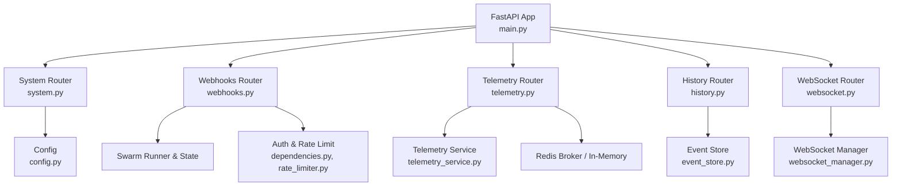
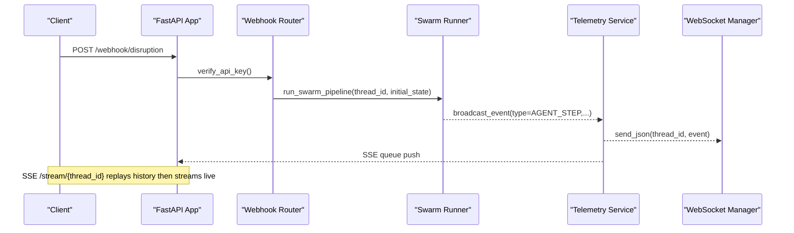
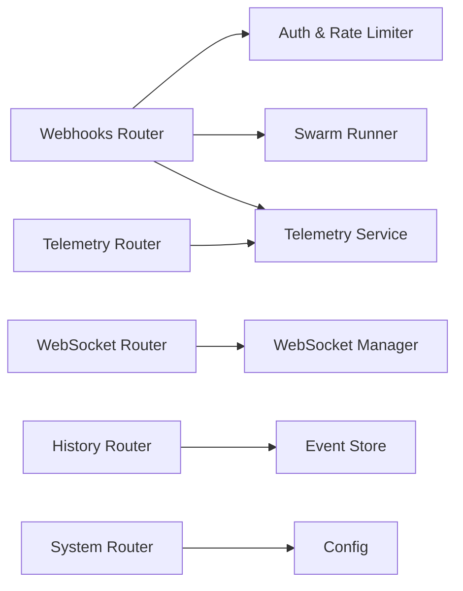

# API Reference

<cite>
**Referenced Files in This Document**
- [main.py](file://backend/main.py)
- [webhooks.py](file://backend/api/routers/webhooks.py)
- [system.py](file://backend/api/routers/system.py)
- [history.py](file://backend/api/routers/history.py)
- [telemetry.py](file://backend/api/routers/telemetry.py)
- [websocket.py](file://backend/api/routers/websocket.py)
- [dependencies.py](file://backend/api/dependencies.py)
- [api_models.py](file://backend/schemas/api_models.py)
- [rate_limiter.py](file://backend/auth/rate_limiter.py)
- [api_keys.py](file://backend/auth/api_keys.py)
- [config.py](file://backend/config.py)
- [event_store.py](file://backend/store/event_store.py)
- [telemetry_service.py](file://backend/services/telemetry_service.py)
- [websocket_manager.py](file://backend/services/websocket_manager.py)
</cite>

## Table of Contents
1. Introduction
2. Project Structure
3. Core Components
4. Architecture Overview
5. Detailed Component Analysis
6. Dependency Analysis
7. Performance Considerations
8. Troubleshooting Guide
9. Conclusion
10. Appendices

## Introduction
This document provides a comprehensive API reference for the SynapseAir platform, covering REST endpoints for disruption webhooks, system monitoring, historical data access, and telemetry streaming, as well as WebSocket-based real-time communication. It includes authentication methods, request/response schemas, error codes, rate limiting, versioning, and integration guidance.

SynapseAir exposes:
- Disruption ingestion and HITL consensus webhooks
- System health and status endpoints
- Historical disruption queries and analytics
- Server-Sent Events (SSE) telemetry stream and thread state inspection
- Bidirectional WebSocket for live telemetry and HITL decisions

The OpenAPI specification is auto-generated by FastAPI and available at /docs when running locally.

**Section sources**
- [main.py:40-71](file://backend/main.py#L40-L71)

## Project Structure
The backend is organized into routers (REST endpoints), services (business logic), auth (authentication and rate limiting), schemas (Pydantic models), and store (persistence). The application mounts routers under a single FastAPI app with CORS and tags for clear grouping.

**Diagram sources**
- [main.py:104-108](file://backend/main.py#L104-L108)
- [system.py:7-22](file://backend/api/routers/system.py#L7-L22)
- [webhooks.py:12-72](file://backend/api/routers/webhooks.py#L12-L72)
- [telemetry.py:9-46](file://backend/api/routers/telemetry.py#L9-L46)
- [history.py:16-57](file://backend/api/routers/history.py#L16-L57)
- [websocket.py:18-92](file://backend/api/routers/websocket.py#L18-L92)
- [telemetry_service.py:45-68](file://backend/services/telemetry_service.py#L45-L68)
- [websocket_manager.py:16-75](file://backend/services/websocket_manager.py#L16-L75)
- [event_store.py:47-98](file://backend/store/event_store.py#L47-L98)

**Section sources**
- [main.py:104-108](file://backend/main.py#L104-L108)

## Core Components
- Authentication: Supports legacy static key, JWT bearer tokens, and managed API keys via Authorization header. Scopes can be enforced per endpoint.
- Rate Limiting: Redis-backed sliding window limiter with per-category limits; falls back to in-memory if Redis is unavailable.
- Schemas: Pydantic models define request payloads for disruptions and HITL consensus.
- Telemetry: SSE stream replays history then streams live events; thread state inspection returns current LangGraph state snapshot.
- History: Paginated list, detail by thread_id, and aggregate statistics from SQLite event store.
- WebSockets: Bidirectional channel for real-time telemetry and HITL decisions with connection lifecycle management.

**Section sources**
- [dependencies.py:25-78](file://backend/api/dependencies.py#L25-L78)
- [rate_limiter.py:22-29](file://backend/auth/rate_limiter.py#L22-L29)
- [api_models.py:5-101](file://backend/schemas/api_models.py#L5-L101)
- [telemetry.py:11-71](file://backend/api/routers/telemetry.py#L11-L71)
- [history.py:19-73](file://backend/api/routers/history.py#L19-L73)
- [websocket.py:21-92](file://backend/api/routers/websocket.py#L21-L92)

## Architecture Overview
High-level flow for disruption handling and real-time updates:

**Diagram sources**
- [webhooks.py:14-72](file://backend/api/routers/webhooks.py#L14-L72)
- [telemetry_service.py:45-68](file://backend/services/telemetry_service.py#L45-L68)
- [websocket_manager.py:42-54](file://backend/services/websocket_manager.py#L42-L54)
- [telemetry.py:17-46](file://backend/api/routers/telemetry.py#L17-L46)

## Detailed Component Analysis

### Authentication and Authorization
- Header: Authorization
- Modes:
  - Legacy static key (SYNAPSE_API_SECRET)
  - JWT Bearer token
  - Managed API key via APIKeyManager
- Scope enforcement: verify_scope(required_scope)
- Development mode allows requests without key unless REQUIRE_AUTH is set or ENVIRONMENT is production.

Error responses:
- 401 Unauthorized: Missing or invalid API key
- 403 Forbidden: Required scope missing

Rate limiting:
- Categories: webhook, consensus, history, stream, system, default
- Headers on 429: Retry-After, X-RateLimit-Remaining, X-RateLimit-Limit

**Section sources**
- [dependencies.py:25-96](file://backend/api/dependencies.py#L25-L96)
- [rate_limiter.py:22-29](file://backend/auth/rate_limiter.py#L22-L29)
- [api_keys.py:32-73](file://backend/auth/api_keys.py#L32-L73)

### REST Endpoints

#### System Monitoring
- GET /health
  - Purpose: Quick health check
  - Response: { status, version }
- GET /api/system/status
  - Purpose: Full system status including provider configurations and integration states
  - Response: { status, deepseek, hermes, atlas_gds, n8n, timestamp }

**Section sources**
- [main.py:119-122](file://backend/main.py#L119-L122)
- [system.py:9-52](file://backend/api/routers/system.py#L9-L52)

#### Disruption Webhooks
- POST /webhook/disruption
  - Auth: verify_api_key
  - Request body: DisruptionPayload (see schema below)
  - Behavior: Validates payload, constructs initial swarm state, starts background swarm pipeline, returns thread_id and stream URL
  - Responses:
    - 200: { status: "PROCESSING", thread_id, stream_url, message }
    - 401: Missing or invalid API key
- POST /webhook/consensus
  - Auth: verify_api_key
  - Request body: ConsensusPayload
  - Behavior: Updates LangGraph state with hitl_status, broadcasts CONSENSUS_RECEIVED, resumes workflow if APPROVED, emits WORKFLOW_COMPLETE or WORKFLOW_ERROR
  - Responses:
    - 200: { status: "RESUMED" | "REJECTED", thread_id, action, message }
    - 401: Missing or invalid API key
    - 404: No active session for thread_id

Request Schema: DisruptionPayload
- Fields: raw_text, pnr, flight_number, airline, origin, destination, scheduled_departure, delay_minutes, reason, loyalty_tier, passenger_name, passenger_phone, n8n_webhook_url, thread_id
- Notes: Either structured fields or raw_text may be provided; defaults are applied where omitted.

Request Schema: ConsensusPayload
- Fields: thread_id (required), action (APPROVE|REJECT), selected_flight_id (optional), notes (optional)

**Section sources**
- [webhooks.py:14-184](file://backend/api/routers/webhooks.py#L14-L184)
- [api_models.py:5-101](file://backend/schemas/api_models.py#L5-L101)

#### Historical Data Access
- GET /api/history
  - Query params: limit (default 50), offset (default 0), airline (optional), loyalty_tier (optional), status (optional)
  - Response: { total, limit, offset, disruptions: [...] }
- GET /api/history/stats
  - Response: Aggregate analytics including totals, auto-approve/HITL rates, average resolution time, top routes
- GET /api/history/{thread_id}
  - Response: Full disruption record or 404 if not found

Data Source: SQLite disruptions table with indexes for performance.

**Section sources**
- [history.py:19-73](file://backend/api/routers/history.py#L19-L73)
- [event_store.py:242-335](file://backend/store/event_store.py#L242-L335)

#### Telemetry Streaming (SSE)
- GET /stream/{thread_id}
  - Purpose: Server-Sent Events stream for real-time agent activity
  - Behavior: Subscribes to thread queue, replays historical events, streams live events, sends keep-alive every 15s, unsubscribes on disconnect
  - Response: text/event-stream with JSON event payloads
- GET /threads/{thread_id}/state
  - Purpose: Inspect current LangGraph checkpointer state for a thread
  - Response: { thread_id, values, next, created_at } or 404 if not found

**Section sources**
- [telemetry.py:11-71](file://backend/api/routers/telemetry.py#L11-L71)
- [telemetry_service.py:45-68](file://backend/services/telemetry_service.py#L45-L68)

#### WebSocket API
- Endpoint: ws://{host}/ws/{thread_id}
- Connection Lifecycle:
  - Accept connection, send WS_CONNECTED
  - Replay historical events
  - Listen for client messages
  - On disconnect, clean up
- Client Messages:
  - PING → PONG
  - HITL_DECISION: { type: "HITL_DECISION", action: "APPROVE|REJECT", notes?: string }
- Server Messages:
  - WS_CONNECTED
  - All SSE telemetry events (replayed then live)
  - HITL_CONFIRMED
  - WS_ERROR
  - AGENT_STEP
  - WORKFLOW_COMPLETE
  - WORKFLOW_ERROR

**Section sources**
- [websocket.py:21-195](file://backend/api/routers/websocket.py#L21-L195)
- [websocket_manager.py:16-75](file://backend/services/websocket_manager.py#L16-L75)
- [telemetry_service.py:45-68](file://backend/services/telemetry_service.py#L45-L68)

### Data Models and Schemas
- DisruptionPayload: Structured or raw-text disruption event input
- ConsensusPayload: Passenger HITL decision input
- RawTextTestPayload: For testing AI parser with raw text
- PassengerChatPayload: For forwarding passenger chat to n8n assistant

These models enforce field types, defaults, and examples for consistent integrations.

**Section sources**
- [api_models.py:5-134](file://backend/schemas/api_models.py#L5-L134)

### Error Handling and Status Codes
Common HTTP status codes:
- 200 OK: Successful operation
- 401 Unauthorized: Missing or invalid API key
- 403 Forbidden: Missing required scope
- 404 Not Found: Thread or disruption not found
- 429 Too Many Requests: Rate limit exceeded (includes Retry-After and rate limit headers)

Error payloads include a detail message describing the issue.

**Section sources**
- [dependencies.py:25-96](file://backend/api/dependencies.py#L25-L96)
- [rate_limiter.py:62-99](file://backend/auth/rate_limiter.py#L62-L99)
- [webhooks.py:74-184](file://backend/api/routers/webhooks.py#L74-L184)
- [telemetry.py:48-71](file://backend/api/routers/telemetry.py#L48-L71)
- [history.py:60-73](file://backend/api/routers/history.py#L60-L73)

### Rate Limiting Details
Categories and default limits:
- webhook: 10 requests per 60 seconds
- consensus: 50 requests per 60 seconds
- history: 100 requests per 60 seconds
- stream: 30 requests per 60 seconds
- system: 60 requests per 60 seconds
- default: 120 requests per 60 seconds

Behavior:
- Uses Redis sorted-set sliding window when available; falls back to in-memory store
- Returns 429 with Retry-After and rate limit headers when exceeded

**Section sources**
- [rate_limiter.py:22-29](file://backend/auth/rate_limiter.py#L22-L29)
- [rate_limiter.py:62-99](file://backend/auth/rate_limiter.py#L62-L99)

### Versioning Policy
- Application version: 2.1.0 (as defined in FastAPI metadata)
- Health endpoint returns current version for clients to detect upgrades
- Backward compatibility is maintained within major versions; breaking changes will be announced via release notes

**Section sources**
- [main.py:40-71](file://backend/main.py#L40-L71)
- [main.py:119-122](file://backend/main.py#L119-L122)

## Dependency Analysis
Component relationships and coupling:
- Routers depend on dependencies (auth, rate limiting) and services (telemetry, websocket manager)
- Telemetry service bridges SSE and WebSocket channels, ensuring consistent event delivery
- History router depends on event_store for persistence and analytics
- Webhooks router orchestrates swarm execution and broadcasts events through telemetry service

**Diagram sources**
- [webhooks.py:14-72](file://backend/api/routers/webhooks.py#L14-L72)
- [telemetry.py:11-46](file://backend/api/routers/telemetry.py#L11-L46)
- [websocket.py:21-92](file://backend/api/routers/websocket.py#L21-L92)
- [history.py:19-73](file://backend/api/routers/history.py#L19-L73)
- [system.py:9-52](file://backend/api/routers/system.py#L9-L52)
- [telemetry_service.py:45-68](file://backend/services/telemetry_service.py#L45-L68)
- [websocket_manager.py:16-75](file://backend/services/websocket_manager.py#L16-L75)
- [event_store.py:47-98](file://backend/store/event_store.py#L47-L98)
- [config.py:29-116](file://backend/config.py#L29-L116)

**Section sources**
- [webhooks.py:14-72](file://backend/api/routers/webhooks.py#L14-L72)
- [telemetry.py:11-46](file://backend/api/routers/telemetry.py#L11-L46)
- [websocket.py:21-92](file://backend/api/routers/websocket.py#L21-L92)
- [history.py:19-73](file://backend/api/routers/history.py#L19-L73)
- [system.py:9-52](file://backend/api/routers/system.py#L9-L52)

## Performance Considerations
- SSE keep-alive ensures long-lived connections remain healthy
- Redis-backed pub/sub scales event distribution across multiple clients
- SQLite WAL mode improves concurrency for historical queries
- Rate limiting protects endpoints from overload; adjust categories based on workload
- Avoid excessive polling; prefer streaming for real-time updates

[No sources needed since this section provides general guidance]

## Troubleshooting Guide
Common issues and resolutions:
- 401 Unauthorized: Ensure Authorization header contains a valid key or JWT; verify environment settings
- 403 Forbidden: Check required scopes for the endpoint; ensure key has admin or specific scope
- 404 Not Found: Verify thread_id exists; confirm workflow was initiated and not expired
- 429 Too Many Requests: Respect Retry-After; reduce request frequency or increase limits appropriately
- WebSocket errors: Validate message format; handle WS_ERROR and reconnect on disconnect

Debugging tips:
- Use /api/history/stats to assess throughput and resolution times
- Inspect thread state via /threads/{thread_id}/state to diagnose stalled workflows
- Monitor SSE stream for AGENT_STEP and WORKFLOW_COMPLETE events

**Section sources**
- [dependencies.py:25-96](file://backend/api/dependencies.py#L25-L96)
- [rate_limiter.py:62-99](file://backend/auth/rate_limiter.py#L62-L99)
- [telemetry.py:48-71](file://backend/api/routers/telemetry.py#L48-L71)
- [history.py:50-73](file://backend/api/routers/history.py#L50-L73)

## Conclusion
SynapseAir provides a robust, secure, and scalable API surface for disruption recovery and real-time observability. By combining authenticated webhooks, persistent history, streaming telemetry, and bidirectional WebSocket communication, it enables seamless integrations for airlines, OTAs, and ground handlers. Follow the authentication, rate limiting, and error handling guidelines to build reliable clients.

[No sources needed since this section summarizes without analyzing specific files]

## Appendices

### OpenAPI Specification
- Auto-generated documentation available at /docs when running the backend
- Tags: system, webhooks, telemetry, history, websocket, tests
- Contact and license metadata included in app definition

**Section sources**
- [main.py:40-71](file://backend/main.py#L40-L71)

### Integration Examples and Best Practices
- Disruption ingestion: Send structured payload or raw_text; capture thread_id and connect to /stream/{thread_id}
- HITL consensus: Submit APPROVE/REJECT via webhook or WebSocket; monitor for WORKFLOW_COMPLETE
- Real-time updates: Prefer WebSocket for interactive dashboards; use SSE for lightweight consumers
- Rate limiting: Implement exponential backoff on 429; respect Retry-After

[No sources needed since this section provides general guidance]