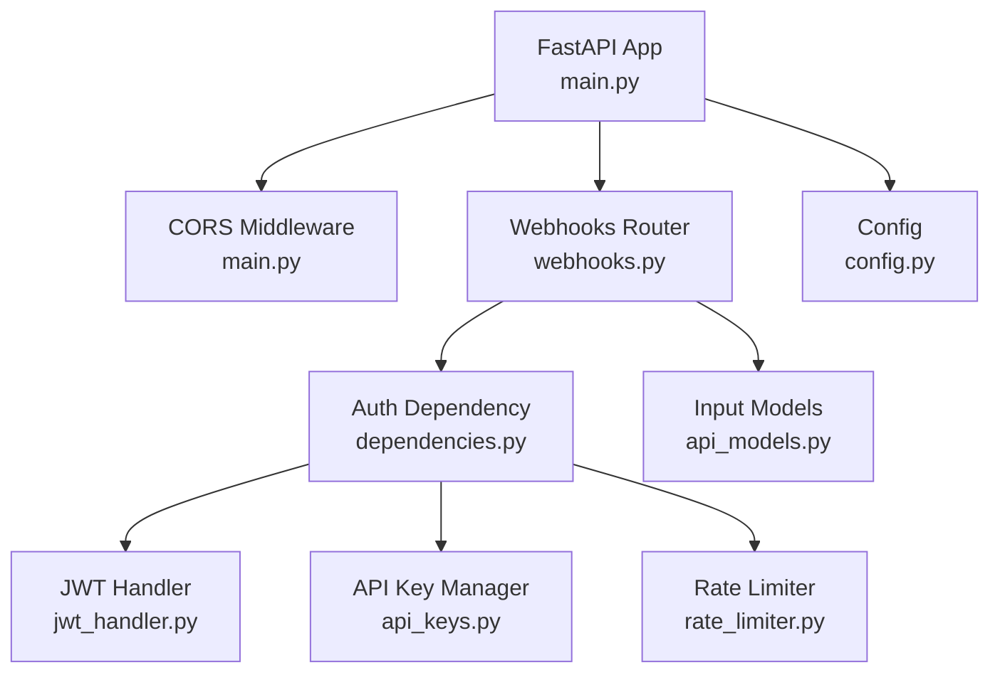
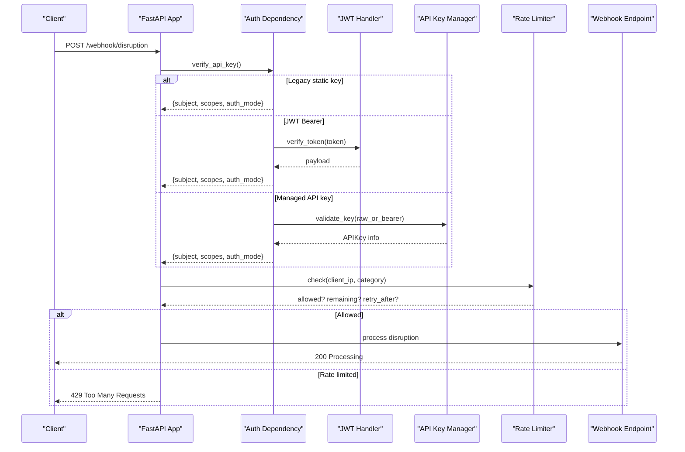
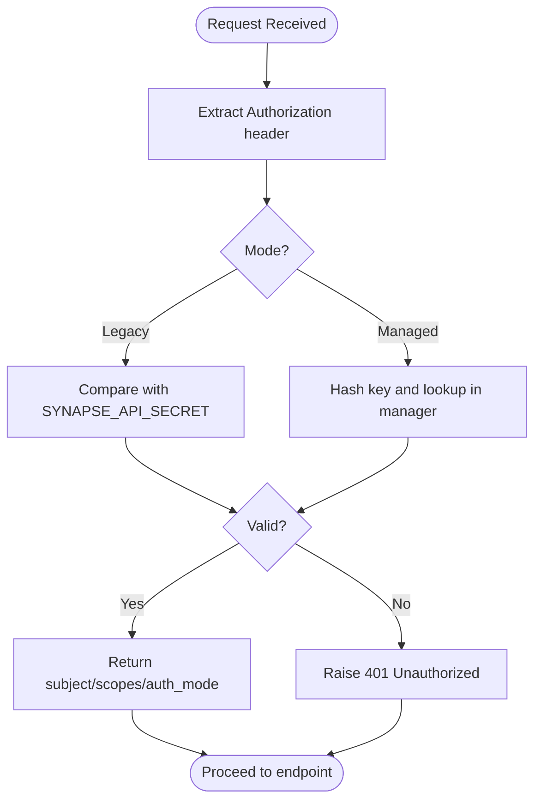
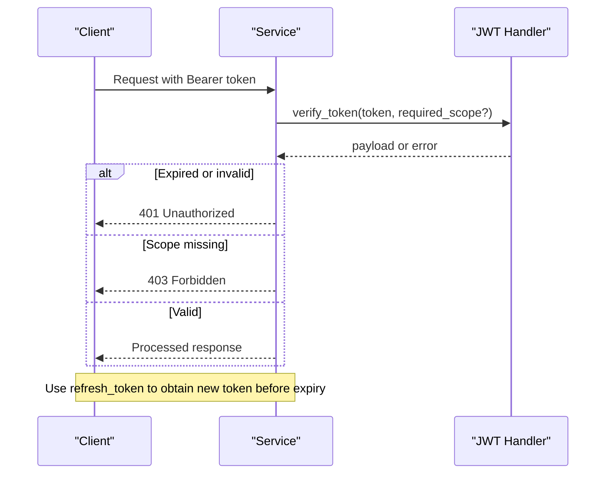
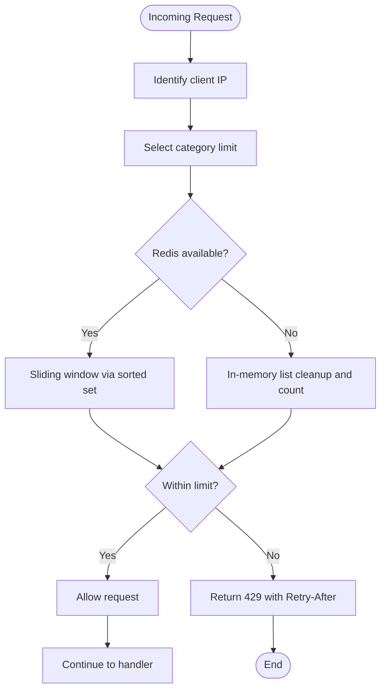
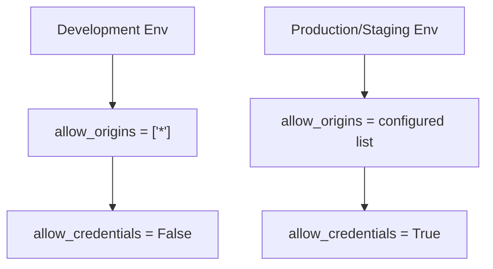
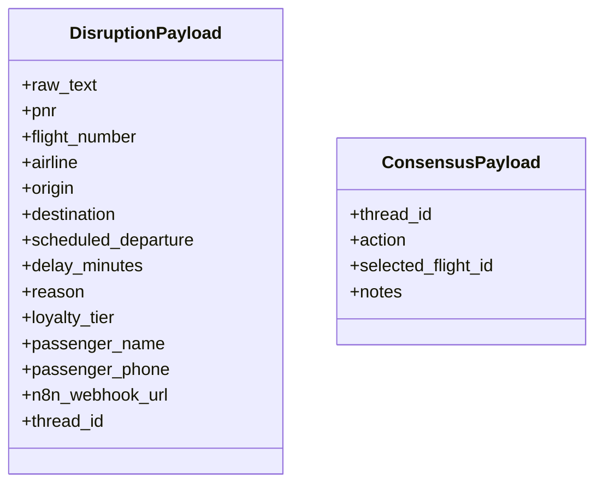
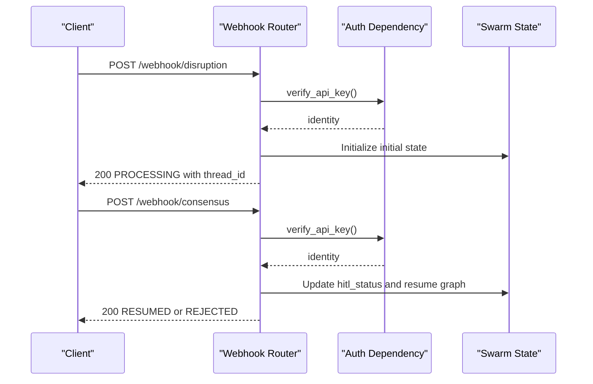
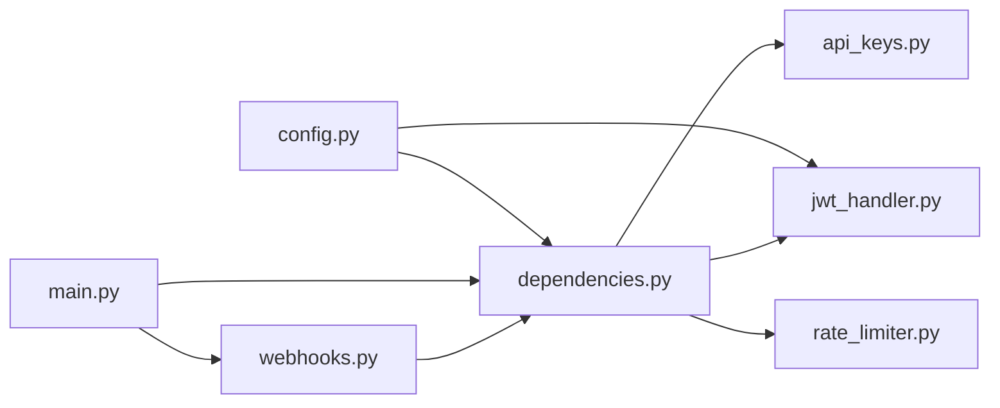

# Authentication & Security

<cite>
**Referenced Files in This Document**
- [main.py](file://travel-recovery-os/backend/main.py)
- [dependencies.py](file://travel-recovery-os/backend/api/dependencies.py)
- [api_keys.py](file://travel-recovery-os/backend/auth/api_keys.py)
- [jwt_handler.py](file://travel-recovery-os/backend/auth/jwt_handler.py)
- [rate_limiter.py](file://travel-recovery-os/backend/auth/rate_limiter.py)
- [webhooks.py](file://travel-recovery-os/backend/api/routers/webhooks.py)
- [config.py](file://travel-recovery-os/backend/config.py)
- [api_models.py](file://travel-recovery-os/backend/schemas/api_models.py)
</cite>

## Table of Contents
1. [Introduction](#introduction)
2. [Project Structure](#project-structure)
3. [Core Components](#core-components)
4. [Architecture Overview](#architecture-overview)
5. [Detailed Component Analysis](#detailed-component-analysis)
6. [Dependency Analysis](#dependency-analysis)
7. [Performance Considerations](#performance-considerations)
8. [Troubleshooting Guide](#troubleshooting-guide)
9. [Conclusion](#conclusion)
10. [Appendices](#appendices)

## Introduction
This document explains the authentication and security model for the SynapseAir API, focusing on:
- API key-based authentication for webhook endpoints
- JWT token handling for authenticated sessions (including refresh flows)
- Rate limiting mechanisms to prevent abuse
- CORS configuration for cross-origin requests
- Input validation and sanitization via Pydantic models
- Security best practices for production deployments

The system supports three authentication modes in a prioritized chain: legacy static key, JWT Bearer tokens, and managed API keys with scopes. Webhook endpoints require authentication and are protected by rate limits.

## Project Structure
Authentication and security are implemented across dedicated modules:
- Application entrypoint configures CORS and includes routers
- API dependencies implement the auth chain and rate limiting
- Auth modules provide API key management, JWT handling, and rate limiting
- Routers define webhook endpoints that depend on authentication
- Schemas enforce input validation for payloads
- Configuration centralizes secrets and environment-specific settings

**Diagram sources**
- [main.py:40-99](file://travel-recovery-os/backend/main.py#L40-L99)
- [webhooks.py:12-23](file://travel-recovery-os/backend/api/routers/webhooks.py#L12-L23)
- [dependencies.py:25-78](file://travel-recovery-os/backend/api/dependencies.py#L25-L78)
- [jwt_handler.py:20-62](file://travel-recovery-os/backend/auth/jwt_handler.py#L20-L62)
- [api_keys.py:32-87](file://travel-recovery-os/backend/auth/api_keys.py#L32-L87)
- [rate_limiter.py:41-99](file://travel-recovery-os/backend/auth/rate_limiter.py#L41-L99)
- [api_models.py:5-101](file://travel-recovery-os/backend/schemas/api_models.py#L5-L101)
- [config.py:29-115](file://travel-recovery-os/backend/config.py#L29-L115)

**Section sources**
- [main.py:40-108](file://travel-recovery-os/backend/main.py#L40-L108)
- [webhooks.py:12-23](file://travel-recovery-os/backend/api/routers/webhooks.py#L12-L23)
- [dependencies.py:25-78](file://travel-recovery-os/backend/api/dependencies.py#L25-L78)
- [config.py:29-115](file://travel-recovery-os/backend/config.py#L29-L115)

## Core Components
- API Key Management: In-memory manager supporting creation, validation, scoping, and revocation. Keys are hashed for storage; default key can be loaded from environment.
- JWT Handling: Token creation, verification, scope checks, and refresh flow using HS256 algorithm and configurable expiration.
- Rate Limiting: Sliding window limiter with Redis or in-memory backend; per-category limits for webhooks, consensus, history, stream, system, and default.
- Auth Dependencies: Unified dependency that verifies requests via legacy key, JWT, or managed API key; enforces scopes and returns identity context.
- CORS: Configurable allowed origins with environment-aware behavior; credentials support toggled based on environment.
- Input Validation: Pydantic models validate webhook payloads, ensuring required fields and types.

**Section sources**
- [api_keys.py:9-87](file://travel-recovery-os/backend/auth/api_keys.py#L9-L87)
- [jwt_handler.py:20-62](file://travel-recovery-os/backend/auth/jwt_handler.py#L20-L62)
- [rate_limiter.py:15-99](file://travel-recovery-os/backend/auth/rate_limiter.py#L15-L99)
- [dependencies.py:25-129](file://travel-recovery-os/backend/api/dependencies.py#L25-L129)
- [main.py:74-99](file://travel-recovery-os/backend/main.py#L74-L99)
- [api_models.py:5-101](file://travel-recovery-os/backend/schemas/api_models.py#L5-L101)

## Architecture Overview
The request lifecycle for webhook endpoints integrates authentication, authorization, and rate limiting before processing business logic.

**Diagram sources**
- [dependencies.py:25-78](file://travel-recovery-os/backend/api/dependencies.py#L25-L78)
- [jwt_handler.py:20-62](file://travel-recovery-os/backend/auth/jwt_handler.py#L20-L62)
- [api_keys.py:65-87](file://travel-recovery-os/backend/auth/api_keys.py#L65-L87)
- [rate_limiter.py:62-99](file://travel-recovery-os/backend/auth/rate_limiter.py#L62-L99)
- [webhooks.py:14-72](file://travel-recovery-os/backend/api/routers/webhooks.py#L14-L72)

## Detailed Component Analysis

### API Key-Based Authentication
- Supported modes:
  - Legacy static key match against configured secret
  - Managed API keys created and validated through APIKeyManager
- Header usage:
  - Authorization header accepts either raw key or "Bearer <key>"
- Scopes:
  - admin, read-only, webhook-only, history, stream
  - admin grants access to all scopes
- Lifecycle:
  - Create keys with optional expiry
  - Validate keys and update last-used timestamp
  - Revoke keys by ID
  - List and retrieve key metadata

**Diagram sources**
- [dependencies.py:25-78](file://travel-recovery-os/backend/api/dependencies.py#L25-L78)
- [api_keys.py:32-87](file://travel-recovery-os/backend/auth/api_keys.py#L32-L87)

**Section sources**
- [dependencies.py:25-78](file://travel-recovery-os/backend/api/dependencies.py#L25-L78)
- [api_keys.py:9-87](file://travel-recovery-os/backend/auth/api_keys.py#L9-L87)

### JWT Token Handling
- Creation:
  - Access tokens with subject, issued-at, expiration, type, and optional scopes
  - Long-lived API tokens supported via create_api_token
- Verification:
  - Decode and validate signature and expiration
  - Enforce required scopes if provided
- Refresh:
  - Verify original token and issue new token preserving non-temporal claims
- Configuration:
  - Algorithm and secret loaded from environment
  - Expiration minutes configurable

**Diagram sources**
- [jwt_handler.py:20-62](file://travel-recovery-os/backend/auth/jwt_handler.py#L20-L62)
- [dependencies.py:48-62](file://travel-recovery-os/backend/api/dependencies.py#L48-L62)

**Section sources**
- [jwt_handler.py:20-62](file://travel-recovery-os/backend/auth/jwt_handler.py#L20-L62)
- [dependencies.py:48-62](file://travel-recovery-os/backend/api/dependencies.py#L48-L62)

### Rate Limiting Mechanisms
- Categories:
  - webhook, consensus, history, stream, system, default
- Backends:
  - Redis sliding window sorted set when available
  - In-memory fallback otherwise
- Behavior:
  - Per client IP tracking
  - Returns remaining count and retry-after seconds when exceeded
  - Raises HTTP 429 with standard headers

**Diagram sources**
- [rate_limiter.py:41-99](file://travel-recovery-os/backend/auth/rate_limiter.py#L41-L99)
- [dependencies.py:103-129](file://travel-recovery-os/backend/api/dependencies.py#L103-L129)

**Section sources**
- [rate_limiter.py:15-124](file://travel-recovery-os/backend/auth/rate_limiter.py#L15-L124)
- [dependencies.py:103-129](file://travel-recovery-os/backend/api/dependencies.py#L103-L129)

### CORS Configuration
- Allowed origins:
  - Defaults include common local development ports
  - Optional FRONTEND_URL appended at runtime
- Behavior:
  - Development mode allows all origins for convenience
  - Production uses explicit origin list with credentials enabled
- Headers and methods:
  - Allows GET, POST, PUT, DELETE, OPTIONS
  - Allows all headers for flexibility

**Diagram sources**
- [main.py:74-99](file://travel-recovery-os/backend/main.py#L74-L99)

**Section sources**
- [main.py:74-99](file://travel-recovery-os/backend/main.py#L74-L99)

### Input Validation and Sanitization
- Webhook payloads validated via Pydantic models:
  - DisruptionPayload supports structured fields or raw_text for AI parsing
  - ConsensusPayload enforces thread_id and action
- Benefits:
  - Type safety and clear field descriptions
  - Default values reduce client burden
  - Examples aid integration testing

**Diagram sources**
- [api_models.py:5-101](file://travel-recovery-os/backend/schemas/api_models.py#L5-L101)

**Section sources**
- [api_models.py:5-101](file://travel-recovery-os/backend/schemas/api_models.py#L5-L101)

### Webhook Endpoints and Authentication
- Endpoints:
  - POST /webhook/disruption: Ingest disruption events and start recovery swarm
  - POST /webhook/consensus: Submit passenger HITL decisions to resume or stop workflow
- Authentication:
  - Both endpoints use verify_api_key dependency
- Responses:
  - 200 on success with status and thread_id
  - 401 for missing or invalid API key
  - 404 for consensus when no active session exists

**Diagram sources**
- [webhooks.py:14-185](file://travel-recovery-os/backend/api/routers/webhooks.py#L14-L185)
- [dependencies.py:25-78](file://travel-recovery-os/backend/api/dependencies.py#L25-L78)

**Section sources**
- [webhooks.py:14-185](file://travel-recovery-os/backend/api/routers/webhooks.py#L14-L185)
- [dependencies.py:25-78](file://travel-recovery-os/backend/api/dependencies.py#L25-L78)

## Dependency Analysis
- Coupling:
  - Webhook router depends on auth dependency for identity and scope enforcement
  - Auth dependency composes JWT handler and API key manager
  - Rate limiter is invoked by auth dependency to protect endpoints
- External integrations:
  - Redis used optionally for distributed rate limiting
  - Environment variables drive secrets and algorithms
- Cohesion:
  - Each module has a focused responsibility (auth, rate limiting, CORS, schemas)

**Diagram sources**
- [webhooks.py:1-23](file://travel-recovery-os/backend/api/routers/webhooks.py#L1-L23)
- [dependencies.py:1-129](file://travel-recovery-os/backend/api/dependencies.py#L1-L129)
- [jwt_handler.py:1-62](file://travel-recovery-os/backend/auth/jwt_handler.py#L1-L62)
- [api_keys.py:1-98](file://travel-recovery-os/backend/auth/api_keys.py#L1-L98)
- [rate_limiter.py:1-124](file://travel-recovery-os/backend/auth/rate_limiter.py#L1-L124)
- [main.py:1-108](file://travel-recovery-os/backend/main.py#L1-L108)
- [config.py:1-116](file://travel-recovery-os/backend/config.py#L1-L116)

**Section sources**
- [dependencies.py:1-129](file://travel-recovery-os/backend/api/dependencies.py#L1-L129)
- [main.py:1-108](file://travel-recovery-os/backend/main.py#L1-L108)
- [config.py:1-116](file://travel-recovery-os/backend/config.py#L1-L116)

## Performance Considerations
- Prefer Redis-backed rate limiting in production for horizontal scaling
- Keep JWT expiration reasonable to balance security and user experience
- Avoid overly broad CORS allowlists in production; specify exact origins
- Validate inputs early to fail fast and reduce downstream processing costs
- Monitor rate limit hits and adjust categories/limits based on traffic patterns

[No sources needed since this section provides general guidance]

## Troubleshooting Guide
Common issues and resolutions:
- Missing or invalid API key:
  - Ensure Authorization header contains a valid key or Bearer token
  - Verify REQUIRE_AUTH setting and environment mode
- JWT errors:
  - Confirm python-jose is installed and SECRET_KEY/ALGORITHM configured
  - Check token expiration and scopes
- Rate limit exceeded:
  - Inspect Retry-After header and back off accordingly
  - Adjust limits per category if legitimate traffic spikes occur
- CORS failures:
  - Add frontend URL to ALLOWED_ORIGINS or configure FRONTEND_URL env var
  - Ensure credentials are allowed only for trusted origins

**Section sources**
- [dependencies.py:25-78](file://travel-recovery-os/backend/api/dependencies.py#L25-L78)
- [jwt_handler.py:20-62](file://travel-recovery-os/backend/auth/jwt_handler.py#L20-L62)
- [rate_limiter.py:62-99](file://travel-recovery-os/backend/auth/rate_limiter.py#L62-L99)
- [main.py:74-99](file://travel-recovery-os/backend/main.py#L74-L99)

## Conclusion
SynapseAir’s authentication and security stack combines flexible API key and JWT support, robust rate limiting, strict input validation, and configurable CORS. For production, ensure strong secrets, explicit CORS origins, appropriate rate limits, and monitoring of auth and rate-limit metrics to maintain secure and reliable operations.

[No sources needed since this section summarizes without analyzing specific files]

## Appendices

### API Key Generation and Usage
- Generate a managed API key via APIKeyManager.create_key with name, optional scopes, and optional expiry
- Send requests with Authorization header containing the raw key or "Bearer <key>"
- Use scopes to restrict access; admin grants full access

**Section sources**
- [api_keys.py:54-63](file://travel-recovery-os/backend/auth/api_keys.py#L54-L63)
- [dependencies.py:25-78](file://travel-recovery-os/backend/api/dependencies.py#L25-L78)

### JWT Token Refresh Flow
- Call refresh_token with a valid token to obtain a new token preserving non-temporal claims
- Use the refreshed token for subsequent requests until it expires again

**Section sources**
- [jwt_handler.py:58-62](file://travel-recovery-os/backend/auth/jwt_handler.py#L58-L62)

### Rate Limit Response Codes and Headers
- On exceeding limits, responses include:
  - Status code: 429 Too Many Requests
  - Headers: Retry-After, X-RateLimit-Remaining, X-RateLimit-Limit

**Section sources**
- [dependencies.py:103-129](file://travel-recovery-os/backend/api/dependencies.py#L103-L129)
- [rate_limiter.py:62-99](file://travel-recovery-os/backend/auth/rate_limiter.py#L62-L99)

### Security Best Practices for Production
- Set strong SYNAPSE_API_SECRET and JWT_SECRET_KEY
- Configure JWT_ALGORITHM and JWT_EXPIRE_MINUTES appropriately
- Enable REQUIRE_AUTH in production environments
- Restrict CORS to known origins and enable credentials selectively
- Use Redis for distributed rate limiting and monitor usage
- Validate and sanitize all inputs using Pydantic models
- Log securely and avoid exposing sensitive data in logs

**Section sources**
- [config.py:29-115](file://travel-recovery-os/backend/config.py#L29-L115)
- [main.py:74-99](file://travel-recovery-os/backend/main.py#L74-L99)
- [rate_limiter.py:41-99](file://travel-recovery-os/backend/auth/rate_limiter.py#L41-L99)
- [api_models.py:5-101](file://travel-recovery-os/backend/schemas/api_models.py#L5-L101)