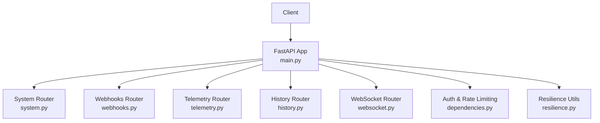
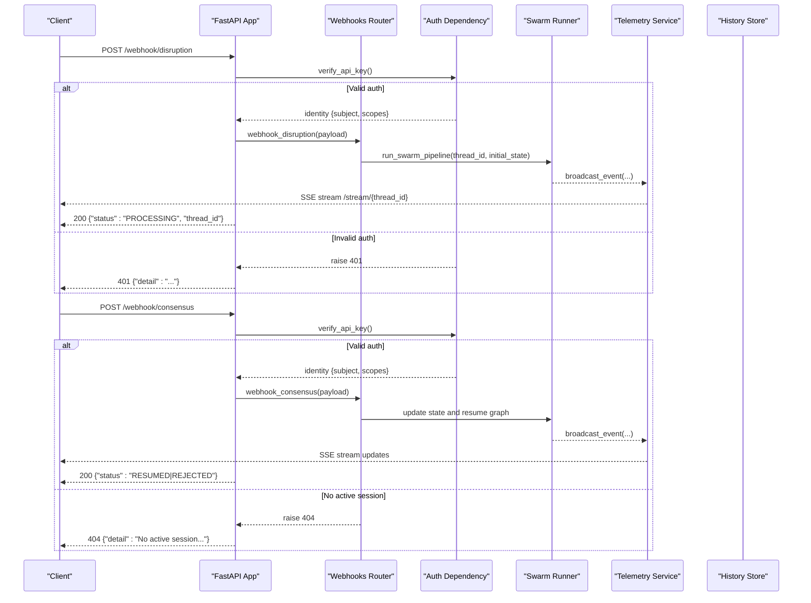
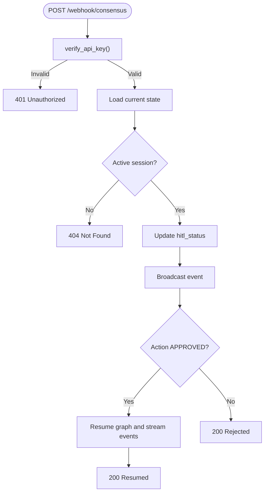
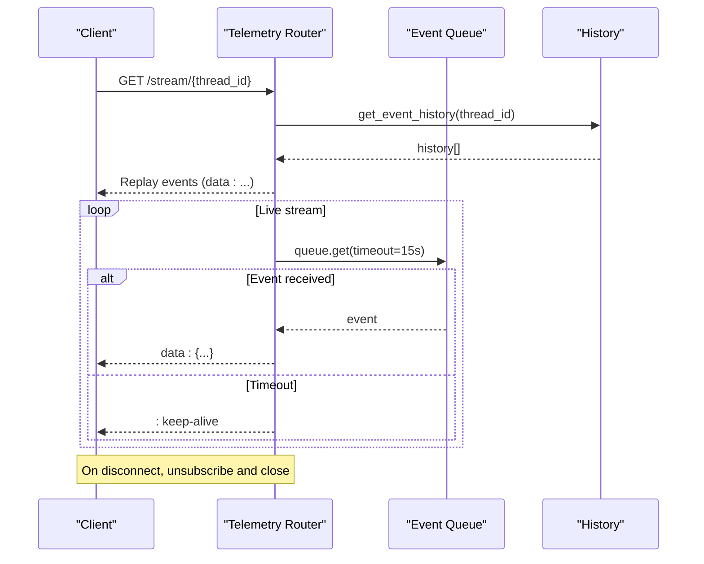
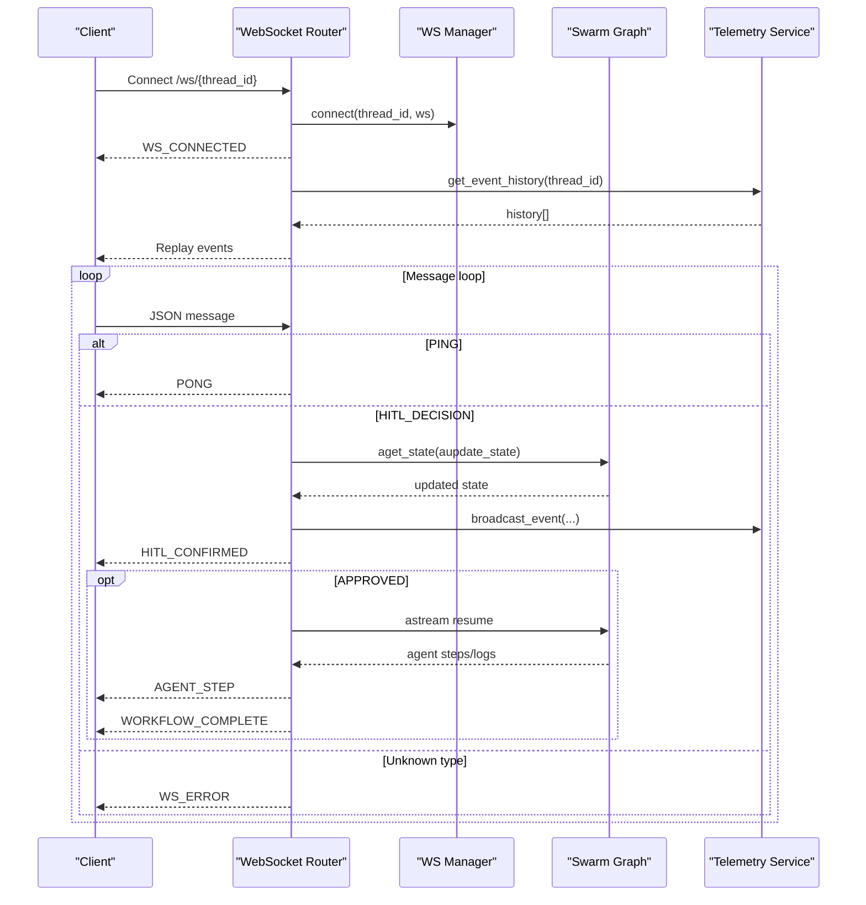
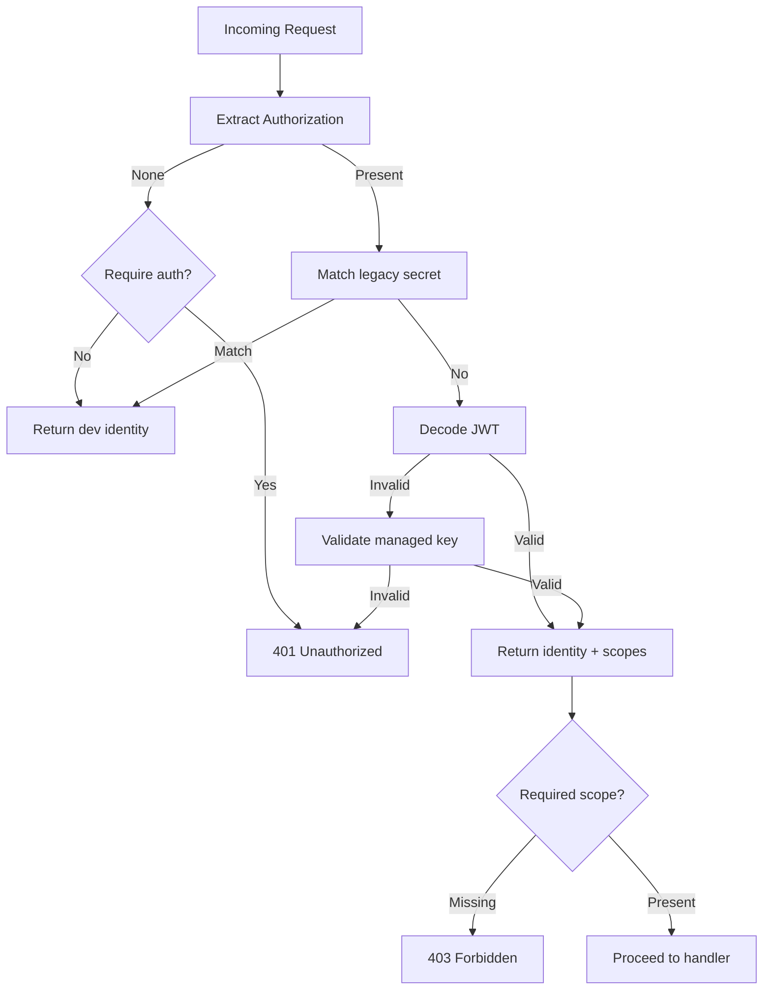
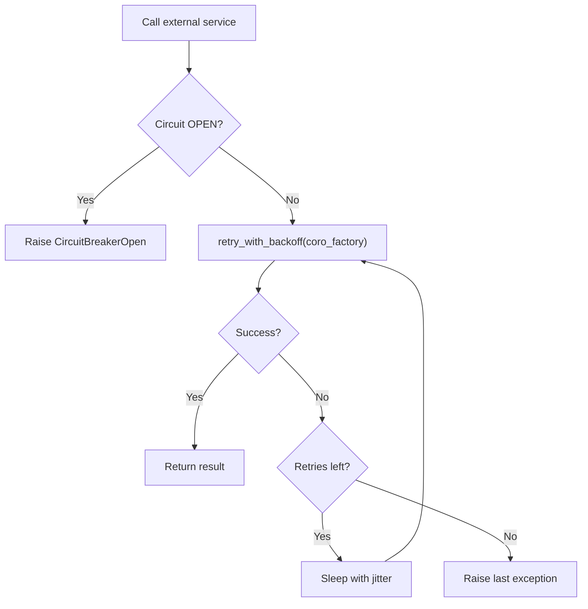
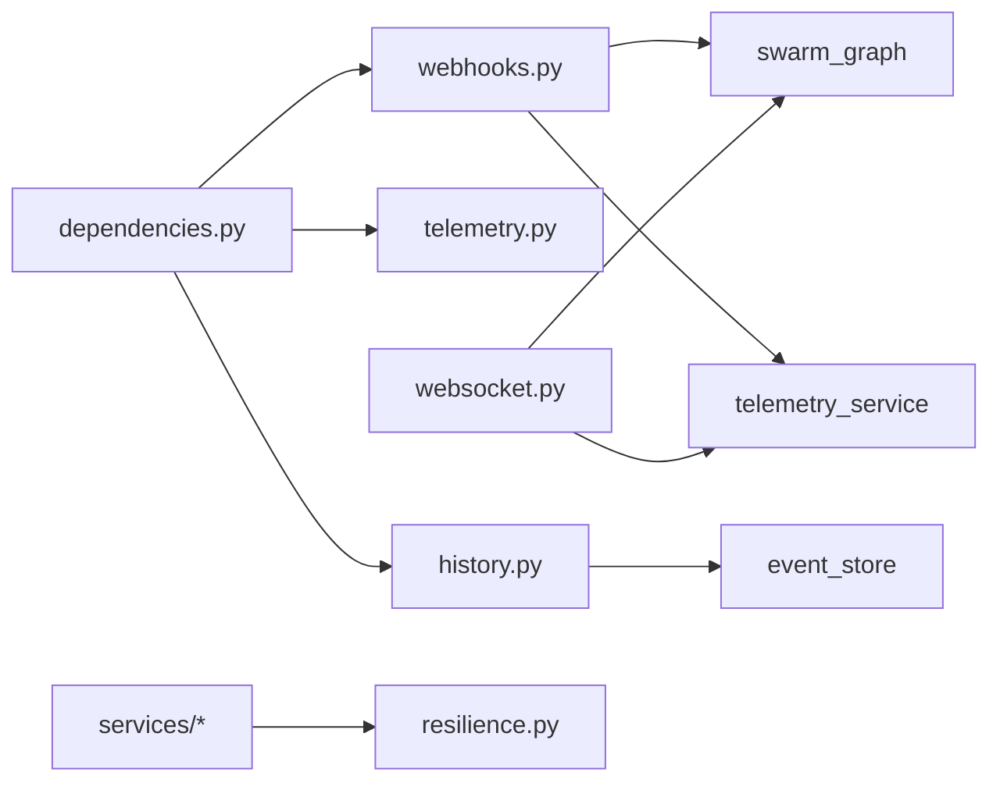

# Error Handling & Status Codes

<cite>
**Referenced Files in This Document**
- [main.py](file://backend/main.py)
- [system.py](file://backend/api/routers/system.py)
- [webhooks.py](file://backend/api/routers/webhooks.py)
- [telemetry.py](file://backend/api/routers/telemetry.py)
- [history.py](file://backend/api/routers/history.py)
- [websocket.py](file://backend/api/routers/websocket.py)
- [dependencies.py](file://backend/api/dependencies.py)
- [api_models.py](file://backend/schemas/api_models.py)
- [resilience.py](file://backend/middleware/resilience.py)
</cite>

## Table of Contents
1. [Introduction](#introduction)
2. [Project Structure](#project-structure)
3. [Core Components](#core-components)
4. [Architecture Overview](#architecture-overview)
5. [Detailed Component Analysis](#detailed-component-analysis)
6. [Dependency Analysis](#dependency-analysis)
7. [Performance Considerations](#performance-considerations)
8. [Troubleshooting Guide](#troubleshooting-guide)
9. [Conclusion](#conclusion)

## Introduction
This document provides comprehensive error handling guidance for all API endpoints in the SynapseAir backend. It covers standard HTTP status codes, custom error response formats, exception handling patterns, retry strategies for transient failures, and debugging techniques. It also includes examples of common error scenarios such as invalid payloads, authentication failures, service unavailability, and timeouts, along with best practices for implementing robust error handling in client applications.

## Project Structure
The backend is a FastAPI application that exposes several routers: system, webhooks, telemetry, history, websocket, and tests (non-production). Authentication and rate limiting are centralized via dependencies. Resilience utilities provide retry and circuit breaker patterns for external calls.

**Diagram sources**
- [main.py:104-113](file://backend/main.py#L104-L113)
- [system.py:7-53](file://backend/api/routers/system.py#L7-L53)
- [webhooks.py:12-185](file://backend/api/routers/webhooks.py#L12-L185)
- [telemetry.py:9-72](file://backend/api/routers/telemetry.py#L9-L72)
- [history.py:16-74](file://backend/api/routers/history.py#L16-L74)
- [websocket.py:18-195](file://backend/api/routers/websocket.py#L18-L195)
- [dependencies.py:25-130](file://backend/api/dependencies.py#L25-L130)
- [resilience.py:25-244](file://backend/middleware/resilience.py#L25-L244)

**Section sources**
- [main.py:104-113](file://backend/main.py#L104-L113)

## Core Components
- Authentication and authorization: Centralized dependency verifies API keys, JWT tokens, or managed keys and enforces scopes. Missing or invalid credentials result in 401; insufficient scope results in 403.
- Validation: Pydantic models define request schemas. Invalid payloads trigger automatic validation errors from FastAPI.
- Streaming and real-time: SSE and WebSocket endpoints handle long-lived connections with keep-alive and error signaling.
- History and state: Endpoints return 404 when resources are not found.
- Resilience: Retry with exponential backoff and circuit breakers protect against transient failures.

Key behaviors to know:
- 401 Unauthorized: Missing or invalid API key/JWT.
- 403 Forbidden: Insufficient scopes.
- 404 Not Found: Thread/state/resource not found.
- 429 Too Many Requests: Rate limit exceeded with Retry-After header.
- 422 Unprocessable Entity: Validation errors from Pydantic (FastAPI default).
- 5xx Server Errors: Internal exceptions or downstream failures; resilience utilities help mitigate transient issues.

**Section sources**
- [dependencies.py:25-130](file://backend/api/dependencies.py#L25-L130)
- [api_models.py:5-134](file://backend/schemas/api_models.py#L5-L134)
- [telemetry.py:17-72](file://backend/api/routers/telemetry.py#L17-L72)
- [websocket.py:21-195](file://backend/api/routers/websocket.py#L21-L195)
- [history.py:19-74](file://backend/api/routers/history.py#L19-L74)
- [resilience.py:25-244](file://backend/middleware/resilience.py#L25-L244)

## Architecture Overview
End-to-end flow for disruption ingestion and HITL decision handling, including error paths and streaming responses.

**Diagram sources**
- [webhooks.py:14-185](file://backend/api/routers/webhooks.py#L14-L185)
- [dependencies.py:25-78](file://backend/api/dependencies.py#L25-L78)
- [telemetry.py:17-46](file://backend/api/routers/telemetry.py#L17-L46)

**Section sources**
- [webhooks.py:14-185](file://backend/api/routers/webhooks.py#L14-L185)
- [dependencies.py:25-78](file://backend/api/dependencies.py#L25-L78)
- [telemetry.py:17-46](file://backend/api/routers/telemetry.py#L17-L46)

## Detailed Component Analysis

### System Endpoints
- GET /health (app-level): Returns a simple health object.
- GET /api/system/status: Returns detailed provider statuses.

Error behavior:
- These endpoints do not explicitly raise HTTPException; they return 200 on success. If underlying configuration fails unexpectedly, FastAPI will convert unhandled exceptions into 500 responses.

**Section sources**
- [main.py:119-122](file://backend/main.py#L119-L122)
- [system.py:9-53](file://backend/api/routers/system.py#L9-L53)

### Webhooks Endpoints
- POST /webhook/disruption
  - Auth: Requires valid API key/JWT/managed key via dependency.
  - Success: 200 with processing status and thread_id.
  - Auth failure: 401 from dependency.
  - Validation failure: 422 from Pydantic if payload is invalid.
  - Background processing: Swarm runs asynchronously; errors during processing emit telemetry events rather than failing the request.

- POST /webhook/consensus
  - Auth: Same as above.
  - Success: 200 with RESUMED or REJECTED status.
  - No active session: 404 with descriptive detail.
  - Validation failure: 422.

**Diagram sources**
- [webhooks.py:74-185](file://backend/api/routers/webhooks.py#L74-L185)
- [dependencies.py:25-78](file://backend/api/dependencies.py#L25-L78)

**Section sources**
- [webhooks.py:14-185](file://backend/api/routers/webhooks.py#L14-L185)
- [api_models.py:5-102](file://backend/schemas/api_models.py#L5-L102)
- [dependencies.py:25-78](file://backend/api/dependencies.py#L25-L78)

### Telemetry Endpoints
- GET /stream/{thread_id}: SSE stream with keep-alive every 15 seconds.
  - On disconnect: gracefully unsubscribes and ends stream.
  - Timeout handling: Emits keep-alive messages to maintain connection.
  - Errors: Any unexpected exceptions will terminate the stream; clients should reconnect.

- GET /threads/{thread_id}/state: Returns thread state snapshot.
  - Not found: 404 with descriptive detail.

**Diagram sources**
- [telemetry.py:17-46](file://backend/api/routers/telemetry.py#L17-L46)

**Section sources**
- [telemetry.py:17-72](file://backend/api/routers/telemetry.py#L17-L72)

### History Endpoints
- GET /api/history: Paginated list with optional filters.
- GET /api/history/stats: Aggregated analytics.
- GET /api/history/{thread_id}: Detail by thread_id.
  - Not found: 404 with descriptive detail.

**Section sources**
- [history.py:19-74](file://backend/api/routers/history.py#L19-L74)

### WebSocket Endpoint
- WS /ws/{thread_id}: Bidirectional communication for telemetry and HITL decisions.
  - Connection: Sends WS_CONNECTED and replays historical events.
  - Messages: PING/PONG, HITL_DECISION. Unknown types produce WS_ERROR.
  - Errors: JSON decode errors produce WS_ERROR; other exceptions send WS_ERROR with message.
  - Disconnection: Cleanly disconnects and removes client.

**Diagram sources**
- [websocket.py:21-195](file://backend/api/routers/websocket.py#L21-L195)

**Section sources**
- [websocket.py:21-195](file://backend/api/routers/websocket.py#L21-L195)

### Authentication and Authorization
- verify_api_key supports three modes: legacy static key, JWT token, managed API key.
- Missing or invalid credentials: 401.
- Insufficient scope: 403.
- Rate limiting: 429 with Retry-After and rate limit headers.

**Diagram sources**
- [dependencies.py:25-130](file://backend/api/dependencies.py#L25-L130)

**Section sources**
- [dependencies.py:25-130](file://backend/api/dependencies.py#L25-L130)

### Request Validation and Payloads
- Pydantic models define required fields and defaults for disruption and consensus payloads.
- Validation errors return 422 with details about the specific field(s) that failed validation.

Common validation scenarios:
- Missing required fields in ConsensusPayload (e.g., thread_id, action).
- Invalid types or out-of-range values.

**Section sources**
- [api_models.py:5-134](file://backend/schemas/api_models.py#L5-L134)

### Resilience Patterns
- Retry with exponential backoff: Wraps async coroutines with configurable retries, jitter, and logging.
- Circuit breaker: Protects downstream services with CLOSED/OPEN/HALF_OPEN states and cooldowns.

Usage guidance:
- Wrap external LLM/GDS/webhook calls with retry_with_backoff for transient network errors.
- Use CircuitBreaker around critical integrations to fail fast and recover automatically.

**Diagram sources**
- [resilience.py:25-244](file://backend/middleware/resilience.py#L25-L244)

**Section sources**
- [resilience.py:25-244](file://backend/middleware/resilience.py#L25-L244)

## Dependency Analysis
- Routers depend on dependencies for auth and rate limiting.
- Webhooks and WebSocket rely on swarm_graph and telemetry_service for state updates and broadcasting.
- History depends on event_store for persistence and queries.
- Resilience utilities are available for protecting external calls used by services invoked by routers.

**Diagram sources**
- [dependencies.py:25-130](file://backend/api/dependencies.py#L25-L130)
- [webhooks.py:14-185](file://backend/api/routers/webhooks.py#L14-L185)
- [telemetry.py:17-72](file://backend/api/routers/telemetry.py#L17-L72)
- [history.py:19-74](file://backend/api/routers/history.py#L19-L74)
- [websocket.py:21-195](file://backend/api/routers/websocket.py#L21-L195)
- [resilience.py:25-244](file://backend/middleware/resilience.py#L25-L244)

**Section sources**
- [webhooks.py:14-185](file://backend/api/routers/webhooks.py#L14-L185)
- [telemetry.py:17-72](file://backend/api/routers/telemetry.py#L17-L72)
- [history.py:19-74](file://backend/api/routers/history.py#L19-L74)
- [websocket.py:21-195](file://backend/api/routers/websocket.py#L21-L195)
- [dependencies.py:25-130](file://backend/api/dependencies.py#L25-L130)
- [resilience.py:25-244](file://backend/middleware/resilience.py#L25-L244)

## Performance Considerations
- SSE keep-alive prevents idle connection drops; clients should handle reconnection on disconnect.
- WebSocket message loops include try/except blocks to avoid crashes and ensure cleanup.
- Rate limiting protects endpoints from abuse; clients should respect Retry-After headers.
- Circuit breakers reduce load on failing downstream services; tune thresholds based on observed error rates.

[No sources needed since this section provides general guidance]

## Troubleshooting Guide
Common error scenarios and how to diagnose them:

- Invalid payload (422):
  - Cause: Missing or malformed fields in request body.
  - Action: Validate against schema; check field requirements and types.
  - Reference: [api_models.py:5-134](file://backend/schemas/api_models.py#L5-L134)

- Authentication failure (401):
  - Cause: Missing or invalid Authorization header; expired or invalid JWT; revoked managed key.
  - Action: Ensure correct token format; verify secrets and scopes; check environment flags.
  - Reference: [dependencies.py:25-78](file://backend/api/dependencies.py#L25-L78)

- Insufficient scope (403):
  - Cause: Token/key lacks required scope.
  - Action: Adjust scopes or use admin scope where applicable.
  - Reference: [dependencies.py:85-96](file://backend/api/dependencies.py#L85-L96)

- Resource not found (404):
  - Cause: Thread/state/disruption not found.
  - Action: Verify thread_id; ensure workflow was initiated; check persistence.
  - References:
    - [webhooks.py:91-96](file://backend/api/routers/webhooks.py#L91-L96)
    - [telemetry.py:57-65](file://backend/api/routers/telemetry.py#L57-L65)
    - [history.py:68-73](file://backend/api/routers/history.py#L68-L73)

- Rate limited (429):
  - Cause: Exceeded request rate.
  - Action: Respect Retry-After; implement backoff; reduce request frequency.
  - Reference: [dependencies.py:103-130](file://backend/api/dependencies.py#L103-L130)

- Transient failures and timeouts:
  - Strategy: Use retry_with_backoff for external calls; wrap with CircuitBreaker to fail fast and recover.
  - Reference: [resilience.py:25-244](file://backend/middleware/resilience.py#L25-L244)

- WebSocket errors:
  - Symptoms: WS_ERROR messages; connection drops.
  - Action: Validate JSON; handle unknown message types; reconnect on disconnect; inspect logs for stack traces.
  - Reference: [websocket.py:54-92](file://backend/api/routers/websocket.py#L54-L92)

**Section sources**
- [api_models.py:5-134](file://backend/schemas/api_models.py#L5-L134)
- [dependencies.py:25-130](file://backend/api/dependencies.py#L25-L130)
- [webhooks.py:91-96](file://backend/api/routers/webhooks.py#L91-L96)
- [telemetry.py:57-65](file://backend/api/routers/telemetry.py#L57-L65)
- [history.py:68-73](file://backend/api/routers/history.py#L68-L73)
- [websocket.py:54-92](file://backend/api/routers/websocket.py#L54-L92)
- [resilience.py:25-244](file://backend/middleware/resilience.py#L25-L244)

## Conclusion
The SynapseAir backend implements consistent error handling across its APIs:
- Standard HTTP status codes are used appropriately (200, 401, 403, 404, 422, 429, and 5xx for unhandled exceptions).
- Authentication and authorization are centralized, providing clear error signals for missing/invalid credentials and insufficient scopes.
- Validation errors are handled via Pydantic, returning structured 422 responses.
- Real-time endpoints manage connection lifecycle and signal errors through well-defined messages.
- Resilience utilities offer retry and circuit breaking to improve robustness against transient failures.

For client applications:
- Always handle 401/403 by refreshing or correcting credentials and scopes.
- Implement retries with exponential backoff for 429 and transient 5xx errors.
- For SSE/WebSocket, handle disconnects and reconnect with backoff; process keep-alives and replay events.
- Validate payloads against documented schemas before sending requests.

[No sources needed since this section summarizes without analyzing specific files]