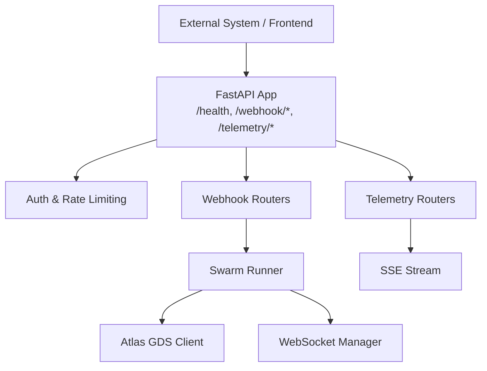
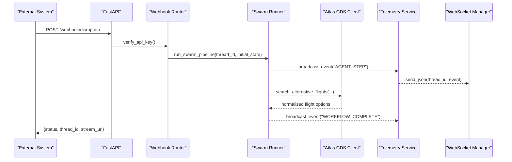
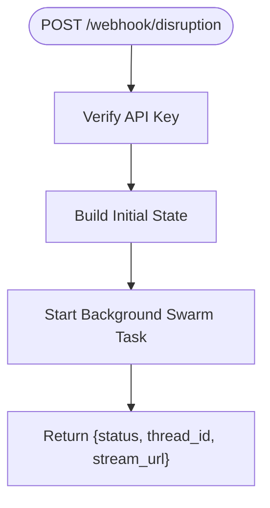
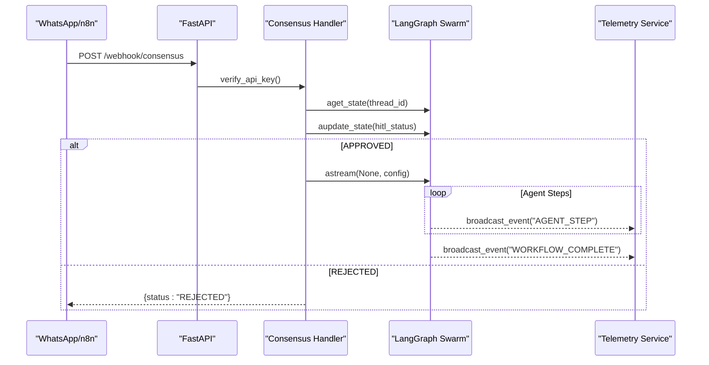
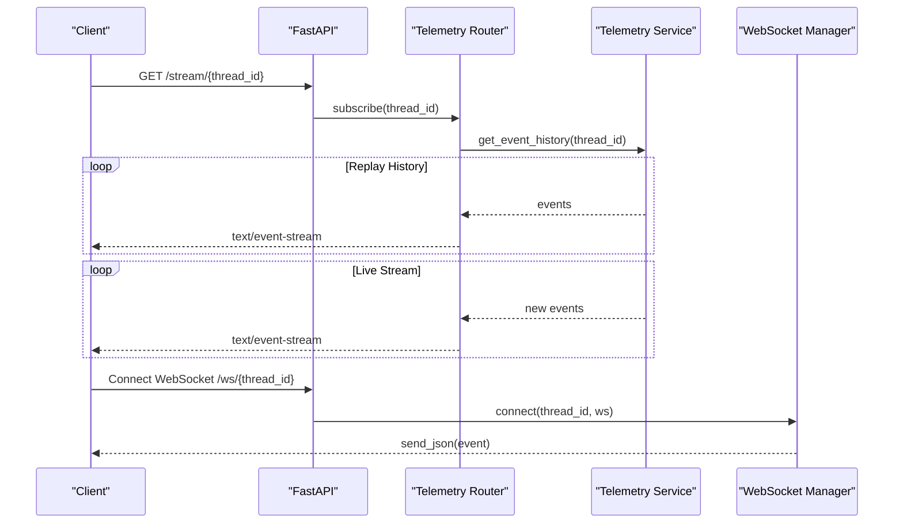
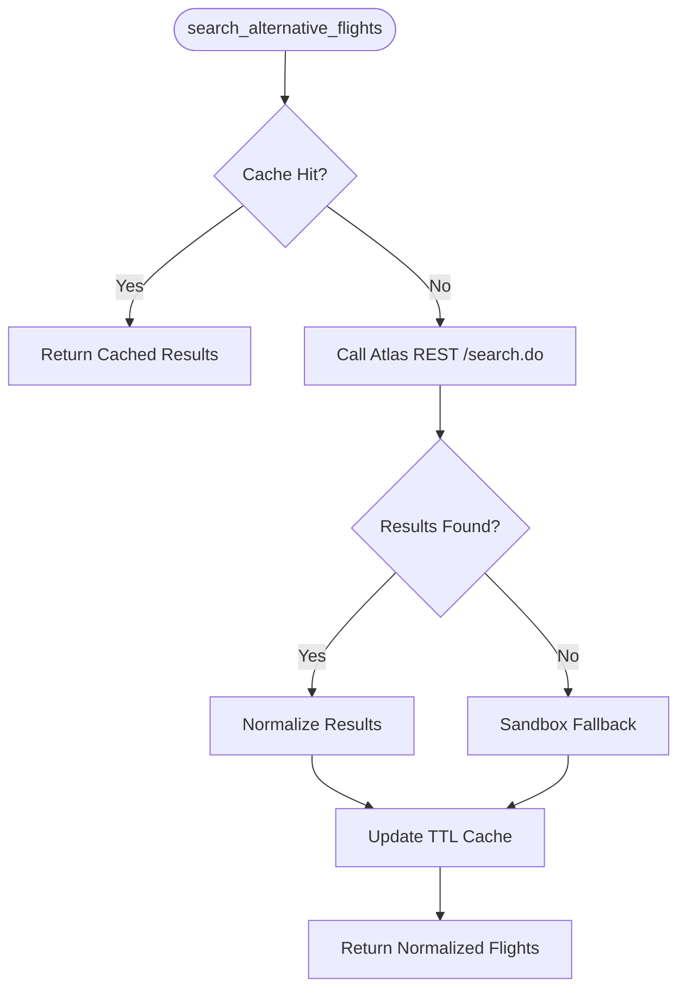
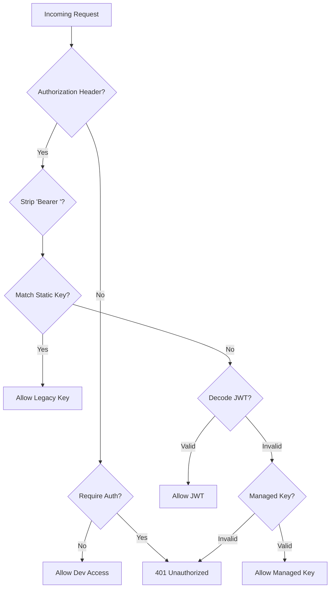
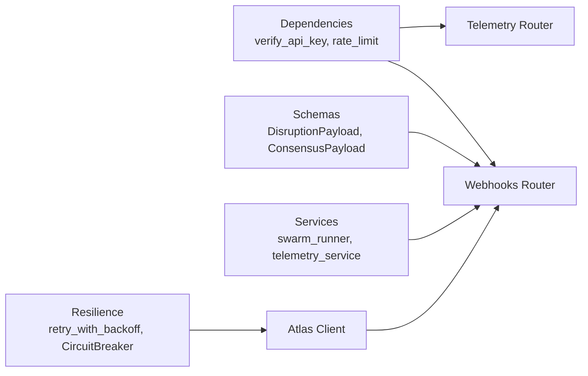

# Integration Examples & SDKs

<cite>
**Referenced Files in This Document**
- [main.py](file://travel-recovery-os/backend/main.py)
- [webhooks.py](file://travel-recovery-os/backend/api/routers/webhooks.py)
- [dependencies.py](file://travel-recovery-os/backend/api/dependencies.py)
- [jwt_handler.py](file://travel-recovery-os/backend/auth/jwt_handler.py)
- [api_models.py](file://travel-recovery-os/backend/schemas/api_models.py)
- [telemetry.py](file://travel-recovery-os/backend/api/routers/telemetry.py)
- [websocket_manager.py](file://travel-recovery-os/backend/services/websocket_manager.py)
- [resilience.py](file://travel-recovery-os/backend/middleware/resilience.py)
- [atlas_client.py](file://travel-recovery-os/backend/tools/atlas_client.py)
- [api.js](file://travel-recovery-os/frontend/src/services/api.js)
- [README.md](file://travel-recovery-os/README.md)
- [integration-scenarios.md](file://atlas-api-integration-advisor (2)/atlas-api-integration-advisor/references/integration-scenarios.md)
</cite>

## Table of Contents
1. [Introduction](#introduction)
2. [Project Structure](#project-structure)
3. [Core Components](#core-components)
4. [Architecture Overview](#architecture-overview)
5. [Detailed Component Analysis](#detailed-component-analysis)
6. [Dependency Analysis](#dependency-analysis)
7. [Performance Considerations](#performance-considerations)
8. [Troubleshooting Guide](#troubleshooting-guide)
9. [Conclusion](#conclusion)
10. [Appendices](#appendices)

## Introduction
This document provides practical integration examples and SDK recommendations for connecting external systems to the SynapseAir API. It focuses on:
- Webhook ingestion for flight disruptions and passenger consensus
- Real-time monitoring via Server-Sent Events (SSE) and WebSocket
- Workflow automation using n8n webhooks
- Authentication setup, error handling best practices, and performance optimization tips
- Troubleshooting common issues and migration guidance across client versions

SynapseAir exposes a FastAPI-based REST API with structured payloads for disruption events and HITL consensus, plus real-time telemetry streams for live observability.

## Project Structure
The backend is organized into routers (webhooks, telemetry, system, history, websocket), authentication and rate limiting, schemas for request/response models, services for orchestration and messaging, middleware for resilience and tracing, and tools for GDS integration. The frontend includes an API client that demonstrates how to call endpoints and manage streaming connections.

**Diagram sources**
- [main.py:40-113](file://travel-recovery-os/backend/main.py#L40-L113)
- [webhooks.py:12-72](file://travel-recovery-os/backend/api/routers/webhooks.py#L12-L72)
- [telemetry.py:11-46](file://travel-recovery-os/backend/api/routers/telemetry.py#L11-L46)
- [websocket_manager.py:16-75](file://travel-recovery-os/backend/services/websocket_manager.py#L16-L75)
- [atlas_client.py:175-219](file://travel-recovery-os/backend/tools/atlas_client.py#L175-L219)

**Section sources**
- [main.py:40-113](file://travel-recovery-os/backend/main.py#L40-L113)
- [README.md:399-408](file://travel-recovery-os/README.md#L399-L408)

## Core Components
- Webhook endpoints:
  - POST /webhook/disruption: Ingests flight disruption events and triggers the recovery swarm; returns thread_id and stream URL.
  - POST /webhook/consensus: Receives passenger decisions (APPROVE/REJECT) to resume or stop workflow.
- Telemetry endpoints:
  - GET /stream/{thread_id}: SSE stream for real-time agent activity.
  - GET /threads/{thread_id}/state: Inspect current LangGraph state for a thread.
- Authentication:
  - Supports legacy static key, JWT Bearer token, and managed API keys.
  - Rate limiting via sliding window with Redis-backed limiter.
- Data models:
  - DisruptionPayload and ConsensusPayload define required fields and defaults.

**Section sources**
- [webhooks.py:14-72](file://travel-recovery-os/backend/api/routers/webhooks.py#L14-L72)
- [webhooks.py:74-185](file://travel-recovery-os/backend/api/routers/webhooks.py#L74-L185)
- [telemetry.py:11-72](file://travel-recovery-os/backend/api/routers/telemetry.py#L11-L72)
- [dependencies.py:25-78](file://travel-recovery-os/backend/api/dependencies.py#L25-L78)
- [api_models.py:5-79](file://travel-recovery-os/backend/schemas/api_models.py#L5-L79)
- [api_models.py:81-102](file://travel-recovery-os/backend/schemas/api_models.py#L81-L102)

## Architecture Overview
The integration flow starts with webhook ingestion, which constructs an initial state and runs the multi-agent swarm asynchronously. Real-time progress is streamed via SSE and WebSocket. Passenger HITL decisions resume the graph from a durable checkpoint. External clients can also query historical data and analytics.

**Diagram sources**
- [webhooks.py:23-72](file://travel-recovery-os/backend/api/routers/webhooks.py#L23-L72)
- [atlas_client.py:175-219](file://travel-recovery-os/backend/tools/atlas_client.py#L175-L219)
- [websocket_manager.py:42-55](file://travel-recovery-os/backend/services/websocket_manager.py#L42-L55)

## Detailed Component Analysis

### Webhook Ingestion: Flight Disruption
- Endpoint: POST /webhook/disruption
- Purpose: Accept structured or raw-text disruption events and start the recovery swarm.
- Key behaviors:
  - Validates auth via verify_api_key dependency.
  - Builds initial state including disruption event and passenger context.
  - Starts background task to run the swarm pipeline.
  - Returns thread_id and stream URL for real-time tracking.

**Diagram sources**
- [webhooks.py:23-72](file://travel-recovery-os/backend/api/routers/webhooks.py#L23-L72)

**Section sources**
- [webhooks.py:23-72](file://travel-recovery-os/backend/api/routers/webhooks.py#L23-L72)
- [api_models.py:5-79](file://travel-recovery-os/backend/schemas/api_models.py#L5-L79)

### Webhook Consensus: Passenger Decision
- Endpoint: POST /webhook/consensus
- Purpose: Receive APPROVE/REJECT decision and resume or stop workflow.
- Key behaviors:
  - Loads current graph state by thread_id.
  - Updates hitl_status and resumes execution if approved.
  - Streams agent steps and completion events back to subscribers.

**Diagram sources**
- [webhooks.py:84-185](file://travel-recovery-os/backend/api/routers/webhooks.py#L84-L185)

**Section sources**
- [webhooks.py:84-185](file://travel-recovery-os/backend/api/routers/webhooks.py#L84-L185)
- [api_models.py:81-102](file://travel-recovery-os/backend/schemas/api_models.py#L81-L102)

### Real-Time Monitoring: SSE and WebSocket
- SSE: GET /stream/{thread_id} replays historical events then streams live events with keep-alive.
- WebSocket: Bidirectional communication managed per thread_id; supports fan-out to multiple clients.

**Diagram sources**
- [telemetry.py:11-46](file://travel-recovery-os/backend/api/routers/telemetry.py#L11-L46)
- [websocket_manager.py:26-55](file://travel-recovery-os/backend/services/websocket_manager.py#L26-L55)

**Section sources**
- [telemetry.py:11-72](file://travel-recovery-os/backend/api/routers/telemetry.py#L11-L72)
- [websocket_manager.py:16-75](file://travel-recovery-os/backend/services/websocket_manager.py#L16-L75)

### GDS Integration: Search and Ticketing
- Search: Uses official Atlas GDS REST API with retry and circuit breaker; falls back to high-fidelity sandbox simulation when needed.
- Ticketing: Executes verify.do → order.do → pay.do → queryOrderDetails.do lifecycle; returns issued PNR and e-ticket details.

**Diagram sources**
- [atlas_client.py:175-219](file://travel-recovery-os/backend/tools/atlas_client.py#L175-L219)
- [atlas_client.py:360-425](file://travel-recovery-os/backend/tools/atlas_client.py#L360-L425)

**Section sources**
- [atlas_client.py:175-219](file://travel-recovery-os/backend/tools/atlas_client.py#L175-L219)
- [atlas_client.py:222-357](file://travel-recovery-os/backend/tools/atlas_client.py#L222-L357)

### Authentication Setup
- Supported modes:
  - Legacy static API key (SYNAPSE_API_SECRET)
  - JWT Bearer token (HS256, configurable expiry)
  - Managed API key via APIKeyManager
- Rate limiting: Per-category sliding window with Redis; returns Retry-After header on 429 responses.

**Diagram sources**
- [dependencies.py:25-78](file://travel-recovery-os/backend/api/dependencies.py#L25-L78)
- [jwt_handler.py:20-63](file://travel-recovery-os/backend/auth/jwt_handler.py#L20-L63)

**Section sources**
- [dependencies.py:25-78](file://travel-recovery-os/backend/api/dependencies.py#L25-L78)
- [jwt_handler.py:20-63](file://travel-recovery-os/backend/auth/jwt_handler.py#L20-L63)

## Dependency Analysis
- Routers depend on dependencies for auth and rate limiting.
- Webhooks depend on schemas for payload validation and services for swarm execution and telemetry broadcasting.
- Telemetry depends on services for subscription management and event history retrieval.
- Resilience middleware provides retry and circuit breaker patterns used by GDS client.

**Diagram sources**
- [dependencies.py:25-78](file://travel-recovery-os/backend/api/dependencies.py#L25-L78)
- [webhooks.py:23-72](file://travel-recovery-os/backend/api/routers/webhooks.py#L23-L72)
- [telemetry.py:11-46](file://travel-recovery-os/backend/api/routers/telemetry.py#L11-L46)
- [resilience.py:25-80](file://travel-recovery-os/backend/middleware/resilience.py#L25-L80)
- [atlas_client.py:175-219](file://travel-recovery-os/backend/tools/atlas_client.py#L175-L219)

**Section sources**
- [dependencies.py:25-78](file://travel-recovery-os/backend/api/dependencies.py#L25-L78)
- [webhooks.py:23-72](file://travel-recovery-os/backend/api/routers/webhooks.py#L23-L72)
- [telemetry.py:11-46](file://travel-recovery-os/backend/api/routers/telemetry.py#L11-L46)
- [resilience.py:25-80](file://travel-recovery-os/backend/middleware/resilience.py#L25-L80)
- [atlas_client.py:175-219](file://travel-recovery-os/backend/tools/atlas_client.py#L175-L219)

## Performance Considerations
- Use caching for repeated searches to reduce latency and external calls.
- Apply exponential backoff and jitter for retries to avoid thundering herds.
- Employ circuit breakers around external services to fast-fail during outages.
- Keep SSE connections alive with periodic keep-alive messages.
- Prefer structured payloads over raw text parsing when possible to reduce processing overhead.

[No sources needed since this section provides general guidance]

## Troubleshooting Guide
Common issues and resolutions:
- Missing or invalid API key: Ensure Authorization header contains a valid static key, JWT, or managed key.
- Rate limit exceeded: Observe Retry-After header and back off accordingly.
- No active session for thread_id: Verify thread_id exists before sending consensus; check health and state endpoints.
- External service failures: Monitor circuit breaker states and fallback behavior; log errors and adjust thresholds.

**Section sources**
- [dependencies.py:25-78](file://travel-recovery-os/backend/api/dependencies.py#L25-L78)
- [dependencies.py:103-130](file://travel-recovery-os/backend/api/dependencies.py#L103-L130)
- [webhooks.py:91-97](file://travel-recovery-os/backend/api/routers/webhooks.py#L91-L97)
- [resilience.py:97-215](file://travel-recovery-os/backend/middleware/resilience.py#L97-L215)

## Conclusion
SynapseAir provides robust APIs for webhook ingestion, real-time telemetry, and workflow automation with strong authentication, resilience, and observability. By following the recommended integration patterns—structured payloads, proper auth headers, streaming subscriptions, and resilient external calls—you can build reliable integrations for disruption recovery and passenger engagement.

[No sources needed since this section summarizes without analyzing specific files]

## Appendices

### Practical Integration Examples

#### Python Example: Webhook Ingestion and Consensus
- Use requests or httpx to call POST /webhook/disruption with DisruptionPayload fields.
- Subscribe to SSE at /stream/{thread_id} to receive agent steps and completion events.
- Send POST /webhook/consensus with ConsensusPayload to approve or reject rebooking.

References:
- [webhooks.py:23-72](file://travel-recovery-os/backend/api/routers/webhooks.py#L23-L72)
- [webhooks.py:84-185](file://travel-recovery-os/backend/api/routers/webhooks.py#L84-L185)
- [telemetry.py:11-46](file://travel-recovery-os/backend/api/routers/telemetry.py#L11-L46)
- [api_models.py:5-79](file://travel-recovery-os/backend/schemas/api_models.py#L5-L79)
- [api_models.py:81-102](file://travel-recovery-os/backend/schemas/api_models.py#L81-L102)

#### JavaScript Example: Frontend API Client
- Configure base URL and token via environment variables.
- Trigger disruption and resolve consensus using fetch with Authorization headers.
- Convert HTTP base URL to WebSocket URL for bidirectional communication.

References:
- [api.js:1-21](file://travel-recovery-os/frontend/src/services/api.js#L1-L21)
- [api.js:30-55](file://travel-recovery-os/frontend/src/services/api.js#L30-L55)

#### cURL Examples
- Health check:
  - curl http://127.0.0.1:8001/health
- Webhook disruption:
  - curl -X POST http://127.0.0.1:8001/webhook/disruption -H "Authorization: Bearer YOUR_TOKEN" -H "Content-Type: application/json" -d '{"raw_text":"...","pnr":"PNR-8842","flight_number":"CZ-3042","origin":"KUL","destination":"HGH","scheduled_departure":"2026-08-25 09:30","delay_minutes":240,"reason":"Severe Weather","loyalty_tier":"GOLD","passenger_name":"Sarah Jenkins","passenger_phone":"+60 12-345 6789"}'
- Webhook consensus:
  - curl -X POST http://127.0.0.1:8001/webhook/consensus -H "Authorization: Bearer YOUR_TOKEN" -H "Content-Type: application/json" -d '{"thread_id":"synapse-xxxx","action":"APPROVE","notes":"Approved via WhatsApp"}'
- SSE stream:
  - curl -N http://127.0.0.1:8001/stream/{thread_id}

References:
- [main.py:119-122](file://travel-recovery-os/backend/main.py#L119-L122)
- [webhooks.py:23-72](file://travel-recovery-os/backend/api/routers/webhooks.py#L23-L72)
- [webhooks.py:84-185](file://travel-recovery-os/backend/api/routers/webhooks.py#L84-L185)
- [telemetry.py:11-46](file://travel-recovery-os/backend/api/routers/telemetry.py#L11-L46)

### SDK Recommendations
- Python:
  - httpx for async HTTP requests with timeouts and gzip support.
  - Pydantic for model validation (already used in schemas).
  - asyncio for background tasks and concurrency.
- JavaScript:
  - fetch API for REST calls and SSE consumption.
  - WebSocket for bidirectional communication.
  - Environment variables for configuration (base URL, token).
- cURL:
  - For quick testing and CI pipelines.

References:
- [atlas_client.py:18-35](file://travel-recovery-os/backend/tools/atlas_client.py#L18-L35)
- [api.js:1-21](file://travel-recovery-os/frontend/src/services/api.js#L1-L21)

### Error Handling Best Practices
- Validate inputs using Pydantic models to catch malformed payloads early.
- Handle HTTP status codes and propagate meaningful error messages.
- Implement retries with exponential backoff and jitter for transient failures.
- Use circuit breakers to prevent cascading failures to external services.
- Log errors with context (thread_id, endpoint, payload summary) for debugging.

References:
- [api_models.py:5-79](file://travel-recovery-os/backend/schemas/api_models.py#L5-L79)
- [resilience.py:25-80](file://travel-recovery-os/backend/middleware/resilience.py#L25-L80)
- [resilience.py:97-215](file://travel-recovery-os/backend/middleware/resilience.py#L97-L215)

### Migration Advice for Different Client Versions
- Upgrade to JWT-based authentication for improved security and scope control.
- Migrate from raw text payloads to structured payloads for better parsing and reliability.
- Adopt SSE/WebSocket for real-time updates instead of polling.
- Integrate circuit breakers and retries for external service calls.

References:
- [dependencies.py:25-78](file://travel-recovery-os/backend/api/dependencies.py#L25-L78)
- [telemetry.py:11-46](file://travel-recovery-os/backend/api/routers/telemetry.py#L11-L46)
- [resilience.py:97-215](file://travel-recovery-os/backend/middleware/resilience.py#L97-L215)