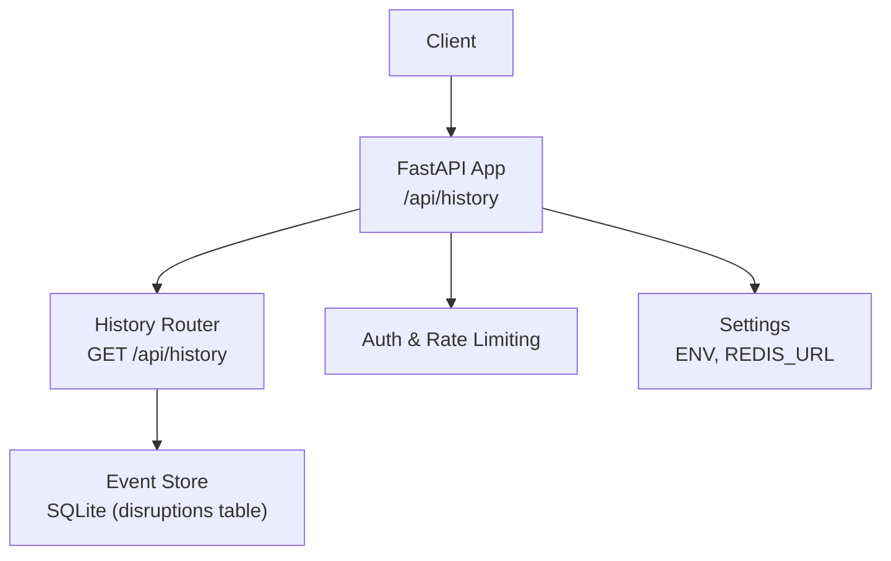
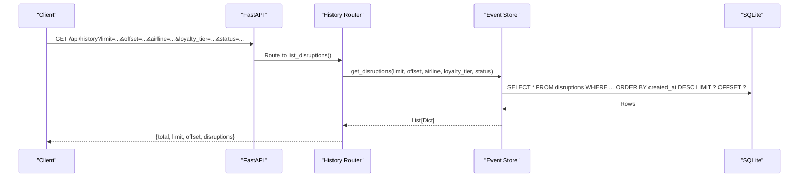
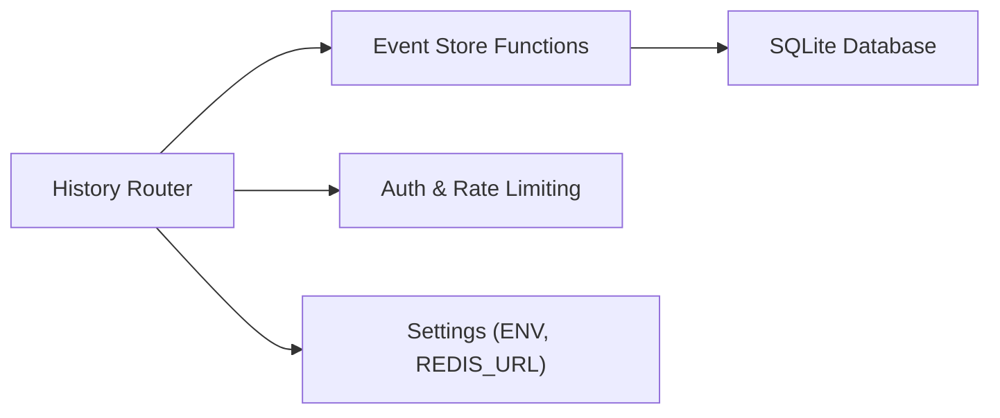

# Historical Data Endpoints

<cite>
**Referenced Files in This Document**
- [history.py](file://travel-recovery-os/backend/api/routers/history.py)
- [event_store.py](file://travel-recovery-os/backend/store/event_store.py)
- [api_models.py](file://travel-recovery-os/backend/schemas/api_models.py)
- [main.py](file://travel-recovery-os/backend/main.py)
- [dependencies.py](file://travel-recovery-os/backend/api/dependencies.py)
- [config.py](file://travel-recovery-os/backend/config.py)
</cite>

## Table of Contents
1. [Introduction](#introduction)
2. [Project Structure](#project-structure)
3. [Core Components](#core-components)
4. [Architecture Overview](#architecture-overview)
5. [Detailed Component Analysis](#detailed-component-analysis)
6. [Dependency Analysis](#dependency-analysis)
7. [Performance Considerations](#performance-considerations)
8. [Troubleshooting Guide](#troubleshooting-guide)
9. [Conclusion](#conclusion)
10. [Appendices](#appendices)

## Introduction
This document provides comprehensive API documentation for historical data access endpoints that retrieve past disruption events and recovery outcomes. It focuses on the GET /api/history endpoint, including supported query parameters, response schemas, pagination, sorting behavior, and analytics endpoints. It also outlines caching strategies, data retention policies, and performance optimization techniques for large dataset queries based on the repository’s implementation.

## Project Structure
The historical data feature is implemented as a FastAPI router with a dedicated store layer backed by SQLite. The main application wires routers and middleware, while configuration controls environment-specific settings such as database path and Redis availability.

**Diagram sources**
- [main.py:104-108](file://travel-recovery-os/backend/main.py#L104-L108)
- [history.py:16-47](file://travel-recovery-os/backend/api/routers/history.py#L16-L47)
- [event_store.py:242-272](file://travel-recovery-os/backend/store/event_store.py#L242-L272)
- [config.py:72-73](file://travel-recovery-os/backend/config.py#L72-L73)

**Section sources**
- [main.py:104-108](file://travel-recovery-os/backend/main.py#L104-L108)
- [history.py:16-47](file://travel-recovery-os/backend/api/routers/history.py#L16-L47)

## Core Components
- History Router: Exposes GET /api/history and related endpoints for listing disruptions, retrieving stats, and fetching details by thread_id.
- Event Store: Provides persistent storage and retrieval of disruption records via SQLite, including filtering, pagination, and aggregate statistics.
- Configuration: Supplies runtime settings like database path and optional Redis URL used by rate limiting and potential caching layers.

Key responsibilities:
- List disruptions with pagination and filters (airline, loyalty tier, status).
- Provide aggregate analytics (auto-approve rate, HITL rate, average resolution time, top routes).
- Retrieve full detail for a specific disruption by thread_id.

**Section sources**
- [history.py:19-73](file://travel-recovery-os/backend/api/routers/history.py#L19-L73)
- [event_store.py:242-335](file://travel-recovery-os/backend/store/event_store.py#L242-L335)
- [config.py:21-24](file://travel-recovery-os/backend/config.py#L21-L24)

## Architecture Overview
The historical data flow uses a layered architecture:
- HTTP Layer: FastAPI router defines endpoints and request/response contracts.
- Service Layer: Event store functions encapsulate SQL queries and data transformations.
- Storage Layer: SQLite persists disruption records and n8n webhook events.

**Diagram sources**
- [history.py:19-47](file://travel-recovery-os/backend/api/routers/history.py#L19-L47)
- [event_store.py:242-272](file://travel-recovery-os/backend/store/event_store.py#L242-L272)

## Detailed Component Analysis

### Endpoint: GET /api/history
Purpose:
- Retrieve paginated historical disruption events with optional filters.

Query Parameters:
- limit: integer, default 50. Maximum number of results returned per page.
- offset: integer, default 0. Pagination offset to skip prior results.
- airline: string, optional. Filter by airline name.
- loyalty_tier: string, optional. Filter by passenger loyalty tier (PLATINUM/GOLD/SILVER/STANDARD).
- status: string, optional. Filter by HITL processing status (BYPASSED/APPROVED/REJECTED/PENDING).

Response Schema:
- total: integer. Number of items returned in this page.
- limit: integer. Requested page size.
- offset: integer. Requested offset.
- disruptions: array of objects. Each object represents a disruption record with fields such as:
  - thread_id: string. Unique identifier for the disruption run.
  - pnr: string. Passenger Name Record.
  - flight_number: string. IATA flight number.
  - airline: string. Operating airline name.
  - origin: string. Origin airport IATA code.
  - destination: string. Destination airport IATA code.
  - disruption_reason: string. Human-readable reason for disruption.
  - delay_minutes: integer. Delay duration in minutes.
  - loyalty_tier: string. Passenger loyalty tier.
  - passenger_name: string. Full passenger name.
  - selected_route_json: string or null. JSON-encoded selected alternative route.
  - hitl_status: string. Processing status (PENDING/APPROVED/REJECTED/BYPASSED).
  - ticket_confirmation_json: string or null. JSON-encoded ticket confirmation.
  - financial_savings_json: string or null. JSON-encoded financial savings.
  - error_state: string or null. Error state if any.
  - created_at: string. ISO timestamp when the disruption was recorded.
  - completed_at: string or null. ISO timestamp when the disruption was completed.

Sorting:
- Results are sorted by created_at descending (newest first).

Pagination:
- Use limit and offset to navigate through pages.

Filtering:
- Supported filters: airline, loyalty_tier, status.

Notes:
- Date range filtering is not currently implemented in the query parameters; only the above filters are supported.

Example Request:
- GET /api/history?limit=20&offset=0&airline=China%20Southern%20Airlines&loyalty_tier=GOLD&status=PENDING

Example Response:
- {
    "total": 20,
    "limit": 20,
    "offset": 0,
    "disruptions": [
      {
        "thread_id": "synapse-123456",
        "pnr": "PNR-8842",
        "flight_number": "CZ-3042",
        "airline": "China Southern Airlines",
        "origin": "KUL",
        "destination": "HGH",
        "disruption_reason": "Severe Weather / Typhoon Flow Control",
        "delay_minutes": 240,
        "loyalty_tier": "GOLD",
        "passenger_name": "Sarah Jenkins",
        "selected_route_json": "{\"segments\": [...]}",
        "hitl_status": "APPROVED",
        "ticket_confirmation_json": "{\"booking_ref\": \"...\"}",
        "financial_savings_json": "{\"currency\": \"USD\", \"amount\": 120.50}",
        "error_state": null,
        "created_at": "2026-08-25T09:30:00",
        "completed_at": "2026-08-25T10:15:00"
      }
    ]
  }

**Section sources**
- [history.py:19-47](file://travel-recovery-os/backend/api/routers/history.py#L19-L47)
- [event_store.py:242-272](file://travel-recovery-os/backend/store/event_store.py#L242-L272)

### Endpoint: GET /api/history/stats
Purpose:
- Retrieve aggregate analytics across all disruptions.

Response Schema:
- total_disruptions: integer. Total number of disruption records.
- completed: integer. Number of disruptions with a non-null completed_at.
- auto_approved: integer. Count where hitl_status = 'BYPASSED'.
- hitl_required: integer. Count where hitl_status is 'PENDING' or 'APPROVED'.
- rejected: integer. Count where hitl_status = 'REJECTED'.
- auto_approve_rate: float. Percentage of auto-approved disruptions.
- hitl_rate: float. Percentage requiring human-in-the-loop.
- avg_resolution_seconds: float. Average resolution time in seconds for completed disruptions.
- top_routes: array of objects. Top 5 most frequent routes with fields:
  - route: string. Format "origin -> destination".
  - count: integer. Frequency of the route.

Notes:
- Resolution time is computed from created_at to completed_at for completed disruptions.

**Section sources**
- [history.py:50-57](file://travel-recovery-os/backend/api/routers/history.py#L50-L57)
- [event_store.py:288-335](file://travel-recovery-os/backend/store/event_store.py#L288-L335)

### Endpoint: GET /api/history/{thread_id}
Purpose:
- Retrieve full detail of a specific disruption run by thread_id.

Path Parameter:
- thread_id: string. Unique identifier for the disruption run.

Response:
- Disruption record object (same schema as in the list endpoint), or 404 if not found.

Error Handling:
- Returns HTTP 404 with a descriptive message when the thread_id does not exist.

**Section sources**
- [history.py:60-73](file://travel-recovery-os/backend/api/routers/history.py#L60-L73)
- [event_store.py:275-285](file://travel-recovery-os/backend/store/event_store.py#L275-L285)

### Data Models and Payloads
While the history endpoints return stored disruption records, the payload model for creating disruptions includes fields such as PNR, flight number, airline, origin, destination, scheduled departure, delay minutes, reason, loyalty tier, passenger name, phone, and optional thread_id. These fields inform the structure of stored disruption records and their usage in analytics.

**Section sources**
- [api_models.py:5-79](file://travel-recovery-os/backend/schemas/api_models.py#L5-L79)

## Dependency Analysis
The historical data endpoints depend on:
- FastAPI routing and request handling.
- Event store functions for querying SQLite.
- Optional authentication and rate limiting via dependencies.
- Configuration for environment variables and database path.

**Diagram sources**
- [history.py:10-14](file://travel-recovery-os/backend/api/routers/history.py#L10-L14)
- [event_store.py:242-335](file://travel-recovery-os/backend/store/event_store.py#L242-L335)
- [dependencies.py:25-78](file://travel-recovery-os/backend/api/dependencies.py#L25-L78)
- [config.py:21-24](file://travel-recovery-os/backend/config.py#L21-L24)

**Section sources**
- [history.py:10-14](file://travel-recovery-os/backend/api/routers/history.py#L10-L14)
- [dependencies.py:25-78](file://travel-recovery-os/backend/api/dependencies.py#L25-L78)
- [config.py:21-24](file://travel-recovery-os/backend/config.py#L21-L24)

## Performance Considerations
- Indexes: The event store creates indexes on created_at and pnr to optimize queries for listing and lookups.
- WAL Mode: SQLite journal mode is set to WAL for better concurrency and read performance.
- Query Optimization: Filtering and ordering use indexed columns where possible.
- Pagination: Default limit reduces payload size; clients should paginate appropriately.
- Caching: No explicit cache layer is implemented for history queries. If needed, consider Redis-based caching keyed by query parameters and timestamps to reduce load on SQLite for repeated requests.
- Data Retention: Records persist indefinitely unless external cleanup processes remove old entries. Implement periodic archival or deletion policies for long-term datasets.
- Export Capabilities: Not implemented in the current endpoints. Clients can export by paginating and aggregating results locally. A dedicated export endpoint could be added to stream CSV/JSON responses efficiently.

[No sources needed since this section provides general guidance]

## Troubleshooting Guide
Common issues and resolutions:
- Missing or invalid thread_id: Ensure the thread_id exists; otherwise, expect a 404 response.
- Empty results: Verify filter parameters (airline, loyalty_tier, status) match stored values.
- Large payloads: Reduce limit or apply filters to minimize response size.
- Authentication errors: Provide a valid Authorization header (Bearer token or API key) if required by environment settings.
- Rate limiting: If exceeded, respect Retry-After headers and adjust request frequency.

**Section sources**
- [history.py:60-73](file://travel-recovery-os/backend/api/routers/history.py#L60-L73)
- [dependencies.py:25-78](file://travel-recovery-os/backend/api/dependencies.py#L25-L78)
- [dependencies.py:103-129](file://travel-recovery-os/backend/api/dependencies.py#L103-L129)

## Conclusion
The historical data endpoints provide robust access to past disruption events and recovery outcomes with pagination, filtering, and analytics. While date range filtering and export capabilities are not currently implemented, the system supports efficient querying via SQLite indexes and WAL mode. For production-scale usage, consider adding date range filters, export endpoints, and caching strategies to enhance performance and usability.

[No sources needed since this section summarizes without analyzing specific files]

## Appendices

### Query Parameter Reference
- limit: integer, default 50. Max results per page.
- offset: integer, default 0. Page offset.
- airline: string, optional. Filter by airline name.
- loyalty_tier: string, optional. Filter by PLATINUM/GOLD/SILVER/STANDARD.
- status: string, optional. Filter by BYPASSED/APPROVED/REJECTED/PENDING.

**Section sources**
- [history.py:19-47](file://travel-recovery-os/backend/api/routers/history.py#L19-L47)

### Analytics Fields Reference
- total_disruptions: integer.
- completed: integer.
- auto_approved: integer.
- hitl_required: integer.
- rejected: integer.
- auto_approve_rate: float percentage.
- hitl_rate: float percentage.
- avg_resolution_seconds: float seconds.
- top_routes: array of {route: string, count: integer}.

**Section sources**
- [event_store.py:288-335](file://travel-recovery-os/backend/store/event_store.py#L288-L335)