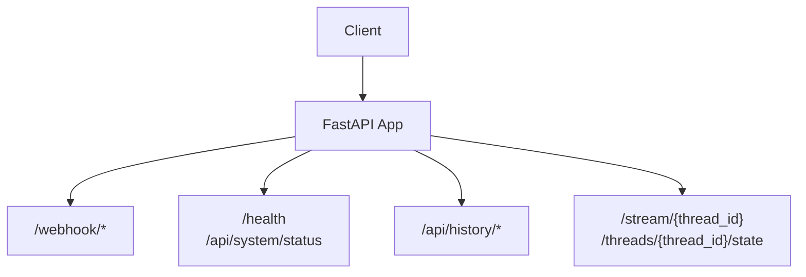
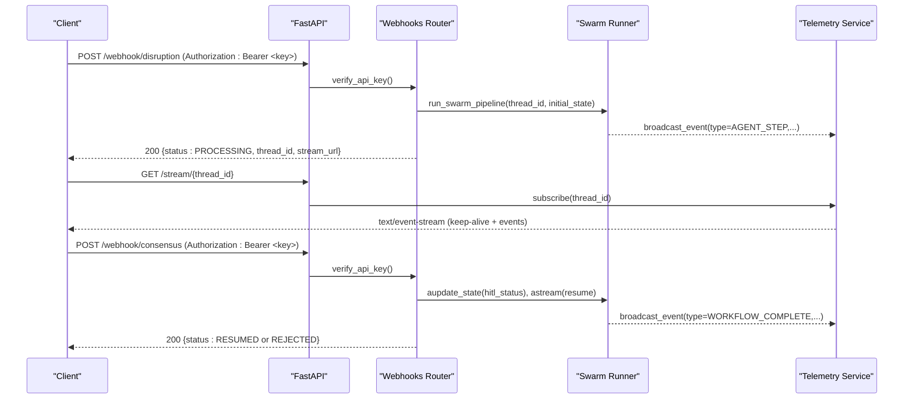
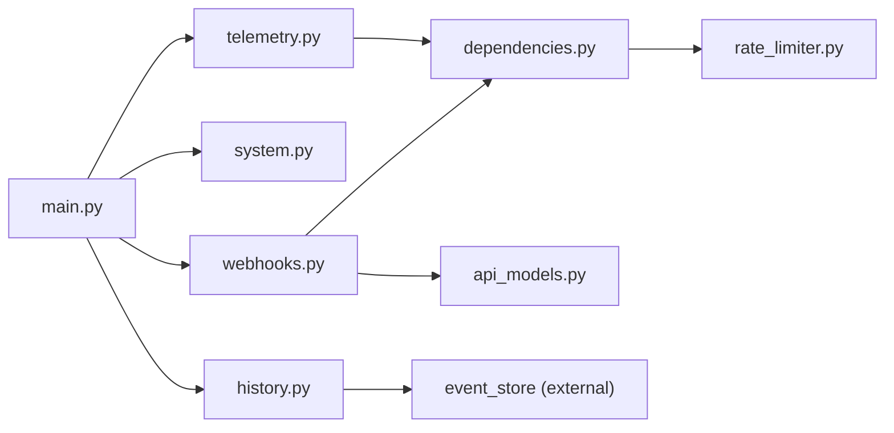

# REST API Endpoints

<cite>
**Referenced Files in This Document**
- [main.py](file://travel-recovery-os/backend/main.py)
- [webhooks.py](file://travel-recovery-os/backend/api/routers/webhooks.py)
- [system.py](file://travel-recovery-os/backend/api/routers/system.py)
- [history.py](file://travel-recovery-os/backend/api/routers/history.py)
- [telemetry.py](file://travel-recovery-os/backend/api/routers/telemetry.py)
- [api_models.py](file://travel-recovery-os/backend/schemas/api_models.py)
- [dependencies.py](file://travel-recovery-os/backend/api/dependencies.py)
- [rate_limiter.py](file://travel-recovery-os/backend/auth/rate_limiter.py)
</cite>

## Table of Contents
1. [Introduction](#introduction)
2. [Project Structure](#project-structure)
3. [Core Components](#core-components)
4. [Architecture Overview](#architecture-overview)
5. [Detailed Component Analysis](#detailed-component-analysis)
6. [Dependency Analysis](#dependency-analysis)
7. [Performance Considerations](#performance-considerations)
8. [Troubleshooting Guide](#troubleshooting-guide)
9. [Conclusion](#conclusion)

## Introduction
This document provides comprehensive REST API documentation for the SynapseAir platform, covering:
- Disruption ingestion webhook (POST /webhook/disruption)
- Passenger HITL consensus webhook (POST /webhook/consensus)
- System monitoring endpoints
- Historical data access endpoints
- Telemetry streaming endpoints (SSE)

It includes request/response schemas, authentication requirements using API keys, error codes and responses, rate limiting policies, and complete code examples for common integration scenarios.

## Project Structure
The API is implemented with FastAPI and organized by feature routers:
- Webhooks: disruption ingestion and passenger consensus
- System: health checks and system status
- History: query past disruptions and analytics
- Telemetry: SSE stream and thread state inspection
- WebSocket: bidirectional real-time communication (not covered in this REST-focused doc)

**Diagram sources**
- [main.py:104-108](file://travel-recovery-os/backend/main.py#L104-L108)
- [webhooks.py:12-185](file://travel-recovery-os/backend/api/routers/webhooks.py#L12-L185)
- [system.py:7-53](file://travel-recovery-os/backend/api/routers/system.py#L7-L53)
- [history.py:16-74](file://travel-recovery-os/backend/api/routers/history.py#L16-L74)
- [telemetry.py:9-72](file://travel-recovery-os/backend/api/routers/telemetry.py#L9-L72)

**Section sources**
- [main.py:40-108](file://travel-recovery-os/backend/main.py#L40-L108)

## Core Components
- Authentication: All webhook and data endpoints require an API key via the Authorization header. The dependency supports legacy static keys, JWT Bearer tokens, and managed API keys.
- Rate Limiting: Per-category sliding window limits enforced per client IP.
- Schemas: Pydantic models define request payloads for disruption events and consensus decisions.

Key responsibilities:
- Webhooks router: Ingests disruptions and processes passenger HITL decisions.
- System router: Provides health and detailed system status.
- History router: Lists, filters, and retrieves historical disruption events and statistics.
- Telemetry router: Streams live telemetry via Server-Sent Events and exposes thread state snapshots.

**Section sources**
- [dependencies.py:25-78](file://travel-recovery-os/backend/api/dependencies.py#L25-L78)
- [rate_limiter.py:22-29](file://travel-recovery-os/backend/auth/rate_limiter.py#L22-L29)
- [api_models.py:5-101](file://travel-recovery-os/backend/schemas/api_models.py#L5-L101)

## Architecture Overview
High-level flow for disruption ingestion and HITL consensus:

**Diagram sources**
- [webhooks.py:14-72](file://travel-recovery-os/backend/api/routers/webhooks.py#L14-L72)
- [webhooks.py:74-185](file://travel-recovery-os/backend/api/routers/webhooks.py#L74-L185)
- [telemetry.py:11-46](file://travel-recovery-os/backend/api/routers/telemetry.py#L11-L46)

## Detailed Component Analysis

### Authentication and Authorization
- Header: Authorization
- Values:
  - Bearer token (JWT or managed API key)
  - Legacy static secret (development only unless REQUIRE_AUTH is set)
- Behavior:
  - Missing key in production or when REQUIRE_AUTH is true returns 401 Unauthorized.
  - Invalid or expired key returns 401 Unauthorized.
  - Scope enforcement available via dependency factory for future use.

Rate limiting categories and defaults:
- webhook: 10 requests per 60 seconds
- consensus: 50 requests per 60 seconds
- history: 100 requests per 60 seconds
- stream: 30 requests per 60 seconds
- system: 60 requests per 60 seconds
- default: 120 requests per 60 seconds

On exceeding limits:
- Status: 429 Too Many Requests
- Headers: Retry-After, X-RateLimit-Remaining, X-RateLimit-Limit

**Section sources**
- [dependencies.py:25-78](file://travel-recovery-os/backend/api/dependencies.py#L25-L78)
- [dependencies.py:103-129](file://travel-recovery-os/backend/api/dependencies.py#L103-L129)
- [rate_limiter.py:22-29](file://travel-recovery-os/backend/auth/rate_limiter.py#L22-L29)
- [rate_limiter.py:62-99](file://travel-recovery-os/backend/auth/rate_limiter.py#L62-L99)

### Disruption Webhook: POST /webhook/disruption
Purpose:
- Ingest flight cancellation/disruption events (structured or raw text).
- Start the multi-agent recovery swarm asynchronously.
- Return a thread_id and stream URL for live telemetry.

Authentication:
- Required: Authorization header with Bearer token (managed API key or JWT).

Request:
- Content-Type: application/json
- Body schema: DisruptionPayload
  - Fields:
    - raw_text: Optional string; natural language alert for AI parsing
    - pnr: Optional string; booking reference
    - flight_number: Optional string; IATA flight number
    - airline: Optional string; operating airline name
    - origin: Optional string; origin airport IATA code
    - destination: Optional string; destination airport IATA code
    - scheduled_departure: Optional string; YYYY-MM-DD HH:MM
    - delay_minutes: Optional integer; minutes of delay
    - reason: Optional string; human-readable reason
    - loyalty_tier: Optional string; PLATINUM/GOLD/SILVER/STANDARD
    - passenger_name: Optional string; passenger full name
    - passenger_phone: Optional string; phone for WhatsApp HITL notifications
    - n8n_webhook_url: Optional string; override global n8n webhook URL
    - thread_id: Optional string; custom thread ID; auto-generated if omitted

Response:
- 200 OK: JSON object
  - status: "PROCESSING"
  - thread_id: string
  - stream_url: string (e.g., "/stream/{thread_id}")
  - message: string

Error Responses:
- 401 Unauthorized: Missing or invalid API key
- 429 Too Many Requests: Exceeded rate limit (headers include Retry-After)

Example Request:
- Headers:
  - Authorization: Bearer sk-...
  - Content-Type: application/json
- Body:
  - Provide either structured fields or raw_text to parse automatically.

Example Response:
- {
    "status": "PROCESSING",
    "thread_id": "synapse-xxxxx",
    "stream_url": "/stream/synapse-xxxxx",
    "message": "SynapseAir Swarm initiated for thread synapse-xxxxx."
  }

Notes:
- The endpoint triggers background processing via a task that runs the swarm pipeline.
- Use the returned stream_url to subscribe to live telemetry updates.

**Section sources**
- [webhooks.py:14-72](file://travel-recovery-os/backend/api/routers/webhooks.py#L14-L72)
- [api_models.py:5-78](file://travel-recovery-os/backend/schemas/api_models.py#L5-L78)
- [dependencies.py:25-78](file://travel-recovery-os/backend/api/dependencies.py#L25-L78)
- [rate_limiter.py:22-29](file://travel-recovery-os/backend/auth/rate_limiter.py#L22-L29)

### Consensus Webhook: POST /webhook/consensus
Purpose:
- Receive passenger HITL decision (APPROVE or REJECT) from WhatsApp or in-app flows.
- Update workflow state and resume or stop the recovery process accordingly.

Authentication:
- Required: Authorization header with Bearer token.

Request:
- Content-Type: application/json
- Body schema: ConsensusPayload
  - Fields:
    - thread_id: Required string; swarm thread ID to resume
    - action: Required string; "APPROVE" or "REJECT"
    - selected_flight_id: Optional string; ID of selected alternative flight
    - notes: Optional string; optional notes from passenger

Response:
- 200 OK: JSON object
  - If APPROVED:
    - status: "RESUMED"
    - thread_id: string
    - action: "APPROVED"
    - message: string indicating resumed workflow
  - If REJECTED:
    - status: "REJECTED"
    - thread_id: string
    - action: "REJECTED"
    - message: string indicating stopped workflow

Error Responses:
- 401 Unauthorized: Missing or invalid API key
- 404 Not Found: No active session for the given thread_id
- 429 Too Many Requests: Exceeded rate limit

Example Request:
- Headers:
  - Authorization: Bearer sk-...
  - Content-Type: application/json
- Body:
  - {
      "thread_id": "synapse-xxxxx",
      "action": "APPROVE",
      "notes": "Approved via WhatsApp 1-click CTA"
    }

Example Response (APPROVED):
- {
    "status": "RESUMED",
    "thread_id": "synapse-xxxxx",
    "action": "APPROVED",
    "message": "Graph resumed from checkpointer to finalize ticket."
  }

Notes:
- On approval, the endpoint resumes the LangGraph workflow and streams agent steps via telemetry until completion.
- A final WORKFLOW_COMPLETE event is broadcast with ticket confirmation details if available.

**Section sources**
- [webhooks.py:74-185](file://travel-recovery-os/backend/api/routers/webhooks.py#L74-L185)
- [api_models.py:81-101](file://travel-recovery-os/backend/schemas/api_models.py#L81-L101)
- [dependencies.py:25-78](file://travel-recovery-os/backend/api/dependencies.py#L25-L78)
- [rate_limiter.py:22-29](file://travel-recovery-os/backend/auth/rate_limiter.py#L22-L29)

### System Monitoring Endpoints

#### GET /health
Purpose:
- Lightweight health check returning service status and version.

Authentication:
- Not required.

Response:
- 200 OK: JSON object
  - status: "healthy"
  - version: string

Example Response:
- {
    "status": "healthy",
    "version": "2.1.0"
  }

**Section sources**
- [main.py:119-122](file://travel-recovery-os/backend/main.py#L119-L122)

#### GET /api/system/status
Purpose:
- Detailed system status including provider configurations and integration states.

Authentication:
- Not required.

Response:
- 200 OK: JSON object
  - status: "HEALTHY"
  - deepseek: object with active flag, model, endpoint
  - hermes: object with active flag, model, endpoint
  - atlas_gds: object with status, cli_installed, provider
  - n8n: object with status, webhook_target, api_connected
  - timestamp: ISO datetime string

Example Response:
- {
    "status": "HEALTHY",
    "deepseek": {"active": true, "model": "...", "endpoint": "..."},
    "hermes": {"active": true, "model": "...", "endpoint": "..."},
    "atlas_gds": {"status": "LIVE_CLI_ACTIVE", "cli_installed": true, "provider": "..."},
    "n8n": {"status": "CONNECTED", "webhook_target": "...", "api_connected": true},
    "timestamp": "2026-01-01T00:00:00"
  }

**Section sources**
- [system.py:24-53](file://travel-recovery-os/backend/api/routers/system.py#L24-L53)

### Historical Data Access Endpoints

#### GET /api/history
Purpose:
- Paginated list of past disruption events with optional filters.

Authentication:
- Not required.

Query Parameters:
- limit: integer; max results (default 50)
- offset: integer; pagination offset (default 0)
- airline: optional string; filter by airline name
- loyalty_tier: optional string; filter by tier (PLATINUM/GOLD/SILVER/STANDARD)
- status: optional string; filter by HITL status (BYPASSED/APPROVED/REJECTED/PENDING)

Response:
- 200 OK: JSON object
  - total: integer; number of results returned
  - limit: integer; requested limit
  - offset: integer; requested offset
  - disruptions: array; list of disruption records

Example Request:
- GET /api/history?limit=20&offset=0&airline=China%20Southern%20Airlines&loyalty_tier=GOLD

Example Response:
- {
    "total": 20,
    "limit": 20,
    "offset": 0,
    "disruptions": [...]
  }

**Section sources**
- [history.py:19-47](file://travel-recovery-os/backend/api/routers/history.py#L19-L47)

#### GET /api/history/stats
Purpose:
- Aggregate analytics across all disruptions.

Authentication:
- Not required.

Response:
- 200 OK: JSON object containing totals, auto-approve/HITL rates, average resolution time, top routes.

Example Response:
- {
    "total_disruptions": 1234,
    "auto_approve_rate": 0.65,
    "hitl_rate": 0.35,
    "avg_resolution_time_seconds": 120,
    "top_routes": [{"origin":"KUL","destination":"HGH","count":120}]
  }

**Section sources**
- [history.py:50-57](file://travel-recovery-os/backend/api/routers/history.py#L50-L57)

#### GET /api/history/{thread_id}
Purpose:
- Full detail of a specific disruption run by thread_id.

Authentication:
- Not required.

Path Parameters:
- thread_id: string; unique identifier for the disruption thread

Response:
- 200 OK: JSON object; full disruption event details
- 404 Not Found: JSON object with detail message

Example Request:
- GET /api/history/synapse-xxxxx

Example Response:
- {
    "thread_id": "synapse-xxxxx",
    "disruption_event": {...},
    "passenger_context": {...},
    "candidate_routes": [...],
    "selected_route": {...},
    "hitl_status": "APPROVED",
    "execution_logs": [...],
    "ticket_confirmation": {...}
  }

**Section sources**
- [history.py:60-74](file://travel-recovery-os/backend/api/routers/history.py#L60-L74)

### Telemetry Streaming Endpoints

#### GET /stream/{thread_id}
Purpose:
- Server-Sent Events (SSE) stream for real-time agent activity. Replays historical events first, then streams live. Sends keep-alive every 15 seconds.

Authentication:
- Not required.

Path Parameters:
- thread_id: string; swarm thread ID

Headers:
- Accept: text/event-stream (recommended)

Response:
- 200 OK: text/event-stream
  - Events are JSON payloads with fields such as type, thread_id, timestamp, node, log, state_update, etc.
  - Keep-alive messages are sent periodically.

Example Request:
- GET /stream/synapse-xxxxx

Example Event Payloads:
- Agent step:
  - {
      "type": "AGENT_STEP",
      "thread_id": "synapse-xxxxx",
      "node": "scout",
      "log": {"message": "Searching alternatives...", "level": "INFO", "timestamp": "..."},
      "state_update": {...}
    }
- Workflow complete:
  - {
      "type": "WORKFLOW_COMPLETE",
      "thread_id": "synapse-xxxxx",
      "timestamp": "...",
      "message": "Resumed workflow complete. Ticket finalized.",
      "ticket": {...}
    }

Notes:
- The connection remains open until the client disconnects.
- Ensure your client handles reconnection and keep-alive signals.

**Section sources**
- [telemetry.py:11-46](file://travel-recovery-os/backend/api/routers/telemetry.py#L11-L46)

#### GET /threads/{thread_id}/state
Purpose:
- Inspect current LangGraph checkpointer state for a given thread, including agent outputs and pending nodes.

Authentication:
- Not required.

Path Parameters:
- thread_id: string; swarm thread ID

Response:
- 200 OK: JSON object
  - thread_id: string
  - values: object; current state values
  - next: string|null; next node(s) to execute
  - created_at: string; ISO timestamp
- 404 Not Found: JSON object with detail message

Example Request:
- GET /threads/synapse-xxxxx/state

Example Response:
- {
    "thread_id": "synapse-xxxxx",
    "values": {...},
    "next": "executor",
    "created_at": "2026-01-01T00:00:00"
  }

**Section sources**
- [telemetry.py:48-72](file://travel-recovery-os/backend/api/routers/telemetry.py#L48-L72)

## Dependency Analysis
Component relationships and dependencies:

**Diagram sources**
- [main.py:104-108](file://travel-recovery-os/backend/main.py#L104-L108)
- [webhooks.py:1-185](file://travel-recovery-os/backend/api/routers/webhooks.py#L1-L185)
- [system.py:1-53](file://travel-recovery-os/backend/api/routers/system.py#L1-L53)
- [history.py:1-74](file://travel-recovery-os/backend/api/routers/history.py#L1-L74)
- [telemetry.py:1-72](file://travel-recovery-os/backend/api/routers/telemetry.py#L1-L72)
- [dependencies.py:1-130](file://travel-recovery-os/backend/api/dependencies.py#L1-L130)
- [rate_limiter.py:1-124](file://travel-recovery-os/backend/auth/rate_limiter.py#L1-L124)

**Section sources**
- [main.py:104-108](file://travel-recovery-os/backend/main.py#L104-L108)
- [dependencies.py:1-130](file://travel-recovery-os/backend/api/dependencies.py#L1-L130)
- [rate_limiter.py:1-124](file://travel-recovery-os/backend/auth/rate_limiter.py#L1-L124)

## Performance Considerations
- Asynchronous Processing: Disruption ingestion triggers background tasks to avoid blocking requests.
- SSE Keep-Alive: Telemetry stream sends periodic keep-alive messages to maintain connections through proxies.
- Rate Limiting: Sliding window limits protect backend resources; integrate Retry-After handling on 429 responses.
- Pagination: Use limit and offset parameters to efficiently retrieve historical data.
- Connection Management: Clients should handle reconnections for SSE streams and implement exponential backoff.

[No sources needed since this section provides general guidance]

## Troubleshooting Guide
Common issues and resolutions:
- 401 Unauthorized:
  - Ensure Authorization header contains a valid Bearer token.
  - Verify API key is active and not expired.
- 404 Not Found:
  - For consensus webhook, ensure the thread_id corresponds to an active session.
  - For history detail, confirm the thread_id exists.
- 429 Too Many Requests:
  - Respect Retry-After header and reduce request frequency.
  - Check category-specific limits (webhook, consensus, history, stream, system).
- SSE Stream Issues:
  - Ensure client supports text/event-stream.
  - Handle keep-alive signals and reconnect on disconnect.

**Section sources**
- [dependencies.py:25-78](file://travel-recovery-os/backend/api/dependencies.py#L25-L78)
- [dependencies.py:103-129](file://travel-recovery-os/backend/api/dependencies.py#L103-L129)
- [rate_limiter.py:62-99](file://travel-recovery-os/backend/auth/rate_limiter.py#L62-L99)
- [telemetry.py:11-46](file://travel-recovery-os/backend/api/routers/telemetry.py#L11-L46)

## Conclusion
The SynapseAir REST API provides robust endpoints for ingesting flight disruptions, processing passenger HITL decisions, monitoring system health, accessing historical data, and streaming real-time telemetry. Authentication is enforced via API keys, with flexible support for legacy, JWT, and managed keys. Rate limiting protects services under load. Integrate using the documented schemas, headers, and error handling patterns to build reliable workflows for autonomous travel recovery.

[No sources needed since this section summarizes without analyzing specific files]