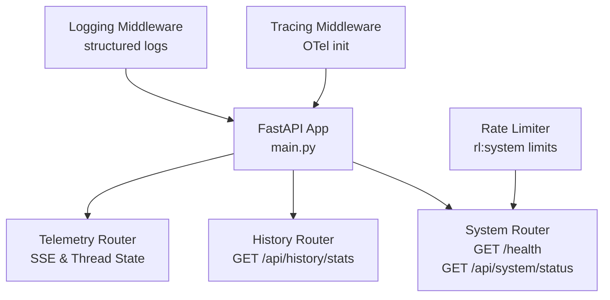
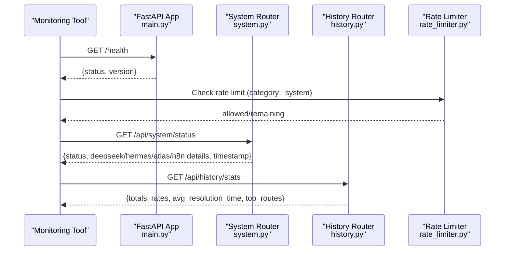
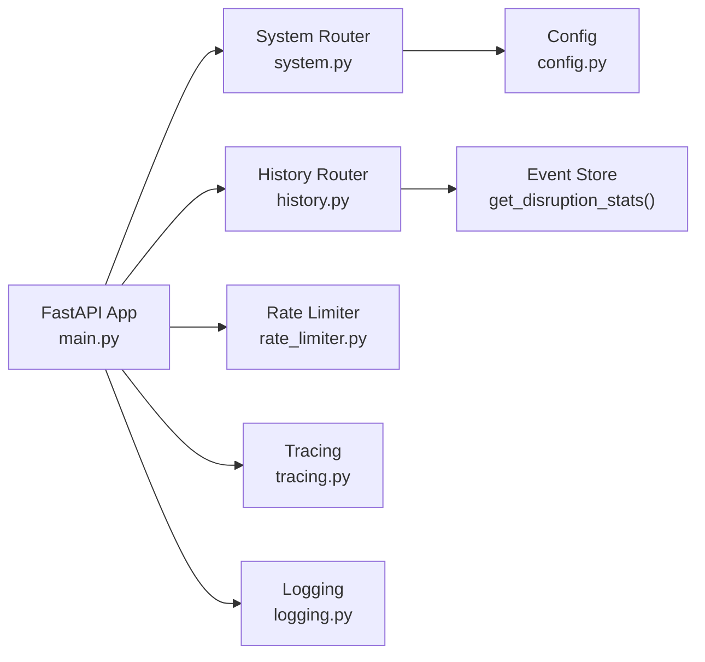

# System Monitoring Endpoints

<cite>
**Referenced Files in This Document**
- [main.py](file://travel-recovery-os/backend/main.py)
- [system.py](file://travel-recovery-os/backend/api/routers/system.py)
- [telemetry.py](file://travel-recovery-os/backend/api/routers/telemetry.py)
- [history.py](file://travel-recovery-os/backend/api/routers/history.py)
- [rate_limiter.py](file://travel-recovery-os/backend/auth/rate_limiter.py)
- [config.py](file://travel-recovery-os/backend/config.py)
- [tracing.py](file://travel-recovery-os/backend/middleware/tracing.py)
- [logging.py](file://travel-recovery-os/backend/middleware/logging.py)
</cite>

## Table of Contents
1. Introduction
2. Project Structure
3. Core Components
4. Architecture Overview
5. Detailed Component Analysis
6. Dependency Analysis
7. Performance Considerations
8. Troubleshooting Guide
9. Conclusion

## Introduction
This document provides detailed API documentation for system monitoring and health check endpoints exposed by the SynapseAir backend. It covers:
- GET /health: lightweight service availability probe
- GET /api/system/status: comprehensive system status including provider configurations and integration states
- GET /api/history/stats: operational analytics and statistics useful for monitoring dashboards and alerting
- Authentication, rate limiting, and integration patterns for monitoring tools and alerting systems

The goal is to enable reliable uptime checks, performance observability, and operational visibility for both automated systems and human operators.

## Project Structure
Monitoring-related endpoints are implemented across FastAPI routers and application lifecycle hooks:
- Application-level health endpoint at the root path
- System status endpoint under a dedicated router
- Historical analytics endpoint under a dedicated router
- Rate limiting configuration for system endpoints
- Tracing and logging middleware for observability

**Diagram sources**
- [main.py:104-122](file://travel-recovery-os/backend/main.py#L104-L122)
- [system.py:9-52](file://travel-recovery-os/backend/api/routers/system.py#L9-L52)
- [history.py:50-57](file://travel-recovery-os/backend/api/routers/history.py#L50-L57)
- [rate_limiter.py:22-29](file://travel-recovery-os/backend/auth/rate_limiter.py#L22-L29)
- [tracing.py:43-79](file://travel-recovery-os/backend/middleware/tracing.py#L43-L79)
- [logging.py:37-99](file://travel-recovery-os/backend/middleware/logging.py#L37-L99)

**Section sources**
- [main.py:104-122](file://travel-recovery-os/backend/main.py#L104-L122)
- [system.py:9-52](file://travel-recovery-os/backend/api/routers/system.py#L9-L52)
- [history.py:50-57](file://travel-recovery-os/backend/api/routers/history.py#L50-L57)
- [rate_limiter.py:22-29](file://travel-recovery-os/backend/auth/rate_limiter.py#L22-L29)
- [tracing.py:43-79](file://travel-recovery-os/backend/middleware/tracing.py#L43-L79)
- [logging.py:37-99](file://travel-recovery-os/backend/middleware/logging.py#L37-L99)

## Core Components
- Health Check Endpoint:
  - GET /health returns a minimal response indicating service readiness and version.
- System Status Endpoint:
  - GET /api/system/status returns detailed operational health including configured providers (DeepSeek, Hermes), GDS mode (Atlas CLI vs Sandbox), and n8n connectivity state.
- Analytics Endpoint:
  - GET /api/history/stats returns aggregate metrics such as total disruptions, auto-approve rates, HITL rates, average resolution time, and top disruption routes.

Authentication:
- The application description indicates that webhook and data endpoints require a Bearer token in the Authorization header. Health and system status endpoints do not explicitly enforce authentication in their handlers; however, external gateways or reverse proxies may apply additional auth policies.

Rate Limiting:
- A sliding window rate limiter is configured with per-category limits. The “system” category has a default limit of 60 requests per 60 seconds per client.

Observability:
- OpenTelemetry tracing is initialized at startup and can export spans to console and/or OTLP endpoints.
- Structured logging is enabled with optional JSON output for production environments.

**Section sources**
- [main.py:40-71](file://travel-recovery-os/backend/main.py#L40-L71)
- [main.py:119-122](file://travel-recovery-os/backend/main.py#L119-L122)
- [system.py:9-52](file://travel-recovery-os/backend/api/routers/system.py#L9-L52)
- [history.py:50-57](file://travel-recovery-os/backend/api/routers/history.py#L50-L57)
- [rate_limiter.py:22-29](file://travel-recovery-os/backend/auth/rate_limiter.py#L22-L29)
- [tracing.py:43-79](file://travel-recovery-os/backend/middleware/tracing.py#L43-L79)
- [logging.py:37-99](file://travel-recovery-os/backend/middleware/logging.py#L37-L99)

## Architecture Overview
The monitoring stack integrates health probes, system status reporting, and analytics into a cohesive observability surface.

**Diagram sources**
- [main.py:119-122](file://travel-recovery-os/backend/main.py#L119-L122)
- [system.py:24-52](file://travel-recovery-os/backend/api/routers/system.py#L24-L52)
- [history.py:50-57](file://travel-recovery-os/backend/api/routers/history.py#L50-L57)
- [rate_limiter.py:62-86](file://travel-recovery-os/backend/auth/rate_limiter.py#L62-L86)

## Detailed Component Analysis

### GET /health
- Purpose: Lightweight liveness/readiness probe for orchestrators and load balancers.
- Response schema:
  - status: string — typically "healthy"
  - version: string — application version
- Notes:
  - No body parsing or dependencies beyond app metadata.
  - Suitable for frequent polling (e.g., every 10–30 seconds).

**Section sources**
- [main.py:119-122](file://travel-recovery-os/backend/main.py#L119-L122)

### GET /api/system/status
- Purpose: Comprehensive operational health report including provider configurations and integration states.
- Response schema:
  - status: string — overall system status indicator (e.g., "HEALTHY")
  - deepseek: object
    - active: boolean — whether DeepSeek API key is configured
    - model: string — configured model name
    - endpoint: string — base URL for DeepSeek API
  - hermes: object
    - active: boolean — whether Hermes API key is configured
    - model: string — configured model name
    - endpoint: string — base URL for Hermes API
  - atlas_gds: object
    - status: string — "LIVE_CLI_ACTIVE" if Atlas CLI installed, else "SANDBOX_GDS"
    - cli_installed: boolean — presence of Atlas CLI
    - provider: string — provider type based on CLI availability
  - n8n: object
    - status: string — "CONNECTED" if webhook URL configured, else "SIMULATOR_RELAY"
    - webhook_target: string — target webhook URL or simulator label
    - api_connected: boolean — whether N8N API key is configured
  - timestamp: string — ISO timestamp of the response generation
- Notes:
  - Useful for readiness gates and dependency validation.
  - Integrates with environment-driven configuration for provider endpoints and keys.

**Section sources**
- [system.py:24-52](file://travel-recovery-os/backend/api/routers/system.py#L24-L52)
- [config.py:46-70](file://travel-recovery-os/backend/config.py#L46-L70)

### GET /api/history/stats
- Purpose: Operational analytics for monitoring dashboards and alerting thresholds.
- Response schema:
  - Aggregated metrics including:
    - totals: counts of events processed
    - auto_approve_rate: percentage of automatically approved resolutions
    - hitl_rate: percentage requiring human-in-the-loop decisions
    - average_resolution_time: typical time to resolve disruptions
    - top_routes: most common disruption routes
- Notes:
  - Ideal for trend analysis and capacity planning.
  - Can be polled periodically to update KPIs.

**Section sources**
- [history.py:50-57](file://travel-recovery-os/backend/api/routers/history.py#L50-L57)

### SSE Telemetry Stream (Supporting Observability)
- While not a traditional metrics endpoint, the Server-Sent Events stream supports real-time monitoring of agent activity and workflow progress.
- Key endpoints:
  - GET /stream/{thread_id}: streams historical events then live updates with keep-alive pings
  - GET /threads/{thread_id}/state: retrieves current thread state snapshot
- Notes:
  - Useful for debugging and live dashboards.
  - Maintains connection with periodic keep-alives to prevent timeouts.

**Section sources**
- [telemetry.py:11-46](file://travel-recovery-os/backend/api/routers/telemetry.py#L11-L46)
- [telemetry.py:48-71](file://travel-recovery-os/backend/api/routers/telemetry.py#L48-L71)

## Dependency Analysis
Monitoring endpoints depend on configuration, rate limiting, and observability middleware.

**Diagram sources**
- [main.py:104-122](file://travel-recovery-os/backend/main.py#L104-L122)
- [system.py:9-52](file://travel-recovery-os/backend/api/routers/system.py#L9-L52)
- [history.py:50-57](file://travel-recovery-os/backend/api/routers/history.py#L50-L57)
- [config.py:29-116](file://travel-recovery-os/backend/config.py#L29-L116)
- [rate_limiter.py:22-29](file://travel-recovery-os/backend/auth/rate_limiter.py#L22-L29)
- [tracing.py:43-79](file://travel-recovery-os/backend/middleware/tracing.py#L43-L79)
- [logging.py:37-99](file://travel-recovery-os/backend/middleware/logging.py#L37-L99)

**Section sources**
- [main.py:104-122](file://travel-recovery-os/backend/main.py#L104-L122)
- [system.py:9-52](file://travel-recovery-os/backend/api/routers/system.py#L9-L52)
- [history.py:50-57](file://travel-recovery-os/backend/api/routers/history.py#L50-L57)
- [config.py:29-116](file://travel-recovery-os/backend/config.py#L29-L116)
- [rate_limiter.py:22-29](file://travel-recovery-os/backend/auth/rate_limiter.py#L22-L29)
- [tracing.py:43-79](file://travel-recovery-os/backend/middleware/tracing.py#L43-L79)
- [logging.py:37-99](file://travel-recovery-os/backend/middleware/logging.py#L37-L99)

## Performance Considerations
- Health and system status endpoints are lightweight and suitable for frequent polling.
- Rate limiting protects against excessive requests:
  - Category “system”: up to 60 requests per 60 seconds per client
  - Other categories have distinct limits for webhooks, consensus, history, and streaming
- Observability overhead:
  - OpenTelemetry instrumentation adds minimal overhead; exporters can be tuned or disabled in development
  - Structured logging can be set to JSON for efficient log aggregation pipelines

[No sources needed since this section provides general guidance]

## Troubleshooting Guide
Common issues and diagnostics:
- Provider configuration missing:
  - If DeepSeek or Hermes keys are absent, the system status will reflect inactive providers. Validate environment variables and .env files.
- GDS mode mismatch:
  - Atlas GDS status indicates CLI availability; ensure the correct environment and binaries are present for live mode.
- n8n connectivity:
  - Webhook target and API key presence determine n8n status; verify URLs and credentials.
- Rate limiting errors:
  - Exceeding limits results in throttling; adjust polling frequency or implement backoff strategies.
- Observability gaps:
  - Ensure OpenTelemetry exporter endpoint is configured if using centralized tracing.
  - Enable JSON logging in production for structured log ingestion.

**Section sources**
- [system.py:24-52](file://travel-recovery-os/backend/api/routers/system.py#L24-L52)
- [config.py:46-70](file://travel-recovery-os/backend/config.py#L46-L70)
- [rate_limiter.py:62-86](file://travel-recovery-os/backend/auth/rate_limiter.py#L62-L86)
- [tracing.py:43-79](file://travel-recovery-os/backend/middleware/tracing.py#L43-L79)
- [logging.py:37-99](file://travel-recovery-os/backend/middleware/logging.py#L37-L99)

## Conclusion
The SynapseAir backend exposes robust monitoring endpoints for health checks, system status, and operational analytics. These endpoints integrate with rate limiting and observability middleware to support reliable uptime detection, performance monitoring, and alerting. Use GET /health for quick liveness probes, GET /api/system/status for dependency validation, and GET /api/history/stats for dashboard KPIs. Apply appropriate rate limiting and leverage tracing and structured logging for end-to-end visibility.

[No sources needed since this section summarizes without analyzing specific files]