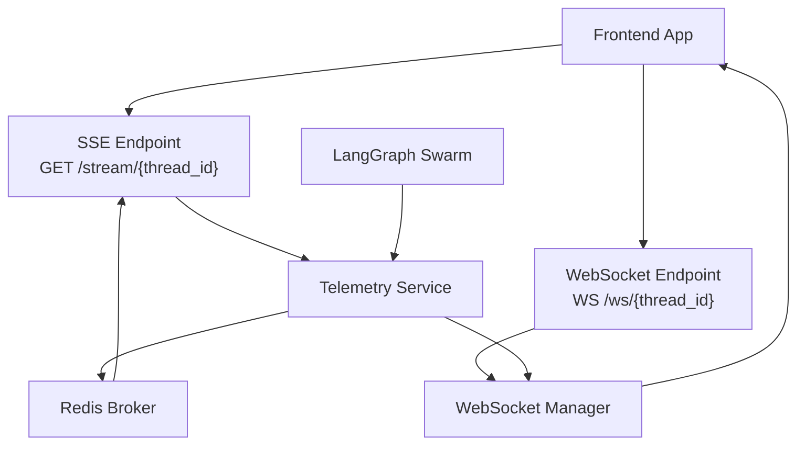
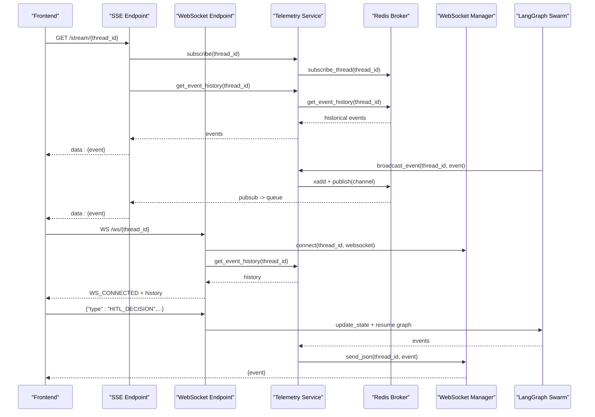
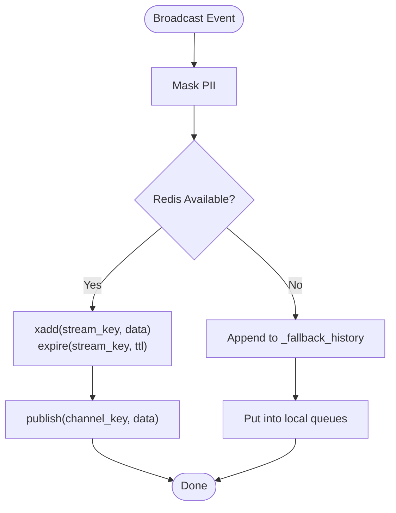
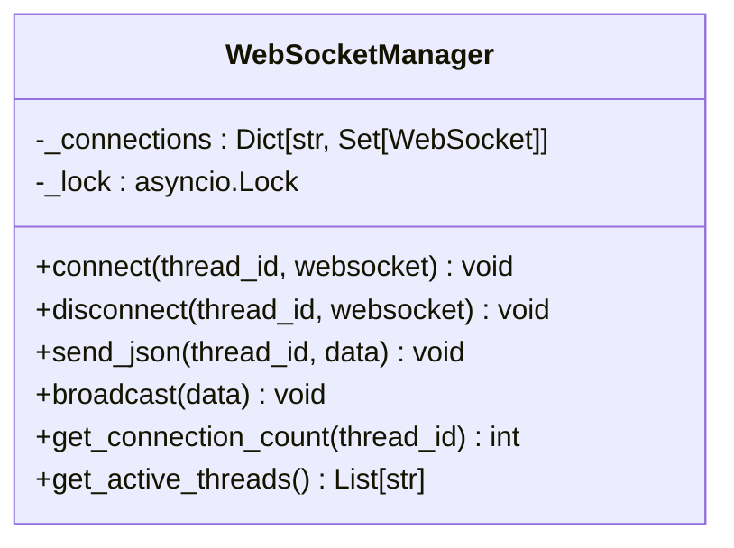
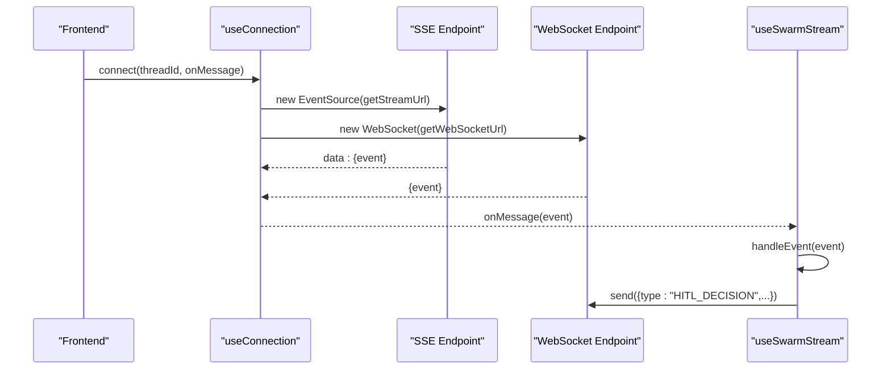
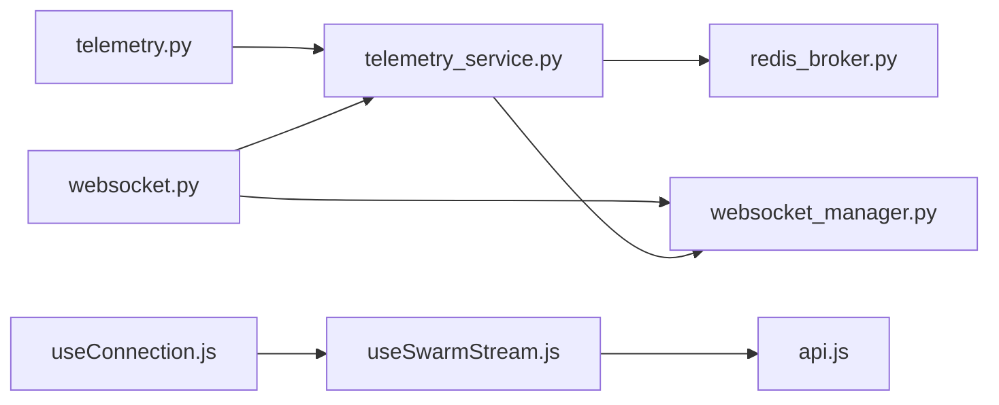

# Telemetry Streaming Endpoints

<cite>
**Referenced Files in This Document**
- [telemetry.py](file://travel-recovery-os/backend/api/routers/telemetry.py)
- [websocket.py](file://travel-recovery-os/backend/api/routers/websocket.py)
- [telemetry_service.py](file://travel-recovery-os/backend/services/telemetry_service.py)
- [redis_broker.py](file://travel-recovery-os/backend/store/redis_broker.py)
- [websocket_manager.py](file://travel-recovery-os/backend/services/websocket_manager.py)
- [api_models.py](file://travel-recovery-os/backend/schemas/api_models.py)
- [useSwarmStream.js](file://travel-recovery-os/frontend/src/composables/useSwarmStream.js)
- [useConnection.js](file://travel-recovery-os/frontend/src/composables/useConnection.js)
- [api.js](file://travel-recovery-os/frontend/src/services/api.js)
- [swarm.py](file://travel-recovery-os/backend/swarm.py)
</cite>

## Table of Contents
1. [Introduction](#introduction)
2. [Project Structure](#project-structure)
3. [Core Components](#core-components)
4. [Architecture Overview](#architecture-overview)
5. [Detailed Component Analysis](#detailed-component-analysis)
6. [Dependency Analysis](#dependency-analysis)
7. [Performance Considerations](#performance-considerations)
8. [Troubleshooting Guide](#troubleshooting-guide)
9. [Conclusion](#conclusion)
10. [Appendices](#appendices)

## Introduction
This document provides detailed API documentation for real-time telemetry streaming endpoints that power live dashboards and interactive control of running workflows. It covers:
- Server-Sent Events (SSE) endpoint for streaming agent execution logs, state updates, and workflow progress.
- WebSocket endpoint for bidirectional communication to send HITL decisions and receive live events.
- Event types and payload schemas used across the system.
- Connection management, reconnection strategies, message queuing, and client implementation patterns.

The design ensures durable event replay via Redis Streams with a fallback to in-memory storage when Redis is unavailable, enabling robust real-time experiences even under partial outages.

## Project Structure
Key backend components involved in telemetry streaming:
- FastAPI routers expose SSE and WebSocket endpoints.
- Services manage subscriptions, broadcasting, and connection lifecycles.
- Redis-backed broker handles pub/sub fan-out and stream persistence.
- Frontend composables implement transport layer abstraction (WebSocket primary, SSE fallback).

**Diagram sources**
- [telemetry.py:11-46](file://travel-recovery-os/backend/api/routers/telemetry.py#L11-L46)
- [websocket.py:21-92](file://travel-recovery-os/backend/api/routers/websocket.py#L21-L92)
- [telemetry_service.py:45-68](file://travel-recovery-os/backend/services/telemetry_service.py#L45-L68)
- [redis_broker.py:86-179](file://travel-recovery-os/backend/store/redis_broker.py#L86-L179)
- [websocket_manager.py:16-74](file://travel-recovery-os/backend/services/websocket_manager.py#L16-L74)
- [swarm.py:162-200](file://travel-recovery-os/backend/swarm.py#L162-L200)

**Section sources**
- [telemetry.py:11-72](file://travel-recovery-os/backend/api/routers/telemetry.py#L11-L72)
- [websocket.py:21-195](file://travel-recovery-os/backend/api/routers/websocket.py#L21-L195)
- [telemetry_service.py:23-79](file://travel-recovery-os/backend/services/telemetry_service.py#L23-L79)
- [redis_broker.py:29-179](file://travel-recovery-os/backend/store/redis_broker.py#L29-L179)
- [websocket_manager.py:16-74](file://travel-recovery-os/backend/services/websocket_manager.py#L16-L74)
- [useConnection.js:24-98](file://travel-recovery-os/frontend/src/composables/useConnection.js#L24-L98)
- [useSwarmStream.js:98-280](file://travel-recovery-os/frontend/src/composables/useSwarmStream.js#L98-L280)

## Core Components
- SSE Endpoint: Streams historical events then live events with keep-alive pings; supports thread-scoped subscriptions and automatic cleanup on disconnect.
- WebSocket Endpoint: Provides bidirectional channel for HITL decisions and live event streaming; replays history on connect and broadcasts consensus results.
- Telemetry Service: Masks PII before broadcast, persists events to Redis Streams, fans out via Pub/Sub, and integrates with WebSocket manager.
- Redis Broker: Durable event bus with TTL-based streams and in-memory fallback; manages subscription queues and history retrieval.
- WebSocket Manager: Tracks per-thread connections, sends messages to all clients, cleans up dead connections, and exposes helpers for active threads and counts.

**Section sources**
- [telemetry.py:11-72](file://travel-recovery-os/backend/api/routers/telemetry.py#L11-L72)
- [websocket.py:21-195](file://travel-recovery-os/backend/api/routers/websocket.py#L21-L195)
- [telemetry_service.py:23-79](file://travel-recovery-os/backend/services/telemetry_service.py#L23-L79)
- [redis_broker.py:86-179](file://travel-recovery-os/backend/store/redis_broker.py#L86-L179)
- [websocket_manager.py:16-74](file://travel-recovery-os/backend/services/websocket_manager.py#L16-L74)

## Architecture Overview
The streaming architecture combines SSE for reliable log streaming and WebSocket for interactive control. Events are produced by the LangGraph swarm and routed through the telemetry service into Redis Streams and Pub/Sub channels. Clients subscribe via SSE or WebSocket; both receive historical events first, then live updates.

**Diagram sources**
- [telemetry.py:11-46](file://travel-recovery-os/backend/api/routers/telemetry.py#L11-L46)
- [websocket.py:21-92](file://travel-recovery-os/backend/api/routers/websocket.py#L21-L92)
- [telemetry_service.py:45-68](file://travel-recovery-os/backend/services/telemetry_service.py#L45-L68)
- [redis_broker.py:86-179](file://travel-recovery-os/backend/store/redis_broker.py#L86-L179)
- [websocket_manager.py:26-60](file://travel-recovery-os/backend/services/websocket_manager.py#L26-L60)
- [swarm.py:162-200](file://travel-recovery-os/backend/swarm.py#L162-L200)

## Detailed Component Analysis

### SSE Endpoint: GET /stream/{thread_id}
- Purpose: Stream agent execution logs, state updates, and workflow progress in real time.
- Behavior:
  - Subscribes to thread-scoped queue.
  - Replays historical events from Redis Streams (or in-memory fallback).
  - Streams live events with 15-second timeout producing keep-alive comments.
  - Cleans up subscription on disconnect.
- Headers:
  - Cache-Control: no-cache
  - Connection: keep-alive
  - X-Accel-Buffering: no

Event flow highlights:
- History replay ensures clients catch up on missed events.
- Keep-alive prevents idle connection timeouts.
- Unsubscribe guarantees resource cleanup.

**Section sources**
- [telemetry.py:11-46](file://travel-recovery-os/backend/api/routers/telemetry.py#L11-L46)
- [redis_broker.py:123-179](file://travel-recovery-os/backend/store/redis_broker.py#L123-L179)

### WebSocket Endpoint: WS /ws/{thread_id}
- Purpose: Bidirectional communication for HITL decisions and live event streaming.
- Behavior:
  - Accepts connection and sends WS_CONNECTED confirmation.
  - Replays historical events.
  - Listens for client messages:
    - PING → PONG
    - HITL_DECISION → processes consensus, updates state, resumes graph if approved, broadcasts CONSENSUS_RECEIVED.
  - Sends errors via WS_ERROR.
  - On disconnect, removes connection from manager.

Message types:
- Server-to-client:
  - WS_CONNECTED
  - AGENT_STEP
  - WORKFLOW_COMPLETE
  - WORKFLOW_ERROR
  - CONSENSUS_RECEIVED
  - WS_ERROR
- Client-to-server:
  - PING
  - HITL_DECISION

**Section sources**
- [websocket.py:21-195](file://travel-recovery-os/backend/api/routers/websocket.py#L21-L195)
- [websocket_manager.py:26-60](file://travel-recovery-os/backend/services/websocket_manager.py#L26-L60)

### Telemetry Service and Redis Broker
- Telemetry Service:
  - Masks PII fields (phone_number, passenger_name) before broadcast.
  - Broadcasts events to Redis and WebSocket manager.
  - Manages subscribe/unsubscribe and history retrieval.
- Redis Broker:
  - Persists events to Redis Streams with maxlen and TTL.
  - Publishes to Pub/Sub channels for live fan-out.
  - Falls back to in-memory queues/history when Redis is unavailable.
  - Provides background pubsub reader to enqueue events for SSE subscribers.

**Diagram sources**
- [telemetry_service.py:23-68](file://travel-recovery-os/backend/services/telemetry_service.py#L23-L68)
- [redis_broker.py:86-179](file://travel-recovery-os/backend/store/redis_broker.py#L86-L179)

**Section sources**
- [telemetry_service.py:23-79](file://travel-recovery-os/backend/services/telemetry_service.py#L23-L79)
- [redis_broker.py:29-179](file://travel-recovery-os/backend/store/redis_broker.py#L29-L179)

### WebSocket Manager
- Tracks per-thread connections using sets.
- Thread-safe connect/disconnect with async locks.
- Broadcasts JSON messages to all connected clients for a thread.
- Cleans up dead connections after failed sends.
- Exposes helpers for connection counts and active threads.

**Diagram sources**
- [websocket_manager.py:16-74](file://travel-recovery-os/backend/services/websocket_manager.py#L16-L74)

**Section sources**
- [websocket_manager.py:16-74](file://travel-recovery-os/backend/services/websocket_manager.py#L16-L74)

### Frontend Transport Layer
- useConnection:
  - Opens SSE as primary transport and WebSocket as secondary for bidirectional messaging.
  - Maintains connection mode state ('sse' | 'websocket' | 'none').
  - Parses incoming JSON events and forwards to handler.
  - Closes connections on unmount or explicit disconnect.
- useSwarmStream:
  - Orchestrates event handling for AGENT_STEP, HITL_REQUIRED, WORKFLOW_NODE_ERROR, WORKFLOW_COMPLETE.
  - Updates UI state (active agent, proposed solution, ticket receipt).
  - Triggers disruption start and resolves HITL decisions via WebSocket and REST fallback.

**Diagram sources**
- [useConnection.js:24-98](file://travel-recovery-os/frontend/src/composables/useConnection.js#L24-L98)
- [useSwarmStream.js:98-280](file://travel-recovery-os/frontend/src/composables/useSwarmStream.js#L98-L280)
- [api.js:4-21](file://travel-recovery-os/frontend/src/services/api.js#L4-L21)

**Section sources**
- [useConnection.js:24-107](file://travel-recovery-os/frontend/src/composables/useConnection.js#L24-L107)
- [useSwarmStream.js:98-280](file://travel-recovery-os/frontend/src/composables/useSwarmStream.js#L98-L280)
- [api.js:4-21](file://travel-recovery-os/frontend/src/services/api.js#L4-L21)

## Dependency Analysis
- Routers depend on services for event handling and state inspection.
- Telemetry Service depends on Redis Broker for persistence and fan-out; also integrates with WebSocket Manager for multi-client broadcast.
- WebSocket Manager maintains connection state and delegates sending to individual WebSocket instances.
- Frontend composable abstracts transport details and centralizes event routing logic.

**Diagram sources**
- [telemetry.py:11-72](file://travel-recovery-os/backend/api/routers/telemetry.py#L11-L72)
- [websocket.py:21-195](file://travel-recovery-os/backend/api/routers/websocket.py#L21-L195)
- [telemetry_service.py:45-79](file://travel-recovery-os/backend/services/telemetry_service.py#L45-L79)
- [redis_broker.py:86-179](file://travel-recovery-os/backend/store/redis_broker.py#L86-L179)
- [websocket_manager.py:16-74](file://travel-recovery-os/backend/services/websocket_manager.py#L16-L74)
- [useConnection.js:24-98](file://travel-recovery-os/frontend/src/composables/useConnection.js#L24-L98)
- [useSwarmStream.js:98-280](file://travel-recovery-os/frontend/src/composables/useSwarmStream.js#L98-L280)
- [api.js:4-21](file://travel-recovery-os/frontend/src/services/api.js#L4-L21)

**Section sources**
- [telemetry.py:11-72](file://travel-recovery-os/backend/api/routers/telemetry.py#L11-L72)
- [websocket.py:21-195](file://travel-recovery-os/backend/api/routers/websocket.py#L21-L195)
- [telemetry_service.py:45-79](file://travel-recovery-os/backend/services/telemetry_service.py#L45-L79)
- [redis_broker.py:86-179](file://travel-recovery-os/backend/store/redis_broker.py#L86-L179)
- [websocket_manager.py:16-74](file://travel-recovery-os/backend/services/websocket_manager.py#L16-L74)
- [useConnection.js:24-98](file://travel-recovery-os/frontend/src/composables/useConnection.js#L24-L98)
- [useSwarmStream.js:98-280](file://travel-recovery-os/frontend/src/composables/useSwarmStream.js#L98-L280)
- [api.js:4-21](file://travel-recovery-os/frontend/src/services/api.js#L4-L21)

## Performance Considerations
- Redis Streams with maxlen and TTL ensure bounded memory usage and automatic cleanup of old events.
- Pub/Sub enables low-latency fan-out to multiple SSE clients without blocking producers.
- In-memory fallback maintains availability when Redis is down, at the cost of durability.
- Keep-alive comments every 15 seconds prevent proxy/firewall timeouts on SSE connections.
- WebSocket manager cleans up dead connections to avoid resource leaks.

[No sources needed since this section provides general guidance]

## Troubleshooting Guide
Common issues and resolutions:
- No events received on SSE:
  - Verify thread_id is correct and active.
  - Check Redis connectivity and environment variables (REDIS_URL, USE_REDIS).
  - Confirm subscription queue creation and pubsub listener tasks.
- WebSocket not receiving events:
  - Ensure WS_CONNECTED is received and history replay completes.
  - Validate connection registration in WebSocket Manager and absence of dead connections.
- HITL decisions not applied:
  - Confirm HITL_DECISION payload structure and thread_id.
  - Check state updates and graph resumption tasks.
- High latency or dropped events:
  - Monitor Redis performance and stream backlog.
  - Inspect frontend connection mode and reconnection behavior.

**Section sources**
- [redis_broker.py:42-62](file://travel-recovery-os/backend/store/redis_broker.py#L42-L62)
- [redis_broker.py:195-218](file://travel-recovery-os/backend/store/redis_broker.py#L195-L218)
- [websocket_manager.py:42-60](file://travel-recovery-os/backend/services/websocket_manager.py#L42-L60)
- [websocket.py:95-140](file://travel-recovery-os/backend/api/routers/websocket.py#L95-L140)

## Conclusion
The telemetry streaming system provides robust, real-time visibility into agent execution and workflow progress through SSE and WebSocket endpoints. With Redis-backed persistence, PII masking, and resilient fallbacks, it supports scalable dashboard integration and interactive HITL workflows. The frontend abstractions simplify transport selection and event handling, enabling responsive user experiences.

[No sources needed since this section summarizes without analyzing specific files]

## Appendices

### Event Types and Payload Schemas
- AGENT_STEP
  - Occurs when an agent node executes and emits logs/state updates.
  - Typical fields: type, thread_id, timestamp, node, log, state_update.
  - Produced by swarm execution and broadcast via telemetry service.
- STATE_UPDATE
  - Represents changes in workflow state; often embedded within AGENT_STEP payloads under state_update.
  - Fields vary by node but commonly include context like candidate_routes, selected_route, baggage_context, compensation_result, ticket_confirmation.
- WORKFLOW_COMPLETE
  - Emitted when the workflow finishes successfully.
  - Includes thread_id, timestamp, message, and optional ticket or ticket_confirmation.
- ERROR
  - Error events may be surfaced as WORKFLOW_ERROR or WORKFLOW_NODE_ERROR depending on context.
  - Include thread_id, timestamp, message, and error details where applicable.
- Additional WebSocket-specific events:
  - WS_CONNECTED: Confirmation upon successful WebSocket connection.
  - PING/PONG: Heartbeat mechanism for liveness checks.
  - HITL_DECISION: Client-initiated decision to approve or reject a proposed action.
  - CONSENSUS_RECEIVED: Acknowledgment of HITL decision with notes and source.
  - WS_ERROR: Error details for invalid messages or processing failures.

Note: Payload structures are inferred from router and service implementations; clients should parse events dynamically and handle unknown fields gracefully.

**Section sources**
- [websocket.py:21-195](file://travel-recovery-os/backend/api/routers/websocket.py#L21-L195)
- [telemetry_service.py:23-68](file://travel-recovery-os/backend/services/telemetry_service.py#L23-L68)
- [useSwarmStream.js:98-280](file://travel-recovery-os/frontend/src/composables/useSwarmStream.js#L98-L280)

### Connection Management and Reconnection Strategies
- SSE:
  - Use EventSource for automatic reconnection; handle onerror and reconnect delays.
  - Expect keep-alive comments to maintain connection liveness.
- WebSocket:
  - Implement reconnection with exponential backoff on close/error.
  - Send periodic PING messages to detect liveness.
  - On reconnect, expect WS_CONNECTED and history replay to synchronize state.
- Message Queuing:
  - Redis Streams provide durable history; clients can request replay on reconnect.
  - In-memory fallback ensures continuity during Redis outages.

**Section sources**
- [useConnection.js:24-98](file://travel-recovery-os/frontend/src/composables/useConnection.js#L24-L98)
- [redis_broker.py:86-179](file://travel-recovery-os/backend/store/redis_broker.py#L86-L179)
- [websocket.py:21-92](file://travel-recovery-os/backend/api/routers/websocket.py#L21-L92)

### Client Implementation Patterns for Real-Time Dashboard Integration
- Prefer WebSocket for bidirectional control (HITL decisions) and SSE for high-throughput log streaming.
- Centralize event routing in a single handler to update UI state consistently.
- Maintain thread-scoped state for each active workflow (agent status, proposed solutions, ticket receipts).
- Handle errors gracefully and surface actionable messages to users.
- Use REST endpoints for durability-critical actions (e.g., consensus resolution) alongside WebSocket for immediate feedback.

**Section sources**
- [useSwarmStream.js:98-280](file://travel-recovery-os/frontend/src/composables/useSwarmStream.js#L98-L280)
- [api.js:30-55](file://travel-recovery-os/frontend/src/services/api.js#L30-L55)