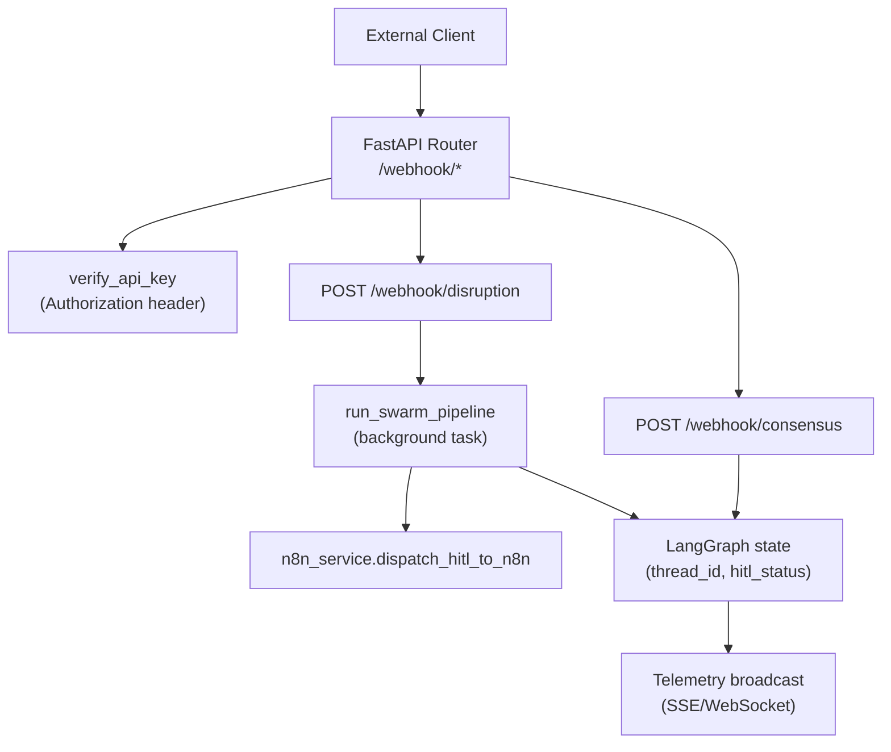
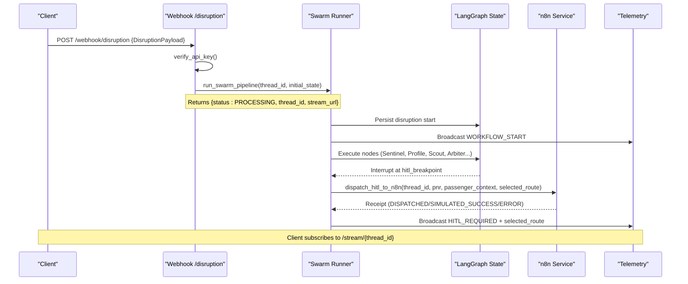
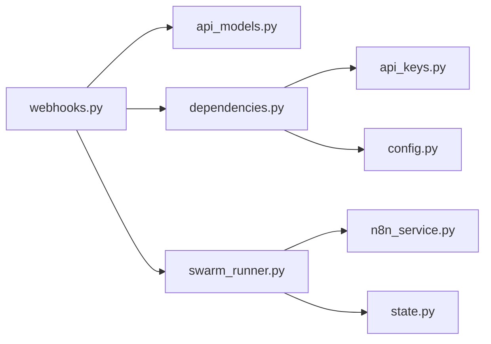

# Webhook Endpoints

<cite>
**Referenced Files in This Document**
- [webhooks.py](file://travel-recovery-os/backend/api/routers/webhooks.py)
- [api_models.py](file://travel-recovery-os/backend/schemas/api_models.py)
- [dependencies.py](file://travel-recovery-os/backend/api/dependencies.py)
- [api_keys.py](file://travel-recovery-os/backend/auth/api_keys.py)
- [config.py](file://travel-recovery-os/backend/config.py)
- [swarm_runner.py](file://travel-recovery-os/backend/services/swarm_runner.py)
- [n8n_service.py](file://travel-recovery-os/backend/services/n8n_service.py)
- [state.py](file://travel-recovery-os/backend/state.py)
- [main.py](file://travel-recovery-os/backend/main.py)
</cite>

## Table of Contents
1. [Introduction](#introduction)
2. [Project Structure](#project-structure)
3. [Core Components](#core-components)
4. [Architecture Overview](#architecture-overview)
5. [Detailed Component Analysis](#detailed-component-analysis)
6. [Dependency Analysis](#dependency-analysis)
7. [Performance Considerations](#performance-considerations)
8. [Troubleshooting Guide](#troubleshooting-guide)
9. [Conclusion](#conclusion)
10. [Appendices](#appendices)

## Introduction
This document provides comprehensive API documentation for the webhook endpoints that handle flight disruption events and passenger decisions in the SynapseAir Travel Recovery OS. It covers:
- POST /webhook/disruption: Ingests structured or raw-text flight cancellation/delay events, triggers a multi-agent recovery workflow, and returns a thread_id for tracking.
- POST /webhook/consensus: Receives passenger HITL decisions (APPROVE/REJECT) from WhatsApp or in-app interfaces to resume or stop the workflow.

It also documents authentication using API keys, error handling scenarios, thread_id management, and integration patterns with external systems like n8n workflows.

## Project Structure
The webhooks are implemented as FastAPI routes under the backend API routers, with request/response models defined in schemas, authentication via dependencies, and background execution through a swarm runner that integrates with n8n for WhatsApp HITL flows.

**Diagram sources**
- [webhooks.py:12-72](file://travel-recovery-os/backend/api/routers/webhooks.py#L12-L72)
- [webhooks.py:74-185](file://travel-recovery-os/backend/api/routers/webhooks.py#L74-L185)
- [dependencies.py:25-78](file://travel-recovery-os/backend/api/dependencies.py#L25-L78)
- [swarm_runner.py:36-216](file://travel-recovery-os/backend/services/swarm_runner.py#L36-L216)
- [n8n_service.py:51-202](file://travel-recovery-os/backend/services/n8n_service.py#L51-L202)

**Section sources**
- [main.py:104-108](file://travel-recovery-os/backend/main.py#L104-L108)
- [webhooks.py:12-72](file://travel-recovery-os/backend/api/routers/webhooks.py#L12-L72)
- [webhooks.py:74-185](file://travel-recovery-os/backend/api/routers/webhooks.py#L74-L185)

## Core Components
- Request Models:
  - DisruptionPayload: Supports either structured fields (pnr, flight_number, airline, origin, destination, scheduled_departure, delay_minutes, reason, loyalty_tier, passenger_name, passenger_phone) or raw_text for AI parsing; optional thread_id and n8n_webhook_url override.
  - ConsensusPayload: Requires thread_id and action (APPROVE/REJECT), with optional selected_flight_id and notes.
- Authentication:
  - All webhook endpoints require an Authorization header with a Bearer token. The dependency supports legacy static key, JWT, and managed API keys.
- Background Execution:
  - Disruption ingestion starts a background swarm pipeline that persists events, streams telemetry, and dispatches HITL notifications to n8n when required.
- Thread Management:
  - thread_id is used to correlate all events, state updates, and streaming telemetry for a single disruption session.

**Section sources**
- [api_models.py:5-79](file://travel-recovery-os/backend/schemas/api_models.py#L5-L79)
- [api_models.py:81-101](file://travel-recovery-os/backend/schemas/api_models.py#L81-L101)
- [dependencies.py:25-78](file://travel-recovery-os/backend/api/dependencies.py#L25-L78)
- [swarm_runner.py:36-216](file://travel-recovery-os/backend/services/swarm_runner.py#L36-L216)

## Architecture Overview
The system ingests disruption events, runs a multi-agent recovery workflow, pauses at a human-in-the-loop breakpoint to obtain passenger approval, and resumes to finalize rebooking. External integrations include n8n for WhatsApp HITL and Atlas GDS for flight search/booking.

**Diagram sources**
- [webhooks.py:14-72](file://travel-recovery-os/backend/api/routers/webhooks.py#L14-L72)
- [swarm_runner.py:36-176](file://travel-recovery-os/backend/services/swarm_runner.py#L36-L176)
- [n8n_service.py:51-202](file://travel-recovery-os/backend/services/n8n_service.py#L51-L202)

## Detailed Component Analysis

### Endpoint: POST /webhook/disruption
- Purpose: Ingest flight disruption events (structured or raw text) and trigger the recovery swarm.
- Authentication: Required via Authorization header (Bearer token). See Authentication section below.
- Request Schema:
  - raw_text: Optional string for AI parsing; if provided, structured fields are optional fallbacks.
  - pnr: Optional string; booking reference.
  - flight_number: Optional string; IATA flight number.
  - airline: Optional string; operating airline name.
  - origin: Optional string; origin airport IATA code.
  - destination: Optional string; destination airport IATA code.
  - scheduled_departure: Optional string; date/time format YYYY-MM-DD HH:MM.
  - delay_minutes: Optional integer; delay duration in minutes.
  - reason: Optional string; human-readable disruption reason.
  - loyalty_tier: Optional string; PLATINUM, GOLD, SILVER, STANDARD.
  - passenger_name: Optional string; full passenger name.
  - passenger_phone: Optional string; phone for WhatsApp HITL notifications.
  - n8n_webhook_url: Optional string; per-request override for n8n webhook URL.
  - thread_id: Optional string; custom thread ID; auto-generated if omitted.
- Response:
  - 200 OK: JSON with status "PROCESSING", thread_id, stream_url (/stream/{thread_id}), and message confirming initiation.
  - 401 Unauthorized: Missing or invalid API key.
- Behavior:
  - Creates initial state with disruption event and passenger context.
  - Starts background swarm pipeline execution.
  - Persists disruption start to SQLite for history.
  - Emits telemetry events for workflow start and subsequent steps.

Example Request (JSON):
{
  "raw_text": "URGENT NOTAM: CZ3042 KUL-HGH canceled due to typhoon. PNR 8842.",
  "pnr": "PNR-8842",
  "flight_number": "CZ-3042",
  "airline": "China Southern Airlines",
  "origin": "KUL",
  "destination": "HGH",
  "scheduled_departure": "2026-08-25 09:30",
  "delay_minutes": 240,
  "reason": "Severe Weather / Typhoon Flow Control",
  "loyalty_tier": "GOLD",
  "passenger_name": "Sarah Jenkins",
  "passenger_phone": "+60 12-345 6789",
  "thread_id": "synapse-123456",
  "n8n_webhook_url": "https://your-n8n-instance.com/webhook/hitl"
}

Example Response (JSON):
{
  "status": "PROCESSING",
  "thread_id": "synapse-123456",
  "stream_url": "/stream/synapse-123456",
  "message": "SynapseAir Swarm initiated for thread synapse-123456."
}

Error Scenarios:
- 401 Unauthorized: Missing or invalid Authorization header.
- Validation errors: If required fields are missing or malformed (Pydantic validation).
- Background errors: Workflow errors are emitted via telemetry; final status can be inspected via history or stream.

Thread_id Management:
- If not provided, a unique thread_id is generated automatically.
- Use this thread_id to subscribe to streaming telemetry and to submit consensus decisions.

Integration with n8n:
- Optionally provide n8n_webhook_url to route HITL notifications to your n8n instance.
- The system will send a structured payload including passenger details, recommended flight, and quick reply buttons for APPROVE/REJECT.

**Section sources**
- [webhooks.py:14-72](file://travel-recovery-os/backend/api/routers/webhooks.py#L14-L72)
- [api_models.py:5-79](file://travel-recovery-os/backend/schemas/api_models.py#L5-L79)
- [dependencies.py:25-78](file://travel-recovery-os/backend/api/dependencies.py#L25-L78)
- [swarm_runner.py:36-176](file://travel-recovery-os/backend/services/swarm_runner.py#L36-L176)
- [n8n_service.py:51-202](file://travel-recovery-os/backend/services/n8n_service.py#L51-L202)

### Endpoint: POST /webhook/consensus
- Purpose: Receive passenger HITL decisions (APPROVE/REJECT) from WhatsApp or in-app interfaces to resume or stop the recovery workflow.
- Authentication: Required via Authorization header (Bearer token).
- Request Schema:
  - thread_id: Required string; swarm thread ID to resume.
  - action: Required string; APPROVE or REJECT.
  - selected_flight_id: Optional string; ID of the selected alternative flight (if multiple options were presented).
  - notes: Optional string; additional notes from the passenger.
- Response:
  - 200 OK: JSON indicating RESUMED or REJECTED status, thread_id, action, and message.
  - 401 Unauthorized: Missing or invalid API key.
  - 404 Not Found: No active session found for the given thread_id.
- Behavior:
  - Retrieves current LangGraph state for the thread.
  - Updates hitl_status based on action (APPROVED or REJECTED).
  - If APPROVED, resumes the graph asynchronously and broadcasts agent steps and completion events.
  - If REJECTED, stops the workflow and returns a rejection response.

Example Request (JSON):
{
  "thread_id": "synapse-123456",
  "action": "APPROVE",
  "selected_flight_id": "FL-98765",
  "notes": "Approved via WhatsApp 1-click CTA"
}

Example Response (JSON):
{
  "status": "RESUMED",
  "thread_id": "synapse-123456",
  "action": "APPROVED",
  "message": "Graph resumed from checkpointer to finalize ticket."
}

Error Scenarios:
- 401 Unauthorized: Missing or invalid Authorization header.
- 404 Not Found: thread_id does not correspond to an active session.
- Resume errors: If resuming the graph fails, a WORKFLOW_ERROR event is broadcast.

Thread_id Management:
- Must match the thread_id returned by the disruption endpoint.
- Used to update state and resume execution at the correct checkpoint.

Integration with n8n:
- n8n sends this endpoint back via the consensus callback configured in the HITL notification payload.
- Ensure your n8n workflow posts to this endpoint with the correct thread_id and action.

**Section sources**
- [webhooks.py:74-185](file://travel-recovery-os/backend/api/routers/webhooks.py#L74-L185)
- [api_models.py:81-101](file://travel-recovery-os/backend/schemas/api_models.py#L81-L101)
- [dependencies.py:25-78](file://travel-recovery-os/backend/api/dependencies.py#L25-L78)

### Authentication Requirements
- Header: Authorization: Bearer <token>
- Supported modes:
  - Legacy static key (SYNAPSE_API_SECRET)
  - JWT Bearer token
  - Managed API key (via APIKeyManager)
- Scope checking: Additional scope-based authorization available via dependency factories.
- Rate limiting: Per-category rate limiting supported via middleware.

Configuration:
- SYNAPSE_API_SECRET: Default secret for development; must be changed in production.
- REQUIRE_AUTH: When true, requires valid Authorization header even in development.
- JWT settings: JWT_SECRET_KEY, JWT_ALGORITHM, JWT_EXPIRE_MINUTES.

**Section sources**
- [dependencies.py:25-78](file://travel-recovery-os/backend/api/dependencies.py#L25-L78)
- [api_keys.py:32-83](file://travel-recovery-os/backend/auth/api_keys.py#L32-L83)
- [config.py:39-77](file://travel-recovery-os/backend/config.py#L39-L77)

### Error Handling Scenarios
- 401 Unauthorized: Missing or invalid API key.
- 404 Not Found: No active session for thread_id in consensus endpoint.
- Background workflow errors: Emitted via telemetry events (WORKFLOW_NODE_ERROR, WORKFLOW_ERROR).
- n8n dispatch errors: Circuit breaker and retry logic; errors persisted to SQLite event store.

Recovery:
- Inspect telemetry stream for detailed logs and error messages.
- Use history endpoints to query past disruptions and their outcomes.

**Section sources**
- [webhooks.py:14-185](file://travel-recovery-os/backend/api/routers/webhooks.py#L14-L185)
- [swarm_runner.py:96-216](file://travel-recovery-os/backend/services/swarm_runner.py#L96-L216)
- [n8n_service.py:127-202](file://travel-recovery-os/backend/services/n8n_service.py#L127-L202)

### Integration Patterns with n8n Workflows
- HITL Notification:
  - System dispatches a structured payload to your n8n webhook with passenger details, recommended flight, and quick reply buttons.
  - Payload includes consensus_callback with approve/reject payloads and target URL.
- Consensus Callback:
  - n8n posts back to /webhook/consensus with thread_id and action (APPROVE/REJECT).
  - System updates state and resumes or stops the workflow accordingly.
- Resilience:
  - Retry with backoff and circuit breaker protect against n8n unavailability.
  - All interactions are recorded in SQLite for audit and debugging.

**Section sources**
- [n8n_service.py:51-202](file://travel-recovery-os/backend/services/n8n_service.py#L51-L202)
- [config.py:56-60](file://travel-recovery-os/backend/config.py#L56-L60)

## Dependency Analysis
The webhooks depend on several core components:
- Request validation via Pydantic models.
- Authentication via dependency injection.
- Background execution via swarm runner.
- State management via LangGraph.
- External integration via n8n service.

**Diagram sources**
- [webhooks.py:1-185](file://travel-recovery-os/backend/api/routers/webhooks.py#L1-L185)
- [api_models.py:1-134](file://travel-recovery-os/backend/schemas/api_models.py#L1-L134)
- [dependencies.py:1-130](file://travel-recovery-os/backend/api/dependencies.py#L1-L130)
- [swarm_runner.py:1-216](file://travel-recovery-os/backend/services/swarm_runner.py#L1-L216)
- [n8n_service.py:1-257](file://travel-recovery-os/backend/services/n8n_service.py#L1-L257)
- [state.py:1-167](file://travel-recovery-os/backend/state.py#L1-L167)
- [api_keys.py:1-98](file://travel-recovery-os/backend/auth/api_keys.py#L1-L98)
- [config.py:1-116](file://travel-recovery-os/backend/config.py#L1-L116)

**Section sources**
- [webhooks.py:1-185](file://travel-recovery-os/backend/api/routers/webhooks.py#L1-L185)
- [swarm_runner.py:1-216](file://travel-recovery-os/backend/services/swarm_runner.py#L1-L216)
- [n8n_service.py:1-257](file://travel-recovery-os/backend/services/n8n_service.py#L1-L257)

## Performance Considerations
- Asynchronous Processing: Disruption ingestion returns immediately; heavy processing occurs in background tasks.
- Streaming Telemetry: Real-time updates via SSE/WebSocket allow clients to monitor progress without polling.
- Resilience: Retry with backoff and circuit breaker protect against external service failures.
- State Persistence: SQLite stores disruption records and n8n interactions for auditability and debugging.

[No sources needed since this section provides general guidance]

## Troubleshooting Guide
Common Issues:
- 401 Unauthorized: Ensure Authorization header is present and valid. Check environment configuration for SYNAPSE_API_SECRET or JWT settings.
- 404 Not Found: Verify thread_id matches an active session. Check if the disruption workflow completed or errored.
- n8n Dispatch Errors: Review SQLite event store for dispatch receipts and error messages. Check n8n webhook availability and configuration.

Debugging Steps:
- Subscribe to the stream URL returned by the disruption endpoint to observe real-time events.
- Query history endpoints to inspect past disruptions and their outcomes.
- Validate n8n webhook URL and callback configuration in environment settings.

**Section sources**
- [webhooks.py:14-185](file://travel-recovery-os/backend/api/routers/webhooks.py#L14-L185)
- [swarm_runner.py:96-216](file://travel-recovery-os/backend/services/swarm_runner.py#L96-L216)
- [n8n_service.py:127-202](file://travel-recovery-os/backend/services/n8n_service.py#L127-L202)

## Conclusion
The SynapseAir webhook endpoints provide a robust mechanism for ingesting flight disruption events and managing passenger decisions through a human-in-the-loop workflow. With strong authentication, resilient integrations, and real-time telemetry, the system enables efficient and transparent travel recovery processes. Proper configuration of authentication, n8n webhooks, and monitoring ensures reliable operation in production environments.

[No sources needed since this section summarizes without analyzing specific files]

## Appendices

### Appendix A: Environment Configuration
Key environment variables for webhook functionality:
- SYNAPSE_API_SECRET: Default API secret for development.
- REQUIRE_AUTH: Enforce authentication in development.
- N8N_WEBHOOK_URL: Target URL for HITL notifications.
- N8N_CONSENSUS_CALLBACK_URL: URL for passenger decisions.
- JWT_SECRET_KEY, JWT_ALGORITHM, JWT_EXPIRE_MINUTES: JWT configuration.

**Section sources**
- [config.py:39-77](file://travel-recovery-os/backend/config.py#L39-L77)

### Appendix B: Example n8n Workflow Integration
- Configure n8n webhook to receive HITL notifications from the system.
- Set up quick reply buttons to post back to /webhook/consensus with thread_id and action.
- Handle errors and retries in n8n for resilience.

[No sources needed since this section provides general guidance]