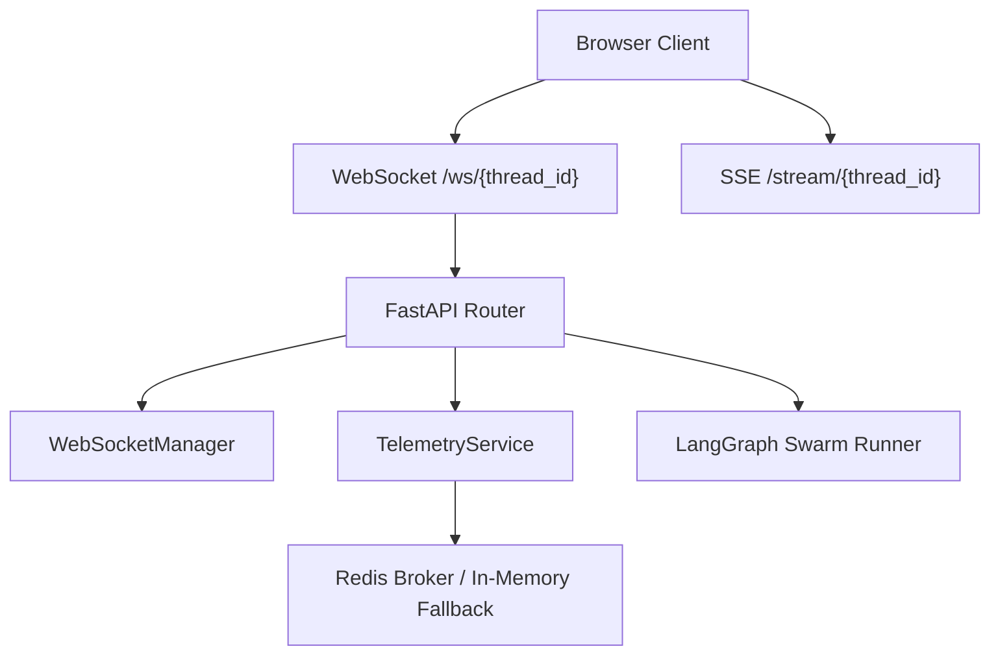
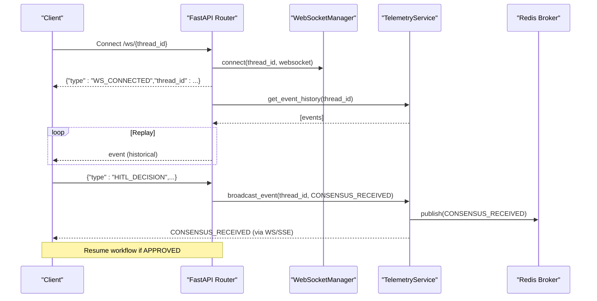
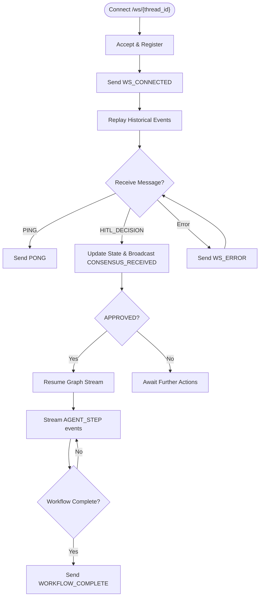
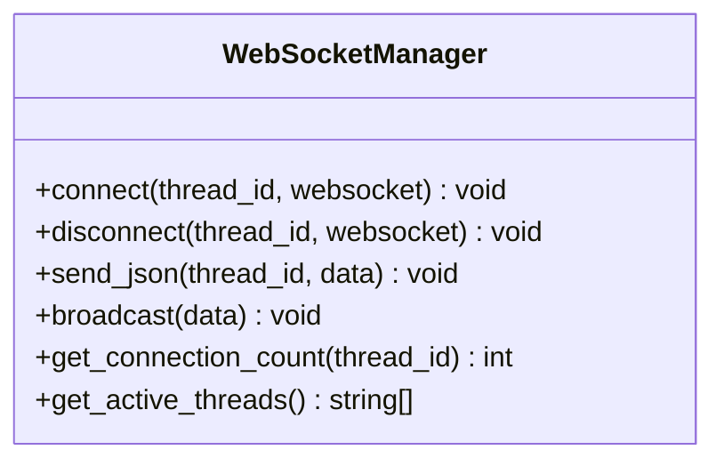
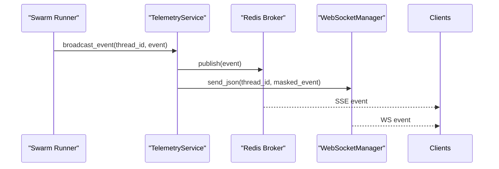
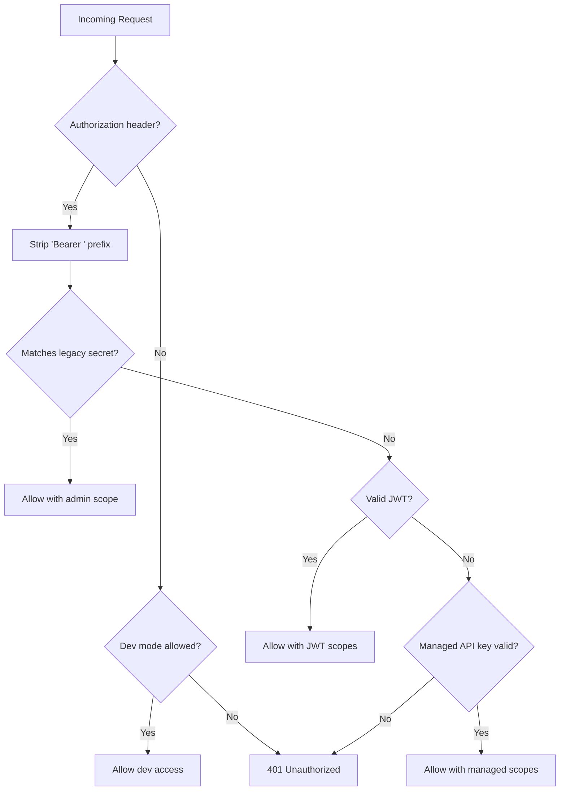
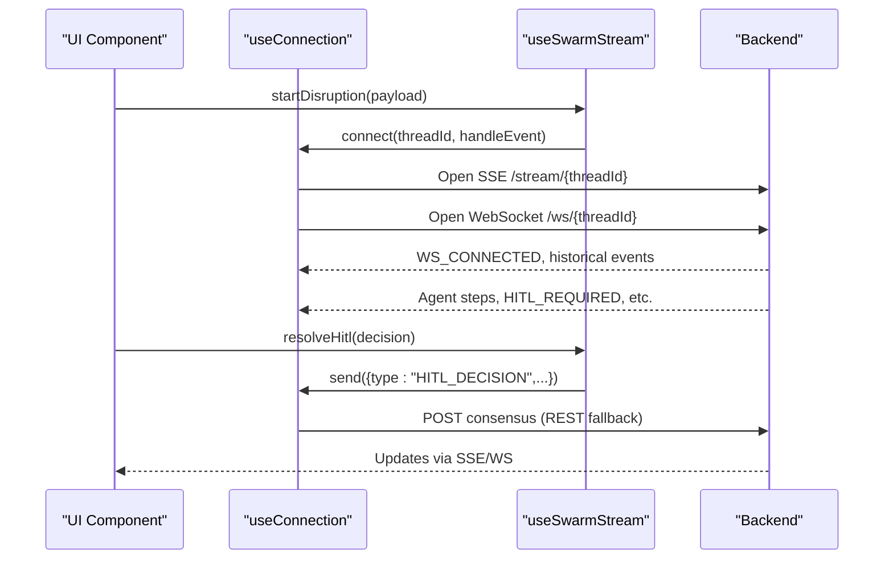
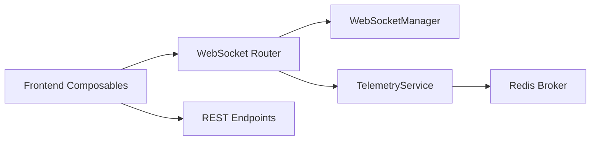

# WebSocket API

<cite>
**Referenced Files in This Document**
- [websocket.py](file://travel-recovery-os/backend/api/routers/websocket.py)
- [websocket_manager.py](file://travel-recovery-os/backend/services/websocket_manager.py)
- [telemetry_service.py](file://travel-recovery-os/backend/services/telemetry_service.py)
- [api_keys.py](file://travel-recovery-os/backend/auth/api_keys.py)
- [dependencies.py](file://travel-recovery-os/backend/api/dependencies.py)
- [main.py](file://travel-recovery-os/backend/main.py)
- [useConnection.js](file://travel-recovery-os/frontend/src/composables/useConnection.js)
- [useSwarmStream.js](file://travel-recovery-os/frontend/src/composables/useSwarmStream.js)
- [api.js](file://travel-recovery-os/frontend/src/services/api.js)
</cite>

## Table of Contents
1. Introduction
2. Project Structure
3. Core Components
4. Architecture Overview
5. Detailed Component Analysis
6. Dependency Analysis
7. Performance Considerations
8. Troubleshooting Guide
9. Conclusion
10. Appendices

## Introduction
This document describes the real-time bidirectional communication layer for the SynapseAir platform using WebSockets and Server-Sent Events (SSE). It covers connection establishment, message formats, event types (AGENT_STEP, CONSENSUS_RECEIVED, WORKFLOW_COMPLETE, WORKFLOW_ERROR), authentication via API keys, reconnection strategies, error handling patterns, and best practices for streaming agent activity. It also provides JavaScript client usage patterns and guidance for building Python clients.

## Project Structure
The WebSocket feature is implemented across backend routers, services, and frontend composables:
- Backend endpoint: FastAPI WebSocket router at /ws/{thread_id}
- Connection manager: Thread-scoped connection registry and fan-out broadcaster
- Telemetry service: SSE pub/sub with Redis-backed persistence and PII masking; also forwards events to WebSocket connections
- Authentication: API key validation supporting legacy static keys, JWT Bearer tokens, and managed API keys
- Frontend transport: Vue composable that opens both SSE (read-only stream) and WebSocket (bidirectional) channels, with fallback behavior

**Diagram sources**
- [websocket.py:21-92](file://travel-recovery-os/backend/api/routers/websocket.py#L21-L92)
- [websocket_manager.py:16-74](file://travel-recovery-os/backend/services/websocket_manager.py#L16-L74)
- [telemetry_service.py:45-68](file://travel-recovery-os/backend/services/telemetry_service.py#L45-L68)
- [main.py:104-108](file://travel-recovery-os/backend/main.py#L104-L108)

**Section sources**
- [websocket.py:1-195](file://travel-recovery-os/backend/api/routers/websocket.py#L1-L195)
- [websocket_manager.py:1-75](file://travel-recovery-os/backend/services/websocket_manager.py#L1-L75)
- [telemetry_service.py:1-79](file://travel-recovery-os/backend/services/telemetry_service.py#L1-L79)
- [main.py:74-113](file://travel-recovery-os/backend/main.py#L74-L113)

## Core Components
- WebSocket Endpoint: Accepts connections per thread_id, replays historical events, handles PING/PONG and HITL decisions, and streams telemetry.
- Connection Manager: Maintains a set of active WebSocket connections per thread, supports fan-out messaging, and cleans up dead connections.
- Telemetry Service: Publishes events to SSE subscribers and forwards them to WebSocket listeners; masks PII before broadcast.
- Authentication: Validates requests via three modes: legacy static key, JWT Bearer token, or managed API key; enforces scopes where applicable.
- Frontend Transport: Opens SSE for read-only streaming and WebSocket for bidirectional actions (e.g., HITL decisions); manages lifecycle and fallbacks.

**Section sources**
- [websocket.py:21-92](file://travel-recovery-os/backend/api/routers/websocket.py#L21-L92)
- [websocket_manager.py:26-60](file://travel-recovery-os/backend/services/websocket_manager.py#L26-L60)
- [telemetry_service.py:23-53](file://travel-recovery-os/backend/services/telemetry_service.py#L23-L53)
- [dependencies.py:25-78](file://travel-recovery-os/backend/api/dependencies.py#L25-L78)
- [useConnection.js:24-98](file://travel-recovery-os/frontend/src/composables/useConnection.js#L24-L98)

## Architecture Overview
The system uses a hybrid streaming approach:
- SSE for reliable, one-way telemetry streaming from server to client
- WebSocket for bidirectional control messages (HITL decisions, PING/PONG)
- Redis-backed event history enables replay on reconnect
- PII masking ensures safe broadcasting of sensitive data

**Diagram sources**
- [websocket.py:21-92](file://travel-recovery-os/backend/api/routers/websocket.py#L21-L92)
- [websocket_manager.py:26-60](file://travel-recovery-os/backend/services/websocket_manager.py#L26-L60)
- [telemetry_service.py:45-68](file://travel-recovery-os/backend/services/telemetry_service.py#L45-L68)

## Detailed Component Analysis

### WebSocket Endpoint (/ws/{thread_id})
- Establishes connection, sends WS_CONNECTED, replays historical events, listens for client messages
- Handles PING → PONG and HITL_DECISION → CONSENSUS_RECEIVED and HITL_CONFIRMED
- On approval, resumes the LangGraph workflow and streams AGENT_STEP events until completion or error
- Emits WORKFLOW_COMPLETE or WORKFLOW_ERROR upon finish

**Diagram sources**
- [websocket.py:21-92](file://travel-recovery-os/backend/api/routers/websocket.py#L21-L92)
- [websocket.py:95-195](file://travel-recovery-os/backend/api/routers/websocket.py#L95-L195)

**Section sources**
- [websocket.py:21-92](file://travel-recovery-os/backend/api/routers/websocket.py#L21-L92)
- [websocket.py:95-195](file://travel-recovery-os/backend/api/routers/websocket.py#L95-L195)

### Connection Manager (WebSocketManager)
- Per-thread connection registry with thread-safe operations
- Fan-out send_json to all clients for a thread
- Automatic cleanup of dead connections
- Utility methods for monitoring active threads and counts

**Diagram sources**
- [websocket_manager.py:16-74](file://travel-recovery-os/backend/services/websocket_manager.py#L16-L74)

**Section sources**
- [websocket_manager.py:16-74](file://travel-recovery-os/backend/services/websocket_manager.py#L16-L74)

### Telemetry Service (SSE + WebSocket Forwarding)
- Masks PII fields before broadcasting
- Publishes events to Redis broker and forwards to WebSocket listeners
- Provides subscription/unsubscription and history retrieval

**Diagram sources**
- [telemetry_service.py:23-53](file://travel-recovery-os/backend/services/telemetry_service.py#L23-L53)

**Section sources**
- [telemetry_service.py:23-68](file://travel-recovery-os/backend/services/telemetry_service.py#L23-L68)

### Authentication (API Keys and Scopes)
- Three auth modes supported: legacy static key, JWT Bearer token, managed API key
- Managed keys support scopes like admin, read-only, webhook-only, history, stream
- Default insecure key exists for development; must be replaced in production

**Diagram sources**
- [dependencies.py:25-78](file://travel-recovery-os/backend/api/dependencies.py#L25-L78)
- [api_keys.py:32-87](file://travel-recovery-os/backend/auth/api_keys.py#L32-L87)

**Section sources**
- [dependencies.py:25-78](file://travel-recovery-os/backend/api/dependencies.py#L25-L78)
- [api_keys.py:32-87](file://travel-recovery-os/backend/auth/api_keys.py#L32-L87)

### Frontend Transport Layer (Vue Composables)
- useConnection.js: Opens SSE for streaming and WebSocket for bidirectional actions; tracks connection mode and gracefully falls back
- useSwarmStream.js: Orchestrates event handling, state updates, HITL resolution, and lifecycle management

**Diagram sources**
- [useConnection.js:24-98](file://travel-recovery-os/frontend/src/composables/useConnection.js#L24-L98)
- [useSwarmStream.js:213-257](file://travel-recovery-os/frontend/src/composables/useSwarmStream.js#L213-L257)
- [api.js:18-21](file://travel-recovery-os/frontend/src/services/api.js#L18-L21)

**Section sources**
- [useConnection.js:24-98](file://travel-recovery-os/frontend/src/composables/useConnection.js#L24-L98)
- [useSwarmStream.js:96-257](file://travel-recovery-os/frontend/src/composables/useSwarmStream.js#L96-L257)
- [api.js:1-21](file://travel-recovery-os/frontend/src/services/api.js#L1-L21)

## Dependency Analysis
- The WebSocket router depends on the connection manager and telemetry service for event distribution and history replay.
- Telemetry service bridges SSE and WebSocket by publishing to Redis and forwarding to WebSocket listeners.
- Authentication middleware validates requests via multiple mechanisms and can enforce scopes.
- Frontend composables rely on REST endpoints for triggering workflows and consensus, while using SSE/WS for real-time updates.

**Diagram sources**
- [websocket.py:21-92](file://travel-recovery-os/backend/api/routers/websocket.py#L21-L92)
- [telemetry_service.py:45-68](file://travel-recovery-os/backend/services/telemetry_service.py#L45-L68)
- [main.py:104-108](file://travel-recovery-os/backend/main.py#L104-L108)

**Section sources**
- [websocket.py:21-92](file://travel-recovery-os/backend/api/routers/websocket.py#L21-L92)
- [telemetry_service.py:45-68](file://travel-recovery-os/backend/services/telemetry_service.py#L45-L68)
- [main.py:104-108](file://travel-recovery-os/backend/main.py#L104-L108)

## Performance Considerations
- Use SSE for high-volume telemetry to reduce WebSocket overhead; reserve WebSocket for control messages.
- Leverage Redis-backed event history to minimize replay latency on reconnect.
- Mask PII before broadcasting to avoid unnecessary payload size increases and ensure compliance.
- Clean up dead connections promptly to prevent resource leaks.
- Batch or throttle event emission during intensive workflow phases to maintain responsiveness.

[No sources needed since this section provides general guidance]

## Troubleshooting Guide
Common issues and resolutions:
- Invalid JSON received: Server responds with WS_ERROR indicating invalid JSON; validate client payloads.
- Unknown message type: Ensure client only sends supported types (PING, HITL_DECISION).
- No active session: If thread_id has no running workflow, HITL processing returns an error; verify workflow initiation.
- Reconnection: Frontend automatically falls back between SSE and WebSocket; ensure proper CORS configuration and environment variables for base URLs.
- Authentication failures: Verify Authorization header format and validity; check for required scopes.

**Section sources**
- [websocket.py:73-92](file://travel-recovery-os/backend/api/routers/websocket.py#L73-L92)
- [websocket.py:95-140](file://travel-recovery-os/backend/api/routers/websocket.py#L95-L140)
- [useConnection.js:55-64](file://travel-recovery-os/frontend/src/composables/useConnection.js#L55-L64)
- [dependencies.py:25-78](file://travel-recovery-os/backend/api/dependencies.py#L25-L78)

## Conclusion
The SynapseAir platform provides a robust real-time communication layer combining SSE and WebSocket for efficient telemetry streaming and bidirectional control. With thread-scoped connection management, Redis-backed event history, PII masking, and flexible authentication, it supports scalable, secure, and resilient agent activity streams. The frontend composables offer a practical integration pattern for handling live updates and HITL interactions.

[No sources needed since this section summarizes without analyzing specific files]

## Appendices

### WebSocket Message Formats

Client-to-Server
- PING
  - Fields: type = "PING"
  - Response: PONG
- HITL_DECISION
  - Fields: type = "HITL_DECISION", action = "APPROVE|REJECT", notes = optional string

Server-to-Client
- WS_CONNECTED
  - Fields: type = "WS_CONNECTED", thread_id, timestamp
- AGENT_STEP
  - Fields: type = "AGENT_STEP", thread_id, node, log, state_update
- CONSENSUS_RECEIVED
  - Fields: type = "CONSENSUS_RECEIVED", thread_id, timestamp, action, notes, message, source
- HITL_CONFIRMED
  - Fields: type = "HITL_CONFIRMED", action, thread_id
- WORKFLOW_COMPLETE
  - Fields: type = "WORKFLOW_COMPLETE", thread_id, timestamp, message, ticket
- WORKFLOW_ERROR
  - Fields: type = "WORKFLOW_ERROR", thread_id, timestamp, message
- WS_ERROR
  - Fields: type = "WS_ERROR", message

**Section sources**
- [websocket.py:21-92](file://travel-recovery-os/backend/api/routers/websocket.py#L21-L92)
- [websocket.py:95-195](file://travel-recovery-os/backend/api/routers/websocket.py#L95-L195)

### Authentication via API Keys
- Supported headers: Authorization with Bearer token or raw key
- Modes: legacy static key, JWT Bearer token, managed API key
- Scopes: admin, read-only, webhook-only, history, stream
- Default insecure key present for development; replace in production

**Section sources**
- [dependencies.py:25-78](file://travel-recovery-os/backend/api/dependencies.py#L25-L78)
- [api_keys.py:32-87](file://travel-recovery-os/backend/auth/api_keys.py#L32-L87)

### Reconnection Strategies
- Frontend opens both SSE and WebSocket; falls back to SSE if WebSocket closes
- On reconnect, historical events are replayed to catch up
- Implement exponential backoff and jitter for client-side reconnection attempts
- Monitor connectionMode and handle errors gracefully

**Section sources**
- [useConnection.js:24-98](file://travel-recovery-os/frontend/src/composables/useConnection.js#L24-L98)
- [websocket.py:45-51](file://travel-recovery-os/backend/api/routers/websocket.py#L45-L51)

### Best Practices for Real-Time Agent Activity Streams
- Use AGENT_STEP events to update UI incrementally; debounce heavy rendering
- Track step execution times and active agents for UX feedback
- Mask PII in logs and broadcasts to protect sensitive data
- Provide clear error states and user notifications for workflow errors
- Persist logs locally for debugging and offline review

**Section sources**
- [useSwarmStream.js:96-189](file://travel-recovery-os/frontend/src/composables/useSwarmStream.js#L96-L189)
- [telemetry_service.py:23-43](file://travel-recovery-os/backend/services/telemetry_service.py#L23-L43)

### JavaScript Client Implementation Example (Conceptual)
- Initialize connection with threadId and onMessage handler
- Listen for WS_CONNECTED and historical events
- Send PING periodically to keep connection alive
- On HITL_REQUIRED, send HITL_DECISION with decision and notes
- Handle AGENT_STEP to update UI state and track progress
- On WORKFLOW_COMPLETE or WORKFLOW_ERROR, finalize UI and clean up

[No sources needed since this section provides conceptual guidance]

### Python Client Implementation Example (Conceptual)
- Use websockets library to connect to ws://{host}/ws/{thread_id}
- Parse incoming JSON messages and route by type
- Send PING at intervals and handle PONG responses
- On HITL_REQUIRED, send HITL_DECISION with decision and notes
- Process AGENT_STEP events to update local state and display logs
- Handle WORKFLOW_COMPLETE or WORKFLOW_ERROR to conclude the session

[No sources needed since this section provides conceptual guidance]