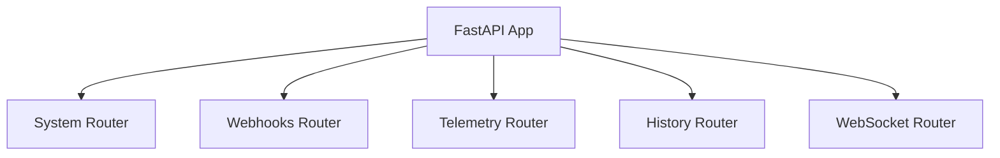
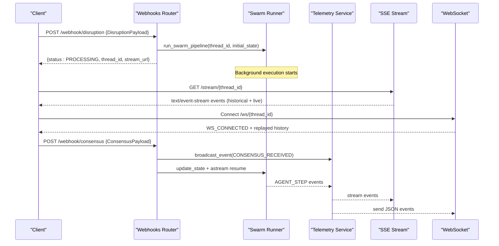

# API Endpoints Reference

<cite>
**Referenced Files in This Document**
- [main.py](file://travel-recovery-os/backend/main.py)
- [webhooks.py](file://travel-recovery-os/backend/api/routers/webhooks.py)
- [system.py](file://travel-recovery-os/backend/api/routers/system.py)
- [history.py](file://travel-recovery-os/backend/api/routers/history.py)
- [telemetry.py](file://travel-recovery-os/backend/api/routers/telemetry.py)
- [websocket.py](file://travel-recovery-os/backend/api/routers/websocket.py)
- [dependencies.py](file://travel-recovery-os/backend/api/dependencies.py)
- [api_models.py](file://travel-recovery-os/backend/schemas/api_models.py)
- [api_keys.py](file://travel-recovery-os/backend/auth/api_keys.py)
</cite>

## Table of Contents
1. Introduction
2. Project Structure
3. Core Components
4. Architecture Overview
5. Detailed Component Analysis
6. Dependency Analysis
7. Performance Considerations
8. Troubleshooting Guide
9. Conclusion

## Introduction
This document provides comprehensive API endpoint documentation for the SynapseAir FastAPI backend. It covers REST endpoints for disruption ingestion, consensus submission, system status monitoring, historical data retrieval, and telemetry streaming. It also documents authentication using API keys (Bearer tokens), request/response schemas, parameter validation rules, error handling responses, and integration patterns with examples.

## Project Structure
The FastAPI application mounts multiple routers under a single app instance:
- System endpoints for health and status
- Webhook endpoints for disruption ingestion and HITL consensus
- Telemetry endpoints for SSE streaming and thread state inspection
- History endpoints for querying past disruptions and analytics
- WebSocket endpoint for bidirectional real-time communication

**Diagram sources**
- [main.py:104-113](file://travel-recovery-os/backend/main.py#L104-L113)

**Section sources**
- [main.py:40-113](file://travel-recovery-os/backend/main.py#L40-L113)

## Core Components
- Authentication dependency that validates requests via static secret, JWT, or managed API key manager. Returns identity info including subject, scopes, and auth mode.
- Pydantic models defining DisruptionPayload and ConsensusPayload used by webhook endpoints.
- Routers implementing REST endpoints and SSE/WebSocket streaming.

Key responsibilities:
- verify_api_key enforces authentication and supports development bypass when not required.
- DisruptionPayload accepts structured fields or raw text to be parsed by AI.
- ConsensusPayload captures passenger decisions to resume or stop workflows.

**Section sources**
- [dependencies.py:25-78](file://travel-recovery-os/backend/api/dependencies.py#L25-L78)
- [api_models.py:5-101](file://travel-recovery-os/backend/schemas/api_models.py#L5-L101)
- [api_keys.py:32-87](file://travel-recovery-os/backend/auth/api_keys.py#L32-L87)

## Architecture Overview
High-level flow for disruption ingestion and HITL consensus:

**Diagram sources**
- [webhooks.py:14-72](file://travel-recovery-os/backend/api/routers/webhooks.py#L14-L72)
- [webhooks.py:74-184](file://travel-recovery-os/backend/api/routers/webhooks.py#L74-L184)
- [telemetry.py:11-46](file://travel-recovery-os/backend/api/routers/telemetry.py#L11-L46)
- [websocket.py:21-92](file://travel-recovery-os/backend/api/routers/websocket.py#L21-L92)

## Detailed Component Analysis

### Authentication and API Keys
- All webhook and data endpoints require an Authorization header with a Bearer token.
- The verification chain:
  - Static secret match (legacy)
  - JWT decode (if available)
  - Managed API key lookup via APIKeyManager
- In development/hackathon mode without REQUIRE_AUTH, local requests may proceed without a key; production requires a valid key.
- Rate limiting is available via a dependency factory and returns 429 Too Many Requests with Retry-After and rate limit headers when exceeded.

Authentication requirements per endpoint:
- /webhook/disruption: Requires valid API key (Bearer).
- /webhook/consensus: Requires valid API key (Bearer).
- /health: No auth required (public).
- /api/system/status: No auth required (public).
- /api/history/*: No explicit auth dependency in router; consider adding scope checks if needed.
- /telemetry/stream/{thread_id}: No explicit auth dependency in router; consider adding scope checks if needed.
- /telemetry/threads/{thread_id}/state: No explicit auth dependency in router; consider adding scope checks if needed.
- /ws/{thread_id}: No explicit auth dependency in router; consider adding scope checks if needed.

Error responses:
- 401 Unauthorized: Missing or invalid API key.
- 403 Forbidden: Insufficient scopes (when using verify_scope).
- 429 Too Many Requests: Rate limit exceeded (with Retry-After and X-RateLimit-* headers).

**Section sources**
- [dependencies.py:25-78](file://travel-recovery-os/backend/api/dependencies.py#L25-L78)
- [dependencies.py:85-96](file://travel-recovery-os/backend/api/dependencies.py#L85-L96)
- [dependencies.py:103-129](file://travel-recovery-os/backend/api/dependencies.py#L103-L129)
- [api_keys.py:32-87](file://travel-recovery-os/backend/auth/api_keys.py#L32-L87)

### Disruption Ingestion Endpoint
- Method: POST
- URL: /webhook/disruption
- Authentication: Bearer token required
- Request body schema: DisruptionPayload
  - Fields:
    - raw_text: Optional string for AI parsing; if provided, structured fields are optional fallbacks.
    - pnr: Optional string; default example value present.
    - flight_number: Optional string; default example value present.
    - airline: Optional string; default example value present.
    - origin: Optional string; default example value present.
    - destination: Optional string; default example value present.
    - scheduled_departure: Optional string; format YYYY-MM-DD HH:MM.
    - delay_minutes: Optional integer; default example value present.
    - reason: Optional string; default example value present.
    - loyalty_tier: Optional string; allowed values include PLATINUM, GOLD, SILVER, STANDARD.
    - passenger_name: Optional string; default example value present.
    - passenger_phone: Optional string; default example value present.
    - n8n_webhook_url: Optional string; overrides global config for this disruption.
    - thread_id: Optional string; auto-generated if omitted.
- Response:
  - 200 OK: JSON with status "PROCESSING", thread_id, stream_url (/stream/{thread_id}), and message.
- Error responses:
  - 401 Unauthorized: Missing or invalid API key.
- Integration pattern:
  - On success, client should connect to SSE at /stream/{thread_id} to receive agent steps and workflow completion events.
  - For HITL, use /webhook/consensus or WebSocket /ws/{thread_id} to submit APPROVE/REJECT decisions.

Example request payload (JSON):
{
  "raw_text": "URGENT NOTAM: CZ3042 KUL-HGH canceled due to typhoon. PNR 8842.",
  "pnr": "PNR-8842",
  "flight_number": "CZ-3042",
  "airline": "China Southern Airlines",
  "origin": "KUL",
  "destination": "HGH",
  "scheduled_departure": "2026-08-25 09:30",
  "delay_minutes": 240,
  "reason": "Severe Weather / Typhoon Flow Control",
  "loyalty_tier": "GOLD",
  "passenger_name": "Sarah Jenkins",
  "passenger_phone": "+60 12-345 6789",
  "n8n_webhook_url": "https://your-n8n.example.com/webhook/disruption",
  "thread_id": "synapse-123456"
}

Example response (JSON):
{
  "status": "PROCESSING",
  "thread_id": "synapse-123456",
  "stream_url": "/stream/synapse-123456",
  "message": "SynapseAir Swarm initiated for thread synapse-123456."
}

**Section sources**
- [webhooks.py:14-72](file://travel-recovery-os/backend/api/routers/webhooks.py#L14-L72)
- [api_models.py:5-79](file://travel-recovery-os/backend/schemas/api_models.py#L5-L79)

### Consensus Submission Endpoint (HITL)
- Method: POST
- URL: /webhook/consensus
- Authentication: Bearer token required
- Request body schema: ConsensusPayload
  - Fields:
    - thread_id: Required string; swarm thread ID to resume.
    - action: Required string; APPROVE or REJECT.
    - selected_flight_id: Optional string; ID of selected alternative flight if multiple options were presented.
    - notes: Optional string; free-form notes from the passenger.
- Response:
  - 200 OK: JSON with status "RESUMED" or "REJECTED", thread_id, action, and message.
  - 404 Not Found: No active session found for the given thread_id.
- Error responses:
  - 401 Unauthorized: Missing or invalid API key.
  - 404 Not Found: Thread not active.
- Integration pattern:
  - After receiving CONSENSUS_RECEIVED event on SSE/WebSocket, clients can call this endpoint to approve/reject proposals.
  - If APPROVED, the workflow resumes asynchronously and emits AGENT_STEP events until WORKFLOW_COMPLETE or WORKFLOW_ERROR.

Example request payload (JSON):
{
  "thread_id": "synapse-123456",
  "action": "APPROVE",
  "selected_flight_id": "FL-9876",
  "notes": "Approved via WhatsApp 1-click CTA"
}

Example response (JSON):
{
  "status": "RESUMED",
  "thread_id": "synapse-123456",
  "action": "APPROVED",
  "message": "Graph resumed from checkpointer to finalize ticket."
}

**Section sources**
- [webhooks.py:74-184](file://travel-recovery-os/backend/api/routers/webhooks.py#L74-L184)
- [api_models.py:81-101](file://travel-recovery-os/backend/schemas/api_models.py#L81-L101)

### System Status Monitoring
- Health Check
  - Method: GET
  - URL: /health
  - Authentication: None
  - Response: JSON with status "healthy" and version.
- Full System Status
  - Method: GET
  - URL: /api/system/status
  - Authentication: None
  - Response: JSON with overall status, provider statuses (DeepSeek, Hermes), Atlas GDS status, and n8n configuration details. Includes timestamp.

Example response (Full System Status):
{
  "status": "HEALTHY",
  "deepseek": {
    "active": true,
    "model": "deepseek-model-name",
    "endpoint": "https://deepseek.example.com"
  },
  "hermes": {
    "active": true,
    "model": "hermes-model-name",
    "endpoint": "https://hermes.example.com"
  },
  "atlas_gds": {
    "status": "LIVE_CLI_ACTIVE",
    "cli_installed": true,
    "provider": "Official Atlas Flight Booking CLI (0.3.12)"
  },
  "n8n": {
    "status": "CONNECTED",
    "webhook_target": "https://your-n8n.example.com/webhook",
    "api_connected": true
  },
  "timestamp": "2026-01-01T12:00:00"
}

**Section sources**
- [main.py:119-122](file://travel-recovery-os/backend/main.py#L119-L122)
- [system.py:9-52](file://travel-recovery-os/backend/api/routers/system.py#L9-L52)

### Historical Data Retrieval
- List Disruptions
  - Method: GET
  - URL: /api/history
  - Query parameters:
    - limit: Integer; max results (default 50).
    - offset: Integer; pagination offset.
    - airline: Optional string; filter by airline name.
    - loyalty_tier: Optional string; filter by tier (PLATINUM/GOLD/SILVER/STANDARD).
    - status: Optional string; filter by HITL status (BYPASSED/APPROVED/REJECTED/PENDING).
  - Response: JSON with total count, limit, offset, and disruptions array.
- Disruption Statistics
  - Method: GET
  - URL: /api/history/stats
  - Response: JSON with aggregate analytics across all disruptions (totals, auto-approve/HITL rates, average resolution time, top routes).
- Disruption Detail
  - Method: GET
  - URL: /api/history/{thread_id}
  - Path parameter: thread_id (string)
  - Response: JSON with full detail of a specific disruption run.
  - Error responses:
    - 404 Not Found: Disruption not found.

Example list response:
{
  "total": 120,
  "limit": 50,
  "offset": 0,
  "disruptions": [
    {
      "thread_id": "synapse-123456",
      "pnr": "PNR-8842",
      "flight_number": "CZ-3042",
      "airline": "China Southern Airlines",
      "origin": "KUL",
      "destination": "HGH",
      "scheduled_departure": "2026-08-25 09:30",
      "delay_minutes": 240,
      "reason": "Severe Weather / Typhoon Flow Control",
      "loyalty_tier": "GOLD",
      "passenger_name": "Sarah Jenkins",
      "passenger_phone": "+60 12-345 6789",
      "hitl_status": "APPROVED",
      "created_at": "2026-01-01T12:00:00"
    }
  ]
}

**Section sources**
- [history.py:19-47](file://travel-recovery-os/backend/api/routers/history.py#L19-L47)
- [history.py:50-57](file://travel-recovery-os/backend/api/routers/history.py#L50-L57)
- [history.py:60-73](file://travel-recovery-os/backend/api/routers/history.py#L60-L73)

### Telemetry Streaming (SSE)
- Live Telemetry Stream
  - Method: GET
  - URL: /stream/{thread_id}
  - Authentication: None (consider adding scope checks if needed)
  - Description: Server-Sent Events stream for real-time agent activity. Replays historical events first, then streams live. Sends keep-alive every 15 seconds.
  - Response: text/event-stream with JSON event payloads.
  - Headers: Cache-Control no-cache, Connection keep-alive, X-Accel-Buffering no.
- Thread State Inspection
  - Method: GET
  - URL: /telemetry/threads/{thread_id}/state
  - Authentication: None (consider adding scope checks if needed)
  - Response: JSON with thread_id, values (current state snapshot), next node, created_at.
  - Error responses:
    - 404 Not Found: Thread state not found.

Event types emitted during streaming:
- CONSENSUS_RECEIVED: When a consensus decision is received.
- AGENT_STEP: Agent step logs and state updates.
- WORKFLOW_COMPLETE: Finalization of workflow with ticket confirmation.
- WORKFLOW_ERROR: Errors encountered during resume.

Example SSE event:
data: {"type":"AGENT_STEP","thread_id":"synapse-123456","node":"scout","log":{"message":"Scouting alternatives...","level":"INFO","timestamp":"2026-01-01T12:05:00"},"state_update":{"candidate_routes":[{"id":"FL-9876","departure":"2026-08-25 14:00"}]}}

**Section sources**
- [telemetry.py:11-46](file://travel-recovery-os/backend/api/routers/telemetry.py#L11-L46)
- [telemetry.py:48-71](file://travel-recovery-os/backend/api/routers/telemetry.py#L48-L71)

### WebSocket Endpoint
- Bidirectional WebSocket
  - URL: /ws/{thread_id}
  - Authentication: None (consider adding scope checks if needed)
  - Description: Real-time telemetry and HITL decisions.
  - Client messages:
    - {"type": "PING"} → responds with PONG
    - {"type": "HITL_DECISION", "action": "APPROVE|REJECT", "notes": "..."} → processes consensus
  - Server messages:
    - WS_CONNECTED: Connection confirmed
    - All SSE telemetry events replayed then streamed live
    - HITL_CONFIRMED: Decision acknowledged
    - WS_ERROR: Error details
  - Behavior:
    - On connect, sends WS_CONNECTED and replays historical events.
    - LISTEN loop handles incoming messages and dispatches HITL decisions.
    - On disconnect or error, cleans up subscriptions.

Example client message (HITL decision):
{
  "type": "HITL_DECISION",
  "action": "APPROVE",
  "notes": "Approved via in-app UI"
}

Example server message (confirmation):
{
  "type": "HITL_CONFIRMED",
  "action": "APPROVED",
  "thread_id": "synapse-123456"
}

**Section sources**
- [websocket.py:21-92](file://travel-recovery-os/backend/api/routers/websocket.py#L21-L92)
- [websocket.py:95-140](file://travel-recovery-os/backend/api/routers/websocket.py#L95-L140)
- [websocket.py:143-194](file://travel-recovery-os/backend/api/routers/websocket.py#L143-L194)

## Dependency Analysis
Component relationships and coupling:
- Webhooks depend on:
  - verify_api_key for authentication
  - DisruptionPayload/ConsensusPayload for request validation
  - Swarm runner to execute recovery pipeline
  - Telemetry service to broadcast events
- Telemetry depends on:
  - Telemetry service for subscribe/unsubscribe and event history
  - Swarm graph for state inspection
- WebSocket depends on:
  - WebSocket manager for connection lifecycle
  - Telemetry service for broadcasting and history
  - Swarm graph for HITL state updates and resuming

Potential circular dependencies:
- None observed between routers; they rely on services and shared modules.

External dependencies and integration points:
- DeepSeek LLM, Hermes AI, n8n webhooks, Atlas GDS CLI/API.
- Redis-based rate limiter (via get_rate_limiter).
- LangGraph checkpointer for state persistence.

Interface contracts:
- verify_api_key returns identity dict with subject, scopes, auth_mode.
- Telemetry service exposes subscribe, unsubscribe, broadcast_event, get_event_history.
- Swarm graph exposes aget_state, aupdate_state, astream.

**Section sources**
- [webhooks.py:1-11](file://travel-recovery-os/backend/api/routers/webhooks.py#L1-L11)
- [telemetry.py:1-8](file://travel-recovery-os/backend/api/routers/telemetry.py#L1-L8)
- [websocket.py:1-16](file://travel-recovery-os/backend/api/routers/websocket.py#L1-L16)
- [dependencies.py:25-78](file://travel-recovery-os/backend/api/dependencies.py#L25-L78)

## Performance Considerations
- Use background tasks for long-running operations (e.g., running swarm pipeline) to avoid blocking request threads.
- SSE streaming uses keep-alive intervals to maintain connections efficiently.
- WebSocket connections manage subscriptions per thread_id to minimize memory usage.
- Rate limiting prevents abuse and protects backend resources.
- Consider adding authentication and scope checks to telemetry and history endpoints for production security.

[No sources needed since this section provides general guidance]

## Troubleshooting Guide
Common issues and resolutions:
- 401 Unauthorized: Ensure Authorization header contains a valid Bearer token. Verify environment settings and API key manager configuration.
- 404 Not Found: For consensus or thread state endpoints, ensure the thread_id corresponds to an active session.
- 429 Too Many Requests: Reduce request frequency or adjust rate limits. Check Retry-After and X-RateLimit-* headers.
- SSE disconnections: Clients should implement reconnection logic and handle keep-alive signals.
- WebSocket errors: Validate message types and JSON structure. Handle WS_ERROR messages and reconnect if necessary.

Debugging tips:
- Use /api/history to inspect past disruptions and their states.
- Use /telemetry/threads/{thread_id}/state to inspect current thread state.
- Monitor logs and tracing for errors during swarm execution.

**Section sources**
- [dependencies.py:25-78](file://travel-recovery-os/backend/api/dependencies.py#L25-L78)
- [dependencies.py:103-129](file://travel-recovery-os/backend/api/dependencies.py#L103-L129)
- [history.py:60-73](file://travel-recovery-os/backend/api/routers/history.py#L60-L73)
- [telemetry.py:48-71](file://travel-recovery-os/backend/api/routers/telemetry.py#L48-L71)

## Conclusion
The SynapseAir FastAPI backend provides robust endpoints for disruption ingestion, HITL consensus, system monitoring, historical queries, and real-time telemetry via SSE and WebSocket. Authentication is enforced through a flexible API key mechanism supporting legacy secrets, JWT, and managed keys. Schemas are well-defined with clear validation rules and examples. Integrators should follow the recommended patterns for streaming and HITL interactions to achieve reliable and scalable operations.

[No sources needed since this section summarizes without analyzing specific files]