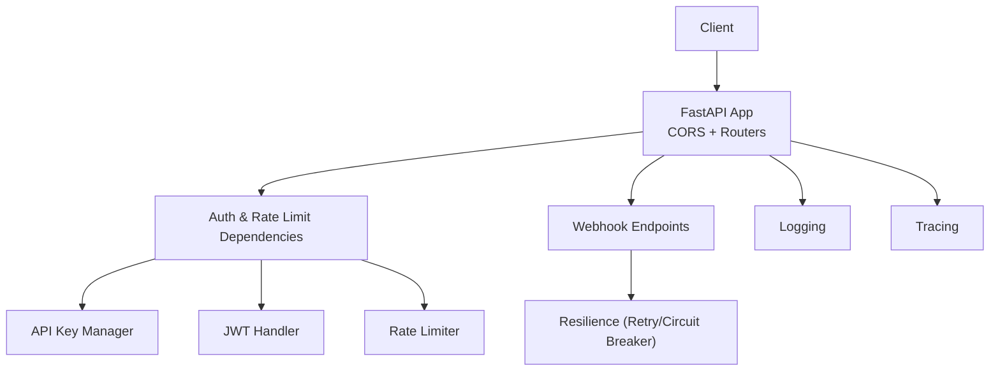
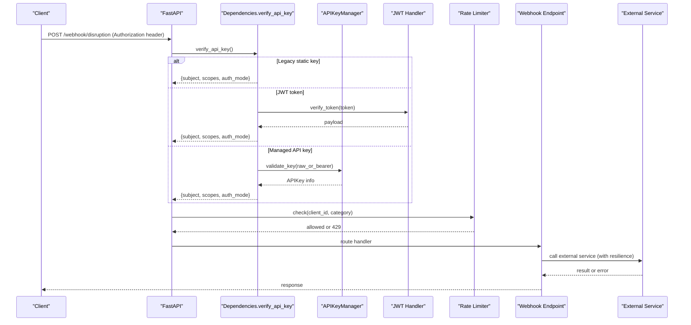
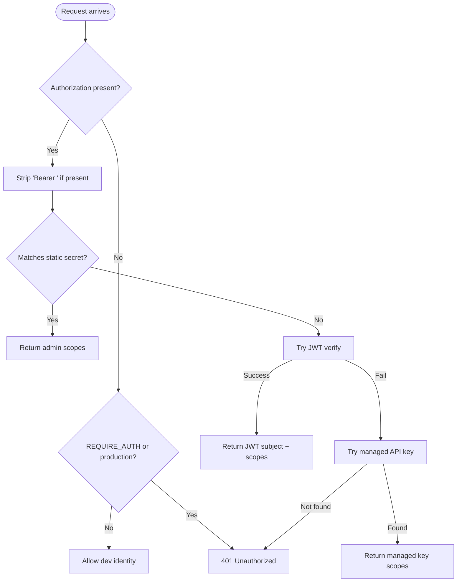
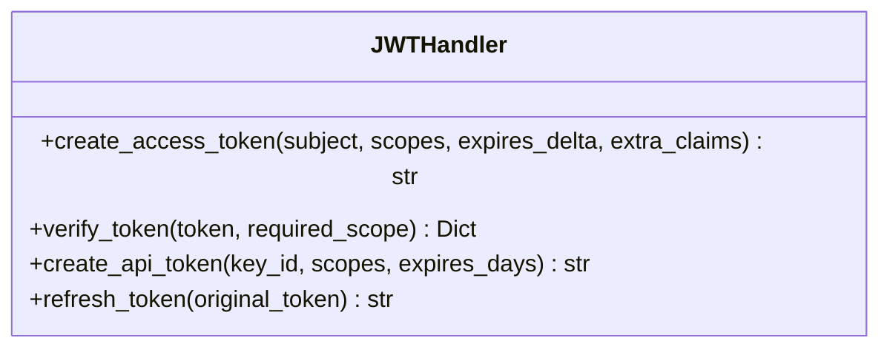
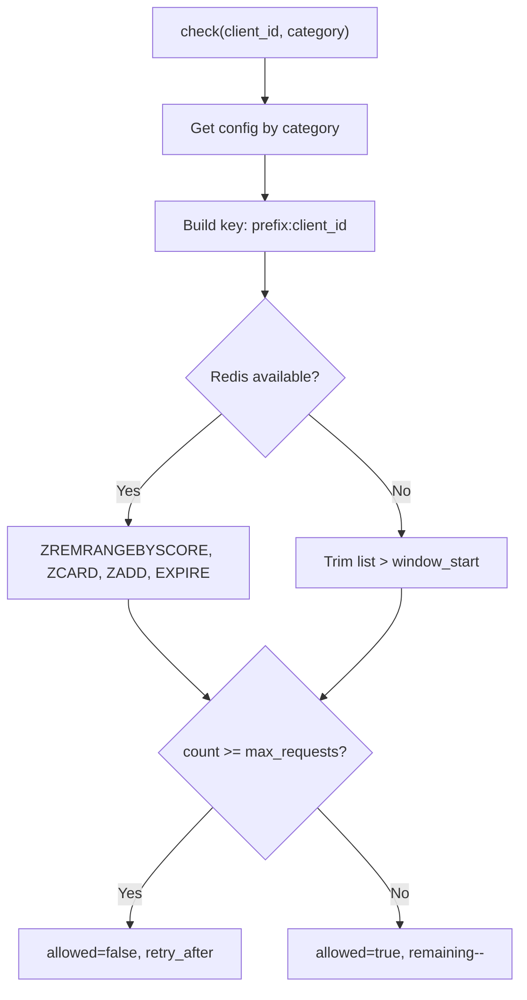
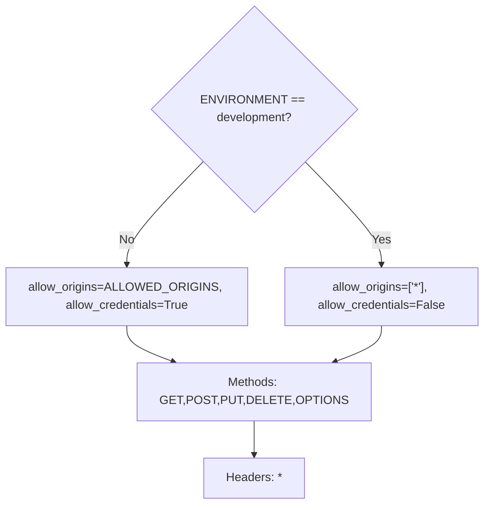
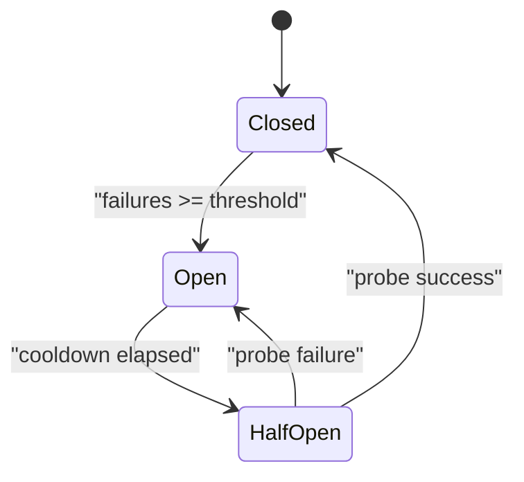
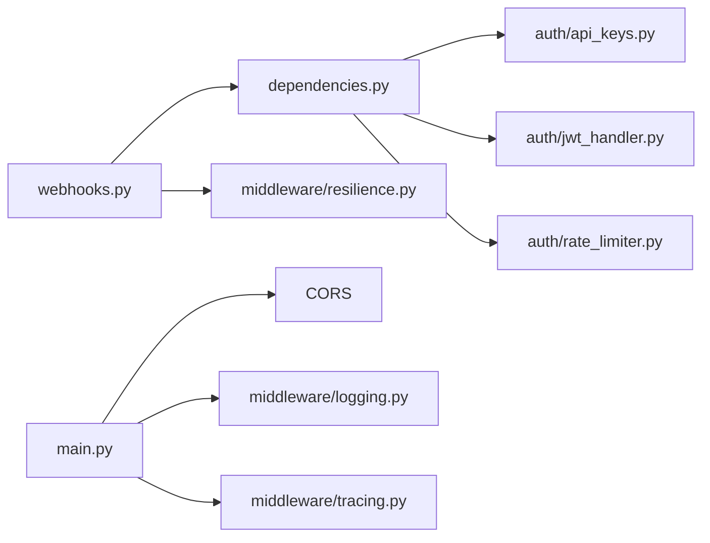

# Authentication & Security

<cite>
**Referenced Files in This Document**
- [main.py](file://travel-recovery-os/backend/main.py)
- [config.py](file://travel-recovery-os/backend/config.py)
- [dependencies.py](file://travel-recovery-os/backend/api/dependencies.py)
- [api_keys.py](file://travel-recovery-os/backend/auth/api_keys.py)
- [jwt_handler.py](file://travel-recovery-os/backend/auth/jwt_handler.py)
- [rate_limiter.py](file://travel-recovery-os/backend/auth/rate_limiter.py)
- [resilience.py](file://travel-recovery-os/backend/middleware/resilience.py)
- [logging.py](file://travel-recovery-os/backend/middleware/logging.py)
- [tracing.py](file://travel-recovery-os/backend/middleware/tracing.py)
- [webhooks.py](file://travel-recovery-os/backend/api/routers/webhooks.py)
- [api_models.py](file://travel-recovery-os/backend/schemas/api_models.py)
</cite>

## Table of Contents
1. Introduction
2. Project Structure
3. Core Components
4. Architecture Overview
5. Detailed Component Analysis
6. Dependency Analysis
7. Performance Considerations
8. Troubleshooting Guide
9. Conclusion
10. Appendices

## Introduction
This document explains the authentication, authorization, and security posture of the SynapseAir backend. It covers:
- API key authentication for webhook endpoints
- JWT token handling for user sessions
- Rate limiting to prevent abuse
- Security middleware including CORS configuration, input validation, and request sanitization
- Resilience patterns for external service failures (retry with backoff and circuit breaker)
- Security best practices, configuration options, and integration examples for secure API consumption

## Project Structure
The security-related code is organized into focused modules:
- Application entrypoint configures CORS and includes routers
- Configuration centralizes secrets and feature flags
- Authentication dependencies implement a three-tier auth chain and rate limiting
- Auth subsystems provide API key management and JWT utilities
- Middleware provides resilience primitives and observability
- Routers define protected endpoints and validate payloads

**Diagram sources**
- [main.py:74-99](file://travel-recovery-os/backend/main.py#L74-L99)
- [dependencies.py:25-78](file://travel-recovery-os/backend/api/dependencies.py#L25-L78)
- [api_keys.py:32-87](file://travel-recovery-os/backend/auth/api_keys.py#L32-L87)
- [jwt_handler.py:20-62](file://travel-recovery-os/backend/auth/jwt_handler.py#L20-L62)
- [rate_limiter.py:41-99](file://travel-recovery-os/backend/auth/rate_limiter.py#L41-L99)
- [resilience.py:25-80](file://travel-recovery-os/backend/middleware/resilience.py#L25-L80)
- [logging.py:37-99](file://travel-recovery-os/backend/middleware/logging.py#L37-L99)
- [tracing.py:43-79](file://travel-recovery-os/backend/middleware/tracing.py#L43-L79)

**Section sources**
- [main.py:74-99](file://travel-recovery-os/backend/main.py#L74-L99)
- [config.py:29-115](file://travel-recovery-os/backend/config.py#L29-L115)

## Core Components
- API key authentication and scope enforcement via a dependency that supports legacy static keys, JWT tokens, and managed API keys
- JWT token creation, verification, and refresh with configurable algorithm and expiry
- Sliding window rate limiter with Redis or in-memory fallback
- CORS middleware configured per environment
- Input validation using Pydantic models
- Resilience primitives: retry with exponential backoff and jitter, and a stateful circuit breaker
- Structured logging and OpenTelemetry tracing for observability

**Section sources**
- [dependencies.py:25-78](file://travel-recovery-os/backend/api/dependencies.py#L25-L78)
- [jwt_handler.py:20-62](file://travel-recovery-os/backend/auth/jwt_handler.py#L20-L62)
- [rate_limiter.py:41-99](file://travel-recovery-os/backend/auth/rate_limiter.py#L41-L99)
- [main.py:74-99](file://travel-recovery-os/backend/main.py#L74-L99)
- [api_models.py:5-134](file://travel-recovery-os/backend/schemas/api_models.py#L5-L134)
- [resilience.py:25-80](file://travel-recovery-os/backend/middleware/resilience.py#L25-L80)
- [resilience.py:97-215](file://travel-recovery-os/backend/middleware/resilience.py#L97-L215)
- [logging.py:37-99](file://travel-recovery-os/backend/middleware/logging.py#L37-L99)
- [tracing.py:43-79](file://travel-recovery-os/backend/middleware/tracing.py#L43-L79)

## Architecture Overview
The request flow enforces authentication, authorization, and rate limiting before reaching business logic. Protected webhooks trigger resilient operations against external services.

**Diagram sources**
- [dependencies.py:25-78](file://travel-recovery-os/backend/api/dependencies.py#L25-L78)
- [api_keys.py:65-87](file://travel-recovery-os/backend/auth/api_keys.py#L65-L87)
- [jwt_handler.py:34-62](file://travel-recovery-os/backend/auth/jwt_handler.py#L34-L62)
- [rate_limiter.py:62-99](file://travel-recovery-os/backend/auth/rate_limiter.py#L62-L99)
- [webhooks.py:14-72](file://travel-recovery-os/backend/api/routers/webhooks.py#L14-L72)
- [resilience.py:25-80](file://travel-recovery-os/backend/middleware/resilience.py#L25-L80)

## Detailed Component Analysis

### API Key Authentication and Scope Enforcement
- The dependency supports three modes in order: legacy static key, JWT Bearer token, and managed API key
- Scopes are enforced via a scope-checking dependency; admin scope bypasses specific scope checks
- In development without REQUIRE_AUTH, requests without headers may be allowed for convenience

**Diagram sources**
- [dependencies.py:25-78](file://travel-recovery-os/backend/api/dependencies.py#L25-L78)
- [api_keys.py:65-87](file://travel-recovery-os/backend/auth/api_keys.py#L65-L87)
- [jwt_handler.py:34-62](file://travel-recovery-os/backend/auth/jwt_handler.py#L34-L62)

**Section sources**
- [dependencies.py:25-96](file://travel-recovery-os/backend/api/dependencies.py#L25-L96)
- [api_keys.py:32-87](file://travel-recovery-os/backend/auth/api_keys.py#L32-L87)
- [jwt_handler.py:20-62](file://travel-recovery-os/backend/auth/jwt_handler.py#L20-L62)

### JWT Token Handling
- Tokens are created with configurable algorithm and expiry
- Verification enforces expiration and optional required scope
- Long-lived API tokens can be generated with extra claims
- Graceful degradation when python-jose is not installed

**Diagram sources**
- [jwt_handler.py:20-62](file://travel-recovery-os/backend/auth/jwt_handler.py#L20-L62)

**Section sources**
- [jwt_handler.py:20-62](file://travel-recovery-os/backend/auth/jwt_handler.py#L20-L62)
- [config.py:74-77](file://travel-recovery-os/backend/config.py#L74-L77)

### Rate Limiting
- Sliding window rate limiter with Redis-backed sorted sets or in-memory fallback
- Per-category limits for webhooks, consensus, history, stream, system, and default
- Returns remaining count and Retry-After on limit exceeded

**Diagram sources**
- [rate_limiter.py:62-99](file://travel-recovery-os/backend/auth/rate_limiter.py#L62-L99)

**Section sources**
- [rate_limiter.py:15-29](file://travel-recovery-os/backend/auth/rate_limiter.py#L15-L29)
- [rate_limiter.py:41-99](file://travel-recovery-os/backend/auth/rate_limiter.py#L41-L99)
- [dependencies.py:103-129](file://travel-recovery-os/backend/api/dependencies.py#L103-L129)

### CORS and Request Validation
- CORS allows configured origins; in development it relaxes to allow all localhost origins
- Credentials policy differs between development and non-development environments
- Input validation uses Pydantic models for structured payloads and defaults

**Diagram sources**
- [main.py:74-99](file://travel-recovery-os/backend/main.py#L74-L99)

**Section sources**
- [main.py:74-99](file://travel-recovery-os/backend/main.py#L74-L99)
- [api_models.py:5-134](file://travel-recovery-os/backend/schemas/api_models.py#L5-L134)

### Resilience Patterns: Retry and Circuit Breaker
- Exponential backoff with jitter and configurable retryable exceptions
- Circuit breaker with CLOSED/OPEN/HALF_OPEN states, failure threshold, cooldown, and probe limits
- Pre-configured breakers for LLM and webhook services

**Diagram sources**
- [resilience.py:86-215](file://travel-recovery-os/backend/middleware/resilience.py#L86-L215)

**Section sources**
- [resilience.py:25-80](file://travel-recovery-os/backend/middleware/resilience.py#L25-L80)
- [resilience.py:97-215](file://travel-recovery-os/backend/middleware/resilience.py#L97-L215)
- [resilience.py:221-243](file://travel-recovery-os/backend/middleware/resilience.py#L221-L243)

### Observability: Logging and Tracing
- Structured logging with optional JSON output and context binding
- OpenTelemetry initialization with console and optional OTLP exporter
- Helpers to create spans and propagate trace context

**Section sources**
- [logging.py:37-99](file://travel-recovery-os/backend/middleware/logging.py#L37-L99)
- [logging.py:107-147](file://travel-recovery-os/backend/middleware/logging.py#L107-L147)
- [tracing.py:43-79](file://travel-recovery-os/backend/middleware/tracing.py#L43-L79)
- [tracing.py:86-121](file://travel-recovery-os/backend/middleware/tracing.py#L86-L121)

## Dependency Analysis
Authentication and rate limiting are applied at the dependency layer, while resilience is used within service calls invoked by endpoints.

**Diagram sources**
- [webhooks.py:14-72](file://travel-recovery-os/backend/api/routers/webhooks.py#L14-L72)
- [dependencies.py:25-78](file://travel-recovery-os/backend/api/dependencies.py#L25-L78)
- [api_keys.py:32-87](file://travel-recovery-os/backend/auth/api_keys.py#L32-L87)
- [jwt_handler.py:20-62](file://travel-recovery-os/backend/auth/jwt_handler.py#L20-L62)
- [rate_limiter.py:41-99](file://travel-recovery-os/backend/auth/rate_limiter.py#L41-L99)
- [resilience.py:25-80](file://travel-recovery-os/backend/middleware/resilience.py#L25-L80)
- [main.py:74-99](file://travel-recovery-os/backend/main.py#L74-L99)
- [logging.py:37-99](file://travel-recovery-os/backend/middleware/logging.py#L37-L99)
- [tracing.py:43-79](file://travel-recovery-os/backend/middleware/tracing.py#L43-L79)

**Section sources**
- [webhooks.py:14-72](file://travel-recovery-os/backend/api/routers/webhooks.py#L14-L72)
- [dependencies.py:25-78](file://travel-recovery-os/backend/api/dependencies.py#L25-L78)
- [main.py:74-99](file://travel-recovery-os/backend/main.py#L74-L99)

## Performance Considerations
- Prefer Redis-backed rate limiting in production to ensure distributed accuracy
- Tune rate limit categories per endpoint traffic profiles
- Use circuit breakers around slow or flaky external services to reduce latency spikes
- Keep JWT expiry reasonable to balance security and UX
- Avoid overly broad CORS in production; restrict to known origins

[No sources needed since this section provides general guidance]

## Troubleshooting Guide
Common issues and resolutions:
- Missing or invalid Authorization header: Ensure a valid token or API key is provided; in production, missing credentials will be rejected
- JWT errors: Verify algorithm and secret match; ensure token is not expired
- Rate limit exceeded: Respect Retry-After header; adjust limits if legitimate traffic is throttled
- CORS errors: Confirm frontend origin is included in ALLOWED_ORIGINS or set FRONTEND_URL
- External service failures: Wrap calls with retry_with_backoff and circuit breaker; handle CircuitBreakerOpen gracefully

**Section sources**
- [dependencies.py:25-78](file://travel-recovery-os/backend/api/dependencies.py#L25-L78)
- [jwt_handler.py:34-62](file://travel-recovery-os/backend/auth/jwt_handler.py#L34-L62)
- [rate_limiter.py:62-99](file://travel-recovery-os/backend/auth/rate_limiter.py#L62-L99)
- [main.py:74-99](file://travel-recovery-os/backend/main.py#L74-L99)
- [resilience.py:25-80](file://travel-recovery-os/backend/middleware/resilience.py#L25-L80)
- [resilience.py:97-215](file://travel-recovery-os/backend/middleware/resilience.py#L97-L215)

## Conclusion
SynapseAir implements a layered security model combining flexible authentication (legacy key, JWT, managed API keys), strict scope enforcement, and robust rate limiting. CORS is configured per environment, inputs are validated with Pydantic, and resilience primitives protect against external service instability. Structured logging and tracing support operational visibility. Following the recommended configurations and best practices ensures secure, reliable operation across environments.

[No sources needed since this section summarizes without analyzing specific files]

## Appendices

### Configuration Options
- Environment profile and app settings
- Secrets and algorithms for JWT
- Redis URL for distributed rate limiting
- CORS origins and credentials behavior

**Section sources**
- [config.py:29-115](file://travel-recovery-os/backend/config.py#L29-L115)
- [main.py:74-99](file://travel-recovery-os/backend/main.py#L74-L99)

### Integration Examples
- Webhook ingestion requires an Authorization header; use one of the supported methods
- For JWT-based flows, include scopes as needed and enforce them at endpoints
- When calling external services, wrap with retry_with_backoff and circuit breaker for resilience

**Section sources**
- [webhooks.py:14-72](file://travel-recovery-os/backend/api/routers/webhooks.py#L14-L72)
- [dependencies.py:25-78](file://travel-recovery-os/backend/api/dependencies.py#L25-L78)
- [resilience.py:25-80](file://travel-recovery-os/backend/middleware/resilience.py#L25-L80)
- [resilience.py:97-215](file://travel-recovery-os/backend/middleware/resilience.py#L97-L215)