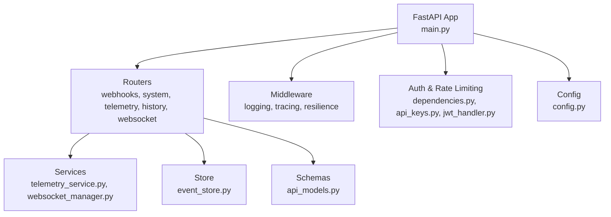
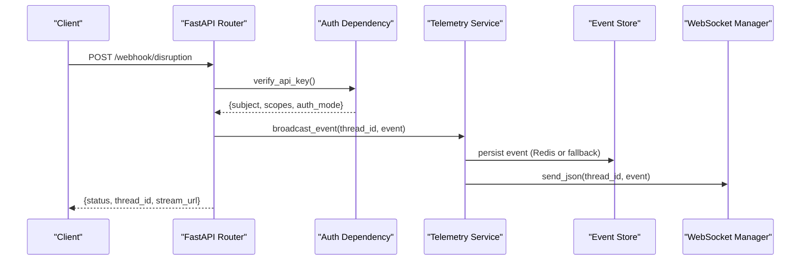
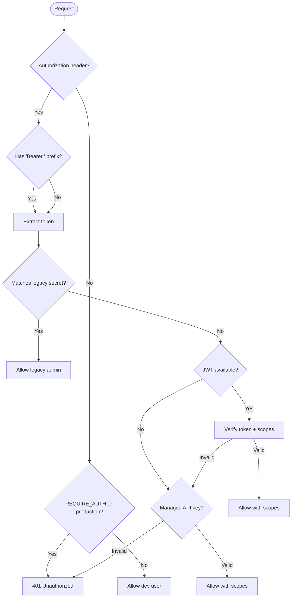
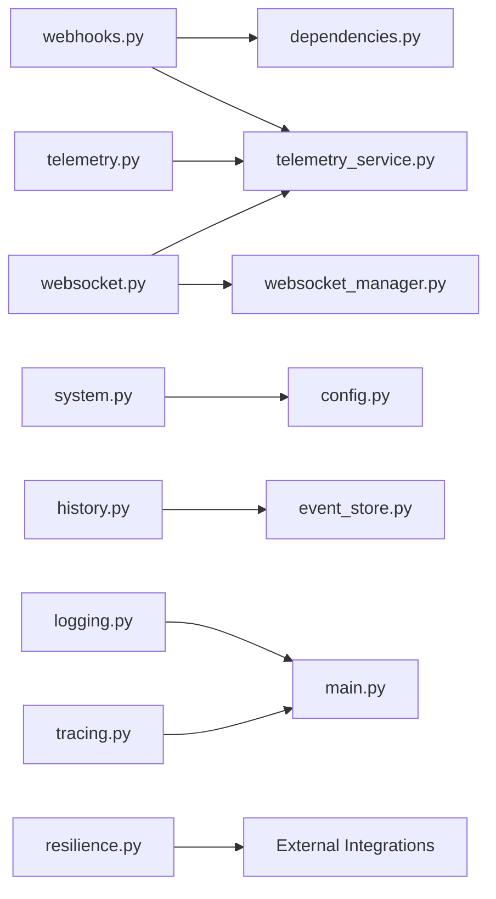

# Backend Services

<cite>
**Referenced Files in This Document**
- [main.py](file://backend/main.py)
- [config.py](file://backend/config.py)
- [dependencies.py](file://backend/api/dependencies.py)
- [api_keys.py](file://backend/auth/api_keys.py)
- [jwt_handler.py](file://backend/auth/jwt_handler.py)
- [logging.py](file://backend/middleware/logging.py)
- [tracing.py](file://backend/middleware/tracing.py)
- [resilience.py](file://backend/middleware/resilience.py)
- [webhooks.py](file://backend/api/routers/webhooks.py)
- [system.py](file://backend/api/routers/system.py)
- [telemetry.py](file://backend/api/routers/telemetry.py)
- [history.py](file://backend/api/routers/history.py)
- [websocket.py](file://backend/api/routers/websocket.py)
- [api_models.py](file://backend/schemas/api_models.py)
- [telemetry_service.py](file://backend/services/telemetry_service.py)
- [websocket_manager.py](file://backend/services/websocket_manager.py)
- [event_store.py](file://backend/store/event_store.py)
</cite>

## Table of Contents
1. Introduction
2. Project Structure
3. Core Components
4. Architecture Overview
5. Detailed Component Analysis
6. Dependency Analysis
7. Performance Considerations
8. Troubleshooting Guide
9. Conclusion
10. Appendices

## Introduction
This document provides comprehensive backend services documentation for the SynapseAir FastAPI application. It covers all REST API endpoints, webhook handlers for disruption ingestion and passenger consensus (HITL), system status monitoring, historical data retrieval, telemetry streaming via Server-Sent Events (SSE), and bidirectional WebSocket communication. It also documents authentication, middleware (logging, tracing, resilience), error handling, schemas, and client integration guidelines with common use cases.

## Project Structure
The backend is organized into routers (REST endpoints), services (business logic), middleware (observability and resilience), auth (authentication and rate limiting), schemas (Pydantic models), and store (persistence). The FastAPI application wires routers, CORS, lifespan lifecycle, and a health endpoint.

**Diagram sources**
- [main.py:40-113](file://backend/main.py#L40-L113)
- [webhooks.py:12-22](file://backend/api/routers/webhooks.py#L12-L22)
- [system.py:7-22](file://backend/api/routers/system.py#L7-L22)
- [telemetry.py:9-46](file://backend/api/routers/telemetry.py#L9-L46)
- [history.py:16-73](file://backend/api/routers/history.py#L16-L73)
- [websocket.py:18-92](file://backend/api/routers/websocket.py#L18-L92)
- [logging.py:37-100](file://backend/middleware/logging.py#L37-L100)
- [tracing.py:43-79](file://backend/middleware/tracing.py#L43-L79)
- [resilience.py:25-80](file://backend/middleware/resilience.py#L25-L80)
- [dependencies.py:25-78](file://backend/api/dependencies.py#L25-L78)
- [api_keys.py:32-83](file://backend/auth/api_keys.py#L32-L83)
- [jwt_handler.py:20-62](file://backend/auth/jwt_handler.py#L20-L62)
- [telemetry_service.py:45-68](file://backend/services/telemetry_service.py#L45-L68)
- [websocket_manager.py:16-74](file://backend/services/websocket_manager.py#L16-L74)
- [event_store.py:47-101](file://backend/store/event_store.py#L47-L101)
- [config.py:29-115](file://backend/config.py#L29-L115)

**Section sources**
- [main.py:1-128](file://backend/main.py#L1-L128)
- [config.py:1-116](file://backend/config.py#L1-L116)

## Core Components
- Authentication and authorization:
  - Multi-mode verification supporting legacy static key, JWT tokens, and managed API keys with scopes.
  - Rate limiting dependency using Redis-backed sliding window.
- Middleware:
  - Structured logging with optional JSON output and context binding.
  - OpenTelemetry tracing initialization and span helpers.
  - Resilience patterns: retry with exponential backoff and circuit breaker.
- Routers:
  - Webhooks for disruption ingestion and HITL consensus.
  - System status and health checks.
  - Telemetry SSE streaming and thread state inspection.
  - Historical queries and analytics.
  - WebSocket for real-time bidirectional communication.
- Services:
  - Telemetry broadcasting with PII masking and Redis-backed pub/sub.
  - WebSocket connection manager for fan-out messaging per thread.
- Store:
  - SQLite persistence for n8n events and disruption records with indexes and analytics.

**Section sources**
- [dependencies.py:25-130](file://backend/api/dependencies.py#L25-L130)
- [logging.py:37-147](file://backend/middleware/logging.py#L37-L147)
- [tracing.py:43-159](file://backend/middleware/tracing.py#L43-L159)
- [resilience.py:25-244](file://backend/middleware/resilience.py#L25-L244)
- [webhooks.py:12-185](file://backend/api/routers/webhooks.py#L12-L185)
- [system.py:7-53](file://backend/api/routers/system.py#L7-L53)
- [telemetry.py:9-72](file://backend/api/routers/telemetry.py#L9-L72)
- [history.py:16-74](file://backend/api/routers/history.py#L16-L74)
- [websocket.py:18-195](file://backend/api/routers/websocket.py#L18-L195)
- [telemetry_service.py:23-79](file://backend/services/telemetry_service.py#L23-L79)
- [websocket_manager.py:16-75](file://backend/services/websocket_manager.py#L16-L75)
- [event_store.py:47-335](file://backend/store/event_store.py#L47-L335)

## Architecture Overview
SynapseAir exposes REST endpoints for ingestion, status, history, and telemetry, plus a WebSocket channel for real-time interaction. Incoming requests are authenticated and optionally rate-limited. Disruption ingestion triggers an asynchronous swarm pipeline that emits telemetry events to subscribers. Historical data is persisted in SQLite and queryable via REST. Observability includes structured logs and OpenTelemetry spans.

**Diagram sources**
- [webhooks.py:14-72](file://backend/api/routers/webhooks.py#L14-L72)
- [dependencies.py:25-78](file://backend/api/dependencies.py#L25-L78)
- [telemetry_service.py:45-68](file://backend/services/telemetry_service.py#L45-L68)
- [websocket_manager.py:42-54](file://backend/services/websocket_manager.py#L42-L54)
- [event_store.py:107-160](file://backend/store/event_store.py#L107-L160)

## Detailed Component Analysis

### Authentication and Authorization
- Modes:
  - Legacy static key match against configured secret.
  - JWT token decode with optional scope enforcement.
  - Managed API keys with scopes and expiration.
- Scope checking:
  - Admin scope grants access; otherwise required scope must be present.
- Rate limiting:
  - Per-category sliding window via Redis; returns 429 with Retry-After when exceeded.

**Diagram sources**
- [dependencies.py:25-78](file://backend/api/dependencies.py#L25-L78)
- [jwt_handler.py:20-62](file://backend/auth/jwt_handler.py#L20-L62)
- [api_keys.py:32-83](file://backend/auth/api_keys.py#L32-L83)

**Section sources**
- [dependencies.py:25-130](file://backend/api/dependencies.py#L25-L130)
- [jwt_handler.py:1-63](file://backend/auth/jwt_handler.py#L1-L63)
- [api_keys.py:1-98](file://backend/auth/api_keys.py#L1-L98)

### Webhook Endpoints

#### POST /webhook/disruption
- Purpose: Ingest flight disruption events (structured or raw text) and start recovery workflow.
- Authentication: Required via Authorization header (legacy key, JWT, or managed key).
- Request schema: See DisruptionPayload model fields.
- Response:
  - 200: {status: "PROCESSING", thread_id, stream_url, message}
  - 401: Missing or invalid API key
- Behavior:
  - Creates or uses provided thread_id.
  - Initializes initial state and runs swarm pipeline asynchronously.
  - Returns immediate acknowledgment with stream URL for SSE.

**Section sources**
- [webhooks.py:14-72](file://backend/api/routers/webhooks.py#L14-L72)
- [api_models.py:5-79](file://backend/schemas/api_models.py#L5-L79)

#### POST /webhook/consensus
- Purpose: Submit passenger HITL decision (APPROVE/REJECT) to resume or stop workflow.
- Authentication: Required via Authorization header.
- Request schema: See ConsensusPayload model fields.
- Response:
  - 200: Decision processed; workflow resumed or stopped
  - 401: Missing or invalid API key
  - 404: No active session for thread_id
- Behavior:
  - Updates graph state at hitl_breakpoint node.
  - Broadcasts CONSENSUS_RECEIVED event.
  - If APPROVED, resumes graph and streams agent steps until completion.

**Section sources**
- [webhooks.py:74-185](file://backend/api/routers/webhooks.py#L74-L185)
- [api_models.py:81-102](file://backend/schemas/api_models.py#L81-L102)

### System Endpoints

#### GET /health
- Purpose: Lightweight health check returning service status and version.
- Authentication: None
- Response: {status: "healthy", version}

**Section sources**
- [main.py:119-122](file://backend/main.py#L119-L122)

#### GET /api/system/status
- Purpose: Full system status including provider configurations and integration states.
- Authentication: None
- Response: Includes deepseek, hermes, atlas_gds, n8n statuses and timestamp.

**Section sources**
- [system.py:9-53](file://backend/api/routers/system.py#L9-L53)

### Telemetry Endpoints

#### GET /stream/{thread_id}
- Purpose: SSE live telemetry stream for a given thread. Replays historical events then streams live with keep-alive.
- Authentication: None (public stream; consider securing in production).
- Response: text/event-stream with JSON payloads.
- Behavior:
  - Subscribes to thread queue.
  - Replays stored history.
  - Streams new events with timeout-based keep-alives.
  - Unsubscribes on disconnect.

**Section sources**
- [telemetry.py:11-46](file://backend/api/routers/telemetry.py#L11-L46)
- [telemetry_service.py:45-68](file://backend/services/telemetry_service.py#L45-L68)

#### GET /threads/{thread_id}/state
- Purpose: Inspect current LangGraph checkpointer state for a thread.
- Authentication: None (consider securing in production).
- Response: {thread_id, values, next, created_at}
- Errors: 404 if thread not found.

**Section sources**
- [telemetry.py:48-72](file://backend/api/routers/telemetry.py#L48-L72)

### History Endpoints

#### GET /api/history
- Purpose: Paginated list of past disruption events with optional filters.
- Query parameters:
  - limit: int (default 50)
  - offset: int (default 0)
  - airline: Optional[str]
  - loyalty_tier: Optional[str]
  - status: Optional[str]
- Response: {total, limit, offset, disruptions}

**Section sources**
- [history.py:19-47](file://backend/api/routers/history.py#L19-L47)
- [event_store.py:242-272](file://backend/store/event_store.py#L242-L272)

#### GET /api/history/stats
- Purpose: Aggregate analytics across all disruptions.
- Response: Totals, auto-approve/HITL rates, average resolution time, top routes.

**Section sources**
- [history.py:50-57](file://backend/api/routers/history.py#L50-L57)
- [event_store.py:288-335](file://backend/store/event_store.py#L288-L335)

#### GET /api/history/{thread_id}
- Purpose: Full detail of a specific disruption run by thread_id.
- Response: Disruption record or 404 if not found.

**Section sources**
- [history.py:60-73](file://backend/api/routers/history.py#L60-L73)
- [event_store.py:275-285](file://backend/store/event_store.py#L275-L285)

### WebSocket Endpoint

#### WebSocket /ws/{thread_id}
- Purpose: Bidirectional communication for real-time telemetry and HITL decisions.
- Client messages:
  - {"type": "PING"} → responds with {"type": "PONG"}
  - {"type": "HITL_DECISION", "action": "APPROVE|REJECT", "notes": "..."} → processes consensus
- Server messages:
  - {"type": "WS_CONNECTED", "thread_id", "timestamp"}
  - All SSE telemetry events replayed then streamed live
  - {"type": "HITL_CONFIRMED", "action", "thread_id"}
  - {"type": "WS_ERROR", "message"}
- Behavior:
  - Connects and registers connection per thread.
  - Replays historical events.
  - Handles HITL decisions and resumes graph if approved.
  - Cleans up connections on disconnect.

**Section sources**
- [websocket.py:21-92](file://backend/api/routers/websocket.py#L21-L92)
- [websocket.py:95-195](file://backend/api/routers/websocket.py#L95-L195)
- [websocket_manager.py:16-74](file://backend/services/websocket_manager.py#L16-L74)
- [telemetry_service.py:45-68](file://backend/services/telemetry_service.py#L45-L68)

## Dependency Analysis
- Routers depend on:
  - Authentication dependencies for protected endpoints.
  - Services for telemetry broadcasting and WebSocket management.
  - Store for persistence and analytics.
- Services depend on:
  - Redis broker for pub/sub and history (with fallback).
  - WebSocket manager for fan-out messaging.
- Middleware:
  - Logging and tracing initialized at app startup.
  - Resilience utilities used by external integrations (LLM/GDS/n8n).

**Diagram sources**
- [webhooks.py:12-22](file://backend/api/routers/webhooks.py#L12-L22)
- [dependencies.py:25-78](file://backend/api/dependencies.py#L25-L78)
- [telemetry_service.py:45-68](file://backend/services/telemetry_service.py#L45-L68)
- [system.py:7-22](file://backend/api/routers/system.py#L7-L22)
- [config.py:29-115](file://backend/config.py#L29-L115)
- [telemetry.py:9-46](file://backend/api/routers/telemetry.py#L9-L46)
- [history.py:16-73](file://backend/api/routers/history.py#L16-L73)
- [event_store.py:47-101](file://backend/store/event_store.py#L47-L101)
- [websocket.py:18-92](file://backend/api/routers/websocket.py#L18-L92)
- [websocket_manager.py:16-74](file://backend/services/websocket_manager.py#L16-L74)
- [logging.py:37-100](file://backend/middleware/logging.py#L37-L100)
- [tracing.py:43-79](file://backend/middleware/tracing.py#L43-L79)
- [resilience.py:25-80](file://backend/middleware/resilience.py#L25-L80)
- [main.py:40-113](file://backend/main.py#L40-L113)

**Section sources**
- [main.py:40-113](file://backend/main.py#L40-L113)
- [webhooks.py:12-185](file://backend/api/routers/webhooks.py#L12-L185)
- [system.py:7-53](file://backend/api/routers/system.py#L7-L53)
- [telemetry.py:9-72](file://backend/api/routers/telemetry.py#L9-L72)
- [history.py:16-74](file://backend/api/routers/history.py#L16-L74)
- [websocket.py:18-195](file://backend/api/routers/websocket.py#L18-L195)
- [telemetry_service.py:23-79](file://backend/services/telemetry_service.py#L23-L79)
- [websocket_manager.py:16-75](file://backend/services/websocket_manager.py#L16-L75)
- [event_store.py:47-335](file://backend/store/event_store.py#L47-L335)
- [logging.py:37-147](file://backend/middleware/logging.py#L37-L147)
- [tracing.py:43-159](file://backend/middleware/tracing.py#L43-L159)
- [resilience.py:25-244](file://backend/middleware/resilience.py#L25-L244)

## Performance Considerations
- SSE streaming:
  - Uses keep-alive intervals to maintain connections and avoid timeouts.
  - History replay ensures clients receive missed events upon reconnect.
- WebSocket fan-out:
  - Thread-scoped connection sets prevent cross-thread leakage.
  - Dead connection cleanup avoids resource leaks.
- Persistence:
  - SQLite WAL mode improves concurrency for reads/writes.
  - Indexes on thread_id and timestamps optimize queries.
- Observability:
  - Structured logs enable efficient parsing and filtering.
  - OpenTelemetry spans provide end-to-end tracing with optional OTLP export.
- Resilience:
  - Retry with exponential backoff reduces transient failures impact.
  - Circuit breakers protect downstream services from cascading failures.

[No sources needed since this section provides general guidance]

## Troubleshooting Guide
- Authentication failures:
  - Ensure Authorization header contains a valid key or JWT.
  - Verify environment configuration for secrets and algorithms.
- Rate limiting:
  - 429 responses include Retry-After; adjust client retry strategy accordingly.
- SSE/WebSocket issues:
  - Confirm thread_id exists and has active sessions.
  - Check Redis availability; fallback modes may reduce durability.
- History queries:
  - Validate filter parameters and pagination limits.
  - Use stats endpoint for high-level diagnostics.
- Provider health:
  - Use /api/system/status to inspect DeepSeek, Hermes, Atlas, and n8n configurations.

**Section sources**
- [dependencies.py:25-130](file://backend/api/dependencies.py#L25-L130)
- [system.py:24-53](file://backend/api/routers/system.py#L24-L53)
- [telemetry.py:11-72](file://backend/api/routers/telemetry.py#L11-L72)
- [websocket.py:21-92](file://backend/api/routers/websocket.py#L21-L92)
- [history.py:19-73](file://backend/api/routers/history.py#L19-L73)

## Conclusion
SynapseAir’s backend provides robust APIs for disruption ingestion, HITL consensus, system monitoring, historical analysis, and real-time telemetry via SSE and WebSocket. Authentication supports multiple modes with scope enforcement and rate limiting. Middleware ensures observability and resilience. Clients can integrate using standard HTTP and WebSocket protocols, leveraging streaming for live updates and persistence for auditability.

[No sources needed since this section summarizes without analyzing specific files]

## Appendices

### API Reference Summary

- Webhooks
  - POST /webhook/disruption
    - Auth: Required
    - Request: DisruptionPayload
    - Response: 200 {status, thread_id, stream_url, message}; 401
  - POST /webhook/consensus
    - Auth: Required
    - Request: ConsensusPayload
    - Response: 200; 401; 404

- System
  - GET /health
    - Auth: None
    - Response: 200 {status, version}
  - GET /api/system/status
    - Auth: None
    - Response: 200 {status, providers, timestamp}

- Telemetry
  - GET /stream/{thread_id}
    - Auth: None
    - Response: 200 text/event-stream
  - GET /threads/{thread_id}/state
    - Auth: None
    - Response: 200; 404

- History
  - GET /api/history
    - Query: limit, offset, airline, loyalty_tier, status
    - Response: 200 {total, limit, offset, disruptions}
  - GET /api/history/stats
    - Response: 200 {analytics}
  - GET /api/history/{thread_id}
    - Response: 200; 404

- WebSocket
  - WS /ws/{thread_id}
    - Messages: PING/PONG, HITL_DECISION, WS_CONNECTED, AGENT_STEP, WORKFLOW_COMPLETE, WS_ERROR

**Section sources**
- [webhooks.py:14-185](file://backend/api/routers/webhooks.py#L14-L185)
- [system.py:9-53](file://backend/api/routers/system.py#L9-L53)
- [telemetry.py:11-72](file://backend/api/routers/telemetry.py#L11-L72)
- [history.py:19-73](file://backend/api/routers/history.py#L19-L73)
- [websocket.py:21-195](file://backend/api/routers/websocket.py#L21-L195)
- [api_models.py:5-134](file://backend/schemas/api_models.py#L5-L134)

### Client Integration Guidelines
- Authentication:
  - Include Authorization header with one of supported modes.
  - For JWT, ensure scopes align with endpoint requirements.
- Disruption ingestion:
  - Send structured or raw_text payload; thread_id is optional.
  - Use returned stream_url to connect SSE or WebSocket for live updates.
- HITL flow:
  - Submit consensus via webhook or WebSocket HITL_DECISION.
  - Await CONSENSUS_RECEIVED and subsequent workflow events.
- Real-time updates:
  - Prefer WebSocket for bidirectional communication; fall back to SSE for read-only streams.
- Error handling:
  - Handle 401/403/404/429 appropriately.
  - Implement retries with backoff for transient errors.

**Section sources**
- [dependencies.py:25-130](file://backend/api/dependencies.py#L25-L130)
- [webhooks.py:14-185](file://backend/api/routers/webhooks.py#L14-L185)
- [telemetry.py:11-72](file://backend/api/routers/telemetry.py#L11-L72)
- [websocket.py:21-195](file://backend/api/routers/websocket.py#L21-L195)