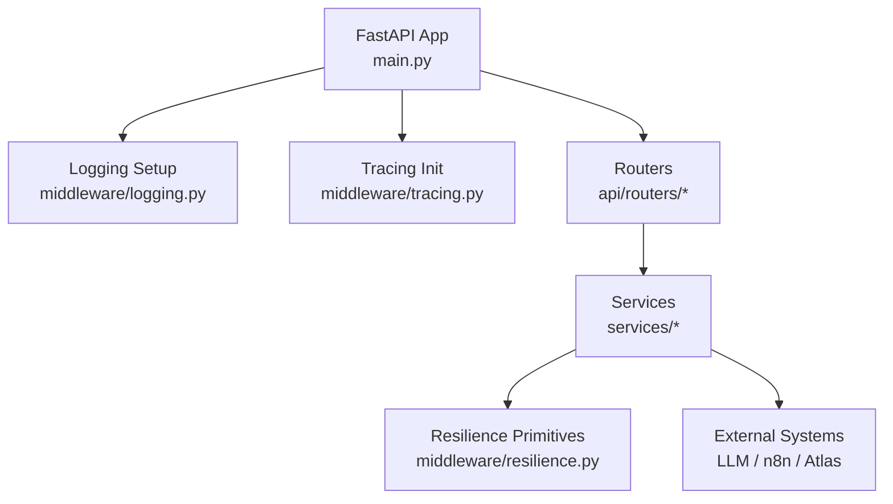
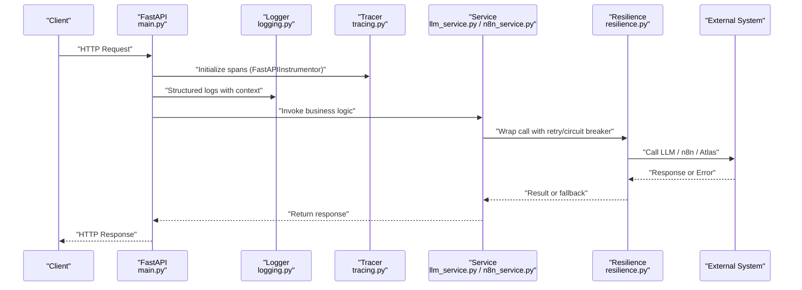
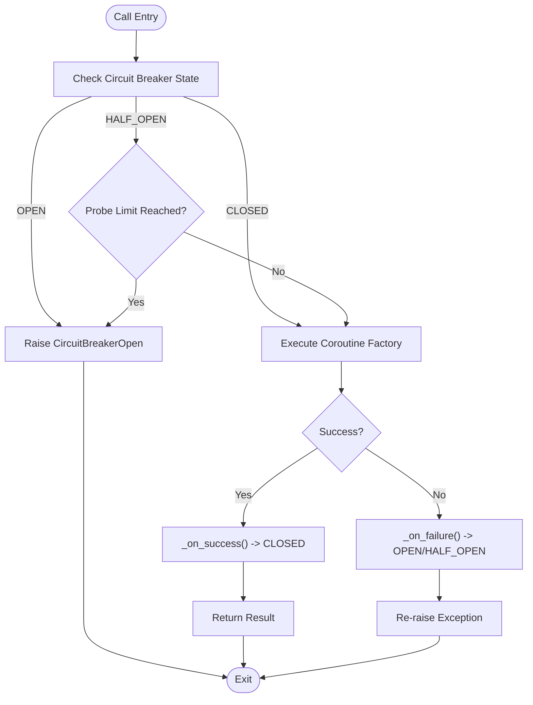
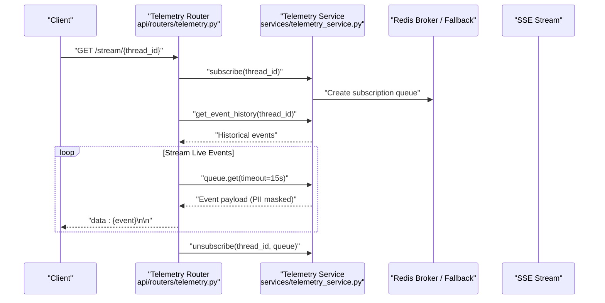
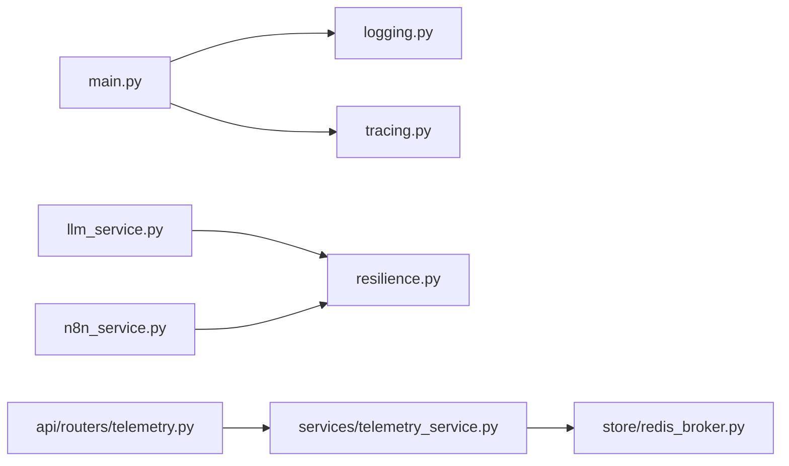

# Middleware & Cross-cutting Concerns

<cite>
**Referenced Files in This Document**
- [main.py](file://backend/main.py)
- [logging.py](file://backend/middleware/logging.py)
- [tracing.py](file://backend/middleware/tracing.py)
- [resilience.py](file://backend/middleware/resilience.py)
- [config.py](file://backend/config.py)
- [llm_service.py](file://backend/services/llm_service.py)
- [n8n_service.py](file://backend/services/n8n_service.py)
- [telemetry_service.py](file://backend/services/telemetry_service.py)
- [telemetry.py](file://backend/api/routers/telemetry.py)
- [state.py](file://backend/state.py)
</cite>

## Table of Contents
1. [Introduction](#introduction)
2. [Project Structure](#project-structure)
3. [Core Components](#core-components)
4. [Architecture Overview](#architecture-overview)
5. [Detailed Component Analysis](#detailed-component-analysis)
6. [Dependency Analysis](#dependency-analysis)
7. [Performance Considerations](#performance-considerations)
8. [Troubleshooting Guide](#troubleshooting-guide)
9. [Conclusion](#conclusion)

## Introduction
This document explains the middleware layer and cross-cutting concerns in the SynapseAir backend, focusing on:
- Structured logging with log levels, correlation context, and aggregation patterns
- OpenTelemetry tracing for distributed request tracking across agents and services
- Resilience middleware including retry policies, timeouts, and fallback mechanisms
- Composition, configuration, and extension points for custom middleware logic
- Performance monitoring, debugging techniques, and operational insights provided by the middleware layer

## Project Structure
The middleware layer is organized under backend/middleware and integrated at application startup in main.py. It provides:
- Logging setup and contextual binding
- Tracing initialization and span utilities
- Resilience primitives (retry with backoff and circuit breaker)

**Diagram sources**
- [main.py:22-37](file://backend/main.py#L22-L37)
- [logging.py:37-100](file://backend/middleware/logging.py#L37-L100)
- [tracing.py:43-80](file://backend/middleware/tracing.py#L43-L80)
- [resilience.py:25-80](file://backend/middleware/resilience.py#L25-L80)

**Section sources**
- [main.py:22-37](file://backend/main.py#L22-L37)
- [logging.py:37-100](file://backend/middleware/logging.py#L37-L100)
- [tracing.py:43-80](file://backend/middleware/tracing.py#L43-L80)

## Core Components
- Structured logging: JSON or console output, level control, context-bound fields, and graceful fallback to stdlib when structlog is unavailable.
- OpenTelemetry tracing: Global tracer provider, FastAPI instrumentation, span decorators, and trace context extraction for SSE propagation.
- Resilience: Exponential backoff retry wrapper and a three-state circuit breaker with configurable thresholds and cooldowns.

Key integration points:
- Application lifecycle initializes logging and tracing once at startup.
- Services compose resilience primitives around external calls (LLMs, webhooks).
- Telemetry endpoints stream execution logs and thread state for real-time observability.

**Section sources**
- [logging.py:37-119](file://backend/middleware/logging.py#L37-L119)
- [tracing.py:43-121](file://backend/middleware/tracing.py#L43-L121)
- [resilience.py:25-215](file://backend/middleware/resilience.py#L25-L215)
- [main.py:22-37](file://backend/main.py#L22-L37)

## Architecture Overview
The middleware layer sits between HTTP requests and business services, ensuring consistent observability and resilience.

**Diagram sources**
- [main.py:22-37](file://backend/main.py#L22-L37)
- [tracing.py:43-80](file://backend/middleware/tracing.py#L43-L80)
- [logging.py:37-100](file://backend/middleware/logging.py#L37-L100)
- [resilience.py:25-80](file://backend/middleware/resilience.py#L25-L80)
- [llm_service.py:85-96](file://backend/services/llm_service.py#L85-L96)
- [n8n_service.py:155-163](file://backend/services/n8n_service.py#L155-L163)

## Detailed Component Analysis

### Structured Logging System
- Configuration:
  - Level, JSON output mode, and service name are set during app startup.
  - Uses structlog processors to merge context variables, add log level, timestamp, stack info, and unicode decoding.
  - Falls back to Python stdlib logging if structlog is not installed.
- Contextual binding:
  - LogContext binds temporary fields to the active context for structured correlation.
  - get_logger returns a bound logger instance for modules.
- Aggregation pattern:
  - JSON lines in production enable centralized log aggregation pipelines.
  - Console renderer in development aids local debugging.

Operational usage:
- Start logging via setup_logging at application lifespan.
- Use get_logger in modules; bind per-request fields with LogContext where appropriate.

**Section sources**
- [logging.py:37-100](file://backend/middleware/logging.py#L37-L100)
- [logging.py:107-147](file://backend/middleware/logging.py#L107-L147)
- [main.py:22-37](file://backend/main.py#L22-L37)

### OpenTelemetry Tracing
- Initialization:
  - init_tracing sets up a TracerProvider with Resource attributes and adds BatchSpanProcessors for console and optional OTLP exporter.
  - FastAPIInstrumentor instruments the app when provided.
- Span utilities:
  - trace_span creates named spans with attributes.
  - get_trace_context extracts trace_id and span_id for embedding into SSE events.
- Decorators:
  - trace_agent_node wraps agent node functions with spans.
  - trace_llm_call wraps LLM calls with model metadata attributes.

Distributed tracking:
- Spans propagate across services and agents, enabling end-to-end visibility.
- SSE streams can include trace context for correlating UI actions with backend traces.

**Section sources**
- [tracing.py:43-80](file://backend/middleware/tracing.py#L43-L80)
- [tracing.py:86-121](file://backend/middleware/tracing.py#L86-L121)
- [tracing.py:128-158](file://backend/middleware/tracing.py#L128-L158)
- [main.py:22-37](file://backend/main.py#L22-L37)

### Resilience Middleware
- Retry with exponential backoff:
  - retry_with_backoff executes an async coroutine factory with configurable retries, base delay, max delay, jitter, and exception filtering.
  - Logs attempt details and delays; raises last exception after exhaustion.
- Circuit Breaker:
  - Three states: CLOSED, OPEN, HALF_OPEN.
  - Tracks failures, success counts, cooldown transitions, and probe limits.
  - Provides pre-built breakers for specific services (e.g., deepseek_breaker, hermes_breaker, atlas_breaker, n8n_breaker).

Usage in services:
- LLM calls wrapped with retry and circuit breaker; fallback logic invoked on failure.
- n8n webhook dispatches use the same resilience pattern with durable event recording.

**Diagram sources**
- [resilience.py:86-215](file://backend/middleware/resilience.py#L86-L215)

**Section sources**
- [resilience.py:25-80](file://backend/middleware/resilience.py#L25-L80)
- [resilience.py:86-215](file://backend/middleware/resilience.py#L86-L215)
- [llm_service.py:85-96](file://backend/services/llm_service.py#L85-L96)
- [n8n_service.py:155-163](file://backend/services/n8n_service.py#L155-L163)

### Middleware Composition and Extension
- Composition:
  - CORS middleware configured at app level for frontend access.
  - Routers mounted to expose system, webhooks, telemetry, history, websocket, and tests endpoints.
  - Lifespan manager initializes logging and tracing once at startup.
- Extension points:
  - Add new routers to include additional endpoints.
  - Wrap external calls in services with retry_with_backoff and CircuitBreaker instances.
  - Use trace_span or decorators to instrument new operations.
  - Bind contextual fields with LogContext for structured logs.

Configuration:
- Environment-driven settings via config.py (LOG_LEVEL, LOG_JSON, OTEL_ENDPOINT).
- Service-specific breakers preconfigured for known external systems.

**Section sources**
- [main.py:74-113](file://backend/main.py#L74-L113)
- [main.py:22-37](file://backend/main.py#L22-L37)
- [config.py:79-84](file://backend/config.py#L79-L84)
- [resilience.py:218-244](file://backend/middleware/resilience.py#L218-L244)

### Real-Time Telemetry and Correlation
- SSE streaming:
  - Telemetry endpoint subscribes to thread queues, replays historical events, and streams live updates with keep-alive.
  - PII masking applied before broadcast to protect sensitive data.
- Thread state inspection:
  - Endpoint retrieves current LangGraph checkpointer state for a thread, aiding debugging and auditing.
- Correlation:
  - Trace context extracted via get_trace_context can be embedded in SSE payloads for frontend correlation.

**Diagram sources**
- [telemetry.py:11-46](file://backend/api/routers/telemetry.py#L11-L46)
- [telemetry_service.py:23-58](file://backend/services/telemetry_service.py#L23-L58)

**Section sources**
- [telemetry.py:11-72](file://backend/api/routers/telemetry.py#L11-L72)
- [telemetry_service.py:23-79](file://backend/services/telemetry_service.py#L23-L79)
- [state.py:67-75](file://backend/state.py#L67-L75)

## Dependency Analysis
The middleware layer has clear separation of concerns:
- Logging and tracing are initialized once and used throughout.
- Services depend on resilience primitives for external calls.
- Telemetry endpoints rely on services and storage backends.

**Diagram sources**
- [main.py:22-37](file://backend/main.py#L22-L37)
- [llm_service.py:85-96](file://backend/services/llm_service.py#L85-L96)
- [n8n_service.py:155-163](file://backend/services/n8n_service.py#L155-L163)
- [telemetry.py:11-46](file://backend/api/routers/telemetry.py#L11-L46)
- [telemetry_service.py:45-58](file://backend/services/telemetry_service.py#L45-L58)

**Section sources**
- [llm_service.py:85-96](file://backend/services/llm_service.py#L85-L96)
- [n8n_service.py:155-163](file://backend/services/n8n_service.py#L155-L163)
- [telemetry.py:11-46](file://backend/api/routers/telemetry.py#L11-L46)
- [telemetry_service.py:45-58](file://backend/services/telemetry_service.py#L45-L58)

## Performance Considerations
- Logging:
  - Prefer JSON output in production for efficient ingestion and reduced parsing overhead.
  - Avoid excessive log volume; bind only necessary fields via LogContext.
- Tracing:
  - Use BatchSpanProcessor to minimize export overhead.
  - Instrument only critical paths to reduce noise and resource usage.
- Resilience:
  - Tune retry parameters (max_retries, base_delay, max_delay) per dependency characteristics.
  - Set appropriate circuit breaker thresholds and cooldowns to prevent cascading failures.
- Telemetry:
  - Mask PII before broadcasting to avoid unnecessary processing downstream.
  - Use keep-alive intervals to maintain SSE connections efficiently.

[No sources needed since this section provides general guidance]

## Troubleshooting Guide
Common issues and remedies:
- Missing dependencies:
  - If structlog or OpenTelemetry packages are absent, logging and tracing degrade gracefully to no-ops or stdlib equivalents.
- High error rates:
  - Inspect circuit breaker state and logs; adjust thresholds or cooldowns based on observed failure patterns.
- SSE connection drops:
  - Verify client disconnect handling and ensure unsubscribe is called in finally blocks.
- PII exposure:
  - Confirm masking is applied before broadcast; review telemetry_service mask_pii logic.

Debugging techniques:
- Enable detailed logging levels and JSON output for structured analysis.
- Embed trace context in SSE payloads using get_trace_context for end-to-end correlation.
- Use thread state inspection endpoint to inspect LangGraph state snapshots.

**Section sources**
- [logging.py:21-27](file://backend/middleware/logging.py#L21-L27)
- [tracing.py:21-34](file://backend/middleware/tracing.py#L21-L34)
- [resilience.py:86-215](file://backend/middleware/resilience.py#L86-L215)
- [telemetry_service.py:23-58](file://backend/services/telemetry_service.py#L23-L58)
- [telemetry.py:48-72](file://backend/api/routers/telemetry.py#L48-L72)

## Conclusion
The SynapseAir middleware layer provides robust cross-cutting capabilities:
- Structured logging with contextual correlation and flexible output modes
- OpenTelemetry-based distributed tracing with FastAPI instrumentation and span utilities
- Resilience through retry with backoff and circuit breakers, with pre-configured breakers for key services
- Real-time telemetry streaming with PII masking and thread state inspection
These components are composed at application startup and extended via services, enabling scalable, observable, and resilient operations across agents and external systems.

[No sources needed since this section summarizes without analyzing specific files]