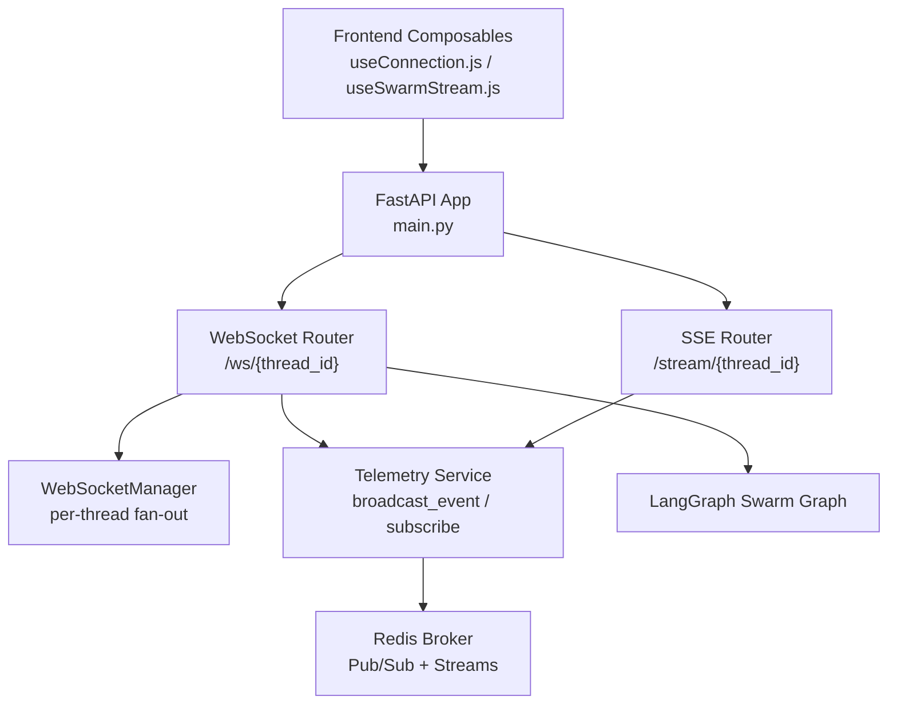
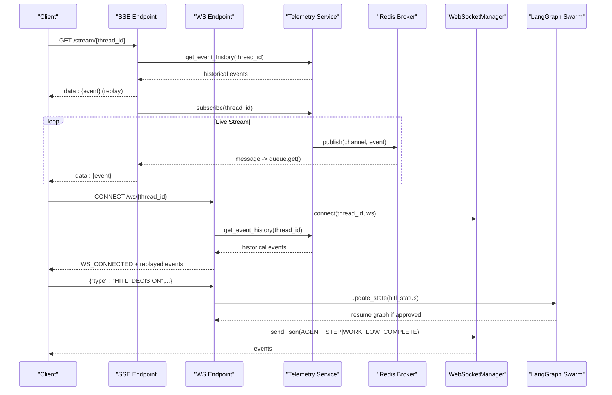
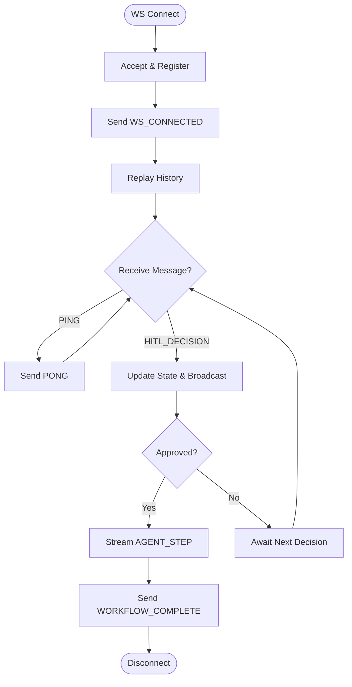
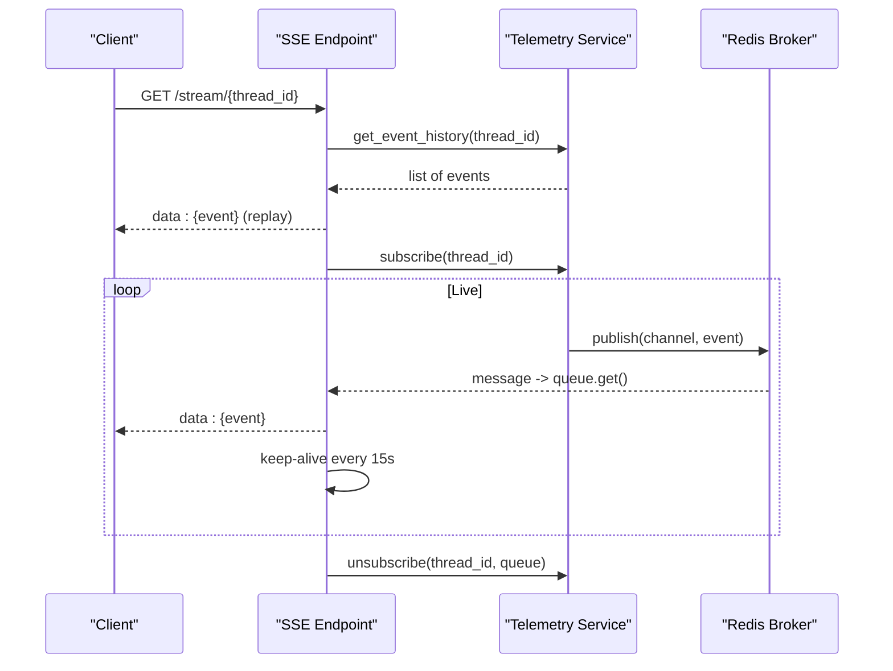
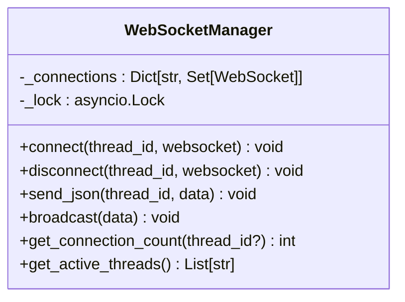
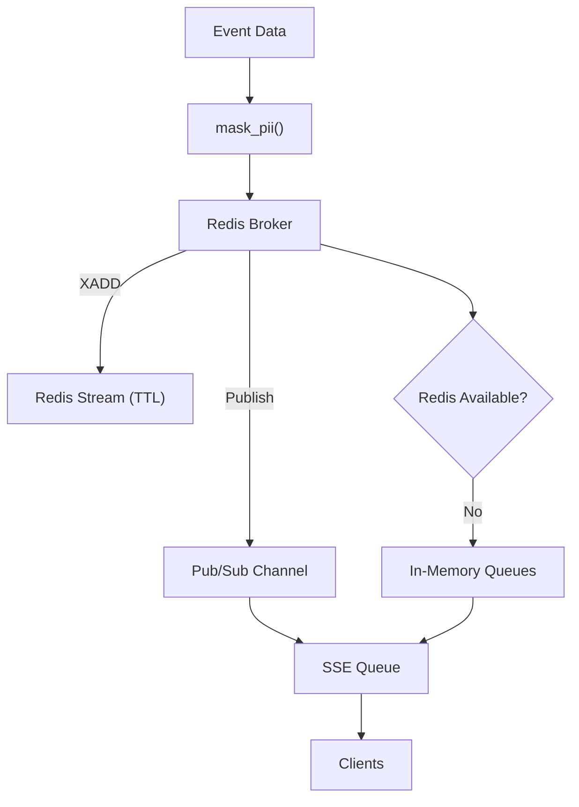
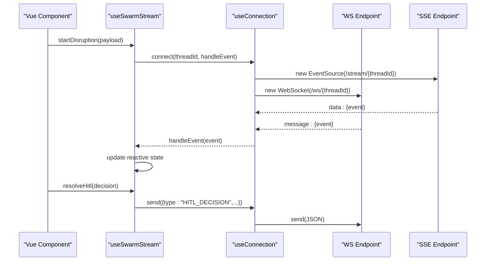
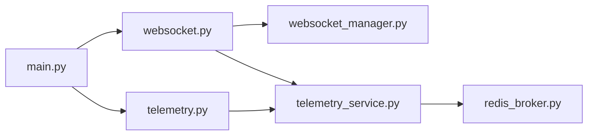

# WebSocket & Real-time Communication

<cite>
**Referenced Files in This Document**
- [main.py](file://backend/main.py)
- [websocket.py](file://backend/api/routers/websocket.py)
- [telemetry.py](file://backend/api/routers/telemetry.py)
- [websocket_manager.py](file://backend/services/websocket_manager.py)
- [telemetry_service.py](file://backend/services/telemetry_service.py)
- [redis_broker.py](file://backend/store/redis_broker.py)
- [api_models.py](file://backend/schemas/api_models.py)
- [useConnection.js](file://frontend/src/composables/useConnection.js)
- [useSwarmStream.js](file://frontend/src/composables/useSwarmStream.js)
</cite>

## Table of Contents
1. [Introduction](#introduction)
2. [Project Structure](#project-structure)
3. [Core Components](#core-components)
4. [Architecture Overview](#architecture-overview)
5. [Detailed Component Analysis](#detailed-component-analysis)
6. [Dependency Analysis](#dependency-analysis)
7. [Performance Considerations](#performance-considerations)
8. [Troubleshooting Guide](#troubleshooting-guide)
9. [Conclusion](#conclusion)
10. [Appendices](#appendices)

## Introduction
This document explains the SynapseAir backend’s real-time communication capabilities, focusing on:
- Bidirectional WebSocket endpoint for live telemetry and Human-in-the-Loop (HITL) decisions
- Server-Sent Events (SSE) stream for agent activity updates with history replay and keep-alive
- WebSocket manager for connection lifecycle, room-based messaging per thread, and broadcast
- Client integration patterns using Vue composables that prefer SSE for streaming and use WebSocket for bidirectional actions
- Event schemas, message protocols, error handling strategies, and best practices

## Project Structure
The real-time features are implemented across FastAPI routers, services, and a Redis-backed event bus, with a Vue frontend composable layer for transport abstraction.

**Diagram sources**
- [main.py:104-108](file://backend/main.py#L104-L108)
- [websocket.py:21-92](file://backend/api/routers/websocket.py#L21-L92)
- [telemetry.py:11-46](file://backend/api/routers/telemetry.py#L11-L46)
- [websocket_manager.py:16-74](file://backend/services/websocket_manager.py#L16-L74)
- [telemetry_service.py:45-68](file://backend/services/telemetry_service.py#L45-L68)
- [redis_broker.py:86-179](file://backend/store/redis_broker.py#L86-L179)

**Section sources**
- [main.py:104-108](file://backend/main.py#L104-L108)

## Core Components
- WebSocket Endpoint: Accepts connections per thread, replays historical events, handles PING/HITL_DECISION, and streams agent steps and workflow completion.
- SSE Endpoint: Streams JSON events to clients with history replay and periodic keep-alive; subscribes via an async queue backed by Redis Pub/Sub or in-memory fallback.
- WebSocket Manager: Tracks active WebSocket connections per thread, supports fan-out messaging and cleanup of dead connections.
- Telemetry Service: Masks PII, broadcasts events to both SSE subscribers and WebSocket listeners, and provides subscription/history APIs.
- Redis Broker: Provides durable event history via Redis Streams and real-time fan-out via Pub/Sub, with graceful fallback to in-memory queues when Redis is unavailable.
- Frontend Composables: Open SSE first, then WebSocket; route incoming events to UI state; send HITL decisions over WebSocket and persist via REST fallback.

**Section sources**
- [websocket.py:21-92](file://backend/api/routers/websocket.py#L21-L92)
- [telemetry.py:11-46](file://backend/api/routers/telemetry.py#L11-L46)
- [websocket_manager.py:16-74](file://backend/services/websocket_manager.py#L16-L74)
- [telemetry_service.py:23-68](file://backend/services/telemetry_service.py#L23-L68)
- [redis_broker.py:86-179](file://backend/store/redis_broker.py#L86-L179)
- [useConnection.js:24-97](file://frontend/src/composables/useConnection.js#L24-L97)
- [useSwarmStream.js:98-257](file://frontend/src/composables/useSwarmStream.js#L98-L257)

## Architecture Overview
Real-time communication uses two complementary channels:
- SSE for high-throughput, server-to-client streaming with history replay and keep-alive
- WebSocket for bidirectional control messages (e.g., HITL decisions) and additional event fan-out

**Diagram sources**
- [telemetry.py:17-46](file://backend/api/routers/telemetry.py#L17-L46)
- [websocket.py:21-92](file://backend/api/routers/websocket.py#L21-L92)
- [websocket.py:95-195](file://backend/api/routers/websocket.py#L95-L195)
- [telemetry_service.py:45-68](file://backend/services/telemetry_service.py#L45-L68)
- [redis_broker.py:86-179](file://backend/store/redis_broker.py#L86-L179)
- [websocket_manager.py:26-60](file://backend/services/websocket_manager.py#L26-L60)

## Detailed Component Analysis

### WebSocket Endpoint (/ws/{thread_id})
- Connection lifecycle: accepts connection, sends confirmation, replays history, listens for client messages, and disconnects cleanly.
- Message protocol:
  - Client -> Server:
    - PING → responds with PONG
    - HITL_DECISION → action (APPROVE/REJECT), notes, thread_id
  - Server -> Client:
    - WS_CONNECTED — connection confirmed
    - All historical telemetry events replayed then streamed live
    - CONSENSUS_RECEIVED — consensus acknowledged
    - AGENT_STEP — agent execution logs and state updates
    - WORKFLOW_COMPLETE — final result including ticket info
    - WS_ERROR — error details
- HITL flow: validates active session, updates LangGraph state, broadcasts consensus, resumes graph if approved, streams step logs and completion.

**Diagram sources**
- [websocket.py:21-92](file://backend/api/routers/websocket.py#L21-L92)
- [websocket.py:95-195](file://backend/api/routers/websocket.py#L95-L195)

**Section sources**
- [websocket.py:21-92](file://backend/api/routers/websocket.py#L21-L92)
- [websocket.py:95-195](file://backend/api/routers/websocket.py#L95-L195)

### SSE Endpoint (/stream/{thread_id})
- Replays historical events first, then streams live events from a queue.
- Sends keep-alive every 15 seconds to maintain long-lived connections.
- Subscribes/unsubscribes via telemetry service which delegates to Redis broker or in-memory fallback.

**Diagram sources**
- [telemetry.py:17-46](file://backend/api/routers/telemetry.py#L17-L46)
- [telemetry_service.py:56-68](file://backend/services/telemetry_service.py#L56-L68)
- [redis_broker.py:123-179](file://backend/store/redis_broker.py#L123-L179)

**Section sources**
- [telemetry.py:17-46](file://backend/api/routers/telemetry.py#L17-L46)

### WebSocket Manager
- Maintains per-thread sets of active WebSocket connections.
- Thread-safe connect/disconnect with asyncio locks.
- Fan-out send_json to all clients in a thread; cleans up dead connections.
- Global broadcast capability across all threads.

**Diagram sources**
- [websocket_manager.py:16-74](file://backend/services/websocket_manager.py#L16-L74)

**Section sources**
- [websocket_manager.py:16-74](file://backend/services/websocket_manager.py#L16-L74)

### Telemetry Service and Redis Broker
- Telemetry Service masks PII before broadcasting to protect sensitive data.
- Broadcasts to both SSE subscribers and WebSocket listeners.
- Redis Broker persists events in Streams with TTL and fans out via Pub/Sub; falls back to in-memory queues when Redis is unavailable.

**Diagram sources**
- [telemetry_service.py:23-68](file://backend/services/telemetry_service.py#L23-L68)
- [redis_broker.py:86-179](file://backend/store/redis_broker.py#L86-L179)

**Section sources**
- [telemetry_service.py:23-68](file://backend/services/telemetry_service.py#L23-L68)
- [redis_broker.py:86-179](file://backend/store/redis_broker.py#L86-L179)

### Frontend Integration Patterns
- Transport Layer (useConnection.js):
  - Opens SSE first for streaming; opens WebSocket second for bidirectional actions.
  - Routes parsed JSON events to callbacks; tracks connection mode and closes resources on unmount.
- Stream Orchestrator (useSwarmStream.js):
  - Manages reactive UI state (active agent, logs, proposed solution, ticket receipt).
  - Handles event types: AGENT_STEP, HITL_REQUIRED, AGENT_MESSAGE, WORKFLOW_NODE_ERROR, WORKFLOW_COMPLETE.
  - Sends HITL_DECISION via WebSocket and persists via REST fallback for durability.

**Diagram sources**
- [useConnection.js:24-97](file://frontend/src/composables/useConnection.js#L24-L97)
- [useSwarmStream.js:98-257](file://frontend/src/composables/useSwarmStream.js#L98-L257)
- [websocket.py:21-92](file://backend/api/routers/websocket.py#L21-L92)
- [telemetry.py:17-46](file://backend/api/routers/telemetry.py#L17-L46)

**Section sources**
- [useConnection.js:24-97](file://frontend/src/composables/useConnection.js#L24-L97)
- [useSwarmStream.js:98-257](file://frontend/src/composables/useSwarmStream.js#L98-L257)

## Dependency Analysis
- main.py includes routers for telemetry and websocket, enabling endpoints under the FastAPI app.
- websocket.py depends on WebSocketManager, TelemetryService, and LangGraph swarm graph for HITL processing and resuming workflows.
- telemetry.py depends on TelemetryService for subscribing/unsubscribing and retrieving history.
- TelemetryService bridges Redis Broker and WebSocketManager for dual delivery.
- Redis Broker abstracts Redis availability and provides in-memory fallback.

**Diagram sources**
- [main.py:104-108](file://backend/main.py#L104-L108)
- [websocket.py:14-16](file://backend/api/routers/websocket.py#L14-L16)
- [telemetry.py:6-7](file://backend/api/routers/telemetry.py#L6-L7)
- [telemetry_service.py:13-20](file://backend/services/telemetry_service.py#L13-L20)

**Section sources**
- [main.py:104-108](file://backend/main.py#L104-L108)
- [websocket.py:14-16](file://backend/api/routers/websocket.py#L14-L16)
- [telemetry.py:6-7](file://backend/api/routers/telemetry.py#L6-L7)
- [telemetry_service.py:13-20](file://backend/services/telemetry_service.py#L13-L20)

## Performance Considerations
- SSE keep-alive every 15 seconds prevents idle timeouts while minimizing overhead.
- Redis Streams cap at 500 entries per thread with TTL to bound memory usage.
- WebSocketManager copies connection sets before sending to avoid mutation during iteration and cleans dead connections promptly.
- PII masking occurs before broadcast to reduce risk and ensure compliance without impacting throughput significantly.
- In-memory fallback ensures resilience when Redis is unavailable, though it does not persist across process restarts.

[No sources needed since this section provides general guidance]

## Troubleshooting Guide
Common issues and resolutions:
- Unknown message type on WebSocket: The endpoint returns WS_ERROR with details; verify client payload structure and supported types.
- Invalid JSON on WebSocket: WS_ERROR indicates malformed JSON; validate client serialization.
- No active session for thread: HITL decision fails if no current state exists; ensure thread was created and active.
- SSE disconnection: Ensure keep-alive is handled; check network proxies and browser settings; re-subscribe on reconnect.
- Redis unavailability: System falls back to in-memory queues; confirm USE_REDIS configuration and REDIS_URL if persistence is required.

**Section sources**
- [websocket.py:59-89](file://backend/api/routers/websocket.py#L59-L89)
- [websocket.py:100-140](file://backend/api/routers/websocket.py#L100-L140)
- [telemetry.py:27-36](file://backend/api/routers/telemetry.py#L27-L36)
- [redis_broker.py:42-62](file://backend/store/redis_broker.py#L42-L62)

## Conclusion
SynapseAir’s real-time system combines SSE for robust, scalable streaming with WebSocket for bidirectional control. The design emphasizes reliability through Redis-backed persistence, graceful fallbacks, and careful resource management. Clients integrate via a simple composable that prioritizes SSE for streaming and uses WebSocket for HITL decisions, ensuring a responsive user experience even under connectivity constraints.

[No sources needed since this section summarizes without analyzing specific files]

## Appendices

### Event Schemas and Protocols
- WebSocket client messages:
  - PING → PONG
  - HITL_DECISION → action (APPROVE/REJECT), notes, thread_id
- WebSocket server messages:
  - WS_CONNECTED — thread_id, timestamp
  - Historical telemetry events (same schema as SSE)
  - CONSENSUS_RECEIVED — thread_id, action, notes, timestamp, source
  - AGENT_STEP — thread_id, node, log, state_update, timestamp
  - WORKFLOW_COMPLETE — thread_id, timestamp, message, ticket
  - WS_ERROR — message
- SSE events:
  - JSON payloads identical to WebSocket telemetry events; delivered as data: lines with keep-alive markers.

**Section sources**
- [websocket.py:25-33](file://backend/api/routers/websocket.py#L25-L33)
- [websocket.py:39-71](file://backend/api/routers/websocket.py#L39-L71)
- [websocket.py:116-188](file://backend/api/routers/websocket.py#L116-L188)
- [telemetry.py:22-34](file://backend/api/routers/telemetry.py#L22-L34)

### Client Implementation Examples
- Opening SSE and WebSocket:
  - Use the provided composables to connect to /stream/{thread_id} and /ws/{thread_id}, parse JSON events, and route them to UI state handlers.
- Sending HITL decisions:
  - Send HITL_DECISION via WebSocket; rely on REST fallback for durability if needed.
- Handling errors and reconnection:
  - On SSE errors, attempt reconnect; on WebSocket close, fall back to SSE-only mode until reconnected.

**Section sources**
- [useConnection.js:24-97](file://frontend/src/composables/useConnection.js#L24-L97)
- [useSwarmStream.js:213-257](file://frontend/src/composables/useSwarmStream.js#L213-L257)

### Connection Management Best Practices
- Prefer SSE for continuous telemetry; use WebSocket for control-plane actions.
- Always close connections on component unmount to free resources.
- Validate payloads and handle unknown message types gracefully.
- Monitor connection counts and active threads for operational insights.

**Section sources**
- [websocket_manager.py:62-70](file://backend/services/websocket_manager.py#L62-L70)
- [useConnection.js:94-97](file://frontend/src/composables/useConnection.js#L94-L97)