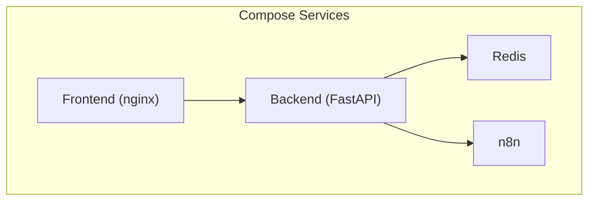
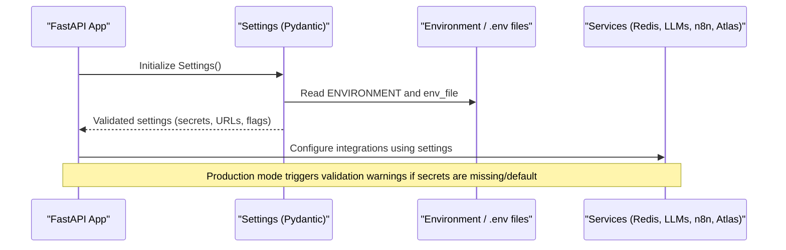
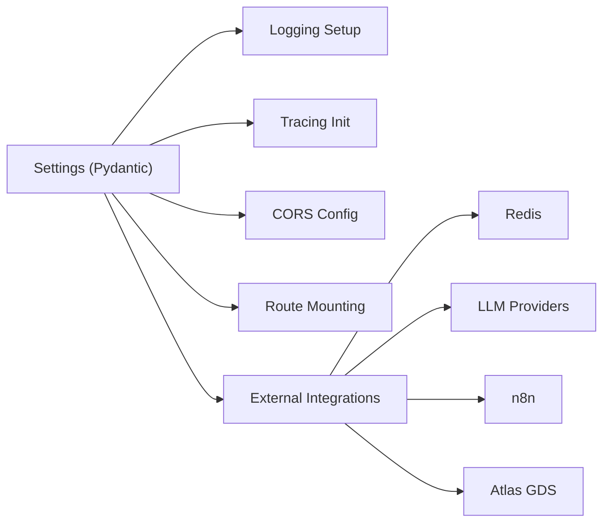

# Configuration Management

<cite>
**Referenced Files in This Document**
- [config.py](file://travel-recovery-os/backend/config.py)
- [docker-compose.yml](file://travel-recovery-os/docker-compose.yml)
- [ci.yml](file://travel-recovery-os/.github/workflows/ci.yml)
- [deploy.yml](file://travel-recovery-os/.github/workflows/deploy.yml)
- [config.production.env.example](file://travel-recovery-os/backend/config.production.env.example)
- [main.py](file://travel-recovery-os/backend/main.py)
- [Dockerfile (backend)](file://travel-recovery-os/backend/Dockerfile)
- [Dockerfile (frontend)](file://travel-recovery-os/frontend/Dockerfile)
- [requirements.txt](file://travel-recovery-os/backend/requirements.txt)
</cite>

## Table of Contents
1. [Introduction](#introduction)
2. [Project Structure](#project-structure)
3. [Core Components](#core-components)
4. [Architecture Overview](#architecture-overview)
5. [Detailed Component Analysis](#detailed-component-analysis)
6. [Dependency Analysis](#dependency-analysis)
7. [Performance Considerations](#performance-considerations)
8. [Troubleshooting Guide](#troubleshooting-guide)
9. [Conclusion](#conclusion)
10. [Appendices](#appendices)

## Introduction
This document provides comprehensive configuration management guidance for the SynapseAir platform. It covers environment-specific configuration using Pydantic settings, environment variable management, and secret handling best practices. It also documents Docker Compose orchestration, container networking, volume management, CI/CD pipeline configuration, validation rules, defaults, migration strategies, and examples for development, staging, and production environments with scaling considerations.

## Project Structure
SynapseAir is a full-stack application with:
- Backend: FastAPI service with Pydantic-based configuration, Redis-backed storage, JWT auth, and optional LLM integrations.
- Frontend: Vue 3 SPA served by Nginx.
- Orchestration: Docker Compose defines services for backend, frontend, Redis, and n8n workflow automation.
- CI/CD: GitHub Actions workflows for linting, type checking, testing, building, pushing images, and deploying to production via SSH.

**Diagram sources**
- [docker-compose.yml:4-66](file://travel-recovery-os/docker-compose.yml#L4-L66)

**Section sources**
- [docker-compose.yml:1-71](file://travel-recovery-os/docker-compose.yml#L1-L71)
- [Dockerfile (backend):1-34](file://travel-recovery-os/backend/Dockerfile#L1-L34)
- [Dockerfile (frontend):1-15](file://travel-recovery-os/frontend/Dockerfile#L1-L15)

## Core Components
- Settings model: Centralized configuration loaded from environment files based on an environment profile, with validation and warnings for production.
- Environment profiles: Development, staging, and production are supported via environment file selection.
- Secrets: API keys and secrets are managed through environment variables; defaults are provided for local development but validated at runtime in production.
- Service integration: Redis, LLM providers (DeepSeek/Hermes), n8n webhooks, and Atlas GDS endpoints are configured via environment variables.

Key responsibilities:
- Load and validate configuration at startup.
- Provide safe defaults for non-production environments.
- Warn about missing or default secrets in production.
- Expose environment-driven behavior (e.g., enabling debug, CORS, test routes).

**Section sources**
- [config.py:29-115](file://travel-recovery-os/backend/config.py#L29-L115)
- [main.py:22-37](file://travel-recovery-os/backend/main.py#L22-L37)
- [main.py:74-113](file://travel-recovery-os/backend/main.py#L74-L113)

## Architecture Overview
The configuration architecture centers around a single Pydantic settings object that reads from environment files selected by the active environment profile. The application uses these settings to configure logging, tracing, authentication, external integrations, and feature toggles.

**Diagram sources**
- [config.py:20-37](file://travel-recovery-os/backend/config.py#L20-L37)
- [config.py:84-112](file://travel-recovery-os/backend/config.py#L84-L112)
- [main.py:22-37](file://travel-recovery-os/backend/main.py#L22-L37)

## Detailed Component Analysis

### Pydantic Settings and Validation
- Environment file selection: Based on the ENVIRONMENT variable, the appropriate .env file is chosen (development, staging, production).
- Defaults: Safe defaults are provided for local development; production requires explicit secrets.
- Validators:
  - Field validator ensures a fallback for JWT secret when not explicitly set.
  - Model validator warns in production if critical secrets are missing or still use insecure defaults.
- Extensibility: New settings can be added with types and defaults; validators can enforce constraints.

Best practices:
- Never commit secrets; use environment variables or secret managers.
- Use distinct secrets per environment.
- Validate required settings at startup; fail fast or warn clearly.

**Section sources**
- [config.py:20-37](file://travel-recovery-os/backend/config.py#L20-L37)
- [config.py:39-83](file://travel-recovery-os/backend/config.py#L39-L83)
- [config.py:84-112](file://travel-recovery-os/backend/config.py#L84-L112)

### Environment Variables and Secret Handling
- Application secrets: SYNAPSE_API_SECRET, JWT_SECRET_KEY, DEEPSEEK_API_KEY, N8N_API_KEY, ATLAS_* credentials.
- Runtime toggles: DEBUG, REQUIRE_AUTH, LOG_LEVEL, LOG_JSON, OTEL_ENDPOINT.
- Integration endpoints: DeepSeek base URL/model, Hermes base URL/model, n8n API/webhook URLs, Atlas base URLs.
- Storage: REDIS_URL for Redis connectivity.

Secret handling recommendations:
- Store secrets in environment variables injected by your deployment system (CI/CD, orchestrator, or platform secrets store).
- Avoid hardcoding secrets in code or config files.
- Rotate secrets regularly and ensure they differ across environments.

**Section sources**
- [config.py:39-83](file://travel-recovery-os/backend/config.py#L39-L83)
- [config.production.env.example:9-49](file://travel-recovery-os/backend/config.production.env.example#L9-L49)

### Docker Compose Configuration
Services:
- Redis: Persistent data via named volume; health check ensures readiness.
- Backend: Built from backend Dockerfile; exposes port 8000; depends on Redis; sets environment variables for production mode and Redis URL.
- Frontend: Built from frontend Dockerfile; serves static assets on port 80; depends on backend health.
- n8n: Workflow automation service with basic auth; persistent data via named volume.

Networking:
- Services communicate over the default Docker network using service names (e.g., redis, backend, n8n).
- Ports are exposed for local access where needed (Redis 6379, Backend 8000, Frontend 80, n8n 5678).

Volumes:
- redis-data, backend-data, n8n-data provide persistence across restarts.

Health checks:
- Redis and Backend have health checks to ensure dependency readiness before starting dependent services.

Scaling considerations:
- Horizontal scaling: Add multiple backend replicas behind a reverse proxy/load balancer; keep Redis and n8n as shared services or scale them independently.
- Vertical scaling: Increase resources for Redis/n8n under high load.
- Stateful services: Ensure persistent volumes for Redis and n8n; consider managed services in production.

**Section sources**
- [docker-compose.yml:4-66](file://travel-recovery-os/docker-compose.yml#L4-L66)
- [docker-compose.yml:67-71](file://travel-recovery-os/docker-compose.yml#L67-L71)

### CI/CD Pipeline Configuration
Continuous Integration (CI):
- Triggers: Push to main/develop; pull requests to main.
- Jobs:
  - Backend: Install dependencies, lint with ruff, type check with mypy, run tests with pytest.
  - Frontend: Install dependencies, lint, build.
  - Docker: On main branch, login to GHCR, build and push backend/frontend images with tags for latest and commit SHA.

Deployment (Deploy):
- Trigger: Push to main or manual dispatch.
- Steps:
  - SSH into production host, pull latest code, pull images, and bring up services with docker compose.
  - Health check loop polling backend /health endpoint until healthy or timeout.
  - Smoke tests against key endpoints to verify deployment success.

Security and secrets:
- Use repository secrets for DEPLOY_HOST, DEPLOY_USER, DEPLOY_SSH_KEY, and any sensitive values used during deployment.
- Avoid embedding secrets in workflow logs; mask or use environment-scoped secrets.

**Section sources**
- [ci.yml:1-99](file://travel-recovery-os/.github/workflows/ci.yml#L1-L99)
- [deploy.yml:1-58](file://travel-recovery-os/.github/workflows/deploy.yml#L1-L58)

### Configuration Validation Rules and Defaults
- Environment profile: ENVIRONMENT controls which .env file is loaded and behavior (e.g., enabling test routes only in non-production).
- Required production secrets: SYNAPSE_API_SECRET, DEEPSEEK_API_KEY, JWT_SECRET_KEY, REDIS_URL are validated and warned if missing or default.
- Feature toggles:
  - DEBUG: Enables verbose behavior in development.
  - REQUIRE_AUTH: Controls whether authentication is enforced.
  - LOG_LEVEL and LOG_JSON: Control structured logging.
  - OTEL_ENDPOINT: Enables OpenTelemetry tracing when set.
- External integrations:
  - LLM providers: Base URLs and models configurable per environment.
  - n8n: API and webhook URLs configurable per environment.
  - Atlas GDS: Sandbox vs production base URLs and credentials.

Migration strategy:
- Introduce new settings with safe defaults; add validators to enforce requirements in production.
- Use environment profiles to roll out changes gradually (development → staging → production).
- Maintain backward compatibility by keeping old environment variables until fully migrated.

**Section sources**
- [config.py:20-37](file://travel-recovery-os/backend/config.py#L20-L37)
- [config.py:39-83](file://travel-recovery-os/backend/config.py#L39-L83)
- [config.py:84-112](file://travel-recovery-os/backend/config.py#L84-L112)
- [main.py:74-113](file://travel-recovery-os/backend/main.py#L74-L113)

### Examples for Different Deployment Environments

Development:
- ENVIRONMENT=development
- Use local .env with defaults; Redis runs locally; debug enabled; test routes available.
- Typical ports: Backend 8000, Frontend 80, Redis 6379, n8n 5678.

Staging:
- ENVIRONMENT=staging
- Use .env.staging with realistic secrets and endpoints; disable debug; enable structured logging; restrict CORS to staging domain.
- Use staging Redis and n8n instances.

Production:
- ENVIRONMENT=production
- Use .env.production with strong secrets; disable debug; enforce authentication; set OTEL_ENDPOINT for observability; configure CORS for production frontend domain.
- Use managed Redis and n8n; ensure health checks and monitoring.

Scaling considerations:
- Backend: Scale horizontally behind a load balancer; ensure stateless design; use Redis for session/state if needed.
- Redis: Tune memory and persistence; consider clustering for high availability.
- n8n: Scale workers and concurrency; persist workflows and credentials securely.
- Frontend: Serve via CDN; cache static assets aggressively.

**Section sources**
- [config.production.env.example:9-49](file://travel-recovery-os/backend/config.production.env.example#L9-L49)
- [docker-compose.yml:18-53](file://travel-recovery-os/docker-compose.yml#L18-L53)
- [main.py:74-113](file://travel-recovery-os/backend/main.py#L74-L113)

## Dependency Analysis
Configuration dependencies:
- Settings model depends on environment variables and .env files.
- Application lifecycle initializes logging and tracing based on settings.
- CORS configuration adapts to environment and frontend URL.
- Test/debug routes are conditionally mounted based on environment.

Runtime dependencies:
- Redis for caching/messaging.
- LLM providers (DeepSeek/Hermes) for reasoning and parsing.
- n8n for webhook automation.
- Atlas GDS for flight search/booking.

**Diagram sources**
- [config.py:20-37](file://travel-recovery-os/backend/config.py#L20-L37)
- [main.py:22-37](file://travel-recovery-os/backend/main.py#L22-L37)
- [main.py:74-113](file://travel-recovery-os/backend/main.py#L74-L113)

**Section sources**
- [config.py:20-37](file://travel-recovery-os/backend/config.py#L20-L37)
- [main.py:22-37](file://travel-recovery-os/backend/main.py#L22-L37)
- [main.py:74-113](file://travel-recovery-os/backend/main.py#L74-L113)

## Performance Considerations
- Logging: Use structured JSON logging in production to improve observability and reduce overhead.
- Tracing: Enable OpenTelemetry with appropriate sampling rates to minimize performance impact.
- CORS: Restrict allowed origins in production to reduce attack surface and unnecessary preflight requests.
- Redis: Tune connection pooling and timeouts; monitor memory usage and persistence settings.
- LLM calls: Implement retries, timeouts, and circuit breakers; cache responses where appropriate.
- Frontend: Cache static assets; use CDN; minimize payload sizes.

[No sources needed since this section provides general guidance]

## Troubleshooting Guide
Common issues and resolutions:
- Missing secrets in production: The settings validator will warn; ensure all required secrets are set in .env.production or injected via environment.
- Redis connectivity errors: Verify REDIS_URL and network reachability; check Redis health and permissions.
- CORS errors: Ensure FRONTEND_URL is correctly set and matches the browser origin; adjust ALLOWED_ORIGINS accordingly.
- Authentication failures: Confirm JWT_SECRET_KEY and token issuance logic; verify client headers include Authorization.
- Health check failures: Check backend logs and dependencies; ensure /health endpoint responds; review docker compose health checks.

Operational tips:
- Use environment profiles to isolate issues between dev/stage/prod.
- Enable detailed logging temporarily to diagnose misconfigurations.
- Monitor health endpoints and integrate alerts for downtime.

**Section sources**
- [config.py:84-112](file://travel-recovery-os/backend/config.py#L84-L112)
- [main.py:119-122](file://travel-recovery-os/backend/main.py#L119-L122)
- [docker-compose.yml:12-16](file://travel-recovery-os/docker-compose.yml#L12-L16)
- [docker-compose.yml:36-40](file://travel-recovery-os/docker-compose.yml#L36-L40)

## Conclusion
SynapseAir’s configuration management leverages Pydantic settings for robust, environment-aware configuration with clear validation and secure defaults. Docker Compose provides a consistent orchestration model for local and production-like environments, while GitHub Actions automate testing, building, and deployment. By following the recommended practices for secrets, validation, and scaling, teams can confidently operate SynapseAir across development, staging, and production environments.

[No sources needed since this section summarizes without analyzing specific files]

## Appendices

### Environment Variable Reference
- Application: ENVIRONMENT, DEBUG, SYNAPSE_API_SECRET, REQUIRE_AUTH
- LLMs: DEEPSEEK_API_KEY, DEEPSEEK_BASE_URL, DEEPSEEK_MODEL, HERMES_API_BASE, HERMES_API_KEY, HERMES_MODEL
- n8n: N8N_API_URL, N8N_API_KEY, N8N_WEBHOOK_URL, N8N_CONSENSUS_CALLBACK_URL
- Atlas: ATLAS_ENV, ATLAS_CLIENT_ID, ATLAS_CLIENT_SECRET, ATLAS_BASE_URL, ATLAS_SEARCH_BASE_URL, ATLAS_TRANSACTION_BASE_URL, ATLAS_API_KEY
- Redis: REDIS_URL
- JWT: JWT_SECRET_KEY, JWT_ALGORITHM, JWT_EXPIRE_MINUTES
- Observability: OTEL_ENDPOINT, LOG_LEVEL, LOG_JSON
- Frontend: FRONTEND_URL

**Section sources**
- [config.py:39-83](file://travel-recovery-os/backend/config.py#L39-L83)
- [config.production.env.example:9-49](file://travel-recovery-os/backend/config.production.env.example#L9-L49)

### Docker Compose Networking and Volumes
- Networking: Default bridge network; services communicate via service names.
- Volumes: Named volumes for Redis and n8n data; backend data directory for SQLite.
- Health checks: Redis and Backend health checks ensure dependency readiness.

**Section sources**
- [docker-compose.yml:4-66](file://travel-recovery-os/docker-compose.yml#L4-L66)
- [docker-compose.yml:67-71](file://travel-recovery-os/docker-compose.yml#L67-L71)

### CI/CD Best Practices
- Keep secrets out of logs; use repository secrets.
- Tag images with commit SHAs for traceability.
- Run linting and type checks before tests to catch issues early.
- Perform health checks and smoke tests post-deployment.

**Section sources**
- [ci.yml:1-99](file://travel-recovery-os/.github/workflows/ci.yml#L1-L99)
- [deploy.yml:1-58](file://travel-recovery-os/.github/workflows/deploy.yml#L1-L58)