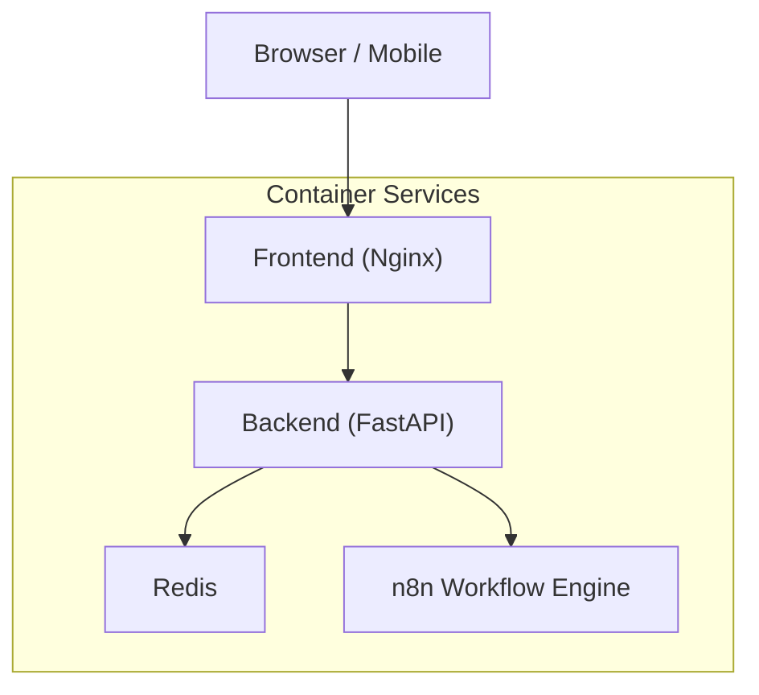
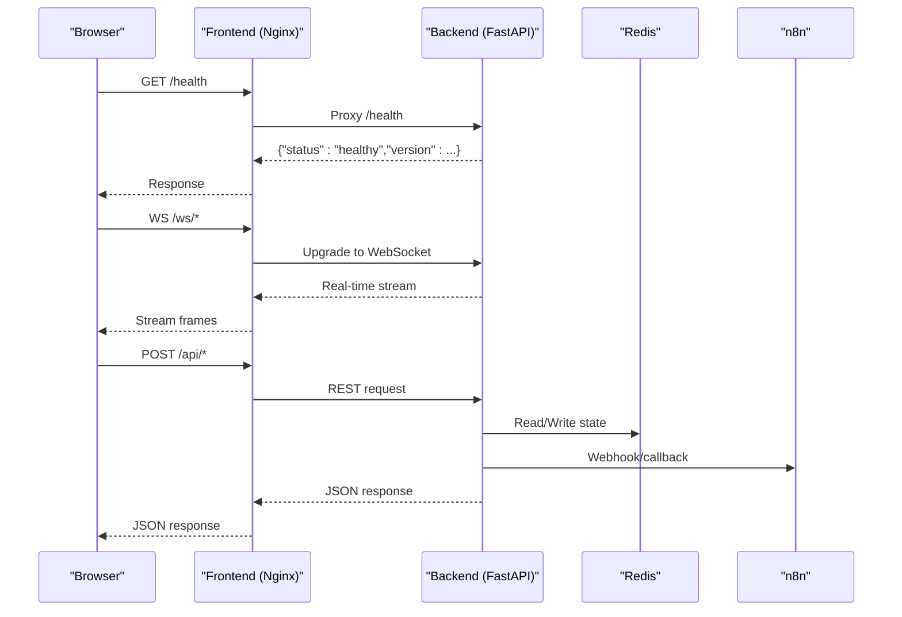
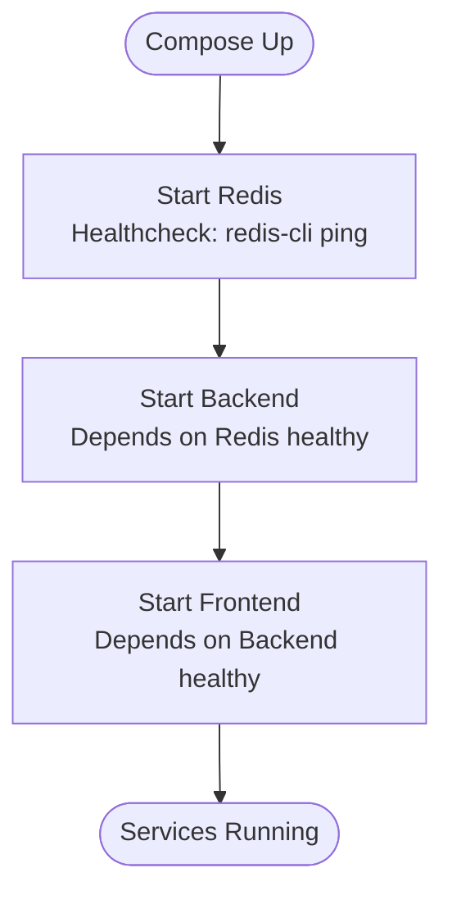
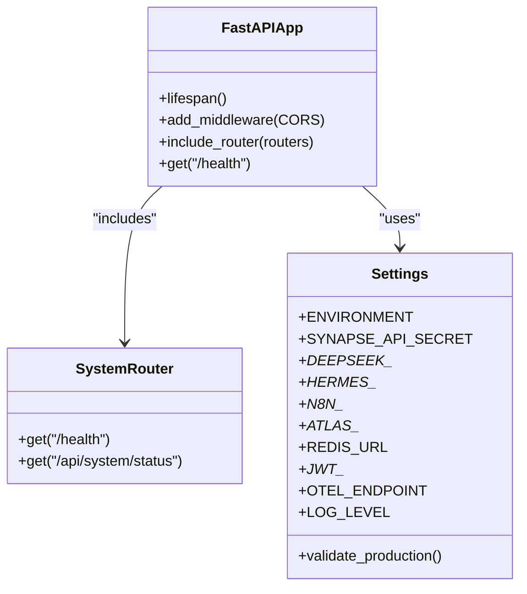
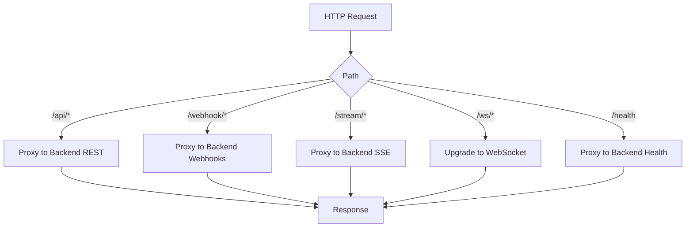
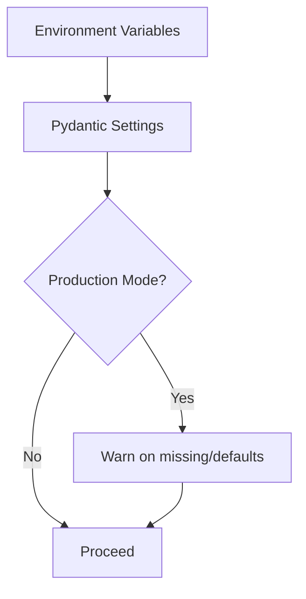
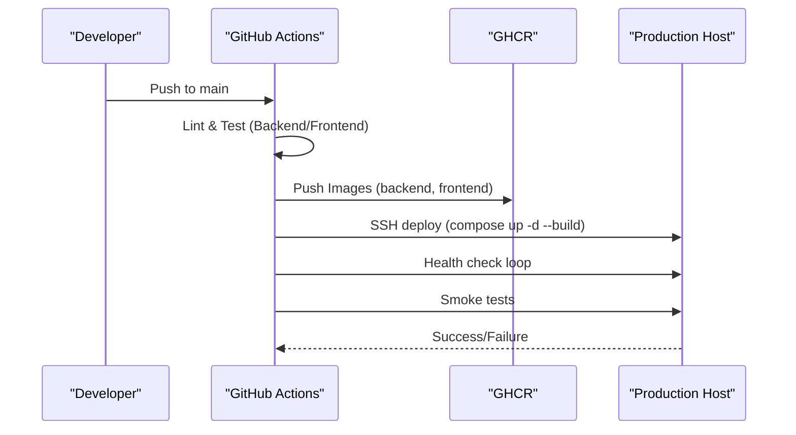
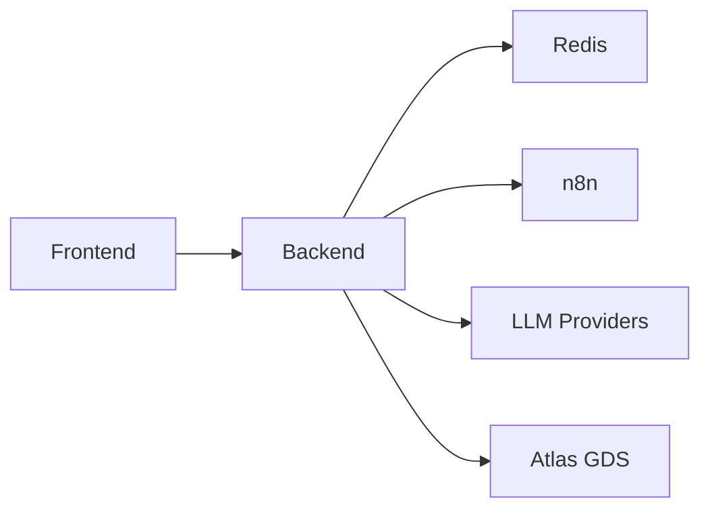

# Deployment Guide

<cite>
**Referenced Files in This Document**
- [docker-compose.yml](file://travel-recovery-os/docker-compose.yml)
- [backend/Dockerfile](file://travel-recovery-os/backend/Dockerfile)
- [frontend/Dockerfile](file://travel-recovery-os/frontend/Dockerfile)
- [Dockerfile](file://travel-recovery-os/Dockerfile)
- [DEPLOYMENT_GUIDE.md](file://travel-recovery-os/DEPLOYMENT_GUIDE.md)
- [ci.yml](file://travel-recovery-os/.github/workflows/ci.yml)
- [deploy.yml](file://travel-recovery-os/.github/workflows/deploy.yml)
- [config.production.env.example](file://travel-recovery-os/backend/config.production.env.example)
- [config.py](file://travel-recovery-os/backend/config.py)
- [nginx.conf](file://travel-recovery-os/frontend/nginx.conf)
- [main.py](file://travel-recovery-os/backend/main.py)
- [system.py](file://travel-recovery-os/backend/api/routers/system.py)
</cite>

## Table of Contents
1. [Introduction](#introduction)
2. [Project Structure](#project-structure)
3. [Core Components](#core-components)
4. [Architecture Overview](#architecture-overview)
5. [Detailed Component Analysis](#detailed-component-analysis)
6. [Dependency Analysis](#dependency-analysis)
7. [Performance Considerations](#performance-considerations)
8. [Troubleshooting Guide](#troubleshooting-guide)
9. [Conclusion](#conclusion)
10. [Appendices](#appendices)

## Introduction
This guide provides production deployment instructions for the SynapseAir platform, covering containerized deployment with Docker and Docker Compose, service orchestration, networking, storage, CI/CD automation, environment configuration, secrets management, security hardening, rollback strategies, health checks, and monitoring setup. It also outlines cloud deployment strategies for AWS, Azure, and Google Cloud with auto-scaling and load balancing considerations.

## Project Structure
SynapseAir is a full-stack application composed of:
- Backend API (FastAPI) with real-time streaming and agent orchestration
- Frontend SPA (Vue 3 + Vite) served via Nginx
- Redis for caching/state
- n8n for workflow automation and webhook handling
- GitHub Actions for CI/CD and automated deployments

**Diagram sources**
- [docker-compose.yml:4-66](file://travel-recovery-os/docker-compose.yml#L4-L66)
- [nginx.conf:1-42](file://travel-recovery-os/frontend/nginx.conf#L1-L42)
- [backend/Dockerfile:1-34](file://travel-recovery-os/backend/Dockerfile#L1-L34)
- [frontend/Dockerfile:1-15](file://travel-recovery-os/frontend/Dockerfile#L1-L15)

**Section sources**
- [docker-compose.yml:1-71](file://travel-recovery-os/docker-compose.yml#L1-L71)
- [DEPLOYMENT_GUIDE.md:1-128](file://travel-recovery-os/DEPLOYMENT_GUIDE.md#L1-L128)

## Core Components
- Backend API: FastAPI app with lifespan management, CORS, structured logging, tracing, and multiple routers including system, webhooks, telemetry, history, and websocket endpoints. Health check endpoints are exposed for orchestrators and load balancers.
- Frontend: Vue 3 SPA built with Vite and served by Nginx with proxy rules for API, webhooks, streaming, and WebSocket paths.
- Redis: In-memory store used by backend for state and messaging.
- n8n: Workflow engine integrated via HTTP APIs and webhooks for HITL and external integrations.
- Containerization: Separate Dockerfiles for backend and frontend; optional root Dockerfile for monorepo builds.
- CI/CD: GitHub Actions workflows for linting, testing, building, pushing images to GHCR, and deploying to production via SSH.

**Section sources**
- [main.py:22-128](file://travel-recovery-os/backend/main.py#L22-L128)
- [system.py:1-53](file://travel-recovery-os/backend/api/routers/system.py#L1-L53)
- [nginx.conf:1-42](file://travel-recovery-os/frontend/nginx.conf#L1-L42)
- [backend/Dockerfile:1-34](file://travel-recovery-os/backend/Dockerfile#L1-L34)
- [frontend/Dockerfile:1-15](file://travel-recovery-os/frontend/Dockerfile#L1-L15)
- [docker-compose.yml:1-71](file://travel-recovery-os/docker-compose.yml#L1-L71)

## Architecture Overview
The production architecture consists of containerized services orchestrated by Docker Compose or a container orchestrator on cloud platforms. The frontend proxies requests to the backend for API, webhooks, streaming, and WebSocket traffic. Redis and n8n provide supporting services.

**Diagram sources**
- [nginx.conf:7-40](file://travel-recovery-os/frontend/nginx.conf#L7-L40)
- [main.py:119-122](file://travel-recovery-os/backend/main.py#L119-L122)
- [system.py:9-22](file://travel-recovery-os/backend/api/routers/system.py#L9-L22)
- [docker-compose.yml:18-53](file://travel-recovery-os/docker-compose.yml#L18-L53)

## Detailed Component Analysis

### Container Orchestration with Docker Compose
- Services:
  - Redis: Persistent data volume, healthcheck via redis-cli ping.
  - Backend: Built from backend/Dockerfile, depends on Redis health, exposes port 8000, uses env_file and environment variables, persistent data volume for SQLite/checkpointer.
  - Frontend: Built from frontend/Dockerfile, serves SPA on port 80, depends on backend health.
  - n8n: Image-based service with basic auth enabled, persistent volume for workflows.
- Networking: Default bridge network; services communicate via service names (redis, backend).
- Storage: Named volumes for Redis, backend data, and n8n data.

**Diagram sources**
- [docker-compose.yml:4-53](file://travel-recovery-os/docker-compose.yml#L4-L53)

**Section sources**
- [docker-compose.yml:1-71](file://travel-recovery-os/docker-compose.yml#L1-L71)

### Backend Service
- Application lifecycle: Logging setup, tracing initialization, rate limiter cleanup on shutdown.
- CORS: Configurable origins, supports dynamic FRONTEND_URL.
- Routers: System, webhooks, telemetry, history, websocket; tests router disabled in production.
- Health endpoints: Lightweight /health and detailed /api/system/status for provider statuses.

**Diagram sources**
- [main.py:22-128](file://travel-recovery-os/backend/main.py#L22-L128)
- [system.py:1-53](file://travel-recovery-os/backend/api/routers/system.py#L1-L53)
- [config.py:29-116](file://travel-recovery-os/backend/config.py#L29-L116)

**Section sources**
- [main.py:1-128](file://travel-recovery-os/backend/main.py#L1-L128)
- [system.py:1-53](file://travel-recovery-os/backend/api/routers/system.py#L1-L53)
- [config.py:1-116](file://travel-recovery-os/backend/config.py#L1-L116)

### Frontend Service (Nginx)
- Serves static SPA built by Vite.
- Proxies:
  - /api/* to backend REST endpoints
  - /webhook/* to backend webhook handlers
  - /stream/* to SSE streaming
  - /ws/* to WebSocket upgrades
  - /health to backend health endpoint

**Diagram sources**
- [nginx.conf:7-40](file://travel-recovery-os/frontend/nginx.conf#L7-L40)

**Section sources**
- [nginx.conf:1-42](file://travel-recovery-os/frontend/nginx.conf#L1-L42)

### Environment Configuration and Secrets Management
- Environment profiles: development, staging, production via ENVIRONMENT variable.
- Production example file lists required keys for LLM providers, n8n, Atlas GDS, Redis, JWT, observability, and frontend URL.
- Settings validation warns on missing critical keys in production mode.
- Secrets should be injected via secure mechanisms (e.g., Kubernetes Secrets, AWS Secrets Manager, Azure Key Vault, GCP Secret Manager) rather than checked into code.

**Diagram sources**
- [config.py:20-26](file://travel-recovery-os/backend/config.py#L20-L26)
- [config.py:92-112](file://travel-recovery-os/backend/config.py#L92-L112)
- [config.production.env.example:1-49](file://travel-recovery-os/backend/config.production.env.example#L1-L49)

**Section sources**
- [config.py:1-116](file://travel-recovery-os/backend/config.py#L1-L116)
- [config.production.env.example:1-49](file://travel-recovery-os/backend/config.production.env.example#L1-L49)

### CI/CD Pipeline
- CI job:
  - Backend: Install dependencies, lint (ruff), type check (mypy), run pytest with test secrets.
  - Frontend: Install dependencies, lint, build.
  - Docker: Build and push backend/frontend images to GHCR on main branch.
- Deploy job:
  - SSH to production host, pull latest compose, rebuild and start services.
  - Wait for backend health endpoint to become healthy.
  - Run smoke tests against system status and history endpoints.

**Diagram sources**
- [ci.yml:9-99](file://travel-recovery-os/.github/workflows/ci.yml#L9-L99)
- [deploy.yml:8-58](file://travel-recovery-os/.github/workflows/deploy.yml#L8-L58)

**Section sources**
- [ci.yml:1-99](file://travel-recovery-os/.github/workflows/ci.yml#L1-L99)
- [deploy.yml:1-58](file://travel-recovery-os/.github/workflows/deploy.yml#L1-L58)

## Dependency Analysis
- Backend depends on:
  - Redis for state/messaging
  - n8n for webhook integration
  - LLM providers (DeepSeek/Hermes) configured via environment
  - Atlas GDS sandbox or live CLI
- Frontend depends on:
  - Backend for API, webhooks, streaming, WebSocket
  - Nginx for routing and static serving
- Docker Compose defines explicit depends_on and health conditions to ensure startup order.

**Diagram sources**
- [docker-compose.yml:18-66](file://travel-recovery-os/docker-compose.yml#L18-L66)
- [config.py:46-70](file://travel-recovery-os/backend/config.py#L46-L70)

**Section sources**
- [docker-compose.yml:1-71](file://travel-recovery-os/docker-compose.yml#L1-L71)
- [config.py:1-116](file://travel-recovery-os/backend/config.py#L1-L116)

## Performance Considerations
- Use Redis for high-throughput state and message passing; tune memory and persistence policies per workload.
- Enable connection pooling for external APIs (LLMs, Atlas GDS) where supported.
- Configure Nginx buffering and cache appropriately for streaming endpoints; disable buffering for SSE/WebSocket paths.
- Monitor resource usage and scale horizontally by running multiple backend replicas behind a load balancer.
- Use health checks and readiness probes to manage rolling updates and avoid downtime.

[No sources needed since this section provides general guidance]

## Troubleshooting Guide
- Health checks:
  - Backend exposes /health and /api/system/status for quick and detailed diagnostics.
  - Docker Compose includes healthchecks for Redis and Backend; Frontend depends on Backend health.
- Common issues:
  - Missing environment variables: Settings validation warns in production; ensure all required keys are set.
  - CORS errors: Verify ALLOWED_ORIGINS include your frontend domain; set FRONTEND_URL accordingly.
  - WebSocket/SSE failures: Ensure Nginx routes /ws/* and /stream/* correctly with proper headers.
  - n8n connectivity: Confirm N8N_API_URL and N8N_WEBHOOK_URL are reachable from backend.
- Logs and tracing:
  - Structured logging can be enabled via LOG_JSON; configure OTEL_ENDPOINT for distributed tracing.
- Rollback strategy:
  - Keep previous image tags in GHCR; redeploy older tag via SSH action or orchestrator rollback.
  - Use database migrations cautiously; prefer backward-compatible changes or dual-write patterns.

**Section sources**
- [main.py:119-122](file://travel-recovery-os/backend/main.py#L119-L122)
- [system.py:9-53](file://travel-recovery-os/backend/api/routers/system.py#L9-L53)
- [docker-compose.yml:12-40](file://travel-recovery-os/docker-compose.yml#L12-L40)
- [config.py:92-112](file://travel-recovery-os/backend/config.py#L92-L112)
- [nginx.conf:11-36](file://travel-recovery-os/frontend/nginx.conf#L11-L36)

## Conclusion
SynapseAir’s production deployment leverages containerized services orchestrated via Docker Compose or cloud-native platforms, with robust CI/CD automation, environment-specific configuration, and comprehensive health checks. By following the outlined procedures for secrets management, security hardening, scaling, and monitoring, teams can operate SynapseAir reliably in production environments across AWS, Azure, and Google Cloud.

[No sources needed since this section summarizes without analyzing specific files]

## Appendices

### Cloud Deployment Strategies
- AWS:
  - ECS Fargate or EKS for container orchestration; use ALB/NLB for load balancing; Auto Scaling Groups or Cluster Autoscaler for scaling.
  - Secrets via AWS Secrets Manager; RDS for Redis if managed; CloudWatch for logs and metrics.
- Azure:
  - AKS for Kubernetes; Application Gateway or Load Balancer for ingress; Horizontal Pod Autoscaler for scaling.
  - Secrets via Azure Key Vault; Azure Cache for Redis; Application Insights for observability.
- Google Cloud:
  - GKE for Kubernetes; Cloud Load Balancing for ingress; Horizontal Pod Autoscaler for scaling.
  - Secrets via Secret Manager; Memorystore for Redis; Cloud Monitoring/Logging for observability.

[No sources needed since this section provides general guidance]

### Security Hardening Procedures
- Enforce HTTPS at ingress; restrict CORS to known domains.
- Rotate secrets regularly; never commit secrets to repository.
- Use least-privilege IAM roles for CI/CD and runtime services.
- Enable rate limiting and authentication for sensitive endpoints.
- Scan images for vulnerabilities; pin base image versions.

[No sources needed since this section provides general guidance]

### Monitoring Setup
- Expose metrics via OpenTelemetry; forward to centralized collectors.
- Instrument external calls (LLMs, Atlas GDS, n8n) for latency and error rates.
- Set alerts on health check failures and elevated error rates.
- Centralize logs with JSON formatting for parsing and alerting.

[No sources needed since this section provides general guidance]