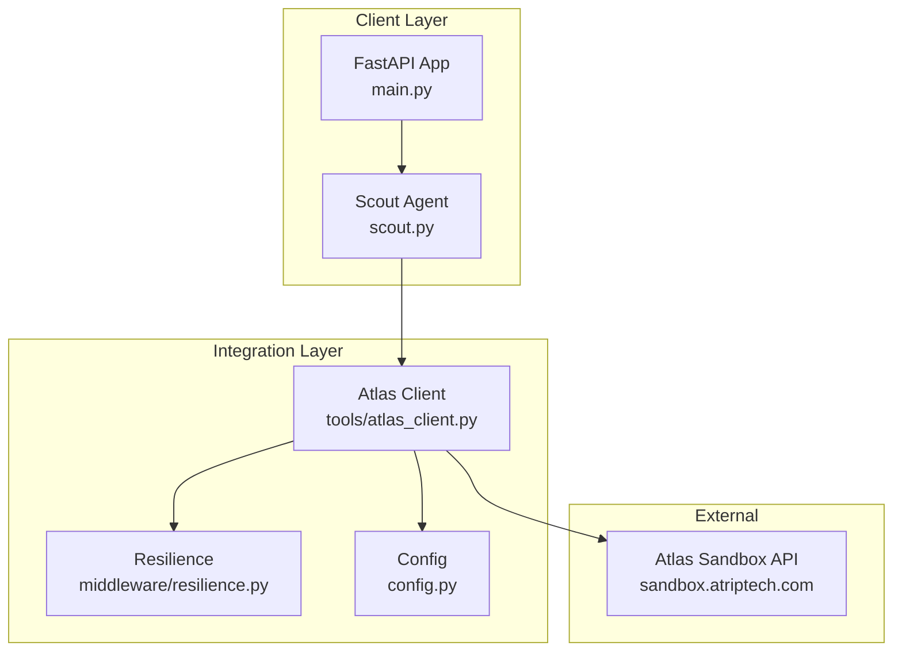
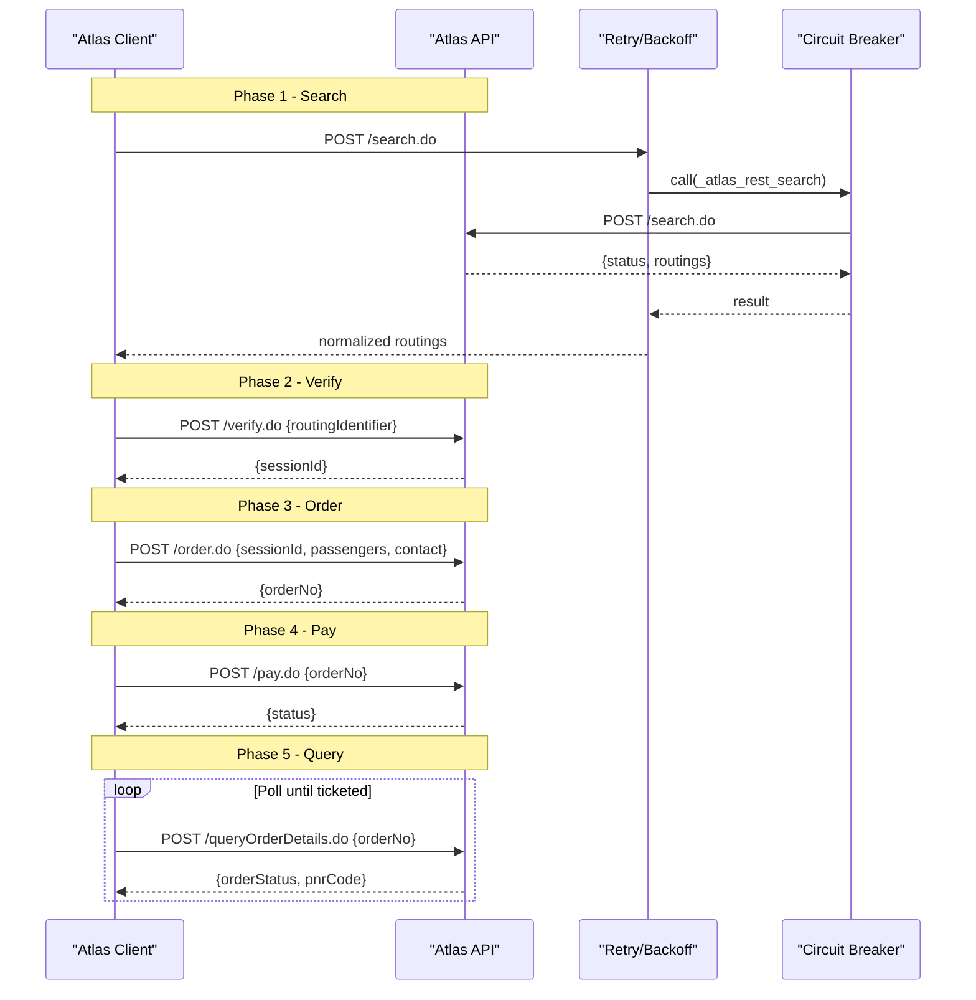
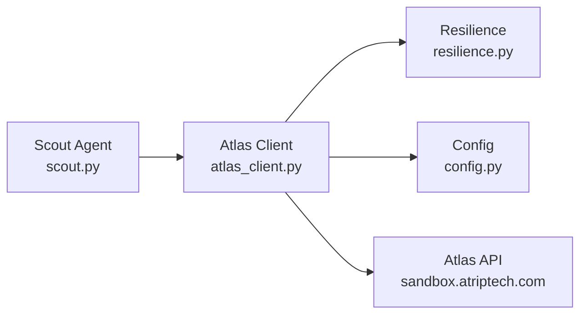

# Atlas API Lifecycle

<cite>
**Referenced Files in This Document**
- [SKILL.md](file://atlas-api-integration-advisor (2)/atlas-api-integration-advisor/SKILL.md)
- [flow-quick-reference.md](file://atlas-api-integration-advisor (2)/atlas-api-integration-advisor/references/flow-quick-reference.md)
- [Atlas_UAT_HappyPath.postman_collection (2).json](file://Atlas_UAT_HappyPath.postman_collection (2).json)
- [Atlas_UAT_Environment (2).json](file://Atlas_UAT_Environment (2).json)
- [atlas_client.py](file://travel-recovery-os/backend/tools/atlas_client.py)
- [resilience.py](file://travel-recovery-os/backend/middleware/resilience.py)
- [config.py](file://travel-recovery-os/backend/config.py)
- [main.py](file://travel-recovery-os/backend/main.py)
- [scout.py](file://travel-recovery-os/backend/agents/scout.py)
- [ATLAS_UAT_VERIFICATION_REPORT.md](file://travel-recovery-os/backend/ATLAS_UAT_VERIFICATION_REPORT.md)
</cite>

## Table of Contents
1. [Introduction](#introduction)
2. [Project Structure](#project-structure)
3. [Core Components](#core-components)
4. [Architecture Overview](#architecture-overview)
5. [Detailed Component Analysis](#detailed-component-analysis)
6. [Dependency Analysis](#dependency-analysis)
7. [Performance Considerations](#performance-considerations)
8. [Troubleshooting Guide](#troubleshooting-guide)
9. [Conclusion](#conclusion)
10. [Appendices](#appendices)

## Introduction
This document describes the complete Atlas GDS API lifecycle implemented in this repository, covering the five-phase booking process: Search, Verify, Order, Pay, and Query. It consolidates end-to-end flow documentation, request/response schemas, authentication requirements, error handling patterns, state management across phases, timeout configurations, and retry strategies as implemented in the codebase.

The implementation integrates with the official Atlas Flight Booking Sandbox API and includes resilience mechanisms (retry with backoff and circuit breaker), environment configuration for sandbox/production, and a Postman-based happy path that exercises all five phases.

## Project Structure
At a high level, the Atlas integration is encapsulated in a dedicated client module that calls the Atlas endpoints, while orchestration agents invoke it during disruption recovery flows. The project also provides Postman collections and environment variables to validate the full lifecycle against the Atlas sandbox.

**Diagram sources**
- [main.py:1-128](file://travel-recovery-os/backend/main.py#L1-L128)
- [scout.py:1-87](file://travel-recovery-os/backend/agents/scout.py#L1-L87)
- [atlas_client.py:1-427](file://travel-recovery-os/backend/tools/atlas_client.py#L1-L427)
- [resilience.py:1-244](file://travel-recovery-os/backend/middleware/resilience.py#L1-L244)
- [config.py:1-116](file://travel-recovery-os/backend/config.py#L1-L116)

**Section sources**
- [main.py:1-128](file://travel-recovery-os/backend/main.py#L1-L128)
- [scout.py:1-87](file://travel-recovery-os/backend/agents/scout.py#L1-L87)
- [atlas_client.py:1-427](file://travel-recovery-os/backend/tools/atlas_client.py#L1-L427)
- [resilience.py:1-244](file://travel-recovery-os/backend/middleware/resilience.py#L1-L244)
- [config.py:1-116](file://travel-recovery-os/backend/config.py#L1-L116)

## Core Components
- Atlas Client: Implements the five-phase booking lifecycle by calling Atlas endpoints with proper headers, timeouts, and error handling. Includes search, verify, order, pay, and queryOrderDetails flows, plus fallback behavior when live inventory is unavailable.
- Resilience Middleware: Provides retry-with-backoff and circuit breaker patterns used around Atlas calls to handle transient failures and protect downstream services.
- Configuration: Centralizes Atlas credentials, base URLs (search vs transaction), and environment toggles for sandbox/production.
- Scout Agent: Orchestrates flight discovery via the Atlas client during disruption recovery workflows.
- Postman Collection & Environment: End-to-end validation of the five-phase flow with sample payloads and assertions.

Key responsibilities:
- Authentication headers generation and injection
- Date/time normalization for Atlas compatibility
- In-memory caching for repeated searches
- Circuit breaker and retry wrapping for robustness
- Fallback to calibrated sandbox data when live routes are unavailable

**Section sources**
- [atlas_client.py:1-427](file://travel-recovery-os/backend/tools/atlas_client.py#L1-L427)
- [resilience.py:1-244](file://travel-recovery-os/backend/middleware/resilience.py#L1-L244)
- [config.py:1-116](file://travel-recovery-os/backend/config.py#L1-L116)
- [scout.py:1-87](file://travel-recovery-os/backend/agents/scout.py#L1-L87)
- [Atlas_UAT_HappyPath.postman_collection (2).json:1-225](file://Atlas_UAT_HappyPath.postman_collection (2).json#L1-L225)
- [Atlas_UAT_Environment (2).json:1-63](file://Atlas_UAT_Environment (2).json#L1-L63)

## Architecture Overview
The Atlas GDS lifecycle is executed through a sequence of HTTP calls to the Atlas sandbox or production endpoints. The client constructs requests with required headers, enforces timeouts, and applies resilience patterns.

**Diagram sources**
- [atlas_client.py:82-167](file://travel-recovery-os/backend/tools/atlas_client.py#L82-L167)
- [atlas_client.py:222-331](file://travel-recovery-os/backend/tools/atlas_client.py#L222-L331)
- [resilience.py:25-80](file://travel-recovery-os/backend/middleware/resilience.py#L25-L80)
- [resilience.py:97-216](file://travel-recovery-os/backend/middleware/resilience.py#L97-L216)

## Detailed Component Analysis

### Five-Phase Booking Process

#### Phase 1: Search (POST /search.do)
- Purpose: Retrieve live routings and routingIdentifiers for a given route and date.
- Request Headers: Content-Type: application/json; Accept: */*; Accept-Encoding: gzip; x-atlas-client-id; x-atlas-client-secret.
- Request Body: tripType, adultNum, childNum, infantNum, fromCity, toCity, fromDate (YYYYMMDD), currency, requestSource.
- Response: status=0 indicates success; routings array contains offers with routingIdentifier and pricing fields.
- Implementation Notes:
  - Dates are normalized to YYYYMMDD and shifted to future dates if needed for sandbox compliance.
  - Results are normalized into a consistent structure and cached in memory for 5 minutes.
  - Uses httpx AsyncClient with a 4.0s timeout.
  - Wrapped with retry_with_backoff and atlas_breaker.

Example references:
- Postman collection demonstrates a single adult one-way search payload and asserts status and routings presence.
- UAT verification report shows successful search responses with routings and prices.

**Section sources**
- [atlas_client.py:82-167](file://travel-recovery-os/backend/tools/atlas_client.py#L82-L167)
- [atlas_client.py:175-219](file://travel-recovery-os/backend/tools/atlas_client.py#L175-L219)
- [Atlas_UAT_HappyPath.postman_collection (2).json:11-50](file://Atlas_UAT_HappyPath.postman_collection (2).json#L11-L50)
- [ATLAS_UAT_VERIFICATION_REPORT.md:20-31](file://travel-recovery-os/backend/ATLAS_UAT_VERIFICATION_REPORT.md#L20-L31)

#### Phase 2: Verify (POST /verify.do)
- Purpose: Lock fare and secure sessionId for subsequent order creation.
- Request Headers: Same as Search.
- Request Body: cid, routingIdentifier, requestSource.
- Response: status=0 and sessionId (valid for 2 hours per guidance).
- Implementation Notes:
  - Called after obtaining a routingIdentifier from Search.
  - Errors raise runtime exceptions with message details.

Example references:
- Postman collection verifies status and captures sessionId for later steps.
- UAT verification report confirms sessionId retrieval.

**Section sources**
- [atlas_client.py:222-268](file://travel-recovery-os/backend/tools/atlas_client.py#L222-L268)
- [Atlas_UAT_HappyPath.postman_collection (2).json:53-91](file://Atlas_UAT_HappyPath.postman_collection (2).json#L53-L91)
- [ATLAS_UAT_VERIFICATION_REPORT.md:25-28](file://travel-recovery-os/backend/ATLAS_UAT_VERIFICATION_REPORT.md#L25-L28)

#### Phase 3: Order (POST /order.do)
- Purpose: Create booking record and generate orderNo using the verified session.
- Request Headers: Same as previous phases.
- Request Body: cid, sessionId, passengers (with name, passengerType, birthday, gender, cardNum, cardType, cardExpired, nationality), contact (name, email, mobile), requestSource.
- Response: status=0 and orderNo.
- Implementation Notes:
  - Unique passport numbers and suffixes are generated to avoid duplicate booking collisions.
  - Errors raise runtime exceptions with message details.

Example references:
- Postman collection creates an order and sets orderNo for payment step.
- UAT verification report shows order creation success.

**Section sources**
- [atlas_client.py:270-300](file://travel-recovery-os/backend/tools/atlas_client.py#L270-L300)
- [Atlas_UAT_HappyPath.postman_collection (2).json:94-131](file://Atlas_UAT_HappyPath.postman_collection (2).json#L94-L131)
- [ATLAS_UAT_VERIFICATION_REPORT.md:28-29](file://travel-recovery-os/backend/ATLAS_UAT_VERIFICATION_REPORT.md#L28-L29)

#### Phase 4: Pay (POST /pay.do)
- Purpose: Execute ticketing payment for the created order.
- Request Headers: Same as previous phases.
- Request Body: cid, orderNo, requestSource.
- Response: status=0 indicates acceptance of payment.
- Implementation Notes:
  - Payment acceptance does not guarantee immediate ticket issuance; polling is required.

Example references:
- Postman collection asserts payment acceptance.
- UAT verification report confirms payment success.

**Section sources**
- [atlas_client.py:302-310](file://travel-recovery-os/backend/tools/atlas_client.py#L302-L310)
- [Atlas_UAT_HappyPath.postman_collection (2).json:134-167](file://Atlas_UAT_HappyPath.postman_collection (2).json#L134-L167)
- [ATLAS_UAT_VERIFICATION_REPORT.md:29-30](file://travel-recovery-os/backend/ATLAS_UAT_VERIFICATION_REPORT.md#L29-L30)

#### Phase 5: Query (POST /queryOrderDetails.do)
- Purpose: Confirm issued PNRs and e-tickets by polling order status.
- Request Headers: Same as previous phases.
- Request Body: cid, orderNo, requestSource.
- Response: status=0; orderStatus values include Booked, TktInProcess, Ticketed, Cancelled; pnrCode present when ticketed.
- Implementation Notes:
  - Polling continues until orderStatus equals Ticketed or a timeout threshold is reached.
  - The Postman collection implements iterative polling with a counter and delay between requests.

Example references:
- Postman collection polls until ticketed and validates pnrCode presence.
- UAT verification report shows final ticketed states with PNR codes.

**Section sources**
- [atlas_client.py:312-331](file://travel-recovery-os/backend/tools/atlas_client.py#L312-L331)
- [Atlas_UAT_HappyPath.postman_collection (2).json:170-219](file://Atlas_UAT_HappyPath.postman_collection (2).json#L170-L219)
- [ATLAS_UAT_VERIFICATION_REPORT.md:30-42](file://travel-recovery-os/backend/ATLAS_UAT_VERIFICATION_REPORT.md#L30-L42)

### Authentication Header Requirements
- Required headers for all Atlas endpoints:
  - Content-Type: application/json
  - Accept: */*
  - Accept-Encoding: gzip
  - x-atlas-client-id
  - x-atlas-client-secret
- These are constructed centrally and injected into every Atlas HTTP call.

**Section sources**
- [atlas_client.py:38-48](file://travel-recovery-os/backend/tools/atlas_client.py#L38-L48)
- [Atlas_UAT_HappyPath.postman_collection (2).json:15-20](file://Atlas_UAT_HappyPath.postman_collection (2).json#L15-L20)

### Error Handling Patterns
- HTTP-level errors: Non-200 responses raise runtime exceptions with status and truncated response text.
- Business-level errors: Responses with status != 0 raise runtime exceptions including message details.
- Transient errors: Handled via retry_with_backoff with exponential backoff and jitter.
- Circuit breaker: Protects against cascading failures; raises CircuitBreakerOpen when open; transitions to half-open after cooldown.
- Common Atlas error codes: Guidance on mapping status codes to actions (e.g., retries for timeouts, re-verify for expired sessions, restart search for availability changes).

**Section sources**
- [atlas_client.py:110-119](file://travel-recovery-os/backend/tools/atlas_client.py#L110-L119)
- [atlas_client.py:260-310](file://travel-recovery-os/backend/tools/atlas_client.py#L260-L310)
- [resilience.py:25-80](file://travel-recovery-os/backend/middleware/resilience.py#L25-L80)
- [resilience.py:97-216](file://travel-recovery-os/backend/middleware/resilience.py#L97-L216)
- [SKILL.md:328-382](file://atlas-api-integration-advisor (2)/atlas-api-integration-advisor/SKILL.md#L328-L382)

### State Management Throughout the Lifecycle
- routingIdentifier: Produced by Search; consumed by Verify.
- sessionId: Produced by Verify; consumed by Order; valid for 2 hours per guidance.
- orderNo: Produced by Order; consumed by Pay and Query.
- orderStatus/pnrCode: Produced by Query; indicates ticketing completion.
- In-memory cache: Stores search results keyed by origin, destination, and date for 5 minutes to reduce redundant calls.

**Section sources**
- [atlas_client.py:170-219](file://travel-recovery-os/backend/tools/atlas_client.py#L170-L219)
- [atlas_client.py:222-331](file://travel-recovery-os/backend/tools/atlas_client.py#L222-L331)
- [SKILL.md:74-83](file://atlas-api-integration-advisor (2)/atlas-api-integration-advisor/SKILL.md#L74-L83)

### Timeout Configurations and Retry Strategies
- Timeouts:
  - Search uses a 4.0s timeout.
  - Transactional flow (Verify/Order/Pay/Query) uses a 15.0s timeout.
- Retry Strategy:
  - Exponential backoff with configurable max_retries, base_delay, max_delay, exponential_base, and jitter.
  - Predefined atlas_breaker with failure_threshold=5 and cooldown_seconds=30.0.
- Recommended Atlas retry pattern:
  - Map specific status codes to retry or restart actions (timeouts, session expiry, price changes, availability changes).
  - Cap retries at 5 attempts with increasing delays up to 15 seconds.

**Section sources**
- [atlas_client.py:104-111](file://travel-recovery-os/backend/tools/atlas_client.py#L104-L111)
- [atlas_client.py:232-233](file://travel-recovery-os/backend/tools/atlas_client.py#L232-L233)
- [resilience.py:25-80](file://travel-recovery-os/backend/middleware/resilience.py#L25-L80)
- [resilience.py:233-237](file://travel-recovery-os/backend/middleware/resilience.py#L233-L237)
- [SKILL.md:347-382](file://atlas-api-integration-advisor (2)/atlas-api-integration-advisor/SKILL.md#L347-L382)

### Concrete Examples of Each API Call
- Search Example:
  - Endpoint: POST https://sandbox.atriptech.com/search.do
  - Headers: x-atlas-client-id, x-atlas-client-secret, Content-Type: application/json, Accept-Encoding: gzip
  - Payload: tripType, adultNum, childNum, infantNum, fromCity, toCity, fromDate, currency, requestSource
  - Assertions: status=0; routings non-empty; capture routingIdentifier
- Verify Example:
  - Endpoint: POST https://sandbox.atriptech.com/verify.do
  - Payload: cid, routingIdentifier, requestSource
  - Assertions: status=0; sessionId present
- Order Example:
  - Endpoint: POST https://sandbox.atriptech.com/order.do
  - Payload: cid, sessionId, passengers, contact, requestSource
  - Assertions: status=0; orderNo present
- Pay Example:
  - Endpoint: POST https://sandbox.atriptech.com/pay.do
  - Payload: cid, orderNo, requestSource
  - Assertions: status=0
- Query Example:
  - Endpoint: POST https://sandbox.atriptech.com/queryOrderDetails.do
  - Payload: cid, orderNo, requestSource
  - Assertions: status=0; poll until orderStatus=2 (Ticketed); pnrCode present

These examples are validated in the Postman collection and UAT verification report.

**Section sources**
- [Atlas_UAT_HappyPath.postman_collection (2).json:11-219](file://Atlas_UAT_HappyPath.postman_collection (2).json#L11-L219)
- [ATLAS_UAT_VERIFICATION_REPORT.md:20-42](file://travel-recovery-os/backend/ATLAS_UAT_VERIFICATION_REPORT.md#L20-L42)

## Dependency Analysis
The Atlas integration depends on resilient HTTP clients, centralized configuration, and optional agent orchestration.

**Diagram sources**
- [scout.py:1-87](file://travel-recovery-os/backend/agents/scout.py#L1-L87)
- [atlas_client.py:1-427](file://travel-recovery-os/backend/tools/atlas_client.py#L1-L427)
- [resilience.py:1-244](file://travel-recovery-os/backend/middleware/resilience.py#L1-L244)
- [config.py:1-116](file://travel-recovery-os/backend/config.py#L1-L116)

**Section sources**
- [scout.py:1-87](file://travel-recovery-os/backend/agents/scout.py#L1-L87)
- [atlas_client.py:1-427](file://travel-recovery-os/backend/tools/atlas_client.py#L1-L427)
- [resilience.py:1-244](file://travel-recovery-os/backend/middleware/resilience.py#L1-L244)
- [config.py:1-116](file://travel-recovery-os/backend/config.py#L1-L116)

## Performance Considerations
- Caching: In-memory TTL cache reduces repeated search calls for the same route/date window (5-minute TTL).
- Timeouts: Short timeouts for search (4s) and longer for transactional operations (15s) balance responsiveness and reliability.
- Concurrency: Asynchronous HTTP client enables non-blocking calls; circuit breaker prevents overload during outages.
- Fallback: Calibrated sandbox simulation ensures continuity when live inventory is unavailable.

[No sources needed since this section provides general guidance]

## Troubleshooting Guide
Common issues and resolutions:
- Missing Accept-Encoding header: Causes search failure; ensure gzip is included.
- Expired sessionId: Re-run verify to obtain a new session before ancillary queries or order submission.
- Daily quota exceeded: Wait until next UTC day or request quota increase.
- Price changed: Re-verify and resubmit order.
- Availability changed: Restart from search.
- Authentication/System errors: Check credentials and environment alignment (sandbox vs production).

Operational checks:
- Validate environment variables for ATLAS_CLIENT_ID, ATLAS_CLIENT_SECRET, and base URLs.
- Use Postman collection to exercise the happy path and inspect assertions.
- Review logs for retry/backoff events and circuit breaker transitions.

**Section sources**
- [SKILL.md:328-382](file://atlas-api-integration-advisor (2)/atlas-api-integration-advisor/SKILL.md#L328-L382)
- [config.py:62-69](file://travel-recovery-os/backend/config.py#L62-L69)
- [Atlas_UAT_HappyPath.postman_collection (2).json:1-225](file://Atlas_UAT_HappyPath.postman_collection (2).json#L1-L225)

## Conclusion
The repository implements a robust, production-oriented Atlas GDS API lifecycle with clear phase separation, strong authentication, comprehensive error handling, and resilience patterns. The Postman collection and UAT reports provide concrete evidence of successful end-to-end execution in the sandbox. The design supports both live integration and graceful fallbacks, making it suitable for real-world deployment scenarios where reliability and performance are critical.

[No sources needed since this section summarizes without analyzing specific files]

## Appendices

### Appendix A: Request/Response Schemas Summary
- Search Request: tripType, adultNum, childNum, infantNum, fromCity, toCity, fromDate (YYYYMMDD), currency, requestSource
- Search Response: status, routings[] (each with routingIdentifier, pricing fields)
- Verify Request: cid, routingIdentifier, requestSource
- Verify Response: status, sessionId
- Order Request: cid, sessionId, passengers[], contact, requestSource
- Order Response: status, orderNo
- Pay Request: cid, orderNo, requestSource
- Pay Response: status
- Query Request: cid, orderNo, requestSource
- Query Response: status, orderStatus, pnrCode

**Section sources**
- [atlas_client.py:82-167](file://travel-recovery-os/backend/tools/atlas_client.py#L82-L167)
- [atlas_client.py:222-331](file://travel-recovery-os/backend/tools/atlas_client.py#L222-L331)
- [Atlas_UAT_HappyPath.postman_collection (2).json:11-219](file://Atlas_UAT_HappyPath.postman_collection (2).json#L11-L219)

### Appendix B: Environment Variables
- ATLAS_ENV: sandbox or production
- ATLAS_CLIENT_ID: provided by Atlas
- ATLAS_CLIENT_SECRET: provided by Atlas
- ATLAS_BASE_URL: sandbox.atriptech.com or production URL
- ATLAS_SEARCH_BASE_URL: optional split for production search
- ATLAS_TRANSACTION_BASE_URL: optional split for production transactions

**Section sources**
- [config.py:62-69](file://travel-recovery-os/backend/config.py#L62-L69)
- [Atlas_UAT_Environment (2).json:1-63](file://Atlas_UAT_Environment (2).json#L1-L63)