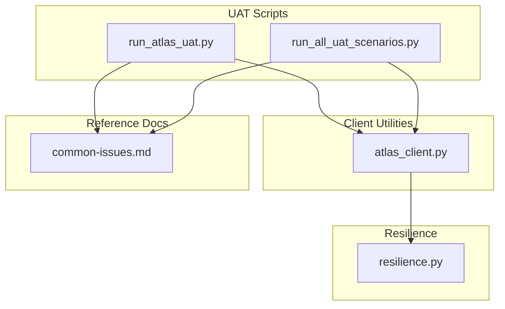
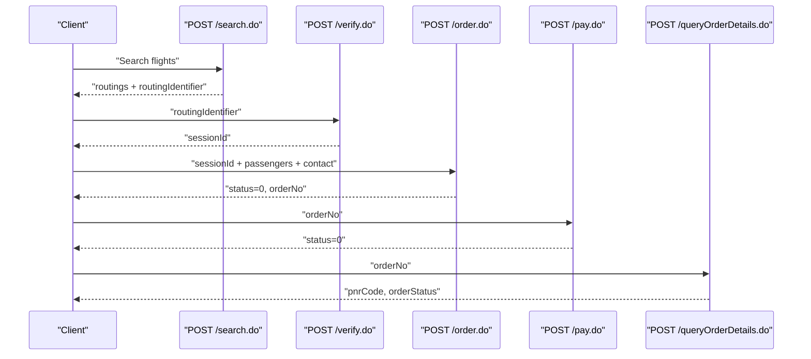
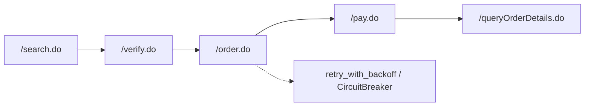

# Order Phase (POST /order.do)

<cite>
**Referenced Files in This Document**
- [atlas_client.py](file://travel-recovery-os/backend/tools/atlas_client.py)
- [run_atlas_uat.py](file://travel-recovery-os/backend/run_atlas_uat.py)
- [run_all_uat_scenarios.py](file://travel-recovery-os/backend/run_all_uat_scenarios.py)
- [common-issues.md](file://atlas-api-integration-advisor (2)/atlas-api-integration-advisor/references/common-issues.md)
- [resilience.py](file://travel-recovery-os/backend/middleware/resilience.py)
</cite>

## Table of Contents
1. [Introduction](#introduction)
2. [Project Structure](#project-structure)
3. [Core Components](#core-components)
4. [Architecture Overview](#architecture-overview)
5. [Detailed Component Analysis](#detailed-component-analysis)
6. [Dependency Analysis](#dependency-analysis)
7. [Performance Considerations](#performance-considerations)
8. [Troubleshooting Guide](#troubleshooting-guide)
9. [Conclusion](#conclusion)

## Introduction
This document explains the Atlas GDS Order phase implementation centered on the POST /order.do endpoint used to create booking records and generate order numbers. It details the request payload structure for passengers and contact information, the unique passport ID generation strategy to prevent duplicate bookings, random suffix assignment for passenger names, and how orderNo is extracted from responses. It also documents error handling strategies for invalid passenger data, seat unavailability, and booking conflicts, along with retry logic patterns and examples of successful and failing scenarios.

## Project Structure
The order flow is implemented across several components:
- A client utility that orchestrates the full lifecycle (search → verify → order → pay → query).
- UAT scripts that demonstrate end-to-end flows against the sandbox.
- Shared resilience utilities providing retry with backoff and circuit breaker protection.
- Reference documentation enumerating common integration issues and recommended retries.

**Diagram sources**
- [atlas_client.py:1-16](file://travel-recovery-os/backend/tools/atlas_client.py#L1-L16)
- [run_atlas_uat.py:1-20](file://travel-recovery-os/backend/run_atlas_uat.py#L1-L20)
- [run_all_uat_scenarios.py:1-20](file://travel-recovery-os/backend/run_all_uat_scenarios.py#L1-L20)
- [resilience.py:1-8](file://travel-recovery-os/backend/middleware/resilience.py#L1-L8)
- [common-issues.md:45-57](file://atlas-api-integration-advisor (2)/atlas-api-integration-advisor/references/common-issues.md#L45-L57)

**Section sources**
- [atlas_client.py:1-16](file://travel-recovery-os/backend/tools/atlas_client.py#L1-L16)
- [run_atlas_uat.py:1-20](file://travel-recovery-os/backend/run_atlas_uat.py#L1-L20)
- [run_all_uat_scenarios.py:1-20](file://travel-recovery-os/backend/run_all_uat_scenarios.py#L1-L20)
- [resilience.py:1-8](file://travel-recovery-os/backend/middleware/resilience.py#L1-L8)
- [common-issues.md:45-57](file://atlas-api-integration-advisor (2)/atlas-api-integration-advisor/references/common-issues.md#L45-L57)

## Core Components
- Order creation via POST /order.do:
  - The client constructs a JSON body including cid, sessionId, passengers array, contact object, and requestSource.
  - Passengers include name, passengerType, birthday, gender, cardNum, cardType, cardExpired, nationality.
  - Contact includes name, email, mobile.
- Unique identifiers to avoid duplicates:
  - Passport IDs are generated as unique strings prefixed with a letter and an 8-digit number.
  - Passenger names receive a random single-letter suffix to reduce collisions.
- Response handling:
  - On success, status equals zero and orderNo is present; clients assert these conditions and proceed to payment and confirmation steps.

Key implementation references:
- Full lifecycle orchestration and order creation with unique identifiers: [atlas_client.py:222-331](file://travel-recovery-os/backend/tools/atlas_client.py#L222-L331)
- UAT happy path demonstrating order payload and assertions: [run_atlas_uat.py:110-149](file://travel-recovery-os/backend/run_atlas_uat.py#L110-L149)
- Multi-passenger order construction with unique passports and names: [run_all_uat_scenarios.py:104-144](file://travel-recovery-os/backend/run_all_uat_scenarios.py#L104-L144)

**Section sources**
- [atlas_client.py:222-331](file://travel-recovery-os/backend/tools/atlas_client.py#L222-L331)
- [run_atlas_uat.py:110-149](file://travel-recovery-os/backend/run_atlas_uat.py#L110-L149)
- [run_all_uat_scenarios.py:104-144](file://travel-recovery-os/backend/run_all_uat_scenarios.py#L104-L144)

## Architecture Overview
The order phase is part of a broader booking lifecycle. Clients first search for routings, verify availability and price to obtain a sessionId, then submit an order. After order creation, payment is executed and order details are queried to confirm ticketing.

**Diagram sources**
- [atlas_client.py:222-331](file://travel-recovery-os/backend/tools/atlas_client.py#L222-L331)
- [run_atlas_uat.py:44-203](file://travel-recovery-os/backend/run_atlas_uat.py#L44-L203)
- [run_all_uat_scenarios.py:53-180](file://travel-recovery-os/backend/run_all_uat_scenarios.py#L53-L180)

## Detailed Component Analysis

### Request Payload Structure
- Top-level fields:
  - cid: client identifier
  - sessionId: obtained from verify.do
  - passengers: array of passenger objects
  - contact: object with name, email, mobile
  - requestSource: string identifying the caller
- Passenger object fields:
  - name: passenger name; often suffixed with a random letter to avoid collisions
  - passengerType: integer indicating adult/child/infant
  - birthday: date string in YYYYMMDD format
  - gender: single character code
  - cardNum: unique passport or identity number; generated uniquely per request
  - cardType: identifier such as PP for passport
  - cardExpired: expiry date string in YYYYMMDD format
  - nationality: ISO country code

Examples and references:
- Single passenger order payload in UAT: [run_atlas_uat.py:112-133](file://travel-recovery-os/backend/run_atlas_uat.py#L112-L133)
- Multi-passenger order payload with unique passports and names: [run_all_uat_scenarios.py:104-139](file://travel-recovery-os/backend/run_all_uat_scenarios.py#L104-L139)
- Automated order creation with unique passport and name suffix: [atlas_client.py:270-296](file://travel-recovery-os/backend/tools/atlas_client.py#L270-L296)

**Section sources**
- [run_atlas_uat.py:112-133](file://travel-recovery-os/backend/run_atlas_uat.py#L112-L133)
- [run_all_uat_scenarios.py:104-139](file://travel-recovery-os/backend/run_all_uat_scenarios.py#L104-L139)
- [atlas_client.py:270-296](file://travel-recovery-os/backend/tools/atlas_client.py#L270-L296)

### Unique Passport ID Generation Strategy
- Purpose: Prevent duplicate bookings by ensuring each passenger has a distinct identity number.
- Implementation:
  - Generate a unique passport ID by prefixing a letter with an 8-digit random number.
  - Apply this to each passenger’s cardNum field.
- References:
  - Unique passport generation helper and usage: [run_all_uat_scenarios.py:28-33](file://travel-recovery-os/backend/run_all_uat_scenarios.py#L28-L33), [run_all_uat_scenarios.py:104-116](file://travel-recovery-os/backend/run_all_uat_scenarios.py#L104-L116)
  - Direct generation within order creation: [atlas_client.py:270-283](file://travel-recovery-os/backend/tools/atlas_client.py#L270-L283)

**Section sources**
- [run_all_uat_scenarios.py:28-33](file://travel-recovery-os/backend/run_all_uat_scenarios.py#L28-L33)
- [run_all_uat_scenarios.py:104-116](file://travel-recovery-os/backend/run_all_uat_scenarios.py#L104-L116)
- [atlas_client.py:270-283](file://travel-recovery-os/backend/tools/atlas_client.py#L270-L283)

### Random Suffix Assignment for Passenger Names
- Purpose: Reduce name collisions when multiple test or automated bookings occur concurrently.
- Implementation:
  - Append a randomly chosen single letter to the passenger name.
- References:
  - Name suffix selection and usage: [atlas_client.py:271-279](file://travel-recovery-os/backend/tools/atlas_client.py#L271-L279)
  - Letter generation helpers: [run_all_uat_scenarios.py:21-33](file://travel-recovery-os/backend/run_all_uat_scenarios.py#L21-L33)

**Section sources**
- [atlas_client.py:271-279](file://travel-recovery-os/backend/tools/atlas_client.py#L271-L279)
- [run_all_uat_scenarios.py:21-33](file://travel-recovery-os/backend/run_all_uat_scenarios.py#L21-L33)

### OrderNo Extraction from Responses
- Success criteria:
  - HTTP status 200 and response status field equals zero.
  - orderNo must be present and non-empty.
- Usage:
  - Extract orderNo and pass it to subsequent payment and query steps.
- References:
  - Assertions and extraction in UAT: [run_atlas_uat.py:137-149](file://travel-recovery-os/backend/run_atlas_uat.py#L137-L149)
  - Error handling and extraction in client: [atlas_client.py:297-300](file://travel-recovery-os/backend/tools/atlas_client.py#L297-L300)
  - Multi-scenario extraction and continuation: [run_all_uat_scenarios.py:140-144](file://travel-recovery-os/backend/run_all_uat_scenarios.py#L140-L144)

**Section sources**
- [run_atlas_uat.py:137-149](file://travel-recovery-os/backend/run_atlas_uat.py#L137-L149)
- [atlas_client.py:297-300](file://travel-recovery-os/backend/tools/atlas_client.py#L297-L300)
- [run_all_uat_scenarios.py:140-144](file://travel-recovery-os/backend/run_all_uat_scenarios.py#L140-L144)

### Error Handling for Invalid Passenger Data, Seat Unavailability, and Booking Conflicts
- Common error codes and resolutions relevant to order creation:
  - Session expired: Re-run verify.do to obtain a fresh sessionId.
  - Flight sold out: Restart from search to get updated routings.
  - Price changed: Re-verify and re-submit order.
  - Selected seats no longer available: Re-verify, re-fetch seat map, select different seats.
  - Invalid contact email format: Correct email formatting.
  - Airline rejected passenger: Validate passenger name format and details.
  - Passenger info doesn’t meet requirements: Check bookingRequirement from verify response.
- References:
  - Order issues table and solutions: [common-issues.md:45-57](file://atlas-api-integration-advisor (2)/atlas-api-integration-advisor/references/common-issues.md#L45-L57)
  - Seat selection issues impacting order: [common-issues.md:69-78](file://atlas-api-integration-advisor (2)/atlas-api-integration-advisor/references/common-issues.md#L69-L78)

**Section sources**
- [common-issues.md:45-57](file://atlas-api-integration-advisor (2)/atlas-api-integration-advisor/references/common-issues.md#L45-L57)
- [common-issues.md:69-78](file://atlas-api-integration-advisor (2)/atlas-api-integration-advisor/references/common-issues.md#L69-L78)

### Retry Logic and Resilience Patterns
- Exponential backoff wrapper:
  - Provides configurable retries with jitter and max delays.
  - Used to wrap external calls to mitigate transient failures.
- Circuit breaker:
  - Protects downstream services by fast-failing after repeated errors and probing recovery.
  - Pre-built breaker for Atlas API calls.
- Typical retry pattern guidance:
  - For timeouts and transient errors, retry with backoff.
  - For expired sessions/routings, restart from search or verify.
  - For price changes, re-verify and resubmit.
  - For availability changes, restart from search.
- References:
  - Backoff and circuit breaker implementations: [resilience.py:25-80](file://travel-recovery-os/backend/middleware/resilience.py#L25-L80), [resilience.py:97-213](file://travel-recovery-os/backend/middleware/resilience.py#L97-L213)
  - Atlas breaker usage in client: [atlas_client.py:197-213](file://travel-recovery-os/backend/tools/atlas_client.py#L197-L213)
  - Recommended retry patterns: [common-issues.md:155-174](file://atlas-api-integration-advisor (2)/atlas-api-integration-advisor/references/common-issues.md#L155-L174)

**Section sources**
- [resilience.py:25-80](file://travel-recovery-os/backend/middleware/resilience.py#L25-L80)
- [resilience.py:97-213](file://travel-recovery-os/backend/middleware/resilience.py#L97-L213)
- [atlas_client.py:197-213](file://travel-recovery-os/backend/tools/atlas_client.py#L197-L213)
- [common-issues.md:155-174](file://atlas-api-integration-advisor (2)/atlas-api-integration-advisor/references/common-issues.md#L155-L174)

### Examples of Successful Order Creation
- Happy path sequence:
  - Search returns routings; verify returns sessionId; order creates booking and returns orderNo; pay succeeds; query confirms PNR and order status.
- References:
  - End-to-end UAT flow with assertions: [run_atlas_uat.py:44-203](file://travel-recovery-os/backend/run_atlas_uat.py#L44-L203)
  - Multi-scenario execution capturing orderNo and PNR: [run_all_uat_scenarios.py:53-180](file://travel-recovery-os/backend/run_all_uat_scenarios.py#L53-L180)

**Section sources**
- [run_atlas_uat.py:44-203](file://travel-recovery-os/backend/run_atlas_uat.py#L44-L203)
- [run_all_uat_scenarios.py:53-180](file://travel-recovery-os/backend/run_all_uat_scenarios.py#L53-L180)

### Common Failure Scenarios and Recovery
- Session expired:
  - Symptom: Non-zero status indicating session expiration.
  - Recovery: Re-run verify.do to obtain a new sessionId.
- Flight sold out or seats taken:
  - Symptom: Availability-related error codes.
  - Recovery: Restart search, re-verify, and choose alternative inventory or seats.
- Price change:
  - Symptom: Price mismatch error.
  - Recovery: Re-verify and resubmit order with current pricing.
- Invalid passenger/contact data:
  - Symptom: Validation errors on passenger or contact fields.
  - Recovery: Ensure correct formats and compliance with airline requirements.
- References:
  - Error codes and solutions: [common-issues.md:45-57](file://atlas-api-integration-advisor (2)/atlas-api-integration-advisor/references/common-issues.md#L45-L57), [common-issues.md:69-78](file://atlas-api-integration-advisor (2)/atlas-api-integration-advisor/references/common-issues.md#L69-L78)

**Section sources**
- [common-issues.md:45-57](file://atlas-api-integration-advisor (2)/atlas-api-integration-advisor/references/common-issues.md#L45-L57)
- [common-issues.md:69-78](file://atlas-api-integration-advisor (2)/atlas-api-integration-advisor/references/common-issues.md#L69-L78)

## Dependency Analysis
The order phase depends on upstream phases (search and verify) and downstream phases (payment and query). Resilience utilities provide robustness against transient failures.

**Diagram sources**
- [atlas_client.py:222-331](file://travel-recovery-os/backend/tools/atlas_client.py#L222-L331)
- [resilience.py:25-80](file://travel-recovery-os/backend/middleware/resilience.py#L25-L80)
- [resilience.py:97-213](file://travel-recovery-os/backend/middleware/resilience.py#L97-L213)

**Section sources**
- [atlas_client.py:222-331](file://travel-recovery-os/backend/tools/atlas_client.py#L222-L331)
- [resilience.py:25-80](file://travel-recovery-os/backend/middleware/resilience.py#L25-L80)
- [resilience.py:97-213](file://travel-recovery-os/backend/middleware/resilience.py#L97-L213)

## Performance Considerations
- Use gzip encoding for search requests to reduce payload size.
- Cache search results briefly to avoid redundant network calls during rapid iterations.
- Apply exponential backoff for transient errors to minimize load spikes.
- Avoid excessive concurrent orders without rate limiting to prevent contention on shared resources.

[No sources needed since this section provides general guidance]

## Troubleshooting Guide
- Validate headers:
  - Ensure Content-Type, Accept, Accept-Encoding, and authentication headers are present.
- Check status codes:
  - Status zero indicates success; any other value requires inspection of msg and appropriate recovery actions.
- Handle specific errors:
  - Session expired: Re-run verify.
  - Flight sold out: Restart search.
  - Price changed: Re-verify and resubmit.
  - Seats unavailable: Re-verify and select alternate seats.
  - Invalid passenger/contact: Fix formatting and ensure compliance.
- Use resilience utilities:
  - Wrap calls with retry_with_backoff and protect with circuit breaker for stability.

References:
- Headers and typical flow: [run_atlas_uat.py:13-19](file://travel-recovery-os/backend/run_atlas_uat.py#L13-L19)
- Error handling and recovery patterns: [common-issues.md:45-57](file://atlas-api-integration-advisor (2)/atlas-api-integration-advisor/references/common-issues.md#L45-L57), [common-issues.md:155-174](file://atlas-api-integration-advisor (2)/atlas-api-integration-advisor/references/common-issues.md#L155-L174)
- Resilience utilities: [resilience.py:25-80](file://travel-recovery-os/backend/middleware/resilience.py#L25-L80), [resilience.py:97-213](file://travel-recovery-os/backend/middleware/resilience.py#L97-L213)

**Section sources**
- [run_atlas_uat.py:13-19](file://travel-recovery-os/backend/run_atlas_uat.py#L13-L19)
- [common-issues.md:45-57](file://atlas-api-integration-advisor (2)/atlas-api-integration-advisor/references/common-issues.md#L45-L57)
- [common-issues.md:155-174](file://atlas-api-integration-advisor (2)/atlas-api-integration-advisor/references/common-issues.md#L155-L174)
- [resilience.py:25-80](file://travel-recovery-os/backend/middleware/resilience.py#L25-L80)
- [resilience.py:97-213](file://travel-recovery-os/backend/middleware/resilience.py#L97-L213)

## Conclusion
The POST /order.do endpoint is central to creating bookings and generating order numbers in the Atlas GDS workflow. Robust implementations generate unique passport IDs and randomized name suffixes to prevent duplicate bookings, validate payloads thoroughly, and handle errors with clear recovery strategies. Resilience mechanisms like retry with backoff and circuit breakers improve reliability under transient failures. Following the documented patterns ensures consistent, scalable order processing across various scenarios.

[No sources needed since this section summarizes without analyzing specific files]