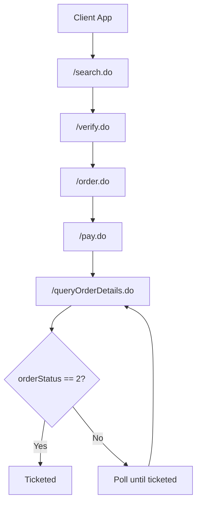
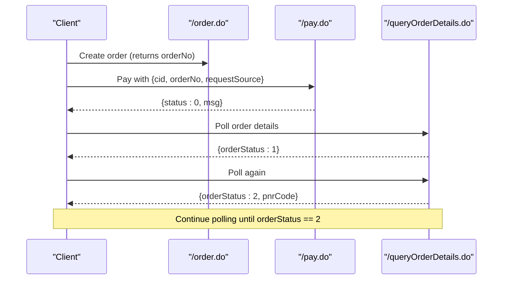
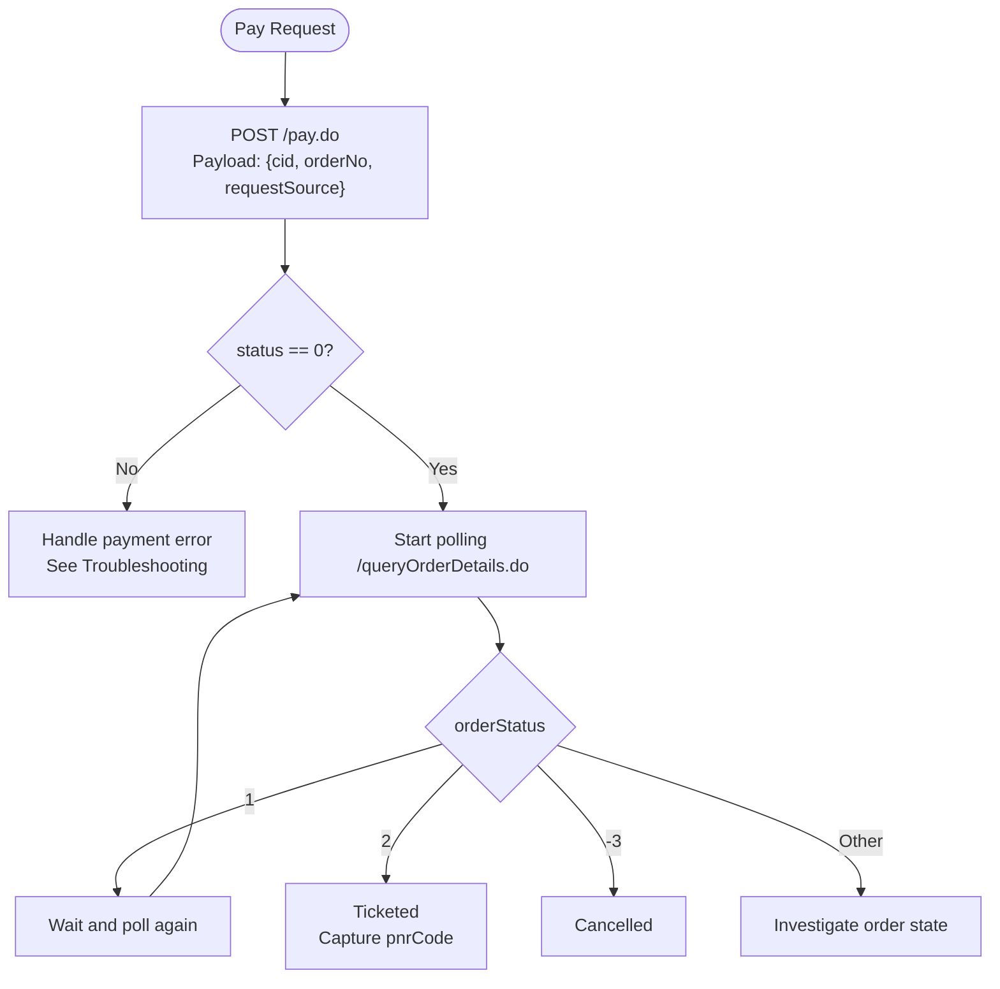
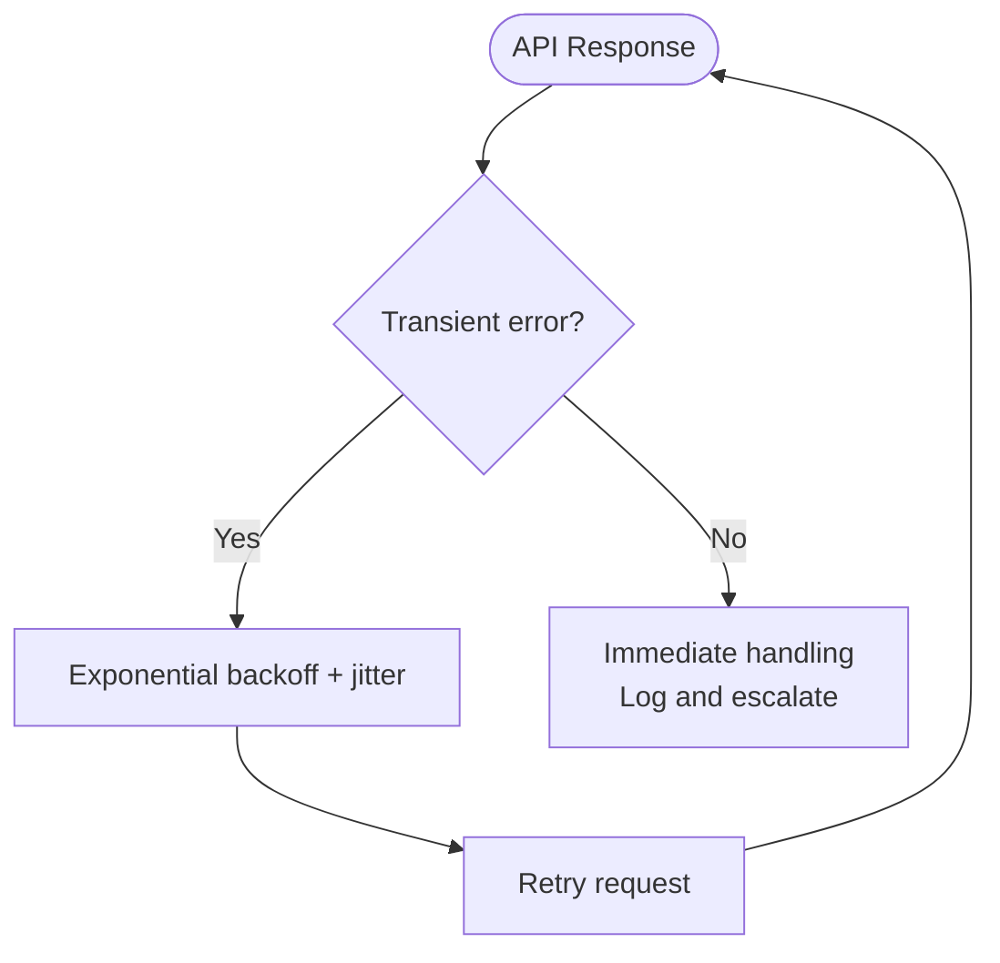
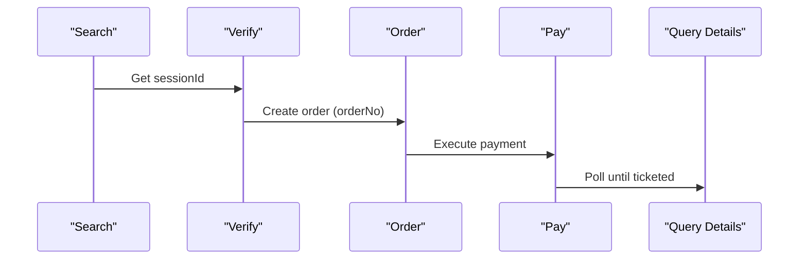
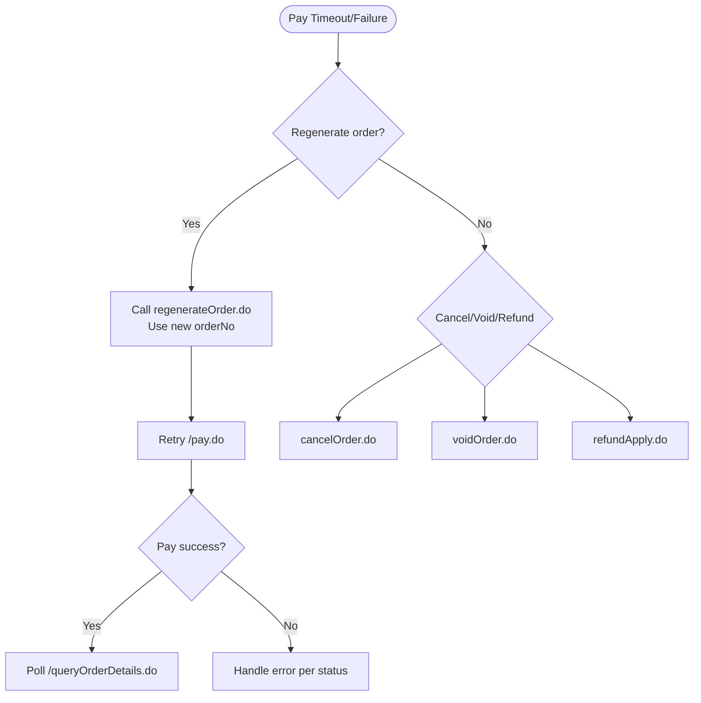
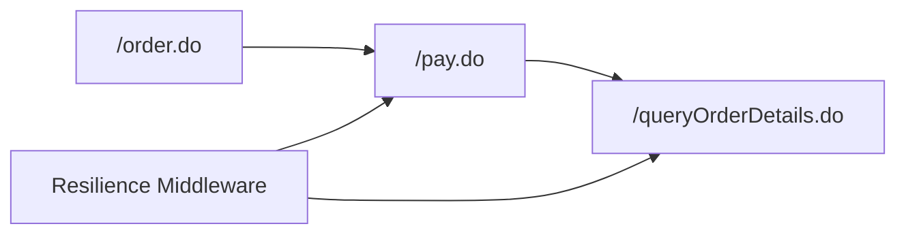

# Pay Phase (POST /pay.do)

<cite>
**Referenced Files in This Document**
- [run_atlas_uat.py](file://travel-recovery-os/backend/run_atlas_uat.py)
- [run_all_uat_scenarios.py](file://travel-recovery-os/backend/run_all_uat_scenarios.py)
- [Atlas_UAT_HappyPath.postman_collection (2).json](file://Atlas_UAT_HappyPath.postman_collection (2).json)
- [code-generation-guide.md](file://atlas-api-integration-advisor (2)/atlas-api-integration-advisor/references/code-generation-guide.md)
- [common-issues.md](file://atlas-api-integration-advisor (2)/atlas-api-integration-advisor/references/common-issues.md)
- [integration-scenarios.md](file://atlas-api-integration-advisor (2)/atlas-api-integration-advisor/references/integration-scenarios.md)
- [resilience.py](file://travel-recovery-os/backend/middleware/resilience.py)
</cite>

## Table of Contents
1. [Introduction](#introduction)
2. [Project Structure](#project-structure)
3. [Core Components](#core-components)
4. [Architecture Overview](#architecture-overview)
5. [Detailed Component Analysis](#detailed-component-analysis)
6. [Dependency Analysis](#dependency-analysis)
7. [Performance Considerations](#performance-considerations)
8. [Troubleshooting Guide](#troubleshooting-guide)
9. [Conclusion](#conclusion)
10. [Appendices](#appendices)

## Introduction
This document explains the Pay phase of the Atlas GDS booking lifecycle, centered on the POST /pay.do endpoint used to execute ticketing payments after an order has been created. It covers the minimal request payload structure, payment processing workflow, transaction status handling, error recovery mechanisms, and how pay completes the financial transaction within the broader booking flow. It also documents failure scenarios, timeout handling, and rollback procedures using available patterns in this repository.

## Project Structure
The repository contains:
- UAT scripts that exercise the full booking flow including search, verify, order, pay, and queryOrderDetails.
- Integration references describing retry strategies, transient errors, and post-ticketing operations.
- Resilience middleware for retry with exponential backoff.

**Diagram sources**
- [run_atlas_uat.py:44-205](file://travel-recovery-os/backend/run_atlas_uat.py#L44-L205)
- [Atlas_UAT_HappyPath.postman_collection (2).json:146-224](file://Atlas_UAT_HappyPath.postman_collection (2).json#L146-L224)

**Section sources**
- [run_atlas_uat.py:44-205](file://travel-recovery-os/backend/run_atlas_uat.py#L44-L205)
- [Atlas_UAT_HappyPath.postman_collection (2).json:146-224](file://Atlas_UAT_HappyPath.postman_collection (2).json#L146-L224)

## Core Components
- POST /pay.do: Executes payment against a previously created order. The minimal required fields observed in the UAT flows are cid, orderNo, and requestSource.
- POST /queryOrderDetails.do: Used after pay to poll for ticketing completion; success is indicated by orderStatus transitioning to “Ticketed”.
- Retry and resilience: Exponential backoff and transient error handling are documented and implemented in the codebase.

Key observations from the repository:
- The UAT scripts consistently send cid, orderNo, and requestSource to /pay.do.
- After a successful pay response (status 0), clients should poll /queryOrderDetails.do until orderStatus equals “Ticketed”.
- Transient errors such as timeouts are retried with backoff; non-transient errors should be handled immediately.

**Section sources**
- [run_atlas_uat.py:151-171](file://travel-recovery-os/backend/run_atlas_uat.py#L151-L171)
- [run_all_uat_scenarios.py:146-154](file://travel-recovery-os/backend/run_all_uat_scenarios.py#L146-L154)
- [Atlas_UAT_HappyPath.postman_collection (2).json:146-224](file://Atlas_UAT_HappyPath.postman_collection (2).json#L146-L224)
- [common-issues.md:155-174](file://atlas-api-integration-advisor (2)/atlas-api-integration-advisor/references/common-issues.md#L155-L174)

## Architecture Overview
The Pay phase sits between order creation and ticket confirmation. It finalizes the financial transaction and triggers asynchronous ticketing. Clients must poll for ticketing completion.

**Diagram sources**
- [run_atlas_uat.py:110-205](file://travel-recovery-os/backend/run_atlas_uat.py#L110-L205)
- [Atlas_UAT_HappyPath.postman_collection (2).json:146-224](file://Atlas_UAT_HappyPath.postman_collection (2).json#L146-L224)

## Detailed Component Analysis

### POST /pay.do Request Payload
- Minimal fields observed in UAT flows:
  - cid: Client identifier used for authentication and routing.
  - orderNo: The order created by /order.do that needs to be paid.
  - requestSource: A string identifying the source of the request (e.g., “uat-happypath”).
- Headers typically include Content-Type, Accept-Encoding, and client credentials headers.

Notes:
- Some integration templates show additional fields like paymentMethod; however, the UAT flows in this repository use only cid, orderNo, and requestSource for /pay.do.
- Always validate HTTP 200 and business status 0 before proceeding.

**Section sources**
- [run_atlas_uat.py:151-171](file://travel-recovery-os/backend/run_atlas_uat.py#L151-L171)
- [run_all_uat_scenarios.py:146-154](file://travel-recovery-os/backend/run_all_uat_scenarios.py#L146-L154)
- [code-generation-guide.md:192-199](file://atlas-api-integration-advisor (2)/atlas-api-integration-advisor/references/code-generation-guide.md#L192-L199)

### Payment Processing Workflow
- After /order.do returns orderNo, call /pay.do with the minimal payload.
- On success (status 0), begin polling /queryOrderDetails.do until orderStatus reaches “Ticketed” (value 2).
- If orderStatus remains “Ticketing in Process” (value 1), continue polling with appropriate delays.
- The Postman collection demonstrates polling logic and notes that timeouts during retrieval do not indicate environment issues if earlier steps passed.

**Diagram sources**
- [Atlas_UAT_HappyPath.postman_collection (2).json:170-224](file://Atlas_UAT_HappyPath.postman_collection (2).json#L170-L224)
- [run_atlas_uat.py:173-205](file://travel-recovery-os/backend/run_atlas_uat.py#L173-L205)

**Section sources**
- [Atlas_UAT_HappyPath.postman_collection (2).json:170-224](file://Atlas_UAT_HappyPath.postman_collection (2).json#L170-L224)
- [run_atlas_uat.py:173-205](file://travel-recovery-os/backend/run_atlas_uat.py#L173-L205)

### Transaction Status Handling
- Business status field:
  - status == 0 indicates success for API calls.
- Order states (from queryOrderDetails):
  - 0: Unpaid
  - 1: Ticketing in Process
  - 2: Ticketed
  - -3: Cancelled
- After pay success, keep polling until orderStatus becomes 2.

**Section sources**
- [common-issues.md:128-138](file://atlas-api-integration-advisor (2)/atlas-api-integration-advisor/references/common-issues.md#L128-L138)
- [Atlas_UAT_HappyPath.postman_collection (2).json:205-215](file://Atlas_UAT_HappyPath.postman_collection (2).json#L205-L215)

### Error Recovery Mechanisms
- Transient errors (timeouts, temporary unavailability) should be retried with exponential backoff.
- Non-transient errors (e.g., insufficient balance, invalid parameters) should be handled immediately without retries.
- The repository provides:
  - A retry utility with exponential backoff and jitter.
  - Guidance on transient vs non-transient error handling.

**Diagram sources**
- [resilience.py:25-76](file://travel-recovery-os/backend/middleware/resilience.py#L25-L76)
- [common-issues.md:155-174](file://atlas-api-integration-advisor (2)/atlas-api-integration-advisor/references/common-issues.md#L155-L174)

**Section sources**
- [resilience.py:25-76](file://travel-recovery-os/backend/middleware/resilience.py#L25-L76)
- [common-issues.md:155-174](file://atlas-api-integration-advisor (2)/atlas-api-integration-advisor/references/common-issues.md#L155-L174)

### Integration Within the Complete Booking Lifecycle
- Standard Flow A:
  - search.do → verify.do → order.do → pay.do → queryOrderDetails.do (poll until ticketed).
- Pay completes the financial transaction; ticket issuance proceeds asynchronously.
- For specific carriers or flows, additional steps may exist (e.g., orderCommit for certain airlines), but pay remains the payment step.

**Diagram sources**
- [code-generation-guide.md:109-207](file://atlas-api-integration-advisor (2)/atlas-api-integration-advisor/references/code-generation-guide.md#L109-L207)
- [run_atlas_uat.py:44-205](file://travel-recovery-os/backend/run_atlas_uat.py#L44-L205)

**Section sources**
- [code-generation-guide.md:109-207](file://atlas-api-integration-advisor (2)/atlas-api-integration-advisor/references/code-generation-guide.md#L109-L207)
- [run_atlas_uat.py:44-205](file://travel-recovery-os/backend/run_atlas_uat.py#L44-L205)

### Payment Failure Scenarios and Client-Side Handling
Common payment-related statuses and actions:
- Insufficient balance: Top up account or adjust funding.
- No payment method available: Check account currency/configuration.
- Authentication/system errors: Verify headers and credentials.

Handling strategy:
- For transient errors (timeouts), retry with backoff.
- For non-transient errors, stop retries and present actionable feedback to the user.

**Section sources**
- [common-issues.md:81-87](file://atlas-api-integration-advisor (2)/atlas-api-integration-advisor/references/common-issues.md#L81-L87)
- [common-issues.md:155-174](file://atlas-api-integration-advisor (2)/atlas-api-integration-advisor/references/common-issues.md#L155-L174)

### Timeout Handling and Rollback Procedures
- Timeout handling:
  - Use exponential backoff retries for transient timeouts.
  - If pay times out, consider regenerating the order via regenerateOrder.do and re-attempting payment without repeating search/verify/order.
- Rollback procedures:
  - If payment fails irrecoverably, cancel or void depending on order state and airline policy.
  - Use refundApply.do/refundQuery.do for refunds when applicable.
  - Use voidOrder.do within the void window when allowed.

**Diagram sources**
- [integration-scenarios.md:89-131](file://atlas-api-integration-advisor (2)/atlas-api-integration-advisor/references/integration-scenarios.md#L89-L131)
- [SKILL.md:1103-1225](file://atlas-api-integration-advisor (2)/atlas-api-integration-advisor/SKILL.md#L1103-L1225)

**Section sources**
- [integration-scenarios.md:89-131](file://atlas-api-integration-advisor (2)/atlas-api-integration-advisor/references/integration-scenarios.md#L89-L131)
- [SKILL.md:1103-1225](file://atlas-api-integration-advisor (2)/atlas-api-integration-advisor/SKILL.md#L1103-L1225)

### Examples of Successful Payment Confirmations
- Successful pay response:
  - HTTP 200 with status 0 and a message indicating acceptance.
- Subsequent polling:
  - /queryOrderDetails.do returns orderStatus 2 and includes pnrCode once ticketed.

References:
- UAT script asserts pay status 0 and logs the message.
- Postman collection validates status 0 and polls until ticketed.

**Section sources**
- [run_atlas_uat.py:151-171](file://travel-recovery-os/backend/run_atlas_uat.py#L151-L171)
- [Atlas_UAT_HappyPath.postman_collection (2).json:146-224](file://Atlas_UAT_HappyPath.postman_collection (2).json#L146-L224)

### Various Payment Error Conditions and Client-Side Strategies
- Insufficient balance: Prompt user to top up or switch payment method.
- No payment method available: Validate account configuration and currency.
- Authentication/system errors: Ensure correct headers and credentials; retry only for transient conditions.
- Availability/price changes: Restart from search/verify if downstream steps fail due to stale data.

**Section sources**
- [common-issues.md:81-87](file://atlas-api-integration-advisor (2)/atlas-api-integration-advisor/references/common-issues.md#L81-L87)
- [common-issues.md:155-174](file://atlas-api-integration-advisor (2)/atlas-api-integration-advisor/references/common-issues.md#L155-L174)

## Dependency Analysis
- The Pay phase depends on a valid orderNo from /order.do.
- Post-pay, clients depend on /queryOrderDetails.do to confirm ticketing completion.
- Resilience middleware supports robust retry behavior for transient failures.

**Diagram sources**
- [run_atlas_uat.py:110-205](file://travel-recovery-os/backend/run_atlas_uat.py#L110-L205)
- [resilience.py:25-76](file://travel-recovery-os/backend/middleware/resilience.py#L25-L76)

**Section sources**
- [run_atlas_uat.py:110-205](file://travel-recovery-os/backend/run_atlas_uat.py#L110-L205)
- [resilience.py:25-76](file://travel-recovery-os/backend/middleware/resilience.py#L25-L76)

## Performance Considerations
- Use exponential backoff with jitter for retries to avoid thundering herd.
- Limit polling intervals for /queryOrderDetails.do to balance responsiveness and load.
- Prefer gzip encoding where supported to reduce payload size.

[No sources needed since this section provides general guidance]

## Troubleshooting Guide
- Payment issues:
  - Insufficient balance: Top up account.
  - No payment method available: Check account currency/configuration.
- Authentication/system errors:
  - Verify headers and credentials; ensure all required headers are present.
- Typical retry pattern:
  - Retransmit on transient errors with backoff; restart flows on expired sessions or availability changes.

**Section sources**
- [common-issues.md:81-87](file://atlas-api-integration-advisor (2)/atlas-api-integration-advisor/references/common-issues.md#L81-L87)
- [common-issues.md:155-174](file://atlas-api-integration-advisor (2)/atlas-api-integration-advisor/references/common-issues.md#L155-L174)

## Conclusion
The POST /pay.do endpoint finalizes payment for a previously created order using a minimal payload of cid, orderNo, and requestSource. After a successful pay response, clients must poll /queryOrderDetails.do until orderStatus reaches “Ticketed”. Robust error handling with exponential backoff and clear rollback paths (regenerate order, cancel, void, refund) ensures reliable end-to-end booking completion.

[No sources needed since this section summarizes without analyzing specific files]

## Appendices

### Appendix A: Minimal Pay Request Example
- Endpoint: POST /pay.do
- Body fields:
  - cid
  - orderNo
  - requestSource
- Headers:
  - Content-Type: application/json
  - x-atlas-client-id
  - x-atlas-client-secret
  - Accept-Encoding: gzip (optional but recommended)

**Section sources**
- [run_atlas_uat.py:151-171](file://travel-recovery-os/backend/run_atlas_uat.py#L151-L171)
- [run_all_uat_scenarios.py:146-154](file://travel-recovery-os/backend/run_all_uat_scenarios.py#L146-L154)

### Appendix B: Polling Until Ticketed
- After pay success, repeatedly call /queryOrderDetails.do.
- Stop when orderStatus equals 2 (“Ticketed”) and capture pnrCode.
- Respect timeouts; if polling times out, it does not imply environment failure if earlier steps passed.

**Section sources**
- [Atlas_UAT_HappyPath.postman_collection (2).json:170-224](file://Atlas_UAT_HappyPath.postman_collection (2).json#L170-L224)

### Appendix C: Regenerate Order on Payment Timeout
- If pay times out or fails, call regenerateOrder.do with the original orderNo to obtain a new orderNo.
- Retry /pay.do with the new orderNo without re-running search/verify/order.

**Section sources**
- [integration-scenarios.md:89-131](file://atlas-api-integration-advisor (2)/atlas-api-integration-advisor/references/integration-scenarios.md#L89-L131)