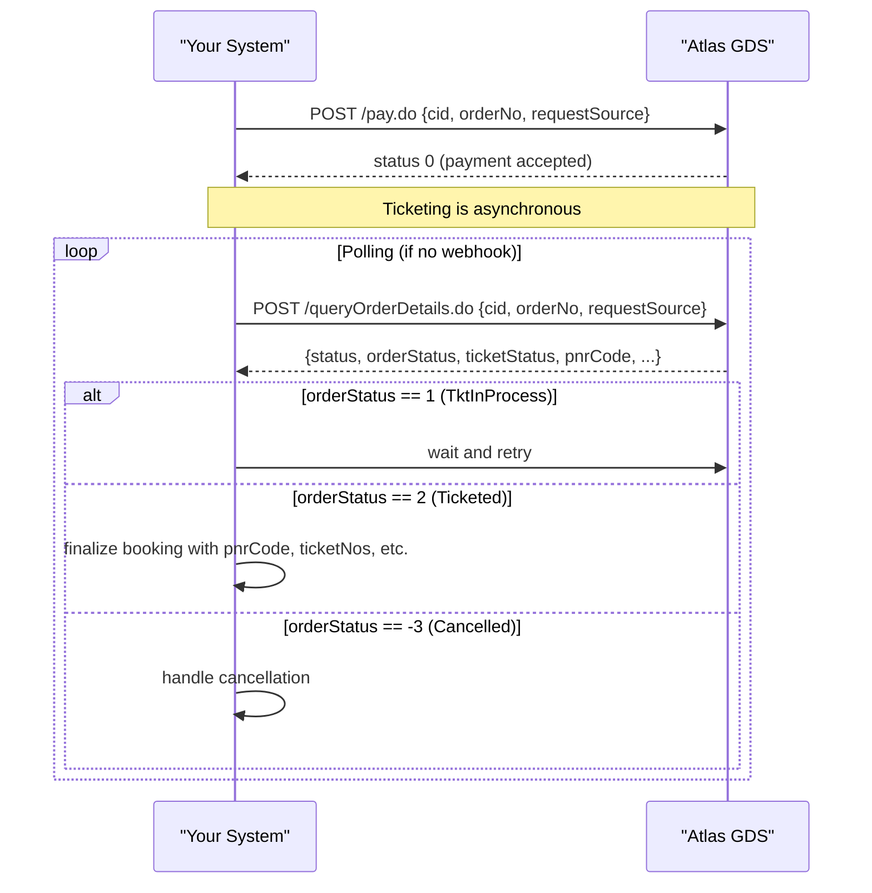
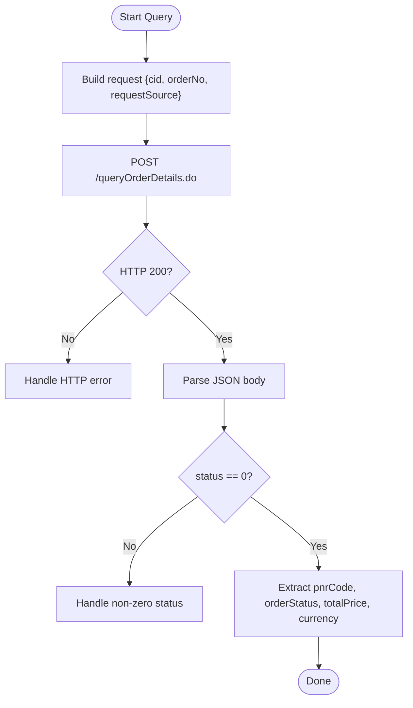
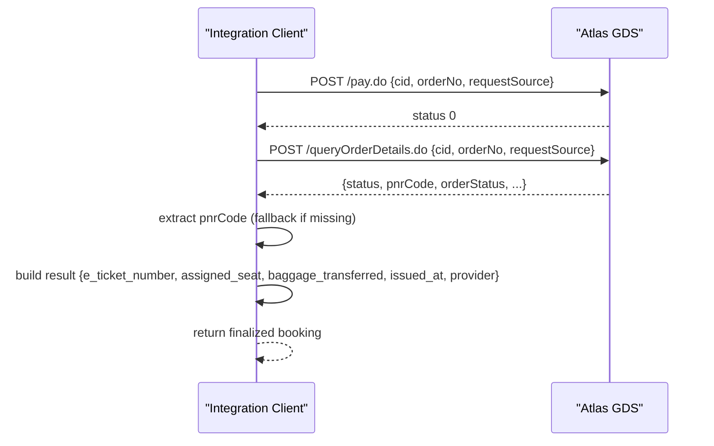
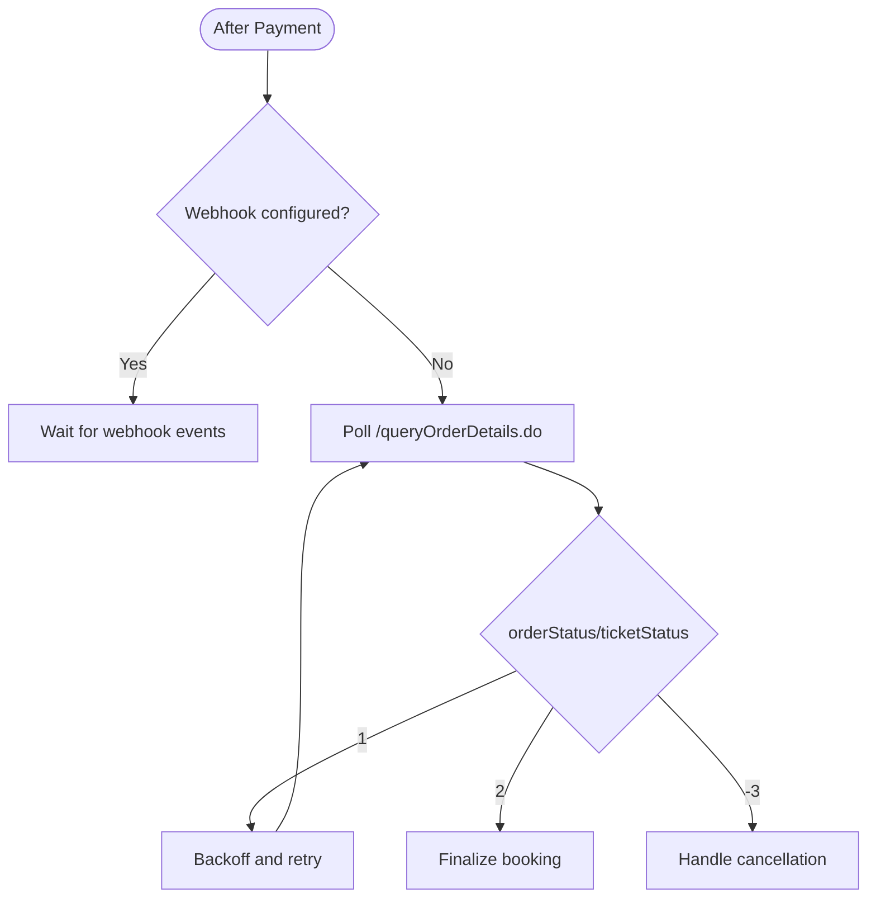
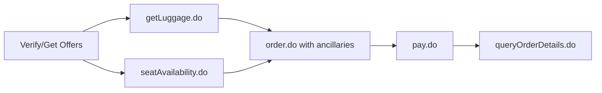
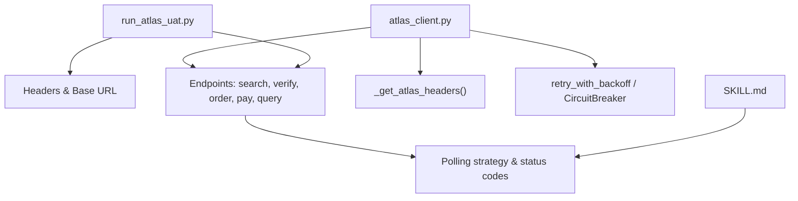

# Query Phase (POST /queryOrderDetails.do)

<cite>
**Referenced Files in This Document**
- [atlas_client.py](file://travel-recovery-os/backend/tools/atlas_client.py)
- [run_atlas_uat.py](file://travel-recovery-os/backend/run_atlas_uat.py)
- [SKILL.md](file://atlas-api-integration-advisor (2)/atlas-api-integration-advisor/SKILL.md)
- [Atlas_UAT_HappyPath.postman_collection (2).json](file://Atlas_UAT_HappyPath.postman_collection (2).json)
- [common-issues.md](file://atlas-api-integration-advisor (2)/atlas-api-integration-advisor/references/common-issues.md)
</cite>

## Table of Contents
1. [Introduction](#introduction)
2. [Project Structure](#project-structure)
3. [Core Components](#core-components)
4. [Architecture Overview](#architecture-overview)
5. [Detailed Component Analysis](#detailed-component-analysis)
6. [Dependency Analysis](#dependency-analysis)
7. [Performance Considerations](#performance-considerations)
8. [Troubleshooting Guide](#troubleshooting-guide)
9. [Conclusion](#conclusion)

## Introduction
This document explains the Atlas GDS Query phase implemented via POST /queryOrderDetails.do to confirm issued PNRs and e-tickets after payment. It covers:
- Request payload fields: cid, orderNo, requestSource
- Response parsing for pnrCode extraction, e-ticket number generation, seat assignment, and baggage transfer confirmation
- Finalization of the booking lifecycle using query to confirm successful ticket issuance and provide travel documentation
- Error handling for missing orders, invalid order numbers, and system synchronization issues
- Examples of successful query responses and troubleshooting steps for failures

The implementation is demonstrated in both a UAT runner script and an integration client that calls the official Atlas REST API endpoints.

## Project Structure
The relevant code spans:
- A UAT runner that executes the full booking flow and polls queryOrderDetails until ticketed
- An integration client that performs verify → order → pay → query and returns finalized booking data
- Integration advisor documentation describing polling fallback, status codes, and webhook alternatives

```mermaid
graph TB
subgraph "Client"
UAT["UAT Runner<br/>run_atlas_uat.py"]
Client["Integration Client<br/>atlas_client.py"]
end
subgraph "Atlas GDS Sandbox"
Search["/search.do"]
Verify["/verify.do"]
Order["/order.do"]
Pay["/pay.do"]
Query["/queryOrderDetails.do"]
end
UAT --> Search
UAT --> Verify
UAT --> Order
UAT --> Pay
UAT --> Query
Client --> Verify
Client --> Order
Client --> Pay
Client --> Query
```

**Diagram sources**
- [run_atlas_uat.py:44-205](file://travel-recovery-os/backend/run_atlas_uat.py#L44-L205)
- [atlas_client.py:222-331](file://travel-recovery-os/backend/tools/atlas_client.py#L222-L331)

**Section sources**
- [run_atlas_uat.py:44-205](file://travel-recovery-os/backend/run_atlas_uat.py#L44-L205)
- [atlas_client.py:222-331](file://travel-recovery-os/backend/tools/atlas_client.py#L222-L331)

## Core Components
- Query endpoint usage:
  - The UAT runner posts to /queryOrderDetails.do with cid, orderNo, and requestSource, then validates status and extracts orderStatus, pnrCode, totalPrice, and currency.
  - The integration client posts to /queryOrderDetails.do as part of the issue_ticket flow, extracting pnrCode and building a finalized booking result including e-ticket number, assigned seat, and baggage transfer flag.

- Request payload fields:
  - cid: client identifier used by Atlas
  - orderNo: unique order identifier returned by /order.do
  - requestSource: string indicating the calling system or test scenario

- Response parsing highlights:
  - pnrCode: extracted from response; if absent, a fallback value may be used
  - orderStatus/ticketStatus: used to determine completion state
  - totalPrice/currency: captured for confirmation records
  - E-ticket number, seat assignment, and baggage transfer are synthesized in the client’s result when needed

**Section sources**
- [run_atlas_uat.py:173-205](file://travel-recovery-os/backend/run_atlas_uat.py#L173-L205)
- [atlas_client.py:312-331](file://travel-recovery-os/backend/tools/atlas_client.py#L312-L331)
- [Atlas_UAT_HappyPath.postman_collection (2).json:169-220](file://Atlas_UAT_HappyPath.postman_collection (2).json#L169-L220)

## Architecture Overview
The Query phase finalizes the booking lifecycle after payment. Ticketing is asynchronous; clients should poll /queryOrderDetails.do or rely on webhooks. When webhooks are not configured, polling intervals increase over time and stop upon reaching terminal states.



**Diagram sources**
- [SKILL.md:793-919](file://atlas-api-integration-advisor (2)/atlas-api-integration-advisor/SKILL.md#L793-L919)
- [run_atlas_uat.py:173-205](file://travel-recovery-os/backend/run_atlas_uat.py#L173-L205)
- [atlas_client.py:312-331](file://travel-recovery-os/backend/tools/atlas_client.py#L312-L331)

## Detailed Component Analysis

### Query Endpoint Usage in UAT Runner
- Sends POST /queryOrderDetails.do with:
  - cid: client ID
  - orderNo: from previous /order.do
  - requestSource: scenario tag
- Validates HTTP 200 and status 0
- Extracts:
  - pnrCode (fallback if missing)
  - orderStatus
  - totalPrice
  - currency



**Diagram sources**
- [run_atlas_uat.py:173-205](file://travel-recovery-os/backend/run_atlas_uat.py#L173-L205)

**Section sources**
- [run_atlas_uat.py:173-205](file://travel-recovery-os/backend/run_atlas_uat.py#L173-L205)

### Query Endpoint Usage in Integration Client
- After /pay.do success, posts /queryOrderDetails.do with the same payload structure
- Extracts pnrCode; if missing, uses a generated fallback
- Builds a finalized booking result including:
  - e_ticket_number: generated for demonstration purposes
  - assigned_seat: generated for demonstration purposes
  - baggage_transferred: set to true for demonstration purposes
  - provider: indicates live API usage



**Diagram sources**
- [atlas_client.py:302-331](file://travel-recovery-os/backend/tools/atlas_client.py#L302-L331)

**Section sources**
- [atlas_client.py:302-331](file://travel-recovery-os/backend/tools/atlas_client.py#L302-L331)

### Polling Strategy and Webhook Alternative
- If webhooks are not configured, poll /queryOrderDetails.do at increasing intervals:
  - Every 30 seconds for first 5 minutes
  - Every 2 minutes up to 30 minutes
  - Every 10 minutes thereafter
- Stop polling when ticketStatus reaches 2 (ticketed) or -3 (cancelled)



**Diagram sources**
- [SKILL.md:893-919](file://atlas-api-integration-advisor (2)/atlas-api-integration-advisor/SKILL.md#L893-L919)

**Section sources**
- [SKILL.md:893-919](file://atlas-api-integration-advisor (2)/atlas-api-integration-advisor/SKILL.md#L893-L919)

### Post-Booking Ancillary Context (Baggage and Seat)
- Baggage and seat selection are optional ancillaries queried before booking and passed into /order.do via productCode values
- After ticketing, post-booking ancillary flows can add additional services to the same order
- While these are pre/post booking steps, they contextualize how seat assignment and baggage transfer relate to the final booking record



**Diagram sources**
- [SKILL.md:468-762](file://atlas-api-integration-advisor (2)/atlas-api-integration-advisor/SKILL.md#L468-L762)

**Section sources**
- [SKILL.md:468-762](file://atlas-api-integration-advisor (2)/atlas-api-integration-advisor/SKILL.md#L468-L762)

## Dependency Analysis
- The UAT runner depends on the Atlas sandbox base URL and headers for authentication
- The integration client encapsulates header generation, retries, and circuit breaker usage
- Both components rely on consistent field names across endpoints (cid, orderNo, requestSource)
- Polling strategy references documented status codes and terminal conditions



**Diagram sources**
- [run_atlas_uat.py:9-19](file://travel-recovery-os/backend/run_atlas_uat.py#L9-L19)
- [atlas_client.py:38-48](file://travel-recovery-os/backend/tools/atlas_client.py#L38-L48)
- [SKILL.md:893-919](file://atlas-api-integration-advisor (2)/atlas-api-integration-advisor/SKILL.md#L893-L919)

**Section sources**
- [run_atlas_uat.py:9-19](file://travel-recovery-os/backend/run_atlas_uat.py#L9-L19)
- [atlas_client.py:38-48](file://travel-recovery-os/backend/tools/atlas_client.py#L38-L48)
- [SKILL.md:893-919](file://atlas-api-integration-advisor (2)/atlas-api-integration-advisor/SKILL.md#L893-L919)

## Performance Considerations
- Use exponential backoff for transient errors during polling
- Limit polling frequency based on phases to reduce load
- Prefer webhooks where available to avoid excessive polling
- Cache search results and reuse sessions within validity windows to minimize redundant calls

[No sources needed since this section provides general guidance]

## Troubleshooting Guide
Common issues and resolutions related to the Query phase:

- Missing or invalid orderNo:
  - Ensure orderNo is captured from /order.do and passed correctly to /queryOrderDetails.do
  - Validate that the order exists and has been paid

- Authentication failures:
  - Confirm x-atlas-client-id and x-atlas-client-secret headers are correct for the environment
  - Avoid mixing sandbox credentials with production URLs

- System synchronization issues:
  - Ticketing is asynchronous; continue polling until terminal status
  - Implement retry logic for transient timeouts and rate limits

- Order status interpretation:
  - 0 = Unpaid
  - 1 = Ticketing in Process
  - 2 = Ticketed
  - -3 = Cancelled

- Typical retry pattern:
  - For transient errors (timeouts), retry with exponential backoff
  - For expired sessions/routings, restart from search or verify
  - For price changes, re-verify and resubmit order
  - For availability changes, restart from search
  - For auth/system errors, check credentials and escalate if persistent

**Section sources**
- [common-issues.md:128-176](file://atlas-api-integration-advisor (2)/atlas-api-integration-advisor/references/common-issues.md#L128-L176)
- [SKILL.md:328-371](file://atlas-api-integration-advisor (2)/atlas-api-integration-advisor/SKILL.md#L328-L371)
- [Atlas_UAT_HappyPath.postman_collection (2).json:169-220](file://Atlas_UAT_HappyPath.postman_collection (2).json#L169-L220)

## Conclusion
The POST /queryOrderDetails.do endpoint finalizes the booking lifecycle by confirming ticket issuance and providing essential travel documentation such as pnrCode. In practice:
- Send cid, orderNo, and requestSource to retrieve order details
- Parse orderStatus/ticketStatus to determine completion
- Extract pnrCode and other fields for confirmation
- Use polling or webhooks to handle asynchronous ticketing
- Apply robust error handling and retry strategies for reliability

Successful implementations demonstrate clear request payloads, careful response parsing, and resilient polling patterns aligned with documented status codes and best practices.

[No sources needed since this section summarizes without analyzing specific files]