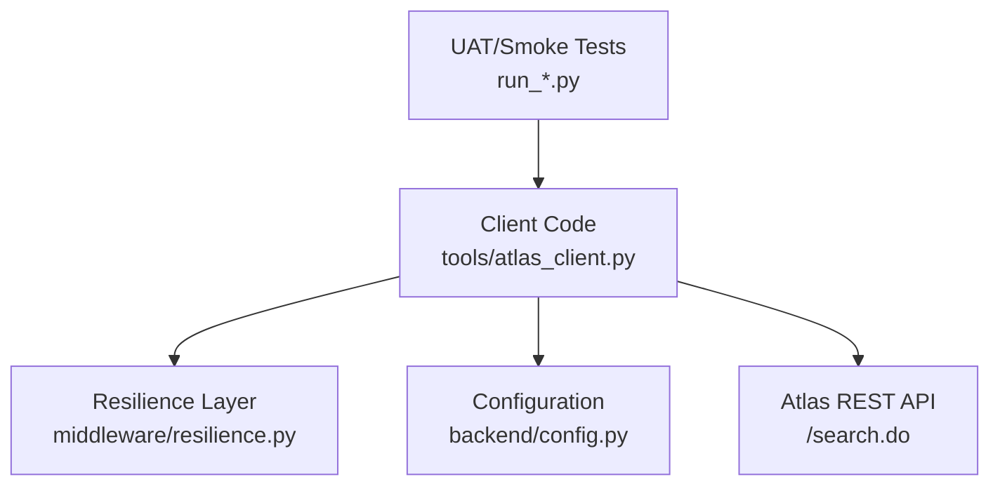
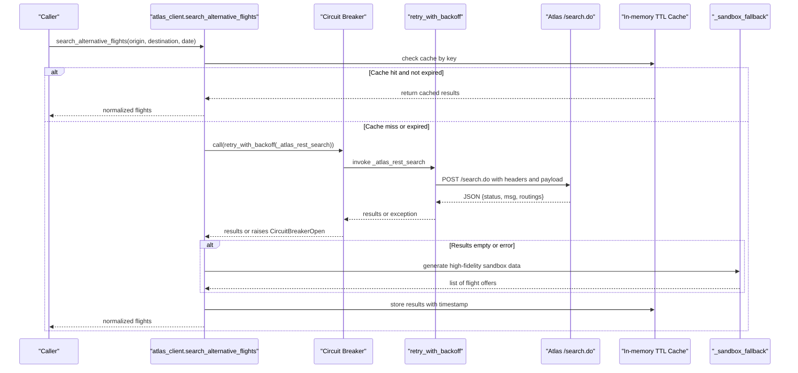
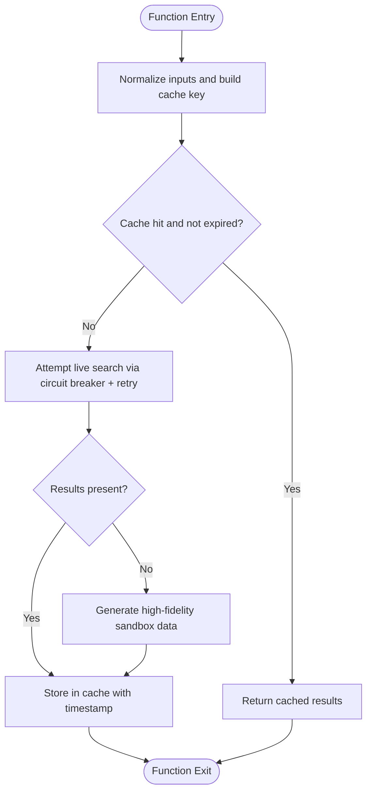
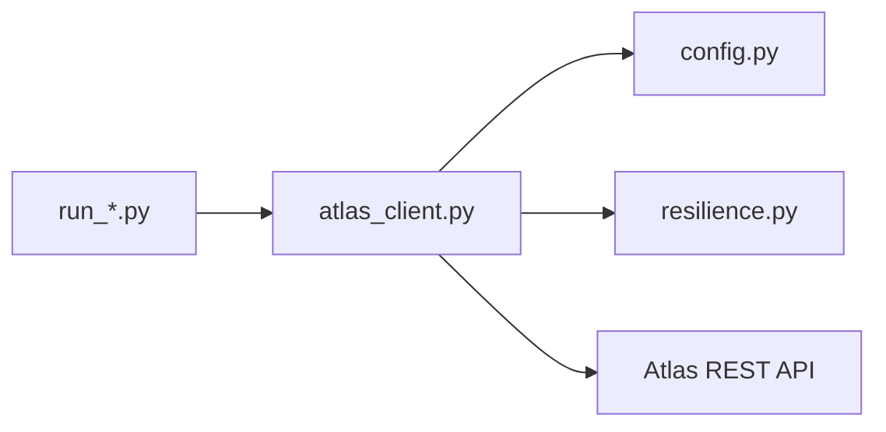

# Search Phase (POST /search.do)

<cite>
**Referenced Files in This Document**
- [atlas_client.py](file://travel-recovery-os/backend/tools/atlas_client.py)
- [resilience.py](file://travel-recovery-os/backend/middleware/resilience.py)
- [config.py](file://travel-recovery-os/backend/config.py)
- [run_production_smoke_test.py](file://travel-recovery-os/backend/run_production_smoke_test.py)
- [run_all_uat_scenarios.py](file://travel-recovery-os/backend/run_all_uat_scenarios.py)
- [run_atlas_uat.py](file://travel-recovery-os/backend/run_atlas_uat.py)
- [SKILL.md](file://atlas-api-integration-advisor (2)/atlas-api-integration-advisor/SKILL.md)
</cite>

## Table of Contents
1. [Introduction](#introduction)
2. [Project Structure](#project-structure)
3. [Core Components](#core-components)
4. [Architecture Overview](#architecture-overview)
5. [Detailed Component Analysis](#detailed-component-analysis)
6. [Dependency Analysis](#dependency-analysis)
7. [Performance Considerations](#performance-considerations)
8. [Troubleshooting Guide](#troubleshooting-guide)
9. [Conclusion](#conclusion)

## Introduction
This document explains the Atlas GDS Search phase implementation centered on the POST /search.do endpoint. It covers request payload fields, response handling for routings and routingIdentifier extraction, fare calculation logic, caching with TTL, circuit breaker integration, fallback to sandbox simulation, error handling patterns, timeout configuration, and authentication header requirements. Concrete examples are provided for successful searches, no results scenarios, and network failure handling.

## Project Structure
The search functionality is implemented as a client that calls the official Atlas REST API and integrates resilience patterns:

- Client layer: HTTP calls to /search.do, payload construction, normalization, and result mapping
- Resilience layer: retry with backoff and circuit breaker to protect against transient failures
- Configuration layer: environment-driven base URLs and credentials
- Test harnesses: UAT and smoke tests demonstrating end-to-end usage

**Diagram sources**
- [atlas_client.py:82-167](file://travel-recovery-os/backend/tools/atlas_client.py#L82-L167)
- [resilience.py:25-80](file://travel-recovery-os/backend/middleware/resilience.py#L25-L80)
- [resilience.py:97-216](file://travel-recovery-os/backend/middleware/resilience.py#L97-L216)
- [config.py:63-70](file://travel-recovery-os/backend/config.py#L63-L70)
- [run_production_smoke_test.py:41-73](file://travel-recovery-os/backend/run_production_smoke_test.py#L41-L73)
- [run_all_uat_scenarios.py:53-89](file://travel-recovery-os/backend/run_all_uat_scenarios.py#L53-L89)

**Section sources**
- [atlas_client.py:1-16](file://travel-recovery-os/backend/tools/atlas_client.py#L1-L16)
- [config.py:63-70](file://travel-recovery-os/backend/config.py#L63-L70)
- [run_production_smoke_test.py:41-73](file://travel-recovery-os/backend/run_production_smoke_test.py#L41-L73)
- [run_all_uat_scenarios.py:53-89](file://travel-recovery-os/backend/run_all_uat_scenarios.py#L53-L89)

## Core Components
- POST /search.do client: constructs payload, sends request with required headers, handles status codes and business status, normalizes results, and calculates fares
- search_alternative_flights: orchestrates live search with caching, circuit breaker, retries, and sandbox fallback
- Circuit breaker and retry: protects against transient failures and reduces load during outages
- Configuration: provides base URLs and credentials for sandbox or production environments

Key responsibilities:
- Build request payload with cid, tripType, adultNum, childNum, infantNum, fromCity, toCity, fromDate, currency, requestSource
- Validate response status and extract routings array
- Extract routingIdentifier per routing and compute total fare as adultPrice + adultTax
- Cache results with TTL to avoid repeated calls
- Fall back to high-fidelity sandbox simulation when live search fails or returns no inventory

**Section sources**
- [atlas_client.py:82-167](file://travel-recovery-os/backend/tools/atlas_client.py#L82-L167)
- [atlas_client.py:170-219](file://travel-recovery-os/backend/tools/atlas_client.py#L170-L219)
- [resilience.py:25-80](file://travel-recovery-os/backend/middleware/resilience.py#L25-L80)
- [resilience.py:97-216](file://travel-recovery-os/backend/middleware/resilience.py#L97-L216)
- [config.py:63-70](file://travel-recovery-os/backend/config.py#L63-L70)

## Architecture Overview
The search flow integrates multiple layers to ensure reliability and performance:

**Diagram sources**
- [atlas_client.py:175-219](file://travel-recovery-os/backend/tools/atlas_client.py#L175-L219)
- [atlas_client.py:82-167](file://travel-recovery-os/backend/tools/atlas_client.py#L82-L167)
- [resilience.py:25-80](file://travel-recovery-os/backend/middleware/resilience.py#L25-L80)
- [resilience.py:97-216](file://travel-recovery-os/backend/middleware/resilience.py#L97-L216)

## Detailed Component Analysis

### POST /search.do Request Payload
- Fields:
  - cid: client identifier
  - tripType: trip type code
  - adultNum: number of adults
  - childNum: number of children
  - infantNum: number of infants
  - fromCity: origin airport code
  - toCity: destination airport code
  - fromDate: formatted travel date (YYYYMMDD)
  - currency: currency code
  - requestSource: source tag for tracing
- Headers:
  - Content-Type: application/json
  - Accept: */*
  - Accept-Encoding: gzip (required for search.do)
  - x-atlas-client-id: client ID
  - x-atlas-client-secret: client secret

Notes:
- Date formatting ensures YYYYMMDD and shifts past dates to future for sandbox compliance
- Base URL selection supports distinct production search base URL or unified sandbox base URL

**Section sources**
- [atlas_client.py:38-48](file://travel-recovery-os/backend/tools/atlas_client.py#L38-L48)
- [atlas_client.py:51-67](file://travel-recovery-os/backend/tools/atlas_client.py#L51-L67)
- [atlas_client.py:82-102](file://travel-recovery-os/backend/tools/atlas_client.py#L82-L102)
- [SKILL.md:307-319](file://atlas-api-integration-advisor (2)/atlas-api-integration-advisor/SKILL.md#L307-L319)

### Response Handling: routings, routingIdentifier, Fare Calculation
- Response validation:
  - HTTP 200 expected; otherwise raise runtime error
  - Business status must be 0; otherwise raise runtime error with message
- Routings processing:
  - Extract routings array; if empty, raise value error indicating no routings found
  - Iterate up to first four routings
  - For each routing:
    - Extract routingIdentifier
    - Read adultPrice and adultTax; compute total_fare = adultPrice + adultTax
    - Normalize into internal flight object including provider, cabin class, seats, punctuality rating, ancillaries
- Currency:
  - Use routing’s currency field; default USD if missing

Examples of usage in tests:
- Smoke test checks status == 0 and logs count of routings
- UAT scenarios iterate routings to find first verified inventory using routingIdentifier

**Section sources**
- [atlas_client.py:104-167](file://travel-recovery-os/backend/tools/atlas_client.py#L104-L167)
- [run_production_smoke_test.py:57-73](file://travel-recovery-os/backend/run_production_smoke_test.py#L57-L73)
- [run_all_uat_scenarios.py:70-89](file://travel-recovery-os/backend/run_all_uat_scenarios.py#L70-L89)
- [run_atlas_uat.py:65-83](file://travel-recovery-os/backend/run_atlas_uat.py#L65-L83)

### search_alternative_flights Implementation
- Purpose:
  - Orchestrates live search via Atlas REST API with caching, circuit breaker, retries, and sandbox fallback
- Steps:
  - Normalize inputs: uppercase origin/destination, parse travel date
  - Build cache key: origin:destination:date
  - Check in-memory TTL cache; return cached results if within TTL
  - Attempt live search wrapped in circuit breaker and retry with backoff
  - If results are empty or an error occurs, fall back to high-fidelity sandbox simulation
  - Store results in cache with current timestamp
- Caching:
  - In-memory dictionary keyed by route and date
  - TTL set to 300 seconds (5 minutes)
- Circuit breaker:
  - Uses atlas_breaker configured with failure threshold and cooldown
  - Raises CircuitBreakerOpen when open; caller catches and falls back
- Retries:
  - retry_with_backoff wraps the live search call with exponential backoff and jitter

**Diagram sources**
- [atlas_client.py:175-219](file://travel-recovery-os/backend/tools/atlas_client.py#L175-L219)
- [resilience.py:25-80](file://travel-recovery-os/backend/middleware/resilience.py#L25-L80)
- [resilience.py:97-216](file://travel-recovery-os/backend/middleware/resilience.py#L97-L216)

**Section sources**
- [atlas_client.py:170-219](file://travel-recovery-os/backend/tools/atlas_client.py#L170-L219)
- [resilience.py:25-80](file://travel-recovery-os/backend/middleware/resilience.py#L25-L80)
- [resilience.py:97-216](file://travel-recovery-os/backend/middleware/resilience.py#L97-L216)

### Caching Mechanisms with TTL
- Storage:
  - In-memory dictionary _flight_search_cache
- Keying:
  - Composite key of origin, destination, and travel date
- Expiration:
  - CACHE_TTL_SECONDS = 300 seconds
- Behavior:
  - On cache hit within TTL, return copy of cached data
  - On cache miss or expiration, perform live search or fallback and update cache

**Section sources**
- [atlas_client.py:170-195](file://travel-recovery-os/backend/tools/atlas_client.py#L170-L195)
- [atlas_client.py:215-219](file://travel-recovery-os/backend/tools/atlas_client.py#L215-L219)

### Circuit Breaker Integration
- Pre-built breaker:
  - atlas_breaker with failure_threshold=5 and cooldown_seconds=30.0
- Usage:
  - Wraps live search call to fast-fail when failures exceed threshold
  - Transitions to HALF_OPEN after cooldown; allows probe request
- Error propagation:
  - Raises CircuitBreakerOpen when OPEN; caller catches and triggers fallback

**Section sources**
- [resilience.py:97-216](file://travel-recovery-os/backend/middleware/resilience.py#L97-L216)
- [resilience.py:233-237](file://travel-recovery-os/backend/middleware/resilience.py#L233-L237)
- [atlas_client.py:197-213](file://travel-recovery-os/backend/tools/atlas_client.py#L197-L213)

### Fallback to Sandbox Simulation
- Trigger:
  - When live search returns no results or raises an exception
- Behavior:
  - Generates high-fidelity sandbox flight data with realistic attributes
  - Includes varied airlines, times, durations, cabin classes, and seat availability
- Provider tagging:
  - Marked as “Atlas GDS Engine (Sandbox Rehearsal)” to distinguish from live results

**Section sources**
- [atlas_client.py:211-219](file://travel-recovery-os/backend/tools/atlas_client.py#L211-L219)
- [atlas_client.py:360-425](file://travel-recovery-os/backend/tools/atlas_client.py#L360-L425)

### Error Handling Patterns
- HTTP errors:
  - Non-200 responses raise RuntimeError with status and truncated text
- Business errors:
  - status != 0 raises RuntimeError with message from response
- No inventory:
  - Empty routings array raises ValueError with context
- Network and resilience:
  - CircuitBreakerOpen caught; logs warning and proceeds to fallback
  - retry_with_backoff logs attempts and delays; raises last exception if exhausted

**Section sources**
- [atlas_client.py:104-127](file://travel-recovery-os/backend/tools/atlas_client.py#L104-L127)
- [atlas_client.py:197-213](file://travel-recovery-os/backend/tools/atlas_client.py#L197-L213)
- [resilience.py:25-80](file://travel-recovery-os/backend/middleware/resilience.py#L25-L80)

### Timeout Configurations
- Search client timeout:
  - httpx.AsyncClient(timeout=4.0) used for /search.do calls
- Other endpoints:
  - Ticketing lifecycle uses longer timeouts (e.g., 15.0s) for verify/order/pay/query flows

**Section sources**
- [atlas_client.py:104-109](file://travel-recovery-os/backend/tools/atlas_client.py#L104-L109)
- [atlas_client.py:232-251](file://travel-recovery-os/backend/tools/atlas_client.py#L232-L251)

### Authentication Header Requirements
- Required headers for all Atlas endpoints:
  - x-atlas-client-id
  - x-atlas-client-secret
  - Content-Type: application/json
  - Accept: */*
  - Accept-Encoding: gzip (required for search.do)
- Auth failure example:
  - Returns status 900 with message indicating auth failed

**Section sources**
- [atlas_client.py:38-48](file://travel-recovery-os/backend/tools/atlas_client.py#L38-L48)
- [SKILL.md:307-324](file://atlas-api-integration-advisor (2)/atlas-api-integration-advisor/SKILL.md#L307-L324)

## Dependency Analysis
The search phase depends on configuration for credentials and endpoints, resilience utilities for retries and circuit breaking, and external Atlas services.

**Diagram sources**
- [atlas_client.py:28-33](file://travel-recovery-os/backend/tools/atlas_client.py#L28-L33)
- [config.py:63-70](file://travel-recovery-os/backend/config.py#L63-L70)
- [resilience.py:233-237](file://travel-recovery-os/backend/middleware/resilience.py#L233-L237)
- [run_production_smoke_test.py:41-73](file://travel-recovery-os/backend/run_production_smoke_test.py#L41-L73)
- [run_all_uat_scenarios.py:53-89](file://travel-recovery-os/backend/run_all_uat_scenarios.py#L53-L89)

**Section sources**
- [atlas_client.py:28-33](file://travel-recovery-os/backend/tools/atlas_client.py#L28-L33)
- [config.py:63-70](file://travel-recovery-os/backend/config.py#L63-L70)
- [resilience.py:233-237](file://travel-recovery-os/backend/middleware/resilience.py#L233-L237)

## Performance Considerations
- Caching:
  - In-memory TTL cache reduces latency for repeated searches within 5 minutes
- Timeouts:
  - Short timeout (4.0s) for search prevents long hangs; longer timeouts for transactional steps
- Circuit breaker:
  - Protects system from cascading failures and reduces load during outages
- Normalization:
  - Limiting to first four routings balances responsiveness with result richness

[No sources needed since this section provides general guidance]

## Troubleshooting Guide
Common issues and resolutions:

- Authentication failure:
  - Ensure x-atlas-client-id and x-atlas-client-secret are correct
  - Verify Accept-Encoding: gzip is included for search.do
  - Expect status 900 with auth error message if invalid

- No routings returned:
  - Indicates no inventory for the requested route/date
  - System will fall back to sandbox simulation; verify route coverage or adjust date/city pair

- Network or service errors:
  - Circuit breaker may open after repeated failures; wait for cooldown or reset breaker
  - Retry with backoff logs attempts and delays; inspect logs for last error

- Timeout exceeded:
  - Search uses 4.0s timeout; consider adjusting upstream timeouts or investigating slow GDS response

Concrete examples:
- Successful search:
  - Status 0, routings array non-empty, routingIdentifier extracted, fare computed as adultPrice + adultTax
- No results scenario:
  - Empty routings triggers fallback; verify route and date validity
- Network failure handling:
  - Exception caught, circuit breaker state updated, fallback executed, cache updated with sandbox data

**Section sources**
- [atlas_client.py:104-127](file://travel-recovery-os/backend/tools/atlas_client.py#L104-L127)
- [atlas_client.py:197-219](file://travel-recovery-os/backend/tools/atlas_client.py#L197-L219)
- [SKILL.md:307-324](file://atlas-api-integration-advisor (2)/atlas-api-integration-advisor/SKILL.md#L307-L324)

## Conclusion
The Atlas GDS Search phase implements a robust, resilient approach to querying flight offerings via POST /search.do. It enforces strict authentication and payload requirements, normalizes and calculates fares from routings, caches results with TTL, integrates circuit breaker and retry mechanisms, and gracefully falls back to sandbox simulation when live inventory is unavailable. The design balances performance and reliability, making it suitable for both development and production environments.

[No sources needed since this section summarizes without analyzing specific files]