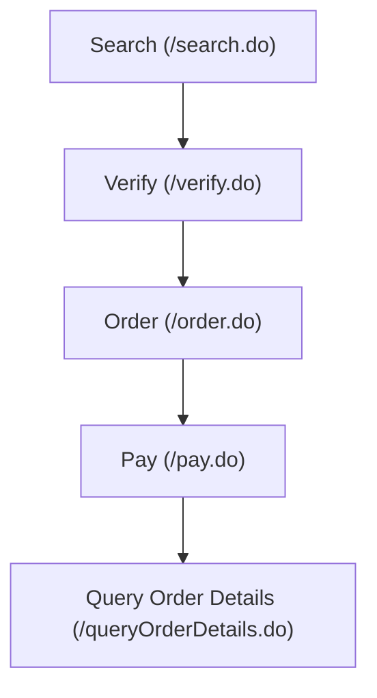
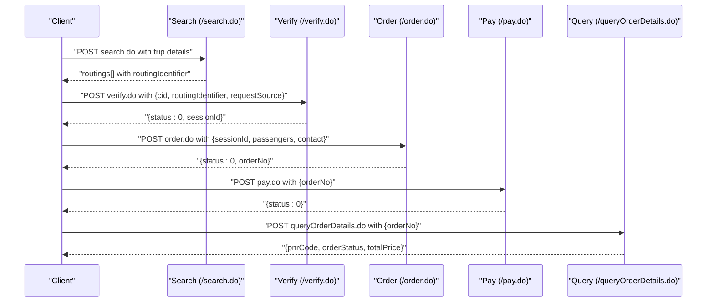
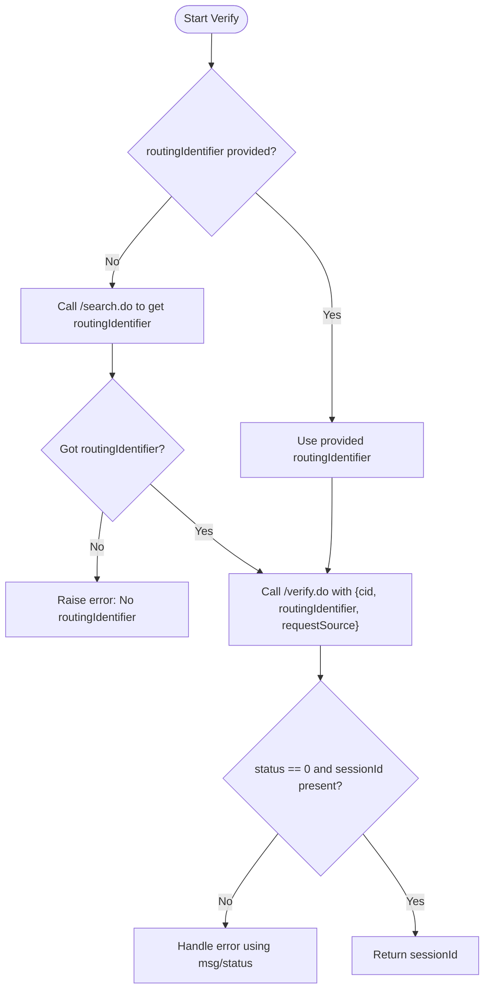
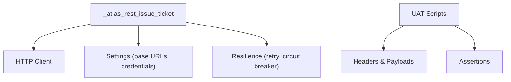

# Verify Phase (POST /verify.do)

<cite>
**Referenced Files in This Document**
- [atlas_client.py](file://travel-recovery-os/backend/tools/atlas_client.py)
- [run_atlas_uat.py](file://travel-recovery-os/backend/run_atlas_uat.py)
- [flow-quick-reference.md](file://atlas-api-integration-advisor (2)/atlas-api-integration-advisor/references/flow-quick-reference.md)
- [common-issues.md](file://atlas-api-integration-advisor (2)/atlas-api-integration-advisor/references/common-issues.md)
</cite>

## Table of Contents
1. [Introduction](#introduction)
2. [Project Structure](#project-structure)
3. [Core Components](#core-components)
4. [Architecture Overview](#architecture-overview)
5. [Detailed Component Analysis](#detailed-component-analysis)
6. [Dependency Analysis](#dependency-analysis)
7. [Performance Considerations](#performance-considerations)
8. [Troubleshooting Guide](#troubleshooting-guide)
9. [Conclusion](#conclusion)

## Introduction
This document explains the Atlas GDS Verify phase as implemented in this repository. It focuses on the POST /verify.do endpoint used to lock fares and secure a sessionId, bridging search results to order creation within the _atlas_rest_issue_ticket function. You will find:
- Request payload structure for verify.do (cid, routingIdentifier, requestSource)
- Response handling for successful verification (status 0, sessionId)
- Error scenarios such as expired routings, fare changes, and insufficient inventory
- Integration points with search and order flows
- Examples of success and failure cases with recommended error handling strategies

## Project Structure
The Verify phase is integrated into an end-to-end booking flow that includes Search → Verify → Order → Pay → Query. The key implementation files are:
- tools/atlas_client.py: Implements the live ticketing lifecycle including verify.do
- run_atlas_uat.py: UAT scenario demonstrating verify.do usage and response validation
- references/flow-quick-reference.md: Official API flow reference showing verify.do position in the sequence
- references/common-issues.md: Error codes and resolutions for verify and related steps

**Diagram sources**
- [flow-quick-reference.md:11-115](file://atlas-api-integration-advisor (2)/atlas-api-integration-advisor/references/flow-quick-reference.md#L11-L115)

**Section sources**
- [atlas_client.py:1-16](file://travel-recovery-os/backend/tools/atlas_client.py#L1-L16)
- [flow-quick-reference.md:11-115](file://atlas-api-integration-advisor (2)/atlas-api-integration-advisor/references/flow-quick-reference.md#L11-L115)

## Core Components
- _atlas_rest_issue_ticket: Orchestrates the full ticketing lifecycle, including verify.do to lock fare and obtain sessionId, then proceeds to order creation and payment.
- UAT scripts: Demonstrate correct request payloads and response assertions for verify.do.

Key responsibilities:
- Acquire routingIdentifier from search or reuse provided value
- Call verify.do with cid, routingIdentifier, and requestSource
- Validate status 0 and extract sessionId
- Pass sessionId to order.do to create booking record

**Section sources**
- [atlas_client.py:222-331](file://travel-recovery-os/backend/tools/atlas_client.py#L222-L331)
- [run_atlas_uat.py:86-108](file://travel-recovery-os/backend/run_atlas_uat.py#L86-L108)

## Architecture Overview
The verify phase acts as a bridge between search results and order creation. It validates current pricing and availability, locks the fare, and returns a time-bound sessionId used by subsequent order and ancillary calls.

**Diagram sources**
- [atlas_client.py:232-331](file://travel-recovery-os/backend/tools/atlas_client.py#L232-L331)
- [flow-quick-reference.md:11-115](file://atlas-api-integration-advisor (2)/atlas-api-integration-advisor/references/flow-quick-reference.md#L11-L115)

## Detailed Component Analysis

### Verify Endpoint: POST /verify.do
Purpose:
- Locks fare and confirms availability for the selected routing
- Secures a sessionId for downstream order and ancillary operations

Request payload:
- cid: Client identifier
- routingIdentifier: Identifier from search response
- requestSource: Source tag for tracking

Response handling:
- On success: status 0 and a valid sessionId
- On failure: non-zero status with msg describing the issue

Integration within _atlas_rest_issue_ticket:
- If no routing_identifier is provided, the function performs a search to obtain one
- Calls verify.do with the routingIdentifier
- Validates status 0 and extracts sessionId
- Uses sessionId to create order.do and proceed to payment

**Diagram sources**
- [atlas_client.py:232-268](file://travel-recovery-os/backend/tools/atlas_client.py#L232-L268)

**Section sources**
- [atlas_client.py:232-268](file://travel-recovery-os/backend/tools/atlas_client.py#L232-L268)
- [run_atlas_uat.py:86-108](file://travel-recovery-os/backend/run_atlas_uat.py#L86-L108)

### Successful Verification Example
A successful verify response includes:
- status: 0
- sessionId: a unique token for the locked fare

In UAT, the script asserts:
- HTTP status code 200
- JSON status field equals 0
- sessionId is present and non-empty

Example evidence captured in UAT:
- endpoint: /verify.do
- status: 0
- sessionId: <value>

**Section sources**
- [run_atlas_uat.py:86-108](file://travel-recovery-os/backend/run_atlas_uat.py#L86-L108)

### Error Scenarios and Handling Strategies
Common verify-related errors and their resolutions:
- Expired routingIdentifier (> 6 hours): Re-run search.do to obtain a fresh routingIdentifier
- Flight no longer available: Re-run search.do for updated results
- Fare family sold out: Search again and select a different fare
- Price changed during order submission: Re-verify and resubmit order
- Insufficient inventory or seat unavailability: Re-verify, re-fetch ancillaries if needed, and adjust selection

Recommended handling:
- For expired routing/session: restart from search or re-verify
- For availability changes: restart from search
- For price changes: re-verify and resubmit order
- For authentication/system issues: validate credentials and headers

**Section sources**
- [common-issues.md:35-56](file://atlas-api-integration-advisor (2)/atlas-api-integration-advisor/references/common-issues.md#L35-L56)
- [common-issues.md:155-176](file://atlas-api-integration-advisor (2)/atlas-api-integration-advisor/references/common-issues.md#L155-L176)

### Data Flow: From Search to Order via Verify
Data chaining:
- search.do returns routings[], each containing routingIdentifier
- verify.do consumes routingIdentifier and returns sessionId
- order.do uses sessionId to create a booking record and returns orderNo
- pay.do completes payment using orderNo
- queryOrderDetails.do retrieves final PNR and order status

**Diagram sources**
- [flow-quick-reference.md:227-241](file://atlas-api-integration-advisor (2)/atlas-api-integration-advisor/references/flow-quick-reference.md#L227-L241)

**Section sources**
- [flow-quick-reference.md:11-115](file://atlas-api-integration-advisor (2)/atlas-api-integration-advisor/references/flow-quick-reference.md#L11-L115)

## Dependency Analysis
- _atlas_rest_issue_ticket depends on:
  - Settings for base URLs and client credentials
  - HTTP client for making requests to Atlas endpoints
  - Retry and circuit breaker middleware for resilience
- UAT scripts depend on:
  - Correct headers and payload formatting
  - Assertions to validate responses at each step

**Diagram sources**
- [atlas_client.py:18-35](file://travel-recovery-os/backend/tools/atlas_client.py#L18-L35)
- [run_atlas_uat.py:1-19](file://travel-recovery-os/backend/run_atlas_uat.py#L1-L19)

**Section sources**
- [atlas_client.py:18-35](file://travel-recovery-os/backend/tools/atlas_client.py#L18-L35)
- [run_atlas_uat.py:1-19](file://travel-recovery-os/backend/run_atlas_uat.py#L1-L19)

## Performance Considerations
- Use caching for search results to reduce repeated calls when appropriate
- Keep timeouts reasonable for verify and order steps to avoid long waits
- Implement retry with backoff for transient network issues
- Monitor session validity; re-verify promptly if sessions approach expiration

[No sources needed since this section provides general guidance]

## Troubleshooting Guide
Common issues and resolutions:
- Authentication failures: Ensure client ID and secret are correct and headers include required fields
- Search timeouts or limits: Retry later or adjust request parameters
- Verify failures:
  - Expired routingIdentifier: Re-run search
  - Flight unavailable: Re-run search
  - Fare sold out: Choose alternative fare
- Order failures:
  - Expired sessionId: Re-run verify
  - Price changed: Re-verify and resubmit
  - Seat/baggage unavailable: Re-verify and re-select ancillaries

Operational tips:
- Log status and msg fields for diagnostics
- Capture routingIdentifier and sessionId for traceability
- Follow the typical retry pattern for timeouts and availability changes

**Section sources**
- [common-issues.md:11-56](file://atlas-api-integration-advisor (2)/atlas-api-integration-advisor/references/common-issues.md#L11-L56)
- [common-issues.md:155-176](file://atlas-api-integration-advisor (2)/atlas-api-integration-advisor/references/common-issues.md#L155-L176)

## Conclusion
The verify phase is a critical step that locks fares and secures a sessionId, enabling reliable order creation. Proper handling of request payloads, response validation, and error scenarios ensures robust integration. By following the documented flows and troubleshooting strategies, implementations can successfully bridge search results to order creation and complete ticketing workflows.