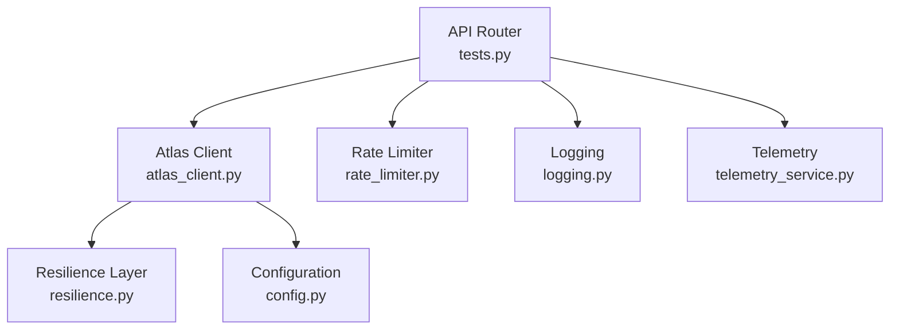
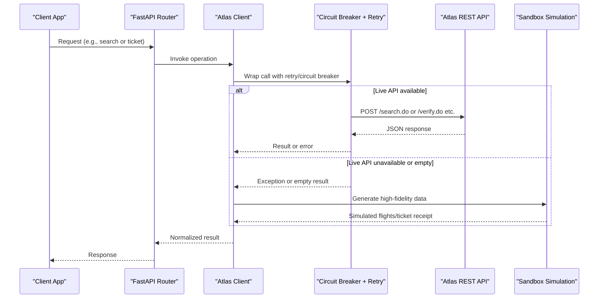
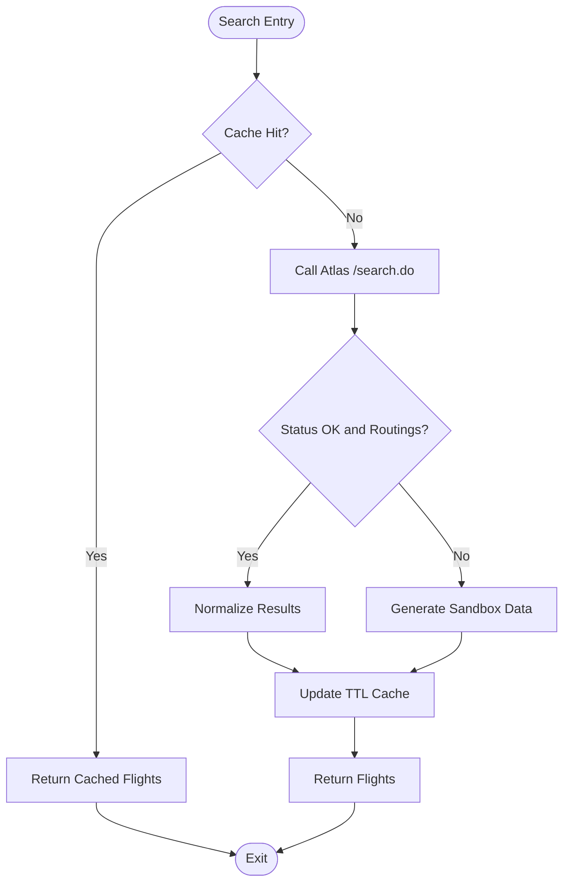
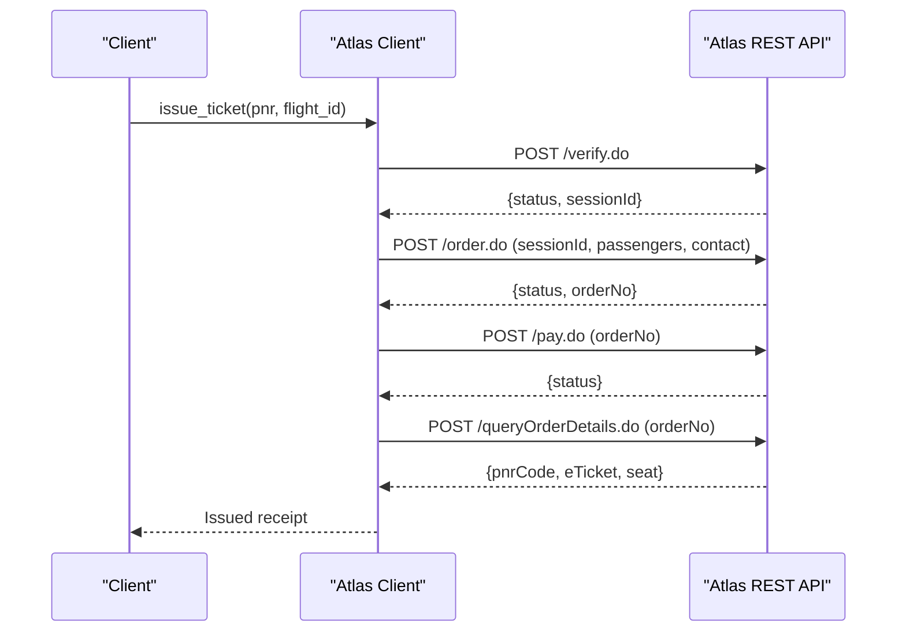
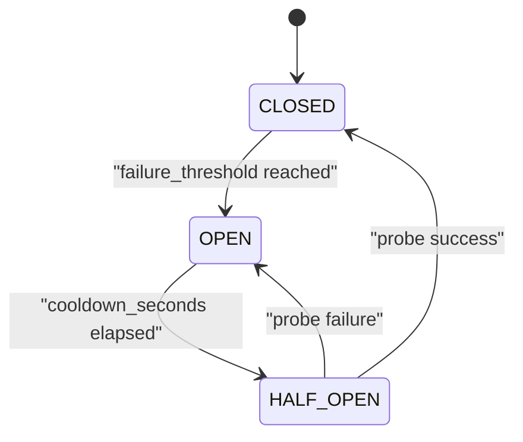
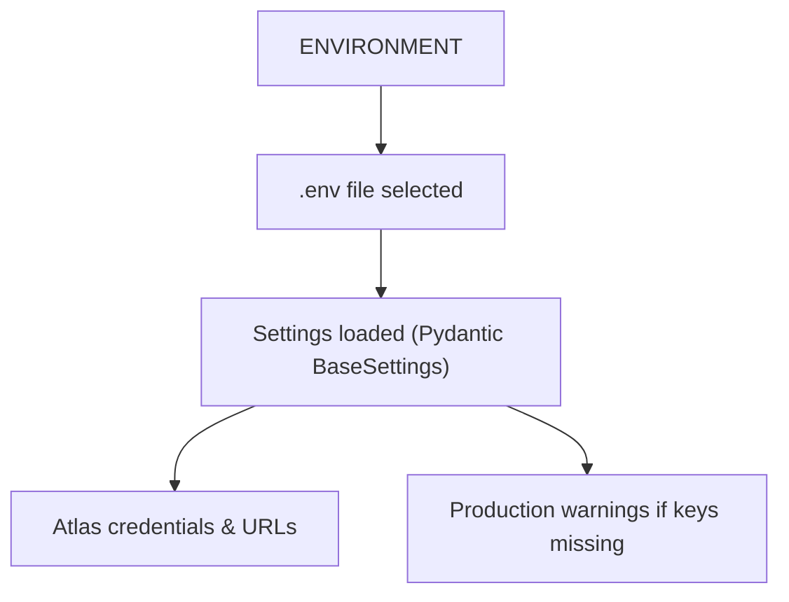
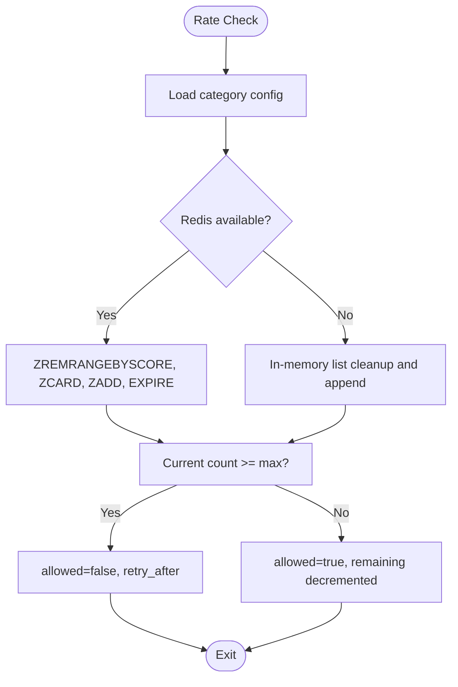
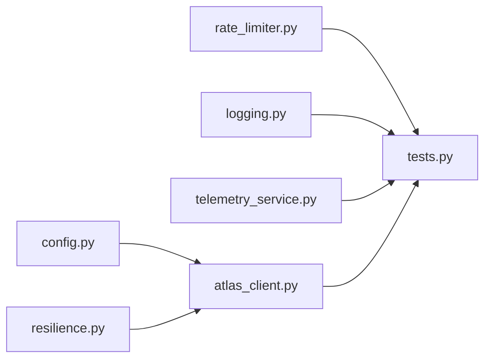

# Atlas GDS Integration

<cite>
**Referenced Files in This Document**
- [atlas_client.py](file://travel-recovery-os/backend/tools/atlas_client.py)
- [resilience.py](file://travel-recovery-os/backend/middleware/resilience.py)
- [config.py](file://travel-recovery-os/backend/config.py)
- [rate_limiter.py](file://travel-recovery-os/backend/auth/rate_limiter.py)
- [tests.py](file://travel-recovery-os/backend/api/routers/tests.py)
- [logging.py](file://travel-recovery-os/backend/middleware/logging.py)
- [telemetry_service.py](file://travel-recovery-os/backend/services/telemetry_service.py)
- [README.md](file://travel-recovery-os/README.md)
</cite>

## Table of Contents
1. Introduction
2. Project Structure
3. Core Components
4. Architecture Overview
5. Detailed Component Analysis
6. Dependency Analysis
7. Performance Considerations
8. Troubleshooting Guide
9. Conclusion
10. Appendices

## Introduction
This document explains the Atlas GDS integration used by the SynapseAir system to perform end-to-end flight booking operations via the official Atlas REST API. It covers the complete lifecycle: search, verify, order, pay, and query; authentication using client ID and secret; request header formatting; response parsing; resilient architecture with circuit breaker patterns and retry with exponential backoff; fallback to a high-fidelity sandbox simulation when live API is unavailable; configuration for production vs sandbox environments; rate limiting considerations; and monitoring approaches for health and performance metrics.

## Project Structure
The Atlas integration is implemented as a dedicated client module that encapsulates HTTP calls to Atlas endpoints, resilience wrappers, caching, and environment-driven configuration. Supporting modules provide circuit breaking, retries, structured logging, telemetry broadcasting, and test endpoints to exercise the integration.

**Diagram sources**
- [tests.py:19-40](file://travel-recovery-os/backend/api/routers/tests.py#L19-L40)
- [atlas_client.py:175-219](file://travel-recovery-os/backend/tools/atlas_client.py#L175-L219)
- [resilience.py:25-80](file://travel-recovery-os/backend/middleware/resilience.py#L25-L80)
- [config.py:62-69](file://travel-recovery-os/backend/config.py#L62-L69)
- [rate_limiter.py:41-99](file://travel-recovery-os/backend/auth/rate_limiter.py#L41-L99)
- [logging.py:37-99](file://travel-recovery-os/backend/middleware/logging.py#L37-L99)
- [telemetry_service.py:45-68](file://travel-recovery-os/backend/services/telemetry_service.py#L45-L68)

**Section sources**
- [README.md:88-126](file://travel-recovery-os/README.md#L88-L126)
- [tests.py:19-40](file://travel-recovery-os/backend/api/routers/tests.py#L19-L40)

## Core Components
- Atlas Client: Encapsulates search, verify/order/pay/query flows, header generation, date/time normalization, and fallback logic.
- Resilience Layer: Provides retry with exponential backoff and a three-state circuit breaker (CLOSED/OPEN/HALF_OPEN).
- Configuration: Centralized settings for Atlas credentials, base URLs, and environment profiles.
- Rate Limiter: Sliding window limiter backed by Redis or in-memory store to protect downstream services.
- Logging & Telemetry: Structured logging and real-time event broadcasting with PII masking.

Key responsibilities:
- Authentication headers: x-atlas-client-id and x-atlas-client-secret are injected into every request.
- Search: POST /search.do with normalized travel dates and payload fields.
- Ticketing flow: verify.do → order.do → pay.do → queryOrderDetails.do.
- Fallback: High-fidelity sandbox simulation when live API is unavailable or returns no inventory.
- Caching: In-memory TTL cache for repeated searches to reduce latency and load.

**Section sources**
- [atlas_client.py:38-48](file://travel-recovery-os/backend/tools/atlas_client.py#L38-L48)
- [atlas_client.py:82-167](file://travel-recovery-os/backend/tools/atlas_client.py#L82-L167)
- [atlas_client.py:222-331](file://travel-recovery-os/backend/tools/atlas_client.py#L222-L331)
- [atlas_client.py:334-357](file://travel-recovery-os/backend/tools/atlas_client.py#L334-L357)
- [atlas_client.py:360-425](file://travel-recovery-os/backend/tools/atlas_client.py#L360-L425)
- [resilience.py:25-80](file://travel-recovery-os/backend/middleware/resilience.py#L25-L80)
- [resilience.py:97-215](file://travel-recovery-os/backend/middleware/resilience.py#L97-L215)
- [config.py:62-69](file://travel-recovery-os/backend/config.py#L62-L69)
- [rate_limiter.py:41-99](file://travel-recovery-os/backend/auth/rate_limiter.py#L41-L99)
- [logging.py:37-99](file://travel-recovery-os/backend/middleware/logging.py#L37-L99)
- [telemetry_service.py:23-42](file://travel-recovery-os/backend/services/telemetry_service.py#L23-L42)

## Architecture Overview
The integration follows a resilient pipeline:
- Requests enter via FastAPI routers and call the Atlas client.
- The client uses an async HTTP client to call Atlas endpoints with proper headers.
- Each external call is wrapped with retry and circuit breaker to handle transient failures and outages.
- If live API fails or returns no results, a calibrated sandbox simulation provides realistic flight data.
- Results are cached in memory with TTL to improve performance for repeated queries.
- Telemetry and logs capture operational insights and events.

**Diagram sources**
- [atlas_client.py:175-219](file://travel-recovery-os/backend/tools/atlas_client.py#L175-L219)
- [atlas_client.py:222-331](file://travel-recovery-os/backend/tools/atlas_client.py#L222-L331)
- [resilience.py:97-215](file://travel-recovery-os/backend/middleware/resilience.py#L97-L215)
- [tests.py:19-40](file://travel-recovery-os/backend/api/routers/tests.py#L19-L40)

## Detailed Component Analysis

### Atlas Client: Search, Verify, Order, Pay, Query
- Header generation: Builds Content-Type, Accept, Accept-Encoding, and credential headers from configuration.
- Date/time normalization: Ensures YYYYMMDD format and future dates for sandbox compliance; formats times consistently.
- Search: Calls /search.do with normalized payload; extracts routings and normalizes to a common structure including pricing, cabin class, availability, and metadata.
- Ticket issuance: Performs verify.do to obtain sessionId, order.do to create booking with unique passenger identifiers, pay.do to finalize payment, and queryOrderDetails.do to confirm PNR and e-ticket.
- Fallback: When live API fails or returns no inventory, generates realistic flight options and ticket receipts.

**Diagram sources**
- [atlas_client.py:170-219](file://travel-recovery-os/backend/tools/atlas_client.py#L170-L219)
- [atlas_client.py:82-167](file://travel-recovery-os/backend/tools/atlas_client.py#L82-L167)
- [atlas_client.py:360-425](file://travel-recovery-os/backend/tools/atlas_client.py#L360-L425)

**Section sources**
- [atlas_client.py:38-48](file://travel-recovery-os/backend/tools/atlas_client.py#L38-L48)
- [atlas_client.py:51-79](file://travel-recovery-os/backend/tools/atlas_client.py#L51-L79)
- [atlas_client.py:82-167](file://travel-recovery-os/backend/tools/atlas_client.py#L82-L167)
- [atlas_client.py:170-219](file://travel-recovery-os/backend/tools/atlas_client.py#L170-L219)
- [atlas_client.py:222-331](file://travel-recovery-os/backend/tools/atlas_client.py#L222-L331)
- [atlas_client.py:334-357](file://travel-recovery-os/backend/tools/atlas_client.py#L334-L357)
- [atlas_client.py:360-425](file://travel-recovery-os/backend/tools/atlas_client.py#L360-L425)

### Ticket Issuance Workflow: Verify → Order → Pay → Query
- Verify: Confirms price and obtains sessionId required for subsequent steps.
- Order: Creates booking with passenger and contact details; ensures uniqueness to avoid collisions.
- Pay: Executes payment against the created order.
- Query: Retrieves final PNR and e-ticket confirmation.

**Diagram sources**
- [atlas_client.py:222-331](file://travel-recovery-os/backend/tools/atlas_client.py#L222-L331)

**Section sources**
- [atlas_client.py:222-331](file://travel-recovery-os/backend/tools/atlas_client.py#L222-L331)

### Resilience: Circuit Breaker and Retry
- Retry with Exponential Backoff: Wraps async coroutines with configurable retries, jitter, and delays; logs attempts and errors.
- Circuit Breaker: Three-state machine (CLOSED/OPEN/HALF_OPEN) that fast-fails after threshold failures and probes recovery during cooldown.
- Pre-built breakers: Dedicated instances for Atlas, LLMs, and webhooks with tuned thresholds and cooldowns.

**Diagram sources**
- [resilience.py:86-215](file://travel-recovery-os/backend/middleware/resilience.py#L86-L215)

**Section sources**
- [resilience.py:25-80](file://travel-recovery-os/backend/middleware/resilience.py#L25-L80)
- [resilience.py:97-215](file://travel-recovery-os/backend/middleware/resilience.py#L97-L215)
- [resilience.py:221-243](file://travel-recovery-os/backend/middleware/resilience.py#L221-L243)

### Configuration: Production vs Sandbox
- Environment profile selection via ENVIRONMENT variable loads appropriate .env file.
- Atlas settings include ATLAS_ENV, ATLAS_CLIENT_ID, ATLAS_CLIENT_SECRET, ATLAS_BASE_URL, and optional split base URLs for search and transaction endpoints.
- Production validation warns on missing critical keys like secrets and Redis URL.

**Diagram sources**
- [config.py:20-37](file://travel-recovery-os/backend/config.py#L20-L37)
- [config.py:62-69](file://travel-recovery-os/backend/config.py#L62-L69)
- [config.py:92-112](file://travel-recovery-os/backend/config.py#L92-L112)

**Section sources**
- [config.py:20-37](file://travel-recovery-os/backend/config.py#L20-L37)
- [config.py:62-69](file://travel-recovery-os/backend/config.py#L62-L69)
- [config.py:92-112](file://travel-recovery-os/backend/config.py#L92-L112)

### Rate Limiting: Sliding Window Protection
- Redis-backed sliding window limiter with per-category limits (webhook, consensus, history, stream, system, default).
- Falls back to in-memory store if Redis is unavailable.
- Returns allowed status, remaining quota, and retry-after guidance.

**Diagram sources**
- [rate_limiter.py:41-99](file://travel-recovery-os/backend/auth/rate_limiter.py#L41-L99)

**Section sources**
- [rate_limiter.py:15-29](file://travel-recovery-os/backend/auth/rate_limiter.py#L15-L29)
- [rate_limiter.py:41-99](file://travel-recovery-os/backend/auth/rate_limiter.py#L41-L99)
- [rate_limiter.py:119-123](file://travel-recovery-os/backend/auth/rate_limiter.py#L119-L123)

### Monitoring and Observability
- Structured logging supports JSON output and context binding for traceable logs across components.
- Telemetry service broadcasts masked events to subscribers and persists history; falls back gracefully when Redis is down.
- Health and circuit breaker status can be exposed via API endpoints for operational visibility.

**Section sources**
- [logging.py:37-99](file://travel-recovery-os/backend/middleware/logging.py#L37-L99)
- [logging.py:107-147](file://travel-recovery-os/backend/middleware/logging.py#L107-L147)
- [telemetry_service.py:23-42](file://travel-recovery-os/backend/services/telemetry_service.py#L23-L42)
- [telemetry_service.py:45-68](file://travel-recovery-os/backend/services/telemetry_service.py#L45-L68)
- [README.md:399-408](file://travel-recovery-os/README.md#L399-L408)

## Dependency Analysis
The Atlas client depends on configuration for credentials and URLs, resilience utilities for fault tolerance, and optionally on Redis for rate limiting and telemetry persistence. Test routes expose endpoints to validate search and ticketing flows.

**Diagram sources**
- [atlas_client.py:175-219](file://travel-recovery-os/backend/tools/atlas_client.py#L175-L219)
- [resilience.py:221-243](file://travel-recovery-os/backend/middleware/resilience.py#L221-L243)
- [config.py:62-69](file://travel-recovery-os/backend/config.py#L62-L69)
- [tests.py:19-40](file://travel-recovery-os/backend/api/routers/tests.py#L19-L40)
- [rate_limiter.py:41-99](file://travel-recovery-os/backend/auth/rate_limiter.py#L41-L99)
- [logging.py:37-99](file://travel-recovery-os/backend/middleware/logging.py#L37-L99)
- [telemetry_service.py:45-68](file://travel-recovery-os/backend/services/telemetry_service.py#L45-L68)

**Section sources**
- [atlas_client.py:175-219](file://travel-recovery-os/backend/tools/atlas_client.py#L175-L219)
- [tests.py:19-40](file://travel-recovery-os/backend/api/routers/tests.py#L19-L40)

## Performance Considerations
- In-memory TTL cache: Repeated searches return cached results within seconds, reducing latency and external API load.
- Async HTTP client: Non-blocking requests improve throughput under concurrent workloads.
- Gzip compression: Enabled via Accept-Encoding to reduce payload sizes.
- Circuit breaker and retry: Prevent cascading failures and mitigate transient network issues.
- Rate limiting: Protects downstream services and avoids throttling or bans.
- Telemetry and logging: Enable performance tracking and troubleshooting without exposing PII.

[No sources needed since this section provides general guidance]

## Troubleshooting Guide
Common issues and strategies:
- No routings returned: Indicates either no inventory or invalid parameters; check date normalization and origin/destination codes; fallback will generate simulated options.
- Verify/session errors: Ensure sessionId is used immediately after verify; re-run verify if session expires.
- Payment failures: Validate order creation succeeded before paying; inspect status and messages from pay endpoint.
- Circuit breaker open: Indicates repeated failures; wait for cooldown or investigate upstream health; monitor breaker state via logs.
- Rate limit exceeded: Adjust limits or implement backoff; use retry-after guidance from limiter responses.
- Redis unavailability: Rate limiter and telemetry fall back to in-memory stores; ensure Redis connectivity for production-grade behavior.

Operational tips:
- Use test endpoints to validate search and ticketing flows against sandbox.
- Inspect structured logs for attempt counts, delays, and error messages.
- Monitor telemetry streams for real-time event visibility and audit trails.

**Section sources**
- [atlas_client.py:110-119](file://travel-recovery-os/backend/tools/atlas_client.py#L110-L119)
- [atlas_client.py:259-310](file://travel-recovery-os/backend/tools/atlas_client.py#L259-L310)
- [resilience.py:134-215](file://travel-recovery-os/backend/middleware/resilience.py#L134-L215)
- [rate_limiter.py:72-99](file://travel-recovery-os/backend/auth/rate_limiter.py#L72-L99)
- [telemetry_service.py:45-68](file://travel-recovery-os/backend/services/telemetry_service.py#L45-L68)
- [tests.py:19-40](file://travel-recovery-os/backend/api/routers/tests.py#L19-L40)

## Conclusion
The Atlas GDS integration provides a robust, resilient, and observable path to search, verify, order, pay, and query flights through the official Atlas REST API. It combines authenticated requests, strict header formatting, and comprehensive response handling with circuit breaker protection, exponential backoff retries, and a high-fidelity sandbox fallback. Configuration supports both sandbox and production environments, while rate limiting and telemetry enable safe scaling and operational insight. Together, these components deliver reliable flight booking capabilities suitable for autonomous disruption recovery workflows.

[No sources needed since this section summarizes without analyzing specific files]

## Appendices

### Authentication and Headers
- Credentials: x-atlas-client-id and x-atlas-client-secret are sourced from configuration and injected into all requests.
- Required headers: Content-Type application/json, Accept */*, Accept-Encoding gzip.

**Section sources**
- [atlas_client.py:38-48](file://travel-recovery-os/backend/tools/atlas_client.py#L38-L48)
- [config.py:62-69](file://travel-recovery-os/backend/config.py#L62-L69)

### Example Operations
- Flight search: Use the test endpoint to retrieve candidate flights for given origin, destination, and date.
- Ticket issuance: Use the test endpoint to trigger the full verify/order/pay/query flow and receive a ticket receipt.

**Section sources**
- [tests.py:19-40](file://travel-recovery-os/backend/api/routers/tests.py#L19-L40)

### Configuration Options
- ATLAS_ENV: Selects sandbox or production mode.
- ATLAS_CLIENT_ID / ATLAS_CLIENT_SECRET: Credentials for Atlas API access.
- ATLAS_BASE_URL / ATLAS_SEARCH_BASE_URL / ATLAS_TRANSACTION_BASE_URL: Endpoint bases for search and transaction flows.
- ENVIRONMENT: Loads corresponding .env file and applies production validations.

**Section sources**
- [config.py:20-37](file://travel-recovery-os/backend/config.py#L20-L37)
- [config.py:62-69](file://travel-recovery-os/backend/config.py#L62-L69)
- [config.py:92-112](file://travel-recovery-os/backend/config.py#L92-L112)