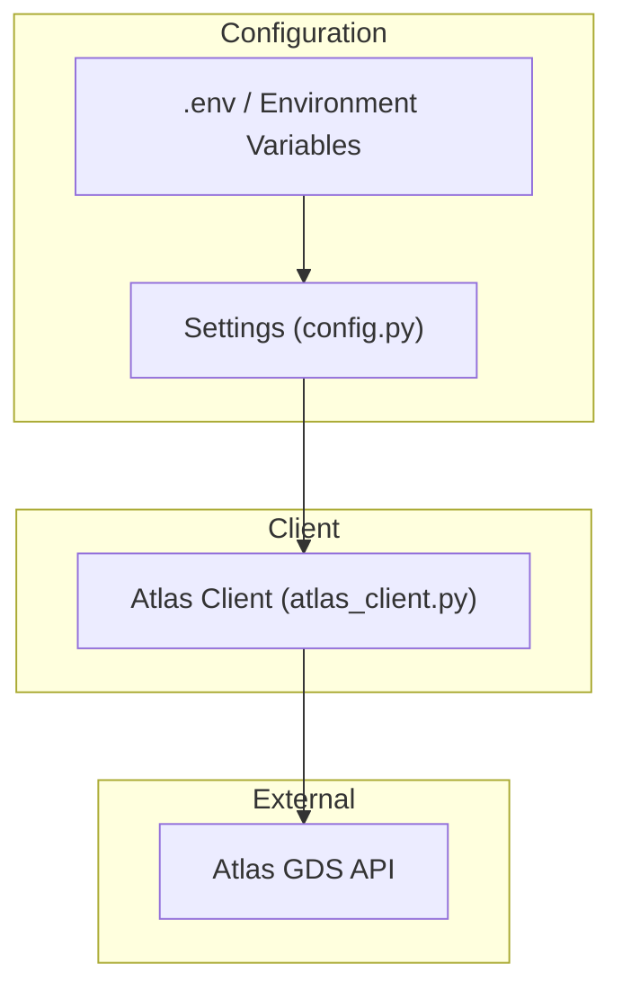
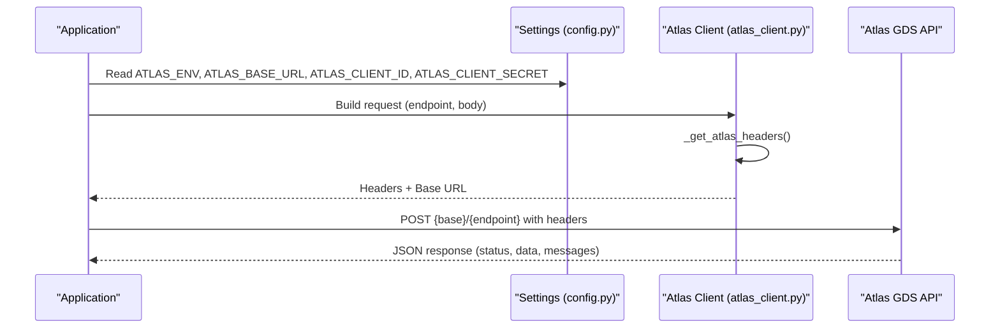
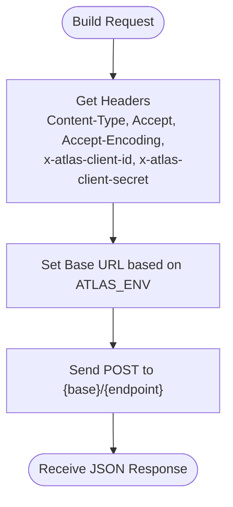
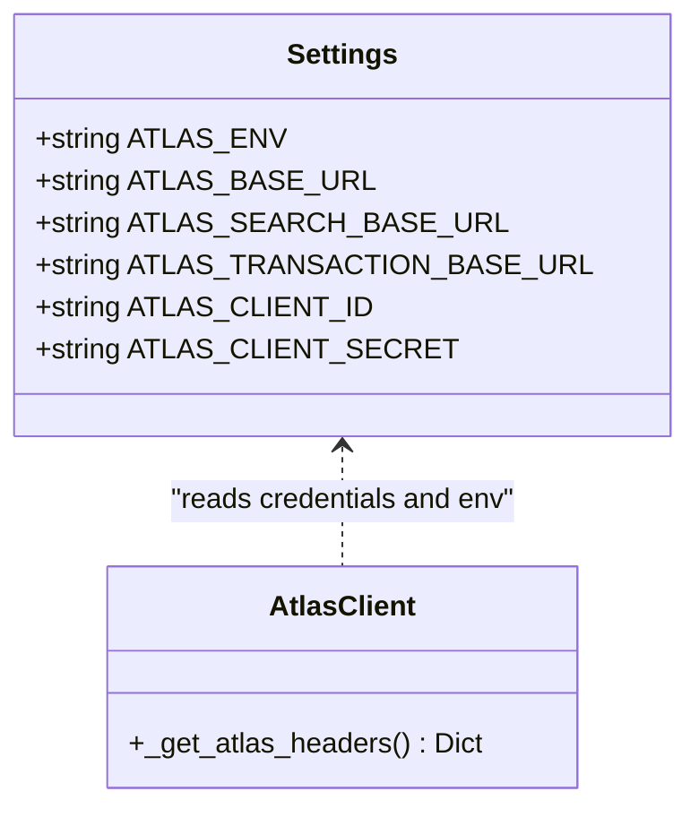
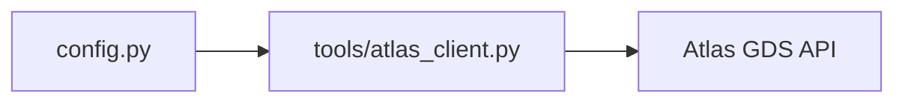

# Authentication & Request Headers

<cite>
**Referenced Files in This Document**
- [atlas_client.py](file://travel-recovery-os/backend/tools/atlas_client.py)
- [config.py](file://travel-recovery-os/backend/config.py)
- [SKILL.md](file://atlas-api-integration-advisor (2)/atlas-api-integration-advisor/SKILL.md)
- [common-issues.md](file://atlas-api-integration-advisor (2)/atlas-api-integration-advisor/references/common-issues.md)
- [run_production_smoke_test.py](file://travel-recovery-os/backend/run_production_smoke_test.py)
- [Atlas_UAT_Environment.json](file://Atlas_UAT_Environment (2).json)
</cite>

## Table of Contents
1. [Introduction](#introduction)
2. [Project Structure](#project-structure)
3. [Core Components](#core-components)
4. [Architecture Overview](#architecture-overview)
5. [Detailed Component Analysis](#detailed-component-analysis)
6. [Dependency Analysis](#dependency-analysis)
7. [Performance Considerations](#performance-considerations)
8. [Troubleshooting Guide](#troubleshooting-guide)
9. [Conclusion](#conclusion)
10. [Appendices](#appendices)

## Introduction
This document explains how the application authenticates to the Atlas GDS API and how request headers are formatted. It covers:
- Client ID and secret-based authentication via environment variables and settings
- Required HTTP headers for all requests, with special requirements for search endpoints
- Environment-specific configuration for sandbox vs production
- Security best practices for managing sensitive credentials
- Examples of properly formatted requests
- Common authentication errors and solutions
- Guidance for rotating or updating API credentials

## Project Structure
The authentication and header logic is implemented in a dedicated client module and configured through centralized settings. Supporting documentation provides official requirements and troubleshooting guidance.

**Diagram sources**
- [config.py:63-70](file://travel-recovery-os/backend/config.py#L63-L70)
- [atlas_client.py:38-48](file://travel-recovery-os/backend/tools/atlas_client.py#L38-L48)

**Section sources**
- [config.py:1-116](file://travel-recovery-os/backend/config.py#L1-L116)
- [atlas_client.py:1-67](file://travel-recovery-os/backend/tools/atlas_client.py#L1-L67)

## Core Components
- Settings model defines Atlas environment mode, base URLs, and credential keys used by the client.
- The Atlas client builds standardized request headers including Content-Type, Accept, Accept-Encoding, and the two custom authentication headers.
- Documentation specifies required headers and error behavior for missing or incorrect values.

Key responsibilities:
- Centralized configuration of environment and credentials
- Consistent header generation across all Atlas calls
- Alignment with official Atlas API requirements

**Section sources**
- [config.py:63-70](file://travel-recovery-os/backend/config.py#L63-L70)
- [atlas_client.py:38-48](file://travel-recovery-os/backend/tools/atlas_client.py#L38-L48)
- [SKILL.md:307-324](file://atlas-api-integration-advisor (2)/atlas-api-integration-advisor/SKILL.md#L307-L324)

## Architecture Overview
The client reads credentials from settings and attaches them to every outbound request. Production uses separate base URLs for search and transaction endpoints; sandbox uses a single base URL.

**Diagram sources**
- [config.py:63-70](file://travel-recovery-os/backend/config.py#L63-L70)
- [atlas_client.py:38-48](file://travel-recovery-os/backend/tools/atlas_client.py#L38-L48)
- [run_production_smoke_test.py:20-39](file://travel-recovery-os/backend/run_production_smoke_test.py#L20-L39)

## Detailed Component Analysis

### Header Generation and Credential Injection
- The client constructs a fixed set of headers for every request:
  - Content-Type: application/json
  - Accept: */*
  - Accept-Encoding: gzip
  - x-atlas-client-id: value from settings
  - x-atlas-client-secret: value from settings
- These headers ensure compatibility with Atlas’s expectations and enable compression for search responses.

**Diagram sources**
- [atlas_client.py:38-48](file://travel-recovery-os/backend/tools/atlas_client.py#L38-L48)
- [run_production_smoke_test.py:20-39](file://travel-recovery-os/backend/run_production_smoke_test.py#L20-L39)

**Section sources**
- [atlas_client.py:38-48](file://travel-recovery-os/backend/tools/atlas_client.py#L38-L48)
- [SKILL.md:307-324](file://atlas-api-integration-advisor (2)/atlas-api-integration-advisor/SKILL.md#L307-L324)

### Configuration Model and Environment-Specific Behavior
- ATLAS_ENV controls whether the system targets sandbox or production.
- ATLAS_BASE_URL defaults to the sandbox endpoint.
- In production, separate base URLs can be provided for search and transaction endpoints.
- Credentials are read from ATLAS_CLIENT_ID and ATLAS_CLIENT_SECRET.

**Diagram sources**
- [config.py:63-70](file://travel-recovery-os/backend/config.py#L63-L70)
- [atlas_client.py:38-48](file://travel-recovery-os/backend/tools/atlas_client.py#L38-L48)

**Section sources**
- [config.py:63-70](file://travel-recovery-os/backend/config.py#L63-L70)
- [SKILL.md:208-216](file://atlas-api-integration-advisor (2)/atlas-api-integration-advisor/SKILL.md#L208-L216)

### Example Requests with Authentication Headers
- All requests must include the five headers listed above.
- For search.do, Accept-Encoding: gzip is required; otherwise the API returns a specific status indicating the issue.
- A smoke test demonstrates building headers and selecting base URLs based on environment.

Example patterns (described):
- Search request:
  - Method: POST
  - Endpoint: {search_base}/search.do
  - Headers: Content-Type: application/json; Accept: */*; Accept-Encoding: gzip; x-atlas-client-id; x-atlas-client-secret
- Verify/Order/Pay requests:
  - Method: POST
  - Endpoint: {transaction_base}/{endpoint}.do
  - Headers: Same as above, except Accept-Encoding may not be required for non-search endpoints

**Section sources**
- [SKILL.md:307-324](file://atlas-api-integration-advisor (2)/atlas-api-integration-advisor/SKILL.md#L307-L324)
- [run_production_smoke_test.py:20-39](file://travel-recovery-os/backend/run_production_smoke_test.py#L20-L39)

### Credential Validation and Error Handling
- If credentials are incorrect or missing, the API responds with an authentication failure status.
- Missing headers (especially x-atlas-client-secret) can also trigger internal server error responses.
- For search.do without Accept-Encoding: gzip, a specific status indicates the header was omitted.

Common symptoms and resolutions:
- Authentication failure status: verify client ID and secret match the environment and account status
- Internal server error due to missing headers: ensure all required headers are present
- Search status indicating missing gzip header: add Accept-Encoding: gzip to search requests

**Section sources**
- [common-issues.md:11-19](file://atlas-api-integration-advisor (2)/atlas-api-integration-advisor/references/common-issues.md#L11-L19)
- [SKILL.md:307-324](file://atlas-api-integration-advisor (2)/atlas-api-integration-advisor/SKILL.md#L307-L324)

### Environment-Specific Configuration
- Sandbox:
  - Single base URL for all APIs
  - Use sandbox-generated AK/SK
- Production:
  - Separate base URLs for search and transaction endpoints
  - Use production AK/SK issued after account goes live
- Important: Do not mix sandbox credentials with production URLs or vice versa.

**Section sources**
- [SKILL.md:208-216](file://atlas-api-integration-advisor (2)/atlas-api-integration-advisor/SKILL.md#L208-L216)
- [config.py:63-70](file://travel-recovery-os/backend/config.py#L63-L70)

### Security Best Practices
- Store credentials in environment variables or secure secret stores; avoid hardcoding in source files.
- Use distinct credentials per environment (sandbox vs production).
- Rotate credentials periodically and immediately upon suspected compromise.
- Limit access to secrets at the process and repository level; do not commit secrets to version control.
- Validate that the correct base URLs are used for each environment before making calls.

[No sources needed since this section provides general guidance]

### Rotating or Updating API Credentials
Steps:
1. Obtain new AK/SK from your Atlas account manager or portal.
2. Update environment variables or secret store entries for ATLAS_CLIENT_ID and ATLAS_CLIENT_SECRET.
3. Restart services to pick up new settings.
4. Run a smoke test against the target environment to confirm successful authentication.
5. Monitor logs and responses for any authentication failures during the transition window.

**Section sources**
- [config.py:63-70](file://travel-recovery-os/backend/config.py#L63-L70)
- [run_production_smoke_test.py:20-39](file://travel-recovery-os/backend/run_production_smoke_test.py#L20-L39)

## Dependency Analysis
The client depends on centralized settings for credentials and environment selection. External dependencies include the Atlas GDS API endpoints.

**Diagram sources**
- [config.py:63-70](file://travel-recovery-os/backend/config.py#L63-L70)
- [atlas_client.py:38-48](file://travel-recovery-os/backend/tools/atlas_client.py#L38-L48)

**Section sources**
- [config.py:63-70](file://travel-recovery-os/backend/config.py#L63-L70)
- [atlas_client.py:38-48](file://travel-recovery-os/backend/tools/atlas_client.py#L38-L48)

## Performance Considerations
- Include Accept-Encoding: gzip for search requests to reduce payload size and improve performance.
- Ensure correct base URLs per environment to avoid unnecessary redirects or routing overhead.
- Implement retries and backoff for transient errors to minimize impact on throughput.

[No sources needed since this section provides general guidance]

## Troubleshooting Guide
Symptoms and fixes:
- Authentication failed status:
  - Cause: Incorrect or mismatched credentials
  - Fix: Verify client ID and secret match the environment and account activation status
- Internal server error due to missing headers:
  - Cause: Missing x-atlas-client-secret or other required headers
  - Fix: Add all required headers to every request
- Search status indicating missing gzip header:
  - Cause: Accept-Encoding: gzip not included for search.do
  - Fix: Add Accept-Encoding: gzip to search requests

Additional checks:
- Confirm environment mode and base URLs align with credentials
- Validate that requests use the correct base URL for search vs transaction endpoints

**Section sources**
- [common-issues.md:11-19](file://atlas-api-integration-advisor (2)/atlas-api-integration-advisor/references/common-issues.md#L11-L19)
- [SKILL.md:307-324](file://atlas-api-integration-advisor (2)/atlas-api-integration-advisor/SKILL.md#L307-L324)

## Conclusion
The application implements robust, environment-aware authentication to the Atlas GDS API using client ID and secret headers. By centralizing configuration and standardizing header generation, it ensures consistent behavior across sandbox and production. Following the recommended headers, environment separation, and security practices will help prevent common authentication issues and support reliable integrations.

[No sources needed since this section summarizes without analyzing specific files]

## Appendices

### Appendix A: Required Headers Summary
- Content-Type: application/json
- Accept: */*
- Accept-Encoding: gzip (required for search.do)
- x-atlas-client-id: API Access Key (AK)
- x-atlas-client-secret: API Secret Key (SK)

**Section sources**
- [SKILL.md:307-324](file://atlas-api-integration-advisor (2)/atlas-api-integration-advisor/SKILL.md#L307-L324)

### Appendix B: Environment Configuration Reference
- Sandbox:
  - Base URL: single domain for all APIs
  - Credentials: sandbox AK/SK
- Production:
  - Base URLs: separate domains for search and transaction
  - Credentials: production AK/SK

**Section sources**
- [SKILL.md:208-216](file://atlas-api-integration-advisor (2)/atlas-api-integration-advisor/SKILL.md#L208-L216)
- [config.py:63-70](file://travel-recovery-os/backend/config.py#L63-L70)

### Appendix C: Postman UAT Environment Variables
- client_id: maps to x-atlas-client-id
- client_secret: maps to x-atlas-client-secret
- Additional variables for currency, dates, and session tracking

**Section sources**
- [Atlas_UAT_Environment.json:1-62](file://Atlas_UAT_Environment (2).json#L1-L62)