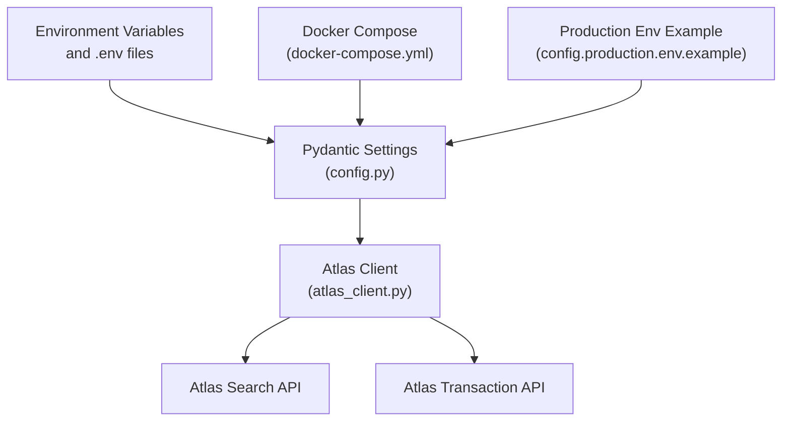
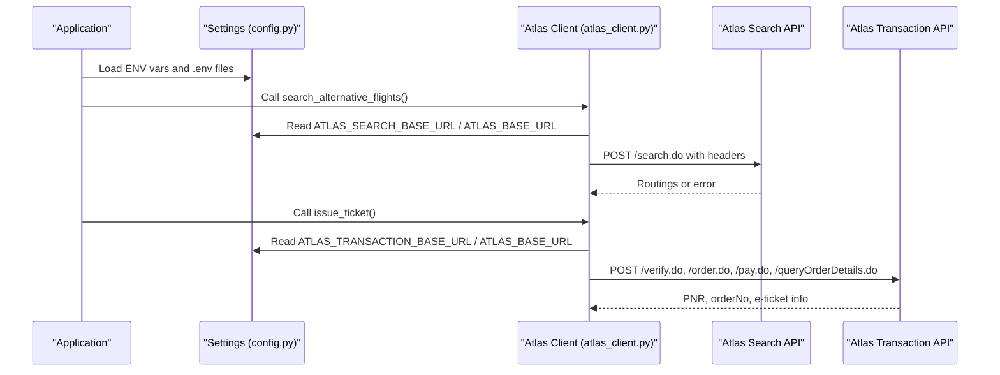
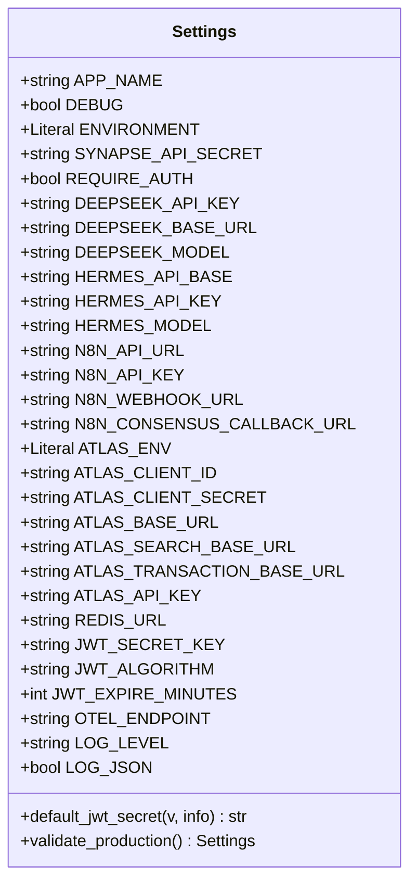
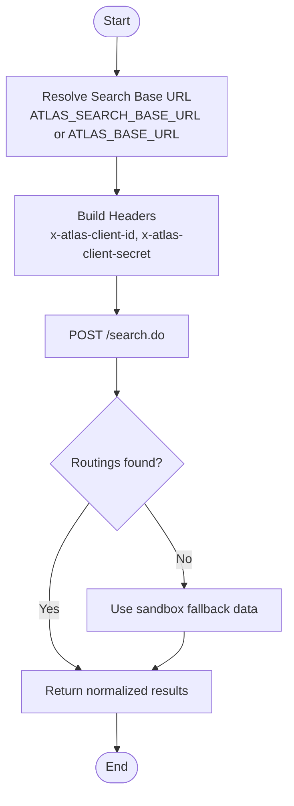
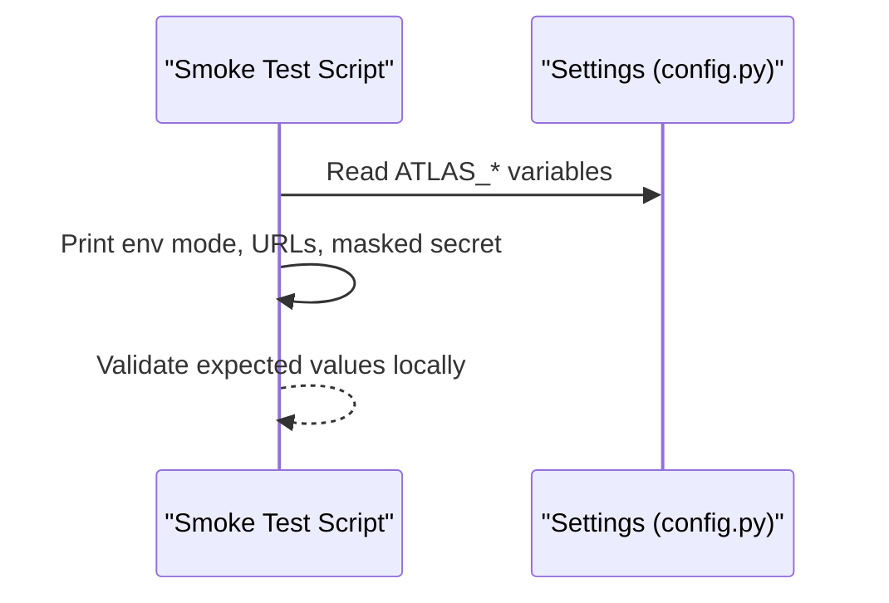
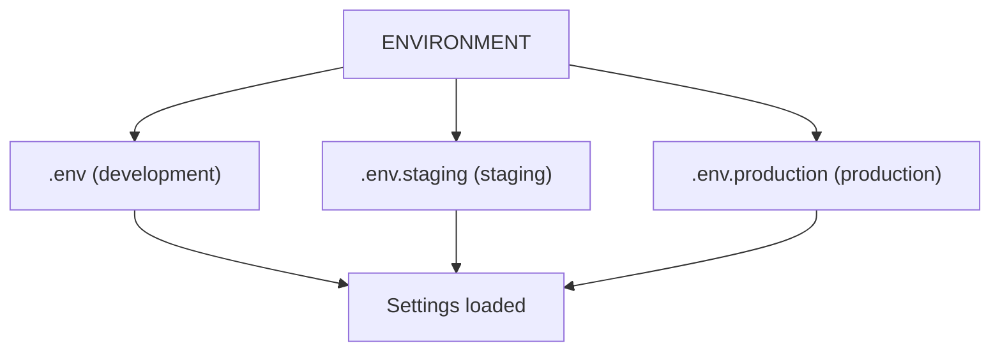
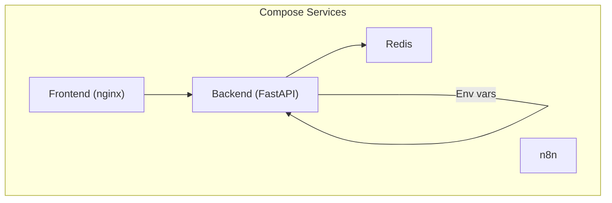
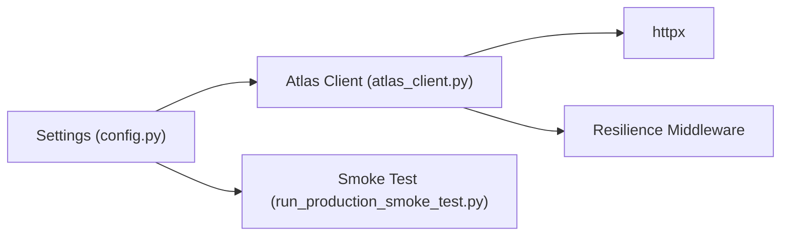

# Configuration & Environment Setup

<cite>
**Referenced Files in This Document**
- [config.py](file://travel-recovery-os/backend/config.py)
- [atlas_client.py](file://travel-recovery-os/backend/tools/atlas_client.py)
- [run_production_smoke_test.py](file://travel-recovery-os/backend/run_production_smoke_test.py)
- [config.production.env.example](file://travel-recovery-os/backend/config.production.env.example)
- [docker-compose.yml](file://travel-recovery-os/docker-compose.yml)
- [Dockerfile](file://travel-recovery-os/backend/Dockerfile)
- [SKILL.md](file://atlas-api-integration-advisor (2)/atlas-api-integration-advisor/SKILL.md)
</cite>

## Table of Contents
1. [Introduction](#introduction)
2. [Project Structure](#project-structure)
3. [Core Components](#core-components)
4. [Architecture Overview](#architecture-overview)
5. [Detailed Component Analysis](#detailed-component-analysis)
6. [Dependency Analysis](#dependency-analysis)
7. [Performance Considerations](#performance-considerations)
8. [Troubleshooting Guide](#troubleshooting-guide)
9. [Conclusion](#conclusion)
10. [Appendices](#appendices)

## Introduction
This document explains how the application configures and connects to Atlas GDS across environments, focusing on environment variables for base URLs and credentials, Pydantic-based settings validation, defaults, security considerations, Docker configuration, and troubleshooting. It clarifies the relationship between search and transaction base URLs and how to configure them for different Atlas environments (sandbox vs production).

## Project Structure
The relevant parts for Atlas configuration are:
- Backend settings and validation: [config.py](file://travel-recovery-os/backend/config.py)
- Atlas client implementation that uses settings: [atlas_client.py](file://travel-recovery-os/backend/tools/atlas_client.py)
- Production smoke test that prints configured endpoints and secrets safely: [run_production_smoke_test.py](file://travel-recovery-os/backend/run_production_smoke_test.py)
- Example production environment file: [config.production.env.example](file://travel-recovery-os/backend/config.production.env.example)
- Container orchestration and environment injection: [docker-compose.yml](file://travel-recovery-os/docker-compose.yml), [Dockerfile](file://travel-recovery-os/backend/Dockerfile)
- Atlas environment guidance (separate search/transaction domains): [SKILL.md](file://atlas-api-integration-advisor (2)/atlas-api-integration-advisor/SKILL.md)

**Diagram sources**
- [config.py:29-116](file://travel-recovery-os/backend/config.py#L29-L116)
- [atlas_client.py:38-117](file://travel-recovery-os/backend/tools/atlas_client.py#L38-L117)
- [docker-compose.yml:18-40](file://travel-recovery-os/docker-compose.yml#L18-L40)
- [config.production.env.example:30-33](file://travel-recovery-os/backend/config.production.env.example#L30-L33)

**Section sources**
- [config.py:20-37](file://travel-recovery-os/backend/config.py#L20-L37)
- [docker-compose.yml:18-40](file://travel-recovery-os/docker-compose.yml#L18-L40)

## Core Components
- Pydantic-based Settings class loads environment variables from profile-specific .env files and validates values at startup.
- Atlas client reads settings to build request headers and resolve base URLs for search and transaction operations.
- Production smoke test prints current configuration (with masked secrets) to verify correct setup before deployment.

Key configuration variables for Atlas:
- ATLAS_ENV: selects sandbox or production behavior.
- ATLAS_CLIENT_ID and ATLAS_CLIENT_SECRET: used as x-atlas-client-id and x-atlas-client-secret headers.
- ATLAS_BASE_URL: default fallback base URL when specific endpoints are not set.
- ATLAS_SEARCH_BASE_URL: optional override for search endpoints; if unset, falls back to ATLAS_BASE_URL.
- ATLAS_TRANSACTION_BASE_URL: optional override for transaction endpoints; if unset, falls back to ATLAS_BASE_URL.

Defaults and purposes:
- Sandbox defaults point to a single base URL for all APIs.
- Production typically requires separate base URLs for search and transaction; these should be provided explicitly via environment variables.

Security considerations:
- Never commit secrets to version control. Use environment variables or secret managers.
- The production example shows where to place keys; ensure they are injected securely at runtime.
- The smoke test masks client secrets when printing configuration.

**Section sources**
- [config.py:63-70](file://travel-recovery-os/backend/config.py#L63-L70)
- [atlas_client.py:38-48](file://travel-recovery-os/backend/tools/atlas_client.py#L38-L48)
- [atlas_client.py:82-117](file://travel-recovery-os/backend/tools/atlas_client.py#L82-L117)
- [run_production_smoke_test.py:15-39](file://travel-recovery-os/backend/run_production_smoke_test.py#L15-L39)
- [config.production.env.example:30-33](file://travel-recovery-os/backend/config.production.env.example#L30-L33)

## Architecture Overview
The application resolves Atlas endpoints based on settings:
- Search requests use ATLAS_SEARCH_BASE_URL if set; otherwise ATLAS_BASE_URL.
- Transaction requests use ATLAS_TRANSACTION_BASE_URL if set; otherwise ATLAS_BASE_URL.
- Headers include client ID and secret obtained from settings.

**Diagram sources**
- [atlas_client.py:82-117](file://travel-recovery-os/backend/tools/atlas_client.py#L82-L117)
- [atlas_client.py:222-331](file://travel-recovery-os/backend/tools/atlas_client.py#L222-L331)
- [config.py:29-116](file://travel-recovery-os/backend/config.py#L29-L116)

## Detailed Component Analysis

### Pydantic Settings and Validation
- Loads environment variables from profile-specific .env files determined by ENVIRONMENT.
- Provides defaults for Atlas sandbox and other services.
- Validates production mode by warning about missing or default-sensitive keys.

**Diagram sources**
- [config.py:29-116](file://travel-recovery-os/backend/config.py#L29-L116)

**Section sources**
- [config.py:20-37](file://travel-recovery-os/backend/config.py#L20-L37)
- [config.py:63-83](file://travel-recovery-os/backend/config.py#L63-L83)
- [config.py:85-113](file://travel-recovery-os/backend/config.py#L85-L113)

### Atlas Client Endpoint Resolution
- Search endpoint resolution:
  - Uses ATLAS_SEARCH_BASE_URL if present; otherwise falls back to ATLAS_BASE_URL.
  - Builds headers with client ID and secret from settings.
- Transaction endpoint resolution:
  - Uses ATLAS_TRANSACTION_BASE_URL if present; otherwise falls back to ATLAS_BASE_URL.
  - Executes Verify -> Order -> Pay -> Query sequence using resolved base URL.

**Diagram sources**
- [atlas_client.py:82-117](file://travel-recovery-os/backend/tools/atlas_client.py#L82-L117)
- [atlas_client.py:38-48](file://travel-recovery-os/backend/tools/atlas_client.py#L38-L48)

**Section sources**
- [atlas_client.py:82-117](file://travel-recovery-os/backend/tools/atlas_client.py#L82-L117)
- [atlas_client.py:222-331](file://travel-recovery-os/backend/tools/atlas_client.py#L222-L331)

### Production Smoke Test
- Prints current environment mode, search/transaction base URLs, and masked client secret to validate configuration prior to deployment.

**Diagram sources**
- [run_production_smoke_test.py:15-39](file://travel-recovery-os/backend/run_production_smoke_test.py#L15-L39)
- [config.py:63-70](file://travel-recovery-os/backend/config.py#L63-L70)

**Section sources**
- [run_production_smoke_test.py:15-39](file://travel-recovery-os/backend/run_production_smoke_test.py#L15-L39)

### Environment-Specific Configurations
- Development/Staging/Production profiles select different .env files automatically based on ENVIRONMENT.
- Production example file demonstrates required keys and recommended values for services including Atlas.

**Diagram sources**
- [config.py:20-26](file://travel-recovery-os/backend/config.py#L20-L26)
- [config.production.env.example:1-49](file://travel-recovery-os/backend/config.production.env.example#L1-L49)

**Section sources**
- [config.py:20-26](file://travel-recovery-os/backend/config.py#L20-L26)
- [config.production.env.example:1-49](file://travel-recovery-os/backend/config.production.env.example#L1-L49)

### Docker Configuration for Containerized Deployments
- docker-compose injects environment variables into the backend service and sets ENVIRONMENT to production.
- Dockerfile exposes ports and runs uvicorn with dynamic PORT support.

**Diagram sources**
- [docker-compose.yml:18-40](file://travel-recovery-os/docker-compose.yml#L18-L40)
- [Dockerfile:18-33](file://travel-recovery-os/backend/Dockerfile#L18-L33)

**Section sources**
- [docker-compose.yml:18-40](file://travel-recovery-os/docker-compose.yml#L18-L40)
- [Dockerfile:18-33](file://travel-recovery-os/backend/Dockerfile#L18-L33)

## Dependency Analysis
- Settings module is imported by the Atlas client to read configuration.
- The smoke test imports settings to print current configuration.
- Atlas client depends on httpx for HTTP calls and resilience middleware for retries/circuit breaking.

**Diagram sources**
- [atlas_client.py:18-34](file://travel-recovery-os/backend/tools/atlas_client.py#L18-L34)
- [run_production_smoke_test.py:1-13](file://travel-recovery-os/backend/run_production_smoke_test.py#L1-L13)
- [config.py:29-116](file://travel-recovery-os/backend/config.py#L29-L116)

**Section sources**
- [atlas_client.py:18-34](file://travel-recovery-os/backend/tools/atlas_client.py#L18-L34)
- [run_production_smoke_test.py:1-13](file://travel-recovery-os/backend/run_production_smoke_test.py#L1-L13)

## Performance Considerations
- In-memory TTL cache for flight searches reduces repeated network calls during short intervals.
- Retry with backoff and circuit breaker protect against transient failures and overload.
- Using gzip compression and strict Accept headers improves efficiency and compatibility.

[No sources needed since this section provides general guidance]

## Troubleshooting Guide
Common issues and resolutions:
- Authentication failures:
  - Ensure ATLAS_CLIENT_ID and ATLAS_CLIENT_SECRET match the environment (sandbox vs production).
  - Do not mix sandbox credentials with production URLs or vice versa.
- Incorrect base URLs:
  - For production, set ATLAS_SEARCH_BASE_URL and ATLAS_TRANSACTION_BASE_URL separately; do not rely on ATLAS_BASE_URL alone.
  - Confirm domains are correct per Atlas company information.
- Missing environment variables:
  - In production mode, missing or default-sensitive keys trigger warnings; set required variables before deploying.
- Docker environment:
  - Verify ENVIRONMENT is set to production in compose and that .env files are mounted correctly.
  - Check health endpoints and logs to confirm services start successfully.

Validation helpers:
- Use the production smoke test to print current configuration (with masked secrets) and verify URLs and environment mode.

**Section sources**
- [config.py:93-113](file://travel-recovery-os/backend/config.py#L93-L113)
- [atlas_client.py:38-48](file://travel-recovery-os/backend/tools/atlas_client.py#L38-L48)
- [atlas_client.py:82-117](file://travel-recovery-os/backend/tools/atlas_client.py#L82-L117)
- [run_production_smoke_test.py:15-39](file://travel-recovery-os/backend/run_production_smoke_test.py#L15-L39)
- [SKILL.md:208-217](file://atlas-api-integration-advisor (2)/atlas-api-integration-advisor/SKILL.md#L208-L217)

## Conclusion
The application uses Pydantic-based settings to manage Atlas GDS configuration across environments. Defaults target sandbox usage, while production requires explicit search and transaction base URLs and proper credentials. Docker and environment files streamline deployment, and the smoke test helps validate configuration before going live. Adhering to environment-specific credentials and URLs ensures reliable integration with Atlas services.

[No sources needed since this section summarizes without analyzing specific files]

## Appendices

### Environment Variables Reference (Atlas)
- ATLAS_ENV: Selects sandbox or production behavior.
- ATLAS_CLIENT_ID: Used in x-atlas-client-id header.
- ATLAS_CLIENT_SECRET: Used in x-atlas-client-secret header.
- ATLAS_BASE_URL: Default fallback base URL.
- ATLAS_SEARCH_BASE_URL: Optional override for search endpoints.
- ATLAS_TRANSACTION_BASE_URL: Optional override for transaction endpoints.

Notes:
- In sandbox, a single base URL typically serves all APIs.
- In production, search and transaction APIs may reside on different domains; set both overrides accordingly.

**Section sources**
- [config.py:63-70](file://travel-recovery-os/backend/config.py#L63-L70)
- [atlas_client.py:82-117](file://travel-recovery-os/backend/tools/atlas_client.py#L82-L117)
- [atlas_client.py:222-331](file://travel-recovery-os/backend/tools/atlas_client.py#L222-L331)
- [SKILL.md:208-217](file://atlas-api-integration-advisor (2)/atlas-api-integration-advisor/SKILL.md#L208-L217)

### Example Environment File (Production)
- See the production example file for required keys and recommended values for services including Atlas.

**Section sources**
- [config.production.env.example:30-33](file://travel-recovery-os/backend/config.production.env.example#L30-L33)

### Docker Deployment Notes
- Set ENVIRONMENT=production in compose and provide .env file with required variables.
- Ensure Redis and other dependencies are reachable within the container network.

**Section sources**
- [docker-compose.yml:18-40](file://travel-recovery-os/docker-compose.yml#L18-L40)
- [Dockerfile:18-33](file://travel-recovery-os/backend/Dockerfile#L18-L33)