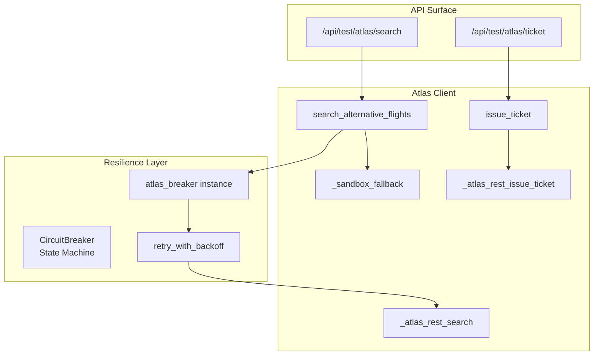
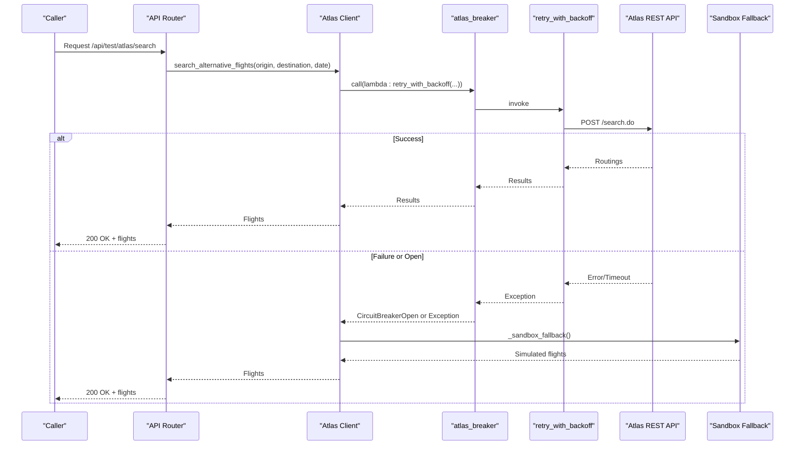
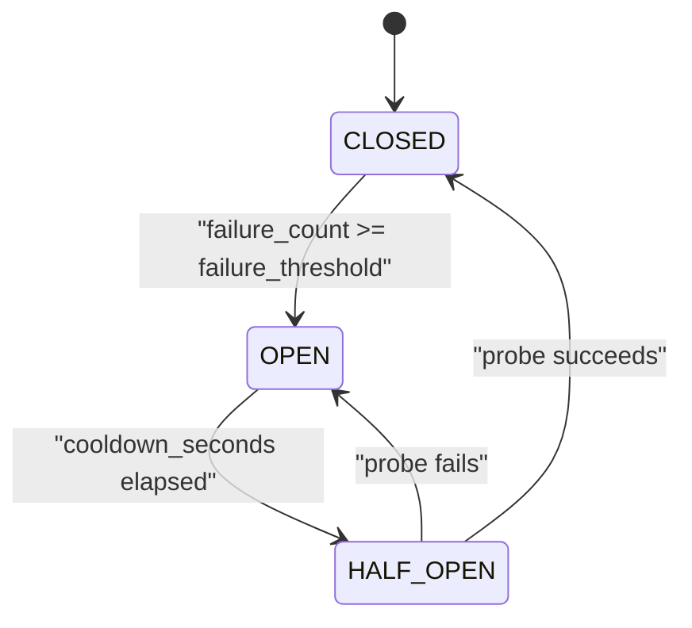
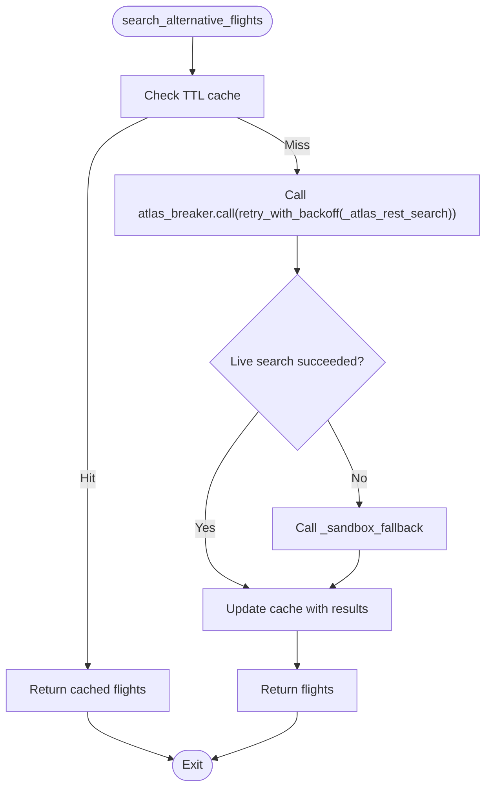
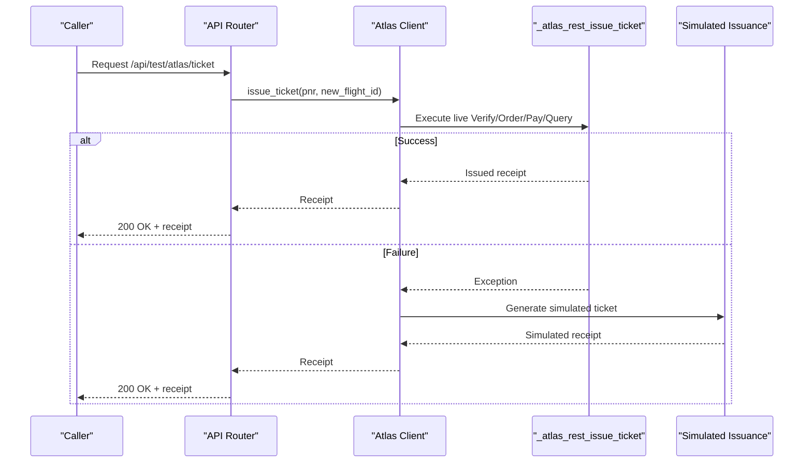
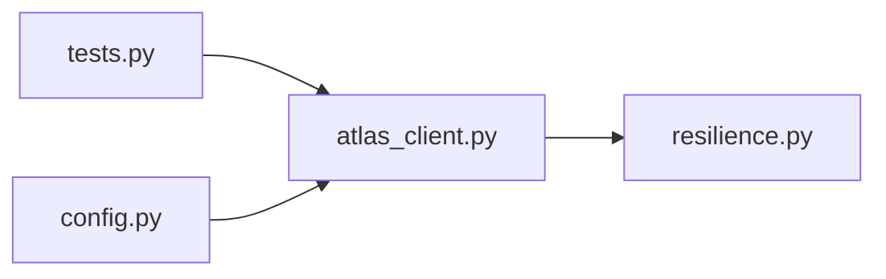

# Circuit Breaker Pattern

<cite>
**Referenced Files in This Document**
- [resilience.py](file://travel-recovery-os/backend/middleware/resilience.py)
- [atlas_client.py](file://travel-recovery-os/backend/tools/atlas_client.py)
- [tests.py](file://travel-recovery-os/backend/api/routers/tests.py)
- [config.py](file://travel-recovery-os/backend/config.py)
</cite>

## Table of Contents
1. [Introduction](#introduction)
2. [Project Structure](#project-structure)
3. [Core Components](#core-components)
4. [Architecture Overview](#architecture-overview)
5. [Detailed Component Analysis](#detailed-component-analysis)
6. [Dependency Analysis](#dependency-analysis)
7. [Performance Considerations](#performance-considerations)
8. [Troubleshooting Guide](#troubleshooting-guide)
9. [Conclusion](#conclusion)

## Introduction
This document explains the Atlas circuit breaker implementation using the atlas_breaker pattern. It covers how the system monitors Atlas API health, opens the circuit when failure thresholds are exceeded, and prevents cascading failures during outages by fast-failing requests. It also documents configuration parameters (failure threshold, recovery timeout, half-open behavior), illustrates state transitions (closed, open, half-open), and shows integration with search_alternative_flights and ticketing operations, including interception and fallback routing when the circuit is open.

## Project Structure
The circuit breaker is implemented as a reusable middleware component and integrated into Atlas client calls for flight search and ticketing. The key files involved are:
- Resilience middleware defining the circuit breaker state machine and preconfigured breakers
- Atlas client integrating the breaker around live API calls and providing sandbox fallbacks
- Test routes exposing endpoints that exercise the Atlas integration
- Configuration module providing Atlas environment settings used by the client

**Diagram sources**
- [resilience.py:86-244](file://travel-recovery-os/backend/middleware/resilience.py#L86-L244)
- [atlas_client.py:82-219](file://travel-recovery-os/backend/tools/atlas_client.py#L82-L219)
- [atlas_client.py:222-357](file://travel-recovery-os/backend/tools/atlas_client.py#L222-L357)
- [tests.py:19-40](file://travel-recovery-os/backend/api/routers/tests.py#L19-L40)

**Section sources**
- [resilience.py:86-244](file://travel-recovery-os/backend/middleware/resilience.py#L86-L244)
- [atlas_client.py:82-219](file://travel-recovery-os/backend/tools/atlas_client.py#L82-L219)
- [atlas_client.py:222-357](file://travel-recovery-os/backend/tools/atlas_client.py#L222-L357)
- [tests.py:19-40](file://travel-recovery-os/backend/api/routers/tests.py#L19-L40)

## Core Components
- CircuitBreaker: A three-state state machine (CLOSED, OPEN, HALF_OPEN) that tracks consecutive failures, enforces a cooldown period before allowing probe requests, and resets on success or reopens on failure.
- atlas_breaker: A preconfigured instance dedicated to Atlas API calls with specific failure_threshold and cooldown_seconds.
- retry_with_backoff: An async wrapper that retries failing operations with exponential backoff and jitter, reducing thundering herd effects.
- Atlas client functions:
  - search_alternative_flights: Wraps live Atlas REST search with atlas_breaker and falls back to a high-fidelity sandbox simulation when unavailable or empty.
  - issue_ticket: Attempts live ticketing via Atlas and falls back to a simulated issuance if the live call fails.

Key behaviors:
- CLOSED: Requests pass through; failures increment counters.
- OPEN: Requests fast-fail immediately with CircuitBreakerOpen after exceeding failure_threshold.
- HALF_OPEN: After cooldown_seconds, allow limited probe calls (half_open_max_calls). Success closes the circuit; failure reopens it.

**Section sources**
- [resilience.py:86-216](file://travel-recovery-os/backend/middleware/resilience.py#L86-L216)
- [resilience.py:221-244](file://travel-recovery-os/backend/middleware/resilience.py#L221-L244)
- [atlas_client.py:175-219](file://travel-recovery-os/backend/tools/atlas_client.py#L175-L219)
- [atlas_client.py:334-357](file://travel-recovery-os/backend/tools/atlas_client.py#L334-L357)

## Architecture Overview
The Atlas circuit breaker sits between callers and the Atlas REST endpoints. It intercepts outbound calls, applies resilience policies, and ensures that sustained failures do not overwhelm downstream systems. When the circuit is open, requests are short-circuited to prevent cascading failures. In search flows, a calibrated sandbox fallback provides realistic results even when the live API is down.

**Diagram sources**
- [tests.py:19-30](file://travel-recovery-os/backend/api/routers/tests.py#L19-L30)
- [atlas_client.py:175-219](file://travel-recovery-os/backend/tools/atlas_client.py#L175-L219)
- [resilience.py:148-182](file://travel-recovery-os/backend/middleware/resilience.py#L148-L182)
- [resilience.py:25-80](file://travel-recovery-os/backend/middleware/resilience.py#L25-L80)

## Detailed Component Analysis

### Circuit Breaker State Machine
The circuit breaker implements a robust state machine:
- CLOSED: Normal operation; failures counted until threshold reached.
- OPEN: Fast-fail all requests; transition to HALF_OPEN after cooldown.
- HALF_OPEN: Allow limited probes; success closes, failure reopens.

Configuration parameters:
- name: Identifier for logging and observability.
- failure_threshold: Number of consecutive failures to open the circuit.
- cooldown_seconds: Time to wait before transitioning from OPEN to HALF_OPEN.
- half_open_max_calls: Maximum probe calls allowed in HALF_OPEN state.

**Diagram sources**
- [resilience.py:86-216](file://travel-recovery-os/backend/middleware/resilience.py#L86-L216)

**Section sources**
- [resilience.py:86-216](file://travel-recovery-os/backend/middleware/resilience.py#L86-L216)

### Atlas Integration: Flight Search
The search flow integrates the circuit breaker around live Atlas REST calls and provides a high-fidelity sandbox fallback:
- Cache: In-memory TTL cache reduces repeated calls for identical queries.
- Breaker: atlas_breaker wraps retry_with_backoff around _atlas_rest_search.
- Fallback: If live search fails or returns no routings, _sandbox_fallback generates realistic flight options.

**Diagram sources**
- [atlas_client.py:175-219](file://travel-recovery-os/backend/tools/atlas_client.py#L175-L219)
- [atlas_client.py:360-425](file://travel-recovery-os/backend/tools/atlas_client.py#L360-L425)

**Section sources**
- [atlas_client.py:175-219](file://travel-recovery-os/backend/tools/atlas_client.py#L175-L219)
- [atlas_client.py:360-425](file://travel-recovery-os/backend/tools/atlas_client.py#L360-L425)

### Atlas Integration: Ticketing Operations
Ticketing attempts the full live lifecycle (Verify -> Order -> Pay -> Query) and falls back to a simulated issuance if any step fails:
- Live path: _atlas_rest_issue_ticket performs multi-step HTTP calls with error handling.
- Fallback path: issue_ticket catches exceptions and returns a high-fidelity simulated ticket receipt.

**Diagram sources**
- [tests.py:32-40](file://travel-recovery-os/backend/api/routers/tests.py#L32-L40)
- [atlas_client.py:222-357](file://travel-recovery-os/backend/tools/atlas_client.py#L222-L357)

**Section sources**
- [atlas_client.py:222-357](file://travel-recovery-os/backend/tools/atlas_client.py#L222-L357)
- [tests.py:32-40](file://travel-recovery-os/backend/api/routers/tests.py#L32-L40)

### Configuration Parameters
- Failure threshold: Controls sensitivity to failures before opening the circuit.
- Recovery timeout (cooldown): Determines how long the circuit remains open before probing.
- Half-open behavior: Limits probe concurrency to avoid overloading recovering services.
- Atlas environment settings: Base URLs, credentials, and environment flags influence client behavior.

Relevant configuration fields include:
- ATLAS_ENV, ATLAS_CLIENT_ID, ATLAS_CLIENT_SECRET, ATLAS_BASE_URL, ATLAS_SEARCH_BASE_URL, ATLAS_TRANSACTION_BASE_URL, ATLAS_API_KEY.

**Section sources**
- [resilience.py:116-126](file://travel-recovery-os/backend/middleware/resilience.py#L116-L126)
- [resilience.py:233-237](file://travel-recovery-os/backend/middleware/resilience.py#L233-L237)
- [config.py:63-71](file://travel-recovery-os/backend/config.py#L63-L71)

## Dependency Analysis
The circuit breaker depends on time-based state transitions and exception signaling. Atlas client depends on the breaker and retry utilities to protect external calls. API routers depend on client functions to expose resilient operations.

**Diagram sources**
- [tests.py:19-40](file://travel-recovery-os/backend/api/routers/tests.py#L19-L40)
- [atlas_client.py:175-219](file://travel-recovery-os/backend/tools/atlas_client.py#L175-L219)
- [resilience.py:86-244](file://travel-recovery-os/backend/middleware/resilience.py#L86-L244)
- [config.py:63-71](file://travel-recovery-os/backend/config.py#L63-L71)

**Section sources**
- [tests.py:19-40](file://travel-recovery-os/backend/api/routers/tests.py#L19-L40)
- [atlas_client.py:175-219](file://travel-recovery-os/backend/tools/atlas_client.py#L175-L219)
- [resilience.py:86-244](file://travel-recovery-os/backend/middleware/resilience.py#L86-L244)
- [config.py:63-71](file://travel-recovery-os/backend/config.py#L63-L71)

## Performance Considerations
- Circuit breaker reduces load on failing services by fast-failing requests, preventing resource exhaustion and cascading failures.
- Retry with backoff smooths transient errors and avoids thundering herds via jitter.
- In-memory TTL cache for flight searches improves latency for repeated queries within the TTL window.
- Half-open probe limits ensure only a controlled number of test requests reach the service during recovery.

[No sources needed since this section provides general guidance]

## Troubleshooting Guide
Common issues and diagnostics:
- Circuit always OPEN: Indicates persistent failures; check Atlas connectivity and logs for repeated errors. Review failure_threshold and cooldown_seconds settings.
- Frequent OPEN/HALF_OPEN oscillation: May indicate intermittent network issues; consider adjusting failure_threshold or cooldown_seconds.
- No flights returned: Could be due to empty live results; verify fallback logic and cache TTL. Ensure origin/destination/date formatting matches Atlas requirements.
- Ticketing failures: Confirm Verify/Order/Pay steps succeed; review error messages and consider enabling more detailed logging.

Operational tips:
- Monitor logs for circuit state transitions and failure counts.
- Use test endpoints to validate behavior under different conditions.
- Tune breaker parameters based on observed error rates and recovery times.

**Section sources**
- [resilience.py:134-216](file://travel-recovery-os/backend/middleware/resilience.py#L134-L216)
- [atlas_client.py:175-219](file://travel-recovery-os/backend/tools/atlas_client.py#L175-L219)
- [atlas_client.py:222-357](file://travel-recovery-os/backend/tools/atlas_client.py#L222-L357)
- [tests.py:19-40](file://travel-recovery-os/backend/api/routers/tests.py#L19-L40)

## Conclusion
The Atlas circuit breaker pattern provides robust protection against Atlas API outages by monitoring health, opening the circuit on excessive failures, and preventing cascading failures through fast-fail semantics. Combined with retry with backoff and a high-fidelity sandbox fallback, the system maintains availability and user experience during disruptions. Proper configuration of failure thresholds, recovery timeouts, and half-open behavior ensures balanced resilience without over-protecting healthy paths.

[No sources needed since this section summarizes without analyzing specific files]