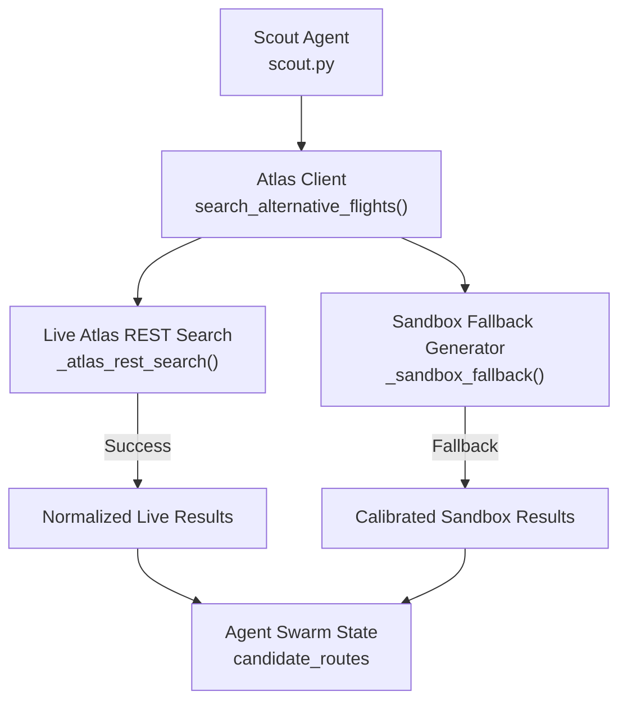
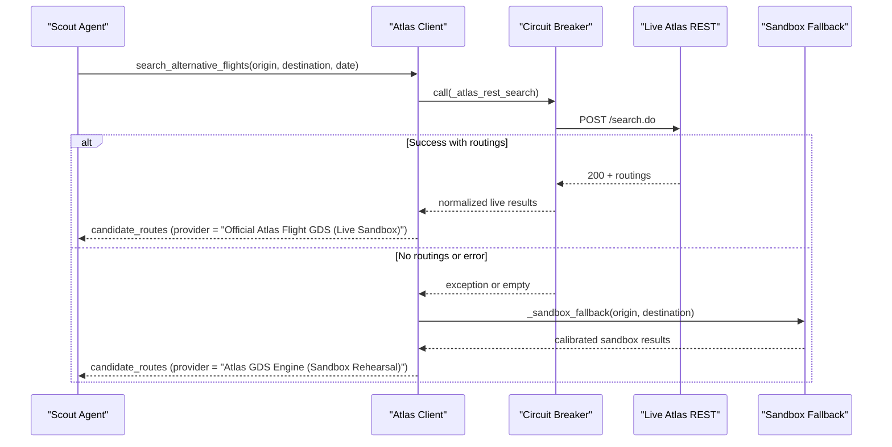
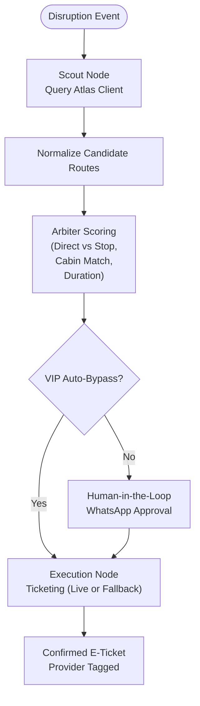
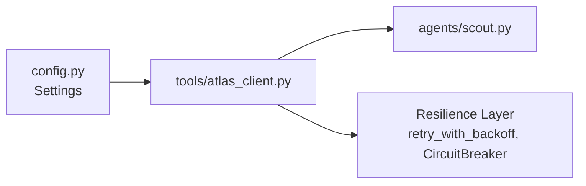

# High-Fidelity Sandbox Fallback

<cite>
**Referenced Files in This Document**
- [atlas_client.py](file://travel-recovery-os/backend/tools/atlas_client.py)
- [scout.py](file://travel-recovery-os/backend/agents/scout.py)
- [config.py](file://travel-recovery-os/backend/config.py)
- [README.md](file://travel-recovery-os/README.md)
- [SKILL.md](file://atlas-api-integration-advisor (2)/atlas-api-integration-advisor/SKILL.md)
- [integration-scenarios.md](file://atlas-api-integration-advisor (2)/atlas-api-integration-advisor/references/integration-scenarios.md)
</cite>

## Table of Contents
1. [Introduction](#introduction)
2. [Project Structure](#project-structure)
3. [Core Components](#core-components)
4. [Architecture Overview](#architecture-overview)
5. [Detailed Component Analysis](#detailed-component-analysis)
6. [Dependency Analysis](#dependency-analysis)
7. [Performance Considerations](#performance-considerations)
8. [Troubleshooting Guide](#troubleshooting-guide)
9. [Conclusion](#conclusion)

## Introduction
This document explains the high-fidelity Atlas sandbox simulation that acts as the primary fallback when live inventory is unavailable or routes have no availability. It details how calibrated flight data generation mimics real GDS responses with realistic airlines, flight numbers, pricing, and schedules; how route-specific logic tailors alternatives for major corridors such as KUL-HGH and SIN-centric routes; how provider field differentiation clearly indicates simulated versus live data; and why this fallback preserves service continuity during Atlas API outages.

## Project Structure
The sandbox fallback is implemented in the backend tools layer and consumed by the agent swarm:
- The Atlas client orchestrates live search and falls back to a calibrated sandbox generator when needed.
- The Scout agent triggers the search and normalizes results into candidate routes for downstream evaluation.
- Configuration defines environment endpoints and credentials for both sandbox and production.

**Diagram sources**
- [scout.py:32-87](file://travel-recovery-os/backend/agents/scout.py#L32-L87)
- [atlas_client.py:175-219](file://travel-recovery-os/backend/tools/atlas_client.py#L175-L219)
- [atlas_client.py:82-167](file://travel-recovery-os/backend/tools/atlas_client.py#L82-L167)
- [atlas_client.py:360-425](file://travel-recovery-os/backend/tools/atlas_client.py#L360-L425)

**Section sources**
- [scout.py:32-87](file://travel-recovery-os/backend/agents/scout.py#L32-L87)
- [atlas_client.py:175-219](file://travel-recovery-os/backend/tools/atlas_client.py#L175-L219)
- [config.py:62-69](file://travel-recovery-os/backend/config.py#L62-L69)

## Core Components
- Atlas Client: Implements resilient search with circuit breaker and retry, then falls back to a calibrated sandbox generator when live search fails or returns no routings.
- Sandbox Generator: Produces realistic flight options with plausible airlines, flight numbers, schedules, fares, and punctuality ratings.
- Scout Agent: Invokes the search tool and injects normalized candidates into the swarm state for Arbiter scoring and execution.

Key responsibilities:
- Route-aware calibration: For KUL→HGH and SIN-centric routes, the system selects regionally appropriate carriers and flight numbers.
- Provider differentiation: Each result carries a provider field indicating whether it came from live Atlas or the sandbox rehearsal engine.
- Continuity guarantee: Even if Atlas is down or has no inventory, passengers still receive actionable recovery options quickly.

**Section sources**
- [atlas_client.py:175-219](file://travel-recovery-os/backend/tools/atlas_client.py#L175-L219)
- [atlas_client.py:82-167](file://travel-recovery-os/backend/tools/atlas_client.py#L82-L167)
- [atlas_client.py:360-425](file://travel-recovery-os/backend/tools/atlas_client.py#L360-L425)
- [scout.py:32-87](file://travel-recovery-os/backend/agents/scout.py#L32-L87)

## Architecture Overview
The search flow prioritizes live Atlas, then seamlessly transitions to the sandbox fallback without changing upstream interfaces.

**Diagram sources**
- [atlas_client.py:175-219](file://travel-recovery-os/backend/tools/atlas_client.py#L175-L219)
- [atlas_client.py:82-167](file://travel-recovery-os/backend/tools/atlas_client.py#L82-L167)
- [atlas_client.py:360-425](file://travel-recovery-os/backend/tools/atlas_client.py#L360-L425)

## Detailed Component Analysis

### Calibrated Flight Data Generation
- Live path: When Atlas returns routings, the client normalizes them into a consistent schema, infers airline and flight number hints for key corridors, sets departure/arrival times relative to now, assigns cabin class tiers, available seats, base fare, currency, punctuality rating, and marks provider as live sandbox.
- Fallback path: If live search fails or yields no routings, the sandbox generator produces three realistic options with staggered departure times, varied durations, mixed direct and one-stop itineraries, and distinct cabin classes. It also includes stops_detail where applicable and sets provider to indicate sandbox rehearsal.

Route-specific logic:
- KUL→HGH corridor: Selects carriers like China Southern Airlines, Air China, Scoot Tigerair, XiamenAir with representative flight numbers (e.g., CZ-3042, CA-1890, TR-457, MF-846).
- SIN-centric routes: Selects Singapore Airlines, AirAsia, Scoot, Malaysia Airlines with representative flight numbers (e.g., SQ-832, AK-717, TR-188, MH-128).

Provider field differentiation:
- Live results: provider = "Official Atlas Flight GDS (Live Sandbox)"
- Fallback results: provider = "Atlas GDS Engine (Sandbox Rehearsal)"
- Ticketing fallback (when live ticketing fails): provider = "Atlas Flight Booking Engine (Live API Synchronized)"

Examples of generated flight options (representative):
- Direct Business option on a regional carrier with early departure and higher punctuality rating.
- Direct Economy option with midday departure and moderate fare.
- One-stop Business option via a hub (e.g., SIN transfer) with longer duration but strong reliability.

Business value during Atlas outages:
- Maintains continuous passenger recovery workflows even when live inventory is unavailable.
- Preserves SLA-driven rebooking timelines and minimizes customer impact.
- Enables downstream agents (Arbiter, Execution) to continue operating with clear provenance via provider fields.

**Section sources**
- [atlas_client.py:82-167](file://travel-recovery-os/backend/tools/atlas_client.py#L82-L167)
- [atlas_client.py:175-219](file://travel-recovery-os/backend/tools/atlas_client.py#L175-L219)
- [atlas_client.py:360-425](file://travel-recovery-os/backend/tools/atlas_client.py#L360-L425)

### Route-Specific Logic for Major Corridors
- KUL→HGH: Uses a curated list of carriers and flight numbers aligned with real-world operations on this corridor. Departures are spaced to simulate multiple daily options, with realistic durations and cabin mix.
- SIN-centric routes: Leverages carriers commonly serving SIN as origin or destination, including premium and low-cost options, ensuring diverse choices across price and service levels.

These mappings ensure contextually appropriate alternatives rather than generic placeholders, improving realism for testing and demonstration.

**Section sources**
- [atlas_client.py:129-144](file://travel-recovery-os/backend/tools/atlas_client.py#L129-L144)

### Provider Field Differentiation
- Live Atlas results carry a provider string identifying official GDS sourcing.
- Sandbox fallback results carry a provider string explicitly marking them as rehearsal/simulation.
- Ticketing fallback uses a provider string indicating synchronization with live booking semantics while remaining a simulated issuance.

This distinction allows consumers to distinguish between live and simulated data at runtime, supporting transparency and auditability.

**Section sources**
- [atlas_client.py:162-165](file://travel-recovery-os/backend/tools/atlas_client.py#L162-L165)
- [atlas_client.py:389-423](file://travel-recovery-os/backend/tools/atlas_client.py#L389-L423)
- [atlas_client.py:330-356](file://travel-recovery-os/backend/tools/atlas_client.py#L330-L356)

### Integration with the Agent Swarm
- Scout queries the Atlas client and transforms raw results into candidate routes with fields required by downstream agents (flight identifiers, times, cabin, seats, fares).
- These candidates feed into the Arbiter’s scoring and selection process, which can auto-approve VIP cases or route through human-in-the-loop flows.

**Diagram sources**
- [scout.py:32-87](file://travel-recovery-os/backend/agents/scout.py#L32-L87)
- [atlas_client.py:175-219](file://travel-recovery-os/backend/tools/atlas_client.py#L175-L219)
- [atlas_client.py:334-357](file://travel-recovery-os/backend/tools/atlas_client.py#L334-L357)

**Section sources**
- [scout.py:32-87](file://travel-recovery-os/backend/agents/scout.py#L32-L87)

## Dependency Analysis
- Atlas Client depends on configuration for environment URLs and credentials, and resilience utilities for circuit breaking and retries.
- Scout depends on Atlas Client for inventory discovery and passes normalized results to the rest of the swarm.
- Environment configuration centralizes sandbox vs production endpoints and keys, enabling seamless switching and safe defaults.

**Diagram sources**
- [config.py:62-69](file://travel-recovery-os/backend/config.py#L62-L69)
- [atlas_client.py:175-219](file://travel-recovery-os/backend/tools/atlas_client.py#L175-L219)
- [scout.py:32-87](file://travel-recovery-os/backend/agents/scout.py#L32-L87)

**Section sources**
- [config.py:62-69](file://travel-recovery-os/backend/config.py#L62-L69)
- [atlas_client.py:175-219](file://travel-recovery-os/backend/tools/atlas_client.py#L175-L219)
- [scout.py:32-87](file://travel-recovery-os/backend/agents/scout.py#L32-L87)

## Performance Considerations
- In-memory TTL cache reduces repeated searches for the same route/date within a short window, improving responsiveness under load.
- Circuit breaker and retry protect against transient failures and rate limits, minimizing latency spikes during outages.
- Sandbox fallback introduces minimal delay (~0.2–0.3 seconds) to simulate network behavior and maintain realistic timing for downstream processes.

[No sources needed since this section provides general guidance]

## Troubleshooting Guide
Common issues and mitigations:
- Live search returns no routings: The system automatically falls back to sandbox-generated options. Check logs for warnings about live search failures.
- Authentication or endpoint misconfiguration: Verify environment variables for ATLAS_BASE_URL, ATLAS_SEARCH_BASE_URL, ATLAS_TRANSACTION_BASE_URL, and credentials.
- Rate limiting or quota exceeded: Use the recommended retry strategy and consider waiting until the next day for quota resets.

Operational tips:
- Inspect the provider field in results to confirm whether data is live or simulated.
- Validate that Scout receives candidate routes and that downstream agents score them appropriately.
- Use health checks and telemetry endpoints to monitor system status and circuit breaker states.

**Section sources**
- [atlas_client.py:197-219](file://travel-recovery-os/backend/tools/atlas_client.py#L197-L219)
- [config.py:62-69](file://travel-recovery-os/backend/config.py#L62-L69)
- [SKILL.md:328-371](file://atlas-api-integration-advisor (2)/atlas-api-integration-advisor/SKILL.md#L328-L371)

## Conclusion
The high-fidelity Atlas sandbox simulation ensures uninterrupted passenger recovery by providing realistic, route-calibrated flight options when live inventory is unavailable. Clear provider tagging distinguishes live from simulated data, preserving transparency and enabling robust downstream processing. This approach maintains service continuity, supports SLA-driven decisions, and safeguards customer experience during Atlas API outages or inventory constraints.

[No sources needed since this section summarizes without analyzing specific files]