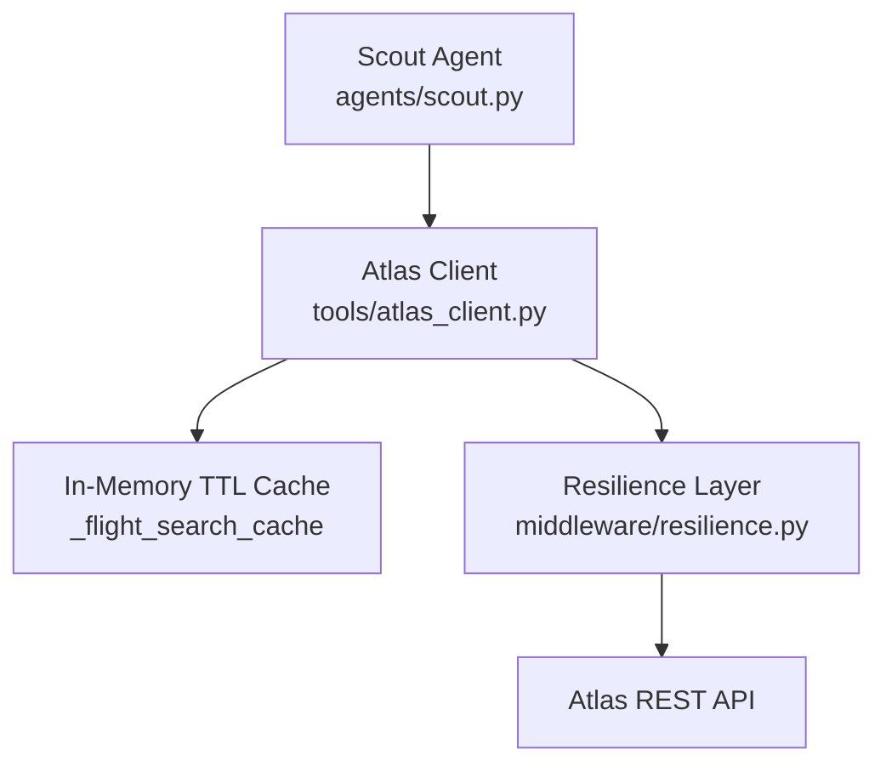
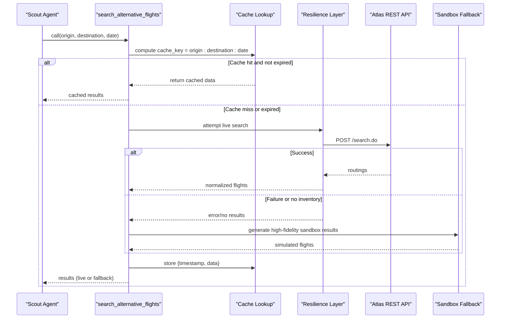
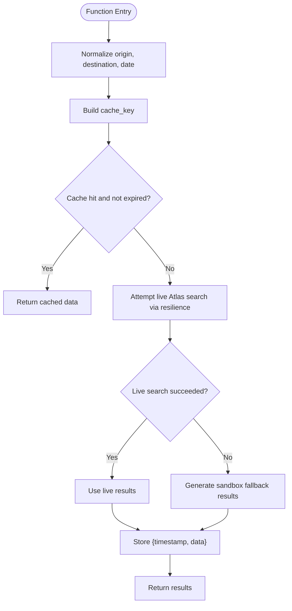
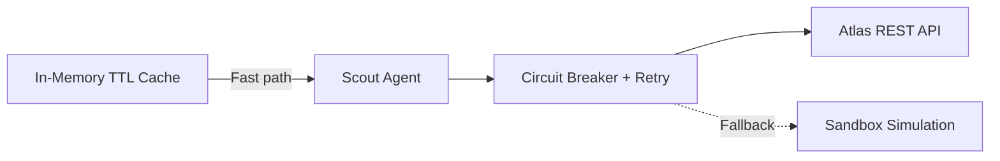
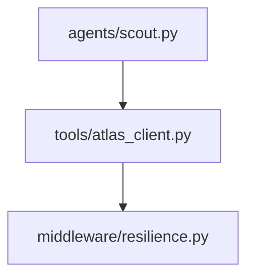

# In-Memory Caching System

<cite>
**Referenced Files in This Document**
- [atlas_client.py](file://travel-recovery-os/backend/tools/atlas_client.py)
- [resilience.py](file://travel-recovery-os/backend/middleware/resilience.py)
- [scout.py](file://travel-recovery-os/backend/agents/scout.py)
</cite>

## Table of Contents
1. [Introduction](#introduction)
2. [Project Structure](#project-structure)
3. [Core Components](#core-components)
4. [Architecture Overview](#architecture-overview)
5. [Detailed Component Analysis](#detailed-component-analysis)
6. [Dependency Analysis](#dependency-analysis)
7. [Performance Considerations](#performance-considerations)
8. [Troubleshooting Guide](#troubleshooting-guide)
9. [Conclusion](#conclusion)

## Introduction
This document explains the in-memory TTL caching system for flight search results used by the Atlas integration client. It covers how cache keys are generated from origin, destination, and date; how a 5-minute TTL expiration is enforced via timestamp tracking; and how repeated searches return cached results instantly. It also documents thread-safety considerations, cache invalidation behavior, memory management implications, performance benefits under high-frequency search workloads, and how caching integrates with the resilience strategy to reduce load on the Atlas API.

## Project Structure
The caching logic resides in the Atlas client tool that wraps live API calls and provides a fast path for repeat queries. The Scout agent consumes this tool during route discovery, while resilience middleware protects external calls behind retries and circuit breaking.

**Diagram sources**
- [scout.py:32-47](file://travel-recovery-os/backend/agents/scout.py#L32-L47)
- [atlas_client.py:170-219](file://travel-recovery-os/backend/tools/atlas_client.py#L170-L219)
- [resilience.py:233-237](file://travel-recovery-os/backend/middleware/resilience.py#L233-L237)

**Section sources**
- [scout.py:32-47](file://travel-recovery-os/backend/agents/scout.py#L32-L47)
- [atlas_client.py:170-219](file://travel-recovery-os/backend/tools/atlas_client.py#L170-L219)
- [resilience.py:233-237](file://travel-recovery-os/backend/middleware/resilience.py#L233-L237)

## Core Components
- In-memory cache storage keyed by normalized origin-destination-date triplets, storing both data and a timestamp for TTL enforcement.
- A 5-minute TTL constant controlling freshness.
- A search function that checks the cache first, performs resilient external calls when needed, and updates the cache with fresh results.
- Integration with resilience middleware (circuit breaker and retry) around external calls to protect against outages and reduce unnecessary traffic.

Key behaviors:
- Cache key normalization ensures consistent lookups regardless of input casing or extra time components.
- On cache hit within TTL, the stored result list is returned immediately without calling external APIs.
- On cache miss or expired entry, the system attempts a live Atlas search wrapped in resilience patterns; if unavailable or empty, it falls back to a calibrated sandbox simulation.
- After obtaining results (live or fallback), the cache is updated with current timestamp and data.

**Section sources**
- [atlas_client.py:170-219](file://travel-recovery-os/backend/tools/atlas_client.py#L170-L219)
- [resilience.py:233-237](file://travel-recovery-os/backend/middleware/resilience.py#L233-L237)

## Architecture Overview
The search flow combines caching and resilience to minimize latency and external load:

**Diagram sources**
- [atlas_client.py:175-219](file://travel-recovery-os/backend/tools/atlas_client.py#L175-L219)
- [resilience.py:233-237](file://travel-recovery-os/backend/middleware/resilience.py#L233-L237)

## Detailed Component Analysis

### Cache Key Generation Strategy
- Inputs are normalized:
  - Origin and destination are uppercased.
  - Date is trimmed to the date portion only (ignoring any time component).
- The cache key is a composite string of the form "origin:destination:date".
- This deterministic key ensures that identical search parameters map to the same cache entry, enabling instant retrieval on repeats.

Why this matters:
- Prevents duplicate network calls for the same route/date.
- Simplifies TTL checks since each key maps to exactly one timestamped result set.

**Section sources**
- [atlas_client.py:186-191](file://travel-recovery-os/backend/tools/atlas_client.py#L186-L191)

### TTL Expiration Mechanism
- A global constant defines a 5-minute TTL window.
- Each cached entry stores a timestamp indicating when it was created.
- On lookup, the current timestamp is compared to the stored timestamp; if the difference is less than the TTL, the entry is considered valid and returned.
- If expired or missing, the system proceeds to fetch fresh results.

Operational impact:
- Ensures results remain reasonably fresh while avoiding frequent API calls.
- Provides predictable staleness bounds for downstream consumers.

**Section sources**
- [atlas_client.py:171-172](file://travel-recovery-os/backend/tools/atlas_client.py#L171-L172)
- [atlas_client.py:191-195](file://travel-recovery-os/backend/tools/atlas_client.py#L191-L195)

### Thread-Safe Access Patterns
- The cache is a module-level dictionary accessed from an async function.
- Python’s asyncio model runs coroutines concurrently within a single event loop; dictionary operations are atomic at the interpreter level for simple reads/writes.
- There is no explicit lock around cache access in this implementation. For typical single-process async usage, this is acceptable for read-heavy, low-contention scenarios.
- If multiple processes or threads were to share this cache, additional synchronization would be required.

Recommendations:
- Keep the process single-threaded for this cache to avoid race conditions.
- If scaling to multiple workers, consider a shared store (e.g., Redis) with proper locking semantics.

**Section sources**
- [atlas_client.py:170-219](file://travel-recovery-os/backend/tools/atlas_client.py#L170-L219)

### Data Storage Structure
- The cache stores entries mapping a string key to a dictionary containing:
  - timestamp: numeric time value recorded at creation.
  - data: the list of normalized flight results.
- On cache hit, a copy of the stored list is returned to prevent accidental mutation of cached data.

Benefits:
- Simple structure minimizes overhead.
- Timestamp enables straightforward TTL checks without background cleanup tasks.

**Section sources**
- [atlas_client.py:170-172](file://travel-recovery-os/backend/tools/atlas_client.py#L170-L172)
- [atlas_client.py:192-195](file://travel-recovery-os/backend/tools/atlas_client.py#L192-L195)
- [atlas_client.py:215-218](file://travel-recovery-os/backend/tools/atlas_client.py#L215-L218)

### Search Flow and Cache Integration
- The search function normalizes inputs, computes the cache key, and checks for a valid cached entry.
- On cache miss/expiry, it attempts a live Atlas search through the resilience layer (retry + circuit breaker).
- If the live search fails or returns no results, it falls back to a high-fidelity sandbox simulation.
- Results are then cached with the current timestamp before returning.

**Diagram sources**
- [atlas_client.py:175-219](file://travel-recovery-os/backend/tools/atlas_client.py#L175-L219)
- [resilience.py:233-237](file://travel-recovery-os/backend/middleware/resilience.py#L233-L237)

**Section sources**
- [atlas_client.py:175-219](file://travel-recovery-os/backend/tools/atlas_client.py#L175-L219)

### Cache Hit/Miss Scenarios
- Cache hit: Repeated searches for the same origin-destination-date within 5 minutes return instantly from memory, bypassing network calls.
- Cache miss: First-time or expired searches trigger a live Atlas call; if successful, results are cached. If unsuccessful or empty, sandbox results are cached instead.
- Expired entry: After 5 minutes, subsequent requests re-fetch fresh data.

Practical example:
- Multiple rapid queries for KUL to HGH on a specific date will yield sub-millisecond responses after the first successful search.

**Section sources**
- [atlas_client.py:186-195](file://travel-recovery-os/backend/tools/atlas_client.py#L186-L195)
- [atlas_client.py:211-219](file://travel-recovery-os/backend/tools/atlas_client.py#L211-L219)

### Integration with Resilience Strategy
- External calls are wrapped with a circuit breaker and retry mechanism to handle transient failures and reduce pressure on Atlas during outages.
- When the circuit breaker is open or retries fail, the system falls back to sandbox results, ensuring continuity.
- Caching complements resilience by reducing the number of external calls even when the system is healthy, further lowering load.

**Diagram sources**
- [resilience.py:233-237](file://travel-recovery-os/backend/middleware/resilience.py#L233-L237)
- [atlas_client.py:197-219](file://travel-recovery-os/backend/tools/atlas_client.py#L197-L219)

**Section sources**
- [resilience.py:233-237](file://travel-recovery-os/backend/middleware/resilience.py#L233-L237)
- [atlas_client.py:197-219](file://travel-recovery-os/backend/tools/atlas_client.py#L197-L219)

## Dependency Analysis
- The Scout agent depends on the Atlas client’s search function to obtain candidate routes.
- The Atlas client depends on resilience middleware for robust external calls.
- The cache is internal to the Atlas client and does not expose explicit interfaces beyond the search function.

**Diagram sources**
- [scout.py:32-47](file://travel-recovery-os/backend/agents/scout.py#L32-L47)
- [atlas_client.py:170-219](file://travel-recovery-os/backend/tools/atlas_client.py#L170-L219)
- [resilience.py:233-237](file://travel-recovery-os/backend/middleware/resilience.py#L233-L237)

**Section sources**
- [scout.py:32-47](file://travel-recovery-os/backend/agents/scout.py#L32-L47)
- [atlas_client.py:170-219](file://travel-recovery-os/backend/tools/atlas_client.py#L170-L219)
- [resilience.py:233-237](file://travel-recovery-os/backend/middleware/resilience.py#L233-L237)

## Performance Considerations
- Latency reduction: Cache hits eliminate network round-trips, providing near-instant responses for repeated queries.
- Reduced external load: Fewer Atlas API calls lower bandwidth and processing costs, especially under high-frequency search patterns.
- Memory footprint: Entries persist for up to 5 minutes per unique key; memory grows with the number of distinct origin-destination-date combinations.
- CPU overhead: Minimal—simple dictionary lookups and timestamp comparisons.
- Scalability: Single-process design is efficient; multi-process deployments may require distributed caching to share state across workers.

Optimization opportunities:
- Periodic eviction of stale entries to bound memory growth.
- Bounding the maximum number of cache entries to prevent unbounded growth.
- Using a concurrent-safe cache structure if running in multi-threaded contexts.

[No sources needed since this section provides general guidance]

## Troubleshooting Guide
Common issues and diagnostics:
- Unexpected cache misses:
  - Verify that origin and destination are normalized consistently (uppercase).
  - Ensure date strings are parsed to date-only format before key generation.
- Stale results:
  - Confirm TTL is appropriate for your use case; adjust if more frequent refreshes are needed.
- High memory usage:
  - Monitor the number of unique keys; consider adding eviction policies or size limits.
- Concurrency anomalies:
  - If running in multiple processes, ensure each process maintains its own cache or switch to a shared store.

Validation steps:
- Inspect cache key construction and timestamp comparison logic.
- Log cache hit/miss events to understand query patterns.
- Measure response times to confirm cache effectiveness.

**Section sources**
- [atlas_client.py:186-195](file://travel-recovery-os/backend/tools/atlas_client.py#L186-L195)
- [atlas_client.py:215-219](file://travel-recovery-os/backend/tools/atlas_client.py#L215-L219)

## Conclusion
The in-memory TTL caching system significantly improves performance and reduces Atlas API load by serving repeated flight searches from a fast local store with a 5-minute freshness window. It integrates seamlessly with resilience mechanisms to maintain availability under adverse conditions. While simple and effective for single-process async workloads, future enhancements could include bounded cache sizes, periodic cleanup, and cross-process sharing for multi-worker deployments.

[No sources needed since this section summarizes without analyzing specific files]