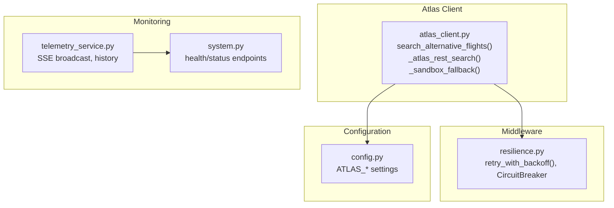
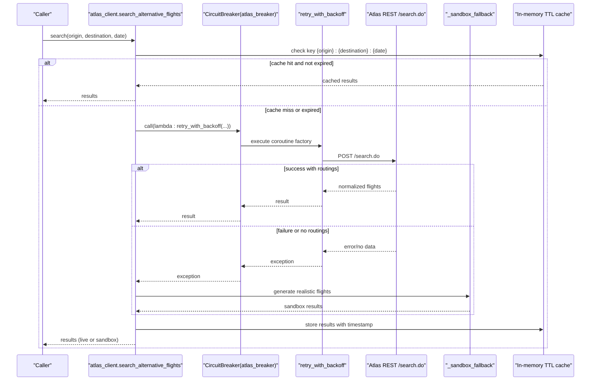
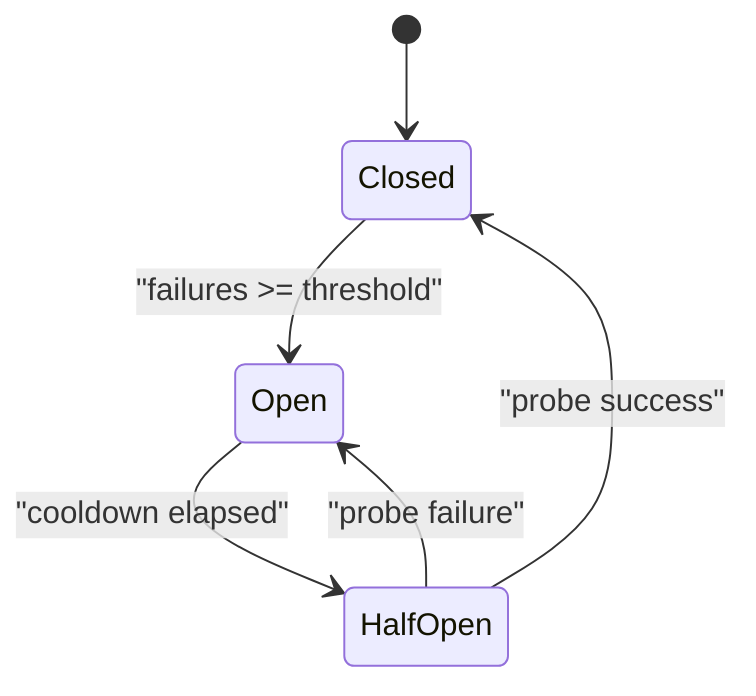
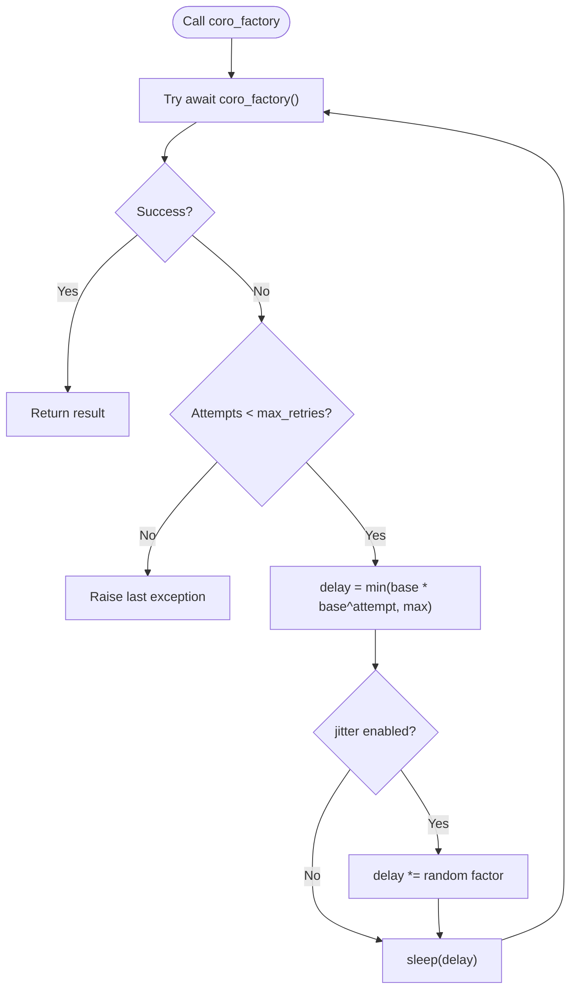
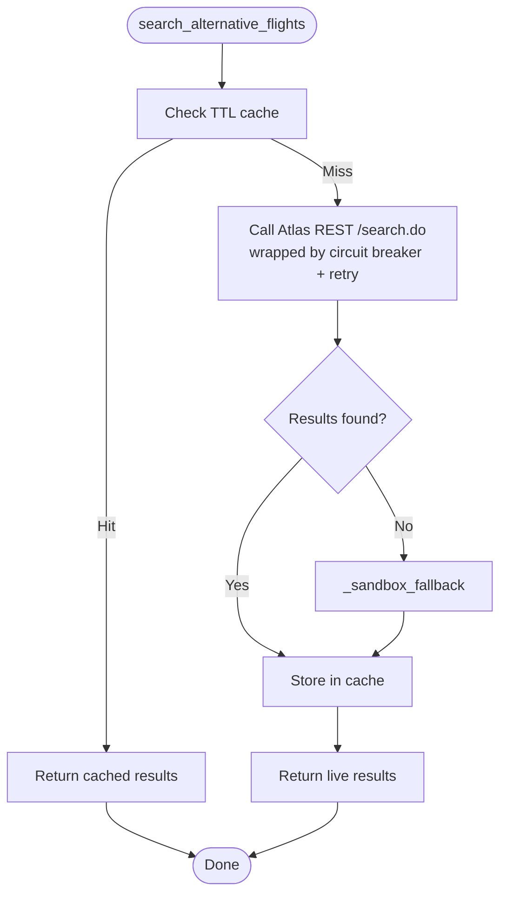
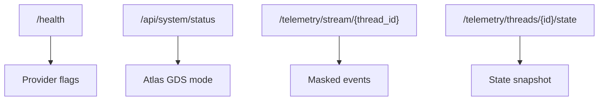
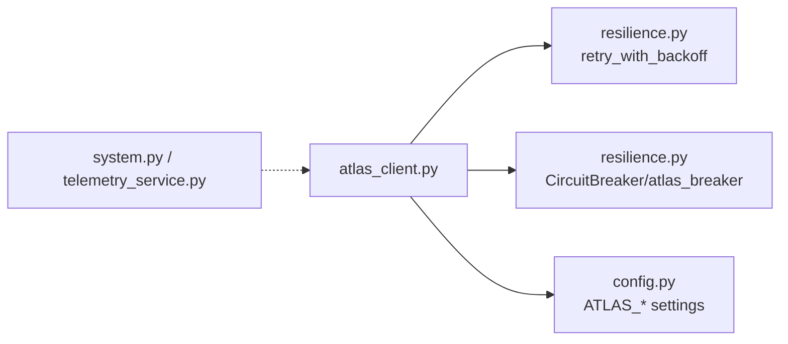

# Resilience & Fallback Mechanisms

<cite>
**Referenced Files in This Document**
- [resilience.py](file://travel-recovery-os/backend/middleware/resilience.py)
- [atlas_client.py](file://travel-recovery-os/backend/tools/atlas_client.py)
- [config.py](file://travel-recovery-os/backend/config.py)
- [telemetry_service.py](file://travel-recovery-os/backend/services/telemetry_service.py)
- [system.py](file://travel-recovery-os/backend/api/routers/system.py)
</cite>

## Table of Contents
1. [Introduction](#introduction)
2. [Project Structure](#project-structure)
3. [Core Components](#core-components)
4. [Architecture Overview](#architecture-overview)
5. [Detailed Component Analysis](#detailed-component-analysis)
6. [Dependency Analysis](#dependency-analysis)
7. [Performance Considerations](#performance-considerations)
8. [Troubleshooting Guide](#troubleshooting-guide)
9. [Conclusion](#conclusion)
10. [Appendices](#appendices)

## Introduction
This document explains the resilience and fallback architecture for the Atlas integration. It covers:
- Circuit breaker pattern using a dedicated breaker instance for Atlas
- Exponential backoff retry with configurable parameters
- Graceful degradation to a high-fidelity sandbox simulation when live inventory is unavailable
- In-memory caching with TTL for search results
- Monitoring approaches for API health and fallback triggers

The goal is to ensure reliable flight search and booking operations under varying external service conditions while preserving user experience through realistic simulated data when necessary.

## Project Structure
Resilience and fallback logic are implemented across middleware, client tools, configuration, and telemetry:
- Middleware provides retry and circuit breaker primitives
- The Atlas client integrates these primitives into search and ticketing flows
- Configuration centralizes environment-driven settings
- Telemetry and system endpoints expose operational status and event streams

**Diagram sources**
- [resilience.py:25-80](file://travel-recovery-os/backend/middleware/resilience.py#L25-L80)
- [resilience.py:97-213](file://travel-recovery-os/backend/middleware/resilience.py#L97-L213)
- [atlas_client.py:175-219](file://travel-recovery-os/backend/tools/atlas_client.py#L175-L219)
- [atlas_client.py:82-167](file://travel-recovery-os/backend/tools/atlas_client.py#L82-L167)
- [atlas_client.py:360-425](file://travel-recovery-os/backend/tools/atlas_client.py#L360-L425)
- [config.py:63-70](file://travel-recovery-os/backend/config.py#L63-L70)
- [telemetry_service.py:45-68](file://travel-recovery-os/backend/services/telemetry_service.py#L45-L68)
- [system.py:9-52](file://travel-recovery-os/backend/api/routers/system.py#L9-L52)

**Section sources**
- [resilience.py:1-244](file://travel-recovery-os/backend/middleware/resilience.py#L1-L244)
- [atlas_client.py:1-427](file://travel-recovery-os/backend/tools/atlas_client.py#L1-L427)
- [config.py:1-117](file://travel-recovery-os/backend/config.py#L1-L117)
- [telemetry_service.py:1-79](file://travel-recovery-os/backend/services/telemetry_service.py#L1-L79)
- [system.py:1-53](file://travel-recovery-os/backend/api/routers/system.py#L1-L53)

## Core Components
- Retry with exponential backoff: A reusable async wrapper that retries failed coroutines with jitter and capped delays.
- Circuit breaker: A state machine (CLOSED/OPEN/HALF_OPEN) that fast-fails on repeated failures and probes recovery after cooldown.
- Atlas client resilience: Combines circuit breaker and retry around live REST calls; falls back to a calibrated sandbox dataset when live search returns no results or fails.
- In-memory TTL cache: Stores recent search results keyed by origin, destination, and date to reduce external calls and latency.
- Monitoring: System endpoints report provider statuses; telemetry stream broadcasts masked events for real-time observability.

**Section sources**
- [resilience.py:25-80](file://travel-recovery-os/backend/middleware/resilience.py#L25-L80)
- [resilience.py:97-213](file://travel-recovery-os/backend/middleware/resilience.py#L97-L213)
- [atlas_client.py:170-219](file://travel-recovery-os/backend/tools/atlas_client.py#L170-L219)
- [atlas_client.py:360-425](file://travel-recovery-os/backend/tools/atlas_client.py#L360-L425)
- [system.py:9-52](file://travel-recovery-os/backend/api/routers/system.py#L9-L52)
- [telemetry_service.py:45-68](file://travel-recovery-os/backend/services/telemetry_service.py#L45-L68)

## Architecture Overview
The Atlas search flow applies layered resilience:
- Attempt live search via official Atlas REST API
- Wrap calls with circuit breaker and retry
- If live search fails or returns no inventory, return high-fidelity sandbox results
- Cache results briefly to avoid redundant calls
- Expose health and status endpoints for monitoring

**Diagram sources**
- [atlas_client.py:175-219](file://travel-recovery-os/backend/tools/atlas_client.py#L175-L219)
- [atlas_client.py:82-167](file://travel-recovery-os/backend/tools/atlas_client.py#L82-L167)
- [atlas_client.py:360-425](file://travel-recovery-os/backend/tools/atlas_client.py#L360-L425)
- [resilience.py:25-80](file://travel-recovery-os/backend/middleware/resilience.py#L25-L80)
- [resilience.py:97-213](file://travel-recovery-os/backend/middleware/resilience.py#L97-L213)

## Detailed Component Analysis

### Circuit Breaker Pattern (Atlas)
- State transitions:
  - CLOSED: normal operation; counts failures
  - OPEN: fast-fail until cooldown elapses
  - HALF_OPEN: allow limited probe requests; success closes, failure reopens
- Atlas-specific breaker: configured with failure threshold and cooldown to protect downstream Atlas services
- Integration: used to wrap Atlas REST calls so repeated failures quickly short-circuit and trigger fallbacks

**Diagram sources**
- [resilience.py:86-213](file://travel-recovery-os/backend/middleware/resilience.py#L86-L213)
- [resilience.py:233-237](file://travel-recovery-os/backend/middleware/resilience.py#L233-L237)

**Section sources**
- [resilience.py:86-213](file://travel-recovery-os/backend/middleware/resilience.py#L86-L213)
- [resilience.py:233-237](file://travel-recovery-os/backend/middleware/resilience.py#L233-L237)

### Exponential Backoff Retry
- Parameters:
  - max_retries: number of retry attempts
  - base_delay: initial delay
  - max_delay: cap for delay growth
  - exponential_base: multiplier for exponential growth
  - jitter: randomization to avoid thundering herds
  - retryable_exceptions: exceptions that trigger retry
  - operation_name: logging context
- Usage: wraps Atlas REST search to tolerate transient network or API errors

**Diagram sources**
- [resilience.py:25-80](file://travel-recovery-os/backend/middleware/resilience.py#L25-L80)

**Section sources**
- [resilience.py:25-80](file://travel-recovery-os/backend/middleware/resilience.py#L25-L80)

### Atlas Client Search Flow and Fallback
- Live path:
  - Builds request headers and payload
  - Calls official Atlas REST /search.do
  - Normalizes results to a consistent schema
- Fallback path:
  - When live search fails or returns no routings, generates realistic sandbox flights with varied airlines, times, fares, and seat availability
- Caching:
  - In-memory cache keyed by origin, destination, and date with TTL to serve repeated queries instantly

**Diagram sources**
- [atlas_client.py:175-219](file://travel-recovery-os/backend/tools/atlas_client.py#L175-L219)
- [atlas_client.py:82-167](file://travel-recovery-os/backend/tools/atlas_client.py#L82-L167)
- [atlas_client.py:360-425](file://travel-recovery-os/backend/tools/atlas_client.py#L360-L425)

**Section sources**
- [atlas_client.py:82-167](file://travel-recovery-os/backend/tools/atlas_client.py#L82-L167)
- [atlas_client.py:175-219](file://travel-recovery-os/backend/tools/atlas_client.py#L175-L219)
- [atlas_client.py:360-425](file://travel-recovery-os/backend/tools/atlas_client.py#L360-L425)

### High-Fidelity Sandbox Simulation
- Purpose: Provide realistic flight options when live inventory is unavailable or empty
- Characteristics:
  - Varied airlines and flight numbers
  - Realistic departure/arrival times and durations
  - Different cabin classes, seat availability, and fares
  - Includes routes with layovers to reflect diverse scenarios
- Behavior: Simulated latency to mimic network behavior

**Section sources**
- [atlas_client.py:360-425](file://travel-recovery-os/backend/tools/atlas_client.py#L360-L425)

### In-Memory Caching with TTL
- Key: origin:destination:date
- TTL: fixed duration to balance freshness and performance
- Benefits:
  - Sub-millisecond retrieval for repeated searches
  - Reduced load on Atlas API during outages or rate limits

**Section sources**
- [atlas_client.py:170-219](file://travel-recovery-os/backend/tools/atlas_client.py#L170-L219)

### Monitoring and Observability
- Health and status endpoints:
  - Report overall service health and provider configurations
  - Indicate Atlas GDS mode (live CLI vs sandbox)
- Telemetry stream:
  - SSE-based event broadcasting with PII masking
  - Event history retrieval for post-run analysis

**Diagram sources**
- [system.py:9-52](file://travel-recovery-os/backend/api/routers/system.py#L9-L52)
- [telemetry_service.py:45-68](file://travel-recovery-os/backend/services/telemetry_service.py#L45-L68)

**Section sources**
- [system.py:9-52](file://travel-recovery-os/backend/api/routers/system.py#L9-L52)
- [telemetry_service.py:45-68](file://travel-recovery-os/backend/services/telemetry_service.py#L45-L68)

## Dependency Analysis
- atlas_client depends on:
  - resilience.retry_with_backoff and resilience.CircuitBreaker (including atlas_breaker)
  - config.settings for Atlas endpoints and credentials
- resilience defines shared primitives reused by other integrations
- telemetry and system endpoints provide operational visibility independent of Atlas but useful for diagnosing fallback triggers

**Diagram sources**
- [atlas_client.py:18-34](file://travel-recovery-os/backend/tools/atlas_client.py#L18-L34)
- [resilience.py:25-80](file://travel-recovery-os/backend/middleware/resilience.py#L25-L80)
- [resilience.py:233-237](file://travel-recovery-os/backend/middleware/resilience.py#L233-L237)
- [config.py:63-70](file://travel-recovery-os/backend/config.py#L63-L70)

**Section sources**
- [atlas_client.py:18-34](file://travel-recovery-os/backend/tools/atlas_client.py#L18-L34)
- [resilience.py:233-237](file://travel-recovery-os/backend/middleware/resilience.py#L233-L237)
- [config.py:63-70](file://travel-recovery-os/backend/config.py#L63-L70)

## Performance Considerations
- Caching reduces repeated external calls and improves response time for identical queries within the TTL window
- Circuit breaker prevents cascading failures and reduces load on unhealthy dependencies
- Retry with jitter avoids synchronized bursts during recovery
- Sandbox fallback ensures low-latency responses even when live APIs are down

[No sources needed since this section provides general guidance]

## Troubleshooting Guide
- Frequent fallback to sandbox:
  - Indicates live Atlas search failures or lack of inventory; verify ATLAS_BASE_URL and credentials
  - Check system status endpoint for Atlas GDS mode
- Circuit breaker opening:
  - Repeated failures will open the breaker; monitor logs for threshold breaches and cooldown transitions
  - Use telemetry stream to observe events and confirm fallback activation
- Cache staleness:
  - If results appear outdated, adjust TTL or clear cache entries by changing query parameters (e.g., date)
- Health checks:
  - Use /health and /api/system/status to validate configuration and provider readiness

**Section sources**
- [system.py:9-52](file://travel-recovery-os/backend/api/routers/system.py#L9-L52)
- [telemetry_service.py:45-68](file://travel-recovery-os/backend/services/telemetry_service.py#L45-L68)
- [atlas_client.py:175-219](file://travel-recovery-os/backend/tools/atlas_client.py#L175-L219)
- [resilience.py:97-213](file://travel-recovery-os/backend/middleware/resilience.py#L97-L213)

## Conclusion
The Atlas integration employs a robust resilience strategy combining circuit breaking, exponential backoff retries, and a high-fidelity sandbox fallback. An in-memory TTL cache optimizes performance, while system and telemetry endpoints provide visibility into operational health and fallback behavior. Together, these mechanisms ensure reliable flight search and booking experiences even under adverse conditions.

[No sources needed since this section summarizes without analyzing specific files]

## Appendices

### Configuration Options
- Atlas endpoints and credentials:
  - ATLAS_ENV, ATLAS_CLIENT_ID, ATLAS_CLIENT_SECRET, ATLAS_BASE_URL, ATLAS_SEARCH_BASE_URL, ATLAS_TRANSACTION_BASE_URL
- Circuit breaker thresholds:
  - failure_threshold, cooldown_seconds, half_open_max_calls (defined per breaker instance)
- Retry parameters:
  - max_retries, base_delay, max_delay, exponential_base, jitter
- Cache TTL:
  - Fixed TTL for in-memory search cache

**Section sources**
- [config.py:63-70](file://travel-recovery-os/backend/config.py#L63-L70)
- [resilience.py:116-132](file://travel-recovery-os/backend/middleware/resilience.py#L116-L132)
- [resilience.py:233-237](file://travel-recovery-os/backend/middleware/resilience.py#L233-L237)
- [resilience.py:25-33](file://travel-recovery-os/backend/middleware/resilience.py#L25-L33)
- [atlas_client.py:170-172](file://travel-recovery-os/backend/tools/atlas_client.py#L170-L172)