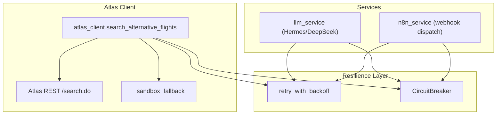
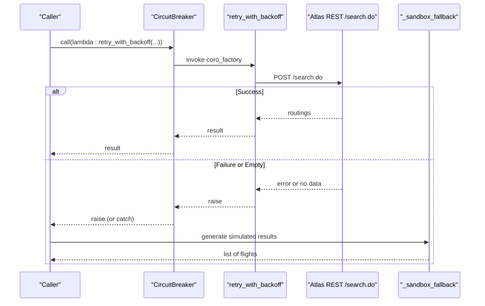
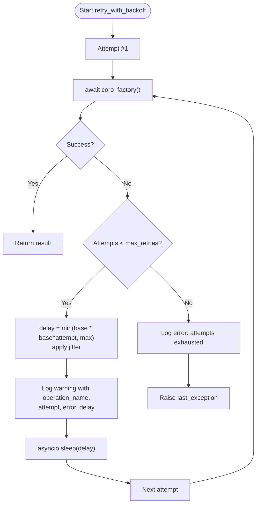
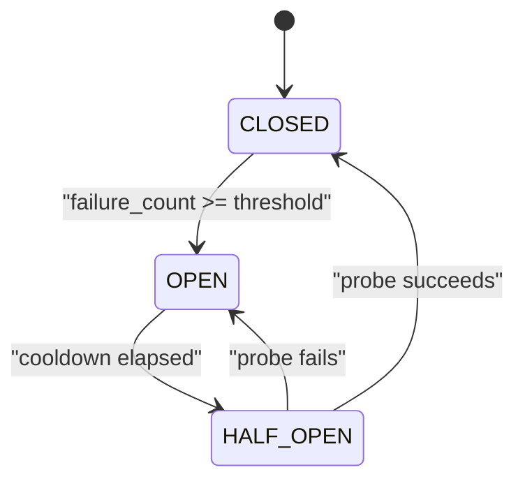
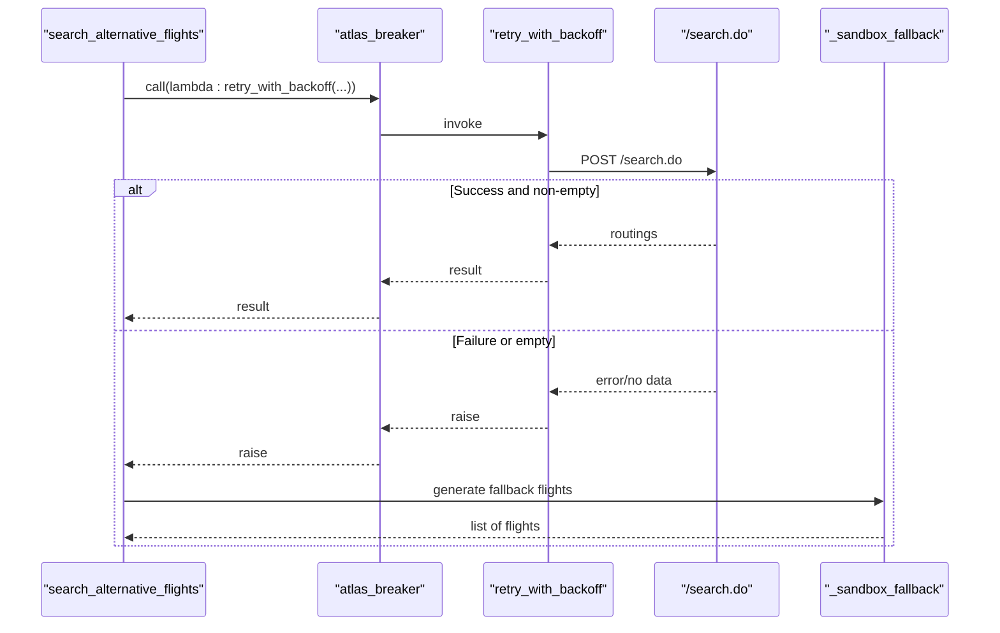
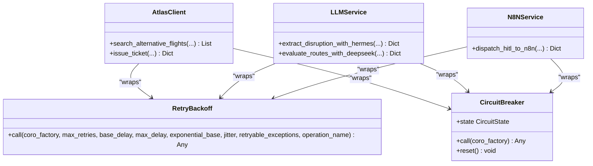
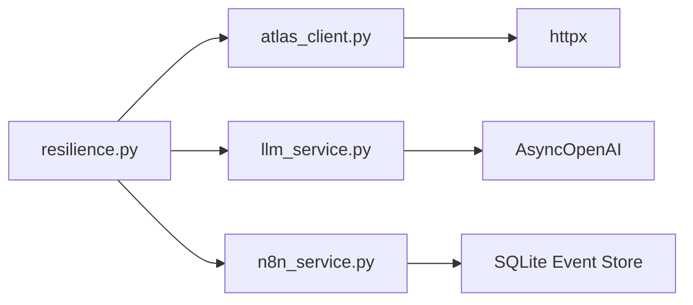

# Retry Logic & Exponential Backoff

<cite>
**Referenced Files in This Document**
- [resilience.py](file://travel-recovery-os/backend/middleware/resilience.py)
- [atlas_client.py](file://travel-recovery-os/backend/tools/atlas_client.py)
- [llm_service.py](file://travel-recovery-os/backend/services/llm_service.py)
- [n8n_service.py](file://travel-recovery-os/backend/services/n8n_service.py)
- [SKILL.md](file://atlas-api-integration-advisor (2)/atlas-api-integration-advisor/SKILL.md)
</cite>

## Table of Contents
1. Introduction
2. Project Structure
3. Core Components
4. Architecture Overview
5. Detailed Component Analysis
6. Dependency Analysis
7. Performance Considerations
8. Troubleshooting Guide
9. Conclusion
10. Appendices

## Introduction
This document explains the retry_with_backoff mechanism used across Atlas API calls and related services. It covers the exponential backoff algorithm, configurable retry limits, delay calculations, logging via operation_name, and integration with a circuit breaker to prevent overwhelming failing services. Practical usage patterns, error handling strategies, and performance considerations for different Atlas endpoints are included.

## Project Structure
The retry and resilience logic is centralized in a middleware module and consumed by service modules that call external systems (Atlas GDS, LLM providers, n8n webhooks). The key files are:
- Resilience primitives: retry_with_backoff and CircuitBreaker
- Atlas client: uses both retry and circuit breaker for live search and fallback flows
- Services: demonstrate consistent usage patterns for retries and breakers

**Diagram sources**
- [resilience.py:25-80](file://travel-recovery-os/backend/middleware/resilience.py#L25-L80)
- [resilience.py:97-210](file://travel-recovery-os/backend/middleware/resilience.py#L97-L210)
- [atlas_client.py:175-219](file://travel-recovery-os/backend/tools/atlas_client.py#L175-L219)
- [llm_service.py:85-96](file://travel-recovery-os/backend/services/llm_service.py#L85-L96)
- [n8n_service.py:127-182](file://travel-recovery-os/backend/services/n8n_service.py#L127-L182)

**Section sources**
- [resilience.py:1-244](file://travel-recovery-os/backend/middleware/resilience.py#L1-L244)
- [atlas_client.py:1-427](file://travel-recovery-os/backend/tools/atlas_client.py#L1-L427)

## Core Components
- retry_with_backoff: An async wrapper that executes a coroutine factory multiple times with exponential backoff and optional jitter. It logs attempts and delays using an operation_name and raises the last exception after exhausting retries.
- CircuitBreaker: A state machine (CLOSED → OPEN → HALF_OPEN) that fast-fails when failures exceed a threshold and allows a probe request after cooldown. Pre-configured instances exist for Atlas, LLMs, and n8n.

Key behaviors:
- Delay calculation: base_delay × (exponential_base ^ attempt), capped at max_delay; jitter multiplies delay by a random factor between 0.5 and 1.0.
- Logging: Each failure logs operation_name, attempt number, error summary, and next delay; exhaustion logs final error.
- Integration: Services wrap their external calls with both retry and circuit breaker to protect against cascading failures.

**Section sources**
- [resilience.py:25-80](file://travel-recovery-os/backend/middleware/resilience.py#L25-L80)
- [resilience.py:97-210](file://travel-recovery-os/backend/middleware/resilience.py#L97-L210)
- [resilience.py:221-243](file://travel-recovery-os/backend/middleware/resilience.py#L221-L243)

## Architecture Overview
The retry and circuit breaker pattern is applied consistently:
- Atlas search path: search_alternative_flights wraps the live Atlas REST call with atlas_breaker.call and retry_with_backoff. On failure or empty results, it falls back to a high-fidelity sandbox simulation.
- LLM paths: Hermes and DeepSeek calls are wrapped with per-service breakers and retry_with_backoff, with deterministic fallbacks on failure.
- n8n webhook dispatch: Uses n8n_breaker and retry_with_backoff; errors are persisted to an event store.

**Diagram sources**
- [atlas_client.py:175-219](file://travel-recovery-os/backend/tools/atlas_client.py#L175-L219)
- [resilience.py:25-80](file://travel-recovery-os/backend/middleware/resilience.py#L25-L80)
- [resilience.py:148-182](file://travel-recovery-os/backend/middleware/resilience.py#L148-L182)

## Detailed Component Analysis

### retry_with_backoff: Algorithm and Configuration
- Parameters:
  - coro_factory: Must be a callable returning an awaitable so it can be re-invoked on each attempt.
  - max_retries: Number of additional attempts beyond the first try.
  - base_delay: Initial delay in seconds before the first retry.
  - max_delay: Upper bound on delay to avoid excessive waits.
  - exponential_base: Multiplier for exponential growth per attempt.
  - jitter: Adds randomness to reduce thundering herd effects.
  - retryable_exceptions: Exceptions that trigger retry; default catches all exceptions.
  - operation_name: Human-readable label used in logs for monitoring and tracing.

- Delay formula: delay = min(base_delay × (exponential_base^attempt), max_delay); if jitter is enabled, delay is multiplied by a uniform random factor in [0.5, 1.0].

- Logging:
  - On failure: logs operation_name, attempt index, truncated error message, and computed delay.
  - On exhaustion: logs operation_name, total attempts, and last error.

- Error propagation: After exhausting retries, the last exception is raised to the caller.

**Diagram sources**
- [resilience.py:25-80](file://travel-recovery-os/backend/middleware/resilience.py#L25-L80)

**Section sources**
- [resilience.py:25-80](file://travel-recovery-os/backend/middleware/resilience.py#L25-L80)

### CircuitBreaker: State Machine and Integration
- States:
  - CLOSED: Normal operation; requests pass through. Failures increment a counter.
  - OPEN: Requests fast-fail with CircuitBreakerOpen until cooldown_seconds elapse.
  - HALF_OPEN: After cooldown, allow a limited number of probe calls; success closes the circuit, failure reopens it.

- Usage in services:
  - Atlas: atlas_breaker configured with failure_threshold=5 and cooldown_seconds=30.
  - LLMs: deepseek_breaker and hermes_breaker with lower thresholds and longer cooldowns.
  - n8n: n8n_breaker with moderate thresholds and cooldown.

- Integration pattern:
  - Wrap the retry_with_backoff call inside breaker.call to ensure rapid failover during sustained outages.
  - Catch CircuitBreakerOpen and other exceptions to implement fallback behavior (e.g., sandbox simulation or deterministic parsing).

**Diagram sources**
- [resilience.py:86-210](file://travel-recovery-os/backend/middleware/resilience.py#L86-L210)

**Section sources**
- [resilience.py:86-210](file://travel-recovery-os/backend/middleware/resilience.py#L86-L210)
- [resilience.py:221-243](file://travel-recovery-os/backend/middleware/resilience.py#L221-L243)

### Atlas Client: End-to-End Flow with Retry and Breaker
- search_alternative_flights:
  - Attempts live Atlas REST /search.do via atlas_breaker.call wrapping retry_with_backoff.
  - If results are missing or breaker opens, falls back to _sandbox_fallback to return calibrated flight data.
  - Caches recent searches in memory with TTL to reduce repeated calls.

- Issue ticket flow (_atlas_rest_issue_ticket):
  - Executes Verify → Order → Pay → Query steps over HTTP.
  - While not wrapped with retry/breaker in this function, higher-level callers may apply resilience around broader workflows.

**Diagram sources**
- [atlas_client.py:175-219](file://travel-recovery-os/backend/tools/atlas_client.py#L175-L219)
- [resilience.py:25-80](file://travel-recovery-os/backend/middleware/resilience.py#L25-L80)
- [resilience.py:148-182](file://travel-recovery-os/backend/middleware/resilience.py#L148-L182)

**Section sources**
- [atlas_client.py:175-219](file://travel-recovery-os/backend/tools/atlas_client.py#L175-L219)
- [atlas_client.py:222-331](file://travel-recovery-os/backend/tools/atlas_client.py#L222-L331)

### Service-Level Patterns: LLM and n8n
- LLM services:
  - Hermes extraction and DeepSeek route scoring both use retry_with_backoff with small base delays and 2 retries, wrapped in per-service circuit breakers.
  - Fallbacks include regex-based extraction and deterministic scoring when LLM endpoints are unavailable.

- n8n webhook dispatch:
  - Uses n8n_breaker and retry_with_backoff to send HITL notifications.
  - Errors are persisted to an SQLite event store for auditability.

**Diagram sources**
- [resilience.py:25-80](file://travel-recovery-os/backend/middleware/resilience.py#L25-L80)
- [resilience.py:97-210](file://travel-recovery-os/backend/middleware/resilience.py#L97-L210)
- [atlas_client.py:175-219](file://travel-recovery-os/backend/tools/atlas_client.py#L175-L219)
- [llm_service.py:85-96](file://travel-recovery-os/backend/services/llm_service.py#L85-L96)
- [llm_service.py:192-200](file://travel-recovery-os/backend/services/llm_service.py#L192-L200)
- [n8n_service.py:127-182](file://travel-recovery-os/backend/services/n8n_service.py#L127-L182)

**Section sources**
- [llm_service.py:85-96](file://travel-recovery-os/backend/services/llm_service.py#L85-L96)
- [llm_service.py:192-200](file://travel-recovery-os/backend/services/llm_service.py#L192-L200)
- [n8n_service.py:127-182](file://travel-recovery-os/backend/services/n8n_service.py#L127-L182)

## Dependency Analysis
- Coupling:
  - All consumers import retry_with_backoff and CircuitBreaker from the resilience module.
  - Atlas client depends on settings for credentials and URLs; resilience module is independent.
- Cohesion:
  - Resilience module encapsulates retry and breaker logic, promoting reuse and consistency.
- External dependencies:
  - httpx for HTTP calls in Atlas client and services.
  - OpenAI-compatible clients for LLM services.
  - SQLite for n8n event persistence.

**Diagram sources**
- [resilience.py:25-80](file://travel-recovery-os/backend/middleware/resilience.py#L25-L80)
- [atlas_client.py:18-35](file://travel-recovery-os/backend/tools/atlas_client.py#L18-L35)
- [llm_service.py:13-28](file://travel-recovery-os/backend/services/llm_service.py#L13-L28)
- [n8n_service.py:12-25](file://travel-recovery-os/backend/services/n8n_service.py#L12-L25)

**Section sources**
- [resilience.py:25-80](file://travel-recovery-os/backend/middleware/resilience.py#L25-L80)
- [atlas_client.py:18-35](file://travel-recovery-os/backend/tools/atlas_client.py#L18-L35)
- [llm_service.py:13-28](file://travel-recovery-os/backend/services/llm_service.py#L13-L28)
- [n8n_service.py:12-25](file://travel-recovery-os/backend/services/n8n_service.py#L12-L25)

## Performance Considerations
- Exponential backoff reduces load on transiently failing services while avoiding thundering herds via jitter.
- Max delay caps prevent excessively long waits; tune base_delay and max_delay per endpoint characteristics.
- Circuit breaker prevents cascading failures by fast-failing when a service is down, allowing recovery without saturating resources.
- Atlas search caching minimizes repeated calls to external APIs for identical queries within a short time window.
- For idempotent operations (e.g., search), retries are safe; for mutating operations (e.g., order/pay), ensure idempotency keys or careful orchestration to avoid duplicates.

[No sources needed since this section provides general guidance]

## Troubleshooting Guide
Common issues and strategies:
- Repeated timeouts or rate limiting:
  - Increase max_retries or adjust base_delay/max_delay for slower endpoints.
  - Ensure jitter is enabled to distribute retry load.
  - Monitor operation_name logs to identify which endpoints are failing.
- Circuit breaker opening frequently:
  - Investigate upstream service health; consider increasing failure_threshold or cooldown_seconds.
  - Implement robust fallbacks (e.g., sandbox simulation) to maintain user experience.
- Exhausted retries:
  - Review retryable_exceptions to ensure only transient errors trigger retries.
  - Add metrics/alerts on exhaustion events to detect persistent failures early.

Operational tips:
- Use operation_name to correlate logs across retries and breaker transitions.
- Persist critical events (e.g., n8n dispatch receipts) for auditability and post-mortem analysis.
- Validate environment configuration (base URLs, credentials) to avoid auth-related failures.

**Section sources**
- [resilience.py:69-80](file://travel-recovery-os/backend/middleware/resilience.py#L69-L80)
- [resilience.py:194-210](file://travel-recovery-os/backend/middleware/resilience.py#L194-L210)
- [n8n_service.py:155-182](file://travel-recovery-os/backend/services/n8n_service.py#L155-L182)

## Conclusion
The retry_with_backoff mechanism, combined with a circuit breaker, provides resilient, observable, and scalable interactions with Atlas and other external services. By tuning retry parameters, leveraging jitter, and integrating breakers, the system gracefully handles transient failures like network timeouts and rate limiting while protecting downstream services from overload. Consistent use of operation_name enables effective monitoring and troubleshooting across components.

[No sources needed since this section summarizes without analyzing specific files]

## Appendices

### Exponential Backoff Reference
- Recommended strategy for transient errors aligns with exponential backoff capped at a maximum delay, suitable for Atlas endpoints experiencing temporary unavailability or throttling.

**Section sources**
- [SKILL.md:347-382](file://atlas-api-integration-advisor (2)/atlas-api-integration-advisor/SKILL.md#L347-L382)