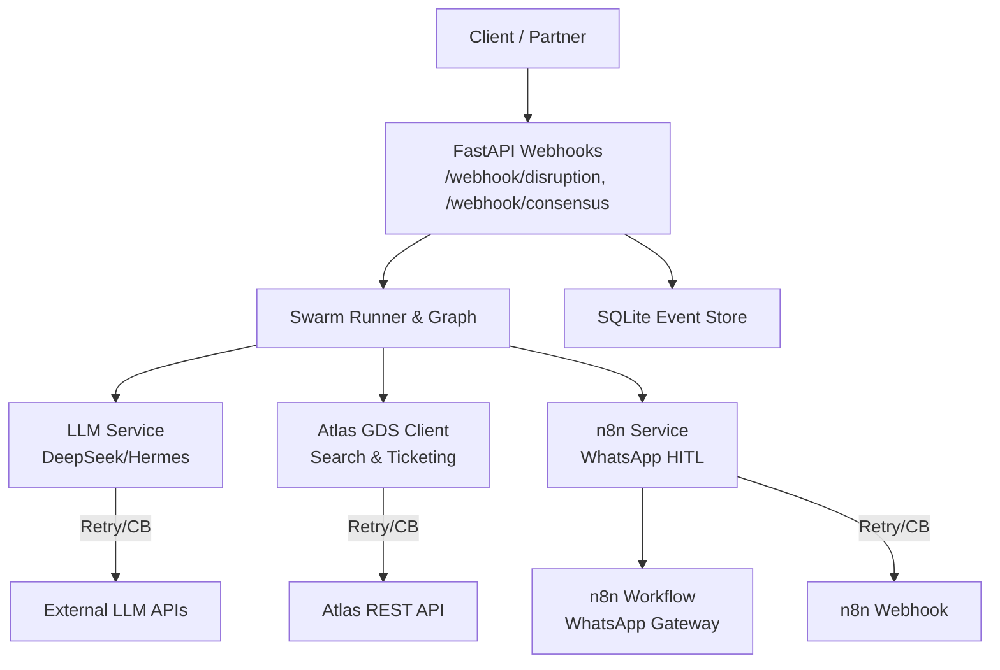
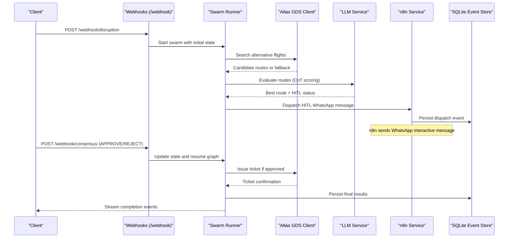
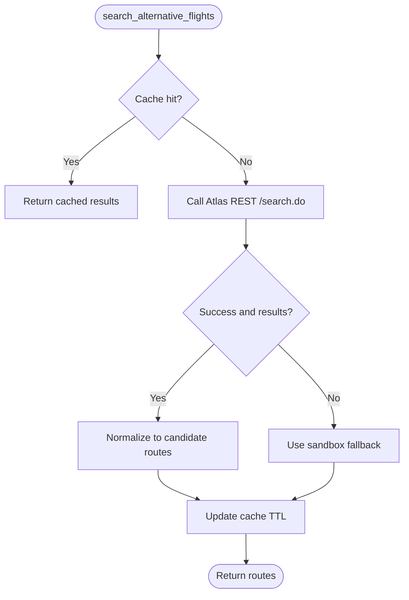
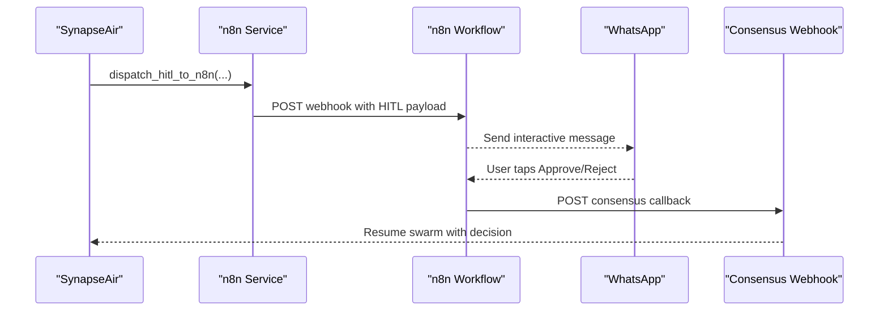
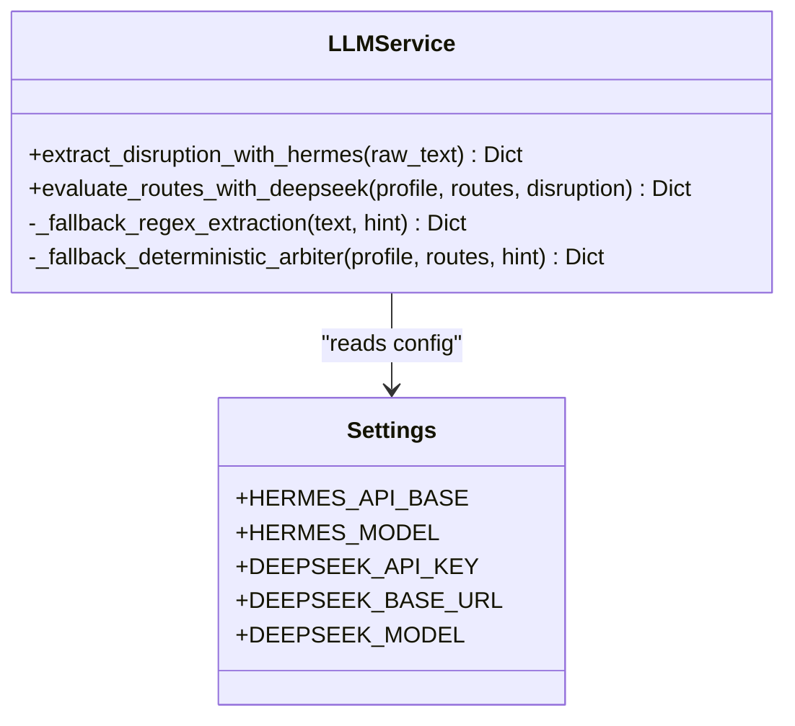
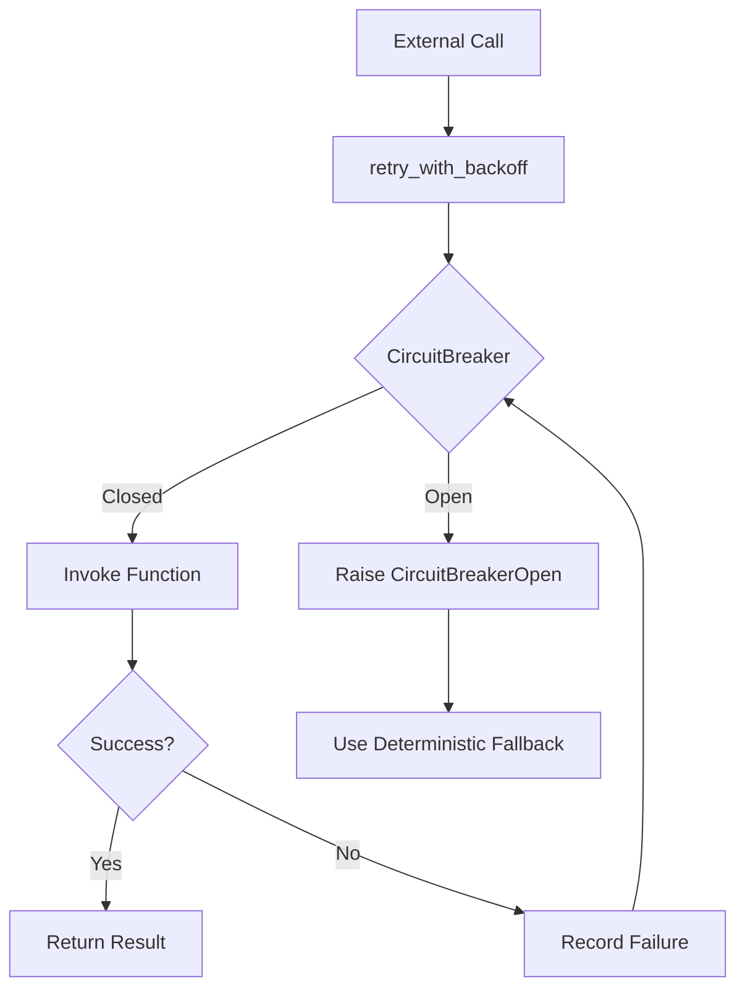
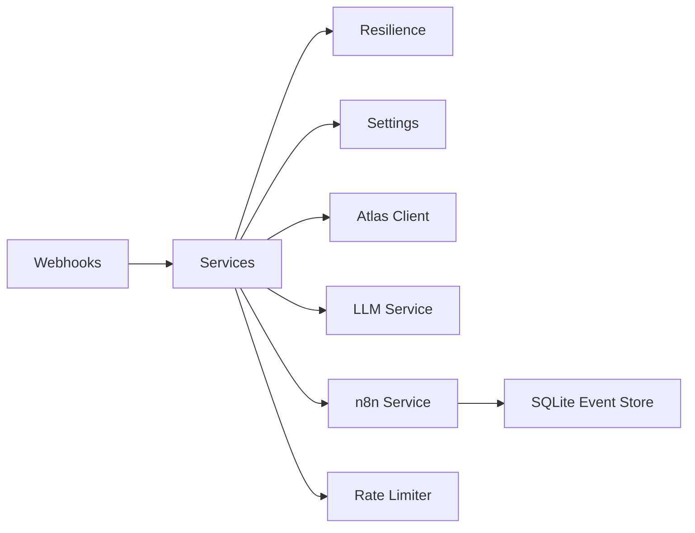

# External Integrations

<cite>
**Referenced Files in This Document**
- [atlas_client.py](file://travel-recovery-os/backend/tools/atlas_client.py)
- [llm_service.py](file://travel-recovery-os/backend/services/llm_service.py)
- [n8n_service.py](file://travel-recovery-os/backend/services/n8n_service.py)
- [synapseair_workflow.json](file://travel-recovery-os/n8n/synapseair_workflow.json)
- [resilience.py](file://travel-recovery-os/backend/middleware/resilience.py)
- [event_store.py](file://travel-recovery-os/backend/store/event_store.py)
- [rate_limiter.py](file://travel-recovery-os/backend/auth/rate_limiter.py)
- [dependencies.py](file://travel-recovery-os/backend/api/dependencies.py)
- [webhooks.py](file://travel-recovery-os/backend/api/routers/webhooks.py)
- [config.py](file://travel-recovery-os/backend/config.py)
- [SKILL.md](file://atlas-api-integration-advisor (2)/atlas-api-integration-advisor/SKILL.md)
- [common-issues.md](file://atlas-api-integration-advisor (2)/atlas-api-integration-advisor/references/common-issues.md)
</cite>

## Table of Contents
1. Introduction
2. Project Structure
3. Core Components
4. Architecture Overview
5. Detailed Component Analysis
6. Dependency Analysis
7. Performance Considerations
8. Troubleshooting Guide
9. Conclusion
10. Appendices

## Introduction
This document explains how SynapseAir integrates with external systems to recover disrupted flights:
- Atlas GDS for flight search and ticketing, including authentication, rate limiting, fallbacks, and error handling.
- n8n workflow for WhatsApp messaging and human-in-the-loop (HITL) approvals.
- LLM provider abstraction supporting DeepSeek V4 Flash and Hermes local models, with configuration, prompt patterns, and performance optimization.
It also covers integration testing strategies, monitoring approaches, and troubleshooting guides for each dependency.

## Project Structure
SynapseAir’s backend exposes webhooks that trigger a multi-agent recovery pipeline. External integrations are encapsulated in dedicated services and tools:
- Atlas GDS client for search and ticketing
- LLM service for route scoring and text extraction
- n8n service for WhatsApp HITL dispatch and passenger Q&A
- Resilience middleware (retry + circuit breakers)
- SQLite event store for durable audit trails
- Rate limiter for API protection
- Configuration for all providers

**Diagram sources**
- [webhooks.py:14-72](file://travel-recovery-os/backend/api/routers/webhooks.py#L14-L72)
- [webhooks.py:74-185](file://travel-recovery-os/backend/api/routers/webhooks.py#L74-L185)
- [llm_service.py:34-96](file://travel-recovery-os/backend/services/llm_service.py#L34-L96)
- [llm_service.py:126-205](file://travel-recovery-os/backend/services/llm_service.py#L126-L205)
- [atlas_client.py:175-219](file://travel-recovery-os/backend/tools/atlas_client.py#L175-L219)
- [atlas_client.py:222-357](file://travel-recovery-os/backend/tools/atlas_client.py#L222-L357)
- [n8n_service.py:51-202](file://travel-recovery-os/backend/services/n8n_service.py#L51-L202)
- [resilience.py:221-243](file://travel-recovery-os/backend/middleware/resilience.py#L221-L243)
- [event_store.py:107-160](file://travel-recovery-os/backend/store/event_store.py#L107-L160)

**Section sources**
- [webhooks.py:14-185](file://travel-recovery-os/backend/api/routers/webhooks.py#L14-L185)
- [config.py:29-70](file://travel-recovery-os/backend/config.py#L29-L70)

## Core Components
- Atlas GDS Integration: Search and ticketing via official REST endpoints with headers, retries, circuit breaker, and sandbox fallback.
- n8n WhatsApp HITL: Dispatch interactive messages, capture approvals, and resume workflows via webhook consensus.
- LLM Abstraction: Unified interface to DeepSeek and Hermes with robust prompts, JSON parsing, and deterministic fallbacks.
- Resilience: Exponential backoff retry and per-service circuit breakers.
- Persistence: SQLite-based durable logs for n8n events and disruption history.
- Security & Rate Limiting: Multi-mode auth and sliding-window rate limits.

**Section sources**
- [atlas_client.py:38-167](file://travel-recovery-os/backend/tools/atlas_client.py#L38-L167)
- [atlas_client.py:222-357](file://travel-recovery-os/backend/tools/atlas_client.py#L222-L357)
- [n8n_service.py:51-202](file://travel-recovery-os/backend/services/n8n_service.py#L51-L202)
- [llm_service.py:34-96](file://travel-recovery-os/backend/services/llm_service.py#L34-L96)
- [llm_service.py:126-205](file://travel-recovery-os/backend/services/llm_service.py#L126-L205)
- [resilience.py:25-80](file://travel-recovery-os/backend/middleware/resilience.py#L25-L80)
- [resilience.py:97-213](file://travel-recovery-os/backend/middleware/resilience.py#L97-L213)
- [event_store.py:107-160](file://travel-recovery-os/backend/store/event_store.py#L107-L160)
- [dependencies.py:25-78](file://travel-recovery-os/backend/api/dependencies.py#L25-L78)
- [rate_limiter.py:41-99](file://travel-recovery-os/backend/auth/rate_limiter.py#L41-L99)

## Architecture Overview
The system ingests disruptions, orchestrates agents, consults LLMs and GDS, and engages passengers via WhatsApp for approval before issuing tickets.

**Diagram sources**
- [webhooks.py:14-72](file://travel-recovery-os/backend/api/routers/webhooks.py#L14-L72)
- [webhooks.py:74-185](file://travel-recovery-os/backend/api/routers/webhooks.py#L74-L185)
- [atlas_client.py:175-219](file://travel-recovery-os/backend/tools/atlas_client.py#L175-L219)
- [atlas_client.py:222-357](file://travel-recovery-os/backend/tools/atlas_client.py#L222-L357)
- [llm_service.py:126-205](file://travel-recovery-os/backend/services/llm_service.py#L126-L205)
- [n8n_service.py:51-202](file://travel-recovery-os/backend/services/n8n_service.py#L51-L202)
- [event_store.py:107-160](file://travel-recovery-os/backend/store/event_store.py#L107-L160)

## Detailed Component Analysis

### Atlas GDS Integration (Flight Search & Ticketing)
- Authentication: Uses client ID and secret passed via custom headers for every request.
- Search Flow: Normalizes responses into candidate routes; includes caching to reduce repeated calls.
- Ticketing Flow: Executes verify -> order -> pay -> query lifecycle; generates unique identifiers to avoid collisions.
- Fallbacks: If live search fails or returns no inventory, uses a calibrated sandbox simulation to keep the flow functional.
- Resilience: Wrapped with exponential backoff retry and a dedicated circuit breaker; errors are logged and surfaced.

**Diagram sources**
- [atlas_client.py:175-219](file://travel-recovery-os/backend/tools/atlas_client.py#L175-L219)
- [atlas_client.py:82-167](file://travel-recovery-os/backend/tools/atlas_client.py#L82-L167)
- [atlas_client.py:360-425](file://travel-recovery-os/backend/tools/atlas_client.py#L360-L425)

**Section sources**
- [atlas_client.py:38-167](file://travel-recovery-os/backend/tools/atlas_client.py#L38-L167)
- [atlas_client.py:175-219](file://travel-recovery-os/backend/tools/atlas_client.py#L175-L219)
- [atlas_client.py:222-357](file://travel-recovery-os/backend/tools/atlas_client.py#L222-L357)
- [atlas_client.py:360-425](file://travel-recovery-os/backend/tools/atlas_client.py#L360-L425)
- [SKILL.md:328-382](file://atlas-api-integration-advisor (2)/atlas-api-integration-advisor/SKILL.md#L328-L382)
- [common-issues.md:11-44](file://atlas-api-integration-advisor (2)/atlas-api-integration-advisor/references/common-issues.md#L11-L44)

### n8n Workflow Integration (WhatsApp Messaging & HITL)
- Dispatch: Builds a structured payload with passenger context, recommended flight, and WhatsApp template; posts to configured n8n webhook URL.
- Durable Audit: Every dispatch is persisted to SQLite with status, latency, payload, and response body.
- HITL Loop: n8n formats an interactive WhatsApp message; passenger replies trigger a consensus callback to resume the workflow.
- Resilience: Dispatch is wrapped with retry and a circuit breaker; errors are recorded and surfaced without blocking the main flow.

**Diagram sources**
- [n8n_service.py:51-202](file://travel-recovery-os/backend/services/n8n_service.py#L51-L202)
- [synapseair_workflow.json:1-80](file://travel-recovery-os/n8n/synapseair_workflow.json#L1-L80)
- [webhooks.py:74-185](file://travel-recovery-os/backend/api/routers/webhooks.py#L74-L185)
- [event_store.py:107-160](file://travel-recovery-os/backend/store/event_store.py#L107-L160)

**Section sources**
- [n8n_service.py:51-202](file://travel-recovery-os/backend/services/n8n_service.py#L51-L202)
- [synapseair_workflow.json:1-80](file://travel-recovery-os/n8n/synapseair_workflow.json#L1-L80)
- [webhooks.py:74-185](file://travel-recovery-os/backend/api/routers/webhooks.py#L74-L185)
- [event_store.py:107-160](file://travel-recovery-os/backend/store/event_store.py#L107-L160)

### LLM Provider Abstraction (DeepSeek V4 Flash & Hermes Local Models)
- Providers:
  - DeepSeek: Used for Chain-of-Thought route evaluation and scoring.
  - Hermes: Used for extracting structured JSON from unstructured disruption text.
- Configuration: All endpoints, keys, and model names are loaded from centralized settings.
- Prompt Engineering:
  - Strict JSON schemas enforced via system prompts; markdown wrappers are stripped before parsing.
  - CoT reasoning traces included for transparency and debugging.
- Fallbacks:
  - Deterministic regex extraction when Hermes is unavailable.
  - Deterministic arbiter scoring when DeepSeek is unavailable or not configured.
- Performance:
  - Low temperature for stable outputs.
  - Short timeouts tuned per provider.
  - Circuit breakers and retries protect against transient failures.

**Diagram sources**
- [llm_service.py:34-96](file://travel-recovery-os/backend/services/llm_service.py#L34-L96)
- [llm_service.py:126-205](file://travel-recovery-os/backend/services/llm_service.py#L126-L205)
- [llm_service.py:208-279](file://travel-recovery-os/backend/services/llm_service.py#L208-L279)
- [config.py:46-55](file://travel-recovery-os/backend/config.py#L46-L55)

**Section sources**
- [llm_service.py:34-96](file://travel-recovery-os/backend/services/llm_service.py#L34-L96)
- [llm_service.py:126-205](file://travel-recovery-os/backend/services/llm_service.py#L126-L205)
- [llm_service.py:208-279](file://travel-recovery-os/backend/services/llm_service.py#L208-L279)
- [config.py:46-55](file://travel-recovery-os/backend/config.py#L46-L55)

### Resilience, Rate Limiting, and Error Handling
- Retry with Backoff: Applies exponential backoff with jitter to transient failures across integrations.
- Circuit Breakers: Per-service breakers (DeepSeek, Hermes, Atlas, n8n) fast-fail on repeated errors and probe recovery.
- Rate Limiting: Sliding window limits per category (webhook, consensus, stream, etc.) using Redis or in-memory store.
- Error Handling: Exceptions are caught, logged, and converted into safe receipts or HTTP errors; payloads and latencies are persisted for audit.

**Diagram sources**
- [resilience.py:25-80](file://travel-recovery-os/backend/middleware/resilience.py#L25-L80)
- [resilience.py:97-213](file://travel-recovery-os/backend/middleware/resilience.py#L97-L213)
- [rate_limiter.py:41-99](file://travel-recovery-os/backend/auth/rate_limiter.py#L41-L99)

**Section sources**
- [resilience.py:25-80](file://travel-recovery-os/backend/middleware/resilience.py#L25-L80)
- [resilience.py:97-213](file://travel-recovery-os/backend/middleware/resilience.py#L97-L213)
- [rate_limiter.py:41-99](file://travel-recovery-os/backend/auth/rate_limiter.py#L41-L99)
- [dependencies.py:103-130](file://travel-recovery-os/backend/api/dependencies.py#L103-L130)

## Dependency Analysis
- Coupling:
  - Webhooks depend on Swarm Runner and broadcast telemetry.
  - Services depend on resilience primitives and settings.
  - Atlas client depends on HTTP client and settings; n8n service depends on HTTP client and event store.
- Cohesion:
  - Each external dependency has a focused module (LLM, Atlas, n8n).
  - Shared resilience utilities centralize retry and breaker logic.
- External Dependencies:
  - Atlas REST API endpoints for search and ticketing.
  - LLM providers via OpenAI-compatible clients.
  - n8n webhook endpoint for WhatsApp delivery.
  - Optional Redis for rate limiting and persistence.

**Diagram sources**
- [webhooks.py:14-185](file://travel-recovery-os/backend/api/routers/webhooks.py#L14-L185)
- [llm_service.py:13-28](file://travel-recovery-os/backend/services/llm_service.py#L13-L28)
- [atlas_client.py:18-35](file://travel-recovery-os/backend/tools/atlas_client.py#L18-L35)
- [n8n_service.py:12-25](file://travel-recovery-os/backend/services/n8n_service.py#L12-L25)
- [resilience.py:221-243](file://travel-recovery-os/backend/middleware/resilience.py#L221-L243)
- [event_store.py:107-160](file://travel-recovery-os/backend/store/event_store.py#L107-L160)
- [rate_limiter.py:41-99](file://travel-recovery-os/backend/auth/rate_limiter.py#L41-L99)

**Section sources**
- [webhooks.py:14-185](file://travel-recovery-os/backend/api/routers/webhooks.py#L14-L185)
- [llm_service.py:13-28](file://travel-recovery-os/backend/services/llm_service.py#L13-L28)
- [atlas_client.py:18-35](file://travel-recovery-os/backend/tools/atlas_client.py#L18-L35)
- [n8n_service.py:12-25](file://travel-recovery-os/backend/services/n8n_service.py#L12-L25)
- [resilience.py:221-243](file://travel-recovery-os/backend/middleware/resilience.py#L221-L243)
- [event_store.py:107-160](file://travel-recovery-os/backend/store/event_store.py#L107-L160)
- [rate_limiter.py:41-99](file://travel-recovery-os/backend/auth/rate_limiter.py#L41-L99)

## Performance Considerations
- Caching: In-memory TTL cache for flight searches reduces redundant Atlas calls.
- Timeouts: Tight timeouts on HTTP clients prevent long tails during outages.
- Prompt Efficiency: Low temperature and strict JSON schemas minimize token usage and parsing overhead.
- Circuit Breakers: Fast-failing broken dependencies avoids cascading delays.
- Database: SQLite WAL mode improves concurrency for event logging.

[No sources needed since this section provides general guidance]

## Troubleshooting Guide
- Atlas GDS
  - Authentication failures: Verify client ID and secret headers; ensure required headers like gzip encoding are present.
  - Search issues: Empty results may indicate no availability; daily quota exceeded requires waiting or quota increase; maintenance windows require retries.
  - Verify/Order/Pay errors: Handle expired routing identifiers, fare changes, and availability shifts by restarting flows from search or re-verifying prices.
- n8n WhatsApp HITL
  - Dispatch failures: Check webhook URL and connectivity; review SQLite event log for status and error details; circuit breaker may be open due to repeated failures.
  - Consensus not received: Ensure n8n forwards replies to the correct consensus endpoint; validate thread_id mapping.
- LLM Providers
  - Hermes offline: System falls back to regex extraction; check base URL and model availability.
  - DeepSeek unavailable: System falls back to deterministic arbiter; verify API key and base URL; consider increasing timeout or reducing payload size.
- Rate Limiting
  - 429 responses: Respect Retry-After header; adjust limits per environment; confirm Redis availability for distributed rate limiting.

**Section sources**
- [common-issues.md:11-44](file://atlas-api-integration-advisor (2)/atlas-api-integration-advisor/references/common-issues.md#L11-L44)
- [SKILL.md:328-382](file://atlas-api-integration-advisor (2)/atlas-api-integration-advisor/SKILL.md#L328-L382)
- [n8n_service.py:51-202](file://travel-recovery-os/backend/services/n8n_service.py#L51-L202)
- [event_store.py:107-160](file://travel-recovery-os/backend/store/event_store.py#L107-L160)
- [llm_service.py:34-96](file://travel-recovery-os/backend/services/llm_service.py#L34-L96)
- [llm_service.py:126-205](file://travel-recovery-os/backend/services/llm_service.py#L126-L205)
- [dependencies.py:103-130](file://travel-recovery-os/backend/api/dependencies.py#L103-L130)

## Conclusion
SynapseAir’s external integrations are designed for reliability and observability:
- Atlas GDS provides resilient search and ticketing with clear fallbacks.
- n8n enables seamless WhatsApp HITL interactions with durable audit trails.
- LLM abstractions support multiple providers with strong fallbacks and efficient prompting.
- Centralized resilience, rate limiting, and configuration ensure consistent behavior across environments.
Adopt the provided testing and monitoring practices to maintain high availability and rapid issue resolution.

[No sources needed since this section summarizes without analyzing specific files]

## Appendices

### Configuration Reference
- DeepSeek: API key, base URL, model name.
- Hermes: Base URL, API key, model name.
- n8n: API URL, webhook URL, consensus callback URL.
- Atlas: Environment, client credentials, base URLs for search and transactions.

**Section sources**
- [config.py:46-70](file://travel-recovery-os/backend/config.py#L46-L70)

### Monitoring and Observability
- Event Store: Query recent n8n events and disruption history for SLA tracking and diagnostics.
- Telemetry: Broadcast events for agent steps and workflow completion for real-time dashboards.
- Metrics: Track latency_ms and status codes for each external call; alert on circuit breaker opens.

**Section sources**
- [event_store.py:107-160](file://travel-recovery-os/backend/store/event_store.py#L107-L160)
- [event_store.py:242-335](file://travel-recovery-os/backend/store/event_store.py#L242-L335)
- [webhooks.py:107-161](file://travel-recovery-os/backend/api/routers/webhooks.py#L107-L161)

### Integration Testing Strategies
- Unit Tests: Validate prompt parsing and fallback logic for LLM services.
- Contract Tests: Mock Atlas REST endpoints to assert search normalization and ticketing lifecycle.
- End-to-End Tests: Simulate n8n webhook dispatch and consensus callbacks; assert state transitions and SQLite records.
- Chaos Testing: Introduce circuit breaker opens and network failures to verify fallback paths.

[No sources needed since this section provides general guidance]