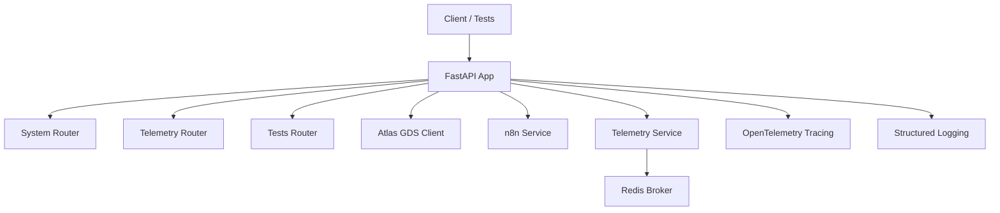
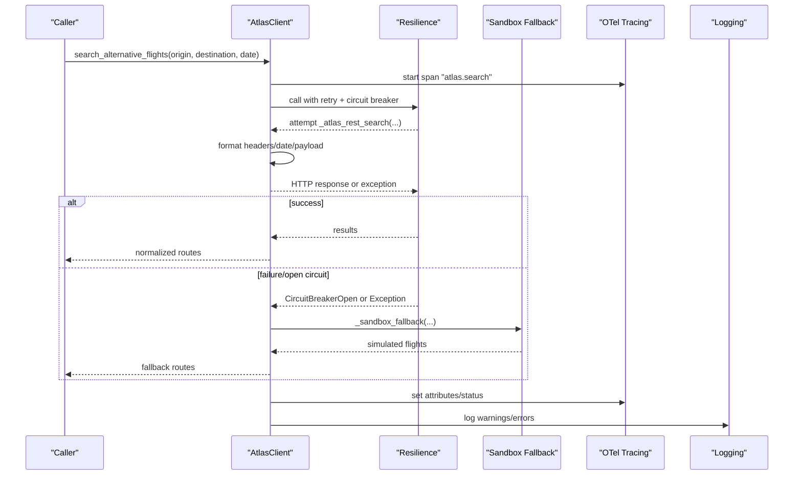
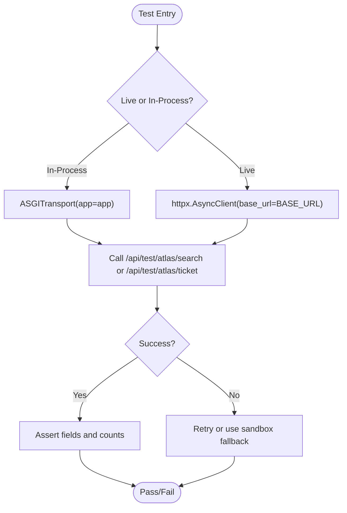
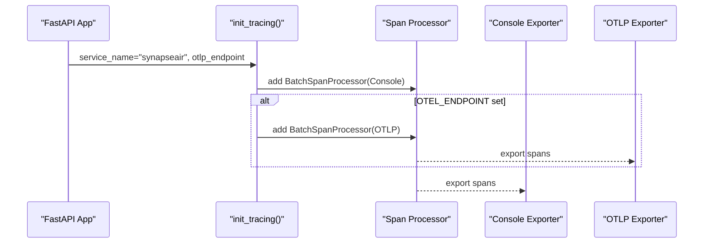
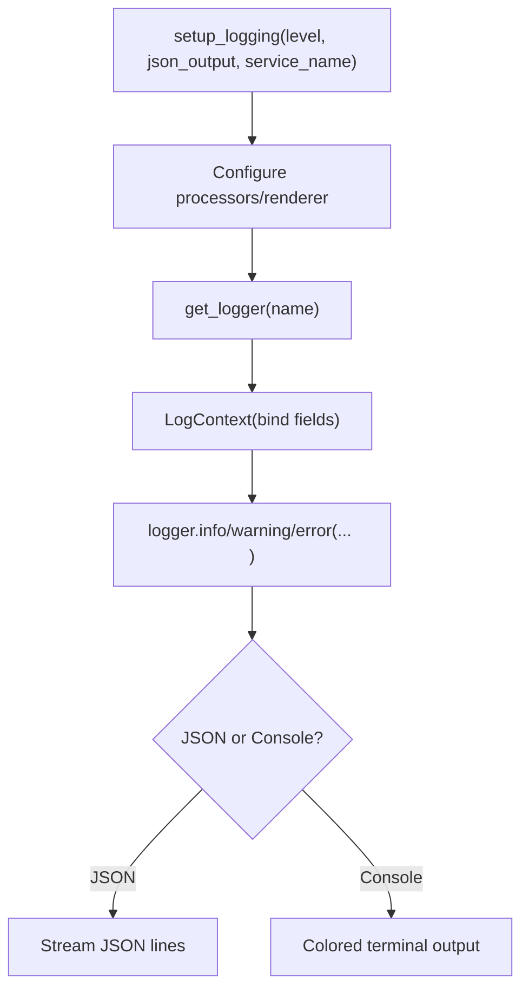
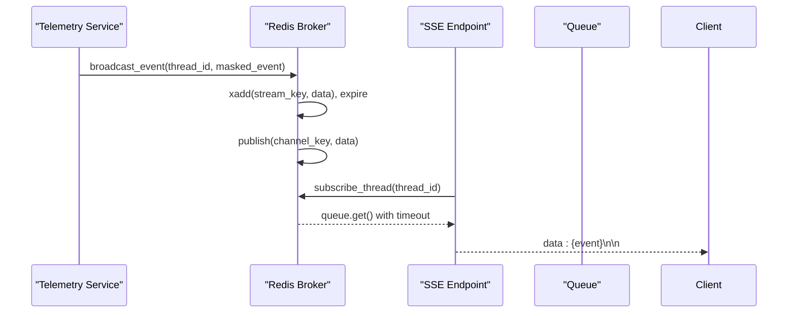
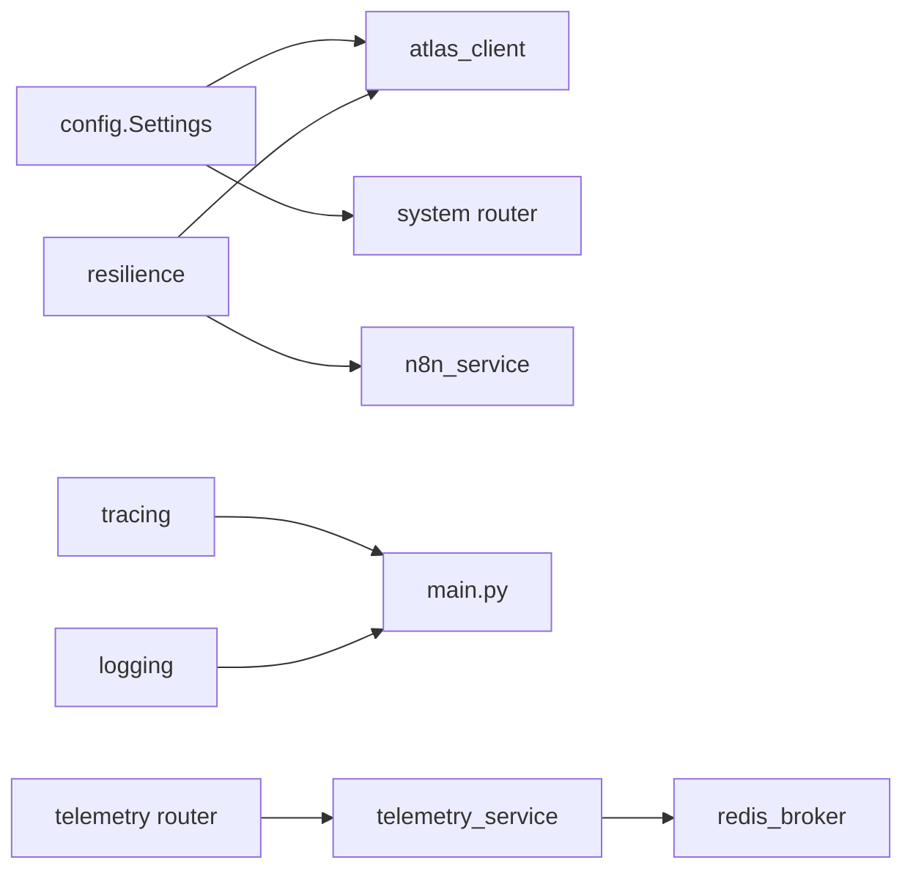

# Integration Testing & Monitoring

<cite>
**Referenced Files in This Document**
- [main.py](file://travel-recovery-os/backend/main.py)
- [config.py](file://travel-recovery-os/backend/config.py)
- [atlas_client.py](file://travel-recovery-os/backend/tools/atlas_client.py)
- [resilience.py](file://travel-recovery-os/backend/middleware/resilience.py)
- [tracing.py](file://travel-recovery-os/backend/middleware/tracing.py)
- [logging.py](file://travel-recovery-os/backend/middleware/logging.py)
- [telemetry_service.py](file://travel-recovery-os/backend/services/telemetry_service.py)
- [redis_broker.py](file://travel-recovery-os/backend/store/redis_broker.py)
- [system.py](file://travel-recovery-os/backend/api/routers/system.py)
- [telemetry.py](file://travel-recovery-os/backend/api/routers/telemetry.py)
- [tests.py](file://travel-recovery-os/backend/api/routers/tests.py)
- [test_qa_suite.py](file://travel-recovery-os/backend/tests/test_qa_suite.py)
</cite>

## Table of Contents
1. [Introduction](#introduction)
2. [Project Structure](#project-structure)
3. [Core Components](#core-components)
4. [Architecture Overview](#architecture-overview)
5. [Detailed Component Analysis](#detailed-component-analysis)
6. [Dependency Analysis](#dependency-analysis)
7. [Performance Considerations](#performance-considerations)
8. [Troubleshooting Guide](#troubleshooting-guide)
9. [Conclusion](#conclusion)
10. [Appendices](#appendices)

## Introduction
This document provides a comprehensive guide to testing and monitoring external integrations in the SynapseAir platform, with a focus on Atlas GDS integration. It covers:
- Testing strategies for Atlas GDS (mocks, sandbox, end-to-end scenarios)
- Monitoring approaches using OpenTelemetry for API health, performance metrics, and error rates
- Logging strategies for capturing integration points, debugging failures, and analyzing bottlenecks
- Test suites for reliability validation and load testing procedures for peak traffic
- Alerting mechanisms for service degradation
- Troubleshooting guides for common issues (network, authentication)
- Guidance for observability dashboards and runbooks for operations teams

## Project Structure
The backend is a FastAPI application that integrates multiple external services:
- Atlas GDS for flight search and ticketing
- LLM providers (DeepSeek, Hermes)
- n8n webhook gateway for human-in-the-loop workflows
- Redis-backed real-time telemetry via SSE
- OpenTelemetry tracing and structured logging

**Diagram sources**
- [main.py:14-113](file://travel-recovery-os/backend/main.py#L14-L113)
- [system.py:9-52](file://travel-recovery-os/backend/api/routers/system.py#L9-L52)
- [telemetry.py:11-71](file://travel-recovery-os/backend/api/routers/telemetry.py#L11-L71)
- [tests.py:13-70](file://travel-recovery-os/backend/api/routers/tests.py#L13-L70)
- [atlas_client.py:175-219](file://travel-recovery-os/backend/tools/atlas_client.py#L175-L219)
- [n8n_service.py:51-202](file://travel-recovery-os/backend/services/n8n_service.py#L51-L202)
- [telemetry_service.py:45-78](file://travel-recovery-os/backend/services/telemetry_service.py#L45-L78)
- [redis_broker.py:86-179](file://travel-recovery-os/backend/store/redis_broker.py#L86-L179)
- [tracing.py:43-79](file://travel-recovery-os/backend/middleware/tracing.py#L43-L79)
- [logging.py:37-100](file://travel-recovery-os/backend/middleware/logging.py#L37-L100)

**Section sources**
- [main.py:1-128](file://travel-recovery-os/backend/main.py#L1-L128)
- [config.py:29-84](file://travel-recovery-os/backend/config.py#L29-L84)

## Core Components
- Atlas GDS client: Implements search, verify/order/pay/query lifecycle with circuit breaker and retry; includes sandbox fallback when live inventory is unavailable.
- Resilience middleware: Provides exponential backoff retries and circuit breakers per provider (Atlas, n8n, LLMs).
- Observability: OpenTelemetry tracing initialization and span helpers; structured logging with optional JSON output.
- Telemetry service: Real-time SSE broadcasting with PII masking and Redis-backed pub/sub and stream persistence.
- System endpoints: Health checks and system status reporting including provider configurations.
- Test endpoints: In-process and live test harnesses for Atlas search/ticketing and n8n dispatch.

**Section sources**
- [atlas_client.py:175-219](file://travel-recovery-os/backend/tools/atlas_client.py#L175-L219)
- [resilience.py:25-80](file://travel-recovery-os/backend/middleware/resilience.py#L25-L80)
- [resilience.py:97-215](file://travel-recovery-os/backend/middleware/resilience.py#L97-L215)
- [tracing.py:43-79](file://travel-recovery-os/backend/middleware/tracing.py#L43-L79)
- [logging.py:37-100](file://travel-recovery-os/backend/middleware/logging.py#L37-L100)
- [telemetry_service.py:23-78](file://travel-recovery-os/backend/services/telemetry_service.py#L23-L78)
- [system.py:9-52](file://travel-recovery-os/backend/api/routers/system.py#L9-L52)
- [tests.py:19-40](file://travel-recovery-os/backend/api/routers/tests.py#L19-L40)

## Architecture Overview
The integration architecture centers around resilient calls to Atlas GDS and n8n, with robust telemetry and observability.

**Diagram sources**
- [atlas_client.py:175-219](file://travel-recovery-os/backend/tools/atlas_client.py#L175-L219)
- [atlas_client.py:82-167](file://travel-recovery-os/backend/tools/atlas_client.py#L82-L167)
- [atlas_client.py:360-425](file://travel-recovery-os/backend/tools/atlas_client.py#L360-L425)
- [resilience.py:25-80](file://travel-recovery-os/backend/middleware/resilience.py#L25-L80)
- [resilience.py:97-215](file://travel-recovery-os/backend/middleware/resilience.py#L97-L215)
- [tracing.py:86-101](file://travel-recovery-os/backend/middleware/tracing.py#L86-L101)
- [logging.py:37-100](file://travel-recovery-os/backend/middleware/logging.py#L37-L100)

## Detailed Component Analysis

### Atlas GDS Integration Testing Strategy
- Sandbox environment testing: Use the built-in test endpoint to validate search and ticketing flows against the Atlas sandbox.
- Mock implementations: The client includes a high-fidelity sandbox fallback when live inventory is unavailable; tests can exercise this path by simulating errors or circuit breaker opens.
- End-to-end scenario validation: Run the QA suite against a live backend instance to validate webhooks, auth, CORS, telemetry streams, and history endpoints.

**Diagram sources**
- [test_qa_suite.py:22-26](file://travel-recovery-os/backend/tests/test_qa_suite.py#L22-L26)
- [tests.py:19-40](file://travel-recovery-os/backend/api/routers/tests.py#L19-L40)
- [atlas_client.py:175-219](file://travel-recovery-os/backend/tools/atlas_client.py#L175-L219)

**Section sources**
- [test_qa_suite.py:43-118](file://travel-recovery-os/backend/tests/test_qa_suite.py#L43-L118)
- [tests.py:19-40](file://travel-recovery-os/backend/api/routers/tests.py#L19-L40)
- [atlas_client.py:175-219](file://travel-recovery-os/backend/tools/atlas_client.py#L175-L219)

### Monitoring Approaches with OpenTelemetry
- Initialization: Tracing is initialized at startup with console exporter and optional OTLP exporter configured via environment variables.
- Span creation: Use context managers and decorators to create spans around integration calls and agent nodes.
- Trace propagation: Extract trace_id/span_id for embedding into SSE events to correlate UI actions with backend traces.

**Diagram sources**
- [tracing.py:43-79](file://travel-recovery-os/backend/middleware/tracing.py#L43-L79)

**Section sources**
- [tracing.py:43-121](file://travel-recovery-os/backend/middleware/tracing.py#L43-L121)
- [main.py:22-37](file://travel-recovery-os/backend/main.py#L22-L37)

### Logging Strategies for Integration Points
- Structured logging setup supports JSON output in production and colored console in development.
- Contextual binding via LogContext allows attaching thread_id, pnr, and other correlation IDs to logs.
- Resilience middleware logs retry attempts and circuit breaker state transitions for debugging.

**Diagram sources**
- [logging.py:37-100](file://travel-recovery-os/backend/middleware/logging.py#L37-L100)
- [logging.py:126-147](file://travel-recovery-os/backend/middleware/logging.py#L126-L147)

**Section sources**
- [logging.py:37-147](file://travel-recovery-os/backend/middleware/logging.py#L37-L147)
- [resilience.py:69-80](file://travel-recovery-os/backend/middleware/resilience.py#L69-L80)

### Telemetry and Real-Time Streaming
- Telemetry service masks PII before broadcasting events over SSE and WebSocket.
- Redis-backed pub/sub and streams provide durable event history with TTL-based expiry and graceful fallback to in-memory mode.
- SSE endpoint replays historical events then streams live updates with keep-alive.

**Diagram sources**
- [telemetry_service.py:45-78](file://travel-recovery-os/backend/services/telemetry_service.py#L45-L78)
- [redis_broker.py:86-179](file://travel-recovery-os/backend/store/redis_broker.py#L86-L179)
- [telemetry.py:17-46](file://travel-recovery-os/backend/api/routers/telemetry.py#L17-L46)

**Section sources**
- [telemetry_service.py:23-78](file://travel-recovery-os/backend/services/telemetry_service.py#L23-L78)
- [redis_broker.py:86-218](file://travel-recovery-os/backend/store/redis_broker.py#L86-L218)
- [telemetry.py:11-71](file://travel-recovery-os/backend/api/routers/telemetry.py#L11-L71)

### Test Suites and Reliability Validation
- QA suite validates health, system status, disruption webhooks, consensus webhooks, schema validation, auth enforcement, CORS, OpenAPI, and telemetry endpoints.
- Supports both in-process ASGI transport and live URL testing via environment flags.
- Includes boundary cases like negative delays, invalid IATA codes, extreme delays, and minimal payloads.

**Section sources**
- [test_qa_suite.py:43-313](file://travel-recovery-os/backend/tests/test_qa_suite.py#L43-L313)

### Load Testing Procedures for Peak Traffic
- Use the test endpoints to simulate repeated Atlas search and ticketing calls under load.
- Combine with external load tools (e.g., k6, Locust) to drive concurrent requests against /api/test/atlas/search and /api/test/atlas/ticket.
- Monitor resilience behavior: circuit breaker opens, retries, and fallback paths; observe latency and error rates via OpenTelemetry and logs.

[No sources needed since this section provides general guidance]

### Alerting Mechanisms for Service Degradation
- Leverage system status endpoints to detect provider configuration changes and connectivity states.
- Integrate OpenTelemetry metrics and logs with alerting systems to trigger alerts on elevated error rates, latency spikes, or circuit breaker activations.
- Use Redis availability checks and SSE stream health to detect telemetry pipeline issues.

**Section sources**
- [system.py:9-52](file://travel-recovery-os/backend/api/routers/system.py#L9-L52)
- [resilience.py:97-215](file://travel-recovery-os/backend/middleware/resilience.py#L97-L215)
- [redis_broker.py:42-62](file://travel-recovery-os/backend/store/redis_broker.py#L42-L62)

## Dependency Analysis
Key dependencies and their roles:
- Atlas GDS client depends on resilience utilities (retry, circuit breaker) and configuration settings.
- Telemetry service depends on Redis broker for pub/sub and stream persistence.
- Tracing and logging are initialized during app lifespan and used across routers and services.
- System router exposes health and status endpoints based on configuration.

**Diagram sources**
- [config.py:29-84](file://travel-recovery-os/backend/config.py#L29-L84)
- [atlas_client.py:17-35](file://travel-recovery-os/backend/tools/atlas_client.py#L17-L35)
- [resilience.py:221-243](file://travel-recovery-os/backend/middleware/resilience.py#L221-L243)
- [n8n_service.py:18-25](file://travel-recovery-os/backend/services/n8n_service.py#L18-L25)
- [tracing.py:43-79](file://travel-recovery-os/backend/middleware/tracing.py#L43-L79)
- [logging.py:37-100](file://travel-recovery-os/backend/middleware/logging.py#L37-L100)
- [telemetry_service.py:9-20](file://travel-recovery-os/backend/services/telemetry_service.py#L9-L20)
- [redis_broker.py:19-33](file://travel-recovery-os/backend/store/redis_broker.py#L19-L33)
- [system.py:5-22](file://travel-recovery-os/backend/api/routers/system.py#L5-L22)

**Section sources**
- [atlas_client.py:17-35](file://travel-recovery-os/backend/tools/atlas_client.py#L17-L35)
- [resilience.py:221-243](file://travel-recovery-os/backend/middleware/resilience.py#L221-L243)
- [telemetry_service.py:9-20](file://travel-recovery-os/backend/services/telemetry_service.py#L9-L20)
- [redis_broker.py:19-33](file://travel-recovery-os/backend/store/redis_broker.py#L19-L33)
- [system.py:5-22](file://travel-recovery-os/backend/api/routers/system.py#L5-L22)

## Performance Considerations
- Atlas search uses an in-memory TTL cache to reduce repeated external calls; ensure cache key design aligns with request parameters.
- Circuit breaker thresholds and cooldowns should be tuned per provider to balance resilience and responsiveness.
- Redis Streams TTL and max length should be sized according to expected event volume and retention requirements.
- SSE keep-alive intervals and timeouts must be balanced to avoid unnecessary overhead while maintaining connection liveness.

[No sources needed since this section provides general guidance]

## Troubleshooting Guide
Common issues and resolutions:
- Network connectivity problems:
  - Verify Redis availability and connection settings; the broker falls back to in-memory if Redis is down.
  - Check network policies and proxies for outbound calls to Atlas and n8n endpoints.
- Authentication failures:
  - Ensure ATLAS_CLIENT_ID and ATLAS_CLIENT_SECRET are correctly set; headers include required client identifiers.
  - Validate JWT and API secret usage where applicable; test endpoints enforce auth in non-production modes.
- Service degradation:
  - Observe circuit breaker states and retry logs; open circuits indicate persistent failures requiring investigation.
  - Use system status endpoints to confirm provider configurations and connectivity.

**Section sources**
- [redis_broker.py:42-62](file://travel-recovery-os/backend/store/redis_broker.py#L42-L62)
- [atlas_client.py:38-48](file://travel-recovery-os/backend/tools/atlas_client.py#L38-L48)
- [resilience.py:97-215](file://travel-recovery-os/backend/middleware/resilience.py#L97-L215)
- [system.py:24-52](file://travel-recovery-os/backend/api/routers/system.py#L24-L52)

## Conclusion
SynapseAir provides a robust foundation for testing and monitoring external integrations, particularly Atlas GDS. The combination of resilient HTTP calls, structured logging, OpenTelemetry tracing, and real-time telemetry enables reliable operation and effective troubleshooting. By leveraging the provided test endpoints, QA suite, and observability tools, teams can validate integration correctness, monitor performance, and respond quickly to issues.

[No sources needed since this section summarizes without analyzing specific files]

## Appendices

### Observability Dashboards and Runbooks
- Dashboards:
  - Track request latency, error rates, and circuit breaker states from OpenTelemetry spans and logs.
  - Monitor Redis stream sizes and consumer lag to ensure telemetry throughput.
  - Visualize system status endpoints to track provider health and configuration drift.
- Runbooks:
  - If Atlas search fails repeatedly, check circuit breaker state, retry logs, and switch to sandbox fallback temporarily.
  - For SSE disruptions, verify Redis connectivity and stream TTL; fall back to in-memory mode if necessary.
  - For authentication errors, validate client credentials and token handling; re-run test endpoints to confirm fixes.

[No sources needed since this section provides general guidance]