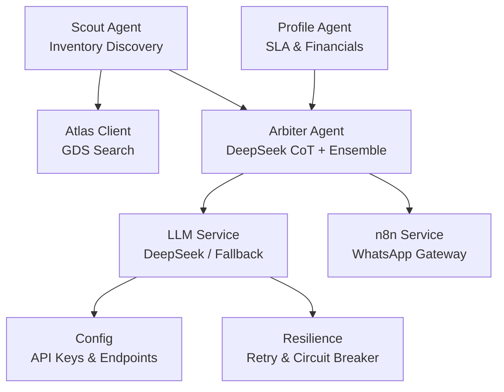
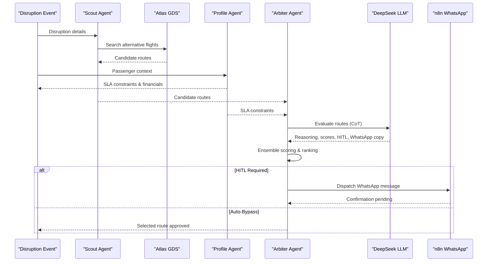
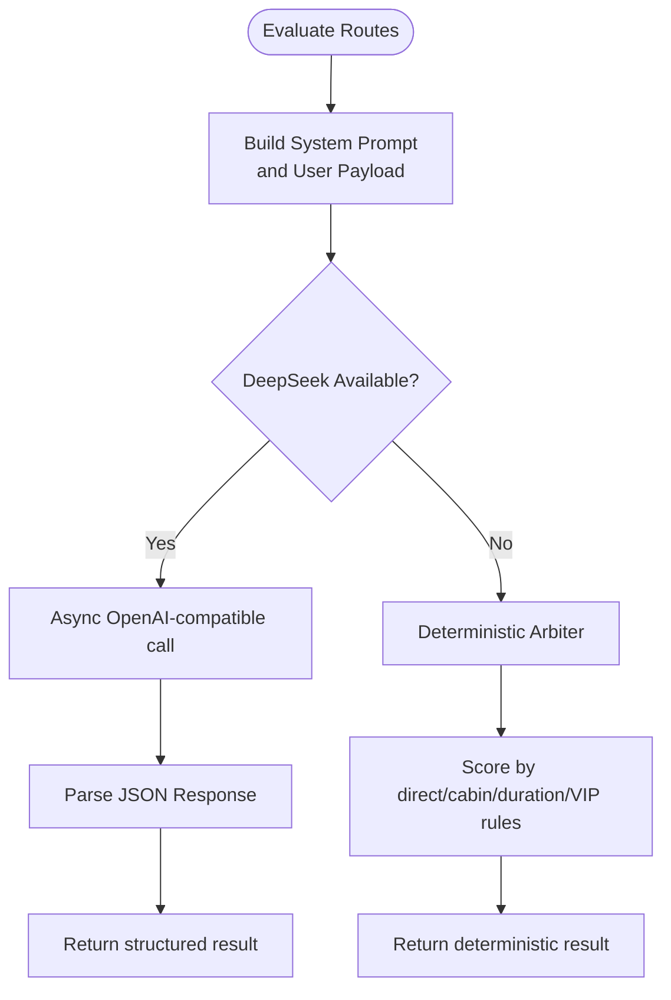
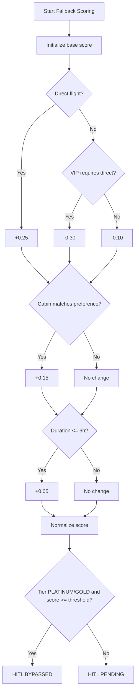
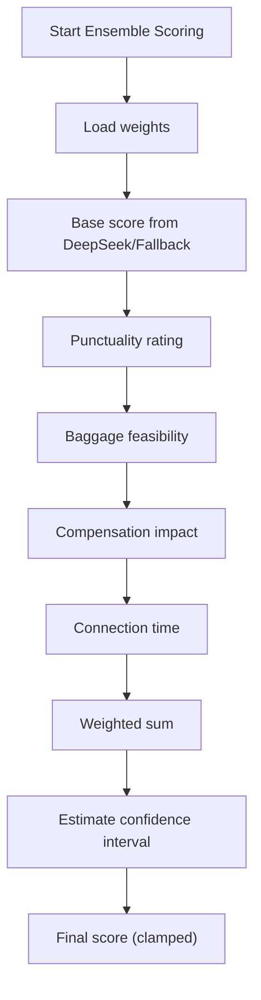
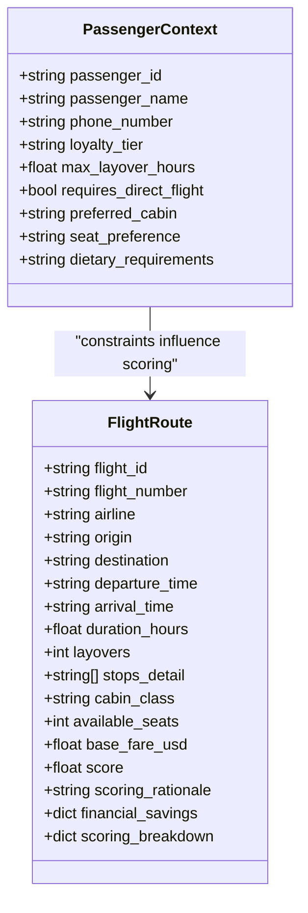
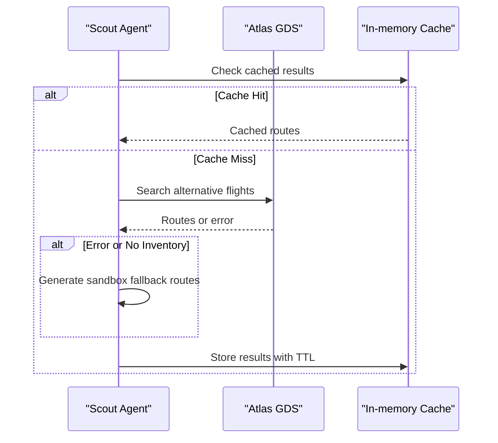
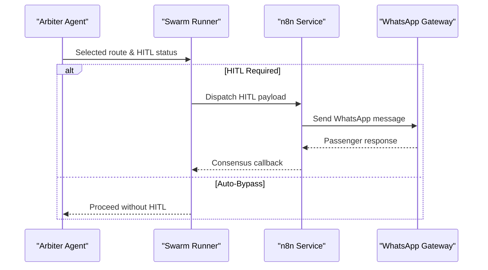
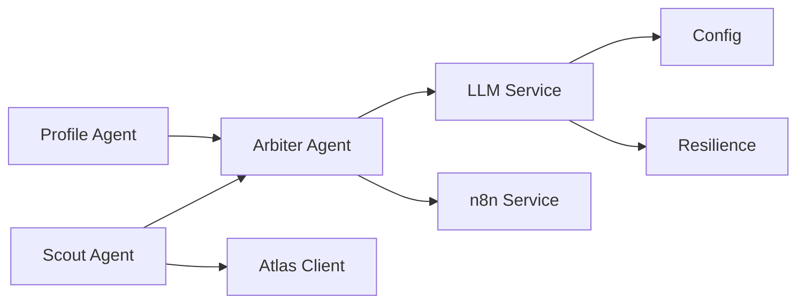

# DeepSeek Cloud Model Integration

<cite>
**Referenced Files in This Document**
- [llm_service.py](file://travel-recovery-os/backend/services/llm_service.py)
- [arbiter.py](file://travel-recovery-os/backend/agents/arbiter.py)
- [profile.py](file://travel-recovery-os/backend/agents/profile.py)
- [scout.py](file://travel-recovery-os/backend/agents/scout.py)
- [atlas_client.py](file://travel-recovery-os/backend/tools/atlas_client.py)
- [state.py](file://travel-recovery-os/backend/state.py)
- [config.py](file://travel-recovery-os/backend/config.py)
- [resilience.py](file://travel-recovery-os/backend/middleware/resilience.py)
- [n8n_service.py](file://travel-recovery-os/backend/services/n8n_service.py)
- [swarm_runner.py](file://travel-recovery-os/backend/services/swarm_runner.py)
</cite>

## Table of Contents
1. [Introduction](#introduction)
2. [Project Structure](#project-structure)
3. [Core Components](#core-components)
4. [Architecture Overview](#architecture-overview)
5. [Detailed Component Analysis](#detailed-component-analysis)
6. [Dependency Analysis](#dependency-analysis)
7. [Performance Considerations](#performance-considerations)
8. [Troubleshooting Guide](#troubleshooting-guide)
9. [Conclusion](#conclusion)
10. [Appendices](#appendices)

## Introduction
This document explains the DeepSeek cloud LLM integration used for multi-criteria route optimization and Chain-of-Thought (CoT) reasoning within the Travel Recovery OS. It covers how alternative flights are evaluated based on passenger loyalty tiers, cabin class preferences, layover tolerances, and operational constraints. It also documents the structured output format produced by the system (reasoning traces, confidence scores, HITL status, and WhatsApp message generation), the scoring algorithm that considers direct flights, cabin matching, duration constraints, and VIP tier requirements, and the deterministic fallback arbiter that ensures consistent routing decisions when DeepSeek is unavailable.

## Project Structure
The integration spans several modules:
- Agent layer: Scout discovers candidate routes; Profile derives SLA constraints; Arbiter evaluates and ranks routes using DeepSeek CoT and ensemble scoring.
- Service layer: LLM service orchestrates DeepSeek calls with resilience; n8n service dispatches HITL messages to WhatsApp.
- Tooling: Atlas client integrates with GDS sandbox/live APIs to source inventory.
- State and config: Typed state schema defines data contracts; configuration centralizes API keys and endpoints.
- Resilience: Circuit breakers and retry logic protect external dependencies.

**Diagram sources**
- [scout.py:32-86](file://travel-recovery-os/backend/agents/scout.py#L32-L86)
- [atlas_client.py:175-219](file://travel-recovery-os/backend/tools/atlas_client.py#L175-L219)
- [profile.py:58-126](file://travel-recovery-os/backend/agents/profile.py#L58-L126)
- [arbiter.py:128-243](file://travel-recovery-os/backend/agents/arbiter.py#L128-L243)
- [llm_service.py:126-205](file://travel-recovery-os/backend/services/llm_service.py#L126-L205)
- [n8n_service.py:77-125](file://travel-recovery-os/backend/services/n8n_service.py#L77-L125)
- [config.py:46-70](file://travel-recovery-os/backend/config.py#L46-L70)
- [resilience.py:221-243](file://travel-recovery-os/backend/middleware/resilience.py#L221-L243)

**Section sources**
- [scout.py:32-86](file://travel-recovery-os/backend/agents/scout.py#L32-L86)
- [profile.py:58-126](file://travel-recovery-os/backend/agents/profile.py#L58-L126)
- [arbiter.py:128-243](file://travel-recovery-os/backend/agents/arbiter.py#L128-L243)
- [llm_service.py:126-205](file://travel-recovery-os/backend/services/llm_service.py#L126-L205)
- [atlas_client.py:175-219](file://travel-recovery-os/backend/tools/atlas_client.py#L175-L219)
- [n8n_service.py:77-125](file://travel-recovery-os/backend/services/n8n_service.py#L77-L125)
- [config.py:46-70](file://travel-recovery-os/backend/config.py#L46-L70)
- [resilience.py:221-243](file://travel-recovery-os/backend/middleware/resilience.py#L221-L243)

## Core Components
- DeepSeek CoT Engine: Provides chain-of-thought evaluation of candidate routes against passenger SLAs, loyalty tier rules, cabin preferences, and layover tolerances. Returns structured JSON including reasoning trace, best flight number, confidence score, HITL status, scored routes, and a personalized WhatsApp message.
- Deterministic Fallback Arbiter: When DeepSeek is unavailable or misconfigured, a deterministic engine applies explicit weights for direct flights, cabin matching, duration constraints, and VIP direct-flight requirements to produce consistent decisions.
- Ensemble Scoring: The Arbiter augments the base score from DeepSeek (or fallback) with multi-factor weighted scoring incorporating punctuality, baggage feasibility, compensation impact, and connection time adequacy.
- Passenger Profile & SLA Rules: Derives dynamic constraints per loyalty tier (PLATINUM/GOLD/SILVER/STANDARD), including max layovers, preferred cabin, auto-approve allowance, and financial liability metrics.
- Inventory Sourcing: Scout queries Atlas GDS sandbox/live APIs to obtain candidate routes, which are then evaluated by Arbiter.
- WhatsApp HITL Dispatch: If HITL is required, the system sends a structured message via n8n to the passenger’s WhatsApp with quick-reply actions for approval or rejection.

**Section sources**
- [llm_service.py:126-205](file://travel-recovery-os/backend/services/llm_service.py#L126-L205)
- [llm_service.py:208-278](file://travel-recovery-os/backend/services/llm_service.py#L208-L278)
- [arbiter.py:22-113](file://travel-recovery-os/backend/agents/arbiter.py#L22-L113)
- [profile.py:17-43](file://travel-recovery-os/backend/agents/profile.py#L17-L43)
- [profile.py:58-126](file://travel-recovery-os/backend/agents/profile.py#L58-L126)
- [scout.py:32-86](file://travel-recovery-os/backend/agents/scout.py#L32-L86)
- [n8n_service.py:77-125](file://travel-recovery-os/backend/services/n8n_service.py#L77-L125)

## Architecture Overview
The workflow begins with disruption ingestion and passenger context resolution. Candidate routes are sourced from Atlas, then evaluated by the Arbiter using DeepSeek CoT. The result is augmented with ensemble scoring and sorted to select the best route. If HITL is required, a WhatsApp message is dispatched via n8n; otherwise, the decision bypasses human intervention for eligible tiers.

**Diagram sources**
- [scout.py:32-86](file://travel-recovery-os/backend/agents/scout.py#L32-L86)
- [atlas_client.py:175-219](file://travel-recovery-os/backend/tools/atlas_client.py#L175-L219)
- [profile.py:58-126](file://travel-recovery-os/backend/agents/profile.py#L58-L126)
- [arbiter.py:128-243](file://travel-recovery-os/backend/agents/arbiter.py#L128-L243)
- [llm_service.py:126-205](file://travel-recovery-os/backend/services/llm_service.py#L126-L205)
- [n8n_service.py:77-125](file://travel-recovery-os/backend/services/n8n_service.py#L77-L125)

## Detailed Component Analysis

### DeepSeek CoT Evaluation and Structured Output
- Purpose: Evaluate candidate routes using Chain-of-Thought reasoning tailored to passenger loyalty tiers, cabin preferences, and layover tolerances.
- Input: Passenger profile, candidate routes, disruption event.
- Output schema includes:
  - reasoning_trace: Detailed comparison across candidates.
  - best_flight_number: Recommended flight.
  - confidence_score: Overall confidence in selection.
  - hitl_status: BYPASSED or PENDING based on tier and score thresholds.
  - scored_routes: Per-route scores and rationales.
  - whatsapp_message: Personalized message for passenger notification.
- Resilience: Wrapped with circuit breaker and retries; falls back to deterministic arbiter if DeepSeek is unavailable or misconfigured.

**Diagram sources**
- [llm_service.py:126-205](file://travel-recovery-os/backend/services/llm_service.py#L126-L205)
- [llm_service.py:208-278](file://travel-recovery-os/backend/services/llm_service.py#L208-L278)

**Section sources**
- [llm_service.py:126-205](file://travel-recovery-os/backend/services/llm_service.py#L126-L205)
- [llm_service.py:208-278](file://travel-recovery-os/backend/services/llm_service.py#L208-L278)

### Deterministic Fallback Arbiter
- Purpose: Provide consistent routing decisions when DeepSeek is unavailable.
- Scoring logic:
  - Direct flights receive a positive boost; violations of VIP direct constraints incur penalties.
  - Cabin class matching adds a positive boost.
  - Shorter durations provide a small positive adjustment.
  - Scores are normalized to a bounded range.
- Decision logic:
  - For PLATINUM/GOLD tiers, if the best score meets threshold, HITL is bypassed; otherwise, HITL remains pending.
  - Generates a standardized WhatsApp message template for passenger confirmation.

**Diagram sources**
- [llm_service.py:208-278](file://travel-recovery-os/backend/services/llm_service.py#L208-L278)

**Section sources**
- [llm_service.py:208-278](file://travel-recovery-os/backend/services/llm_service.py#L208-L278)

### Ensemble Scoring in Arbiter
- Purpose: Combine DeepSeek base score with additional operational factors to produce a final composite score and confidence interval.
- Factors and weights:
  - Base score: 0.35
  - Punctuality rating: 0.20
  - Baggage feasibility: 0.15
  - Compensation impact: 0.10
  - Connection time: 0.20
- Additional logic:
  - Baggage transfer time and interline eligibility influence feasibility score.
  - Compensation cost ratio relative to fare affects compensation impact score.
  - Connection viability across multi-leg segments influences connection time score.
  - Confidence intervals are estimated from variance across sub-scores.
- HITL override:
  - For PLATINUM/GOLD tiers, high ensemble scores can auto-bypass HITL; lower scores require HITL.

**Diagram sources**
- [arbiter.py:22-113](file://travel-recovery-os/backend/agents/arbiter.py#L22-L113)

**Section sources**
- [arbiter.py:22-113](file://travel-recovery-os/backend/agents/arbiter.py#L22-L113)
- [arbiter.py:128-243](file://travel-recovery-os/backend/agents/arbiter.py#L128-L243)

### Passenger Profile and Loyalty SLA Rules
- Purpose: Derive dynamic SLA constraints and financial liability metrics based on loyalty tier and disruption severity.
- Tier-specific rules:
  - PLATINUM: Strictest constraints (no layovers, Business cabin preference, auto-approve allowed).
  - GOLD: Moderate constraints (up to one short layover, Business cabin preference, auto-approve allowed).
  - SILVER/STANDARD: More flexible constraints (higher layover tolerance, Economy cabin preference, no auto-approve).
- Financial arbitrage:
  - Calculates potential airline savings, hotel penalty avoidance, and SLA liability based on delay magnitude and tier.

**Diagram sources**
- [state.py:33-65](file://travel-recovery-os/backend/state.py#L33-L65)

**Section sources**
- [profile.py:17-43](file://travel-recovery-os/backend/agents/profile.py#L17-L43)
- [profile.py:58-126](file://travel-recovery-os/backend/agents/profile.py#L58-L126)
- [state.py:33-65](file://travel-recovery-os/backend/state.py#L33-L65)

### Inventory Sourcing via Atlas GDS
- Purpose: Discover viable alternative routes for disrupted passengers.
- Behavior:
  - Queries official Atlas GDS sandbox/live APIs with proper headers and date formatting.
  - Normalizes results into candidate routes with attributes like cabin class, duration, layovers, and fares.
  - Implements TTL caching and resilient fallback to high-fidelity sandbox simulation when live search fails or has no inventory.

**Diagram sources**
- [scout.py:32-86](file://travel-recovery-os/backend/agents/scout.py#L32-L86)
- [atlas_client.py:175-219](file://travel-recovery-os/backend/tools/atlas_client.py#L175-L219)
- [atlas_client.py:360-425](file://travel-recovery-os/backend/tools/atlas_client.py#L360-L425)

**Section sources**
- [scout.py:32-86](file://travel-recovery-os/backend/agents/scout.py#L32-L86)
- [atlas_client.py:175-219](file://travel-recovery-os/backend/tools/atlas_client.py#L175-L219)
- [atlas_client.py:360-425](file://travel-recovery-os/backend/tools/atlas_client.py#L360-L425)

### WhatsApp HITL Message Generation
- Purpose: Notify passengers of rebooking options and collect consent when human-in-the-loop is required.
- Behavior:
  - Constructs a structured payload with passenger details, recommended flight, and quick-reply actions.
  - Dispatches via n8n webhook to the WhatsApp gateway.
  - Supports callback URLs for approval/rejection consensus handling.

**Diagram sources**
- [swarm_runner.py:150-181](file://travel-recovery-os/backend/services/swarm_runner.py#L150-L181)
- [n8n_service.py:77-125](file://travel-recovery-os/backend/services/n8n_service.py#L77-L125)

**Section sources**
- [swarm_runner.py:150-181](file://travel-recovery-os/backend/services/swarm_runner.py#L150-L181)
- [n8n_service.py:77-125](file://travel-recovery-os/backend/services/n8n_service.py#L77-L125)

## Dependency Analysis
- Cohesion: Each agent focuses on a specific responsibility (inventory discovery, SLA derivation, evaluation/ranking).
- Coupling:
  - Arbiter depends on LLM service for CoT evaluation and on ensemble inputs from other agents (baggage, compensation, multi-leg).
  - LLM service depends on configuration for API keys/endpoints and resilience middleware for reliability.
  - Scout depends on Atlas client for inventory sourcing.
  - Swarm runner coordinates HITL dispatch to n8n.
- External integrations:
  - DeepSeek cloud model via OpenAI-compatible interface.
  - Atlas GDS sandbox/live APIs for flight inventory.
  - n8n webhook for WhatsApp messaging.

**Diagram sources**
- [profile.py:58-126](file://travel-recovery-os/backend/agents/profile.py#L58-L126)
- [scout.py:32-86](file://travel-recovery-os/backend/agents/scout.py#L32-L86)
- [arbiter.py:128-243](file://travel-recovery-os/backend/agents/arbiter.py#L128-L243)
- [llm_service.py:126-205](file://travel-recovery-os/backend/services/llm_service.py#L126-L205)
- [config.py:46-70](file://travel-recovery-os/backend/config.py#L46-L70)
- [resilience.py:221-243](file://travel-recovery-os/backend/middleware/resilience.py#L221-L243)
- [atlas_client.py:175-219](file://travel-recovery-os/backend/tools/atlas_client.py#L175-L219)
- [n8n_service.py:77-125](file://travel-recovery-os/backend/services/n8n_service.py#L77-L125)

**Section sources**
- [profile.py:58-126](file://travel-recovery-os/backend/agents/profile.py#L58-L126)
- [scout.py:32-86](file://travel-recovery-os/backend/agents/scout.py#L32-L86)
- [arbiter.py:128-243](file://travel-recovery-os/backend/agents/arbiter.py#L128-L243)
- [llm_service.py:126-205](file://travel-recovery-os/backend/services/llm_service.py#L126-L205)
- [config.py:46-70](file://travel-recovery-os/backend/config.py#L46-L70)
- [resilience.py:221-243](file://travel-recovery-os/backend/middleware/resilience.py#L221-L243)
- [atlas_client.py:175-219](file://travel-recovery-os/backend/tools/atlas_client.py#L175-L219)
- [n8n_service.py:77-125](file://travel-recovery-os/backend/services/n8n_service.py#L77-L125)

## Performance Considerations
- Latency: DeepSeek calls are wrapped with retries and circuit breakers to mitigate transient failures; timeouts are set to avoid blocking long-running requests.
- Throughput: In-memory TTL caching for Atlas searches reduces repeated network calls and improves responsiveness under load.
- Scoring efficiency: Ensemble scoring uses lightweight calculations over precomputed fields; confidence intervals are approximated to keep overhead low.
- Resilience: Circuit breakers prevent cascading failures when external services degrade; fallback paths ensure continuity.

[No sources needed since this section provides general guidance]

## Troubleshooting Guide
- DeepSeek unavailability:
  - Symptoms: HITL always required or fallback engine name indicates emulation mode.
  - Checks: Ensure DEEPSEEK_API_KEY and endpoint settings are configured; verify circuit breaker not persistently open.
  - Fallback: Deterministic arbiter will run with explicit weights; review reasoning steps for consistency.
- Atlas search failures:
  - Symptoms: No candidate routes returned or sandbox fallback triggered.
  - Checks: Validate ATLAS_BASE_URL and credentials; confirm date formatting and future compliance for sandbox.
  - Fallback: High-fidelity sandbox simulation provides realistic alternatives for testing.
- WhatsApp delivery issues:
  - Symptoms: HITL messages not reaching passengers or callbacks missing.
  - Checks: Verify N8N_API_URL and webhook configuration; inspect payloads for required fields.
  - Resolution: Re-send via n8n service with updated payload; monitor consensus callback endpoints.

**Section sources**
- [llm_service.py:126-205](file://travel-recovery-os/backend/services/llm_service.py#L126-L205)
- [llm_service.py:208-278](file://travel-recovery-os/backend/services/llm_service.py#L208-L278)
- [atlas_client.py:175-219](file://travel-recovery-os/backend/tools/atlas_client.py#L175-L219)
- [n8n_service.py:77-125](file://travel-recovery-os/backend/services/n8n_service.py#L77-L125)
- [config.py:46-70](file://travel-recovery-os/backend/config.py#L46-L70)
- [resilience.py:221-243](file://travel-recovery-os/backend/middleware/resilience.py#L221-L243)

## Conclusion
The DeepSeek cloud LLM integration enables sophisticated, multi-criteria route optimization with transparent Chain-of-Thought reasoning. The system balances passenger preferences and operational constraints through a robust pipeline: inventory discovery, SLA derivation, CoT evaluation, ensemble scoring, and HITL workflows. When DeepSeek is unavailable, the deterministic fallback arbiter ensures consistent decisions grounded in explicit scoring weights and tier-based rules. This design delivers both high-quality recommendations and reliable operation under varying conditions.

[No sources needed since this section summarizes without analyzing specific files]

## Appendices

### Example Passenger Profiles
- PLATINUM VIP: Requires direct flights, Business cabin preference, auto-approve allowed; strict layover limits.
- GOLD Elite: Allows limited layovers, Business cabin preference, auto-approve allowed; moderate constraints.
- SILVER: Economy cabin preference, higher layover tolerance, no auto-approve; balanced flexibility.
- STANDARD: Most flexible constraints, Economy cabin preference, no auto-approve.

**Section sources**
- [profile.py:58-126](file://travel-recovery-os/backend/agents/profile.py#L58-L126)

### Example Candidate Routes
- Direct Business class flight with high punctuality rating and short duration.
- One-stop Economy class flight with moderate duration and acceptable connection time.
- Multi-leg itinerary with verified connection viability and reasonable transfer times.

**Section sources**
- [atlas_client.py:175-219](file://travel-recovery-os/backend/tools/atlas_client.py#L175-L219)
- [atlas_client.py:360-425](file://travel-recovery-os/backend/tools/atlas_client.py#L360-L425)

### Evaluation Results Schema
- reasoning_trace: Narrative comparing candidates against SLAs and preferences.
- best_flight_number: Recommended flight identifier.
- confidence_score: Numeric confidence in selection.
- hitl_status: BYPASSED or PENDING based on tier and score thresholds.
- scored_routes: Array of per-route evaluations with scores and rationales.
- whatsapp_message: Personalized message for passenger notification.

**Section sources**
- [llm_service.py:126-205](file://travel-recovery-os/backend/services/llm_service.py#L126-L205)
- [llm_service.py:208-278](file://travel-recovery-os/backend/services/llm_service.py#L208-L278)