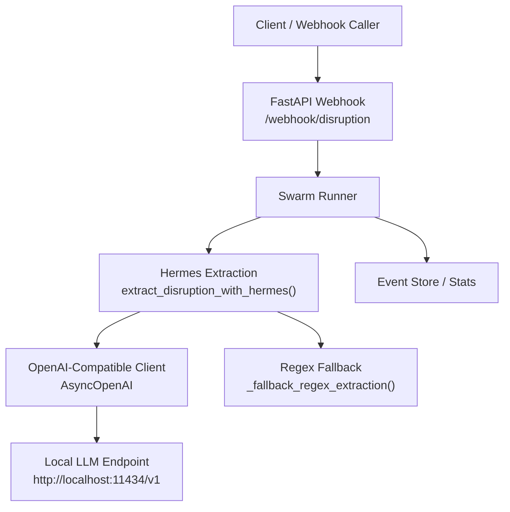
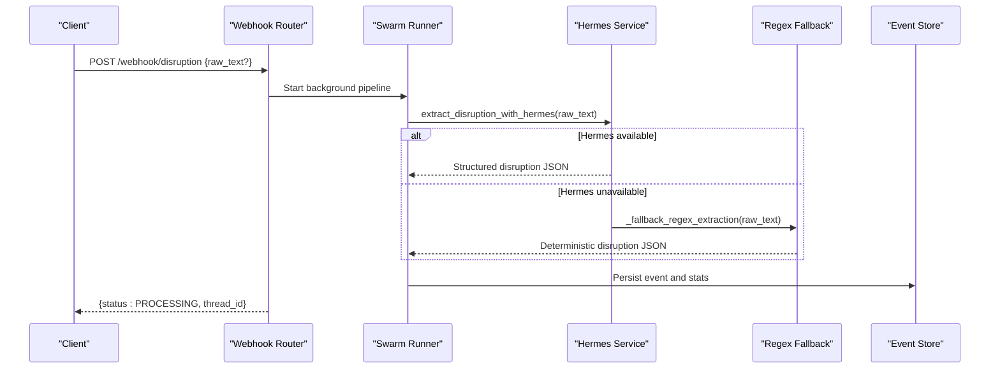
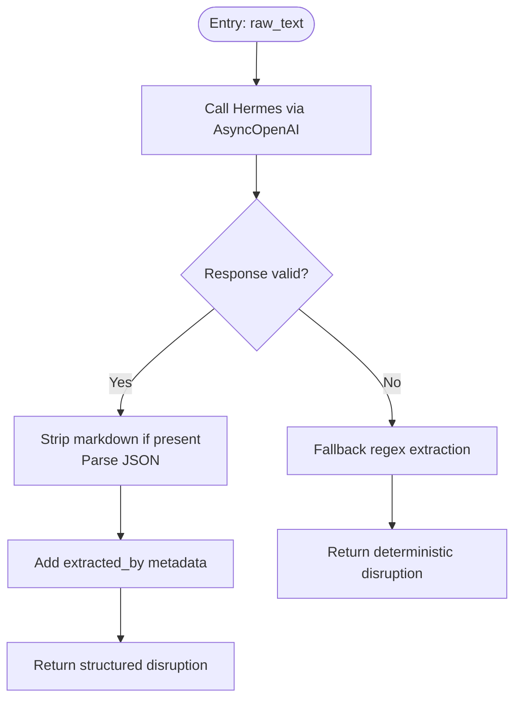
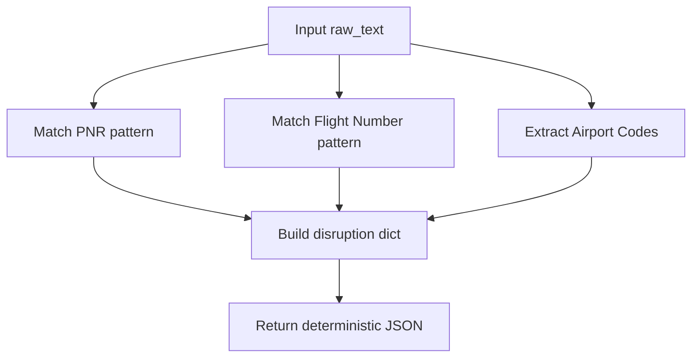
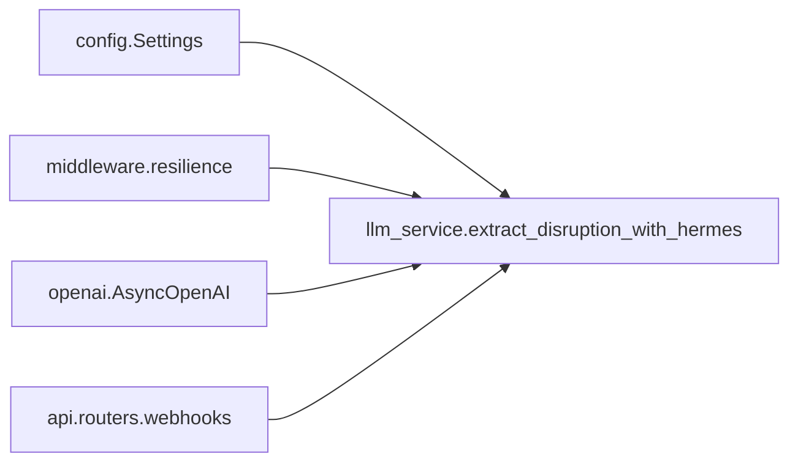

# Hermes Local Model Integration

<cite>
**Referenced Files in This Document**
- [llm_service.py](file://travel-recovery-os/backend/services/llm_service.py)
- [config.py](file://travel-recovery-os/backend/config.py)
- [resilience.py](file://travel-recovery-os/backend/middleware/resilience.py)
- [api_models.py](file://travel-recovery-os/backend/schemas/api_models.py)
- [webhooks.py](file://travel-recovery-os/backend/api/routers/webhooks.py)
- [test_swarm.py](file://travel-recovery-os/backend/test_swarm.py)
</cite>

## Table of Contents
1. Introduction
2. Project Structure
3. Core Components
4. Architecture Overview
5. Detailed Component Analysis
6. Dependency Analysis
7. Performance Considerations
8. Troubleshooting Guide
9. Conclusion
10. Appendices

## Introduction
This document explains the Hermes local LLM integration used to extract structured disruption information from unstructured aviation text such as NOTAMs, SMS alerts, and operational messages. It covers:
- OpenAI-compatible interface setup for a local model endpoint
- Prompt engineering patterns for extracting PNR codes, flight numbers, airline names, routes, delay minutes, reasons, and severity
- JSON schema enforcement for consistent output
- Fallback mechanism using regex-based extraction when Hermes is unavailable
- Temperature settings, response formatting, and quality assurance measures
- Performance characteristics and optimization techniques for high-volume feeds

## Project Structure
The Hermes integration lives in the backend services layer and integrates with FastAPI webhooks that accept either raw text or structured payloads. Configuration is centralized, and resilience (retry + circuit breaker) protects against service outages.

**Diagram sources**
- [webhooks.py:14-72](file://travel-recovery-os/backend/api/routers/webhooks.py#L14-L72)
- [llm_service.py:34-96](file://travel-recovery-os/backend/services/llm_service.py#L34-L96)
- [config.py:51-54](file://travel-recovery-os/backend/config.py#L51-L54)

**Section sources**
- [webhooks.py:14-72](file://travel-recovery-os/backend/api/routers/webhooks.py#L14-L72)
- [llm_service.py:34-96](file://travel-recovery-os/backend/services/llm_service.py#L34-L96)
- [config.py:51-54](file://travel-recovery-os/backend/config.py#L51-L54)

## Core Components
- Hermes extraction service: Calls a local model via an OpenAI-compatible client, enforces strict JSON output, and adds provenance metadata.
- Regex fallback: Deterministic extraction when Hermes is down or fails.
- Resilience middleware: Exponential backoff retry and circuit breaker to protect against transient failures.
- Configuration: Centralized settings for Hermes endpoint, model name, and API key.
- API models: Pydantic schemas defining input/output contracts for disruptions and tests.

Key responsibilities:
- Normalize heterogeneous inputs into a consistent JSON structure
- Maintain low latency and high throughput under load
- Ensure robustness through retries, circuit breaking, and deterministic fallbacks

**Section sources**
- [llm_service.py:34-120](file://travel-recovery-os/backend/services/llm_service.py#L34-L120)
- [resilience.py:25-80](file://travel-recovery-os/backend/middleware/resilience.py#L25-L80)
- [resilience.py:97-231](file://travel-recovery-os/backend/middleware/resilience.py#L97-L231)
- [config.py:51-54](file://travel-recovery-os/backend/config.py#L51-L54)
- [api_models.py:5-79](file://travel-recovery-os/backend/schemas/api_models.py#L5-L79)

## Architecture Overview
The system accepts disruption events via a webhook, optionally containing raw text. The swarm pipeline invokes Hermes to parse unstructured text into a structured disruption object. If Hermes is unavailable, the system falls back to regex-based extraction. All calls are wrapped with retry and circuit breaker logic.

**Diagram sources**
- [webhooks.py:14-72](file://travel-recovery-os/backend/api/routers/webhooks.py#L14-L72)
- [llm_service.py:34-96](file://travel-recovery-os/backend/services/llm_service.py#L34-L96)
- [llm_service.py:99-120](file://travel-recovery-os/backend/services/llm_service.py#L99-L120)

## Detailed Component Analysis

### Hermes Extraction Service
- Purpose: Convert unstructured aviation text into a strict JSON schema describing the disruption.
- Interface: Uses AsyncOpenAI with a base URL pointing to a local model server (e.g., Ollama).
- Prompt pattern: A system prompt defines the exact JSON schema and instructs the model to output only raw JSON without markdown wrappers.
- Output enrichment: Adds extracted_by field indicating the parser engine and model used.
- Resilience: Wrapped with hermes_breaker and retry_with_backoff; on failure, falls back to regex extraction.

**Diagram sources**
- [llm_service.py:42-96](file://travel-recovery-os/backend/services/llm_service.py#L42-L96)
- [llm_service.py:99-120](file://travel-recovery-os/backend/services/llm_service.py#L99-L120)

**Section sources**
- [llm_service.py:42-96](file://travel-recovery-os/backend/services/llm_service.py#L42-L96)
- [llm_service.py:99-120](file://travel-recovery-os/backend/services/llm_service.py#L99-L120)

### Regex-Based Fallback
- Purpose: Provide deterministic extraction when Hermes is offline or returns errors.
- Logic: Extracts PNR-like tokens, flight numbers, and airport codes using regular expressions; fills defaults for missing fields.
- Output: Produces the same JSON shape as the LLM path, including extracted_by metadata indicating fallback mode and error hint.

**Diagram sources**
- [llm_service.py:99-120](file://travel-recovery-os/backend/services/llm_service.py#L99-L120)

**Section sources**
- [llm_service.py:99-120](file://travel-recovery-os/backend/services/llm_service.py#L99-L120)

### OpenAI-Compatible Interface Setup
- Base URL: Configured via HERMES_API_BASE (default points to a local endpoint).
- Model: Configured via HERMES_MODEL (local model tag).
- Authentication: HERMES_API_KEY can be set; default allows local endpoints.
- Headers: Custom headers included for identification and routing.

Configuration keys:
- HERMES_API_BASE: Local endpoint base URL
- HERMES_API_KEY: Optional API key for local endpoint
- HERMES_MODEL: Model identifier for local inference

**Section sources**
- [config.py:51-54](file://travel-recovery-os/backend/config.py#L51-L54)
- [llm_service.py:59-75](file://travel-recovery-os/backend/services/llm_service.py#L59-L75)

### Prompt Engineering Patterns for Aviation Data Extraction
- System prompt defines:
  - Role: Expert aviation data extractor
  - Task: Extract disruption details into strict JSON
  - Schema: Fields include pnr, flight_number, airline, origin, destination, delay_minutes, reason, severity
  - Output constraints: Raw JSON only, no markdown, no preamble
- User message: The raw text to parse (NOTAM, SMS alert, operational message)
- Temperature: Set to a low value to maximize determinism and reduce hallucination

Quality signals:
- Strict schema guidance reduces variability
- Low temperature improves consistency for parsing tasks
- Post-processing strips markdown fences if present

**Section sources**
- [llm_service.py:43-57](file://travel-recovery-os/backend/services/llm_service.py#L43-L57)
- [llm_service.py:68-83](file://travel-recovery-os/backend/services/llm_service.py#L68-L83)

### JSON Schema Enforcement and Output Contract
- Expected JSON fields:
  - pnr: String representing booking reference
  - flight_number: String representing IATA flight code
  - airline: String representing operating carrier
  - origin: Three-letter IATA airport code
  - destination: Three-letter IATA airport code
  - delay_minutes: Integer duration in minutes
  - reason: Short summary string
  - severity: Enum-like string (CRITICAL | HIGH | MEDIUM)
  - extracted_by: Provenance metadata added by the service
- Validation:
  - Response content is parsed as JSON; markdown fences are stripped before parsing
  - On failure, fallback ensures the same contract is honored

Note: Input payloads also support optional structured fields alongside raw_text for hybrid ingestion.

**Section sources**
- [llm_service.py:43-83](file://travel-recovery-os/backend/services/llm_service.py#L43-L83)
- [api_models.py:5-79](file://travel-recovery-os/backend/schemas/api_models.py#L5-L79)

### Error Handling Strategies
- Circuit breaker: Prevents cascading failures by fast-failing when Hermes is unhealthy; transitions to HALF_OPEN after cooldown.
- Retry with backoff: Retries transient failures with exponential delay and jitter.
- Fallback: Regex-based extraction guarantees continuity even when Hermes is down.
- Metadata: extracted_by indicates which engine produced the result, aiding diagnostics and QA.

Operational notes:
- Errors are logged with operation names for traceability
- Fallback includes an error hint truncated for safety

**Section sources**
- [resilience.py:25-80](file://travel-recovery-os/backend/middleware/resilience.py#L25-L80)
- [resilience.py:97-231](file://travel-recovery-os/backend/middleware/resilience.py#L97-L231)
- [llm_service.py:85-96](file://travel-recovery-os/backend/services/llm_service.py#L85-L96)
- [llm_service.py:99-120](file://travel-recovery-os/backend/services/llm_service.py#L99-L120)

### Quality Assurance Measures
- Deterministic parsing: Low temperature and strict schema minimize variance
- Markdown stripping: Ensures robust JSON parsing regardless of model formatting
- Provenance tagging: extracted_by enables auditing and monitoring
- Test coverage: Example assertions validate presence of critical fields and provenance

**Section sources**
- [llm_service.py:68-83](file://travel-recovery-os/backend/services/llm_service.py#L68-L83)
- [test_swarm.py:36-45](file://travel-recovery-os/backend/test_swarm.py#L36-L45)

## Dependency Analysis
Hermes depends on configuration, resilience utilities, and the OpenAI-compatible client. The webhook orchestrates the flow but delegates extraction to the service layer.

**Diagram sources**
- [config.py:51-54](file://travel-recovery-os/backend/config.py#L51-L54)
- [resilience.py:221-231](file://travel-recovery-os/backend/middleware/resilience.py#L221-L231)
- [llm_service.py:59-75](file://travel-recovery-os/backend/services/llm_service.py#L59-L75)
- [webhooks.py:14-72](file://travel-recovery-os/backend/api/routers/webhooks.py#L14-L72)

**Section sources**
- [config.py:51-54](file://travel-recovery-os/backend/config.py#L51-L54)
- [resilience.py:221-231](file://travel-recovery-os/backend/middleware/resilience.py#L221-L231)
- [llm_service.py:59-75](file://travel-recovery-os/backend/services/llm_service.py#L59-L75)
- [webhooks.py:14-72](file://travel-recovery-os/backend/api/routers/webhooks.py#L14-L72)

## Performance Considerations
- Latency:
  - Hermes timeout is short to avoid blocking the request pipeline
  - Low temperature reduces token generation overhead and improves determinism
- Throughput:
  - Background processing via the webhook avoids synchronous waits for full pipeline completion
  - Retry/backoff prevents thundering herd during transient outages
- Resilience:
  - Circuit breaker limits blast radius and accelerates recovery
  - Fallback ensures continuous operation under degraded conditions
- Optimization tips:
  - Tune timeout and retry parameters based on observed latency distributions
  - Monitor extracted_by metrics to track LLM vs fallback usage
  - Batch incoming disruption events at the ingestion layer where possible
  - Cache frequent route lookups or airline mappings if needed downstream

[No sources needed since this section provides general guidance]

## Troubleshooting Guide
Common issues and resolutions:
- Hermes endpoint unreachable:
  - Symptoms: Frequent fallback usage, extracted_by indicates fallback
  - Actions: Verify HERMES_API_BASE connectivity, check local model availability, review circuit breaker logs
- Invalid JSON response:
  - Symptoms: Parsing errors despite markdown stripping
  - Actions: Inspect model output format, adjust prompt constraints, increase retry attempts
- Unexpected fields or empty values:
  - Symptoms: Missing PNR or flight number in output
  - Actions: Validate input text clarity, refine regex fallback patterns, add more examples in prompts
- High latency or timeouts:
  - Symptoms: Slow responses or timeouts
  - Actions: Reduce timeout, optimize model size, scale local endpoint horizontally

Diagnostic aids:
- Use extracted_by to identify the active engine
- Check circuit breaker state and failure thresholds
- Review logs for retry attempts and error hints

**Section sources**
- [llm_service.py:85-120](file://travel-recovery-os/backend/services/llm_service.py#L85-L120)
- [resilience.py:97-231](file://travel-recovery-os/backend/middleware/resilience.py#L97-L231)

## Conclusion
The Hermes integration provides a robust, resilient pathway to convert unstructured aviation messages into structured disruption data. By combining a strict prompt-driven JSON schema, low-temperature inference, and a deterministic regex fallback, the system maintains high availability and predictable outputs. Circuit breakers and retries ensure stability under load, while provenance metadata supports observability and quality assurance.

[No sources needed since this section summarizes without analyzing specific files]

## Appendices

### Input Examples and Expected Outputs
- Input formats supported:
  - Raw text: NOTAMs, SMS alerts, operational messages
  - Structured fields: Optional explicit fields alongside raw_text
- Expected JSON output fields:
  - pnr, flight_number, airline, origin, destination, delay_minutes, reason, severity, extracted_by
- Example references:
  - Input example in test: demonstrates typical NOTAM-style text
  - Assertions validate presence of key fields and provenance

**Section sources**
- [api_models.py:11-15](file://travel-recovery-os/backend/schemas/api_models.py#L11-L15)
- [test_swarm.py:36-45](file://travel-recovery-os/backend/test_swarm.py#L36-L45)

### Configuration Reference
- HERMES_API_BASE: Local endpoint base URL
- HERMES_API_KEY: Optional key for local endpoint
- HERMES_MODEL: Local model identifier
- DEEPSEEK_*: Separate reasoning service (not part of Hermes extraction)

**Section sources**
- [config.py:46-54](file://travel-recovery-os/backend/config.py#L46-L54)