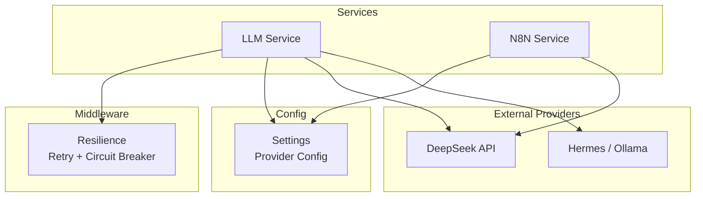
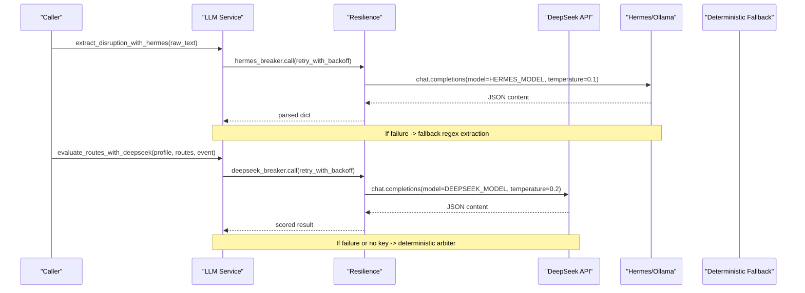
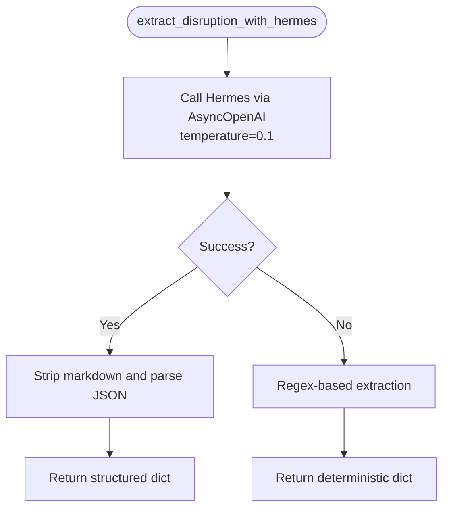
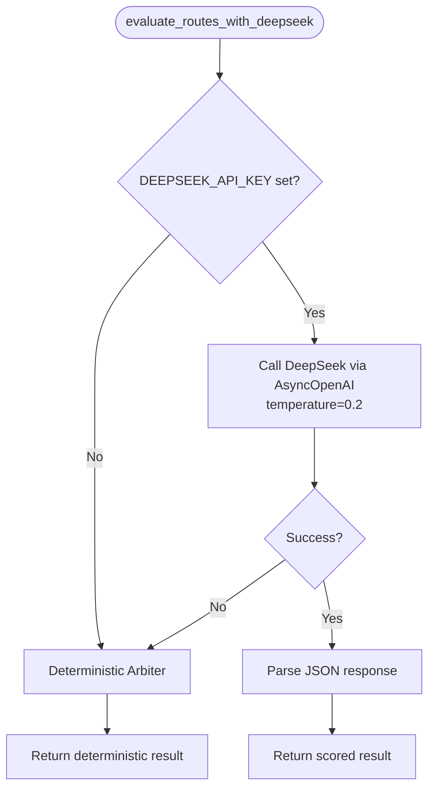
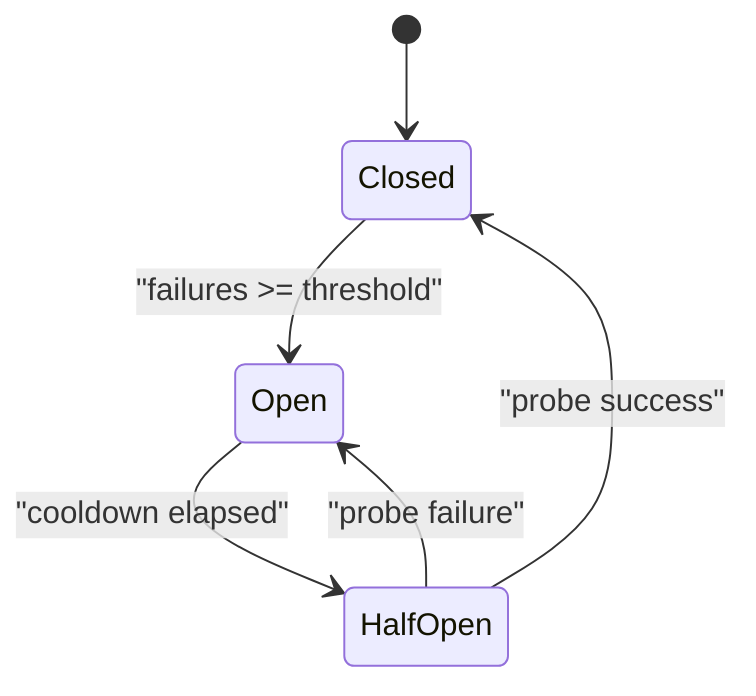
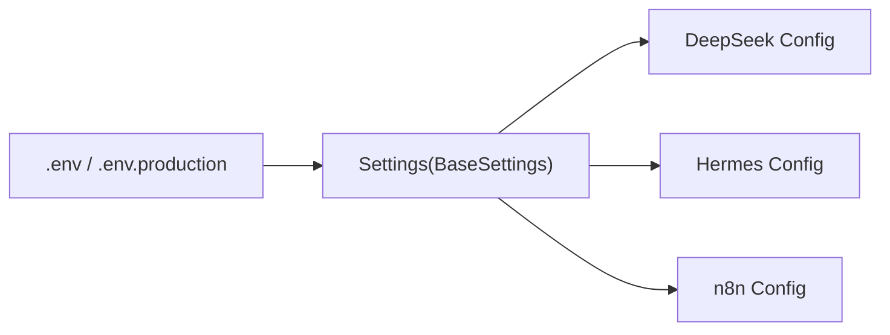
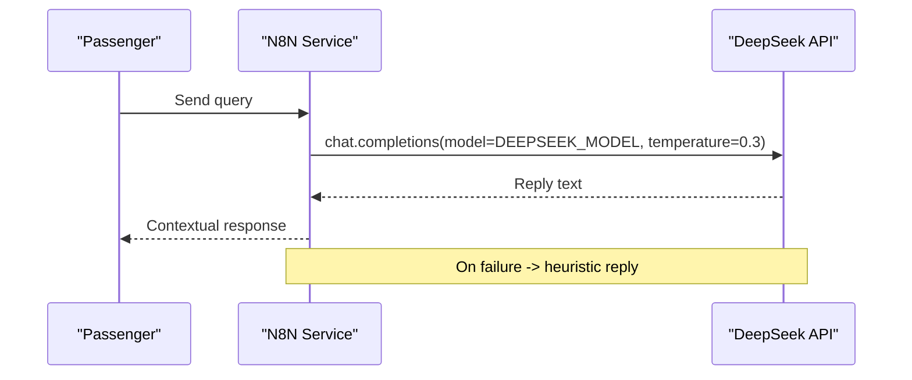
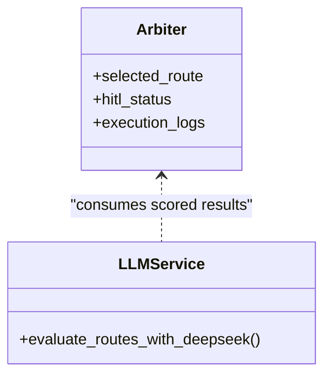
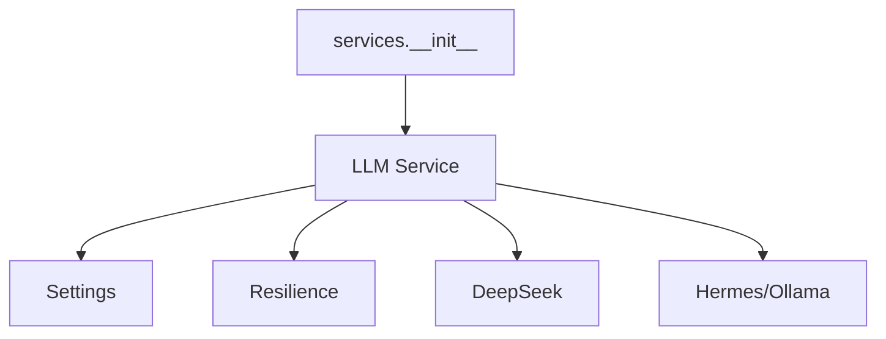

# LLM Provider Abstraction

<cite>
**Referenced Files in This Document**
- [llm_service.py](file://travel-recovery-os/backend/services/llm_service.py)
- [config.py](file://travel-recovery-os/backend/config.py)
- [resilience.py](file://travel-recovery-os/backend/middleware/resilience.py)
- [n8n_service.py](file://travel-recovery-os/backend/services/n8n_service.py)
- [__init__.py](file://travel-recovery-os/backend/services/__init__.py)
- [config.production.env.example](file://travel-recovery-os/backend/config.production.env.example)
- [arbiter.py](file://travel-recovery-os/backend/agents/arbiter.py)
- [atlas_client.py](file://travel-recovery-os/backend/tools/atlas_client.py)
</cite>

## Table of Contents
1. Introduction
2. Project Structure
3. Core Components
4. Architecture Overview
5. Detailed Component Analysis
6. Dependency Analysis
7. Performance Considerations
8. Troubleshooting Guide
9. Conclusion
10. Appendices

## Introduction
This document explains the LLM provider abstraction layer that unifies text generation, function calling, and structured output parsing across multiple AI providers: DeepSeek (cloud reasoning model) and Hermes (local model via Ollama-compatible endpoint). It covers configuration, authentication, prompt engineering patterns, resilience and fallbacks, performance characteristics, cost optimization, monitoring, and guidance for integrating new providers or custom parsers.

## Project Structure
The LLM abstraction is implemented as a service layer with resilient wrappers and environment-driven configuration:
- Service layer exposes unified async functions for extraction and route evaluation
- Middleware provides retry with backoff and circuit breakers per provider
- Configuration centralizes provider endpoints, models, and keys
- Additional services integrate with workflow automation and external APIs

**Diagram sources**
- [llm_service.py:34-205](file://travel-recovery-os/backend/services/llm_service.py#L34-L205)
- [resilience.py:25-243](file://travel-recovery-os/backend/middleware/resilience.py#L25-L243)
- [config.py:46-54](file://travel-recovery-os/backend/config.py#L46-L54)
- [n8n_service.py:230-243](file://travel-recovery-os/backend/services/n8n_service.py#L230-L243)

**Section sources**
- [llm_service.py:1-279](file://travel-recovery-os/backend/services/llm_service.py#L1-L279)
- [config.py:1-116](file://travel-recovery-os/backend/config.py#L1-L116)
- [resilience.py:1-244](file://travel-recovery-os/backend/middleware/resilience.py#L1-L244)
- [n8n_service.py:230-257](file://travel-recovery-os/backend/services/n8n_service.py#L230-L257)

## Core Components
- Unified LLM service functions:
  - Extraction using Hermes for structured JSON from unstructured disruption messages
  - Route evaluation using DeepSeek for chain-of-thought scoring and selection
- Resilience primitives:
  - Exponential backoff retries with jitter
  - Per-provider circuit breakers to fast-fail during outages
- Configuration:
  - Environment-based settings for provider endpoints, models, and secrets
  - Production validation warnings for missing critical keys

Key responsibilities:
- Provide consistent async interfaces regardless of underlying provider
- Enforce strict JSON outputs for deterministic downstream processing
- Ensure graceful degradation when providers are unavailable

**Section sources**
- [llm_service.py:34-205](file://travel-recovery-os/backend/services/llm_service.py#L34-L205)
- [resilience.py:25-243](file://travel-recovery-os/backend/middleware/resilience.py#L25-L243)
- [config.py:46-54](file://travel-recovery-os/backend/config.py#L46-L54)

## Architecture Overview
The system uses an OpenAI-compatible client to call both DeepSeek and Hermes endpoints. Each call is wrapped with retry and circuit breaker logic, and falls back to deterministic engines if needed.

**Diagram sources**
- [llm_service.py:34-205](file://travel-recovery-os/backend/services/llm_service.py#L34-L205)
- [resilience.py:25-243](file://travel-recovery-os/backend/middleware/resilience.py#L25-L243)

## Detailed Component Analysis

### LLM Service: Hermes Extraction
- Purpose: Extract structured disruption data from raw operational text using Hermes (Ollama-compatible).
- Prompt pattern: System prompt enforces strict JSON schema; user message contains raw text.
- Temperature: Low (0.1) to maximize determinism for parsing.
- Resilience: Wrapped with hermes_breaker and retry_with_backoff; falls back to regex-based extraction on failure.
- Output: Structured dict with fields like pnr, flight_number, airline, origin, destination, delay_minutes, reason, severity, extracted_by.

**Diagram sources**
- [llm_service.py:34-120](file://travel-recovery-os/backend/services/llm_service.py#L34-L120)

**Section sources**
- [llm_service.py:34-120](file://travel-recovery-os/backend/services/llm_service.py#L34-L120)

### LLM Service: DeepSeek Route Evaluation
- Purpose: Evaluate candidate routes using DeepSeek with chain-of-thought reasoning and SLA-aware scoring.
- Prompt pattern: System prompt defines criteria (loyalty tier, cabin class, direct flights), requires strict JSON output including reasoning_trace, best_flight_number, confidence_score, hitl_status, scored_routes, whatsapp_message.
- Temperature: Low (0.2) to balance creativity with reliability.
- Resilience: Wrapped with deepseek_breaker and retry_with_backoff; falls back to deterministic arbiter if unavailable or key missing.
- Output: Structured dict with scoring details and human-in-the-loop status.

**Diagram sources**
- [llm_service.py:126-279](file://travel-recovery-os/backend/services/llm_service.py#L126-L279)

**Section sources**
- [llm_service.py:126-279](file://travel-recovery-os/backend/services/llm_service.py#L126-L279)

### Resilience Layer: Retry and Circuit Breaker
- Retry with exponential backoff:
  - Configurable max_retries, base_delay, max_delay, jitter
  - Logs attempts and final error after exhaustion
- Circuit Breaker:
  - States: CLOSED, OPEN, HALF_OPEN
  - Fast-fails when failures exceed threshold
  - Auto-transitions to HALF_OPEN after cooldown; probe success closes circuit
- Pre-built breakers:
  - deepseek_breaker, hermes_breaker, atlas_breaker, n8n_breaker

**Diagram sources**
- [resilience.py:86-215](file://travel-recovery-os/backend/middleware/resilience.py#L86-L215)

**Section sources**
- [resilience.py:25-243](file://travel-recovery-os/backend/middleware/resilience.py#L25-L243)

### Configuration and Authentication
- Settings object loads environment variables and .env files based on ENVIRONMENT profile
- Provider-specific keys and endpoints:
  - DeepSeek: DEEPSEEK_API_KEY, DEEPSEEK_BASE_URL, DEEPSEEK_MODEL
  - Hermes: HERMES_API_BASE, HERMES_API_KEY, HERMES_MODEL
- Production validation warns about missing critical keys
- Example production env file demonstrates recommended values

**Diagram sources**
- [config.py:29-116](file://travel-recovery-os/backend/config.py#L29-L116)
- [config.production.env.example:14-22](file://travel-recovery-os/backend/config.production.env.example#L14-L22)

**Section sources**
- [config.py:29-116](file://travel-recovery-os/backend/config.py#L29-L116)
- [config.production.env.example:1-49](file://travel-recovery-os/backend/config.production.env.example#L1-L49)

### N8N Integration and Text Generation
- Uses DeepSeek via AsyncOpenAI for contextual replies with temperature tuned for conversational tone
- Includes fallback heuristics for common passenger queries when LLM fails
- Integrates with workflow automation for human-in-the-loop approvals

**Diagram sources**
- [n8n_service.py:230-257](file://travel-recovery-os/backend/services/n8n_service.py#L230-L257)

**Section sources**
- [n8n_service.py:230-257](file://travel-recovery-os/backend/services/n8n_service.py#L230-L257)

### Arbiter Agent Integration
- Consumes LLM outputs to make decisions and log execution details
- Tracks selected route, score, HITL status, and reasoning trace
- Emits logs for observability and downstream processing

**Diagram sources**
- [arbiter.py:210-243](file://travel-recovery-os/backend/agents/arbiter.py#L210-L243)
- [llm_service.py:126-205](file://travel-recovery-os/backend/services/llm_service.py#L126-L205)

**Section sources**
- [arbiter.py:210-243](file://travel-recovery-os/backend/agents/arbiter.py#L210-L243)

## Dependency Analysis
- LLM service depends on:
  - OpenAI-compatible client for both DeepSeek and Hermes
  - Settings for provider configuration
  - Resilience utilities for retry and circuit breaking
- Services package exports unified functions for callers
- External integrations (Atlas, n8n) use their own breakers and caches

**Diagram sources**
- [llm_service.py:13-29](file://travel-recovery-os/backend/services/llm_service.py#L13-L29)
- [__init__.py:1-10](file://travel-recovery-os/backend/services/__init__.py#L1-L10)
- [resilience.py:221-243](file://travel-recovery-os/backend/middleware/resilience.py#L221-L243)
- [config.py:46-54](file://travel-recovery-os/backend/config.py#L46-L54)

**Section sources**
- [llm_service.py:13-29](file://travel-recovery-os/backend/services/llm_service.py#L13-L29)
- [__init__.py:1-10](file://travel-recovery-os/backend/services/__init__.py#L1-L10)
- [resilience.py:221-243](file://travel-recovery-os/backend/middleware/resilience.py#L221-L243)
- [config.py:46-54](file://travel-recovery-os/backend/config.py#L46-L54)

## Performance Considerations
- Model selection strategies:
  - Use Hermes for low-latency, deterministic parsing tasks (temperature 0.1)
  - Use DeepSeek for complex reasoning and multi-criteria scoring (temperature 0.2–0.3)
- Caching mechanisms:
  - In-memory TTL cache for flight searches reduces repeated API calls
- Fallback chains:
  - Regex extraction for Hermes; deterministic arbiter for DeepSeek ensures continuity
- Timeouts:
  - Short timeouts for local models; slightly longer for cloud reasoning
- Observability:
  - Execution logs include engine names and reasoning traces for quality assessment

[No sources needed since this section provides general guidance]

## Troubleshooting Guide
Common issues and resolutions:
- Provider unreachable:
  - Circuit breaker opens; requests fast-fail; system switches to deterministic fallback
- Missing API keys:
  - DeepSeek path falls back to deterministic arbiter; production startup warns about missing keys
- JSON parse errors:
  - Strip markdown backticks before parsing; ensure strict prompts enforce JSON-only output
- High latency:
  - Adjust timeouts and temperatures; consider caching and reducing payload size

**Section sources**
- [resilience.py:86-215](file://travel-recovery-os/backend/middleware/resilience.py#L86-L215)
- [config.py:92-112](file://travel-recovery-os/backend/config.py#L92-L112)
- [llm_service.py:76-83](file://travel-recovery-os/backend/services/llm_service.py#L76-L83)
- [llm_service.py:184-190](file://travel-recovery-os/backend/services/llm_service.py#L184-L190)

## Conclusion
The LLM provider abstraction delivers a unified interface for text generation, function calling, and structured output parsing across DeepSeek and Hermes. It emphasizes resilience through retry and circuit breakers, deterministic fallbacks, and environment-driven configuration. By tuning temperatures, enforcing strict JSON schemas, and leveraging caching and fallback chains, the system maintains high availability and predictable performance while supporting cost optimization and quality monitoring.

[No sources needed since this section summarizes without analyzing specific files]

## Appendices

### Provider-Specific Configuration and Authentication
- DeepSeek:
  - Keys and base URL configured via environment variables
  - Model name selectable via settings
- Hermes (Ollama):
  - Local endpoint and model name configurable
  - Optional API key for Ollama compatibility

**Section sources**
- [config.py:46-54](file://travel-recovery-os/backend/config.py#L46-L54)
- [config.production.env.example:14-22](file://travel-recovery-os/backend/config.production.env.example#L14-L22)

### Prompt Engineering Patterns
- Strict JSON enforcement:
  - System prompts define exact schema; responses must be raw JSON without markdown
- Temperature tuning:
  - Lower temperatures for parsing and scoring to reduce variability
- Chain-of-thought:
  - Include reasoning_trace in outputs for transparency and auditing

**Section sources**
- [llm_service.py:43-57](file://travel-recovery-os/backend/services/llm_service.py#L43-L57)
- [llm_service.py:141-162](file://travel-recovery-os/backend/services/llm_service.py#L141-L162)

### Integrating New LLM Providers
Steps to add a new provider:
- Add provider settings to configuration (endpoint, model, key)
- Implement a wrapper function using AsyncOpenAI-compatible client
- Wrap calls with retry_with_backoff and a dedicated circuit breaker
- Define a deterministic fallback for resilience
- Export the function via services package

**Section sources**
- [config.py:29-116](file://travel-recovery-os/backend/config.py#L29-L116)
- [resilience.py:25-243](file://travel-recovery-os/backend/middleware/resilience.py#L25-L243)
- [__init__.py:1-10](file://travel-recovery-os/backend/services/__init__.py#L1-L10)

### Custom Parsers and Error Handling
- Parsing:
  - Strip markdown backticks and parse JSON strictly
- Errors:
  - Catch exceptions at provider boundary; switch to fallback parser
  - Log error hints in fallback metadata for diagnostics

**Section sources**
- [llm_service.py:76-83](file://travel-recovery-os/backend/services/llm_service.py#L76-L83)
- [llm_service.py:99-120](file://travel-recovery-os/backend/services/llm_service.py#L99-L120)

### Cost Optimization and Usage Monitoring
- Cost optimization:
  - Prefer local models for simple parsing tasks
  - Use lower temperatures and concise prompts to reduce token usage
  - Cache frequent queries to avoid redundant calls
- Usage monitoring:
  - Log engine names and reasoning traces
  - Track node-level errors and retries in workflow execution logs

**Section sources**
- [llm_service.py:184-190](file://travel-recovery-os/backend/services/llm_service.py#L184-L190)
- [arbiter.py:210-243](file://travel-recovery-os/backend/agents/arbiter.py#L210-L243)
- [atlas_client.py:170-195](file://travel-recovery-os/backend/tools/atlas_client.py#L170-L195)