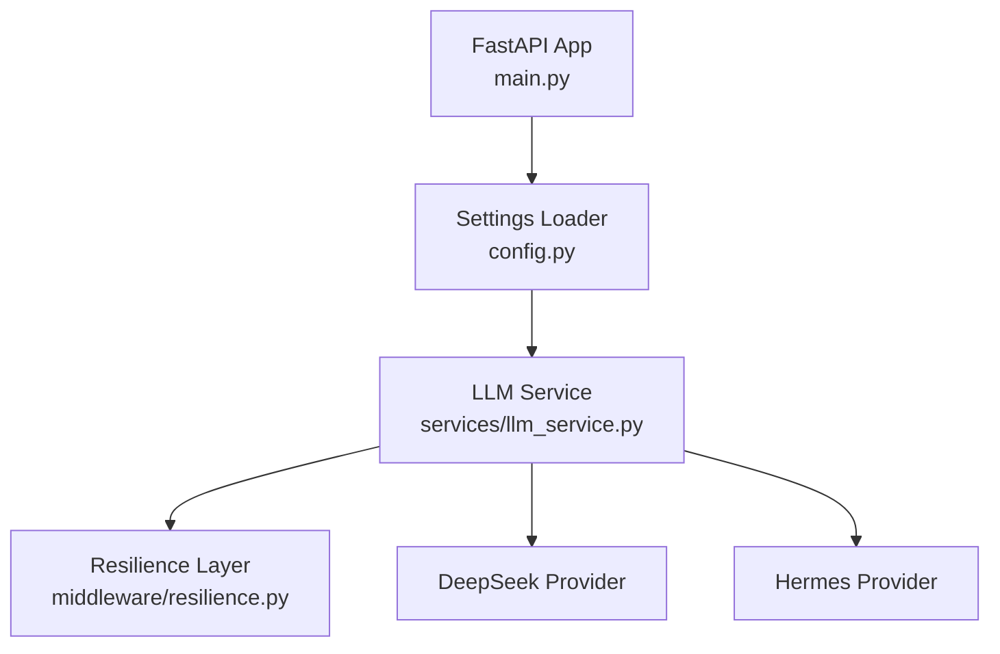
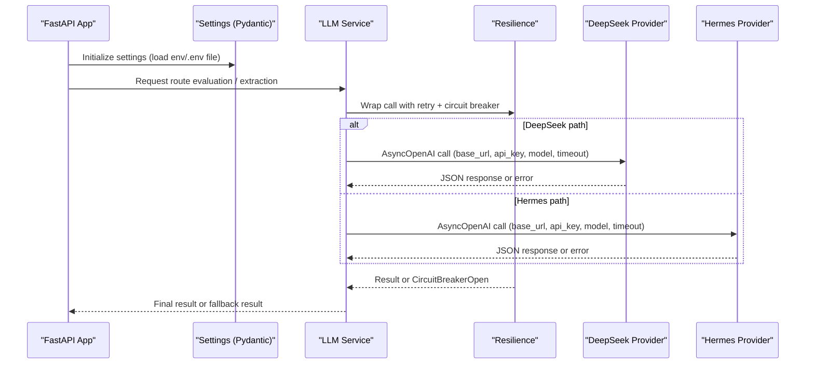
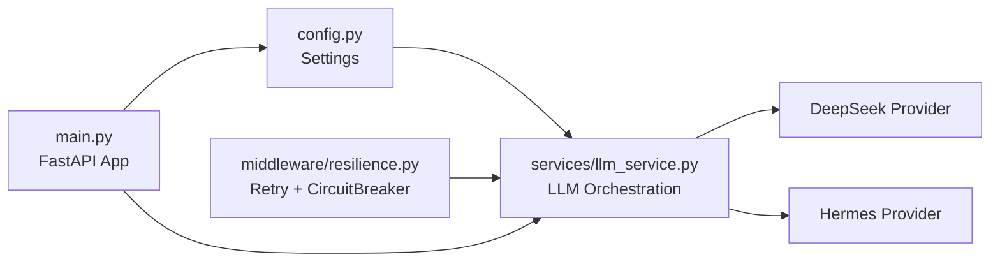

# Provider Configuration

<cite>
**Referenced Files in This Document**
- [config.py](file://travel-recovery-os/backend/config.py)
- [llm_service.py](file://travel-recovery-os/backend/services/llm_service.py)
- [resilience.py](file://travel-recovery-os/backend/middleware/resilience.py)
- [config.production.env.example](file://travel-recovery-os/backend/config.production.env.example)
- [main.py](file://travel-recovery-os/backend/main.py)
</cite>

## Table of Contents
1. [Introduction](#introduction)
2. [Project Structure](#project-structure)
3. [Core Components](#core-components)
4. [Architecture Overview](#architecture-overview)
5. [Detailed Component Analysis](#detailed-component-analysis)
6. [Dependency Analysis](#dependency-analysis)
7. [Performance Considerations](#performance-considerations)
8. [Troubleshooting Guide](#troubleshooting-guide)
9. [Conclusion](#conclusion)
10. [Appendices](#appendices)

## Introduction
This document explains how the Atlas ALibaba system configures and manages LLM providers (DeepSeek and Hermes). It covers the Pydantic-based settings structure, environment variable setup, validation behavior, security best practices for sensitive credentials, configuration schemas for each provider, example production and development configurations, secret management patterns, configuration testing procedures, fallback mechanisms when providers are unavailable, and circuit breaker configuration per provider.

## Project Structure
The provider configuration is implemented using a centralized settings module that loads values from environment files based on an environment profile. The LLM service consumes these settings to configure clients for DeepSeek and Hermes. Resilience primitives (retry with backoff and circuit breakers) protect calls to external providers.

**Diagram sources**
- [main.py:22-37](file://travel-recovery-os/backend/main.py#L22-L37)
- [config.py:20-37](file://travel-recovery-os/backend/config.py#L20-L37)
- [llm_service.py:34-96](file://travel-recovery-os/backend/services/llm_service.py#L34-L96)
- [resilience.py:221-231](file://travel-recovery-os/backend/middleware/resilience.py#L221-L231)

**Section sources**
- [main.py:22-37](file://travel-recovery-os/backend/main.py#L22-L37)
- [config.py:20-37](file://travel-recovery-os/backend/config.py#L20-L37)

## Core Components
- Settings model: Centralized Pydantic BaseSettings that loads environment variables and .env files by profile. Defines provider-specific keys and defaults.
- LLM service: Orchestrates calls to DeepSeek and Hermes using OpenAI-compatible clients configured via settings. Includes retry and circuit breaker wrappers and deterministic fallbacks.
- Resilience layer: Provides retry_with_backoff and CircuitBreaker with preconfigured instances for DeepSeek and Hermes.

Key responsibilities:
- Load and validate configuration safely across environments.
- Configure provider clients with API keys, base URLs, models, and timeouts.
- Protect provider calls with retries and circuit breakers.
- Provide deterministic fallbacks when providers are unavailable or misconfigured.

**Section sources**
- [config.py:29-115](file://travel-recovery-os/backend/config.py#L29-L115)
- [llm_service.py:34-205](file://travel-recovery-os/backend/services/llm_service.py#L34-L205)
- [resilience.py:25-80](file://travel-recovery-os/backend/middleware/resilience.py#L25-L80)
- [resilience.py:97-215](file://travel-recovery-os/backend/middleware/resilience.py#L97-L215)

## Architecture Overview
The application starts up, initializes logging and tracing, and exposes routes. Provider configuration is loaded at import time into a singleton settings object. The LLM service uses this settings object to instantiate provider clients and wraps calls with resilience primitives.

**Diagram sources**
- [main.py:22-37](file://travel-recovery-os/backend/main.py#L22-L37)
- [config.py:20-37](file://travel-recovery-os/backend/config.py#L20-L37)
- [llm_service.py:34-96](file://travel-recovery-os/backend/services/llm_service.py#L34-L96)
- [llm_service.py:170-205](file://travel-recovery-os/backend/services/llm_service.py#L170-L205)
- [resilience.py:221-231](file://travel-recovery-os/backend/middleware/resilience.py#L221-L231)

## Detailed Component Analysis

### Settings Model (Pydantic BaseSettings)
- Environment profile selection: Reads ENVIRONMENT to choose which .env file to load (.env, .env.staging, .env.production).
- Case-insensitive loading and extra key ignore for robustness.
- Provider fields:
  - DeepSeek: DEEPSEEK_API_KEY, DEEPSEEK_BASE_URL, DEEPSEEK_MODEL
  - Hermes: HERMES_API_BASE, HERMES_API_KEY, HERMES_MODEL
- Validation:
  - JWT_SECRET_KEY falls back to SYNAPSE_API_SECRET if not set.
  - Production mode warns if critical keys are missing or still default.

Security notes:
- Sensitive keys are loaded from environment variables or .env files; never hardcode secrets in code.
- In production, ensure strong, unique secrets for SYNAPSE_API_SECRET and JWT_SECRET_KEY.

Configuration examples:
- Development: Use local defaults and localhost endpoints.
- Production: Use secure endpoints and real credentials; copy the provided example template and fill all placeholders.

**Section sources**
- [config.py:20-37](file://travel-recovery-os/backend/config.py#L20-L37)
- [config.py:46-55](file://travel-recovery-os/backend/config.py#L46-L55)
- [config.py:84-112](file://travel-recovery-os/backend/config.py#L84-L112)
- [config.production.env.example:9-22](file://travel-recovery-os/backend/config.production.env.example#L9-L22)

### LLM Service: DeepSeek and Hermes Orchestration
- Hermes extraction:
  - Uses AsyncOpenAI client configured with HERMES_API_BASE, HERMES_API_KEY, HERMES_MODEL, and a short timeout.
  - Wrapped with hermes_breaker and retry_with_backoff.
  - Falls back to regex-based extraction if the circuit opens or any exception occurs.
- DeepSeek evaluation:
  - Uses AsyncOpenAI client configured with DEEPSEEK_API_KEY, DEEPSEEK_BASE_URL, DEEPSEEK_MODEL, and a short timeout.
  - Wrapped with deepseek_breaker and retry_with_backoff.
  - If no DEEPSEEK_API_KEY is configured, bypasses provider and returns deterministic scoring results.
  - Falls back to deterministic arbiter if the circuit opens or any exception occurs.

Timeouts:
- Hermes client timeout is explicitly set.
- DeepSeek client timeout is explicitly set.

Fallback behaviors:
- Deterministic parsers produce structured outputs even when LLMs are offline or misconfigured.

**Section sources**
- [llm_service.py:34-96](file://travel-recovery-os/backend/services/llm_service.py#L34-L96)
- [llm_service.py:99-120](file://travel-recovery-os/backend/services/llm_service.py#L99-L120)
- [llm_service.py:126-205](file://travel-recovery-os/backend/services/llm_service.py#L126-L205)
- [llm_service.py:208-278](file://travel-recovery-os/backend/services/llm_service.py#L208-L278)

### Resilience Layer: Retry and Circuit Breakers
- retry_with_backoff:
  - Exponential backoff with jitter and configurable max_retries, base_delay, max_delay.
  - Logs warnings and errors per attempt.
- CircuitBreaker:
  - States: CLOSED, OPEN, HALF_OPEN.
  - Opens after failure_threshold consecutive failures; transitions to HALF_OPEN after cooldown_seconds; allows one probe in HALF_OPEN.
  - Prebuilt instances:
    - deepseek_breaker: threshold=3, cooldown=60s
    - hermes_breaker: threshold=3, cooldown=45s
    - atlas_breaker: threshold=5, cooldown=30s
    - n8n_breaker: threshold=3, cooldown=30s

Usage pattern:
- LLM functions wrap provider calls inside breaker.call(retry_with_backoff(...)).
- Exceptions like CircuitBreakerOpen are caught and trigger fallback logic.

**Section sources**
- [resilience.py:25-80](file://travel-recovery-os/backend/middleware/resilience.py#L25-L80)
- [resilience.py:97-215](file://travel-recovery-os/backend/middleware/resilience.py#L97-L215)
- [resilience.py:221-231](file://travel-recovery-os/backend/middleware/resilience.py#L221-L231)

### Configuration Schema Summary
Provider fields and their roles:
- DeepSeek
  - DEEPSEEK_API_KEY: Secret used to authenticate requests.
  - DEEPSEEK_BASE_URL: Endpoint base URL for the provider.
  - DEEPSEEK_MODEL: Model identifier used for completions.
- Hermes
  - HERMES_API_BASE: Local or remote endpoint base URL (e.g., Ollama).
  - HERMES_API_KEY: Key passed to the OpenAI-compatible client (may be a placeholder for local services).
  - HERMES_MODEL: Model identifier used for completions.

Environment profiles:
- ENVIRONMENT selects the .env file: development -> .env, staging -> .env.staging, production -> .env.production.

Production example:
- See the provided production environment template for recommended values and placeholders.

**Section sources**
- [config.py:46-55](file://travel-recovery-os/backend/config.py#L46-L55)
- [config.py:20-26](file://travel-recovery-os/backend/config.py#L20-L26)
- [config.production.env.example:14-22](file://travel-recovery-os/backend/config.production.env.example#L14-L22)

### Security Best Practices
- Store secrets in environment variables or encrypted secret stores; do not commit secrets to version control.
- Use strong, unique values for SYNAPSE_API_SECRET and JWT_SECRET_KEY in production.
- Avoid logging sensitive values; ensure logs exclude secrets.
- Validate production configuration at startup; address warnings about missing or default keys before deployment.
- Restrict access to .env files and container secrets; rotate keys regularly.

**Section sources**
- [config.py:92-112](file://travel-recovery-os/backend/config.py#L92-L112)
- [config.production.env.example:9-12](file://travel-recovery-os/backend/config.production.env.example#L9-L12)

### Fallback Mechanisms
- Hermes:
  - If the circuit opens or any exception occurs, the service falls back to a regex-based extractor that produces a structured disruption payload.
- DeepSeek:
  - If no API key is configured, the service skips the provider and returns deterministic scoring results.
  - If the circuit opens or any exception occurs, the service falls back to a deterministic arbiter that scores candidate routes and generates a message.

These fallbacks ensure continuity of service when providers are unavailable or misconfigured.

**Section sources**
- [llm_service.py:85-96](file://travel-recovery-os/backend/services/llm_service.py#L85-L96)
- [llm_service.py:99-120](file://travel-recovery-os/backend/services/llm_service.py#L99-L120)
- [llm_service.py:192-205](file://travel-recovery-os/backend/services/llm_service.py#L192-L205)
- [llm_service.py:208-278](file://travel-recovery-os/backend/services/llm_service.py#L208-L278)

### Circuit Breaker Configuration
- DeepSeek:
  - Instance name: deepseek_llm
  - Failure threshold: 3
  - Cooldown: 60 seconds
- Hermes:
  - Instance name: hermes_llm
  - Failure threshold: 3
  - Cooldown: 45 seconds

These values can be adjusted by modifying the prebuilt instances in the resilience module if needed.

**Section sources**
- [resilience.py:221-231](file://travel-recovery-os/backend/middleware/resilience.py#L221-L231)

## Dependency Analysis
The following diagram shows how components depend on each other for provider configuration and execution.

**Diagram sources**
- [config.py:20-37](file://travel-recovery-os/backend/config.py#L20-L37)
- [llm_service.py:34-96](file://travel-recovery-os/backend/services/llm_service.py#L34-L96)
- [resilience.py:221-231](file://travel-recovery-os/backend/middleware/resilience.py#L221-L231)
- [main.py:22-37](file://travel-recovery-os/backend/main.py#L22-L37)

**Section sources**
- [config.py:20-37](file://travel-recovery-os/backend/config.py#L20-L37)
- [llm_service.py:34-96](file://travel-recovery-os/backend/services/llm_service.py#L34-L96)
- [resilience.py:221-231](file://travel-recovery-os/backend/middleware/resilience.py#L221-L231)
- [main.py:22-37](file://travel-recovery-os/backend/main.py#L22-L37)

## Performance Considerations
- Timeouts:
  - Hermes client timeout is set to a low value to avoid long waits on local or network-bound endpoints.
  - DeepSeek client timeout is set to a low value to keep request latency predictable.
- Retries:
  - Exponential backoff with jitter reduces thundering herd effects during transient failures.
- Circuit breakers:
  - Fast-fail on repeated failures prevents cascading delays and resource exhaustion.
- Fallbacks:
  - Deterministic parsers provide immediate responses when LLMs are down, improving perceived availability.

[No sources needed since this section provides general guidance]

## Troubleshooting Guide
Common issues and resolutions:
- Missing or default secrets in production:
  - The settings validator warns when critical keys are missing or still default. Update your environment or .env.production accordingly.
- Provider unavailability:
  - Circuit breakers will open after repeated failures; check logs for warnings and consider adjusting thresholds or cooldowns.
  - Fallbacks will activate automatically; verify fallback outputs to ensure downstream processes handle them.
- Misconfigured endpoints or models:
  - Ensure HERMES_API_BASE and DEEPSEEK_BASE_URL point to valid endpoints.
  - Confirm model names match provider expectations.
- Logging and observability:
  - Enable JSON logs in production for better parsing and monitoring.
  - Use tracing to correlate provider calls with application flows.

**Section sources**
- [config.py:92-112](file://travel-recovery-os/backend/config.py#L92-L112)
- [resilience.py:69-80](file://travel-recovery-os/backend/middleware/resilience.py#L69-L80)
- [resilience.py:194-210](file://travel-recovery-os/backend/middleware/resilience.py#L194-L210)
- [main.py:26-31](file://travel-recovery-os/backend/main.py#L26-L31)

## Conclusion
The Atlas ALibaba system centralizes provider configuration through a Pydantic-based settings model, ensuring consistent and validated configuration across environments. The LLM service orchestrates calls to DeepSeek and Hermes with robust resilience patterns, including retries, circuit breakers, and deterministic fallbacks. Following the security best practices and configuration examples provided here will help you deploy a reliable and secure system that gracefully handles provider outages and misconfigurations.

[No sources needed since this section summarizes without analyzing specific files]

## Appendices

### Environment Variable Setup
- Set ENVIRONMENT to select the appropriate .env file.
- For production, copy the provided example template to .env.production and fill all placeholders.
- Ensure sensitive keys are injected via secure secret management systems rather than plain text files where possible.

**Section sources**
- [config.py:20-26](file://travel-recovery-os/backend/config.py#L20-L26)
- [config.production.env.example:9-22](file://travel-recovery-os/backend/config.production.env.example#L9-L22)

### Configuration Testing Procedures
- Verify settings load correctly by starting the application and checking for warnings about missing or default keys in production.
- Test provider connectivity by invoking endpoints that use LLM services and observing whether fallbacks activate under simulated failures.
- Inspect logs for retry attempts and circuit breaker state changes to confirm resilience behavior.

**Section sources**
- [config.py:92-112](file://travel-recovery-os/backend/config.py#L92-L112)
- [resilience.py:69-80](file://travel-recovery-os/backend/middleware/resilience.py#L69-L80)
- [resilience.py:194-210](file://travel-recovery-os/backend/middleware/resilience.py#L194-L210)

### Example Configuration Files
- Development: Use defaults and local endpoints; ensure local services (e.g., Hermes via Ollama) are running.
- Production: Use the provided template; replace placeholders with real credentials and endpoints; enable JSON logging and proper tracing.

**Section sources**
- [config.production.env.example:9-49](file://travel-recovery-os/backend/config.production.env.example#L9-L49)