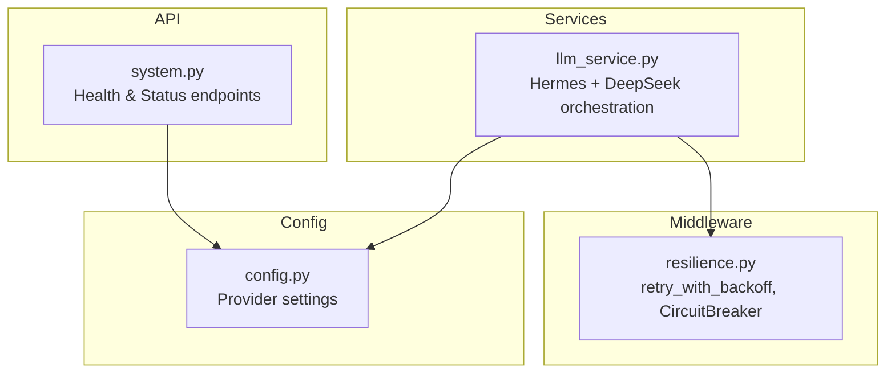
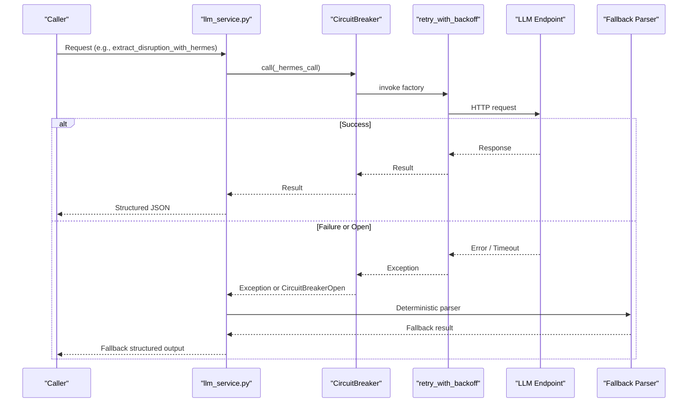
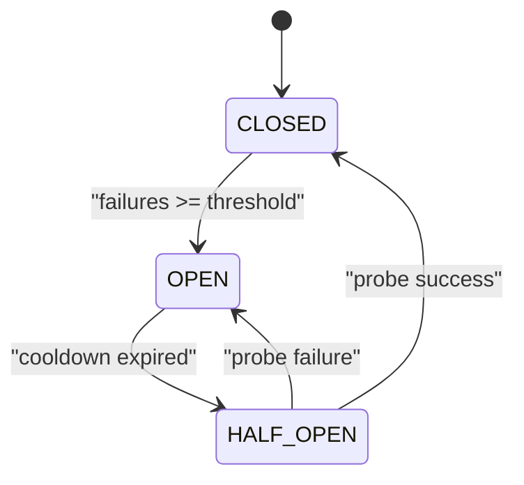
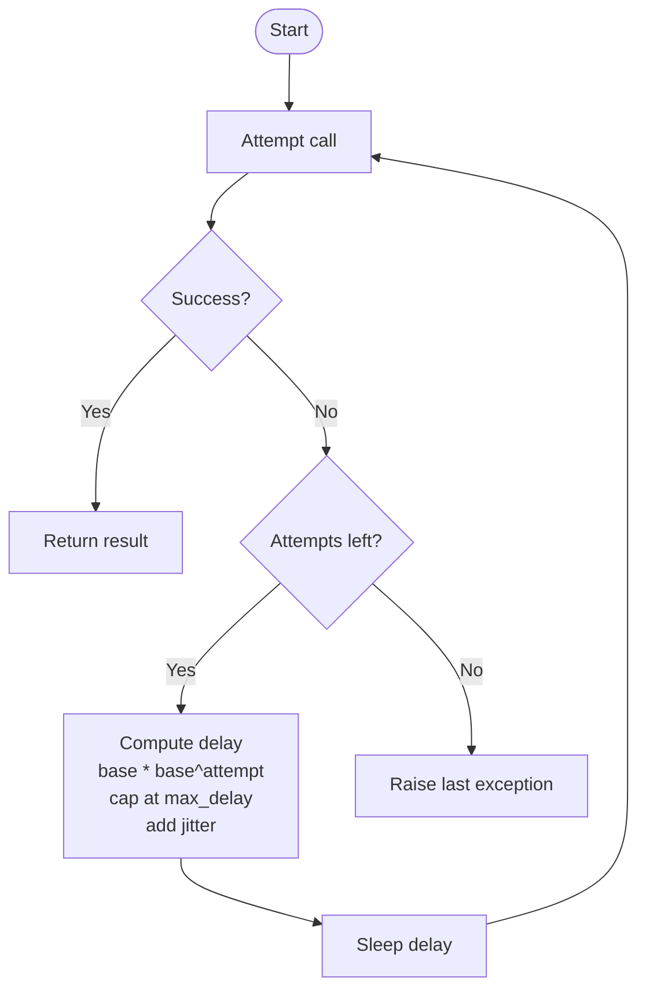
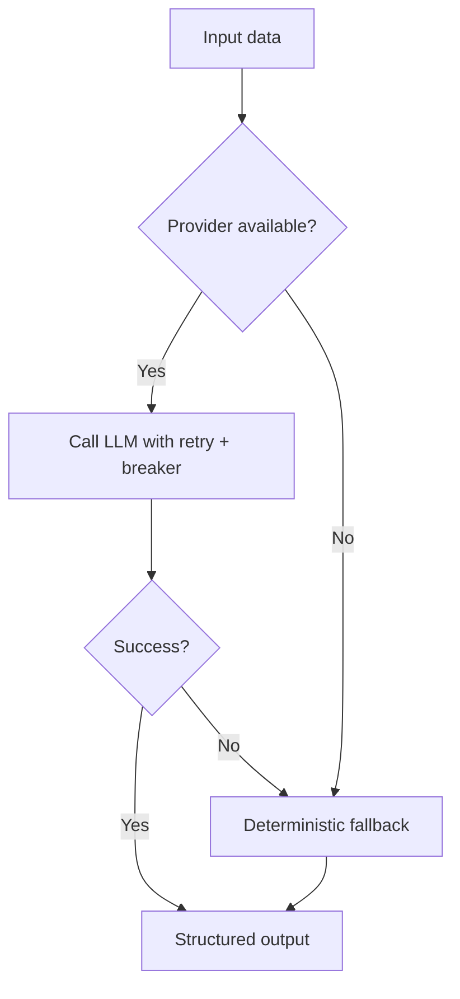
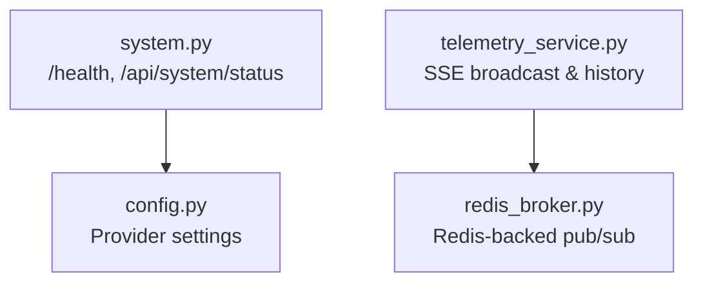
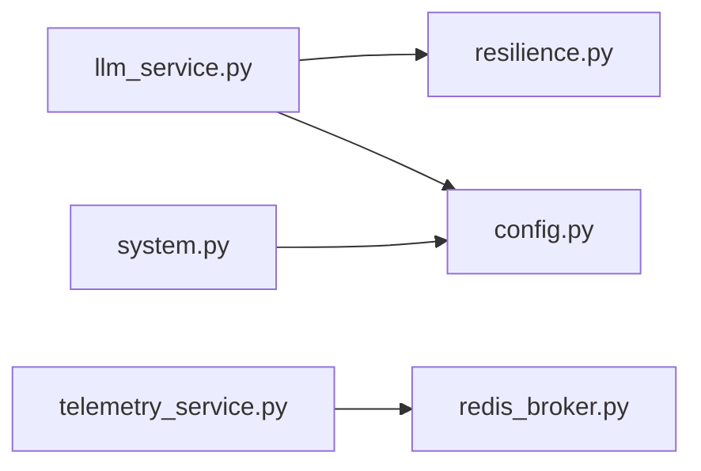

# Resilience & Fallback Mechanisms

<cite>
**Referenced Files in This Document**
- [resilience.py](file://travel-recovery-os/backend/middleware/resilience.py)
- [llm_service.py](file://travel-recovery-os/backend/services/llm_service.py)
- [config.py](file://travel-recovery-os/backend/config.py)
- [system.py](file://travel-recovery-os/backend/api/routers/system.py)
- [telemetry_service.py](file://travel-recovery-os/backend/services/telemetry_service.py)
- [redis_broker.py](file://travel-recovery-os/backend/store/redis_broker.py)
</cite>

## Table of Contents
1. [Introduction](#introduction)
2. [Project Structure](#project-structure)
3. [Core Components](#core-components)
4. [Architecture Overview](#architecture-overview)
5. [Detailed Component Analysis](#detailed-component-analysis)
6. [Dependency Analysis](#dependency-analysis)
7. [Performance Considerations](#performance-considerations)
8. [Troubleshooting Guide](#troubleshooting-guide)
9. [Conclusion](#conclusion)

## Introduction
This document explains the comprehensive resilience strategy for LLM provider failures in the Travel Recovery OS. It covers circuit breaker patterns, retry mechanisms with exponential backoff, and graceful degradation strategies that automatically switch to fallback parsers when providers are unavailable. Specifically:
- Hermes outages trigger regex-based extraction as a deterministic fallback.
- DeepSeek outages trigger deterministic scoring for route evaluation.
The document details configuration for hermes_breaker and deepseek_breaker (failure thresholds, recovery timeouts), retry parameters (max_retries, base_delay, operation naming), and provides operational guidance for monitoring, alerting, and optimizing fallback performance during extended outages.

## Project Structure
Resilience is implemented across middleware and services:
- Middleware defines reusable retry and circuit breaker primitives and pre-configured breakers for each provider.
- Services orchestrate calls to LLM providers with resilience wrappers and implement deterministic fallbacks.
- Configuration centralizes provider endpoints and keys.
- System APIs expose health and status information for observability.

**Diagram sources**
- [resilience.py:25-80](file://travel-recovery-os/backend/middleware/resilience.py#L25-L80)
- [resilience.py:97-216](file://travel-recovery-os/backend/middleware/resilience.py#L97-L216)
- [resilience.py:221-243](file://travel-recovery-os/backend/middleware/resilience.py#L221-L243)
- [llm_service.py:34-96](file://travel-recovery-os/backend/services/llm_service.py#L34-L96)
- [llm_service.py:126-205](file://travel-recovery-os/backend/services/llm_service.py#L126-L205)
- [config.py:46-54](file://travel-recovery-os/backend/config.py#L46-L54)
- [system.py:9-22](file://travel-recovery-os/backend/api/routers/system.py#L9-L22)

**Section sources**
- [resilience.py:25-80](file://travel-recovery-os/backend/middleware/resilience.py#L25-L80)
- [resilience.py:97-216](file://travel-recovery-os/backend/middleware/resilience.py#L97-L216)
- [resilience.py:221-243](file://travel-recovery-os/backend/middleware/resilience.py#L221-L243)
- [llm_service.py:34-96](file://travel-recovery-os/backend/services/llm_service.py#L34-L96)
- [llm_service.py:126-205](file://travel-recovery-os/backend/services/llm_service.py#L126-L205)
- [config.py:46-54](file://travel-recovery-os/backend/config.py#L46-L54)
- [system.py:9-22](file://travel-recovery-os/backend/api/routers/system.py#L9-L22)

## Core Components
- Retry with Exponential Backoff: A generic async wrapper that retries failed operations with configurable delays and jitter, logging per attempt and surfacing the last exception after exhaustion.
- Circuit Breaker: A state machine (CLOSED → OPEN → HALF_OPEN) that fast-fails on repeated errors and probes recovery after cooldown. Pre-built instances exist for DeepSeek and Hermes.
- LLM Orchestration: Each provider call is wrapped with both retry and circuit breaker; exceptions or open circuits trigger deterministic fallbacks.
- Configuration: Centralized provider endpoints and keys used by services and exposed via system status.

Key behaviors:
- Hermes extraction uses regex fallback when the LLM endpoint fails or the breaker opens.
- DeepSeek scoring falls back to a deterministic arbiter that scores routes based on constraints like direct flights, cabin class, and duration.

**Section sources**
- [resilience.py:25-80](file://travel-recovery-os/backend/middleware/resilience.py#L25-L80)
- [resilience.py:97-216](file://travel-recovery-os/backend/middleware/resilience.py#L97-L216)
- [resilience.py:221-243](file://travel-recovery-os/backend/middleware/resilience.py#L221-L243)
- [llm_service.py:34-96](file://travel-recovery-os/backend/services/llm_service.py#L34-L96)
- [llm_service.py:126-205](file://travel-recovery-os/backend/services/llm_service.py#L126-L205)
- [config.py:46-54](file://travel-recovery-os/backend/config.py#L46-L54)

## Architecture Overview
The resilience architecture layers protection around provider calls:
- Service layer invokes provider functions through a circuit breaker.
- The breaker delegates to a retry wrapper that executes the actual HTTP call.
- On failure or breaker-open, the service returns a deterministic fallback result.
- Health/status endpoints expose provider configuration and active models for monitoring.

**Diagram sources**
- [llm_service.py:34-96](file://travel-recovery-os/backend/services/llm_service.py#L34-L96)
- [llm_service.py:126-205](file://travel-recovery-os/backend/services/llm_service.py#L126-L205)
- [resilience.py:25-80](file://travel-recovery-os/backend/middleware/resilience.py#L25-L80)
- [resilience.py:97-216](file://travel-recovery-os/backend/middleware/resilience.py#L97-L216)

## Detailed Component Analysis

### Circuit Breaker Pattern
- States: CLOSED (normal), OPEN (fast-fail), HALF_OPEN (probe).
- Transitions:
  - OPEN to HALF_OPEN after cooldown_seconds elapse since last failure.
  - HALF_OPEN success resets to CLOSED; failure reopens to OPEN.
  - CLOSED transitions to OPEN when consecutive failures reach failure_threshold.
- Pre-configured breakers:
  - deepseek_breaker: name "deepseek_llm", failure_threshold=3, cooldown_seconds=60.0.
  - hermes_breaker: name "hermes_llm", failure_threshold=3, cooldown_seconds=45.0.

**Diagram sources**
- [resilience.py:86-94](file://travel-recovery-os/backend/middleware/resilience.py#L86-L94)
- [resilience.py:116-146](file://travel-recovery-os/backend/middleware/resilience.py#L116-L146)
- [resilience.py:184-216](file://travel-recovery-os/backend/middleware/resilience.py#L184-L216)
- [resilience.py:221-243](file://travel-recovery-os/backend/middleware/resilience.py#L221-L243)

**Section sources**
- [resilience.py:86-94](file://travel-recovery-os/backend/middleware/resilience.py#L86-L94)
- [resilience.py:116-146](file://travel-recovery-os/backend/middleware/resilience.py#L116-L146)
- [resilience.py:184-216](file://travel-recovery-os/backend/middleware/resilience.py#L184-L216)
- [resilience.py:221-243](file://travel-recovery-os/backend/middleware/resilience.py#L221-L243)

### Retry with Exponential Backoff
- Parameters:
  - max_retries: number of additional attempts beyond the first try.
  - base_delay: initial delay before first retry.
  - max_delay: cap on delay growth.
  - exponential_base: multiplier for delay growth.
  - jitter: randomization to avoid thundering herd.
  - retryable_exceptions: types considered retriable.
  - operation_name: label for logs and observability.
- Usage in services:
  - Hermes extraction: max_retries=2, base_delay=0.5, operation_name="hermes_extraction".
  - DeepSeek scoring: max_retries=2, base_delay=1.0, operation_name="deepseek_route_scoring".

**Diagram sources**
- [resilience.py:25-80](file://travel-recovery-os/backend/middleware/resilience.py#L25-L80)
- [llm_service.py:85-96](file://travel-recovery-os/backend/services/llm_service.py#L85-L96)
- [llm_service.py:192-205](file://travel-recovery-os/backend/services/llm_service.py#L192-L205)

**Section sources**
- [resilience.py:25-80](file://travel-recovery-os/backend/middleware/resilience.py#L25-L80)
- [llm_service.py:85-96](file://travel-recovery-os/backend/services/llm_service.py#L85-L96)
- [llm_service.py:192-205](file://travel-recovery-os/backend/services/llm_service.py#L192-L205)

### Graceful Degradation Strategies
- Hermes fallback: Regex-based extraction when the LLM is offline or the breaker opens. Produces a structured disruption object with conservative defaults and an extracted_by field indicating fallback usage.
- DeepSeek fallback: Deterministic arbiter scoring candidate routes using explicit rules (direct flights, cabin match, duration) and producing a reasoning trace, best flight, confidence score, HITL status, and a WhatsApp message template.

**Diagram sources**
- [llm_service.py:34-96](file://travel-recovery-os/backend/services/llm_service.py#L34-L96)
- [llm_service.py:126-205](file://travel-recovery-os/backend/services/llm_service.py#L126-L205)
- [llm_service.py:208-278](file://travel-recovery-os/backend/services/llm_service.py#L208-L278)

**Section sources**
- [llm_service.py:34-96](file://travel-recovery-os/backend/services/llm_service.py#L34-L96)
- [llm_service.py:126-205](file://travel-recovery-os/backend/services/llm_service.py#L126-L205)
- [llm_service.py:208-278](file://travel-recovery-os/backend/services/llm_service.py#L208-L278)

### Monitoring and Observability
- Health and status endpoints:
  - /health: Returns online status and basic provider configuration flags.
  - /api/system/status: Returns detailed provider status including active model names and endpoints.
- Telemetry: Real-time SSE streaming and event history via telemetry service backed by Redis with in-memory fallback when Redis is unavailable.

**Diagram sources**
- [system.py:9-22](file://travel-recovery-os/backend/api/routers/system.py#L9-L22)
- [system.py:24-52](file://travel-recovery-os/backend/api/routers/system.py#L24-L52)
- [config.py:46-54](file://travel-recovery-os/backend/config.py#L46-L54)
- [telemetry_service.py:45-78](file://travel-recovery-os/backend/services/telemetry_service.py#L45-L78)
- [redis_broker.py:42-79](file://travel-recovery-os/backend/store/redis_broker.py#L42-L79)

**Section sources**
- [system.py:9-22](file://travel-recovery-os/backend/api/routers/system.py#L9-L22)
- [system.py:24-52](file://travel-recovery-os/backend/api/routers/system.py#L24-L52)
- [telemetry_service.py:45-78](file://travel-recovery-os/backend/services/telemetry_service.py#L45-L78)
- [redis_broker.py:42-79](file://travel-recovery-os/backend/store/redis_broker.py#L42-L79)

## Dependency Analysis
- llm_service.py depends on:
  - config.py for provider endpoints and keys.
  - resilience.py for retry and circuit breaker utilities and pre-configured breakers.
- resilience.py is self-contained and exposes reusable components consumed by services.
- system.py reads from config.py to report provider status.
- telemetry_service.py depends on redis_broker.py for durable pub/sub and falls back to in-memory structures when Redis is unavailable.

**Diagram sources**
- [llm_service.py:20-28](file://travel-recovery-os/backend/services/llm_service.py#L20-L28)
- [llm_service.py:85-96](file://travel-recovery-os/backend/services/llm_service.py#L85-L96)
- [llm_service.py:192-205](file://travel-recovery-os/backend/services/llm_service.py#L192-L205)
- [system.py:9-22](file://travel-recovery-os/backend/api/routers/system.py#L9-L22)
- [telemetry_service.py:13-20](file://travel-recovery-os/backend/services/telemetry_service.py#L13-L20)
- [redis_broker.py:42-79](file://travel-recovery-os/backend/store/redis_broker.py#L42-L79)

**Section sources**
- [llm_service.py:20-28](file://travel-recovery-os/backend/services/llm_service.py#L20-L28)
- [llm_service.py:85-96](file://travel-recovery-os/backend/services/llm_service.py#L85-L96)
- [llm_service.py:192-205](file://travel-recovery-os/backend/services/llm_service.py#L192-L205)
- [system.py:9-22](file://travel-recovery-os/backend/api/routers/system.py#L9-L22)
- [telemetry_service.py:13-20](file://travel-recovery-os/backend/services/telemetry_service.py#L13-L20)
- [redis_broker.py:42-79](file://travel-recovery-os/backend/store/redis_broker.py#L42-L79)

## Performance Considerations
- Circuit breaker cooldown tuning:
  - deepseek_breaker: 60 seconds cooldown balances rapid recovery with avoiding probe storms.
  - hermes_breaker: 45 seconds cooldown reflects shorter local endpoint latency expectations.
- Retry parameters:
  - Short base_delay for Hermes (0.5s) suits local endpoints; longer base_delay (1.0s) for DeepSeek accounts for network latency.
  - max_retries=2 keeps tail latencies bounded while providing resilience against transient errors.
- Fallback efficiency:
  - Regex extraction is CPU-light and deterministic, ensuring low-latency processing during outages.
  - Deterministic scoring avoids heavy LLM calls and produces actionable outputs quickly.
- Redis fallback:
  - When Redis is unavailable, telemetry falls back to in-memory listeners/history, preserving real-time features without external dependencies.

[No sources needed since this section provides general guidance]

## Troubleshooting Guide
Common scenarios and procedures:
- Provider outage detected:
  - Symptoms: Repeated exceptions in LLM calls; circuit breaker transitions to OPEN.
  - Automatic behavior: Requests fast-fail; services return deterministic fallback results.
  - Verification: Check /api/system/status for provider configuration and active model info.
- Manual intervention:
  - Reset a breaker to CLOSED if you confirm the provider is healthy again.
  - Adjust thresholds or cooldowns in resilience.py if frequent oscillations occur.
- Monitoring alerts:
  - Alert on circuit breaker OPEN events logged by the breaker implementation.
  - Monitor /health and /api/system/status endpoints for configuration drift or missing keys.
- Extended outage optimization:
  - Ensure fallback logic remains effective (regex patterns and scoring rules).
  - Use telemetry streams to observe ongoing processing and validate fallback quality.

**Section sources**
- [resilience.py:184-216](file://travel-recovery-os/backend/middleware/resilience.py#L184-L216)
- [system.py:9-22](file://travel-recovery-os/backend/api/routers/system.py#L9-L22)
- [system.py:24-52](file://travel-recovery-os/backend/api/routers/system.py#L24-L52)
- [telemetry_service.py:45-78](file://travel-recovery-os/backend/services/telemetry_service.py#L45-L78)

## Conclusion
The system implements robust resilience for LLM provider failures using layered protections:
- Circuit breakers isolate failing providers and enable controlled recovery probing.
- Retry with exponential backoff smooths transient errors while bounding latency.
- Deterministic fallbacks ensure continuous operation with predictable outputs during outages.
Operational visibility is provided through health/status endpoints and telemetry streams, enabling proactive monitoring and timely manual intervention when necessary.

[No sources needed since this section summarizes without analyzing specific files]