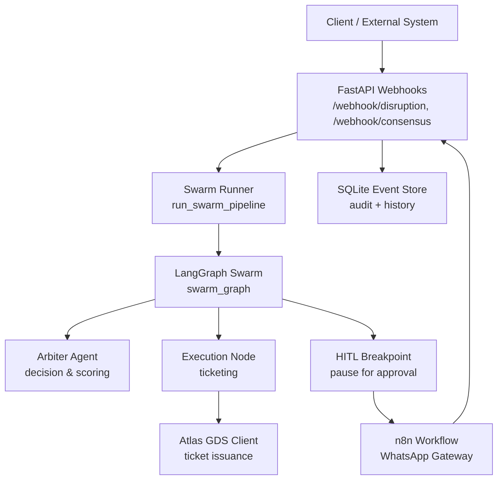
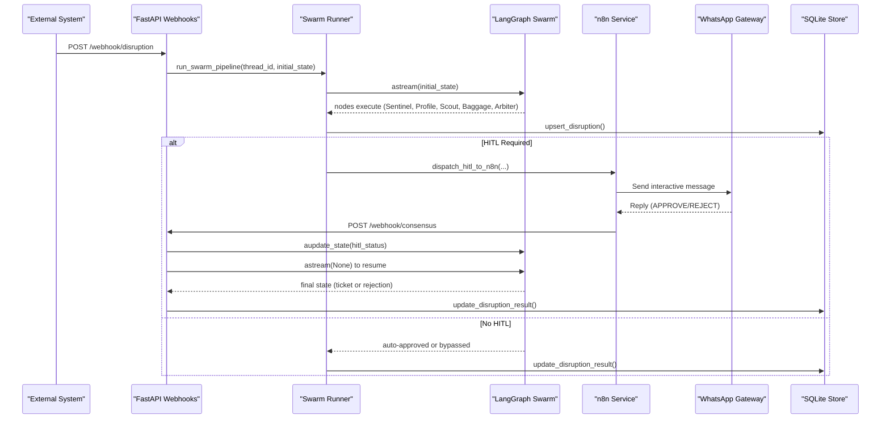
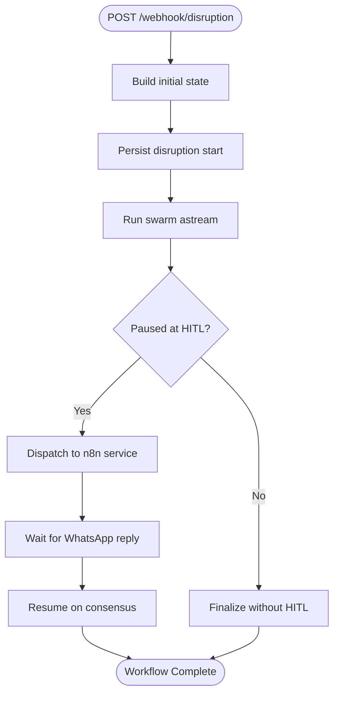
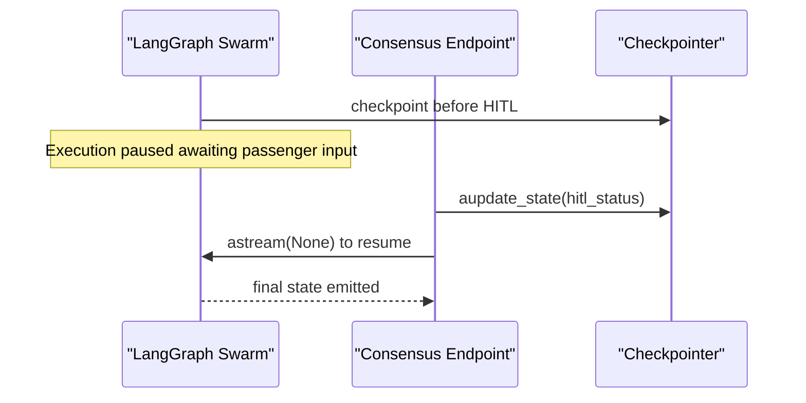
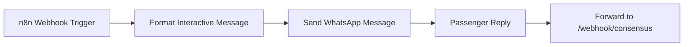
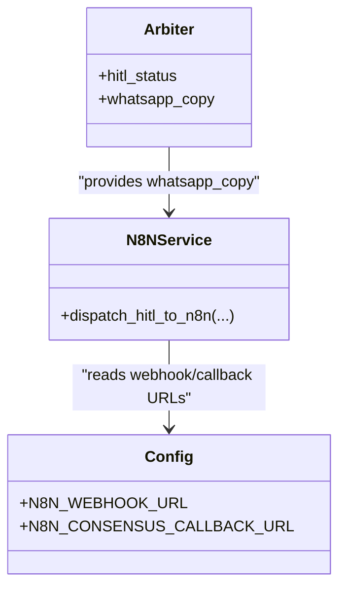
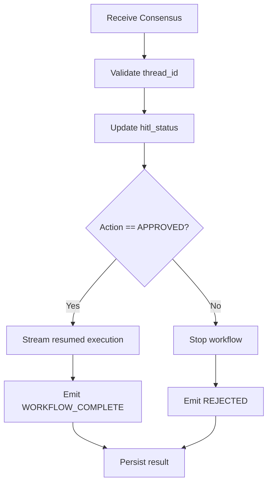
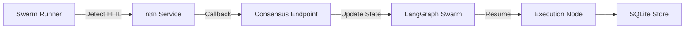
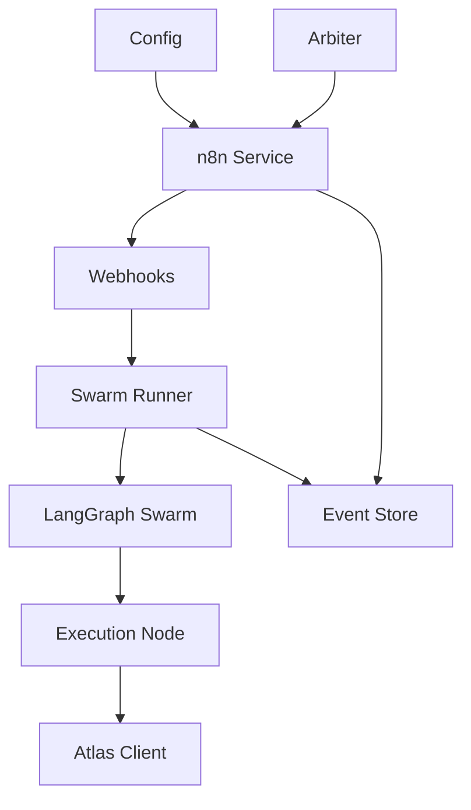

# n8n Workflow Integration

<cite>
**Referenced Files in This Document**
- [synapseair_workflow.json](file://travel-recovery-os/n8n/synapseair_workflow.json)
- [n8n_service.py](file://travel-recovery-os/backend/services/n8n_service.py)
- [webhooks.py](file://travel-recovery-os/backend/api/routers/webhooks.py)
- [swarm_runner.py](file://travel-recovery-os/backend/services/swarm_runner.py)
- [swarm.py](file://travel-recovery-os/backend/swarm.py)
- [state.py](file://travel-recovery-os/backend/state.py)
- [event_store.py](file://travel-recovery-os/backend/store/event_store.py)
- [resilience.py](file://travel-recovery-os/backend/middleware/resilience.py)
- [config.py](file://travel-recovery-os/backend/config.py)
- [arbiter.py](file://travel-recovery-os/backend/agents/arbiter.py)
- [sentinel.py](file://travel-recovery-os/backend/agents/sentinel.py)
- [atlas_client.py](file://travel-recovery-os/backend/tools/atlas_client.py)
- [sqlite_checkpointer.py](file://travel-recovery-os/backend/store/sqlite_checkpointer.py)
</cite>

## Table of Contents
1. [Introduction](#introduction)
2. [Project Structure](#project-structure)
3. [Core Components](#core-components)
4. [Architecture Overview](#architecture-overview)
5. [Detailed Component Analysis](#detailed-component-analysis)
6. [Dependency Analysis](#dependency-analysis)
7. [Performance Considerations](#performance-considerations)
8. [Troubleshooting Guide](#troubleshooting-guide)
9. [Conclusion](#conclusion)

## Introduction
This document explains the human-in-the-loop (HITL) approval workflow that integrates n8n with the travel recovery system to automate passenger rebooking during flight disruptions via WhatsApp messaging. It covers how disruption events trigger multi-agent workflows, how passenger approvals are captured through WhatsApp interactive messages, and how workflow states synchronize back into the main application. It also documents message routing patterns, template management for passenger communications, webhook handlers, error recovery mechanisms, and integration points with the agent swarm system, including state synchronization, timeout handling, and audit trail generation.

## Project Structure
The integration spans three layers:
- Backend API and Swarm Orchestration: FastAPI endpoints ingest disruptions, run a LangGraph-based multi-agent swarm, pause at HITL breakpoints, and resume upon passenger decisions.
- n8n Workflow: A lightweight webhook-driven flow formats WhatsApp interactive messages and forwards replies back to the backend consensus endpoint.
- Persistence and Resilience: SQLite stores event logs and disruption history; circuit breakers and retries protect external calls.

**Diagram sources**
- [webhooks.py:14-72](file://travel-recovery-os/backend/api/routers/webhooks.py#L14-L72)
- [swarm_runner.py:36-176](file://travel-recovery-os/backend/services/swarm_runner.py#L36-L176)
- [swarm.py:162-227](file://travel-recovery-os/backend/swarm.py#L162-L227)
- [n8n_service.py:51-202](file://travel-recovery-os/backend/services/n8n_service.py#L51-L202)
- [event_store.py:47-101](file://travel-recovery-os/backend/store/event_store.py#L47-L101)
- [atlas_client.py:334-357](file://travel-recovery-os/backend/tools/atlas_client.py#L334-L357)

**Section sources**
- [webhooks.py:14-72](file://travel-recovery-os/backend/api/routers/webhooks.py#L14-L72)
- [swarm_runner.py:36-176](file://travel-recovery-os/backend/services/swarm_runner.py#L36-L176)
- [swarm.py:162-227](file://travel-recovery-os/backend/swarm.py#L162-L227)
- [n8n_service.py:51-202](file://travel-recovery-os/backend/services/n8n_service.py#L51-L202)
- [event_store.py:47-101](file://travel-recovery-os/backend/store/event_store.py#L47-L101)
- [atlas_client.py:334-357](file://travel-recovery-os/backend/tools/atlas_client.py#L334-L357)

## Core Components
- Disruption Ingestion: The /webhook/disruption endpoint accepts structured or raw disruption payloads, initializes swarm state, and starts background execution.
- Multi-Agent Swarm: LangGraph orchestrates agents (Sentinel, Profile, Scout, Baggage, MultiLeg, Arbiter, Compensation), then pauses at a HITL breakpoint when passenger approval is required.
- n8n WhatsApp Gateway: Formats an interactive WhatsApp message with Accept/Reject buttons and forwards replies to the backend consensus endpoint.
- Consensus Handler: Updates swarm state with APPROVED/REJECTED and resumes execution to finalize ticketing or stop the workflow.
- Audit and History: All n8n interactions and disruption outcomes are persisted to SQLite for observability and reporting.
- Resilience: Retry with exponential backoff and circuit breakers protect n8n dispatch and external APIs.

**Section sources**
- [webhooks.py:14-72](file://travel-recovery-os/backend/api/routers/webhooks.py#L14-L72)
- [swarm.py:162-227](file://travel-recovery-os/backend/swarm.py#L162-L227)
- [n8n_service.py:51-202](file://travel-recovery-os/backend/services/n8n_service.py#L51-L202)
- [webhooks.py:74-185](file://travel-recovery-os/backend/api/routers/webhooks.py#L74-L185)
- [event_store.py:107-160](file://travel-recovery-os/backend/store/event_store.py#L107-L160)
- [resilience.py:25-80](file://travel-recovery-os/backend/middleware/resilience.py#L25-L80)

## Architecture Overview
The end-to-end flow from disruption to resolution includes:
- Ingest disruption and start swarm pipeline.
- Agents evaluate routes and compute scores; Arbiter decides whether HITL is needed.
- If HITL is required, the graph pauses before the HITL node.
- Backend dispatches a WhatsApp interactive message via n8n service.
- Passenger responds via WhatsApp; n8n forwards reply to /webhook/consensus.
- Backend updates state and resumes the graph to issue tickets or terminate.

**Diagram sources**
- [webhooks.py:14-72](file://travel-recovery-os/backend/api/routers/webhooks.py#L14-L72)
- [swarm_runner.py:36-176](file://travel-recovery-os/backend/services/swarm_runner.py#L36-L176)
- [n8n_service.py:51-202](file://travel-recovery-os/backend/services/n8n_service.py#L51-L202)
- [webhooks.py:74-185](file://travel-recovery-os/backend/api/routers/webhooks.py#L74-L185)
- [event_store.py:166-239](file://travel-recovery-os/backend/store/event_store.py#L166-L239)

## Detailed Component Analysis

### Disruption Ingestion and Swarm Execution
- The disruption webhook constructs a thread-scoped state, persists initial disruption data, and runs the swarm asynchronously.
- The runner emits telemetry events and tracks per-node errors with retry limits.
- When paused at HITL, it extracts passenger context and selected route, then dispatches to n8n.

**Diagram sources**
- [webhooks.py:14-72](file://travel-recovery-os/backend/api/routers/webhooks.py#L14-L72)
- [swarm_runner.py:36-176](file://travel-recovery-os/backend/services/swarm_runner.py#L36-L176)

**Section sources**
- [webhooks.py:14-72](file://travel-recovery-os/backend/api/routers/webhooks.py#L14-L72)
- [swarm_runner.py:36-176](file://travel-recovery-os/backend/services/swarm_runner.py#L36-L176)

### Human-in-the-Loop Breakpoint and State Synchronization
- The swarm graph interrupts before the HITL node using a checkpointer so state survives restarts.
- Upon receiving a consensus decision, the backend updates the state and resumes streaming to complete the workflow.

**Diagram sources**
- [swarm.py:222-227](file://travel-recovery-os/backend/swarm.py#L222-L227)
- [webhooks.py:84-185](file://travel-recovery-os/backend/api/routers/webhooks.py#L84-L185)
- [sqlite_checkpointer.py:43-55](file://travel-recovery-os/backend/store/sqlite_checkpointer.py#L43-L55)

**Section sources**
- [swarm.py:130-159](file://travel-recovery-os/backend/swarm.py#L130-L159)
- [webhooks.py:84-185](file://travel-recovery-os/backend/api/routers/webhooks.py#L84-L185)
- [sqlite_checkpointer.py:43-55](file://travel-recovery-os/backend/store/sqlite_checkpointer.py#L43-L55)

### n8n Workflow Definition and Message Routing
- The n8n workflow defines a webhook trigger, formats an interactive WhatsApp message with Accept/Reject buttons, and forwards replies to the backend consensus endpoint.
- The backend n8n service composes a standard payload with passenger details, recommended flight, and callback URLs for approve/reject actions.

**Diagram sources**
- [synapseair_workflow.json:1-81](file://travel-recovery-os/n8n/synapseair_workflow.json#L1-L81)
- [n8n_service.py:51-202](file://travel-recovery-os/backend/services/n8n_service.py#L51-L202)
- [webhooks.py:74-185](file://travel-recovery-os/backend/api/routers/webhooks.py#L74-L185)

**Section sources**
- [synapseair_workflow.json:1-81](file://travel-recovery-os/n8n/synapseair_workflow.json#L1-L81)
- [n8n_service.py:51-202](file://travel-recovery-os/backend/services/n8n_service.py#L51-L202)

### Template Management for Passenger Communications
- The arbiter agent can generate a WhatsApp copy message used by the n8n service to personalize the body text.
- The n8n service wraps this into a standardized envelope containing header, body, action buttons, and consensus callback metadata.
- Configuration provides default values for phone numbers, names, and fallback messages if inputs are missing.

**Diagram sources**
- [arbiter.py:128-244](file://travel-recovery-os/backend/agents/arbiter.py#L128-L244)
- [n8n_service.py:51-202](file://travel-recovery-os/backend/services/n8n_service.py#L51-L202)
- [config.py:56-61](file://travel-recovery-os/backend/config.py#L56-L61)

**Section sources**
- [arbiter.py:128-244](file://travel-recovery-os/backend/agents/arbiter.py#L128-L244)
- [n8n_service.py:51-202](file://travel-recovery-os/backend/services/n8n_service.py#L51-L202)
- [config.py:56-61](file://travel-recovery-os/backend/config.py#L56-L61)

### Webhook Handlers and Error Recovery
- The consensus handler validates the active session, updates state, broadcasts events, and resumes the graph to finalize outcomes.
- Errors during resume are captured and broadcast as workflow errors; disruption records are updated with error states.
- The n8n service uses circuit breakers and retries to handle transient failures when dispatching to external webhooks.

**Diagram sources**
- [webhooks.py:74-185](file://travel-recovery-os/backend/api/routers/webhooks.py#L74-L185)
- [resilience.py:25-80](file://travel-recovery-os/backend/middleware/resilience.py#L25-L80)
- [resilience.py:97-214](file://travel-recovery-os/backend/middleware/resilience.py#L97-L214)

**Section sources**
- [webhooks.py:74-185](file://travel-recovery-os/backend/api/routers/webhooks.py#L74-L185)
- [resilience.py:25-80](file://travel-recovery-os/backend/middleware/resilience.py#L25-L80)
- [resilience.py:97-214](file://travel-recovery-os/backend/middleware/resilience.py#L97-L214)

### Integration Between n8n Workflows and Agent Swarm
- State synchronization: The swarm runner detects interruption before the HITL node and triggers n8n dispatch; the consensus handler updates state and resumes execution.
- Timeout handling: HTTP timeouts and circuit breaker cooldowns prevent long waits; retries mitigate transient issues.
- Audit trail: All n8n interactions and disruption outcomes are recorded in SQLite for traceability.

**Diagram sources**
- [swarm_runner.py:133-176](file://travel-recovery-os/backend/services/swarm_runner.py#L133-L176)
- [webhooks.py:84-185](file://travel-recovery-os/backend/api/routers/webhooks.py#L84-L185)
- [event_store.py:107-160](file://travel-recovery-os/backend/store/event_store.py#L107-L160)

**Section sources**
- [swarm_runner.py:133-176](file://travel-recovery-os/backend/services/swarm_runner.py#L133-L176)
- [webhooks.py:84-185](file://travel-recovery-os/backend/api/routers/webhooks.py#L84-L185)
- [event_store.py:107-160](file://travel-recovery-os/backend/store/event_store.py#L107-L160)

### Example Definitions and Patterns
- Workflow definition: See the n8n JSON workflow for webhook trigger, message formatting, and forwarding logic.
- Message templates: The n8n service constructs a standardized WhatsApp Business API envelope with header, body, action buttons, and consensus callbacks.
- Webhook handlers: The FastAPI routers implement ingestion and consensus endpoints with validation and broadcasting.
- Error recovery: Circuit breakers and retries protect n8n dispatch and external services; per-node error tracking escalates after max retries.

**Section sources**
- [synapseair_workflow.json:1-81](file://travel-recovery-os/n8n/synapseair_workflow.json#L1-L81)
- [n8n_service.py:51-202](file://travel-recovery-os/backend/services/n8n_service.py#L51-L202)
- [webhooks.py:14-72](file://travel-recovery-os/backend/api/routers/webhooks.py#L14-L72)
- [webhooks.py:74-185](file://travel-recovery-os/backend/api/routers/webhooks.py#L74-L185)
- [resilience.py:25-80](file://travel-recovery-os/backend/middleware/resilience.py#L25-L80)

## Dependency Analysis
Key dependencies and relationships:
- Backend depends on LangGraph for stateful orchestration and durable checkpoints.
- n8n service depends on configuration for webhook URLs and callbacks.
- Arbiter produces WhatsApp copy messages consumed by n8n service.
- Event store persists both n8n interactions and disruption results.
- Atlas client handles ticket issuance with resilience patterns.

**Diagram sources**
- [config.py:56-61](file://travel-recovery-os/backend/config.py#L56-L61)
- [arbiter.py:128-244](file://travel-recovery-os/backend/agents/arbiter.py#L128-L244)
- [n8n_service.py:51-202](file://travel-recovery-os/backend/services/n8n_service.py#L51-L202)
- [webhooks.py:14-72](file://travel-recovery-os/backend/api/routers/webhooks.py#L14-L72)
- [swarm_runner.py:36-176](file://travel-recovery-os/backend/services/swarm_runner.py#L36-L176)
- [swarm.py:162-227](file://travel-recovery-os/backend/swarm.py#L162-L227)
- [atlas_client.py:334-357](file://travel-recovery-os/backend/tools/atlas_client.py#L334-L357)
- [event_store.py:107-160](file://travel-recovery-os/backend/store/event_store.py#L107-L160)

**Section sources**
- [config.py:56-61](file://travel-recovery-os/backend/config.py#L56-L61)
- [arbiter.py:128-244](file://travel-recovery-os/backend/agents/arbiter.py#L128-L244)
- [n8n_service.py:51-202](file://travel-recovery-os/backend/services/n8n_service.py#L51-L202)
- [webhooks.py:14-72](file://travel-recovery-os/backend/api/routers/webhooks.py#L14-L72)
- [swarm_runner.py:36-176](file://travel-recovery-os/backend/services/swarm_runner.py#L36-L176)
- [swarm.py:162-227](file://travel-recovery-os/backend/swarm.py#L162-L227)
- [atlas_client.py:334-357](file://travel-recovery-os/backend/tools/atlas_client.py#L334-L357)
- [event_store.py:107-160](file://travel-recovery-os/backend/store/event_store.py#L107-L160)

## Performance Considerations
- Use SQLite for durable checkpoints and event logs to avoid memory pressure and ensure persistence across restarts.
- Apply circuit breakers and retries to external calls (n8n, Atlas) to reduce cascading failures and improve throughput.
- Cache flight search results briefly to minimize repeated GDS calls.
- Keep WhatsApp messages concise and use interactive buttons to reduce latency and user friction.

[No sources needed since this section provides general guidance]

## Troubleshooting Guide
Common issues and debugging techniques:
- No active session for thread_id: Ensure the thread_id matches an existing checkpoint; verify the consensus endpoint receives the correct ID.
- n8n dispatch failures: Check circuit breaker state and retry logs; inspect stored n8n events for status codes and response bodies.
- Workflow stuck at HITL: Confirm WhatsApp reply reaches /webhook/consensus; validate payload fields (thread_id, action).
- Ticketing errors: Review Atlas client logs and fallback behavior; verify environment credentials and base URLs.
- Audit trail inspection: Query SQLite event store for n8n_events and disruptions tables to trace lifecycle and outcomes.

**Section sources**
- [webhooks.py:84-185](file://travel-recovery-os/backend/api/routers/webhooks.py#L84-L185)
- [n8n_service.py:51-202](file://travel-recovery-os/backend/services/n8n_service.py#L51-L202)
- [event_store.py:107-160](file://travel-recovery-os/backend/store/event_store.py#L107-L160)
- [atlas_client.py:334-357](file://travel-recovery-os/backend/tools/atlas_client.py#L334-L357)
- [resilience.py:97-214](file://travel-recovery-os/backend/middleware/resilience.py#L97-L214)

## Conclusion
The n8n workflow integration enables robust, human-in-the-loop passenger approvals via WhatsApp while maintaining resilient, auditable, and stateful orchestration of the travel recovery swarm. By combining LangGraph checkpoints, structured message envelopes, and persistent event storage, the system ensures reliable processing of disruption events, transparent decision-making, and seamless resumption upon passenger consent. Proper configuration, monitoring, and troubleshooting practices further enhance operational stability and customer experience.

[No sources needed since this section summarizes without analyzing specific files]