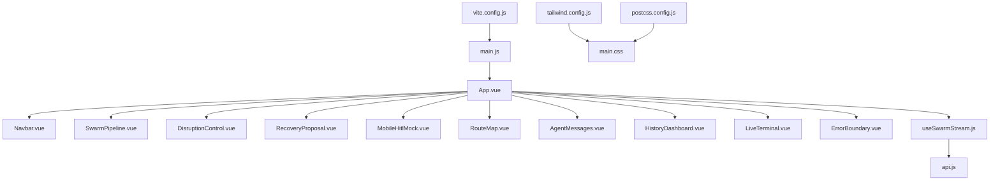
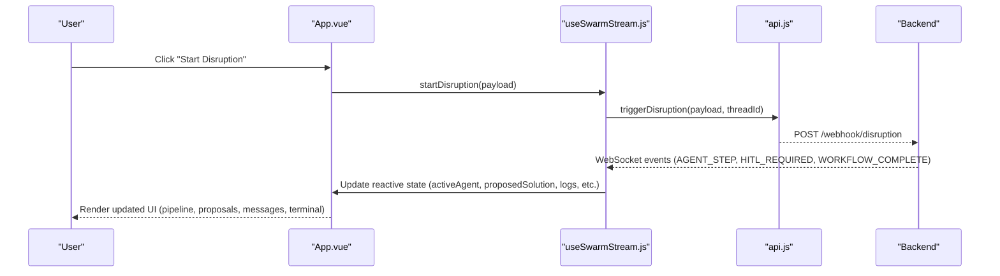
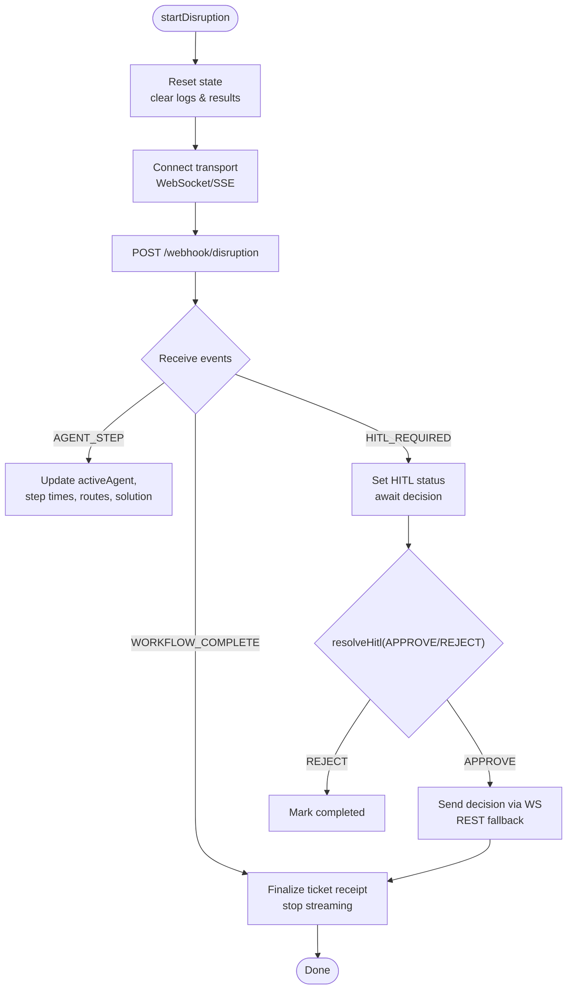
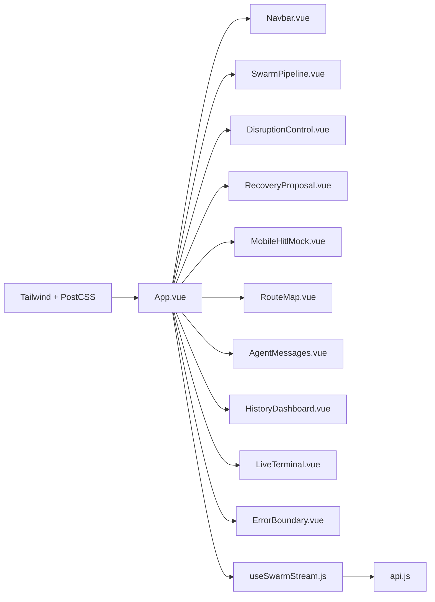

# Application Architecture

<cite>
**Referenced Files in This Document**
- [App.vue](file://travel-recovery-os/frontend/src/App.vue)
- [main.js](file://travel-recovery-os/frontend/src/main.js)
- [ErrorBoundary.vue](file://travel-recovery-os/frontend/src/components/ErrorBoundary.vue)
- [Navbar.vue](file://travel-recovery-os/frontend/src/components/Navbar.vue)
- [SwarmPipeline.vue](file://travel-recovery-os/frontend/src/components/SwarmPipeline.vue)
- [useSwarmStream.js](file://travel-recovery-os/frontend/src/composables/useSwarmStream.js)
- [api.js](file://travel-recovery-os/frontend/src/services/api.js)
- [tailwind.config.js](file://travel-recovery-os/frontend/tailwind.config.js)
- [postcss.config.js](file://travel-recovery-os/frontend/postcss.config.js)
- [vite.config.js](file://travel-recovery-os/frontend/vite.config.js)
- [package.json](file://travel-recovery-os/frontend/package.json)
- [main.css](file://travel-recovery-os/frontend/src/assets/main.css)
</cite>

## Table of Contents
1. [Introduction](#introduction)
2. [Project Structure](#project-structure)
3. [Core Components](#core-components)
4. [Architecture Overview](#architecture-overview)
5. [Detailed Component Analysis](#detailed-component-analysis)
6. [Dependency Analysis](#dependency-analysis)
7. [Performance Considerations](#performance-considerations)
8. [Troubleshooting Guide](#troubleshooting-guide)
9. [Conclusion](#conclusion)
10. [Appendices](#appendices)

## Introduction
This document explains the Vue 3 frontend architecture for the travel recovery command center. It covers the component hierarchy rooted at App.vue, the main layout with Navbar and KPI banners, responsive grid patterns, error boundary implementation, TailwindCSS integration, state management via composables, development setup, build configuration, and deployment considerations.

## Project Structure
The frontend is a Vite + Vue 3 application styled with TailwindCSS. The root component App.vue composes the top-level layout and orchestrates multiple feature components. Styling is centralized through Tailwind utilities and custom CSS. State and side effects are encapsulated in composables, while API interactions are abstracted behind a service layer.

**Diagram sources**
- [main.js:1-18](file://travel-recovery-os/frontend/src/main.js#L1-L18)
- [App.vue:1-219](file://travel-recovery-os/frontend/src/App.vue#L1-L219)
- [tailwind.config.js:1-130](file://travel-recovery-os/frontend/tailwind.config.js#L1-L130)
- [postcss.config.js:1-7](file://travel-recovery-os/frontend/postcss.config.js#L1-L7)
- [vite.config.js:1-18](file://travel-recovery-os/frontend/vite.config.js#L1-L18)

**Section sources**
- [main.js:1-18](file://travel-recovery-os/frontend/src/main.js#L1-L18)
- [App.vue:1-219](file://travel-recovery-os/frontend/src/App.vue#L1-L219)
- [tailwind.config.js:1-130](file://travel-recovery-os/frontend/tailwind.config.js#L1-L130)
- [postcss.config.js:1-7](file://travel-recovery-os/frontend/postcss.config.js#L1-L7)
- [vite.config.js:1-18](file://travel-recovery-os/frontend/vite.config.js#L1-L18)

## Core Components
- App.vue: Root layout container that renders Navbar, KPI banner row, multi-agent pipeline, three-column operational grid (disruption control, recovery proposal, WhatsApp HITL mock), route map, agent messages, live terminal, and history dashboard. It also wires global state via useSwarmStream and sets up periodic system status polling.
- Navbar.vue: Sticky header with branding, live system status indicators, latency display, and a pitch guide modal.
- SwarmPipeline.vue: Visualizes the multi-agent recovery pipeline with step statuses and timing metrics.
- ErrorBoundary.vue: Reusable wrapper that catches errors within its slot and presents a friendly fallback UI with a reset action.
- useSwarmStream.js: Central reactive state manager exposing streaming events, disruption lifecycle, HITL consensus, telemetry logs, and backend communication helpers.
- api.js: HTTP client abstraction for REST endpoints and WebSocket URL generation.

Key responsibilities and relationships:
- App.vue imports and uses all major UI components and the useSwarmStream composable to drive rendering and user actions.
- ErrorBoundary wraps critical subcomponents to isolate failures and preserve overall app stability.
- useSwarmStream coordinates transport (WebSocket/SSE) via a connection layer and updates shared state consumed by components.
- api.js provides typed methods for system status, triggering disruptions, resolving HITL decisions, fetching history/stats, and chat messaging.

**Section sources**
- [App.vue:178-219](file://travel-recovery-os/frontend/src/App.vue#L178-L219)
- [Navbar.vue:1-189](file://travel-recovery-os/frontend/src/components/Navbar.vue#L1-L189)
- [SwarmPipeline.vue:1-166](file://travel-recovery-os/frontend/src/components/SwarmPipeline.vue#L1-L166)
- [ErrorBoundary.vue:1-57](file://travel-recovery-os/frontend/src/components/ErrorBoundary.vue#L1-L57)
- [useSwarmStream.js:1-282](file://travel-recovery-os/frontend/src/composables/useSwarmStream.js#L1-L282)
- [api.js:1-100](file://travel-recovery-os/frontend/src/services/api.js#L1-L100)

## Architecture Overview
The application follows a layered architecture:
- Presentation Layer: Vue components (App.vue and feature components) render UI using Tailwind utility classes and custom styles.
- State Layer: Reactive state and side effects are managed in composables (useSwarmStream).
- Service Layer: api.js encapsulates HTTP calls and WebSocket URL construction.
- Transport Layer: Real-time event streaming is handled by a connection composable (referenced from useSwarmStream) with WebSocket and SSE fallbacks.

**Diagram sources**
- [App.vue:178-219](file://travel-recovery-os/frontend/src/App.vue#L178-L219)
- [useSwarmStream.js:213-240](file://travel-recovery-os/frontend/src/composables/useSwarmStream.js#L213-L240)
- [api.js:30-41](file://travel-recovery-os/frontend/src/services/api.js#L30-L41)

## Detailed Component Analysis

### Root Layout and Responsive Grid (App.vue)
- Top-level structure: sticky Navbar, main content area with responsive spacing and max-width constraints, footer with branding and version info.
- KPI Banner Row: Four-column responsive grid displaying key metrics such as average swarm speed, cost saved per passenger, passenger rights coverage, and autonomous resolution rate.
- Multi-Agent Pipeline: Wrapped in ErrorBoundary to ensure resilience; receives active agent and step execution times from useSwarmStream.
- Three-Column Operational Grid:
  - Left: Disruption simulator/control triggers the workflow.
  - Middle: Recovery proposal displays selected route and HITL status.
  - Right: WhatsApp HITL mock simulates passenger interaction and consent flow.
- Route Map: Displays candidate routes and highlights the selected solution.
- Agent Messages and Live Terminal: Provide real-time visibility into agent reasoning and system logs.
- History Dashboard: Collapsible section for historical disruption analytics.

Responsive design patterns:
- Uses Tailwind’s responsive breakpoints (sm:, md:, lg:) to adapt layouts from single-column on mobile to multi-column on larger screens.
- Employs CSS Grid for both KPI banners and the operational grid, ensuring consistent alignment and spacing across devices.
- Flexbox for internal component alignment and spacing.

State wiring:
- All data and actions are sourced from useSwarmStream, including activeAgent, isStreaming, hitlStatus, streamLatencyMs, systemStatus, disruptionData, proposedSolution, candidateRoutes, ticketReceipt, stepExecutionTimes, logs, baggageContext, compensationResult, agentMessages, and functions like fetchSystemStatus, startDisruption, resolveHitl, clearLogs.

**Section sources**
- [App.vue:1-176](file://travel-recovery-os/frontend/src/App.vue#L1-L176)
- [App.vue:178-219](file://travel-recovery-os/frontend/src/App.vue#L178-L219)

### Error Boundary Pattern (ErrorBoundary.vue)
- Captures errors thrown by child components using onErrorCaptured.
- Renders a friendly error card with a title, message, and “Try Again” button to reset the error state.
- Prevents error propagation to parent components, isolating failures to the wrapped subtree.
- Integrates with Tailwind styling for consistent visual language.

Usage pattern:
- Wrap critical UI sections in App.vue (e.g., SwarmPipeline, DisruptionControl, RecoveryProposal, MobileHitlMock, RouteMap, AgentMessages, LiveTerminal, HistoryDashboard) to ensure graceful degradation when individual components fail.

**Section sources**
- [ErrorBoundary.vue:1-57](file://travel-recovery-os/frontend/src/components/ErrorBoundary.vue#L1-L57)

### Navbar (Navbar.vue)
- Displays branding, system online indicator, AI model name, GDS provider, and latency ping.
- Includes a pitch guide modal accessible via a prominent call-to-action button.
- Uses Tailwind utilities for responsive visibility and interactive states.

**Section sources**
- [Navbar.vue:1-189](file://travel-recovery-os/frontend/src/components/Navbar.vue#L1-L189)

### Swarm Pipeline Visualization (SwarmPipeline.vue)
- Shows a five-step pipeline: Sentinel, Profile, Scout, Arbiter, Executor.
- Dynamically updates step statuses based on activeAgent and step execution times.
- Provides readable phase names and live agent reasoning insights.

**Section sources**
- [SwarmPipeline.vue:1-166](file://travel-recovery-os/frontend/src/components/SwarmPipeline.vue#L1-L166)

### State Management and Streaming (useSwarmStream.js)
- Manages reactive state for the entire workflow: active agent, streaming flags, HITL status, system status, disruption data, proposed solutions, candidate routes, ticket receipts, logs, baggage context, compensation results, and agent messages.
- Orchestrates transport via useConnection (not shown here) and handles real-time events:
  - AGENT_STEP: Updates active agent, step timings, candidate routes, proposed solution, and HITL bypass logic.
  - HITL_REQUIRED: Pauses automation and prompts for passenger consent.
  - WORKFLOW_COMPLETE: Finalizes ticket receipt and resets streaming state.
- Exposes actions: startDisruption, resolveHitl, disconnect, clearLogs, and periodic fetchSystemStatus.

**Diagram sources**
- [useSwarmStream.js:213-240](file://travel-recovery-os/frontend/src/composables/useSwarmStream.js#L213-L240)
- [useSwarmStream.js:98-125](file://travel-recovery-os/frontend/src/composables/useSwarmStream.js#L98-L125)
- [useSwarmStream.js:127-189](file://travel-recovery-os/frontend/src/composables/useSwarmStream.js#L127-L189)
- [useSwarmStream.js:191-209](file://travel-recovery-os/frontend/src/composables/useSwarmStream.js#L191-L209)
- [useSwarmStream.js:242-257](file://travel-recovery-os/frontend/src/composables/useSwarmStream.js#L242-L257)

**Section sources**
- [useSwarmStream.js:1-282](file://travel-recovery-os/frontend/src/composables/useSwarmStream.js#L1-L282)

### API Integration (api.js)
- Provides methods for:
  - System status polling
  - Triggering disruption workflows
  - Resolving HITL consensus
  - Fetching history and stats
  - Sending chat messages to n8n-powered assistant
- Constructs WebSocket URLs by transforming the base HTTP URL to WebSocket scheme.
- Supports optional authentication headers via environment variables.

**Section sources**
- [api.js:1-100](file://travel-recovery-os/frontend/src/services/api.js#L1-L100)

## Dependency Analysis
- App.vue depends on:
  - Components: Navbar, SwarmPipeline, DisruptionControl, RecoveryProposal, MobileHitlMock, RouteMap, AgentMessages, HistoryDashboard, LiveTerminal, ErrorBoundary
  - Composable: useSwarmStream
- useSwarmStream depends on:
  - Connection layer: useConnection (transport abstraction)
  - API client: api.js
- Styling dependencies:
  - TailwindCSS configured via tailwind.config.js and postcss.config.js
  - Custom styles in main.css augment Tailwind utilities

**Diagram sources**
- [App.vue:178-219](file://travel-recovery-os/frontend/src/App.vue#L178-L219)
- [useSwarmStream.js:10-12](file://travel-recovery-os/frontend/src/composables/useSwarmStream.js#L10-L12)
- [tailwind.config.js:1-130](file://travel-recovery-os/frontend/tailwind.config.js#L1-L130)
- [postcss.config.js:1-7](file://travel-recovery-os/frontend/postcss.config.js#L1-L7)

**Section sources**
- [App.vue:178-219](file://travel-recovery-os/frontend/src/App.vue#L178-L219)
- [useSwarmStream.js:10-12](file://travel-recovery-os/frontend/src/composables/useSwarmStream.js#L10-L12)
- [tailwind.config.js:1-130](file://travel-recovery-os/frontend/tailwind.config.js#L1-L130)
- [postcss.config.js:1-7](file://travel-recovery-os/frontend/postcss.config.js#L1-L7)

## Performance Considerations
- Event-driven updates: useSwarmStream processes streaming events incrementally, minimizing re-renders by updating only necessary reactive fields.
- Read-only exposure: Some state properties are exposed as readonly to prevent accidental mutations in components.
- Debounced or throttled polling: System status is polled at intervals; consider adjusting frequency based on network conditions.
- Efficient grids: Tailwind’s responsive grid reduces layout shifts and improves rendering performance across devices.
- Error isolation: ErrorBoundary prevents cascading failures, keeping the rest of the UI functional.

[No sources needed since this section provides general guidance]

## Troubleshooting Guide
- Global error handling:
  - main.js registers a global error handler for uncaught errors and listens for unhandled promise rejections to log issues consistently.
- Component-level error boundaries:
  - ErrorBoundary captures errors within wrapped components and offers a reset action to recover without reloading the page.
- Streaming connectivity:
  - If WebSocket connections fail, the connection layer (used by useSwarmStream) should fall back to SSE; verify network policies and CORS settings.
- API errors:
  - api.js throws descriptive errors on non-OK responses; ensure correct base URL and token configuration via environment variables.

**Section sources**
- [main.js:7-15](file://travel-recovery-os/frontend/src/main.js#L7-L15)
- [ErrorBoundary.vue:31-56](file://travel-recovery-os/frontend/src/components/ErrorBoundary.vue#L31-L56)
- [api.js:23-99](file://travel-recovery-os/frontend/src/services/api.js#L23-L99)

## Conclusion
The Vue 3 frontend employs a clean separation of concerns: presentation via modular components, state via composables, and services for API interactions. TailwindCSS enables rapid, responsive UI development with consistent design tokens. Error boundaries provide resilience, while streaming-based state updates keep the interface synchronized with backend workflows. The architecture supports scalable feature growth and maintainable code organization.

[No sources needed since this section summarizes without analyzing specific files]

## Appendices

### Development Setup
- Scripts:
  - dev: Starts Vite dev server
  - build: Builds production assets
  - preview: Previews built output
- Dev server proxy:
  - Routes /api requests to http://127.0.0.1:8001 with origin rewriting
- Dependencies:
  - Vue 3, VueUse, Lucide icons
  - Vite, TailwindCSS, PostCSS, Autoprefixer

**Section sources**
- [package.json:1-25](file://travel-recovery-os/frontend/package.json#L1-L25)
- [vite.config.js:5-17](file://travel-recovery-os/frontend/vite.config.js#L5-L17)

### Build Configuration
- Vite plugin for Vue is enabled.
- TailwindCSS scanning includes index.html and all source files under src.
- PostCSS pipeline integrates Tailwind and Autoprefixer.

**Section sources**
- [vite.config.js:1-18](file://travel-recovery-os/frontend/vite.config.js#L1-L18)
- [tailwind.config.js:1-130](file://travel-recovery-os/frontend/tailwind.config.js#L1-L130)
- [postcss.config.js:1-7](file://travel-recovery-os/frontend/postcss.config.js#L1-L7)

### Deployment Considerations
- Environment variables:
  - VITE_API_BASE_URL: Backend base URL
  - VITE_API_TOKEN: Optional bearer token for authenticated requests
- Proxy configuration:
  - During development, /api is proxied to the local backend; in production, configure reverse proxy or CDN accordingly.
- Static assets:
  - Ensure images and fonts referenced in components and styles are available in the build output.

**Section sources**
- [api.js:1-2](file://travel-recovery-os/frontend/src/services/api.js#L1-L2)
- [vite.config.js:9-14](file://travel-recovery-os/frontend/vite.config.js#L9-L14)