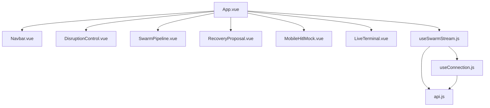
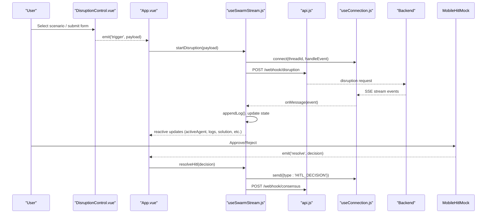
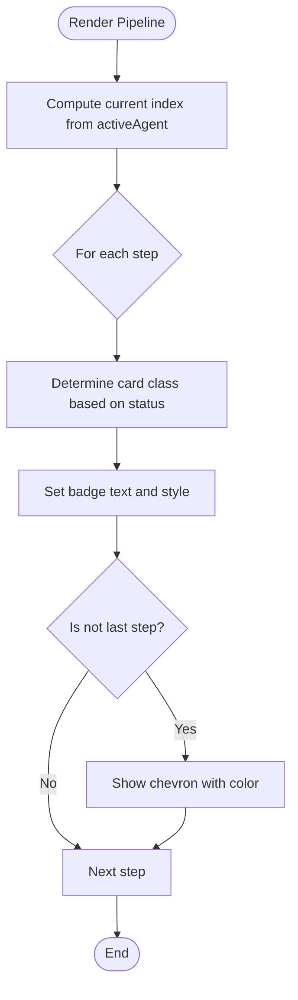
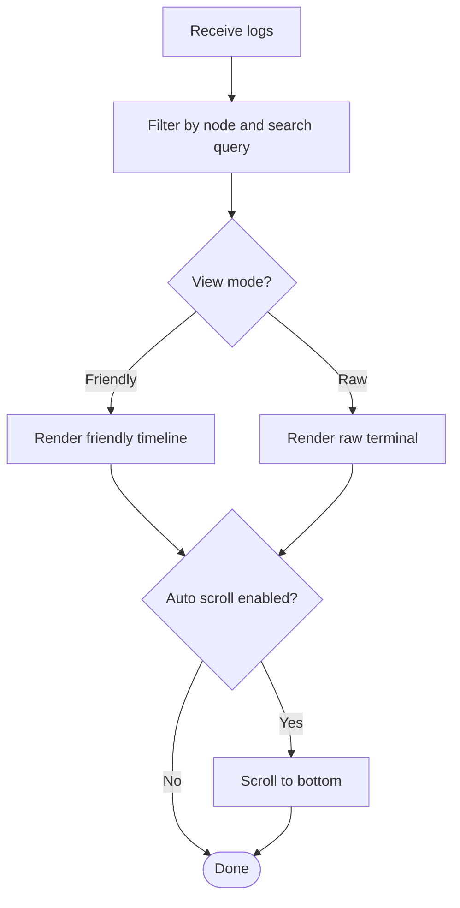
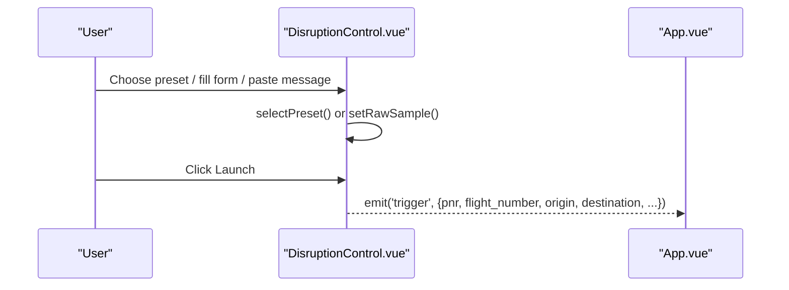
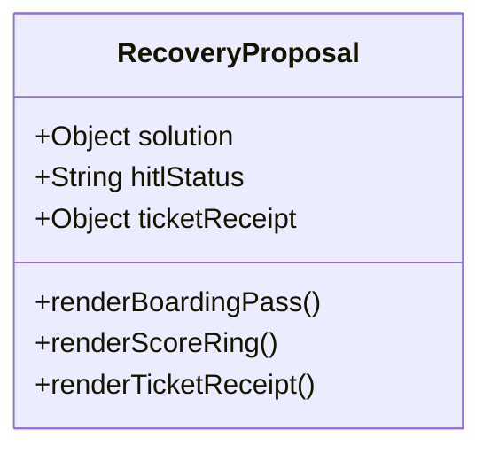
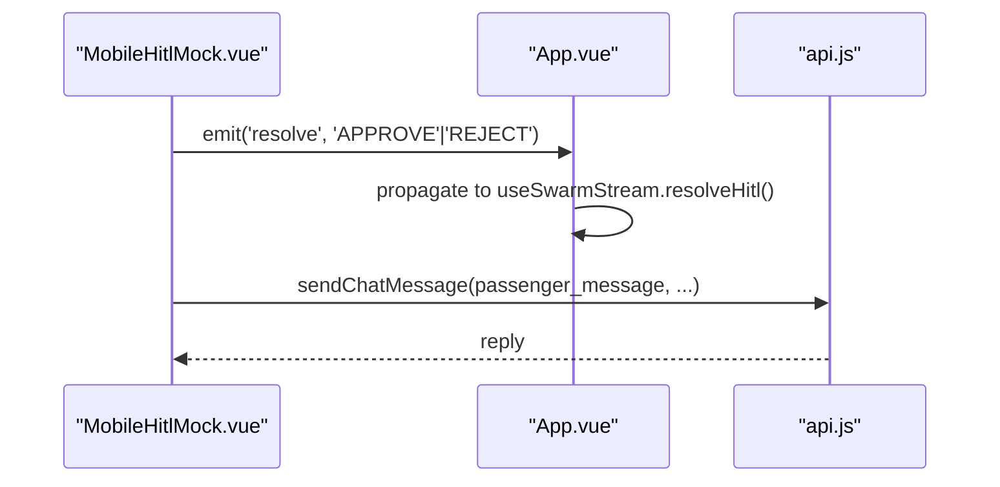
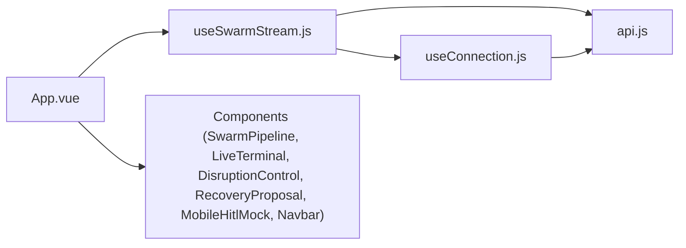
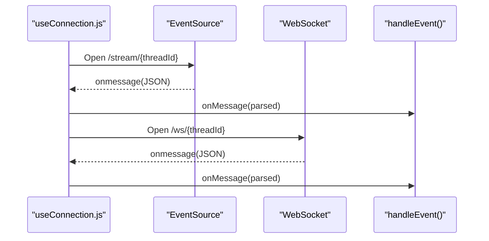
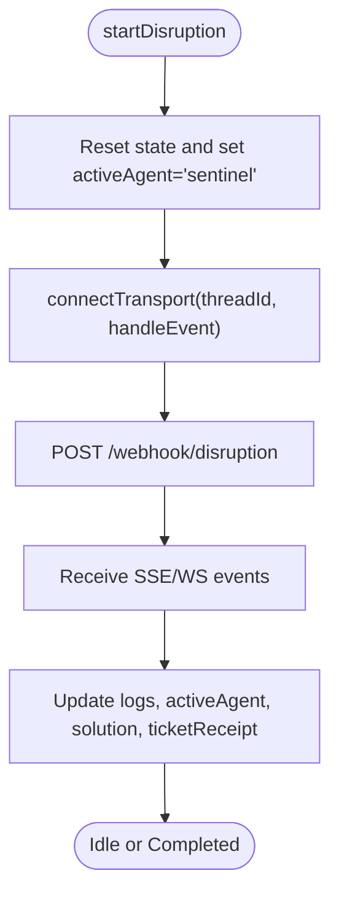

# Frontend Dashboard

<cite>
**Referenced Files in This Document**
- [App.vue](file://travel-recovery-os/frontend/src/App.vue)
- [SwarmPipeline.vue](file://travel-recovery-os/frontend/src/components/SwarmPipeline.vue)
- [LiveTerminal.vue](file://travel-recovery-os/frontend/src/components/LiveTerminal.vue)
- [DisruptionControl.vue](file://travel-recovery-os/frontend/src/components/DisruptionControl.vue)
- [RecoveryProposal.vue](file://travel-recovery-os/frontend/src/components/RecoveryProposal.vue)
- [MobileHitlMock.vue](file://travel-recovery-os/frontend/src/components/MobileHitlMock.vue)
- [Navbar.vue](file://travel-recovery-os/frontend/src/components/Navbar.vue)
- [useSwarmStream.js](file://travel-recovery-os/frontend/src/composables/useSwarmStream.js)
- [useConnection.js](file://travel-recovery-os/frontend/src/composables/useConnection.js)
- [api.js](file://travel-recovery-os/frontend/src/services/api.js)
- [tailwind.config.js](file://travel-recovery-os/frontend/tailwind.config.js)
- [main.js](file://travel-recovery-os/frontend/src/main.js)
- [package.json](file://travel-recovery-os/frontend/package.json)
</cite>

## Table of Contents
1. [Introduction](#introduction)
2. [Project Structure](#project-structure)
3. [Core Components](#core-components)
4. [Architecture Overview](#architecture-overview)
5. [Detailed Component Analysis](#detailed-component-analysis)
6. [Dependency Analysis](#dependency-analysis)
7. [Performance Considerations](#performance-considerations)
8. [Troubleshooting Guide](#troubleshooting-guide)
9. [Conclusion](#conclusion)
10. [Appendices](#appendices)

## Introduction
This document describes the Vue 3 command center dashboard for autonomous flight disruption recovery. It explains how the UI orchestrates a multi-agent swarm to detect disruptions, search alternatives, reason about optimal routes, and execute rebooking with human-in-the-loop approvals. The dashboard provides:
- SwarmPipeline for agent visualization
- LiveTerminal for real-time telemetry display
- DisruptionControl for manual scenario triggering
- RecoveryProposal for human-in-the-loop approvals and ticket confirmation
- A mobile-style WhatsApp mock for passenger interaction

Real-time communication uses Server-Sent Events (SSE) for streaming telemetry and WebSocket for bidirectional HITL decisions. State is managed via Vue composables, API integration is centralized, and styling uses TailwindCSS with custom theme tokens.

## Project Structure
The frontend is a Vue 3 + Vite application using TailwindCSS. Key directories:
- src/components: Presentational components (dashboard panels)
- src/composables: Reactive state and transport orchestration
- src/services: HTTP and URL helpers for backend integration
- Public assets and configuration files for build and runtime

**Diagram sources**
- [App.vue:178-218](file://travel-recovery-os/frontend/src/App.vue#L178-L218)
- [useSwarmStream.js:10-12](file://travel-recovery-os/frontend/src/composables/useSwarmStream.js#L10-L12)
- [useConnection.js:8-9](file://travel-recovery-os/frontend/src/composables/useConnection.js#L8-L9)
- [api.js:1-21](file://travel-recovery-os/frontend/src/services/api.js#L1-L21)

**Section sources**
- [App.vue:1-219](file://travel-recovery-os/frontend/src/App.vue#L1-L219)
- [package.json:1-25](file://travel-recovery-os/frontend/package.json#L1-L25)

## Core Components
- SwarmPipeline: Visualizes the current phase of the recovery pipeline across agents (Sentinel, Profile, Scout, Arbiter, Executor), showing status, timing, and live reasoning insights.
- LiveTerminal: Displays real-time logs in friendly or raw terminal modes, with filtering, search, export, and auto-scrolling.
- DisruptionControl: Provides preset scenarios, custom forms, and an AI parse mode to trigger recovery workflows. Emits a trigger event with payload.
- RecoveryProposal: Shows the selected route, scoring, financial savings, rationale, and ticket receipt when available; reflects HITL status.
- MobileHitlMock: Simulates a WhatsApp conversation with the passenger, including countdown timers, carousel of candidate routes, baggage and compensation info, and decision actions.
- Navbar: Displays branding, system status indicators, active PNR, latency, and a pitch guide modal.

These components are orchestrated by the useSwarmStream composable, which manages reactive state, connects to the backend via REST and real-time streams, and dispatches events to update the UI.

**Section sources**
- [SwarmPipeline.vue:1-166](file://travel-recovery-os/frontend/src/components/SwarmPipeline.vue#L1-L166)
- [LiveTerminal.vue:1-147](file://travel-recovery-os/frontend/src/components/LiveTerminal.vue#L1-L147)
- [DisruptionControl.vue:1-231](file://travel-recovery-os/frontend/src/components/DisruptionControl.vue#L1-L231)
- [RecoveryProposal.vue:1-171](file://travel-recovery-os/frontend/src/components/RecoveryProposal.vue#L1-L171)
- [MobileHitlMock.vue:1-480](file://travel-recovery-os/frontend/src/components/MobileHitlMock.vue#L1-L480)
- [Navbar.vue:1-189](file://travel-recovery-os/frontend/src/components/Navbar.vue#L1-L189)

## Architecture Overview
The dashboard follows a component-driven architecture with a central composable managing state and real-time streams.

**Diagram sources**
- [DisruptionControl.vue:227-229](file://travel-recovery-os/frontend/src/components/DisruptionControl.vue#L227-L229)
- [App.vue:193-212](file://travel-recovery-os/frontend/src/App.vue#L193-L212)
- [useSwarmStream.js:213-240](file://travel-recovery-os/frontend/src/composables/useSwarmStream.js#L213-L240)
- [useConnection.js:24-36](file://travel-recovery-os/frontend/src/composables/useConnection.js#L24-L36)
- [api.js:30-55](file://travel-recovery-os/frontend/src/services/api.js#L30-L55)

## Detailed Component Analysis

### SwarmPipeline
- Purpose: Visualize the multi-agent recovery pipeline with step-by-step status, timing, and live reasoning insight banner.
- Inputs: activeAgent, stepTimes
- Behavior: Computes current index from activeAgent, renders cards per step with dynamic classes and badges, shows connector chevrons, and displays agent-specific reasoning text.
- Complexity: O(n) rendering where n is number of steps (constant). Status computations are constant time per step.

**Diagram sources**
- [SwarmPipeline.vue:94-151](file://travel-recovery-os/frontend/src/components/SwarmPipeline.vue#L94-L151)

**Section sources**
- [SwarmPipeline.vue:1-166](file://travel-recovery-os/frontend/src/components/SwarmPipeline.vue#L1-L166)

### LiveTerminal
- Purpose: Real-time telemetry viewer with friendly timeline and raw terminal views, filters, search, export, and clear.
- Inputs: logs array
- Behavior: Filters logs by node and query, formats timestamps, auto-scrolls on new logs, exports JSON, and clears logs.
- Performance: Filtering is O(m) per render where m is log count; auto-scroll uses nextTick to avoid layout thrash.

**Diagram sources**
- [LiveTerminal.vue:84-95](file://travel-recovery-os/frontend/src/components/LiveTerminal.vue#L84-L95)

**Section sources**
- [LiveTerminal.vue:1-147](file://travel-recovery-os/frontend/src/components/LiveTerminal.vue#L1-L147)

### DisruptionControl
- Purpose: Trigger recovery workflows via presets, custom form, or AI parse mode.
- Inputs: isStreaming
- Behavior: Manages input mode, selects presets, validates form, emits trigger with payload including thread_id and optional raw_text for AI parsing.
- UX: Includes quick sample messages, airport dropdowns, loyalty tier selection, and animated CTA.

**Diagram sources**
- [DisruptionControl.vue:222-229](file://travel-recovery-os/frontend/src/components/DisruptionControl.vue#L222-L229)

**Section sources**
- [DisruptionControl.vue:1-231](file://travel-recovery-os/frontend/src/components/DisruptionControl.vue#L1-L231)

### RecoveryProposal
- Purpose: Display selected recovery plan, score, financial savings, rationale, and ticket receipt; reflect HITL status.
- Inputs: solution, hitlStatus, ticketReceipt
- Behavior: Renders boarding pass-like card with score ring, savings metrics, and ticket confirmation block when available.

**Diagram sources**
- [RecoveryProposal.vue:165-169](file://travel-recovery-os/frontend/src/components/RecoveryProposal.vue#L165-L169)

**Section sources**
- [RecoveryProposal.vue:1-171](file://travel-recovery-os/frontend/src/components/RecoveryProposal.vue#L1-L171)

### MobileHitlMock
- Purpose: Simulate passenger WhatsApp channel with notifications, countdown timer, flight carousel, baggage and compensation info, and decision actions.
- Inputs: hitlStatus, isStreaming, solution, ticketReceipt, disruptionData, passengerName, pnr, candidateRoutes, baggageContext, compensationResult
- Behavior: Watches props to push chat messages, starts/stops countdown, navigates candidates, submits decisions, and calls backend chat API.

**Diagram sources**
- [MobileHitlMock.vue:419-447](file://travel-recovery-os/frontend/src/components/MobileHitlMock.vue#L419-L447)
- [MobileHitlMock.vue:449-475](file://travel-recovery-os/frontend/src/components/MobileHitlMock.vue#L449-L475)

**Section sources**
- [MobileHitlMock.vue:1-480](file://travel-recovery-os/frontend/src/components/MobileHitlMock.vue#L1-L480)

### Navbar
- Purpose: Branding, system status, active PNR, latency, and pitch guide modal.
- Inputs: activePnr, systemStatus, latencyMs
- Behavior: Displays live indicators and opens a teleported modal with pitch content.

**Section sources**
- [Navbar.vue:1-189](file://travel-recovery-os/frontend/src/components/Navbar.vue#L1-L189)

## Dependency Analysis
- App.vue composes all major components and wires them to useSwarmStream.
- useSwarmStream coordinates state, logging, and real-time events; it depends on api.js for REST endpoints and useConnection.js for SSE/WebSocket.
- useConnection.js abstracts transport, preferring SSE for streaming and WebSocket for bidirectional HITL decisions.
- api.js centralizes environment-based base URLs and tokenized headers, exposing methods for status, disruption triggers, consensus, history, stats, details, and chat.

**Diagram sources**
- [App.vue:178-212](file://travel-recovery-os/frontend/src/App.vue#L178-L212)
- [useSwarmStream.js:10-12](file://travel-recovery-os/frontend/src/composables/useSwarmStream.js#L10-L12)
- [useConnection.js:8-9](file://travel-recovery-os/frontend/src/composables/useConnection.js#L8-L9)
- [api.js:1-21](file://travel-recovery-os/frontend/src/services/api.js#L1-L21)

**Section sources**
- [useSwarmStream.js:1-282](file://travel-recovery-os/frontend/src/composables/useSwarmStream.js#L1-L282)
- [useConnection.js:1-107](file://travel-recovery-os/frontend/src/composables/useConnection.js#L1-L107)
- [api.js:1-100](file://travel-recovery-os/frontend/src/services/api.js#L1-L100)

## Performance Considerations
- Streaming efficiency: SSE is used for unidirectional telemetry; WebSocket is opened for bidirectional HITL decisions. Connection mode is tracked and falls back gracefully.
- Log volume: LiveTerminal filters and searches logs client-side; consider virtualization if logs grow large.
- Rendering: SwarmPipeline computes statuses per step; keep step list small and avoid heavy recomputation.
- Network latency: Stream latency is measured and displayed; periodic system status polling runs every 15 seconds in App.vue.
- Memory: Logs accumulate; provide clear/export functionality to manage memory usage.

[No sources needed since this section provides general guidance]

## Troubleshooting Guide
- No events received: Verify connection mode and that SSE/WebSocket URLs are correct; check browser console for non-JSON warnings.
- HITL not responding: Ensure WebSocket is open before sending HITL_DECISION; fallback REST call posts consensus.
- Logs not updating: Confirm appendLog is called and logs array is reactive; ensure auto-scroll logic is triggered.
- API errors: Check auth headers and base URL; inspect error messages thrown by apiClient methods.

**Section sources**
- [useConnection.js:38-83](file://travel-recovery-os/frontend/src/composables/useConnection.js#L38-L83)
- [useSwarmStream.js:85-125](file://travel-recovery-os/frontend/src/composables/useSwarmStream.js#L85-L125)
- [api.js:23-55](file://travel-recovery-os/frontend/src/services/api.js#L23-L55)

## Conclusion
The dashboard integrates a robust multi-agent workflow visualization with real-time telemetry and human-in-the-loop controls. The composable layer cleanly separates concerns between state, transport, and API interactions, while components remain focused on presentation and user interaction. TailwindCSS customization enables a cohesive, accessible, and responsive design.

[No sources needed since this section summarizes without analyzing specific files]

## Appendices

### Real-Time Communication Patterns
- SSE: Primary stream for telemetry events; parsed JSON payloads invoke onMessage callbacks.
- WebSocket: Bidirectional channel for HITL decisions; sends structured messages and receives responses.
- Fallback: If WebSocket fails, connection mode switches to SSE; both transports are closed on unmount.

**Diagram sources**
- [useConnection.js:24-36](file://travel-recovery-os/frontend/src/composables/useConnection.js#L24-L36)
- [useConnection.js:38-83](file://travel-recovery-os/frontend/src/composables/useConnection.js#L38-L83)

**Section sources**
- [useConnection.js:1-107](file://travel-recovery-os/frontend/src/composables/useConnection.js#L1-L107)

### State Management with Vue Composables
- useSwarmStream exposes reactive refs and objects for activeAgent, isStreaming, hitlStatus, logs, proposedSolution, candidateRoutes, ticketReceipt, and more.
- Event handling maps backend event types to UI state updates and logging.
- Actions include starting disruptions, resolving HITL decisions, disconnecting, and clearing logs.

**Diagram sources**
- [useSwarmStream.js:213-240](file://travel-recovery-os/frontend/src/composables/useSwarmStream.js#L213-L240)
- [useSwarmStream.js:98-125](file://travel-recovery-os/frontend/src/composables/useSwarmStream.js#L98-L125)

**Section sources**
- [useSwarmStream.js:1-282](file://travel-recovery-os/frontend/src/composables/useSwarmStream.js#L1-L282)

### API Service Integration
- Base URL and token are configured via environment variables.
- Methods cover system status, disruption triggers, consensus resolution, history retrieval, analytics, detail fetch, and chat messaging.
- URL builders convert HTTP base to WebSocket URLs for real-time channels.

**Section sources**
- [api.js:1-100](file://travel-recovery-os/frontend/src/services/api.js#L1-L100)

### Responsive Design and Styling with TailwindCSS
- Custom theme defines brand colors, warm neutrals, status colors, fonts, shadows, gradients, and animations.
- Components use utility classes for layout, spacing, typography, and interactive states.
- Animations include slide-up, fade-in, shimmer, float, and ping variants.

**Section sources**
- [tailwind.config.js:1-130](file://travel-recovery-os/frontend/tailwind.config.js#L1-L130)

### Accessibility Considerations
- Use semantic HTML elements (buttons, inputs, labels) and ensure focus styles are visible.
- Provide alt text for images and meaningful labels for interactive controls.
- Ensure sufficient color contrast for text and status indicators.
- Keyboard navigation should be supported for all actionable elements.

[No sources needed since this section provides general guidance]

### Extending the Dashboard
To add a new component or visualization:
- Create a new Vue component under src/components with props and emits aligned with existing patterns.
- Integrate state via useSwarmStream by extending event handling and state updates.
- Add UI slots in App.vue to place the component within the grid layout.
- Optionally extend LiveTerminal filters or add new view modes for richer telemetry.
- Use Tailwind utilities and theme tokens for consistent styling.

Example extension points:
- New agent step: Extend SwarmPipeline steps and mapping functions.
- New telemetry source: Append logs in useSwarmStream and filter in LiveTerminal.
- New HITL flow: Add decision types in useSwarmStream and UI in MobileHitlMock.

[No sources needed since this section provides general guidance]