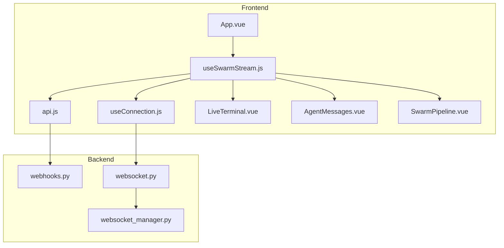
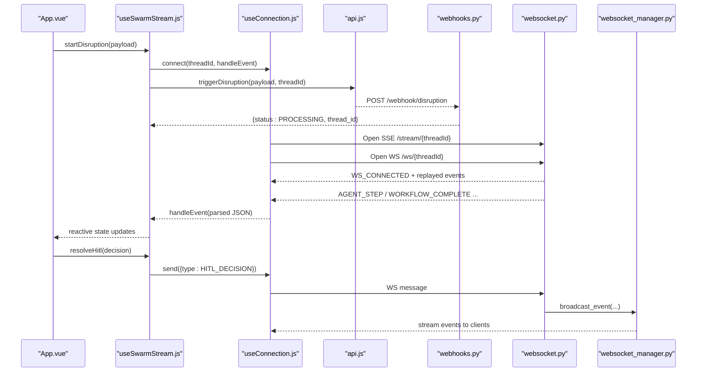
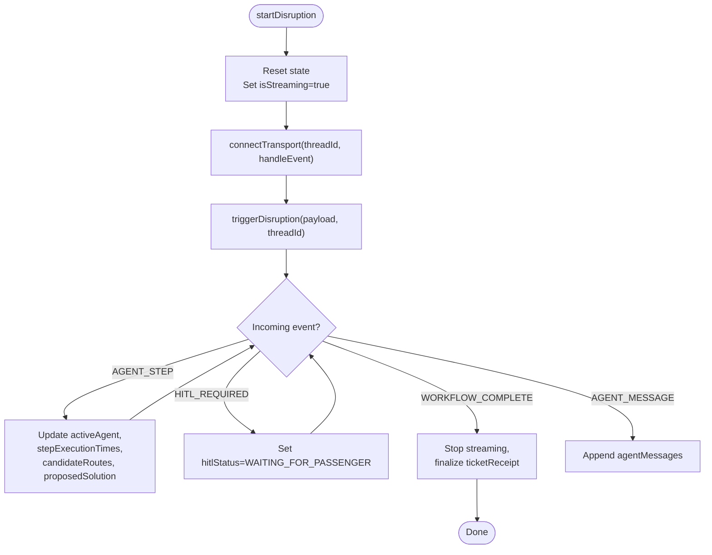
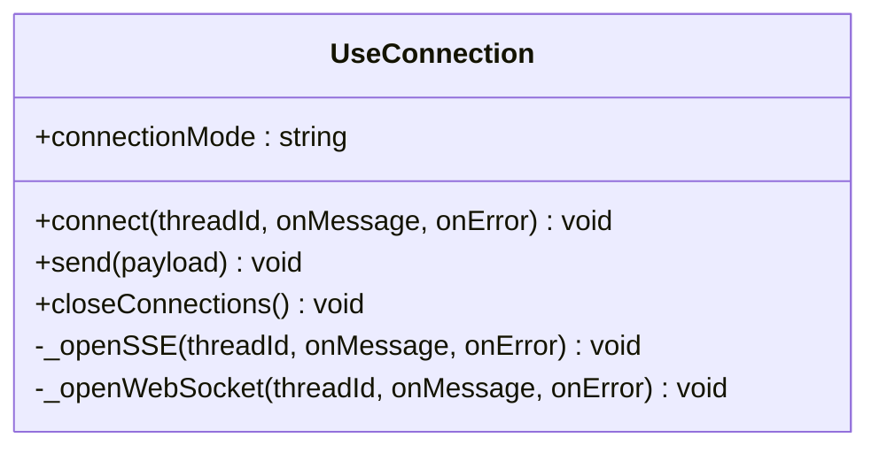
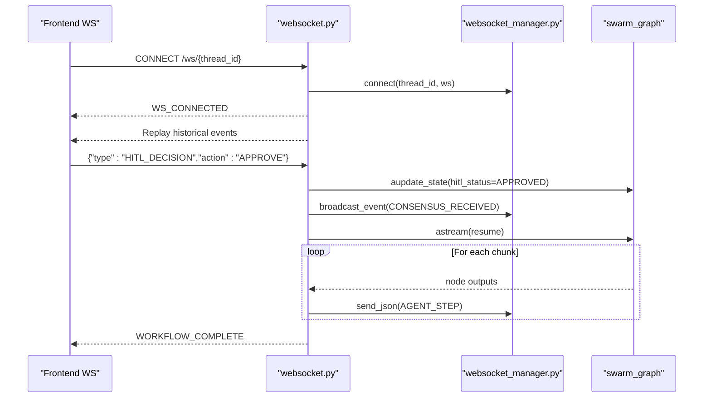
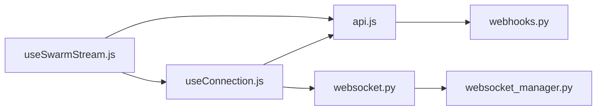

# Real-time Communication

<cite>
**Referenced Files in This Document**
- [useSwarmStream.js](file://travel-recovery-os/frontend/src/composables/useSwarmStream.js)
- [useConnection.js](file://travel-recovery-os/frontend/src/composables/useConnection.js)
- [api.js](file://travel-recovery-os/frontend/src/services/api.js)
- [websocket.py](file://travel-recovery-os/backend/api/routers/websocket.py)
- [websocket_manager.py](file://travel-recovery-os/backend/services/websocket_manager.py)
- [webhooks.py](file://travel-recovery-os/backend/api/routers/webhooks.py)
- [App.vue](file://travel-recovery-os/frontend/src/App.vue)
- [LiveTerminal.vue](file://travel-recovery-os/frontend/src/components/LiveTerminal.vue)
- [AgentMessages.vue](file://travel-recovery-os/frontend/src/components/AgentMessages.vue)
- [SwarmPipeline.vue](file://travel-recovery-os/frontend/src/components/SwarmPipeline.vue)
</cite>

## Table of Contents
1. [Introduction](#introduction)
2. [Project Structure](#project-structure)
3. [Core Components](#core-components)
4. [Architecture Overview](#architecture-overview)
5. [Detailed Component Analysis](#detailed-component-analysis)
6. [Dependency Analysis](#dependency-analysis)
7. [Performance Considerations](#performance-considerations)
8. [Troubleshooting Guide](#troubleshooting-guide)
9. [Conclusion](#conclusion)

## Introduction
This document explains the frontend real-time communication patterns used to stream multi-agent recovery events from the backend to the UI. It focuses on the useSwarmStream composable that orchestrates Server-Sent Events (SSE) and WebSocket connections, event routing, state synchronization, error handling, and cleanup. It also documents the API service layer for REST endpoints and authentication headers, and shows how components consume real-time data.

## Project Structure
The real-time pipeline spans a small set of frontend composables and services, plus backend routers and a connection manager:
- Frontend
  - Composables: useSwarmStream (event orchestration), useConnection (transport layer)
  - Services: api.js (REST + URL builders)
  - Components: LiveTerminal, AgentMessages, SwarmPipeline, App (root integration)
- Backend
  - Routers: webhooks (REST triggers), websocket (bidirectional channel)
  - Services: websocket_manager (connection fan-out per thread)

**Diagram sources**
- [App.vue:178-218](file://travel-recovery-os/frontend/src/App.vue#L178-L218)
- [useSwarmStream.js:64-280](file://travel-recovery-os/frontend/src/composables/useSwarmStream.js#L64-L280)
- [useConnection.js:16-105](file://travel-recovery-os/frontend/src/composables/useConnection.js#L16-L105)
- [api.js:1-99](file://travel-recovery-os/frontend/src/services/api.js#L1-L99)
- [webhooks.py:14-72](file://travel-recovery-os/backend/api/routers/webhooks.py#L14-L72)
- [websocket.py:21-92](file://travel-recovery-os/backend/api/routers/websocket.py#L21-L92)
- [websocket_manager.py:16-74](file://travel-recovery-os/backend/services/websocket_manager.py#L16-L74)

**Section sources**
- [App.vue:178-218](file://travel-recovery-os/frontend/src/App.vue#L178-L218)
- [useSwarmStream.js:64-280](file://travel-recovery-os/frontend/src/composables/useSwarmStream.js#L64-L280)
- [useConnection.js:16-105](file://travel-recovery-os/frontend/src/composables/useConnection.js#L16-L105)
- [api.js:1-99](file://travel-recovery-os/frontend/src/services/api.js#L1-L99)
- [webhooks.py:14-72](file://travel-recovery-os/backend/api/routers/webhooks.py#L14-L72)
- [websocket.py:21-92](file://travel-recovery-os/backend/api/routers/websocket.py#L21-L92)
- [websocket_manager.py:16-74](file://travel-recovery-os/backend/services/websocket_manager.py#L16-L74)

## Core Components
- useSwarmStream: Orchestrates streaming lifecycle, event parsing, state updates, HITL resolution, and cleanup.
- useConnection: Opens SSE as primary stream and WebSocket as secondary bidirectional channel; exposes send/close.
- api.js: Provides REST methods with optional Authorization header and URL builders for /stream and /ws.
- Backend websocket router: Accepts WS connections, replays history, handles PING/HITL_DECISION, resumes graph, and broadcasts events.
- Backend websocket manager: Tracks per-thread connections and fans out messages.

Key responsibilities:
- Connection lifecycle: connect on disruption start, close on unmount or disconnect.
- Event routing: map server event types to UI state changes (agent steps, HITL required, workflow complete).
- Data sync: keep proposedSolution, candidateRoutes, ticketReceipt, logs, and stepExecutionTimes in sync with backend events.
- Error handling: log errors, mark completion/failure states, ensure cleanup.

**Section sources**
- [useSwarmStream.js:64-280](file://travel-recovery-os/frontend/src/composables/useSwarmStream.js#L64-L280)
- [useConnection.js:16-105](file://travel-recovery-os/frontend/src/composables/useConnection.js#L16-L105)
- [api.js:1-99](file://travel-recovery-os/frontend/src/services/api.js#L1-L99)
- [websocket.py:21-92](file://travel-recovery-os/backend/api/routers/websocket.py#L21-L92)
- [websocket_manager.py:16-74](file://travel-recovery-os/backend/services/websocket_manager.py#L16-L74)

## Architecture Overview
The system uses a dual-channel approach:
- SSE for reliable one-way telemetry streaming from backend to frontend.
- WebSocket for bidirectional signaling (e.g., HITL decisions) and optional replay of historical events.

**Diagram sources**
- [App.vue:178-218](file://travel-recovery-os/frontend/src/App.vue#L178-L218)
- [useSwarmStream.js:213-257](file://travel-recovery-os/frontend/src/composables/useSwarmStream.js#L213-L257)
- [useConnection.js:24-92](file://travel-recovery-os/frontend/src/composables/useConnection.js#L24-L92)
- [api.js:30-55](file://travel-recovery-os/frontend/src/services/api.js#L30-L55)
- [webhooks.py:23-72](file://travel-recovery-os/backend/api/routers/webhooks.py#L23-L72)
- [websocket.py:21-92](file://travel-recovery-os/backend/api/routers/websocket.py#L21-L92)
- [websocket_manager.py:42-60](file://travel-recovery-os/backend/services/websocket_manager.py#L42-L60)

## Detailed Component Analysis

### useSwarmStream: Event Orchestration and State Sync
Responsibilities:
- Initialize and manage streaming session per thread.
- Parse incoming events and update reactive state: active agent, logs, proposed solution, candidate routes, ticket receipt, step execution times.
- Handle HITL flow: set waiting status, accept user decision via WebSocket and REST fallback.
- Provide cleanup on component unmount.

Event handling highlights:
- AGENT_STEP: maps node names to active agent and updates step timing and state fragments.
- HITL_REQUIRED: prepares proposed solution and sets HITL waiting state.
- WORKFLOW_COMPLETE: finalizes ticket receipt and stops streaming.

Cleanup:
- Closes connections on unmount and provides explicit disconnect method.

**Diagram sources**
- [useSwarmStream.js:213-257](file://travel-recovery-os/frontend/src/composables/useSwarmStream.js#L213-L257)
- [useSwarmStream.js:98-189](file://travel-recovery-os/frontend/src/composables/useSwarmStream.js#L98-L189)

**Section sources**
- [useSwarmStream.js:64-280](file://travel-recovery-os/frontend/src/composables/useSwarmStream.js#L64-L280)

### useConnection: Transport Layer (SSE + WebSocket)
Responsibilities:
- Open SSE as primary stream for telemetry.
- Open WebSocket as secondary channel for bidirectional messaging.
- Route parsed JSON events to the provided callback.
- Expose send() for WS-only messages and closeConnections() for cleanup.

Connection mode tracking:
- Starts as 'sse', switches to 'websocket' if WS opens successfully, falls back to 'sse' when WS closes.

Error handling:
- Logs non-JSON packets and SSE/WS errors without crashing.

**Diagram sources**
- [useConnection.js:16-105](file://travel-recovery-os/frontend/src/composables/useConnection.js#L16-L105)

**Section sources**
- [useConnection.js:16-105](file://travel-recovery-os/frontend/src/composables/useConnection.js#L16-L105)

### API Service Layer: REST and Authentication
Responsibilities:
- Build URLs for streaming and WebSocket endpoints based on base URL.
- Attach Authorization header when token is configured.
- Provide methods for system status, triggering disruptions, resolving consensus, fetching history/stats/details, and sending chat messages.

Authentication:
- Optional Bearer token via environment variable; headers applied to relevant requests.

Endpoints used by real-time flow:
- POST /webhook/disruption to start swarm and receive thread_id.
- POST /webhook/consensus to submit passenger decision (fallback durability).

**Section sources**
- [api.js:1-99](file://travel-recovery-os/frontend/src/services/api.js#L1-L99)

### Backend WebSocket Router and Manager
Responsibilities:
- Accept WS connections per thread, send confirmation, replay historical events, handle PING and HITL_DECISION.
- On approval, resume the LangGraph and stream remaining steps to all connected clients.
- Manage per-thread connections and fan-out messages safely.

**Diagram sources**
- [websocket.py:21-92](file://travel-recovery-os/backend/api/routers/websocket.py#L21-L92)
- [websocket.py:95-195](file://travel-recovery-os/backend/api/routers/websocket.py#L95-L195)
- [websocket_manager.py:16-74](file://travel-recovery-os/backend/services/websocket_manager.py#L16-L74)

**Section sources**
- [websocket.py:21-92](file://travel-recovery-os/backend/api/routers/websocket.py#L21-L92)
- [websocket_manager.py:16-74](file://travel-recovery-os/backend/services/websocket_manager.py#L16-L74)

### Consuming Real-Time Data in Components
Components subscribe to reactive state exposed by useSwarmStream:
- SwarmPipeline displays current phase and step timings.
- LiveTerminal renders logs with filtering and export.
- AgentMessages displays inter-agent messages.
- App.vue wires everything together and periodically fetches system status.

Examples:
- Displaying live telemetry: pass logs array to LiveTerminal.
- Showing pipeline progress: bind activeAgent and stepExecutionTimes to SwarmPipeline.
- Handling HITL: call resolveHitl from MobileHitlMock to approve/reject.

Cleanup procedures:
- useSwarmStream registers onUnmounted to close connections automatically.
- Explicit disconnect available for manual control.

**Section sources**
- [App.vue:178-218](file://travel-recovery-os/frontend/src/App.vue#L178-L218)
- [LiveTerminal.vue:72-146](file://travel-recovery-os/frontend/src/components/LiveTerminal.vue#L72-L146)
- [AgentMessages.vue:44-93](file://travel-recovery-os/frontend/src/components/AgentMessages.vue#L44-L93)
- [SwarmPipeline.vue:80-165](file://travel-recovery-os/frontend/src/components/SwarmPipeline.vue#L80-L165)
- [useSwarmStream.js:268-280](file://travel-recovery-os/frontend/src/composables/useSwarmStream.js#L268-L280)

## Dependency Analysis
Coupling and cohesion:
- useSwarmStream depends on useConnection for transport and api.js for REST calls; it centralizes event logic and state.
- useConnection encapsulates transport details, isolating SSE/WS specifics from business logic.
- api.js is a thin HTTP client with URL builders and optional auth headers.
- Backend routers depend on websocket_manager for fan-out and on the swarm graph for state transitions.

Potential circular dependencies:
- None observed between modules; clear separation between composables, services, and backend routers.

External integrations:
- Environment-based base URL and token for API access.
- Backend services (LLM/GDS/n8n) are invoked indirectly via the swarm runner and webhooks.

**Diagram sources**
- [useSwarmStream.js:10-12](file://travel-recovery-os/frontend/src/composables/useSwarmStream.js#L10-L12)
- [useConnection.js:8-9](file://travel-recovery-os/frontend/src/composables/useConnection.js#L8-L9)
- [api.js:1-21](file://travel-recovery-os/frontend/src/services/api.js#L1-L21)
- [webhooks.py:14-72](file://travel-recovery-os/backend/api/routers/webhooks.py#L14-L72)
- [websocket.py:21-92](file://travel-recovery-os/backend/api/routers/websocket.py#L21-L92)
- [websocket_manager.py:16-74](file://travel-recovery-os/backend/services/websocket_manager.py#L16-L74)

**Section sources**
- [useSwarmStream.js:10-12](file://travel-recovery-os/frontend/src/composables/useSwarmStream.js#L10-L12)
- [useConnection.js:8-9](file://travel-recovery-os/frontend/src/composables/useConnection.js#L8-L9)
- [api.js:1-21](file://travel-recovery-os/frontend/src/services/api.js#L1-L21)
- [webhooks.py:14-72](file://travel-recovery-os/backend/api/routers/webhooks.py#L14-L72)
- [websocket.py:21-92](file://travel-recovery-os/backend/api/routers/websocket.py#L21-L92)
- [websocket_manager.py:16-74](file://travel-recovery-os/backend/services/websocket_manager.py#L16-L74)

## Performance Considerations
- Prefer SSE for high-volume telemetry due to reliability and simplicity; use WebSocket only for low-frequency signaling like HITL decisions.
- Avoid heavy processing inside onmessage handlers; keep event handlers lightweight and push work to next tick or queues if needed.
- Debounce or throttle frequent UI updates where appropriate (e.g., terminal scrolling).
- Monitor connectionMode and latency metrics to detect degraded paths.

[No sources needed since this section provides general guidance]

## Troubleshooting Guide
Common issues and remedies:
- No events received: verify thread_id matches between trigger and stream URLs; check network connectivity and CORS; inspect browser console for SSE/WS errors.
- WebSocket not opening: ensure base URL supports ws/wss; confirm server-side WS endpoint is reachable.
- Inconsistent state after reconnect: rely on WS replay of historical events; ensure thread_id remains constant during a session.
- Cleanup failures: ensure closeConnections is called on unmount; avoid leaving stale EventSource or WebSocket instances.

Relevant behaviors:
- useConnection logs non-JSON packets and SSE/WS errors without breaking the stream.
- useSwarmStream resets streaming flags and cleans up on disconnect/unmount.
- Backend sends WS_ERROR for invalid messages or unknown types.

**Section sources**
- [useConnection.js:47-83](file://travel-recovery-os/frontend/src/composables/useConnection.js#L47-L83)
- [useSwarmStream.js:259-268](file://travel-recovery-os/frontend/src/composables/useSwarmStream.js#L259-L268)
- [websocket.py:67-89](file://travel-recovery-os/backend/api/routers/websocket.py#L67-L89)

## Conclusion
The frontend real-time architecture centers on useSwarmStream, which coordinates SSE and WebSocket channels to deliver robust, reactive updates to the UI. The transport layer abstracts connection details, while the API service layer standardizes REST interactions and authentication. Components consume reactive state to render live telemetry, pipeline progress, and agent messages. The backend ensures reliable delivery through per-thread connection management and event broadcasting. Together, these pieces provide a resilient, scalable foundation for real-time multi-agent workflows.