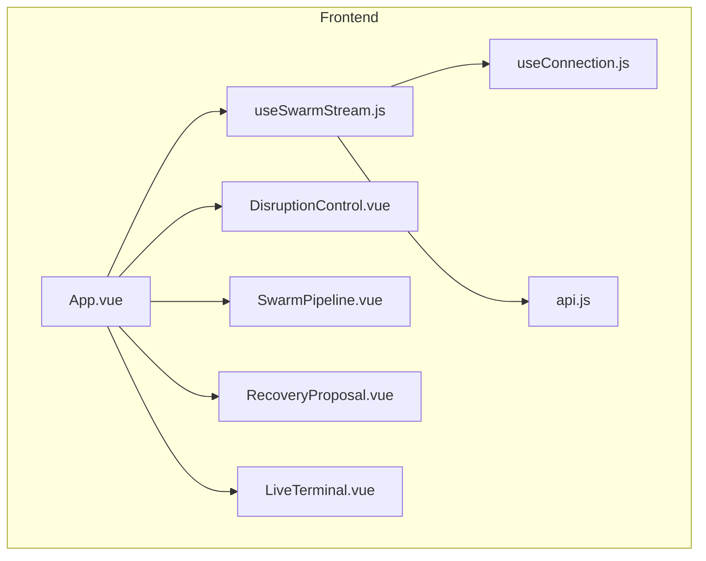
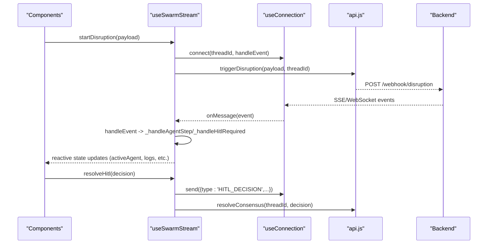
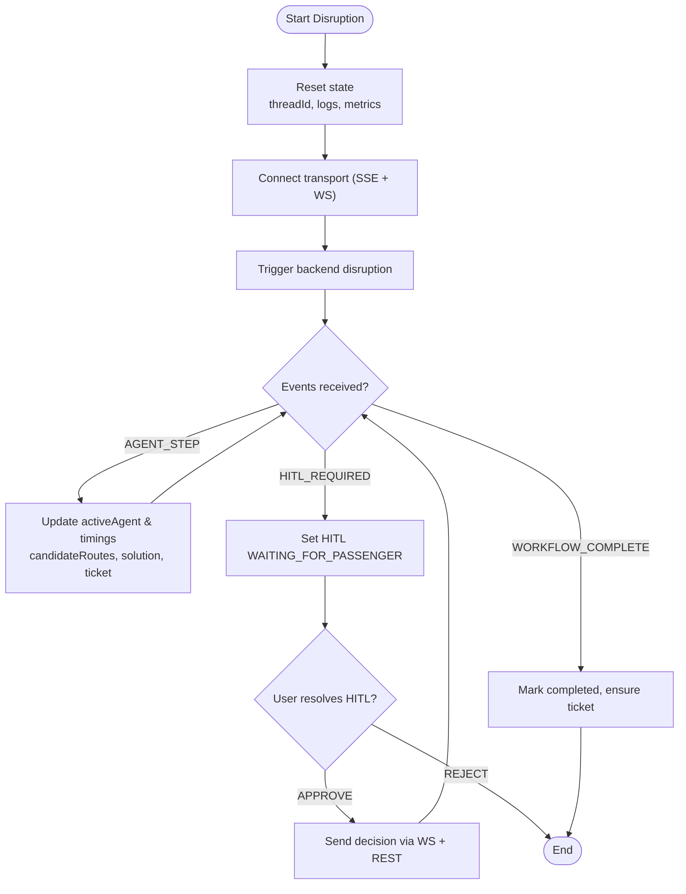
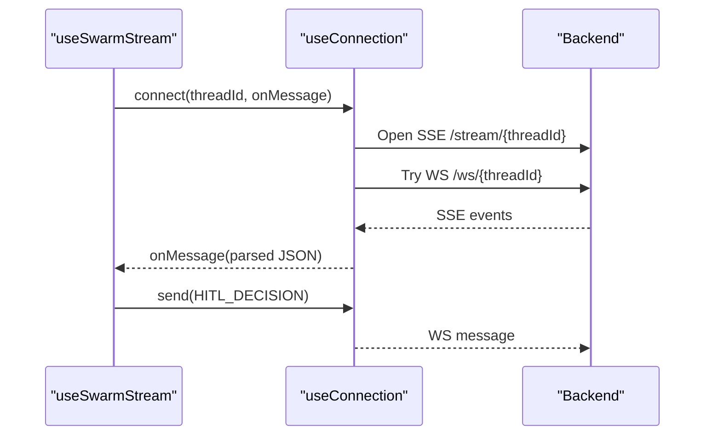
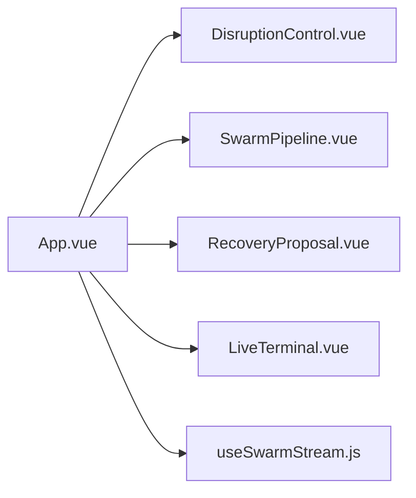
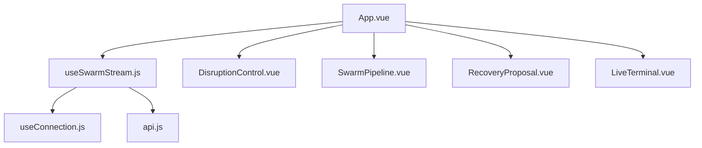

# State Management

<cite>
**Referenced Files in This Document**
- [useSwarmStream.js](file://travel-recovery-os/frontend/src/composables/useSwarmStream.js)
- [useConnection.js](file://travel-recovery-os/frontend/src/composables/useConnection.js)
- [api.js](file://travel-recovery-os/frontend/src/services/api.js)
- [App.vue](file://travel-recovery-os/frontend/src/App.vue)
- [DisruptionControl.vue](file://travel-recovery-os/frontend/src/components/DisruptionControl.vue)
- [SwarmPipeline.vue](file://travel-recovery-os/frontend/src/components/SwarmPipeline.vue)
- [RecoveryProposal.vue](file://travel-recovery-os/frontend/src/components/RecoveryProposal.vue)
- [LiveTerminal.vue](file://travel-recovery-os/frontend/src/components/LiveTerminal.vue)
- [main.js](file://travel-recovery-os/frontend/src/main.js)
</cite>

## Table of Contents
1. [Introduction](#introduction)
2. [Project Structure](#project-structure)
3. [Core Components](#core-components)
4. [Architecture Overview](#architecture-overview)
5. [Detailed Component Analysis](#detailed-component-analysis)
6. [Dependency Analysis](#dependency-analysis)
7. [Performance Considerations](#performance-considerations)
8. [Troubleshooting Guide](#troubleshooting-guide)
9. [Conclusion](#conclusion)

## Introduction
This document explains the state management approach for the Travel Recovery OS frontend using Vue 3 composables and reactive state. The central composable, useSwarmStream, manages global application state including active agents, streaming status, disruption data, proposed solutions, system metrics, logs, and agent messages. It coordinates real-time event routing from a transport layer (WebSocket with SSE fallback), updates UI components reactively, handles asynchronous operations, and maintains consistency across the app.

The design emphasizes:
- A single source of truth for swarm-related state via a module-level singleton exposed by useSwarmStream
- Reactive patterns that automatically update UI when backend events arrive
- Robust error handling and connection mode awareness
- Clear separation between transport (useConnection) and business logic/state (useSwarmStream)

## Project Structure
At a high level:
- App.vue orchestrates the UI and consumes the shared state from useSwarmStream
- useSwarmStream holds global state and exposes actions to start disruptions, resolve human-in-the-loop decisions, and fetch system status
- useConnection provides WebSocket and Server-Sent Events transport, emitting parsed JSON events back into useSwarmStream
- api.js encapsulates HTTP calls and URL builders for streams and websockets
- Components like DisruptionControl, SwarmPipeline, RecoveryProposal, and LiveTerminal consume reactive state and emit user actions

**Diagram sources**
- [App.vue:178-218](file://travel-recovery-os/frontend/src/App.vue#L178-L218)
- [useSwarmStream.js:10-12](file://travel-recovery-os/frontend/src/composables/useSwarmStream.js#L10-L12)
- [useConnection.js:1-10](file://travel-recovery-os/frontend/src/composables/useConnection.js#L1-L10)
- [api.js:1-21](file://travel-recovery-os/frontend/src/services/api.js#L1-L21)

**Section sources**
- [App.vue:178-218](file://travel-recovery-os/frontend/src/App.vue#L178-L218)
- [useSwarmStream.js:10-12](file://travel-recovery-os/frontend/src/composables/useSwarmStream.js#L10-L12)
- [useConnection.js:1-10](file://travel-recovery-os/frontend/src/composables/useConnection.js#L1-L10)
- [api.js:1-21](file://travel-recovery-os/frontend/src/services/api.js#L1-L21)

## Core Components
- useSwarmStream: Central composable that owns global state and orchestrates streaming, event handling, and actions. It exposes reactive refs and objects for activeAgent, isStreaming, threadId, hitlStatus, streamLatencyMs, systemStatus, disruptionData, proposedSolution, candidateRoutes, ticketReceipt, stepExecutionTimes, baggageContext, compensationResult, agentMessages, plus methods to fetchSystemStatus, startDisruption, resolveHitl, disconnect, clearLogs.
- useConnection: Transport abstraction that opens SSE and WebSocket connections per thread, parses incoming JSON events, and exposes send/close utilities. It tracks connectionMode ('websocket' | 'sse' | 'none').
- api.js: Provides endpoints for system status, triggering disruptions, resolving consensus, history, stats, and chat. Also builds stream and websocket URLs.

Key responsibilities:
- Event-driven state updates: handleEvent routes backend events to specific handlers (_handleAgentStep, _handleHitlRequired) and updates state accordingly
- Asynchronous flows: startDisruption connects transport, triggers backend, and sets up streaming; resolveHitl sends decision via WebSocket and persists via REST
- Read-only exposure: some reactive values are returned as readonly to prevent accidental mutation from consumers

**Section sources**
- [useSwarmStream.js:14-58](file://travel-recovery-os/frontend/src/composables/useSwarmStream.js#L14-L58)
- [useSwarmStream.js:64-281](file://travel-recovery-os/frontend/src/composables/useSwarmStream.js#L64-L281)
- [useConnection.js:16-106](file://travel-recovery-os/frontend/src/composables/useConnection.js#L16-L106)
- [api.js:23-99](file://travel-recovery-os/frontend/src/services/api.js#L23-L99)

## Architecture Overview
The state architecture follows a unidirectional flow:
- User actions in components trigger composable methods
- Composable updates reactive state and invokes transport/API
- Backend emits events over SSE/WebSocket
- Transport parses events and calls the composable’s onMessage handler
- Composable mutates state, which re-renders all subscribed components

**Diagram sources**
- [useSwarmStream.js:213-257](file://travel-recovery-os/frontend/src/composables/useSwarmStream.js#L213-L257)
- [useConnection.js:24-92](file://travel-recovery-os/frontend/src/composables/useConnection.js#L24-L92)
- [api.js:30-55](file://travel-recovery-os/frontend/src/services/api.js#L30-L55)

## Detailed Component Analysis

### useSwarmStream: Global State and Event Routing
- State model:
  - Active agent lifecycle: idle → sentinel → profile → scout → arbiter → executor → completed (with optional HITL pause at arbiter)
  - Streaming control: isStreaming toggled during runs
  - Thread context: threadId ties events to a session
  - HITL: hitlStatus transitions IDLE → WAITING_FOR_PASSENGER → APPROVED/REJECTED or BYPASSED based on loyalty tier
  - Metrics: streamLatencyMs updated per system status call; stepExecutionTimes tracks per-agent durations
  - Data: disruptionData, proposedSolution, candidateRoutes, ticketReceipt, baggageContext, compensationResult, agentMessages, logs
- Event handling:
  - AGENT_STEP updates activeAgent and step timing, populates candidate routes, selected solution, and ticket receipt
  - HITL_REQUIRED pauses pipeline and prepares passenger consent UI
  - WORKFLOW_COMPLETE finalizes state and ensures ticket receipt presence
- Actions:
  - startDisruption resets state, connects transport, triggers backend, and starts streaming
  - resolveHitl sends decision via WebSocket and persists via REST
  - disconnect closes transports and clears streaming flags
  - fetchSystemStatus polls backend and updates systemStatus and latency

**Diagram sources**
- [useSwarmStream.js:213-257](file://travel-recovery-os/frontend/src/composables/useSwarmStream.js#L213-L257)
- [useSwarmStream.js:98-209](file://travel-recovery-os/frontend/src/composables/useSwarmStream.js#L98-L209)

**Section sources**
- [useSwarmStream.js:14-58](file://travel-recovery-os/frontend/src/composables/useSwarmStream.js#L14-L58)
- [useSwarmStream.js:68-281](file://travel-recovery-os/frontend/src/composables/useSwarmStream.js#L68-L281)

### useConnection: Transport Layer
- Opens SSE first, then attempts WebSocket; falls back gracefully if WS fails
- Parses incoming JSON events and forwards them to the provided onMessage callback
- Tracks connectionMode to inform UI about current transport
- Exposes send for outbound messages (e.g., HITL decisions) and closeConnections for cleanup

**Diagram sources**
- [useConnection.js:24-92](file://travel-recovery-os/frontend/src/composables/useConnection.js#L24-L92)

**Section sources**
- [useConnection.js:16-106](file://travel-recovery-os/frontend/src/composables/useConnection.js#L16-L106)

### App.vue: Composition Root
- Consumes useSwarmStream to expose reactive state to child components
- Initializes system status polling on mount
- Binds component props to shared state and forwards events to composable methods

**Diagram sources**
- [App.vue:178-218](file://travel-recovery-os/frontend/src/App.vue#L178-L218)

**Section sources**
- [App.vue:178-218](file://travel-recovery-os/frontend/src/App.vue#L178-L218)

### DisruptionControl.vue: Input and Trigger
- Manages local form state and preset selection
- Emits a trigger event with payload to start a disruption run
- Respects isStreaming to disable repeated triggers

**Section sources**
- [DisruptionControl.vue:177-231](file://travel-recovery-os/frontend/src/components/DisruptionControl.vue#L177-L231)

### SwarmPipeline.vue: Visualizing Agent Progress
- Displays current phase and per-step status based on activeAgent
- Shows execution times from stepExecutionTimes
- Provides readable labels and visual cues for running/done/queued states

**Section sources**
- [SwarmPipeline.vue:80-166](file://travel-recovery-os/frontend/src/components/SwarmPipeline.vue#L80-L166)

### RecoveryProposal.vue: Solution and Ticket Display
- Reacts to proposedSolution, hitlStatus, and ticketReceipt
- Renders boarding pass-like view, savings arbitrage, rationale, and ticket confirmation

**Section sources**
- [RecoveryProposal.vue:164-171](file://travel-recovery-os/frontend/src/components/RecoveryProposal.vue#L164-L171)

### LiveTerminal.vue: Logs and Filtering
- Receives logs array and supports filtering/searching/exporting
- Auto-scrolls on new logs and formats timestamps

**Section sources**
- [LiveTerminal.vue:72-147](file://travel-recovery-os/frontend/src/components/LiveTerminal.vue#L72-L147)

## Dependency Analysis
- App.vue depends on useSwarmStream for all global state and actions
- useSwarmStream depends on useConnection for transport and api.js for HTTP requests
- Components depend only on the subset of state they need via props
- No circular dependencies observed; coupling is one-directional from UI to composable to transport/API

**Diagram sources**
- [App.vue:178-218](file://travel-recovery-os/frontend/src/App.vue#L178-L218)
- [useSwarmStream.js:10-12](file://travel-recovery-os/frontend/src/composables/useSwarmStream.js#L10-L12)
- [useConnection.js:1-10](file://travel-recovery-os/frontend/src/composables/useConnection.js#L1-L10)
- [api.js:1-21](file://travel-recovery-os/frontend/src/services/api.js#L1-L21)

**Section sources**
- [App.vue:178-218](file://travel-recovery-os/frontend/src/App.vue#L178-L218)
- [useSwarmStream.js:10-12](file://travel-recovery-os/frontend/src/composables/useSwarmStream.js#L10-L12)
- [useConnection.js:1-10](file://travel-recovery-os/frontend/src/composables/useConnection.js#L1-L10)
- [api.js:1-21](file://travel-recovery-os/frontend/src/services/api.js#L1-L21)

## Performance Considerations
- Use readonly wrappers for read-only reactive values (e.g., streamLatencyMs, systemStatus, stepExecutionTimes) to avoid accidental mutations and enable clearer intent
- Minimize re-renders by updating granular properties rather than replacing large objects where possible
- Debounce or throttle frequent updates if logs grow large; consider virtualization for very long log lists
- Prefer computed properties in components for derived views (e.g., filtered logs) to leverage caching
- Close connections on component unmount to free resources; useSwarmStream already registers cleanup on unmount

[No sources needed since this section provides general guidance]

## Troubleshooting Guide
- Global error handling:
  - main.js installs a global error handler and catches unhandled promise rejections to aid debugging
- Connection issues:
  - useConnection logs warnings for non-JSON packets and connection errors; check browser console for SSE/WS notices
  - If WS fails, connectionMode falls back to SSE automatically
- Event parsing:
  - Non-JSON payloads are logged as warnings; verify backend event format
- State inconsistencies:
  - Ensure startDisruption resets state before starting a new run to avoid stale data
  - Verify resolveHitl sends both WS and REST to ensure durability

**Section sources**
- [main.js:7-15](file://travel-recovery-os/frontend/src/main.js#L7-L15)
- [useConnection.js:47-83](file://travel-recovery-os/frontend/src/composables/useConnection.js#L47-L83)
- [useSwarmStream.js:213-257](file://travel-recovery-os/frontend/src/composables/useSwarmStream.js#L213-L257)

## Conclusion
The frontend uses a focused, composable-based state management pattern centered around useSwarmStream. It cleanly separates concerns:
- Transport (useConnection) handles connectivity and event delivery
- Business logic and state (useSwarmStream) manage lifecycle, metrics, and data consistency
- UI components remain thin, consuming reactive state and emitting user actions

This approach enables responsive UI updates, robust error handling, and maintainable organization of complex multi-agent workflows. For future enhancements, consider adding more granular composables for domain-specific logic while keeping the global state minimal and well-scoped.