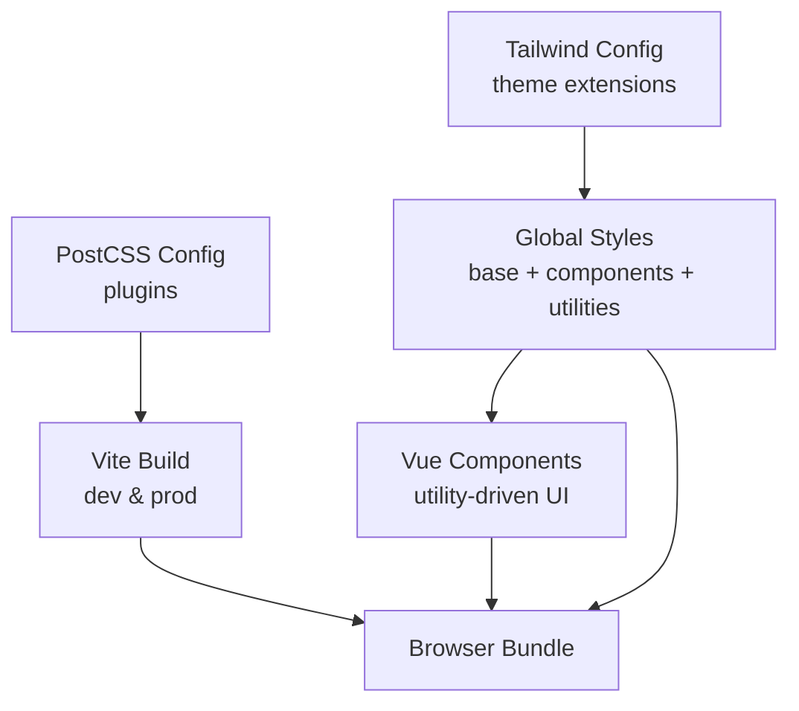
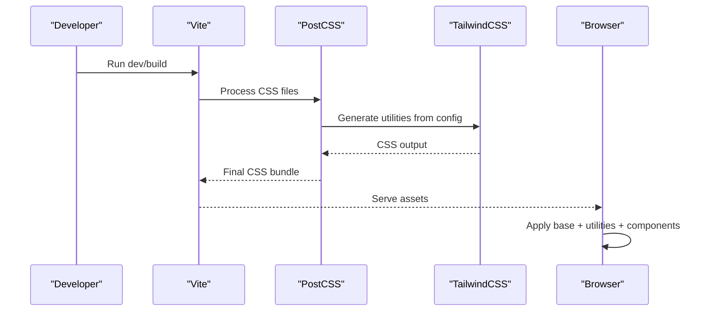

# Styling & Theming

<cite>
**Referenced Files in This Document**
- [tailwind.config.js](file://travel-recovery-os/frontend/tailwind.config.js)
- [postcss.config.js](file://travel-recovery-os/frontend/postcss.config.js)
- [main.css](file://travel-recovery-os/frontend/src/assets/main.css)
- [package.json](file://travel-recovery-os/frontend/package.json)
- [vite.config.js](file://travel-recovery-os/frontend/vite.config.js)
- [App.vue](file://travel-recovery-os/frontend/src/App.vue)
- [Navbar.vue](file://travel-recovery-os/frontend/src/components/Navbar.vue)
- [LiveTerminal.vue](file://travel-recovery-os/frontend/src/components/LiveTerminal.vue)
- [HistoryDashboard.vue](file://travel-recovery-os/frontend/src/components/HistoryDashboard.vue)
</cite>

## Table of Contents
1. [Introduction](#introduction)
2. [Project Structure](#project-structure)
3. [Core Components](#core-components)
4. [Architecture Overview](#architecture-overview)
5. [Detailed Component Analysis](#detailed-component-analysis)
6. [Dependency Analysis](#dependency-analysis)
7. [Performance Considerations](#performance-considerations)
8. [Troubleshooting Guide](#troubleshooting-guide)
9. [Conclusion](#conclusion)
10. [Appendices](#appendices)

## Introduction
This document explains the styling and theming system built with TailwindCSS for the frontend application. It covers the custom color palette (brand colors, warm neutrals, semantic colors), CSS custom properties and base styles, utility classes, component-specific patterns, responsive design approach, animation classes, accessibility considerations, guidelines for adding new styles and reusable components, and the PostCSS/Vite build process for production optimization.

## Project Structure
The styling system is centered around:
- Tailwind configuration defining theme extensions (colors, fonts, shadows, gradients, animations).
- A global stylesheet that sets base typography, background, and reusable component classes.
- Vue components composed primarily with Tailwind utilities and a few shared CSS classes.
- PostCSS pipeline integrating Tailwind and Autoprefixer via Vite.

**Diagram sources**
- [tailwind.config.js:1-130](file://travel-recovery-os/frontend/tailwind.config.js#L1-L130)
- [main.css:1-218](file://travel-recovery-os/frontend/src/assets/main.css#L1-L218)
- [postcss.config.js:1-7](file://travel-recovery-os/frontend/postcss.config.js#L1-L7)
- [vite.config.js:1-18](file://travel-recovery-os/frontend/vite.config.js#L1-L18)

**Section sources**
- [tailwind.config.js:1-130](file://travel-recovery-os/frontend/tailwind.config.js#L1-L130)
- [postcss.config.js:1-7](file://travel-recovery-os/frontend/postcss.config.js#L1-L7)
- [main.css:1-218](file://travel-recovery-os/frontend/src/assets/main.css#L1-L218)
- [vite.config.js:1-18](file://travel-recovery-os/frontend/vite.config.js#L1-L18)

## Core Components
- Custom color palette:
  - Brand colors: purple, purple-light, blue, cyan, lavender, lavender-light.
  - Warm neutrals: a full scale from 50 to 900 used for backgrounds, text, borders, and states.
  - Semantic colors: success, warning, danger, info each with light/DEFAULT/dark variants.
- Typography:
  - Display font stack using Outfit and Inter; sans stack using Inter; mono stack using Fira Code/JetBrains Mono.
- Shadows and gradients:
  - Soft shadows and glow effects for depth and emphasis.
  - Brand gradient and soft gradient backgrounds.
- Animations:
  - Ping-slow, pulse-soft, slide-up, slide-in-right, fade-in, shimmer, float, bounce-gentle, gradient-x.
- Global base styles:
  - Body background and text color, font smoothing, app root ambient gradient, heading fonts.
- Reusable component classes:
  - ops-card, ops-card-nested, text-gradient-brand, bg-brand-gradient, boarding-pass-edge, scanline-overlay, animate-shimmer, animate-slide-up, animate-fade-in, animate-float, animate-pulse-ring.

Usage examples across components demonstrate consistent application of these tokens and patterns.

**Section sources**
- [tailwind.config.js:7-126](file://travel-recovery-os/frontend/tailwind.config.js#L7-L126)
- [main.css:5-37](file://travel-recovery-os/frontend/src/assets/main.css#L5-L37)
- [main.css:39-117](file://travel-recovery-os/frontend/src/assets/main.css#L39-L117)
- [App.vue:1-219](file://travel-recovery-os/frontend/src/App.vue#L1-L219)
- [Navbar.vue:1-189](file://travel-recovery-os/frontend/src/components/Navbar.vue#L1-L189)
- [LiveTerminal.vue:1-147](file://travel-recovery-os/frontend/src/components/LiveTerminal.vue#L1-L147)
- [HistoryDashboard.vue:1-127](file://travel-recovery-os/frontend/src/components/HistoryDashboard.vue#L1-L127)

## Architecture Overview
The styling architecture follows a layered approach:
- Theme layer (Tailwind config): centralizes design tokens (colors, fonts, shadows, gradients, animations).
- Base layer (global CSS): establishes defaults for body, headings, and reusable component primitives.
- Utility layer (Tailwind utilities): composes layouts, spacing, typography, and stateful styles directly in components.
- Build layer (PostCSS + Vite): processes CSS, applies autoprefixing, and optimizes for production.

**Diagram sources**
- [postcss.config.js:1-7](file://travel-recovery-os/frontend/postcss.config.js#L1-L7)
- [tailwind.config.js:1-130](file://travel-recovery-os/frontend/tailwind.config.js#L1-L130)
- [vite.config.js:1-18](file://travel-recovery-os/frontend/vite.config.js#L1-L18)

## Detailed Component Analysis

### Color Palette and Tokens
- Brand colors provide primary accents and gradients used for CTAs, badges, and highlights.
- Warm neutrals replace cold slate tones for a friendly, cohesive look across surfaces and text.
- Semantic colors standardize status indicators (success, warning, danger, info) with light/DEFAULT/dark variants for backgrounds, text, and borders.

Practical usage patterns:
- Status badges and labels use semantic color pairs (e.g., light background with dark text).
- Primary actions leverage brand gradients and brand-purple for emphasis.
- Surfaces and cards rely on warm neutrals for subtle contrast and readability.

**Section sources**
- [tailwind.config.js:9-53](file://travel-recovery-os/frontend/tailwind.config.js#L9-L53)
- [Navbar.vue:10-25](file://travel-recovery-os/frontend/src/components/Navbar.vue#L10-L25)
- [HistoryDashboard.vue:25-43](file://travel-recovery-os/frontend/src/components/HistoryDashboard.vue#L25-L43)

### Typography and Fonts
- Display headings use the display font stack for visual hierarchy.
- Body text uses Inter for legibility across devices.
- Monospace fonts are used for terminal-like outputs and code snippets.

Implementation notes:
- Headings inherit display font family globally.
- Components apply font-display or font-mono where appropriate.

**Section sources**
- [tailwind.config.js:54-58](file://travel-recovery-os/frontend/tailwind.config.js#L54-L58)
- [main.css:34-36](file://travel-recovery-os/frontend/src/assets/main.css#L34-L36)
- [LiveTerminal.vue:55-68](file://travel-recovery-os/frontend/src/components/LiveTerminal.vue#L55-L68)

### Shadows, Gradients, and Visual Depth
- Soft shadows create elevation without harsh contrasts.
- Glow shadows highlight interactive elements like buttons.
- Brand gradients unify branding across headers, badges, and CTAs.

Patterns:
- Cards use soft shadow and border transitions on hover.
- Buttons and key CTAs use brand gradients and glow shadows.

**Section sources**
- [tailwind.config.js:64-76](file://travel-recovery-os/frontend/tailwind.config.js#L64-L76)
- [main.css:39-71](file://travel-recovery-os/frontend/src/assets/main.css#L39-L71)
- [Navbar.vue:38-43](file://travel-recovery-os/frontend/src/components/Navbar.vue#L38-L43)

### Animations and Motion
- Entrance animations (slide-up, fade-in) improve perceived performance and guide attention.
- Subtle motion (float, ping-slow, pulse-soft) indicates activity without distraction.
- Shimmer provides loading placeholders.

Guidelines:
- Use entrance animations sparingly for first render or modal appearances.
- Prefer gentle motions for ongoing states (e.g., live indicators).

**Section sources**
- [tailwind.config.js:77-125](file://travel-recovery-os/frontend/tailwind.config.js#L77-L125)
- [main.css:73-117](file://travel-recovery-os/frontend/src/assets/main.css#L73-L117)
- [Navbar.vue:15-21](file://travel-recovery-os/frontend/src/components/Navbar.vue#L15-L21)

### Responsive Design Approach
- Mobile-first layout with Tailwind breakpoints ensures adaptability across screen sizes.
- Conditional visibility (hidden/sm:inline, hidden/md:inline-flex) controls content density.
- Touch device optimizations disable hover effects not suitable for touch interfaces.

Key practices:
- Use responsive spacing and sizing utilities to maintain readability.
- Adjust card radii and perforated edge sizes for smaller screens.

**Section sources**
- [Navbar.vue:2-77](file://travel-recovery-os/frontend/src/components/Navbar.vue#L2-L77)
- [main.css:183-217](file://travel-recovery-os/frontend/src/assets/main.css#L183-L217)

### Accessibility Considerations
- Color contrast: semantic colors paired with light/dark variants ensure sufficient contrast for text and backgrounds.
- Focus management: interactive elements include focus outlines via Tailwind’s default focus rings.
- Motion preferences: consider respecting reduced motion preferences by providing non-animated alternatives when necessary.
- Keyboard navigation: all interactive elements are native buttons or links, ensuring keyboard operability.

Recommendations:
- Validate contrast ratios for new color combinations.
- Avoid relying solely on color to convey meaning; add icons or text labels.

[No sources needed since this section provides general guidance]

### Component-Specific Styling Patterns
- Navbar:
  - Sticky header with backdrop blur and soft shadow.
  - Status indicators use semantic colors and animated dots.
  - Brand gradient button for pitch guide with hover glow and scale transitions.
- LiveTerminal:
  - Two modes: friendly timeline and raw terminal view.
  - Uses scanline overlay for terminal aesthetic.
  - Filters and search inputs styled with warm neutral borders and focus rings.
- HistoryDashboard:
  - KPI cards with consistent padding, borders, and typography.
  - Tier and status badges map to semantic and brand tokens.

**Section sources**
- [Navbar.vue:1-189](file://travel-recovery-os/frontend/src/components/Navbar.vue#L1-L189)
- [LiveTerminal.vue:1-147](file://travel-recovery-os/frontend/src/components/LiveTerminal.vue#L1-L147)
- [HistoryDashboard.vue:1-127](file://travel-recovery-os/frontend/src/components/HistoryDashboard.vue#L1-L127)

### Adding New Styles and Reusable Components
Guidelines:
- Prefer Tailwind utilities for one-off styles within components.
- Extract repeated patterns into reusable classes in main.css under @layer components or as top-level classes.
- Extend the theme in tailwind.config.js for new colors, fonts, shadows, gradients, and animations to maintain consistency.
- Use semantic color tokens for status-related UI to ensure coherence.

Steps:
1. Define tokens in tailwind.config.js if they will be reused widely.
2. Add component-level CSS in main.css under clear sections.
3. Compose utilities in Vue templates for layout and state.
4. Test responsiveness and accessibility across devices.

**Section sources**
- [tailwind.config.js:7-126](file://travel-recovery-os/frontend/tailwind.config.js#L7-L126)
- [main.css:39-117](file://travel-recovery-os/frontend/src/assets/main.css#L39-L117)

### Build Process and PostCSS Configuration
- PostCSS plugins:
  - tailwindcss: generates utilities based on configured theme and content paths.
  - autoprefixer: adds vendor prefixes for cross-browser compatibility.
- Vite integration:
  - Development server runs on port 5173 with API proxy configuration.
  - Build script produces optimized assets for production.

Production optimization tips:
- Ensure content paths in tailwind.config.js cover all source files to purge unused styles.
- Leverage Vite’s minification and asset optimization during build.
- Monitor bundle size and remove unused CSS by verifying content globs.

**Section sources**
- [postcss.config.js:1-7](file://travel-recovery-os/frontend/postcss.config.js#L1-L7)
- [package.json:6-23](file://travel-recovery-os/frontend/package.json#L6-L23)
- [vite.config.js:1-18](file://travel-recovery-os/frontend/vite.config.js#L1-L18)

## Dependency Analysis
Styling dependencies flow through the build pipeline:
- Tailwind reads theme configuration and scans content paths to generate utilities.
- PostCSS processes CSS with Tailwind and Autoprefixer.
- Vite orchestrates development and builds, serving optimized assets.

**Diagram sources**
- [package.json:6-23](file://travel-recovery-os/frontend/package.json#L6-L23)
- [vite.config.js:1-18](file://travel-recovery-os/frontend/vite.config.js#L1-L18)
- [postcss.config.js:1-7](file://travel-recovery-os/frontend/postcss.config.js#L1-L7)
- [tailwind.config.js:1-130](file://travel-recovery-os/frontend/tailwind.config.js#L1-L130)
- [main.css:1-218](file://travel-recovery-os/frontend/src/assets/main.css#L1-L218)

**Section sources**
- [package.json:6-23](file://travel-recovery-os/frontend/package.json#L6-L23)
- [vite.config.js:1-18](file://travel-recovery-os/frontend/vite.config.js#L1-L18)
- [postcss.config.js:1-7](file://travel-recovery-os/frontend/postcss.config.js#L1-L7)
- [tailwind.config.js:1-130](file://travel-recovery-os/frontend/tailwind.config.js#L1-L130)

## Performance Considerations
- Purge unused CSS: Tailwind’s content scanning ensures only used utilities are included.
- Minimize custom CSS: prefer utilities to reduce maintenance overhead and file size.
- Optimize images and assets: use modern formats and compress where possible.
- Debounce heavy animations: avoid layout thrashing by using transform and opacity for animations.
- Respect user preferences: honor reduced motion settings for better accessibility and performance.

[No sources needed since this section provides general guidance]

## Troubleshooting Guide
Common issues and resolutions:
- Styles not applied:
  - Verify content paths in tailwind.config.js include all relevant files.
  - Ensure main.css imports Tailwind directives at the top.
- Missing vendor prefixes:
  - Confirm Autoprefixer is enabled in postcss.config.js.
- Unexpected hover behavior on touch devices:
  - Use media queries to disable hover effects on touch devices.
- Contrast problems:
  - Check semantic color pairings and adjust to meet accessibility standards.

Debugging steps:
- Inspect computed styles in browser developer tools.
- Temporarily add outline utilities to identify overlapping elements.
- Validate CSS syntax and layer order in main.css.

**Section sources**
- [tailwind.config.js:3-6](file://travel-recovery-os/frontend/tailwind.config.js#L3-L6)
- [main.css:1-3](file://travel-recovery-os/frontend/src/assets/main.css#L1-L3)
- [postcss.config.js:1-7](file://travel-recovery-os/frontend/postcss.config.js#L1-L7)

## Conclusion
The styling system leverages TailwindCSS with a well-defined theme extension for brand identity, warm neutrals, and semantic colors. Global base styles establish consistent typography and reusable components, while Vue components compose layouts using utilities and shared classes. The PostCSS and Vite pipeline ensures efficient development and optimized production builds. Following the provided guidelines will help maintain design consistency, accessibility, and performance across the application.

[No sources needed since this section summarizes without analyzing specific files]

## Appendices

### Quick Reference: Theme Tokens
- Colors: brand (purple, purple-light, blue, cyan, lavender, lavender-light), warm (50–900), success/warning/danger/info (light/DEFAULT/dark).
- Fonts: display (Outfit, Inter), sans (Inter), mono (Fira Code, JetBrains Mono).
- Shadows: soft, soft-md, soft-lg, glow-purple, glow-blue, inner-soft.
- Gradients: brand-gradient, brand-gradient-soft, warm-gradient.
- Animations: ping-slow, pulse-soft, slide-up, slide-in-right, fade-in, shimmer, float, bounce-gentle, gradient-x.

**Section sources**
- [tailwind.config.js:9-125](file://travel-recovery-os/frontend/tailwind.config.js#L9-L125)