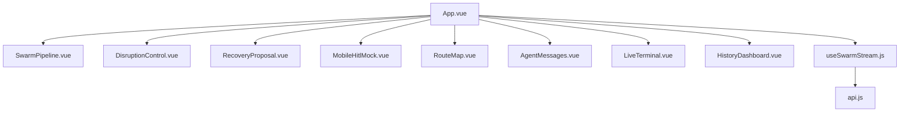
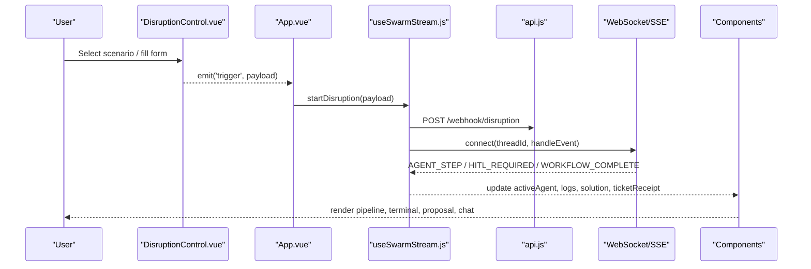
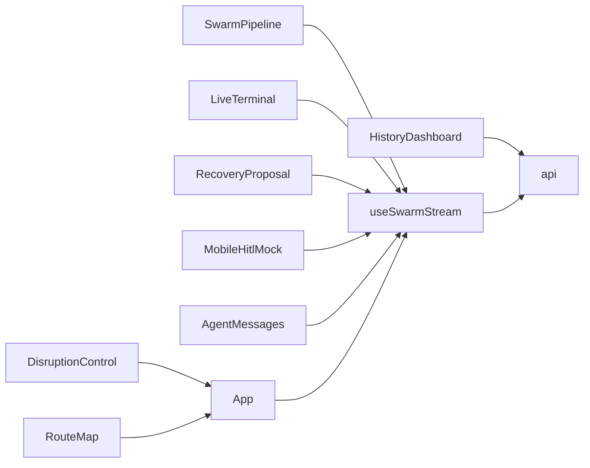

# UI Components

<cite>
**Referenced Files in This Document**
- [App.vue](file://travel-recovery-os/frontend/src/App.vue)
- [SwarmPipeline.vue](file://travel-recovery-os/frontend/src/components/SwarmPipeline.vue)
- [LiveTerminal.vue](file://travel-recovery-os/frontend/src/components/LiveTerminal.vue)
- [DisruptionControl.vue](file://travel-recovery-os/frontend/src/components/DisruptionControl.vue)
- [RecoveryProposal.vue](file://travel-recovery-os/frontend/src/components/RecoveryProposal.vue)
- [MobileHitlMock.vue](file://travel-recovery-os/frontend/src/components/MobileHitlMock.vue)
- [RouteMap.vue](file://travel-recovery-os/frontend/src/components/RouteMap.vue)
- [AgentMessages.vue](file://travel-recovery-os/frontend/src/components/AgentMessages.vue)
- [HistoryDashboard.vue](file://travel-recovery-os/frontend/src/components/HistoryDashboard.vue)
- [useSwarmStream.js](file://travel-recovery-os/frontend/src/composables/useSwarmStream.js)
- [api.js](file://travel-recovery-os/frontend/src/services/api.js)
</cite>

## Table of Contents
1. [Introduction](#introduction)
2. [Project Structure](#project-structure)
3. [Core Components](#core-components)
4. [Architecture Overview](#architecture-overview)
5. [Detailed Component Analysis](#detailed-component-analysis)
6. [Dependency Analysis](#dependency-analysis)
7. [Performance Considerations](#performance-considerations)
8. [Troubleshooting Guide](#troubleshooting-guide)
9. [Conclusion](#conclusion)
10. [Appendices](#appendices)

## Introduction
This document provides comprehensive documentation for all dashboard UI components that visualize and control the multi-agent travel recovery workflow. It covers component props, events, styling customization, usage examples, composition patterns, and best practices for extending functionality. The components are orchestrated by a shared composable that manages streaming state, event handling, and API interactions.

## Project Structure
The frontend is organized around reusable Vue components under src/components, with shared logic in composables and data access in services. The root App orchestrates the layout and binds component state to the shared stream composable.

**Diagram sources**
- [App.vue:178-219](file://travel-recovery-os/frontend/src/App.vue#L178-L219)
- [useSwarmStream.js:1-282](file://travel-recovery-os/frontend/src/composables/useSwarmStream.js#L1-L282)
- [api.js:1-100](file://travel-recovery-os/frontend/src/services/api.js#L1-L100)

**Section sources**
- [App.vue:1-219](file://travel-recovery-os/frontend/src/App.vue#L1-L219)

## Core Components
This section summarizes each component’s purpose, props, events, slots (if any), styling approach, and usage patterns within the dashboard.

- SwarmPipeline: Visualizes multi-agent workflow progress across sentinel, profile, scout, arbiter, executor stages with live phase indicators and agent reasoning banner.
- LiveTerminal: Real-time log viewer with friendly/raw modes, filtering, search, export, and auto-scroll behavior.
- DisruptionControl: Trigger panel for simulating disruptions via presets, custom form, or AI-parsed raw text; emits trigger events to start the swarm.
- RecoveryProposal: Presents the selected recovery solution, score ring, savings, rationale, and ticket receipt status.
- MobileHitlMock: Passenger-facing chat interface for HITL approval workflows, including countdown timer, flight carousel, baggage and compensation info, and decision actions.
- RouteMap: SVG-based visualization of original and recovery routes between origin and destination airports.
- AgentMessages: Displays inter-agent messages with typed badges, avatars, and payload previews.
- HistoryDashboard: Analytics view showing disruption history table and KPI cards fetched from backend APIs.

**Section sources**
- [SwarmPipeline.vue:1-166](file://travel-recovery-os/frontend/src/components/SwarmPipeline.vue#L1-L166)
- [LiveTerminal.vue:1-147](file://travel-recovery-os/frontend/src/components/LiveTerminal.vue#L1-L147)
- [DisruptionControl.vue:1-231](file://travel-recovery-os/frontend/src/components/DisruptionControl.vue#L1-L231)
- [RecoveryProposal.vue:1-171](file://travel-recovery-os/frontend/src/components/RecoveryProposal.vue#L1-L171)
- [MobileHitlMock.vue:1-480](file://travel-recovery-os/frontend/src/components/MobileHitlMock.vue#L1-L480)
- [RouteMap.vue:1-104](file://travel-recovery-os/frontend/src/components/RouteMap.vue#L1-L104)
- [AgentMessages.vue:1-94](file://travel-recovery-os/frontend/src/components/AgentMessages.vue#L1-L94)
- [HistoryDashboard.vue:1-127](file://travel-recovery-os/frontend/src/components/HistoryDashboard.vue#L1-L127)

## Architecture Overview
The dashboard uses a central composable to manage real-time streaming state and coordinates component updates. Events flow from user actions through the composable to backend APIs and WebSocket streams, then back into reactive state consumed by components.

**Diagram sources**
- [DisruptionControl.vue:177-231](file://travel-recovery-os/frontend/src/components/DisruptionControl.vue#L177-L231)
- [App.vue:178-219](file://travel-recovery-os/frontend/src/App.vue#L178-L219)
- [useSwarmStream.js:96-240](file://travel-recovery-os/frontend/src/composables/useSwarmStream.js#L96-L240)
- [api.js:30-55](file://travel-recovery-os/frontend/src/services/api.js#L30-L55)

## Detailed Component Analysis

### SwarmPipeline
Purpose: Visualize the current stage of the multi-agent recovery pipeline and provide readable phase labels and timing.

Props:
- activeAgent: string — current agent or phase identifier (e.g., sentinel, profile, scout, arbiter, hitl, executor, completed).
- stepTimes: object — map of step keys to execution durations in milliseconds.

Events: None.

Slots: None.

Styling:
- Uses Tailwind utility classes for responsive grid, badges, and color-coded states.
- Dynamic class binding based on activeAgent and computed indices to highlight running/done nodes.

Usage example:
- Bound in App.vue with activeAgent and stepExecutionTimes from useSwarmStream.

Best practices:
- Keep activeAgent values aligned with backend node names to ensure correct rendering.
- Extend steps array to add new agents; ensure getNodeStatusText and getCardClass handle new keys.

**Section sources**
- [SwarmPipeline.vue:81-166](file://travel-recovery-os/frontend/src/components/SwarmPipeline.vue#L81-L166)
- [App.vue:58-63](file://travel-recovery-os/frontend/src/App.vue#L58-L63)

### LiveTerminal
Purpose: Display live telemetry logs with friendly timeline and raw terminal views, plus filtering, search, export, and clear controls.

Props:
- logs: array — list of log entries with fields like id, timestamp, node, level, message, data.

Events:
- clear: emitted when user clicks Clear to reset logs.

Slots: None.

Styling:
- Two modes: friendly (card-like timeline) and raw (dark terminal style).
- Color-coded tags per node and level; auto-scrolling on new logs.

Usage example:
- Bound in App.vue with logs and clear handler from useSwarmStream.

Best practices:
- Use filteredLogs computed property for efficient client-side filtering.
- Export JSON for debugging; consider pagination if logs grow large.

**Section sources**
- [LiveTerminal.vue:72-147](file://travel-recovery-os/frontend/src/components/LiveTerminal.vue#L72-L147)
- [App.vue:129-137](file://travel-recovery-os/frontend/src/App.vue#L129-L137)

### DisruptionControl
Purpose: Provide multiple input modes to simulate disruptions and launch the autonomous recovery swarm.

Props:
- isStreaming: boolean — disables trigger button while streaming.

Events:
- trigger: emits an object containing disruption payload (PNR, flight number, origin, destination, passenger name, loyalty tier, reason, delay minutes, optional raw_text).

Slots: None.

Styling:
- Three modes: Scenarios (presets), Custom (form), AI Parse (raw text with sample pills).
- Gradient CTA button with shimmer animation; disabled state during streaming.

Usage example:
- In App.vue, listen to @trigger and call startDisruption with the payload.

Best practices:
- Validate inputs before emitting trigger.
- For AI Parse mode, ensure raw_text is included only when needed.

**Section sources**
- [DisruptionControl.vue:177-231](file://travel-recovery-os/frontend/src/components/DisruptionControl.vue#L177-L231)
- [App.vue:68-76](file://travel-recovery-os/frontend/src/App.vue#L68-L76)

### RecoveryProposal
Purpose: Present the selected recovery plan, scoring, financial savings, rationale, and ticket confirmation.

Props:
- solution: object — selected route details (flight_number, airline, origin, destination, departure_time, cabin_class, score_percentage, financial_savings, rationale).
- hitlStatus: string — HITL state (IDLE, WAITING_FOR_PASSENGER, BYPASSED, APPROVED, REJECTED).
- ticketReceipt: object — e-ticket details (e_ticket_number, assigned_seat).

Events: None.

Slots: None.

Styling:
- Boarding-pass card with gradient top border and animated plane icon.
- Score ring using SVG stroke-dasharray; progress bar reflects score percentage.
- Savings arbitrage card and AI rationale block.

Usage example:
- Bound in App.vue with proposedSolution, hitlStatus, and ticketReceipt from useSwarmStream.

Best practices:
- Ensure solution.score_percentage is numeric for ring and progress bar.
- Handle empty state gracefully when no solution is available.

**Section sources**
- [RecoveryProposal.vue:164-171](file://travel-recovery-os/frontend/src/components/RecoveryProposal.vue#L164-L171)
- [App.vue:78-87](file://travel-recovery-os/frontend/src/App.vue#L78-L87)

### MobileHitlMock
Purpose: Simulate passenger WhatsApp-style chat for human-in-the-loop approvals, including countdown timer, flight carousel, baggage and compensation info, and decision actions.

Props:
- hitlStatus: string — controls chat flow and notifications.
- isStreaming: boolean — triggers initial disruption alert.
- solution: object — proposed flight details.
- ticketReceipt: object — issued ticket info.
- disruptionData: object — PNR, flight_number, origin, destination, reason, loyalty_tier, passenger_name.
- passengerName: string — displayed in chat messages.
- pnr: string — used for display and context.
- candidateRoutes: array — alternative flights for carousel.
- baggageContext: object — checked bags, special items, interline eligibility.
- compensationResult: object — regulation, eligibility, amount, currency.

Events:
- resolve: emits decision ('APPROVE' or 'REJECT') to be handled by parent.

Slots: None.

Styling:
- Phone frame with status bar, chat bubbles, typing indicator, and action buttons.
- Carousel navigation for multiple candidates; conditional sections for baggage and compensation.

Usage example:
- Bound in App.vue with state from useSwarmStream; @resolve calls resolveHitl.

Best practices:
- Watch prop changes to push contextual messages (baggage, compensation, ticket).
- Manage countdown lifecycle; stop on decisions or completion.

**Section sources**
- [MobileHitlMock.vue:219-480](file://travel-recovery-os/frontend/src/components/MobileHitlMock.vue#L219-L480)
- [App.vue:89-106](file://travel-recovery-os/frontend/src/App.vue#L89-L106)

### RouteMap
Purpose: Visualize original and recovery flight routes between origin and destination using SVG arcs and markers.

Props:
- origin: string — IATA code for origin airport.
- destination: string — IATA code for destination airport.

Note: While the component defines origin and destination props, it also internally computes routes based on these values. If you need to pass additional routes or selected route, extend props accordingly.

Events: None.

Slots: None.

Styling:
- SVG grid background, animated dashed paths, glowing hub markers, legend with clickable route selection.

Usage example:
- Bound in App.vue with disruptionData.origin and destination; can be extended to show candidateRoutes.

Best practices:
- Add more airport coordinates for richer maps.
- Consider adding tooltips or hover states for route details.

**Section sources**
- [RouteMap.vue:64-104](file://travel-recovery-os/frontend/src/components/RouteMap.vue#L64-L104)
- [App.vue:110-120](file://travel-recovery-os/frontend/src/App.vue#L110-L120)

### AgentMessages
Purpose: Display inter-agent messages with typed badges, avatars, and payload previews.

Props:
- messages: array — list of message objects with fields like from_agent, to_agent, message_type, payload, timestamp.

Events: None.

Slots: None.

Styling:
- Color-coded agent badges and type badges; warning messages highlighted.
- Auto-scrolls to bottom on new messages.

Usage example:
- Bound in App.vue with agentMessages from useSwarmStream.

Best practices:
- Sanitize or format payloads for readability.
- Consider virtualization if message volume grows significantly.

**Section sources**
- [AgentMessages.vue:44-94](file://travel-recovery-os/frontend/src/components/AgentMessages.vue#L44-L94)
- [App.vue:122-127](file://travel-recovery-os/frontend/src/App.vue#L122-L127)

### HistoryDashboard
Purpose: Show disruption history and analytics with KPI cards and a filterable table.

Props: None.

Events: None.

Slots: None.

Styling:
- KPI cards with prominent numbers; table rows with tier and status badges.
- Filter dropdown for loyalty tier; refresh button.

Usage example:
- Mounted independently; fetches data from apiClient.getHistory and apiClient.getStats.

Best practices:
- Debounce refresh if polling frequently.
- Add sorting and pagination for large datasets.

**Section sources**
- [HistoryDashboard.vue:82-127](file://travel-recovery-os/frontend/src/components/HistoryDashboard.vue#L82-L127)

## Dependency Analysis
Components depend on the shared composable for state and actions, and on the API service for HTTP requests. The composable handles WebSocket/SSE transport and event routing.

**Diagram sources**
- [App.vue:178-219](file://travel-recovery-os/frontend/src/App.vue#L178-L219)
- [useSwarmStream.js:1-282](file://travel-recovery-os/frontend/src/composables/useSwarmStream.js#L1-L282)
- [api.js:1-100](file://travel-recovery-os/frontend/src/services/api.js#L1-L100)

**Section sources**
- [App.vue:178-219](file://travel-recovery-os/frontend/src/App.vue#L178-L219)
- [useSwarmStream.js:1-282](file://travel-recovery-os/frontend/src/composables/useSwarmStream.js#L1-L282)
- [api.js:1-100](file://travel-recovery-os/frontend/src/services/api.js#L1-L100)

## Performance Considerations
- LiveTerminal auto-scrolls on log growth; consider limiting retained logs or implementing virtual scrolling for very high throughput.
- RouteMap uses SVG animations; keep route count reasonable to avoid performance issues on low-end devices.
- HistoryDashboard fetches data on mount and filter change; debounce rapid filter changes to reduce network load.
- MobileHitlMock uses watchers for prop changes; ensure watchers are efficient and avoid unnecessary re-renders.

[No sources needed since this section provides general guidance]

## Troubleshooting Guide
Common issues and resolutions:
- No logs appearing: Ensure WebSocket/SSE connection is established and events are routed via handleEvent in useSwarmStream. Check browser console for errors.
- Pipeline not updating: Verify activeAgent values match backend node names; confirm stepExecutionTimes are being set.
- HITL flow stuck: Confirm resolveHitl is called with valid decisions; check consensus endpoint responses.
- Chat not responding: Validate sendChatMessage payload and network connectivity; fallback messages are shown on error.

**Section sources**
- [useSwarmStream.js:96-240](file://travel-recovery-os/frontend/src/composables/useSwarmStream.js#L96-L240)
- [api.js:30-99](file://travel-recovery-os/frontend/src/services/api.js#L30-L99)

## Conclusion
The dashboard provides a cohesive, real-time interface for monitoring and controlling a multi-agent travel recovery system. Each component is designed for clarity, responsiveness, and extensibility. By following the documented props, events, and styling conventions, developers can integrate new agents, enhance visualizations, and improve user workflows while maintaining consistency with the shared state management layer.

[No sources needed since this section summarizes without analyzing specific files]

## Appendices

### Component Composition Patterns
- Centralized state: useSwarmStream acts as a single source of truth for streaming state, reducing prop drilling and keeping components focused on presentation.
- Event-driven updates: Components emit minimal events (e.g., trigger, resolve) to maintain loose coupling and simplify testing.
- Error boundaries: Wrap critical components with ErrorBoundary to isolate failures and present fallback UI.

**Section sources**
- [App.vue:58-152](file://travel-recovery-os/frontend/src/App.vue#L58-L152)

### Extending Functionality
- Adding a new agent:
  - Update SwarmPipeline steps array and status logic.
  - Extend useSwarmStream _handleAgentStep to process new node events.
  - Optionally add agent-specific visuals in AgentMessages and LiveTerminal tag styles.
- Enhancing RouteMap:
  - Add airport coordinates and compute dynamic arcs.
  - Integrate candidateRoutes from useSwarmStream to show multiple options.
- Improving HistoryDashboard:
  - Add sorting, pagination, and drill-down detail views.
  - Introduce charts for trends and distributions.

**Section sources**
- [SwarmPipeline.vue:86-166](file://travel-recovery-os/frontend/src/components/SwarmPipeline.vue#L86-L166)
- [useSwarmStream.js:127-189](file://travel-recovery-os/frontend/src/composables/useSwarmStream.js#L127-L189)
- [RouteMap.vue:80-104](file://travel-recovery-os/frontend/src/components/RouteMap.vue#L80-L104)
- [HistoryDashboard.vue:82-127](file://travel-recovery-os/frontend/src/components/HistoryDashboard.vue#L82-L127)