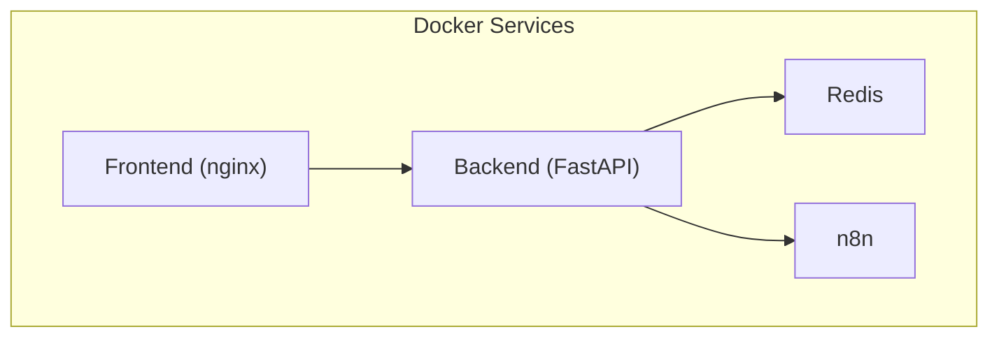
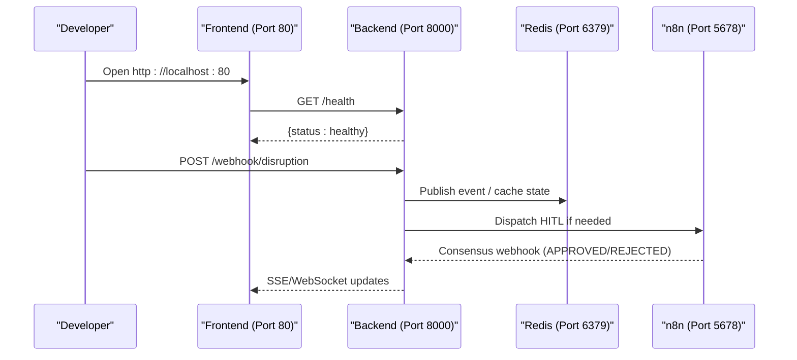
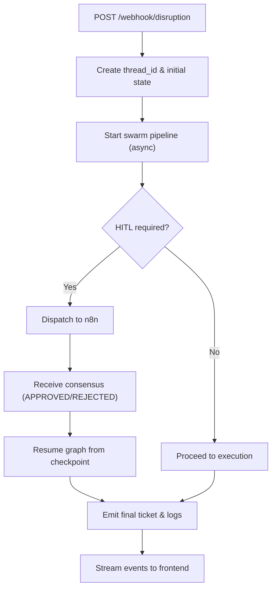
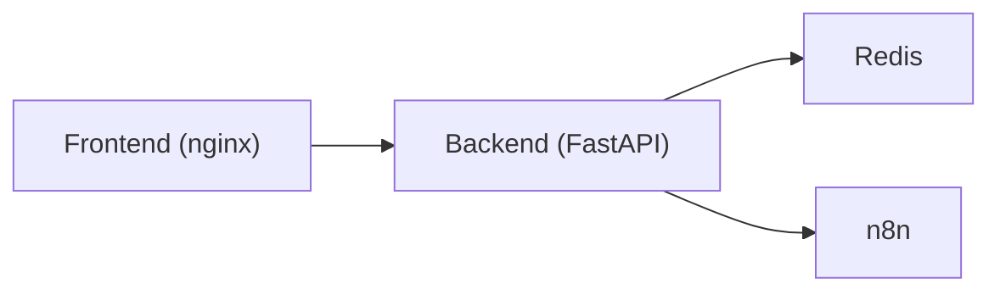

# Getting Started

<cite>
**Referenced Files in This Document**
- [docker-compose.yml](file://travel-recovery-os/docker-compose.yml)
- [backend/Dockerfile](file://travel-recovery-os/backend/Dockerfile)
- [frontend/Dockerfile](file://travel-recovery-os/frontend/Dockerfile)
- [backend/config.py](file://travel-recovery-os/backend/config.py)
- [backend/main.py](file://travel-recovery-os/backend/main.py)
- [backend/api/routers/webhooks.py](file://travel-recovery-os/backend/api/routers/webhooks.py)
- [backend/api/routers/system.py](file://travel-recovery-os/backend/api/routers/system.py)
- [backend/requirements.txt](file://travel-recovery-os/backend/requirements.txt)
- [start.bat](file://travel-recovery-os/start.bat)
- [README.md](file://travel-recovery-os/README.md)
</cite>

## Table of Contents
1. Introduction
2. Project Structure
3. Core Components
4. Architecture Overview
5. Detailed Component Analysis
6. Dependency Analysis
7. Performance Considerations
8. Troubleshooting Guide
9. Conclusion
10. Appendices

## Introduction
This guide helps you set up and run the Atlas ALibaba SynapseAir development environment end-to-end using Docker Compose. You will start Redis, the FastAPI backend, the Vue 3 frontend dashboard, and n8n for workflow automation. It includes prerequisites, step-by-step installation, environment configuration, first-run verification, and basic usage to trigger a disruption recovery workflow.

## Project Structure
The project is organized into:
- Backend (FastAPI): Python service that orchestrates agents, integrates with LLMs, GDS, and messaging via webhooks.
- Frontend (Vue 3 + Vite): Command center dashboard served by nginx in production builds.
- Infrastructure: Redis for caching/broker, n8n for webhook workflows, SQLite checkpointer for durable state.
- Orchestration: docker-compose.yml defines services, ports, health checks, and dependencies.

**Diagram sources**
- [docker-compose.yml:4-66](file://travel-recovery-os/docker-compose.yml#L4-L66)

**Section sources**
- [docker-compose.yml:1-71](file://travel-recovery-os/docker-compose.yml#L1-L71)

## Core Components
- Redis: In-memory store used as broker/cache; exposed on port 6379.
- Backend: FastAPI app exposing REST APIs, SSE/WebSocket telemetry, and webhooks; depends on Redis and optional external integrations.
- Frontend: Vue 3 SPA built and served by nginx; proxies API calls to the backend.
- n8n: Workflow automation server for WhatsApp/webhook flows; exposed on port 5678.

Key runtime details:
- Backend exposes /health for readiness and system status endpoints.
- Frontend serves at port 80 when running under Docker.
- Health checks ensure correct startup order in compose.

**Section sources**
- [docker-compose.yml:4-66](file://travel-recovery-os/docker-compose.yml#L4-L66)
- [backend/main.py:119-122](file://travel-recovery-os/backend/main.py#L119-L122)
- [backend/api/routers/system.py:9-22](file://travel-recovery-os/backend/api/routers/system.py#L9-L22)

## Architecture Overview
SynapseAir runs as a containerized stack:
- The frontend UI communicates with the backend over HTTP.
- The backend uses Redis for message brokering and state coordination.
- Webhooks integrate with n8n for HITL (human-in-the-loop) flows.
- SQLite checkpointing persists agent state for resuming workflows.

**Diagram sources**
- [docker-compose.yml:18-66](file://travel-recovery-os/docker-compose.yml#L18-L66)
- [backend/api/routers/webhooks.py:14-72](file://travel-recovery-os/backend/api/routers/webhooks.py#L14-L72)
- [backend/api/routers/webhooks.py:74-185](file://travel-recovery-os/backend/api/routers/webhooks.py#L74-L185)

## Detailed Component Analysis

### Prerequisites
- Docker and Docker Compose installed and running.
- Node.js and npm are not required when using Docker Compose for the full stack; they are only needed for local dev outside containers.
- Python is not required when using Docker Compose; it is bundled in the backend image.

Notes:
- The backend image uses Python 3.12-slim.
- The frontend image uses Node 20 for building and nginx for serving.

**Section sources**
- [backend/Dockerfile:1-33](file://travel-recovery-os/backend/Dockerfile#L1-L33)
- [frontend/Dockerfile:1-15](file://travel-recovery-os/frontend/Dockerfile#L1-L15)

### Installation Steps (Docker Compose)
1. Navigate to the project root:
   - travel-recovery-os
2. Create an environment file for the backend:
   - Copy or create a .env file inside travel-recovery-os/backend/.env
   - Ensure at minimum: ENVIRONMENT=development and REDIS_URL=redis://redis:6379/0
   - Optional keys (for advanced features): DEEPSEEK_API_KEY, HERMES_* settings, N8N_* settings, ATLAS_* settings, JWT_* settings
3. Start the stack:
   - docker compose up --build
4. Wait for services to become healthy:
   - Redis, Backend, Frontend, and n8n will be started in dependency order.

Ports:
- Frontend: http://localhost:80
- Backend: http://localhost:8000
- n8n: http://localhost:5678
- Redis: localhost:6379 (not exposed to host unless configured)

Stop the stack:
- docker compose down

**Section sources**
- [docker-compose.yml:4-66](file://travel-recovery-os/docker-compose.yml#L4-L66)
- [backend/config.py:20-37](file://travel-recovery-os/backend/config.py#L20-L37)

### Environment Configuration
The backend loads settings from environment files based on the ENVIRONMENT variable:
- development -> .env
- staging -> .env.staging
- production -> .env.production

Minimum recommended variables for development:
- ENVIRONMENT=development
- REDIS_URL=redis://redis:6379/0
- FRONTEND_URL=http://localhost:80 (optional, for CORS)

Optional integrations:
- DeepSeek LLM: DEEPSEEK_API_KEY, DEEPSEEK_BASE_URL, DEEPSEEK_MODEL
- Hermes/Local LLM: HERMES_API_BASE, HERMES_API_KEY, HERMES_MODEL
- n8n: N8N_API_URL, N8N_API_KEY, N8N_WEBHOOK_URL, N8N_CONSENSUS_CALLBACK_URL
- Atlas GDS Sandbox: ATLAS_CLIENT_ID, ATLAS_CLIENT_SECRET, ATLAS_BASE_URL, ATLAS_API_KEY
- Auth: JWT_SECRET_KEY, JWT_ALGORITHM, JWT_EXPIRE_MINUTES

Production mode validates critical keys and warns if missing.

**Section sources**
- [backend/config.py:20-37](file://travel-recovery-os/backend/config.py#L20-L37)
- [backend/config.py:92-112](file://travel-recovery-os/backend/config.py#L92-L112)

### Initial Service Startup Procedures
Using Docker Compose:
- docker compose up --build
- Verify health:
  - Backend: curl http://localhost:8000/health
  - System status: curl http://localhost:8000/api/system/status
  - Frontend: open http://localhost:80
  - n8n: open http://localhost:5678

Local development without Docker:
- Backend: uvicorn main:app --host 127.0.0.1 --port 8001 --reload
- Frontend: npm install && npm run dev (served at http://localhost:5173)
- Use start.bat on Windows to launch both locally.

**Section sources**
- [docker-compose.yml:18-66](file://travel-recovery-os/docker-compose.yml#L18-L66)
- [backend/main.py:119-122](file://travel-recovery-os/backend/main.py#L119-L122)
- [backend/api/routers/system.py:24-52](file://travel-recovery-os/backend/api/routers/system.py#L24-L52)
- [start.bat:9-22](file://travel-recovery-os/start.bat#L9-L22)

### First-Run Verification
After starting the stack:
1. Confirm backend health:
   - GET http://localhost:8000/health
   - Expected: {"status": "healthy", "version": "..."}
2. Check system status:
   - GET http://localhost:8000/api/system/status
   - Review provider statuses (DeepSeek, Hermes, Atlas GDS, n8n).
3. Open the frontend dashboard:
   - http://localhost:80
4. Trigger a sample disruption:
   - POST http://localhost:8000/webhook/disruption with a minimal payload including PNR, flight number, origin, destination, delay_minutes, reason.
   - Observe thread_id and stream_url in response.
5. Watch real-time events:
   - Subscribe to SSE or WebSocket streams for the returned thread_id.
6. If HITL is triggered:
   - n8n sends a message; approve or reject via consensus endpoint.
   - POST http://localhost:8000/webhook/consensus with thread_id and action (APPROVED/REJECTED).

**Section sources**
- [backend/main.py:119-122](file://travel-recovery-os/backend/main.py#L119-L122)
- [backend/api/routers/system.py:9-22](file://travel-recovery-os/backend/api/routers/system.py#L9-L22)
- [backend/api/routers/webhooks.py:14-72](file://travel-recovery-os/backend/api/routers/webhooks.py#L14-L72)
- [backend/api/routers/webhooks.py:74-185](file://travel-recovery-os/backend/api/routers/webhooks.py#L74-L185)

### Basic Usage: First Disruption Recovery Workflow
End-to-end flow:
1. Send a disruption event to the backend.
2. Backend starts the LangGraph swarm pipeline asynchronously.
3. Agents evaluate options and may pause for human approval.
4. If HITL is needed, n8n coordinates messaging; your decision resumes the graph.
5. Final ticket confirmation is emitted and streamed to the frontend.

**Diagram sources**
- [backend/api/routers/webhooks.py:14-72](file://travel-recovery-os/backend/api/routers/webhooks.py#L14-L72)
- [backend/api/routers/webhooks.py:74-185](file://travel-recovery-os/backend/api/routers/webhooks.py#L74-L185)

**Section sources**
- [backend/api/routers/webhooks.py:14-72](file://travel-recovery-os/backend/api/routers/webhooks.py#L14-L72)
- [backend/api/routers/webhooks.py:74-185](file://travel-recovery-os/backend/api/routers/webhooks.py#L74-L185)

## Dependency Analysis
Service dependencies defined in docker-compose:
- Backend depends on Redis being healthy before starting.
- Frontend depends on Backend being healthy.
- n8n runs independently but is integrated via webhooks.

Runtime dependencies:
- Backend requires Python packages listed in requirements.txt.
- Frontend build requires Node 20 and npm.

**Diagram sources**
- [docker-compose.yml:18-66](file://travel-recovery-os/docker-compose.yml#L18-L66)

**Section sources**
- [docker-compose.yml:18-66](file://travel-recovery-os/docker-compose.yml#L18-L66)
- [backend/requirements.txt:1-23](file://travel-recovery-os/backend/requirements.txt#L1-L23)

## Performance Considerations
- Health checks prevent premature requests to unhealthy services.
- Asynchronous swarm execution avoids blocking webhook responses.
- Redis provides fast in-memory operations for broker/cache workloads.
- SQLite checkpointing ensures durable state for long-running workflows.

[No sources needed since this section provides general guidance]

## Troubleshooting Guide
Common issues and resolutions:
- Backend not reachable:
  - Verify port 8000 is bound and /health responds.
  - Check logs for missing environment variables or failed dependencies.
- Frontend cannot connect to backend:
  - Ensure CORS allows your frontend URL; set FRONTEND_URL if needed.
  - Confirm network routing between containers.
- Redis connection errors:
  - Confirm Redis service is healthy and REDIS_URL points to redis:6379 within the compose network.
- n8n integration not working:
  - Validate N8N_API_URL, N8N_API_KEY, and N8N_WEBHOOK_URL.
  - Ensure n8n is accessible at http://localhost:5678.
- Production warnings:
  - Missing secrets (SYNAPSE_API_SECRET, DEEPSEEK_API_KEY, JWT_SECRET_KEY, REDIS_URL) will warn at startup in production mode.

Verification commands:
- Backend health: curl http://localhost:8000/health
- System status: curl http://localhost:8000/api/system/status
- n8n console: http://localhost:5678

**Section sources**
- [docker-compose.yml:12-40](file://travel-recovery-os/docker-compose.yml#L12-L40)
- [backend/config.py:92-112](file://travel-recovery-os/backend/config.py#L92-L112)
- [backend/api/routers/system.py:24-52](file://travel-recovery-os/backend/api/routers/system.py#L24-L52)

## Conclusion
You now have a fully containerized SynapseAir development environment with Redis, FastAPI backend, Vue 3 frontend, and n8n. Use the provided endpoints to verify health, trigger disruptions, and observe real-time recovery workflows. For production, configure all required secrets and integrations per the environment configuration guidelines.

[No sources needed since this section summarizes without analyzing specific files]

## Appendices

### Quick Commands
- Start stack: docker compose up --build
- Stop stack: docker compose down
- View logs: docker compose logs -f
- Run backend locally: uvicorn main:app --host 127.0.0.1 --port 8001 --reload
- Run frontend locally: npm install && npm run dev

**Section sources**
- [docker-compose.yml:18-66](file://travel-recovery-os/docker-compose.yml#L18-L66)
- [start.bat:9-22](file://travel-recovery-os/start.bat#L9-L22)

### Example .env Template
Create travel-recovery-os/backend/.env with at least:
- ENVIRONMENT=development
- REDIS_URL=redis://redis:6379/0
- FRONTEND_URL=http://localhost:80

For advanced integrations, add keys for DeepSeek, Hermes, n8n, Atlas GDS, and JWT as appropriate.

**Section sources**
- [backend/config.py:20-37](file://travel-recovery-os/backend/config.py#L20-L37)
- [backend/config.py:92-112](file://travel-recovery-os/backend/config.py#L92-L112)