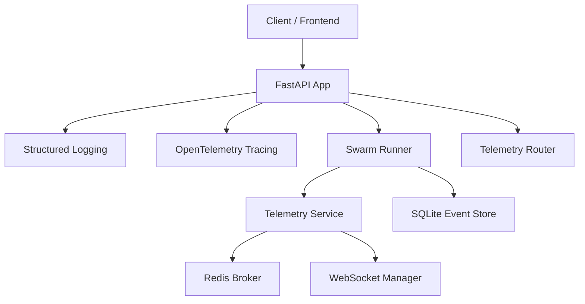
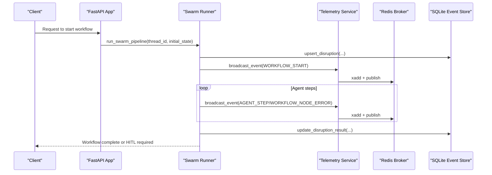
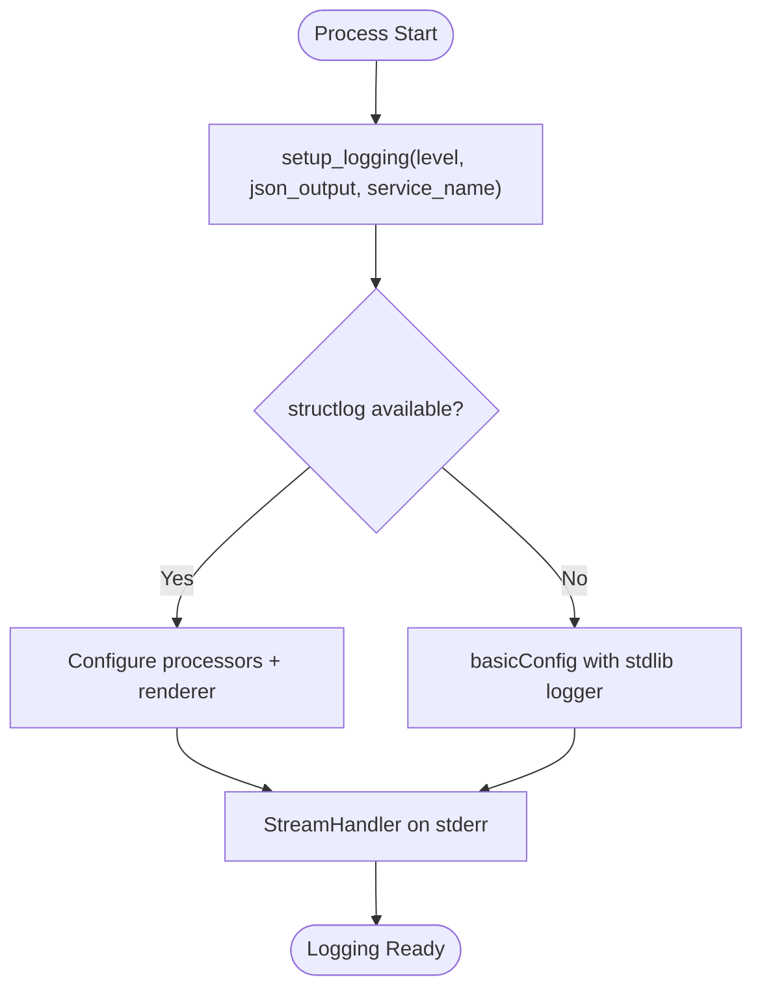
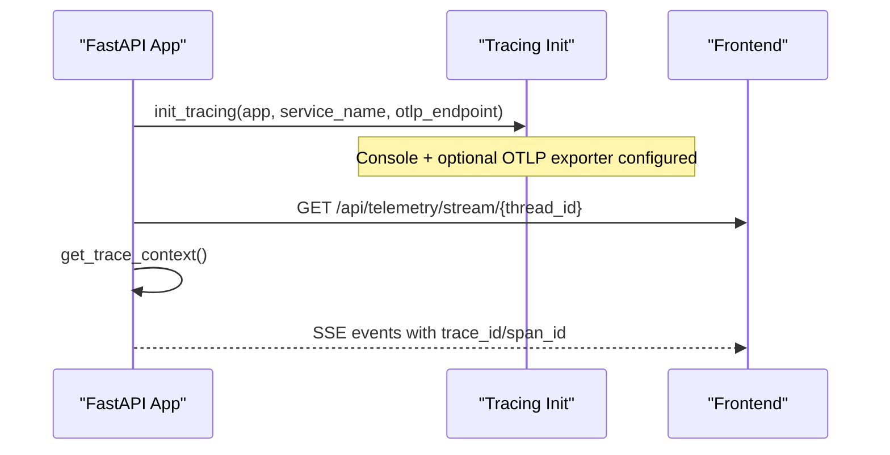
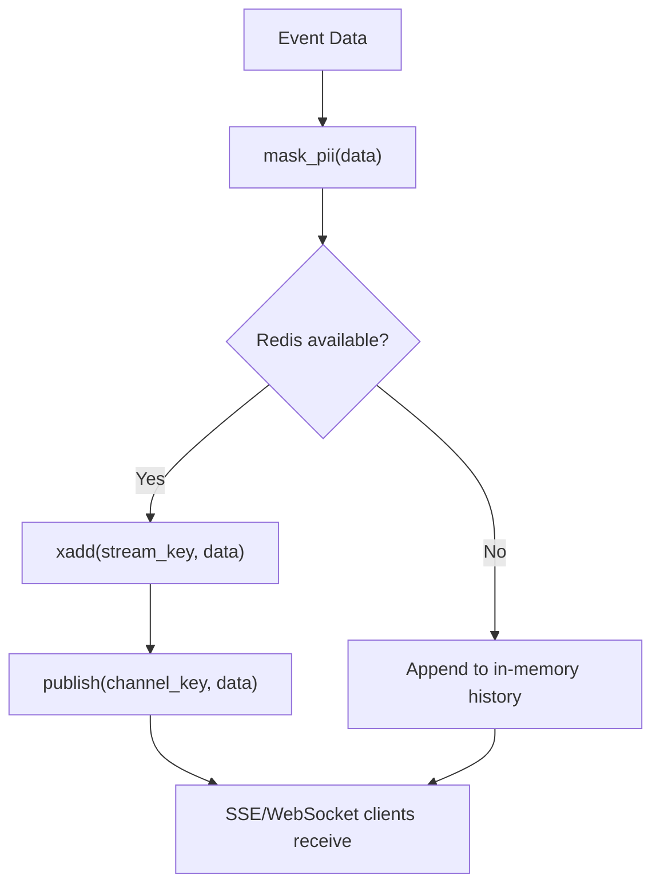
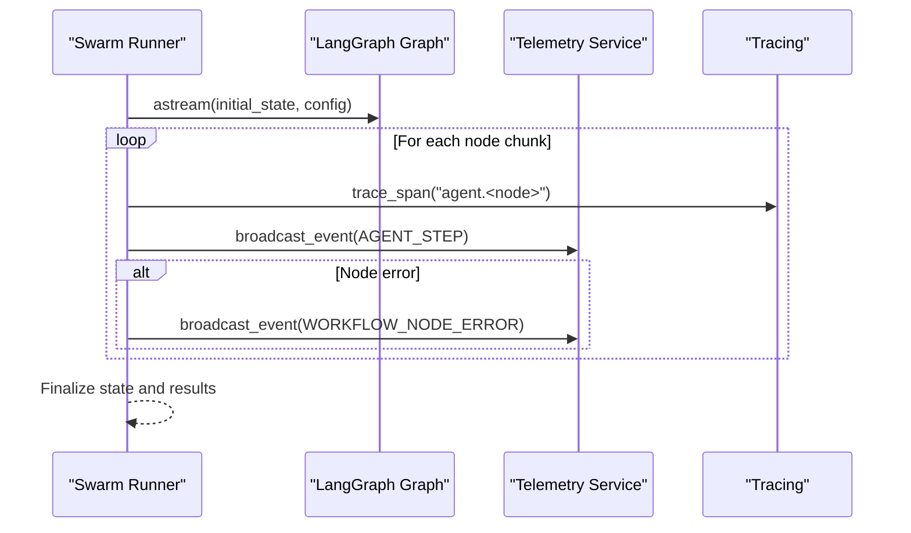
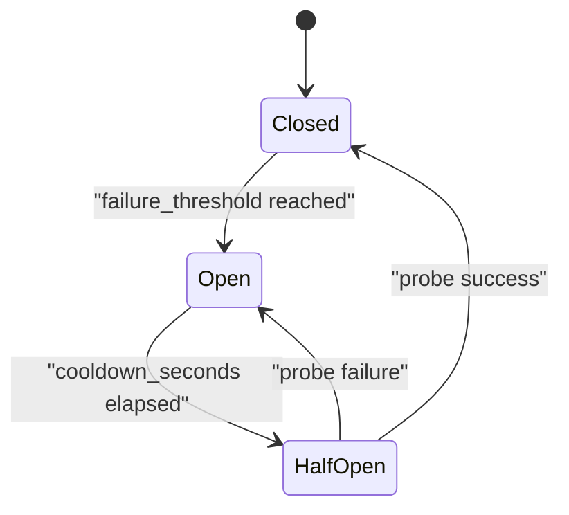
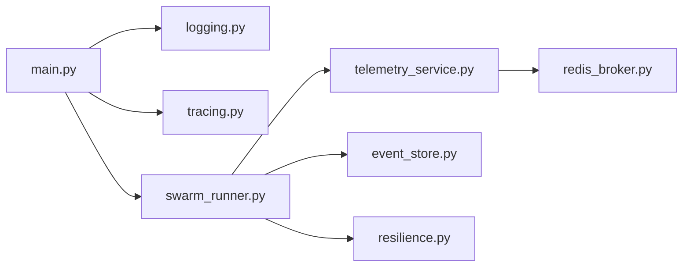

# Monitoring & Observability

<cite>
**Referenced Files in This Document**
- [main.py](file://travel-recovery-os/backend/main.py)
- [config.py](file://travel-recovery-os/backend/config.py)
- [logging.py](file://travel-recovery-os/backend/middleware/logging.py)
- [tracing.py](file://travel-recovery-os/backend/middleware/tracing.py)
- [resilience.py](file://travel-recovery-os/backend/middleware/resilience.py)
- [telemetry_service.py](file://travel-recovery-os/backend/services/telemetry_service.py)
- [redis_broker.py](file://travel-recovery-os/backend/store/redis_broker.py)
- [event_store.py](file://travel-recovery-os/backend/store/event_store.py)
- [swarm_runner.py](file://travel-recovery-os/backend/services/swarm_runner.py)
- [swarm.py](file://travel-recovery-os/backend/swarm.py)
- [telemetry.py](file://travel-recovery-os/backend/api/routers/telemetry.py)
</cite>

## Table of Contents
1. Introduction
2. Project Structure
3. Core Components
4. Architecture Overview
5. Detailed Component Analysis
6. Dependency Analysis
7. Performance Considerations
8. Troubleshooting Guide
9. Conclusion
10. Appendices

## Introduction
This document provides comprehensive monitoring and observability guidance for the SynapseAir platform. It covers structured logging with log levels, correlation IDs, and aggregation strategies; OpenTelemetry-based distributed tracing across agent workflows and external service calls; telemetry collection via real-time streaming; metrics and performance monitoring approaches; resilience patterns including circuit breakers and retries; and practical guidance for dashboards, alerting, and debugging distributed transactions across the multi-agent system.

## Project Structure
SynapseAir’s backend is a FastAPI application that orchestrates a LangGraph swarm of specialized agents. Observability spans multiple layers:
- Application lifecycle initializes logging and tracing at startup.
- Middleware provides structured logs, tracing utilities, and resilience primitives.
- Services emit telemetry events to clients via SSE/WebSocket and persist event history.
- Storage backends include Redis (real-time pub/sub and streams) and SQLite (audit/history).
- API routers expose telemetry endpoints for live streaming and state inspection.

**Diagram sources**
- [main.py:22-37](file://travel-recovery-os/backend/main.py#L22-L37)
- [logging.py:37-100](file://travel-recovery-os/backend/middleware/logging.py#L37-L100)
- [tracing.py:43-80](file://travel-recovery-os/backend/middleware/tracing.py#L43-L80)
- [swarm_runner.py:36-70](file://travel-recovery-os/backend/services/swarm_runner.py#L36-L70)
- [telemetry_service.py:45-68](file://travel-recovery-os/backend/services/telemetry_service.py#L45-L68)
- [redis_broker.py:86-121](file://travel-recovery-os/backend/store/redis_broker.py#L86-L121)
- [event_store.py:166-239](file://travel-recovery-os/backend/store/event_store.py#L166-L239)
- [telemetry.py:11-46](file://travel-recovery-os/backend/api/routers/telemetry.py#L11-L46)

**Section sources**
- [main.py:22-37](file://travel-recovery-os/backend/main.py#L22-L37)
- [config.py:79-83](file://travel-recovery-os/backend/config.py#L79-L83)

## Core Components
- Structured logging with optional JSON output and context-bound fields.
- OpenTelemetry tracing with console and OTLP exporters, plus FastAPI instrumentation.
- Resilience primitives: exponential backoff retry and circuit breaker states.
- Real-time telemetry via SSE with Redis-backed pub/sub and stream persistence.
- Persistent audit/history via SQLite for disruptions and webhook events.
- API endpoints for live telemetry streaming and thread state inspection.

**Section sources**
- [logging.py:37-119](file://travel-recovery-os/backend/middleware/logging.py#L37-L119)
- [tracing.py:43-121](file://travel-recovery-os/backend/middleware/tracing.py#L43-L121)
- [resilience.py:25-215](file://travel-recovery-os/backend/middleware/resilience.py#L25-L215)
- [telemetry_service.py:23-68](file://travel-recovery-os/backend/services/telemetry_service.py#L23-L68)
- [redis_broker.py:86-179](file://travel-recovery-os/backend/store/redis_broker.py#L86-L179)
- [event_store.py:166-335](file://travel-recovery-os/backend/store/event_store.py#L166-L335)
- [telemetry.py:11-72](file://travel-recovery-os/backend/api/routers/telemetry.py#L11-L72)

## Architecture Overview
The observability architecture integrates structured logs, traces, and telemetry into a cohesive pipeline:
- Startup configures logging and tracing once per process.
- Agent workflow execution emits step-level logs and telemetry events.
- Telemetry events are masked for PII, persisted, and streamed to clients.
- Distributed traces capture end-to-end latency and span attributes for LLM calls and agent nodes.
- Resilience mechanisms protect external dependencies and ensure graceful degradation.

**Diagram sources**
- [swarm_runner.py:36-70](file://travel-recovery-os/backend/services/swarm_runner.py#L36-L70)
- [swarm_runner.py:106-131](file://travel-recovery-os/backend/services/swarm_runner.py#L106-L131)
- [swarm_runner.py:183-198](file://travel-recovery-os/backend/services/swarm_runner.py#L183-L198)
- [telemetry_service.py:45-68](file://travel-recovery-os/backend/services/telemetry_service.py#L45-L68)
- [redis_broker.py:86-121](file://travel-recovery-os/backend/store/redis_broker.py#L86-L121)
- [event_store.py:166-239](file://travel-recovery-os/backend/store/event_store.py#L166-L239)

## Detailed Component Analysis

### Structured Logging
- Initialization supports configurable log level and JSON output mode, with fallback to stdlib logging when structlog is unavailable.
- Context binding allows temporary enrichment of logs with request-scoped fields such as thread identifiers.
- Log aggregation strategy:
  - Development: human-readable console output.
  - Production: JSON lines suitable for ingestion by log aggregators (e.g., Loki, CloudWatch, Datadog).

**Diagram sources**
- [logging.py:37-100](file://travel-recovery-os/backend/middleware/logging.py#L37-L100)

**Section sources**
- [logging.py:37-147](file://travel-recovery-os/backend/middleware/logging.py#L37-L147)
- [main.py:26-32](file://travel-recovery-os/backend/main.py#L26-L32)
- [config.py:79-83](file://travel-recovery-os/backend/config.py#L79-L83)

### Correlation IDs and Trace Propagation
- OpenTelemetry tracing is initialized with a resource containing the service name and can export to console and/or OTLP endpoint.
- The current trace context (trace_id and span_id) can be extracted and embedded into telemetry payloads for frontend correlation.
- FastAPI instrumentation captures HTTP spans automatically when an app instance is provided.

**Diagram sources**
- [tracing.py:43-80](file://travel-recovery-os/backend/middleware/tracing.py#L43-L80)
- [tracing.py:104-121](file://travel-recovery-os/backend/middleware/tracing.py#L104-L121)
- [telemetry.py:11-46](file://travel-recovery-os/backend/api/routers/telemetry.py#L11-L46)

**Section sources**
- [tracing.py:43-159](file://travel-recovery-os/backend/middleware/tracing.py#L43-L159)
- [main.py:26-32](file://travel-recovery-os/backend/main.py#L26-L32)
- [config.py:79-83](file://travel-recovery-os/backend/config.py#L79-L83)

### Telemetry Collection and Streaming
- Telemetry service masks PII before broadcasting events to ensure privacy.
- Events are persisted to Redis Streams with TTL and published via Pub/Sub for real-time fan-out.
- In-memory fallback ensures continuity when Redis is unavailable.
- SSE endpoint replays historical events then streams live updates with keep-alive pings.

**Diagram sources**
- [telemetry_service.py:23-68](file://travel-recovery-os/backend/services/telemetry_service.py#L23-L68)
- [redis_broker.py:86-121](file://travel-recovery-os/backend/store/redis_broker.py#L86-L121)

**Section sources**
- [telemetry_service.py:23-79](file://travel-recovery-os/backend/services/telemetry_service.py#L23-L79)
- [redis_broker.py:86-179](file://travel-recovery-os/backend/store/redis_broker.py#L86-L179)
- [telemetry.py:11-72](file://travel-recovery-os/backend/api/routers/telemetry.py#L11-L72)

### Distributed Tracing Across Agent Workflows
- The swarm runner iterates through LangGraph node outputs, emitting step-level telemetry and error signals.
- Per-node error detection tracks retries and escalates after exceeding thresholds.
- Tracing decorators enable wrapping agent nodes and LLM calls with spans carrying model metadata.

**Diagram sources**
- [swarm_runner.py:71-131](file://travel-recovery-os/backend/services/swarm_runner.py#L71-L131)
- [tracing.py:128-159](file://travel-recovery-os/backend/middleware/tracing.py#L128-L159)

**Section sources**
- [swarm_runner.py:36-216](file://travel-recovery-os/backend/services/swarm_runner.py#L36-L216)
- [tracing.py:128-159](file://travel-recovery-os/backend/middleware/tracing.py#L128-L159)

### Metrics Export and Performance Monitoring
- Current implementation focuses on logs and traces rather than explicit metrics counters.
- Performance insights can be derived from:
  - Trace durations and attributes (LLM model, operation).
  - SSE throughput and latency observed from client-side measurements.
  - Historical resolution times computed from SQLite disruption records.
- To add explicit metrics:
  - Introduce a metrics library (e.g., Prometheus client) and instrument key operations (request rates, error rates, latency histograms).
  - Expose a /metrics endpoint and scrape via Prometheus.
  - Add counters for circuit breaker state transitions and retry attempts.

[No sources needed since this section provides general guidance]

### Resilience Patterns
- Retry with exponential backoff:
  - Wraps async coroutine factories with configurable max retries, base/max delays, jitter, and exception filtering.
  - Logs warnings on failures and errors when all retries are exhausted.
- Circuit Breaker:
  - State machine with CLOSED, OPEN, HALF_OPEN states.
  - Tracks failure counts, cooldowns, and probe limits.
  - Pre-configured instances for specific services (LLMs, Atlas API, n8n webhooks).

**Diagram sources**
- [resilience.py:86-215](file://travel-recovery-os/backend/middleware/resilience.py#L86-L215)

**Section sources**
- [resilience.py:25-244](file://travel-recovery-os/backend/middleware/resilience.py#L25-L244)

### Graceful Degradation
- Redis broker gracefully falls back to in-memory queues and history when Redis is unavailable.
- Tracing degrades to no-op when OpenTelemetry packages are not installed.
- Logging falls back to stdlib when structlog is not installed.

**Section sources**
- [redis_broker.py:42-62](file://travel-recovery-os/backend/store/redis_broker.py#L42-L62)
- [redis_broker.py:113-150](file://travel-recovery-os/backend/store/redis_broker.py#L113-L150)
- [tracing.py:21-34](file://travel-recovery-os/backend/middleware/tracing.py#L21-L34)
- [logging.py:21-27](file://travel-recovery-os/backend/middleware/logging.py#L21-L27)

## Dependency Analysis
Observability components interact as follows:
- main.py initializes logging and tracing during lifespan startup.
- swarm_runner.py orchestrates agent execution and emits telemetry events.
- telemetry_service.py handles PII masking and delegates to redis_broker.py for pub/sub and persistence.
- event_store.py persists disruption records and provides analytics queries.
- resilience.py provides reusable retry and circuit breaker primitives used by service calls.

**Diagram sources**
- [main.py:22-37](file://travel-recovery-os/backend/main.py#L22-L37)
- [swarm_runner.py:36-70](file://travel-recovery-os/backend/services/swarm_runner.py#L36-L70)
- [telemetry_service.py:45-68](file://travel-recovery-os/backend/services/telemetry_service.py#L45-L68)
- [redis_broker.py:86-121](file://travel-recovery-os/backend/store/redis_broker.py#L86-L121)
- [event_store.py:166-239](file://travel-recovery-os/backend/store/event_store.py#L166-L239)
- [resilience.py:25-215](file://travel-recovery-os/backend/middleware/resilience.py#L25-L215)

**Section sources**
- [main.py:22-37](file://travel-recovery-os/backend/main.py#L22-L37)
- [swarm_runner.py:36-216](file://travel-recovery-os/backend/services/swarm_runner.py#L36-L216)
- [telemetry_service.py:23-79](file://travel-recovery-os/backend/services/telemetry_service.py#L23-L79)
- [redis_broker.py:86-179](file://travel-recovery-os/backend/store/redis_broker.py#L86-L179)
- [event_store.py:166-335](file://travel-recovery-os/backend/store/event_store.py#L166-L335)
- [resilience.py:25-244](file://travel-recovery-os/backend/middleware/resilience.py#L25-L244)

## Performance Considerations
- Prefer JSON logging in production for efficient parsing and aggregation.
- Use Redis Streams with bounded maxlen and TTL to control memory usage.
- Keep SSE connections alive with periodic keep-alives to detect dead clients early.
- Instrument critical paths with tracing spans to identify bottlenecks (LLM calls, GDS requests).
- Monitor Redis availability and handle fallbacks without blocking request flows.
- Tune retry backoff parameters to balance responsiveness and load reduction.

[No sources needed since this section provides general guidance]

## Troubleshooting Guide
- Missing or misconfigured OTEL_ENDPOINT:
  - Tracing will still work with console exporter; verify environment variables and provider initialization.
- Redis unavailability:
  - System falls back to in-memory queues/history; confirm USE_REDIS flag and REDIS_URL settings.
- High error rates in agent nodes:
  - Review WORKFLOW_NODE_ERROR events and escalation thresholds; adjust MAX_NODE_RETRIES if necessary.
- Circuit breaker open:
  - Check failure thresholds and cooldown periods; inspect logs for repeated failures and consider scaling or fixing downstream services.
- SSE connectivity issues:
  - Verify streaming headers and keep-alive behavior; ensure client disconnect handling is working.

**Section sources**
- [tracing.py:43-80](file://travel-recovery-os/backend/middleware/tracing.py#L43-L80)
- [redis_broker.py:42-62](file://travel-recovery-os/backend/store/redis_broker.py#L42-L62)
- [swarm_runner.py:106-131](file://travel-recovery-os/backend/services/swarm_runner.py#L106-L131)
- [resilience.py:116-215](file://travel-recovery-os/backend/middleware/resilience.py#L116-L215)
- [telemetry.py:11-46](file://travel-recovery-os/backend/api/routers/telemetry.py#L11-L46)

## Conclusion
SynapseAir implements robust observability through structured logging, distributed tracing, real-time telemetry streaming, and resilient patterns. While explicit metrics exports are not present, the combination of logs, traces, and persistent histories enables effective monitoring, debugging, and performance analysis. Extending the system with dedicated metrics endpoints and dashboards will further enhance operational visibility.

[No sources needed since this section summarizes without analyzing specific files]

## Appendices

### Setting Up Monitoring Dashboards
- Logs:
  - Configure JSON logging in production and ingest into a log aggregator.
  - Create dashboards for error rates, log volume, and top error messages.
- Traces:
  - Connect OTLP exporter to a tracing backend (e.g., Jaeger, Tempo, commercial APM).
  - Build dashboards for span latency, error rates, and LLM call performance.
- Telemetry:
  - Visualize SSE event flow and latency using client-side metrics or server-side counters.
  - Track Redis stream sizes and pub/sub throughput.

[No sources needed since this section provides general guidance]

### Alerting Rules
- Suggested alerts:
  - Spike in WORKFLOW_NODE_ERROR events beyond threshold.
  - Circuit breaker transitioning to OPEN frequently.
  - Redis connection failures or fallback activations.
  - Long-running workflows exceeding expected duration.
  - Health endpoint returning unhealthy status.

[No sources needed since this section provides general guidance]

### Debugging Distributed Transactions
- Use trace_id and span_id embedded in SSE events to correlate UI actions with backend spans.
- Inspect thread state snapshots via the telemetry router to understand workflow progress and pending nodes.
- Review SQLite disruption records for final outcomes and error states.
- Leverage per-node retry tracking and escalation signals to pinpoint problematic stages.

**Section sources**
- [tracing.py:104-121](file://travel-recovery-os/backend/middleware/tracing.py#L104-L121)
- [telemetry.py:48-72](file://travel-recovery-os/backend/api/routers/telemetry.py#L48-L72)
- [event_store.py:242-335](file://travel-recovery-os/backend/store/event_store.py#L242-L335)
- [swarm_runner.py:106-131](file://travel-recovery-os/backend/services/swarm_runner.py#L106-L131)