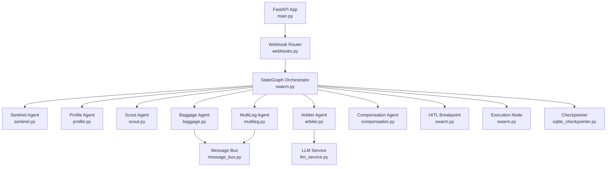
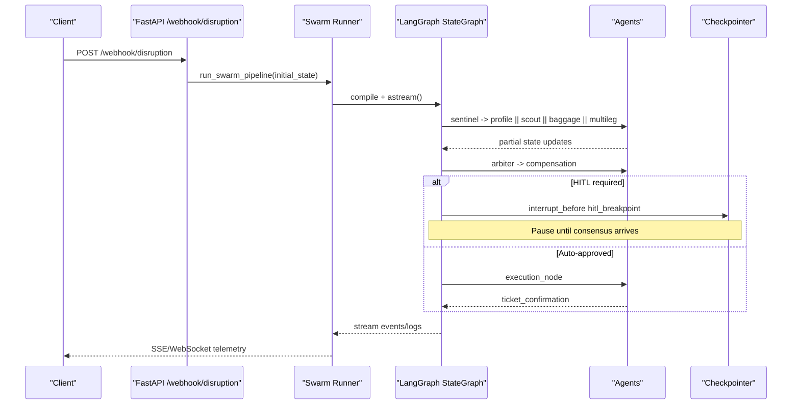
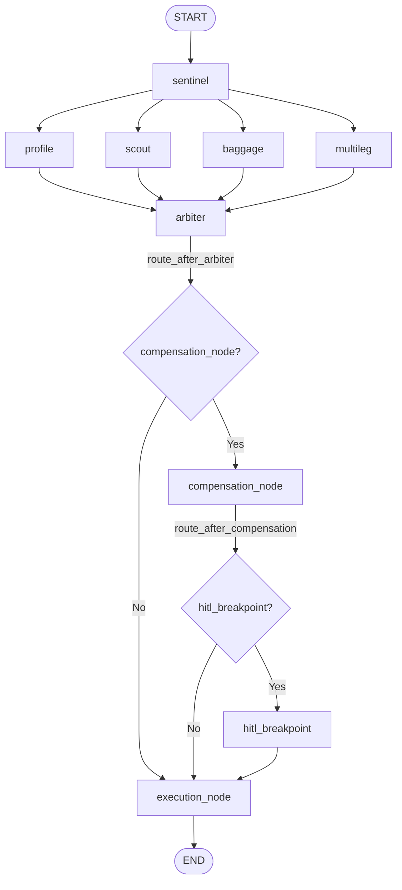
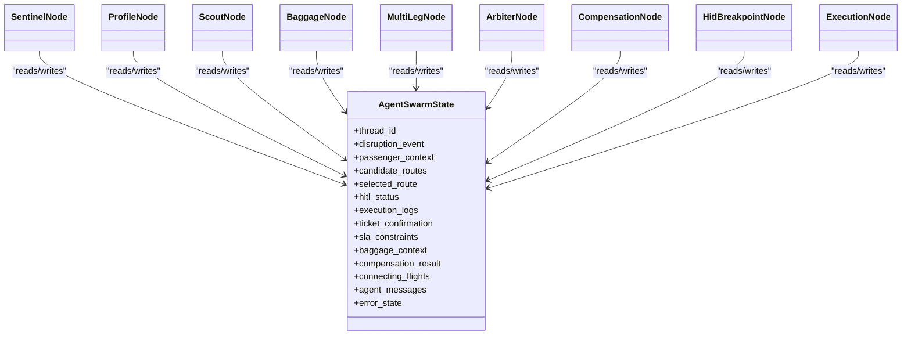
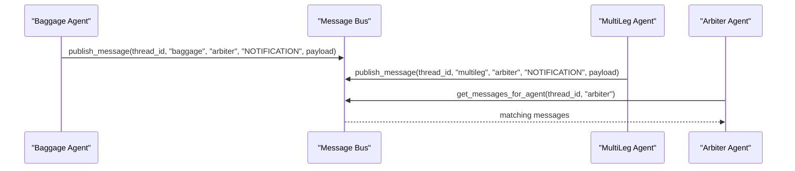
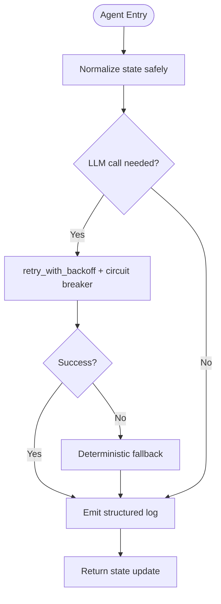
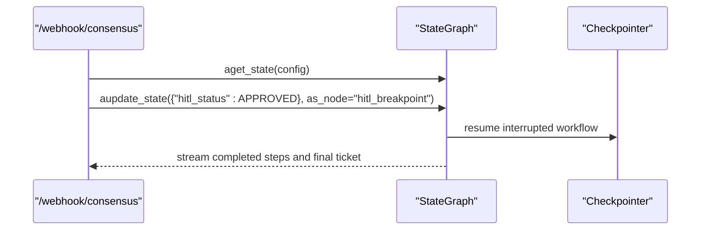
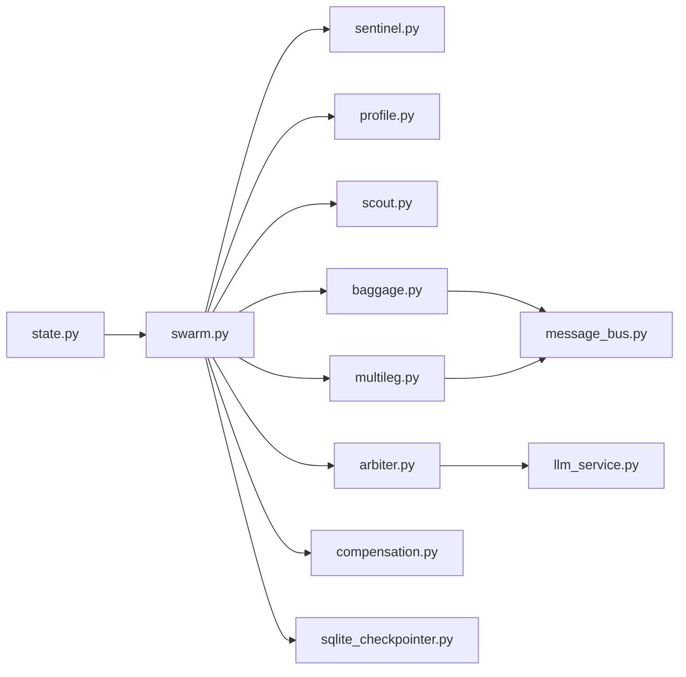

# Agent Framework Overview

<cite>
**Referenced Files in This Document**
- [swarm.py](file://backend/swarm.py)
- [state.py](file://backend/state.py)
- [main.py](file://backend/main.py)
- [sentinel.py](file://backend/agents/sentinel.py)
- [profile.py](file://backend/agents/profile.py)
- [scout.py](file://backend/agents/scout.py)
- [arbiter.py](file://backend/agents/arbiter.py)
- [baggage.py](file://backend/agents/baggage.py)
- [compensation.py](file://backend/agents/compensation.py)
- [multileg.py](file://backend/agents/multileg.py)
- [message_bus.py](file://backend/services/message_bus.py)
- [llm_service.py](file://backend/services/llm_service.py)
- [sqlite_checkpointer.py](file://backend/store/sqlite_checkpointer.py)
- [webhooks.py](file://backend/api/routers/webhooks.py)
</cite>

## Table of Contents
1. Introduction
2. Project Structure
3. Core Components
4. Architecture Overview
5. Detailed Component Analysis
6. Dependency Analysis
7. Performance Considerations
8. Troubleshooting Guide
9. Conclusion
10. Appendices

## Introduction
This document explains the LangGraph-based multi-agent orchestration framework used by the Travel Recovery OS to autonomously recover from flight disruptions. It covers the StateGraph architecture, agent lifecycle management, state transition patterns, central orchestrator behavior, message passing protocols, and error handling strategies. It also provides guidance on extending the system with new agents and custom state management patterns.

## Project Structure
The backend implements a FastAPI application that exposes webhooks for disruption ingestion and passenger consensus. The core orchestration is defined as a LangGraph StateGraph with specialized agents (Sentinel, Profile, Scout, Baggage, MultiLeg, Arbiter, Compensation, HITL Breakpoint, Execution). A durable checkpointer persists graph state across process boundaries, enabling Human-in-the-Loop (HITL) pause/resume flows.

**Diagram sources**
- [main.py:22-72](file://backend/main.py#L22-L72)
- [webhooks.py:14-72](file://backend/api/routers/webhooks.py#L14-L72)
- [swarm.py:162-227](file://backend/swarm.py#L162-L227)
- [sqlite_checkpointer.py:43-54](file://backend/store/sqlite_checkpointer.py#L43-L54)
- [llm_service.py:126-205](file://backend/services/llm_service.py#L126-L205)
- [message_bus.py:27-63](file://backend/services/message_bus.py#L27-L63)

**Section sources**
- [main.py:22-128](file://backend/main.py#L22-L128)
- [webhooks.py:14-185](file://backend/api/routers/webhooks.py#L14-L185)
- [swarm.py:162-232](file://backend/swarm.py#L162-L232)

## Core Components
- StateSchema: Central TypedDict defining all fields shared across agents, including disruption event, passenger context, candidate routes, selected route, compensation result, connecting flights, agent messages, and execution logs.
- Orchestration Graph: A compiled StateGraph that defines nodes, edges, conditional routing, and interruption points for HITL.
- Agents: Specialized nodes that perform domain tasks (disruption parsing, SLA derivation, inventory search, baggage evaluation, multi-leg coordination, route scoring, compensation calculation, ticket issuance).
- Services: LLM orchestration (Hermes extraction, DeepSeek CoT scoring), resilient retry/circuit-breaking, and an in-memory message bus for inter-agent communication.
- Persistence: Durable checkpointer to persist graph state and support resume after HITL decisions.

**Section sources**
- [state.py:20-167](file://backend/state.py#L20-L167)
- [swarm.py:162-227](file://backend/swarm.py#L162-L227)
- [llm_service.py:34-120](file://backend/services/llm_service.py#L34-L120)
- [message_bus.py:27-108](file://backend/services/message_bus.py#L27-L108)
- [sqlite_checkpointer.py:43-54](file://backend/store/sqlite_checkpointer.py#L43-L54)

## Architecture Overview
The workflow begins at the webhook endpoint, which initializes the initial state and starts the swarm pipeline asynchronously. After Sentinel normalizes the disruption signal, parallel fan-out executes Profile, Scout, Baggage, and optionally MultiLeg. Their outputs converge at Arbiter, which scores candidates using LLM-driven reasoning plus ensemble factors. Compensation is evaluated next. Depending on status, the graph either proceeds to execution or pauses at the HITL breakpoint until passenger consent is received via n8n/WhatsApp. Upon approval or bypass, the final ticketing node issues the rebooked ticket and completes.

**Diagram sources**
- [webhooks.py:14-72](file://backend/api/routers/webhooks.py#L14-L72)
- [swarm.py:162-227](file://backend/swarm.py#L162-L227)
- [sqlite_checkpointer.py:43-54](file://backend/store/sqlite_checkpointer.py#L43-L54)

## Detailed Component Analysis

### StateGraph Topology and Control Flow
- Nodes: sentinel, profile, scout, baggage, multileg, arbiter, compensation_node, hitl_breakpoint, execution_node.
- Edges: START → sentinel; sentinel fans out to profile, scout, baggage, multileg; these fan into arbiter; arbiter routes conditionally to compensation_node, execution_node, or hitl_breakpoint; compensation_node routes to execution_node or hitl_breakpoint; hitl_breakpoint resumes to execution_node; execution_node ends at END.
- Conditional routing functions evaluate state fields such as hitl_status and compensation_result to determine next steps.
- Interruption: The graph compiles with interrupt_before=["hitl_breakpoint"], enabling durable pause/resume via the checkpointer.

**Diagram sources**
- [swarm.py:162-227](file://backend/swarm.py#L162-L227)

**Section sources**
- [swarm.py:94-127](file://backend/swarm.py#L94-L127)
- [swarm.py:162-227](file://backend/swarm.py#L162-L227)

### Agent Lifecycle Management
- Sentinel: Normalizes structured or raw disruption signals, optionally invoking Hermes to extract JSON fields, then emits telemetry and forwards state downstream.
- Profile: Derives SLA constraints and financial liability metrics based on loyalty tier and delay magnitude.
- Scout: Queries Atlas Sandbox API for alternative routes and injects candidates into state.
- Baggage: Evaluates transfer feasibility, interline agreements, special items, and estimated transfer time; publishes messages to Arbiter.
- MultiLeg: Analyzes connection viability against minimum connection times; publishes connection insights to Arbiter.
- Arbiter: Scores candidates using DeepSeek CoT plus ensemble factors (punctuality, baggage feasibility, compensation impact, connection time); selects best route and determines HITL policy.
- Compensation: Calculates passenger rights under EU261/DOT/MAS rules and eligibility.
- HITL Breakpoint: Pauses execution and waits for passenger consent via external channels.
- Execution: Issues final ticket via Atlas API and completes the workflow.

**Diagram sources**
- [state.py:130-167](file://backend/state.py#L130-L167)
- [sentinel.py:34-90](file://backend/agents/sentinel.py#L34-L90)
- [profile.py:58-126](file://backend/agents/profile.py#L58-L126)
- [scout.py:32-86](file://backend/agents/scout.py#L32-L86)
- [baggage.py:76-151](file://backend/agents/baggage.py#L76-L151)
- [multileg.py:96-167](file://backend/agents/multileg.py#L96-L167)
- [arbiter.py:128-243](file://backend/agents/arbiter.py#L128-L243)
- [compensation.py:105-194](file://backend/agents/compensation.py#L105-L194)
- [swarm.py:130-159](file://backend/swarm.py#L130-L159)
- [swarm.py:52-91](file://backend/swarm.py#L52-L91)

**Section sources**
- [sentinel.py:34-90](file://backend/agents/sentinel.py#L34-L90)
- [profile.py:58-126](file://backend/agents/profile.py#L58-L126)
- [scout.py:32-86](file://backend/agents/scout.py#L32-L86)
- [baggage.py:76-151](file://backend/agents/baggage.py#L76-L151)
- [multileg.py:96-167](file://backend/agents/multileg.py#L96-L167)
- [arbiter.py:128-243](file://backend/agents/arbiter.py#L128-L243)
- [compensation.py:105-194](file://backend/agents/compensation.py#L105-L194)
- [swarm.py:52-159](file://backend/swarm.py#L52-L159)

### Message Passing Protocols
- Inter-agent messages are modeled by AgentMessage and stored per thread_id in an in-memory message bus.
- Agents publish notifications (e.g., baggage transfer details, connection viability) targeted to specific recipients or broadcast to all.
- Consumers can query messages by thread_id, agent name, and optional message type.

**Diagram sources**
- [baggage.py:134-151](file://backend/agents/baggage.py#L134-L151)
- [multileg.py:147-161](file://backend/agents/multileg.py#L147-L161)
- [message_bus.py:27-90](file://backend/services/message_bus.py#L27-L90)

**Section sources**
- [message_bus.py:27-108](file://backend/services/message_bus.py#L27-L108)
- [baggage.py:134-151](file://backend/agents/baggage.py#L134-L151)
- [multileg.py:147-161](file://backend/agents/multileg.py#L147-L161)

### Error Handling Strategies
- LLM resilience: Both Hermes and DeepSeek calls are wrapped with circuit breakers and retry-with-backoff; deterministic fallbacks are provided when endpoints fail or keys are missing.
- Graceful state normalization: Each agent uses a safe-state helper to handle non-dict states robustly.
- Per-node logging: All nodes emit structured execution logs for observability and streaming.
- Checkpoint durability: Graph state persists via a checkpointer so workflows survive interruptions and process restarts.

**Diagram sources**
- [llm_service.py:34-120](file://backend/services/llm_service.py#L34-L120)
- [llm_service.py:126-205](file://backend/services/llm_service.py#L126-L205)
- [arbiter.py:116-125](file://backend/agents/arbiter.py#L116-L125)
- [sentinel.py:22-31](file://backend/agents/sentinel.py#L22-L31)

**Section sources**
- [llm_service.py:34-120](file://backend/services/llm_service.py#L34-L120)
- [llm_service.py:126-205](file://backend/services/llm_service.py#L126-L205)
- [arbiter.py:116-125](file://backend/agents/arbiter.py#L116-L125)
- [sentinel.py:22-31](file://backend/agents/sentinel.py#L22-L31)

### Execution Flow Control and HITL
- Conditional routing ensures compensation is always evaluated before proceeding to HITL or execution.
- High-confidence auto-approval can bypass HITL for elite tiers when ensemble score thresholds are met.
- On HITL requirement, the graph interrupts before the breakpoint node; passenger consent updates state and resumes execution.

**Diagram sources**
- [webhooks.py:74-185](file://backend/api/routers/webhooks.py#L74-L185)
- [swarm.py:222-227](file://backend/swarm.py#L222-L227)

**Section sources**
- [webhooks.py:74-185](file://backend/api/routers/webhooks.py#L74-L185)
- [swarm.py:94-117](file://backend/swarm.py#L94-L117)
- [arbiter.py:194-209](file://backend/agents/arbiter.py#L194-L209)

## Dependency Analysis
- Agents depend on shared state schema and may call services (LLM, Atlas tools).
- The orchestrator composes nodes and edges, wiring conditional logic and interruption points.
- External integrations include Atlas GDS (search/booking), LLM providers (Hermes, DeepSeek), and persistence (SQLite checkpointer).

**Diagram sources**
- [state.py:130-167](file://backend/state.py#L130-L167)
- [swarm.py:162-227](file://backend/swarm.py#L162-L227)
- [arbiter.py:128-243](file://backend/agents/arbiter.py#L128-L243)
- [llm_service.py:126-205](file://backend/services/llm_service.py#L126-L205)
- [message_bus.py:27-108](file://backend/services/message_bus.py#L27-L108)
- [sqlite_checkpointer.py:43-54](file://backend/store/sqlite_checkpointer.py#L43-L54)

**Section sources**
- [swarm.py:162-227](file://backend/swarm.py#L162-L227)
- [arbiter.py:128-243](file://backend/agents/arbiter.py#L128-L243)
- [llm_service.py:126-205](file://backend/services/llm_service.py#L126-L205)
- [message_bus.py:27-108](file://backend/services/message_bus.py#L27-L108)
- [sqlite_checkpointer.py:43-54](file://backend/store/sqlite_checkpointer.py#L43-L54)

## Performance Considerations
- Parallel fan-out reduces end-to-end latency by executing independent agents concurrently.
- Ensemble scoring aggregates multiple signals efficiently; keep payloads minimal to reduce serialization overhead.
- LLM calls are rate-limited via retries and circuit breakers; ensure timeouts align with service-level expectations.
- Use additive reducers for list fields (candidate_routes, execution_logs, connecting_flights, agent_messages) to avoid full state copies.

[No sources needed since this section provides general guidance]

## Troubleshooting Guide
- No candidate route selected: Ensure Scout successfully queries Atlas and returns routes; verify origin/destination/date inputs.
- HITL not resuming: Confirm thread_id is correct and consensus webhook updates state at the correct node; check checkpointer availability.
- LLM failures: Inspect circuit breaker logs and fallback paths; validate API keys and base URLs.
- Message bus empty: Verify thread_id scoping and that agents publish messages with correct targets.

**Section sources**
- [webhooks.py:84-185](file://backend/api/routers/webhooks.py#L84-L185)
- [llm_service.py:86-120](file://backend/services/llm_service.py#L86-L120)
- [message_bus.py:66-108](file://backend/services/message_bus.py#L66-L108)
- [sqlite_checkpointer.py:43-54](file://backend/store/sqlite_checkpointer.py#L43-L54)

## Conclusion
The framework leverages LangGraph’s StateGraph to coordinate specialized agents in a resilient, observable, and extensible manner. By combining parallel execution, robust state transitions, and durable checkpoints, it supports real-time recovery workflows with human oversight when necessary. Extending the system involves adding new agents, updating the state schema, and wiring them into the graph topology.

[No sources needed since this section summarizes without analyzing specific files]

## Appendices

### Example: Agent Registration and Graph Wiring
- Register nodes and edges in the orchestrator, define conditional routing functions, and compile with interruption points and a checkpointer.

**Section sources**
- [swarm.py:162-227](file://backend/swarm.py#L162-L227)

### Example: State Schema Definitions
- Define TypedDicts for domain entities and the central AgentSwarmState, using annotated lists with additive reducers where appropriate.

**Section sources**
- [state.py:20-167](file://backend/state.py#L20-L167)

### Example: Execution Flow Control
- Ingest disruption via webhook, initialize initial state, start the swarm pipeline, and stream telemetry; handle consensus to resume or stop the workflow.

**Section sources**
- [webhooks.py:14-185](file://backend/api/routers/webhooks.py#L14-L185)
- [swarm.py:52-159](file://backend/swarm.py#L52-L159)

### Guidance: Extending with New Agents
- Add a new agent module implementing a node function that reads/writes AgentSwarmState fields and emits execution logs.
- Register the node in the orchestrator and wire edges (fan-out/fan-in or conditional routing).
- If the agent needs inter-agent communication, publish messages via the message bus.
- Update state schema if new fields are required; use additive reducers for list accumulators.

**Section sources**
- [swarm.py:162-227](file://backend/swarm.py#L162-L227)
- [state.py:130-167](file://backend/state.py#L130-L167)
- [message_bus.py:27-90](file://backend/services/message_bus.py#L27-L90)