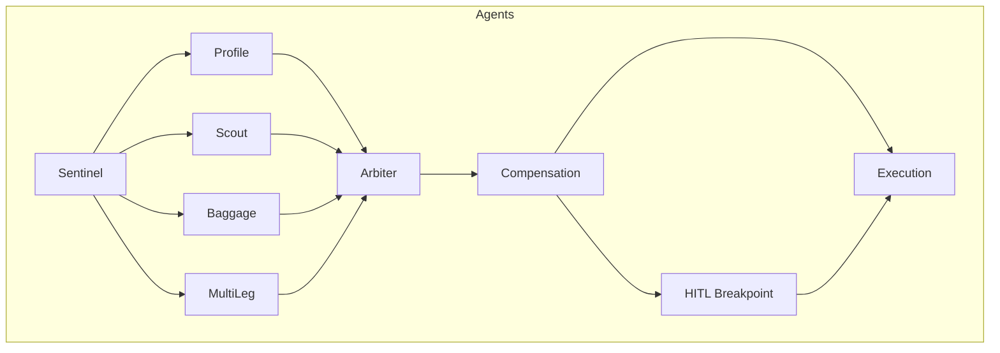
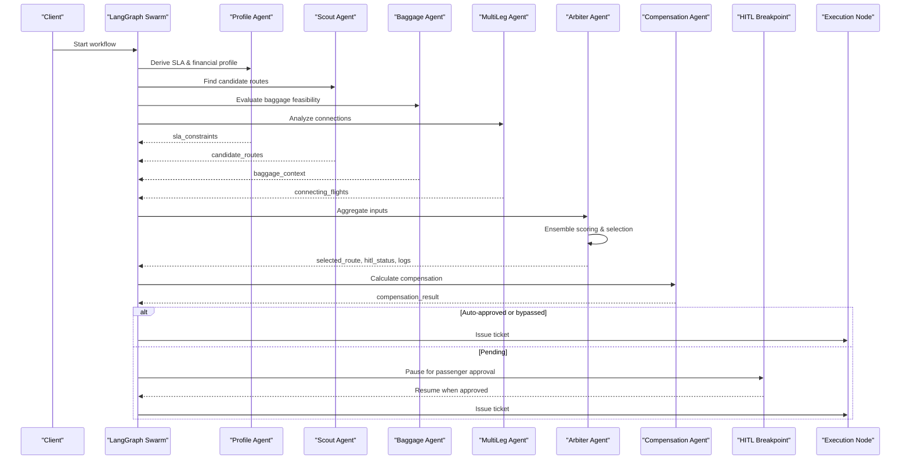
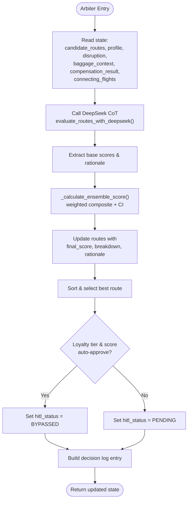
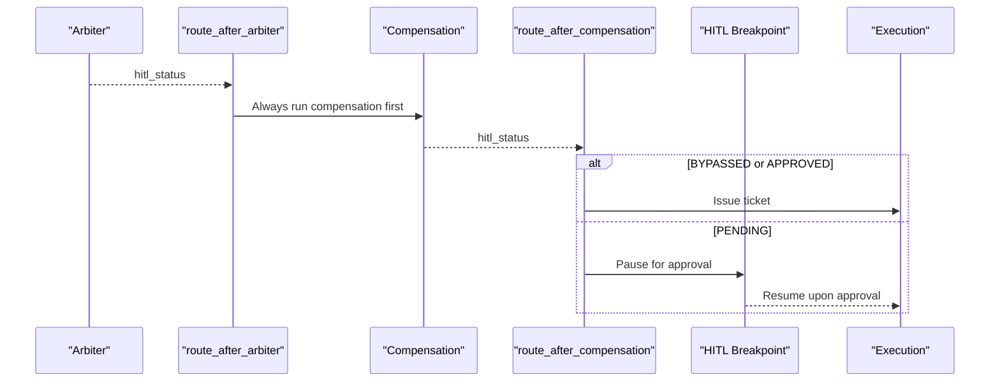
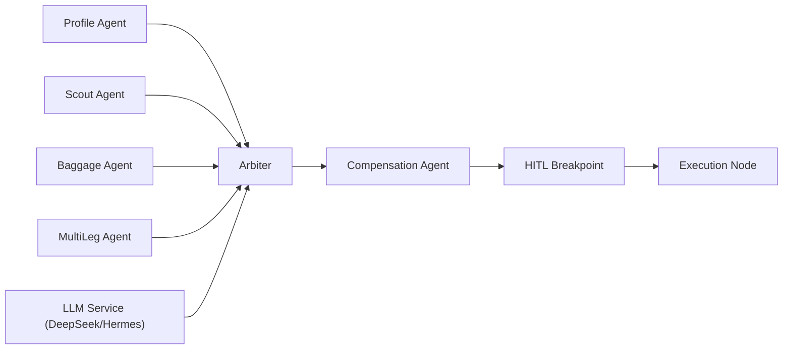

# Arbiter Agent

<cite>
**Referenced Files in This Document**
- [arbiter.py](file://travel-recovery-os/backend/agents/arbiter.py)
- [state.py](file://travel-recovery-os/backend/state.py)
- [swarm.py](file://travel-recovery-os/backend/swarm.py)
- [llm_service.py](file://travel-recovery-os/backend/services/llm_service.py)
- [baggage.py](file://travel-recovery-os/backend/agents/baggage.py)
- [compensation.py](file://travel-recovery-os/backend/agents/compensation.py)
- [multileg.py](file://travel-recovery-os/backend/agents/multileg.py)
- [profile.py](file://travel-recovery-os/backend/agents/profile.py)
- [scout.py](file://travel-recovery-os/backend/agents/scout.py)
- [sqlite_checkpointer.py](file://travel-recovery-os/backend/store/sqlite_checkpointer.py)
</cite>

## Table of Contents
1. Introduction
2. Project Structure
3. Core Components
4. Architecture Overview
5. Detailed Component Analysis
6. Dependency Analysis
7. Performance Considerations
8. Troubleshooting Guide
9. Conclusion
10. Appendices

## Introduction
This document explains the Arbiter agent, which performs route scoring, selection, and human-in-the-loop (HITL) decision-making within a multi-agent travel disruption recovery system. The Arbiter aggregates inputs from other agents (Profile, Scout, Baggage, Compensation, MultiLeg), applies business rules and ensemble scoring, and decides whether to auto-approve or escalate decisions for human approval. It also generates an audit trail and integrates with approval workflows via a durable checkpointed graph that can pause at HITL breakpoints.

## Project Structure
The Arbiter is part of a LangGraph-based swarm orchestrated by a central state schema. Key files:
- State definitions define the shared data model used across agents.
- Swarm wiring defines execution order, parallel branches, conditional routing, and HITL interruption.
- Agents contribute specialized context: Profile (SLA constraints), Scout (candidate routes), Baggage (transfer feasibility), Compensation (rights and amounts), MultiLeg (connection viability).
- LLM service provides DeepSeek-powered CoT evaluation with deterministic fallbacks.
- Checkpointer enables durable state persistence for HITL resumption.

**Diagram sources**
- [swarm.py:162-227](file://travel-recovery-os/backend/swarm.py#L162-L227)

**Section sources**
- [state.py:130-167](file://travel-recovery-os/backend/state.py#L130-L167)
- [swarm.py:162-227](file://travel-recovery-os/backend/swarm.py#L162-L227)

## Core Components
- Arbiter node: Scores candidate routes using a DeepSeek CoT engine plus a multi-factor ensemble score; updates state with selected route, HITL status, and logs.
- Ensemble scoring: Weighted combination of base score, punctuality, baggage feasibility, compensation impact, and connection time adequacy; includes confidence interval estimation.
- HITL logic: Auto-approval bypass for high-confidence elite-tier passengers; otherwise escalates to HITL breakpoint.
- Audit trail: Execution logs capture decision rationale, scores, financial impacts, and WhatsApp messages.

**Section sources**
- [arbiter.py:25-113](file://travel-recovery-os/backend/agents/arbiter.py#L25-L113)
- [arbiter.py:128-244](file://travel-recovery-os/backend/agents/arbiter.py#L128-L244)
- [state.py:46-75](file://travel-recovery-os/backend/state.py#L46-L75)

## Architecture Overview
The swarm executes in parallel after Sentinel ingestion:
- Profile derives SLA constraints and financial profiles.
- Scout queries Atlas API for candidate routes.
- Baggage evaluates transfer feasibility and timing.
- MultiLeg analyzes connecting flight viability.
- Arbiter aggregates all inputs, computes ensemble scores, selects best route, sets HITL status, and emits logs.
- Compensation calculates passenger rights and eligibility.
- Conditional routing proceeds to HITL breakpoint or execution based on HITL status.

**Diagram sources**
- [swarm.py:162-227](file://travel-recovery-os/backend/swarm.py#L162-L227)
- [arbiter.py:128-244](file://travel-recovery-os/backend/agents/arbiter.py#L128-L244)
- [compensation.py:105-195](file://travel-recovery-os/backend/agents/compensation.py#L105-L195)

## Detailed Component Analysis

### Arbiter Node: Scoring, Selection, and HITL Logic
- Inputs:
  - Candidate routes from Scout.
  - Passenger SLA constraints and financial profile from Profile.
  - Baggage transfer feasibility and timing from Baggage.
  - Compensation result from Compensation (post-Arbiter in flow but considered in final decision path).
  - Connecting flights viability from MultiLeg.
- Processing:
  - Calls DeepSeek CoT engine to evaluate routes and produce scored items and reasoning trace.
  - Computes ensemble score per route using weighted criteria: base_score, punctuality, baggage_feasibility, compensation_impact, connection_time.
  - Updates each route with final_score, scoring_rationale, scoring_breakdown, and financial_savings.
  - Sorts candidates and selects best route.
  - Applies HITL override: auto-bypass for PLATINUM/GOLD tiers with high score; otherwise pending.
- Outputs:
  - Updated candidate_routes, selected_route, hitl_status, and execution_logs including decision message, scores, and breakdown.

**Diagram sources**
- [arbiter.py:25-113](file://travel-recovery-os/backend/agents/arbiter.py#L25-L113)
- [arbiter.py:128-244](file://travel-recovery-os/backend/agents/arbiter.py#L128-L244)
- [llm_service.py:126-205](file://travel-recovery-os/backend/services/llm_service.py#L126-L205)

**Section sources**
- [arbiter.py:25-113](file://travel-recovery-os/backend/agents/arbiter.py#L25-L113)
- [arbiter.py:128-244](file://travel-recovery-os/backend/agents/arbiter.py#L128-L244)

### Ensemble Scoring Methodology
- Weights:
  - base_score: 0.35
  - punctuality: 0.20
  - baggage_feasibility: 0.15
  - compensation_impact: 0.10
  - connection_time: 0.20
- Criteria details:
  - Base score from DeepSeek or deterministic fallback.
  - Punctuality rating from route attributes.
  - Baggage feasibility derived from interline eligibility and estimated transfer time.
  - Compensation impact computed as ratio of compensation amount to fare.
  - Connection time viability checks connecting flights’ connection_viable flags.
- Confidence interval:
  - Estimated from standard deviation of breakdown scores to provide low/high bounds.

**Section sources**
- [arbiter.py:25-113](file://travel-recovery-os/backend/agents/arbiter.py#L25-L113)

### Human-in-the-Loop Breakpoint Logic
- Routing:
  - After Arbiter, always runs Compensation first; then routes to HITL or Execution based on hitl_status.
  - If hitl_status is BYPASSED or APPROVED, proceed to Execution; otherwise, pause at HITL Breakpoint.
- Breakpoint behavior:
  - Emits a log indicating graph paused and WhatsApp consent dispatched.
  - Graph is compiled with interrupt_before=["hitl_breakpoint"], enabling durable pause/resume via checkpointer.

**Diagram sources**
- [swarm.py:94-117](file://travel-recovery-os/backend/swarm.py#L94-L117)
- [swarm.py:130-159](file://travel-recovery-os/backend/swarm.py#L130-L159)
- [swarm.py:222-227](file://travel-recovery-os/backend/swarm.py#L222-L227)

**Section sources**
- [swarm.py:94-117](file://travel-recovery-os/backend/swarm.py#L94-L117)
- [swarm.py:130-159](file://travel-recovery-os/backend/swarm.py#L130-L159)
- [swarm.py:222-227](file://travel-recovery-os/backend/swarm.py#L222-L227)

### Aggregation of Inputs from Other Agents
- Profile: Provides SLA constraints and financial arbitrage metrics influencing auto-approval thresholds and scoring context.
- Scout: Supplies candidate routes with attributes like layovers, cabin class, duration, and fares.
- Baggage: Adds baggage transfer feasibility and timing, impacting baggage_feasibility score.
- MultiLeg: Adds connecting flight viability, affecting connection_time score.
- Compensation: Determines passenger rights and potential costs, influencing compensation_impact score and HITL messaging.

**Section sources**
- [profile.py:17-127](file://travel-recovery-os/backend/agents/profile.py#L17-L127)
- [scout.py:32-87](file://travel-recovery-os/backend/agents/scout.py#L32-L87)
- [baggage.py:76-152](file://travel-recovery-os/backend/agents/baggage.py#L76-L152)
- [multileg.py:96-168](file://travel-recovery-os/backend/agents/multileg.py#L96-L168)
- [compensation.py:105-195](file://travel-recovery-os/backend/agents/compensation.py#L105-L195)

### Decision Workflows and Escalation Triggers
- Workflow:
  - Ingestion via Sentinel, parallel processing by Profile/Scout/Baggage/MultiLeg, aggregation by Arbiter, compensation calculation, then HITL or execution.
- Escalation triggers:
  - Any route with score below threshold or involving layovers/cabin downgrades triggers HITL.
  - Elite-tier passengers with high ensemble scores may be auto-approved.
- Examples:
  - Direct flight matching preferred cabin for GOLD/PLATINUM with high score -> BYPASSED.
  - Multi-leg with missed connections or significant compensation cost -> PENDING escalation.

**Section sources**
- [swarm.py:162-227](file://travel-recovery-os/backend/swarm.py#L162-L227)
- [arbiter.py:194-209](file://travel-recovery-os/backend/agents/arbiter.py#L194-L209)
- [llm_service.py:141-162](file://travel-recovery-os/backend/services/llm_service.py#L141-L162)

### Bias Mitigation in Automated Decisions
- Transparent scoring: Per-criteria breakdown stored in scoring_breakdown for auditability.
- Deterministic fallback: When LLM services are unavailable, deterministic arbiter ensures consistent baseline scoring without opaque decisions.
- Thresholding: Confidence intervals and score thresholds reduce overconfidence in automated approvals.
- Policy-driven overrides: Loyalty tier and score thresholds enforce consistent policy application.

**Section sources**
- [arbiter.py:99-113](file://travel-recovery-os/backend/agents/arbiter.py#L99-L113)
- [llm_service.py:208-279](file://travel-recovery-os/backend/services/llm_service.py#L208-L279)

### Audit Trail Generation
- Execution logs: Each node emits structured logs with timestamp, level, message, and data payload.
- Arbiter logs include selected flight, score, HITL status, reasoning trace, WhatsApp copy, financial arbitrage, and full candidate ranking.
- Logs are additive in state and streamed via telemetry endpoints for real-time visibility.

**Section sources**
- [state.py:67-75](file://travel-recovery-os/backend/state.py#L67-L75)
- [arbiter.py:204-236](file://travel-recovery-os/backend/agents/arbiter.py#L204-L236)

### Integration with Approval Workflows
- Durable checkpointing: Graph compiled with interrupt_before=["hitl_breakpoint"] and a checkpointer to persist state across process restarts.
- External coordination: WhatsApp messages prepared for passenger consent; n8n integration referenced in logs and routing comments.
- Resume capability: Upon approval, graph resumes to execution_node to issue tickets.

**Section sources**
- [swarm.py:222-227](file://travel-recovery-os/backend/swarm.py#L222-L227)
- [sqlite_checkpointer.py:43-55](file://travel-recovery-os/backend/store/sqlite_checkpointer.py#L43-L55)
- [arbiter.py:148-159](file://travel-recovery-os/backend/agents/arbiter.py#L148-L159)

## Dependency Analysis
The Arbiter depends on multiple agents and services to compute robust decisions:

**Diagram sources**
- [swarm.py:162-227](file://travel-recovery-os/backend/swarm.py#L162-L227)
- [arbiter.py:128-244](file://travel-recovery-os/backend/agents/arbiter.py#L128-L244)
- [llm_service.py:126-205](file://travel-recovery-os/backend/services/llm_service.py#L126-L205)

**Section sources**
- [swarm.py:162-227](file://travel-recovery-os/backend/swarm.py#L162-L227)
- [arbiter.py:128-244](file://travel-recovery-os/backend/agents/arbiter.py#L128-L244)

## Performance Considerations
- Parallel execution: Profile, Scout, Baggage, and MultiLeg run concurrently to minimize latency before Arbiter aggregation.
- Circuit breakers and retries: LLM calls wrapped with resilience patterns to handle outages gracefully.
- Deterministic fallback: Ensures continuity when LLM services are unavailable, avoiding cascading failures.
- Lightweight ensemble scoring: Computationally efficient weighted sum with simple statistical estimates for confidence intervals.

[No sources needed since this section provides general guidance]

## Troubleshooting Guide
- No candidate routes selected:
  - Verify Scout successfully queried Atlas API and populated candidate_routes.
  - Check execution logs for errors in Scout node.
- HITL not triggered when expected:
  - Confirm hitl_status logic in Arbiter and ensure thresholds align with policy.
  - Review compensation_result and baggage_context for influences on scoring.
- LLM service failures:
  - Inspect circuit breaker states and retry logs.
  - Validate configuration keys and endpoints for DeepSeek/Hermes.
- Checkpointer issues:
  - Ensure data directory exists and permissions allow SQLite file creation if using persistent storage.
  - Confirm graph compilation includes interrupt_before for HITL nodes.

**Section sources**
- [swarm.py:52-91](file://travel-recovery-os/backend/swarm.py#L52-L91)
- [arbiter.py:128-244](file://travel-recovery-os/backend/agents/arbiter.py#L128-L244)
- [llm_service.py:86-120](file://travel-recovery-os/backend/services/llm_service.py#L86-L120)
- [sqlite_checkpointer.py:37-55](file://travel-recovery-os/backend/store/sqlite_checkpointer.py#L37-L55)

## Conclusion
The Arbiter agent orchestrates intelligent, transparent, and resilient decision-making for travel disruption recovery. By combining LLM-driven insights with deterministic ensemble scoring and clear HITL policies, it balances automation with human oversight. Its design emphasizes auditability, bias mitigation, and robust integration with external approval workflows through durable checkpoints and real-time telemetry.

[No sources needed since this section summarizes without analyzing specific files]

## Appendices

### Data Model Summary
Key types used by Arbiter and related agents:
- FlightRoute: Candidate route attributes including score and breakdown.
- ExecutionLog: Structured telemetry entries for auditing.
- BaggageContext: Transfer feasibility and timing.
- CompensationResult: Rights eligibility and amounts.
- ConnectingFlight: Multi-leg segment viability.
- AgentSwarmState: Central state aggregating all agent outputs.

**Section sources**
- [state.py:46-167](file://travel-recovery-os/backend/state.py#L46-L167)