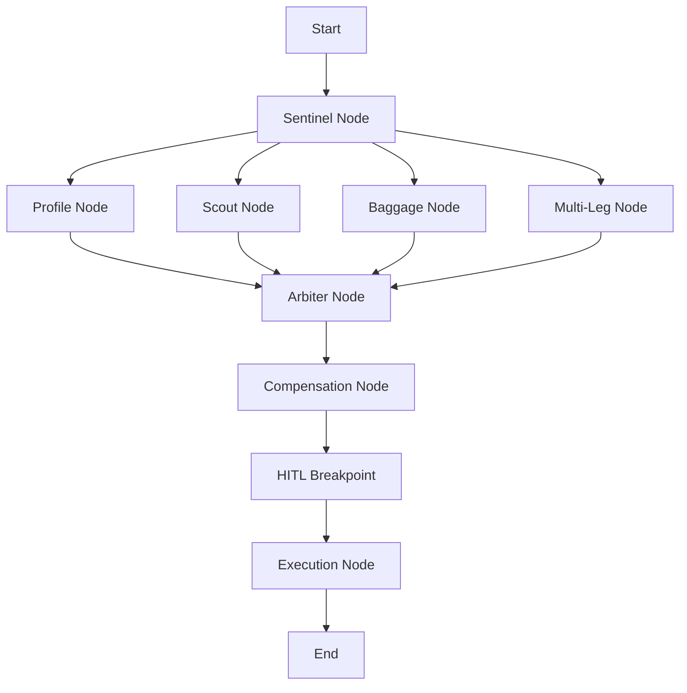
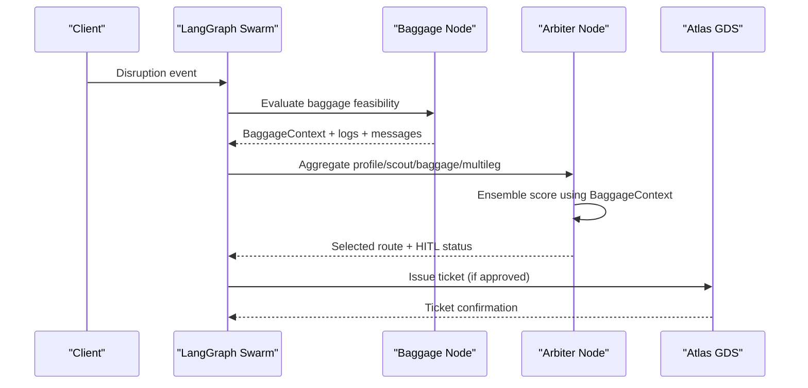
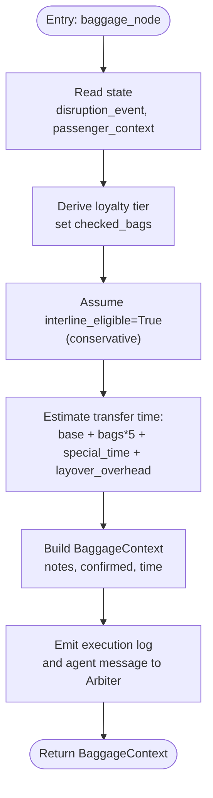
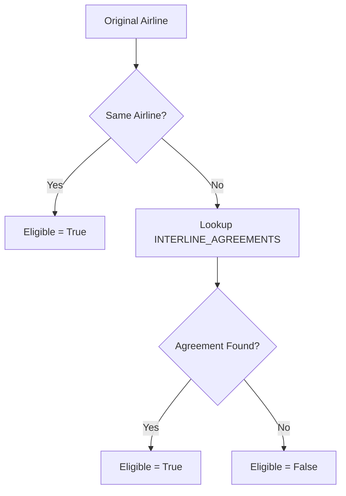
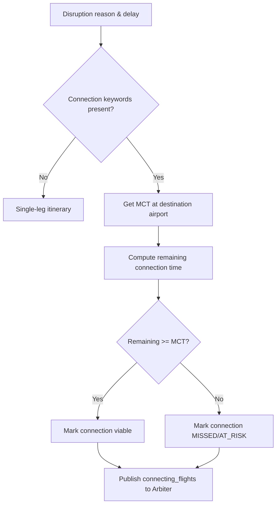
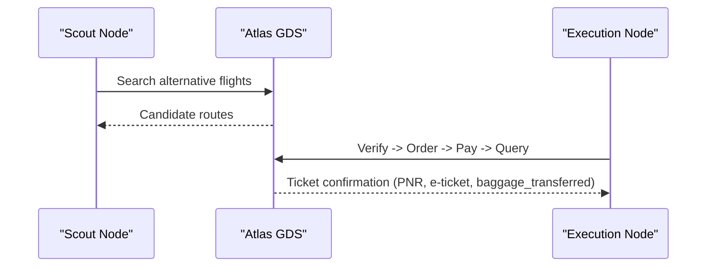
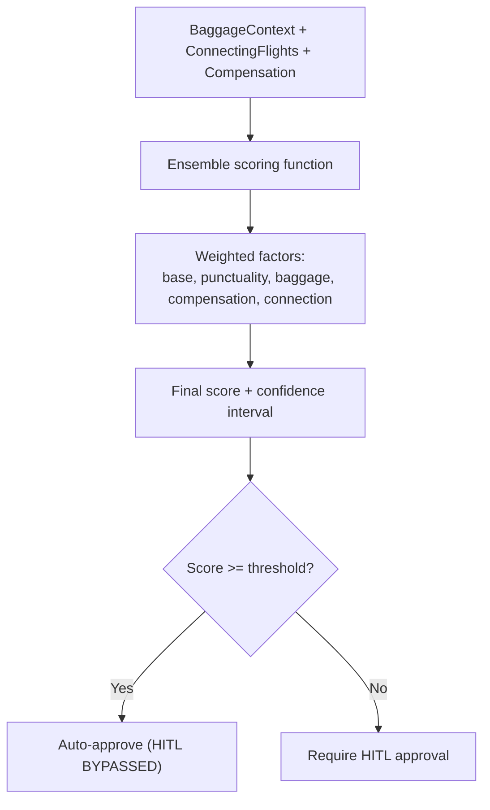
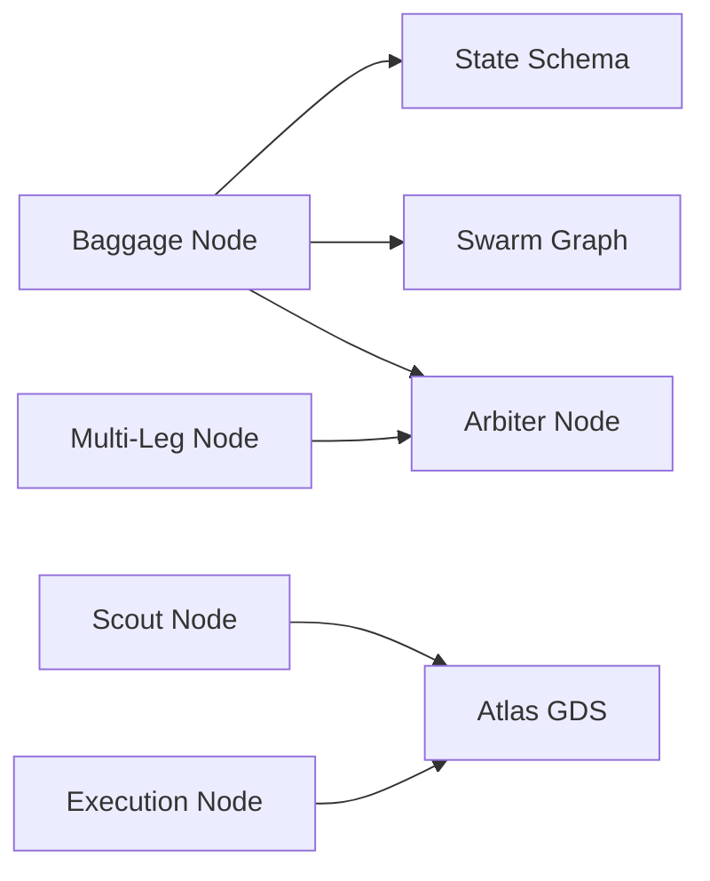

# Baggage Agent

<cite>
**Referenced Files in This Document**
- [baggage.py](file://travel-recovery-os/backend/agents/baggage.py)
- [state.py](file://travel-recovery-os/backend/state.py)
- [swarm.py](file://travel-recovery-os/backend/swarm.py)
- [arbiter.py](file://travel-recovery-os/backend/agents/arbiter.py)
- [multileg.py](file://travel-recovery-os/backend/agents/multileg.py)
- [scout.py](file://travel-recovery-os/backend/agents/scout.py)
- [atlas_client.py](file://travel-recovery-os/backend/tools/atlas_client.py)
- [api_models.py](file://travel-recovery-os/backend/schemas/api_models.py)
</cite>

## Table of Contents
1. [Introduction](#introduction)
2. [Project Structure](#project-structure)
3. [Core Components](#core-components)
4. [Architecture Overview](#architecture-overview)
5. [Detailed Component Analysis](#detailed-component-analysis)
6. [Dependency Analysis](#dependency-analysis)
7. [Performance Considerations](#performance-considerations)
8. [Troubleshooting Guide](#troubleshooting-guide)
9. [Conclusion](#conclusion)

## Introduction
This document explains the Baggage agent that evaluates checked baggage transfer feasibility, interline agreement validation, special item handling requirements, and connection viability for luggage transfers during flight disruption recovery. It also documents how the agent’s outputs influence route scoring and decision-making within the multi-agent swarm, including integration points with airline systems via the Atlas client.

## Project Structure
The Baggage agent is part of a LangGraph-based multi-agent workflow:
- Sentinel ingests disruptions (structured or raw text).
- Profile, Scout, Baggage, and MultiLeg run in parallel to enrich context.
- Arbiter aggregates inputs and scores candidate routes.
- Compensation calculates passenger rights.
- Execution issues tickets via Atlas GDS.



**Diagram sources**
- [swarm.py:162-227](file://travel-recovery-os/backend/swarm.py#L162-L227)

**Section sources**
- [swarm.py:1-232](file://travel-recovery-os/backend/swarm.py#L1-L232)

## Core Components
- Baggage agent: Evaluates baggage transfer feasibility, estimates transfer time, and determines interline eligibility based on original and new airlines. It classifies special items and assigns risk/time penalties.
- State schema: Defines BaggageContext and related structures used across agents.
- Arbiter: Uses BaggageContext to compute ensemble scores for route selection.
- MultiLeg: Assesses connection viability and feeds results into Arbiter.
- Atlas client: Integrates with airline/GDS systems for search and ticketing; includes fallback behavior.

Key responsibilities:
- Transfer feasibility: Determine if bags can be automatically transferred between carriers.
- Interline agreement validation: Check whether the original and new airlines have an interline baggage agreement.
- Special item handling: Account for extra time and risk for items like sports equipment, pets, fragile goods, musical instruments, and medical equipment.
- Connection viability: Estimate minimum connection times and flag risky transfers.

**Section sources**
- [baggage.py:1-152](file://travel-recovery-os/backend/agents/baggage.py#L1-L152)
- [state.py:81-89](file://travel-recovery-os/backend/state.py#L81-L89)
- [arbiter.py:22-31](file://travel-recovery-os/backend/agents/arbiter.py#L22-L31)
- [multileg.py:20-40](file://travel-recovery-os/backend/agents/multileg.py#L20-L40)
- [atlas_client.py:175-219](file://travel-recovery-os/backend/tools/atlas_client.py#L175-L219)

## Architecture Overview
The Baggage agent runs in parallel with other agents after Sentinel ingestion. Its output (BaggageContext) contributes to Arbiter’s ensemble scoring, which influences whether a route is auto-approved or requires human-in-the-loop approval.



**Diagram sources**
- [swarm.py:162-227](file://travel-recovery-os/backend/swarm.py#L162-L227)
- [baggage.py:76-152](file://travel-recovery-os/backend/agents/baggage.py#L76-L152)
- [arbiter.py:128-244](file://travel-recovery-os/backend/agents/arbiter.py#L128-L244)
- [atlas_client.py:334-357](file://travel-recovery-os/backend/tools/atlas_client.py#L334-L357)

## Detailed Component Analysis

### Baggage Agent: Transfer Feasibility and Interline Validation
- Inputs: Disruption event (airline), passenger context (loyalty tier).
- Logic:
  - Derives checked bag allowance from loyalty tier.
  - Assumes interline eligibility conservatively for parallel execution; actual new airline determined by Scout later.
  - Estimates transfer time based on base time, number of bags, special items, and layover overhead.
  - Produces BaggageContext with transfer notes and estimated time.
  - Emits telemetry logs and a notification message to Arbiter with transfer time and eligibility.



**Diagram sources**
- [baggage.py:76-152](file://travel-recovery-os/backend/agents/baggage.py#L76-L152)

**Section sources**
- [baggage.py:20-61](file://travel-recovery-os/backend/agents/baggage.py#L20-L61)
- [baggage.py:76-152](file://travel-recovery-os/backend/agents/baggage.py#L76-L152)

### Interline Agreement Validation Logic
- Same-airline rebooking is always eligible.
- For different airlines, checks against a known agreements table.
- If no agreement exists, interline eligibility is false, impacting Arbiter’s baggage feasibility score.



**Diagram sources**
- [baggage.py:20-44](file://travel-recovery-os/backend/agents/baggage.py#L20-L44)

**Section sources**
- [baggage.py:20-44](file://travel-recovery-os/backend/agents/baggage.py#L20-L44)

### Special Item Handling Requirements and Risk Assessment
- Special items include sports equipment, pets, fragile items, musical instruments, and medical equipment.
- Each item type has:
  - Extra transfer time penalty (minutes).
  - Risk rating (LOW, MEDIUM, HIGH).
- These values are summed into the transfer time estimate and inform downstream risk considerations.

```mermaid
classDiagram
class BaggageContext {
+int checked_bags
+string[] special_items
+bool interline_eligible
+bool baggage_transfer_confirmed
+string transfer_notes
+int estimated_transfer_time_minutes
}
class SPECIAL_ITEM_DIFFICULTY {
+sports_equipment : {extra_time_min, risk}
+pet : {extra_time_min, risk}
+fragile : {extra_time_min, risk}
+musical_instrument : {extra_time_min, risk}
+medical_equipment : {extra_time_min, risk}
}
BaggageContext --> SPECIAL_ITEM_DIFFICULTY : "uses for time/risk"
```

**Diagram sources**
- [baggage.py:30-37](file://travel-recovery-os/backend/agents/baggage.py#L30-L37)
- [state.py:81-89](file://travel-recovery-os/backend/state.py#L81-L89)

**Section sources**
- [baggage.py:30-61](file://travel-recovery-os/backend/agents/baggage.py#L30-L61)
- [state.py:81-89](file://travel-recovery-os/backend/state.py#L81-L89)

### Connection Viability for Luggage Transfers
- MultiLeg agent analyzes potential missed connections based on delay and airport-specific minimum connection times (MCT).
- Results feed into Arbiter’s connection_time factor, influencing final route scoring and HITL decisions.



**Diagram sources**
- [multileg.py:43-81](file://travel-recovery-os/backend/agents/multileg.py#L43-L81)
- [multileg.py:96-167](file://travel-recovery-os/backend/agents/multileg.py#L96-L167)

**Section sources**
- [multileg.py:20-40](file://travel-recovery-os/backend/agents/multileg.py#L20-L40)
- [multileg.py:43-81](file://travel-recovery-os/backend/agents/multileg.py#L43-L81)
- [multileg.py:96-167](file://travel-recovery-os/backend/agents/multileg.py#L96-L167)

### Integration with Airline Baggage Systems (Atlas)
- Scout queries Atlas for alternative flights; Atlas client implements live search with circuit breaker and fallback to high-fidelity sandbox simulation.
- Execution node issues tickets via Atlas verify/order/pay/query lifecycle; returns confirmation including baggage transfer flags.



**Diagram sources**
- [scout.py:32-87](file://travel-recovery-os/backend/agents/scout.py#L32-L87)
- [atlas_client.py:175-219](file://travel-recovery-os/backend/tools/atlas_client.py#L175-L219)
- [atlas_client.py:222-357](file://travel-recovery-os/backend/tools/atlas_client.py#L222-L357)

**Section sources**
- [scout.py:32-87](file://travel-recovery-os/backend/agents/scout.py#L32-L87)
- [atlas_client.py:175-219](file://travel-recovery-os/backend/tools/atlas_client.py#L175-L219)
- [atlas_client.py:222-357](file://travel-recovery-os/backend/tools/atlas_client.py#L222-L357)

### Route Scoring Impact of Baggage Context
- Arbiter computes ensemble scores incorporating:
  - Base score (from DeepSeek evaluation).
  - Punctuality rating.
  - Baggage feasibility (derived from BaggageContext transfer time and interline eligibility).
  - Compensation impact.
  - Connection time adequacy (from MultiLeg analysis).
- Final score influences auto-approval thresholds for high-tier passengers.



**Diagram sources**
- [arbiter.py:22-31](file://travel-recovery-os/backend/agents/arbiter.py#L22-L31)
- [arbiter.py:34-113](file://travel-recovery-os/backend/agents/arbiter.py#L34-L113)
- [arbiter.py:128-244](file://travel-recovery-os/backend/agents/arbiter.py#L128-L244)

**Section sources**
- [arbiter.py:22-31](file://travel-recovery-os/backend/agents/arbiter.py#L22-L31)
- [arbiter.py:34-113](file://travel-recovery-os/backend/agents/arbiter.py#L34-L113)
- [arbiter.py:128-244](file://travel-recovery-os/backend/agents/arbiter.py#L128-L244)

## Dependency Analysis
- Baggage depends on:
  - State definitions (BaggageContext, AgentMessage).
  - Swarm orchestration (registered as a node).
  - Arbiter consumes BaggageContext for scoring.
- MultiLeg provides connection viability data consumed by Arbiter.
- Atlas client integrates with external GDS for search and ticketing.



**Diagram sources**
- [baggage.py:76-152](file://travel-recovery-os/backend/agents/baggage.py#L76-L152)
- [state.py:81-89](file://travel-recovery-os/backend/state.py#L81-L89)
- [swarm.py:162-227](file://travel-recovery-os/backend/swarm.py#L162-L227)
- [multileg.py:96-167](file://travel-recovery-os/backend/agents/multileg.py#L96-L167)
- [scout.py:32-87](file://travel-recovery-os/backend/agents/scout.py#L32-L87)
- [atlas_client.py:175-219](file://travel-recovery-os/backend/tools/atlas_client.py#L175-L219)
- [atlas_client.py:334-357](file://travel-recovery-os/backend/tools/atlas_client.py#L334-L357)

**Section sources**
- [baggage.py:76-152](file://travel-recovery-os/backend/agents/baggage.py#L76-L152)
- [state.py:81-89](file://travel-recovery-os/backend/state.py#L81-L89)
- [swarm.py:162-227](file://travel-recovery-os/backend/swarm.py#L162-L227)
- [multileg.py:96-167](file://travel-recovery-os/backend/agents/multileg.py#L96-L167)
- [scout.py:32-87](file://travel-recovery-os/backend/agents/scout.py#L32-L87)
- [atlas_client.py:175-219](file://travel-recovery-os/backend/tools/atlas_client.py#L175-L219)
- [atlas_client.py:334-357](file://travel-recovery-os/backend/tools/atlas_client.py#L334-L357)

## Performance Considerations
- Parallel execution: Baggage runs concurrently with Profile, Scout, and MultiLeg to minimize latency.
- Transfer time estimation: Linear complexity O(n) over special items; negligible overhead.
- Interline lookup: Constant-time dictionary lookup.
- Atlas client resilience: Circuit breaker and retry with backoff reduce failure impact; caching avoids repeated searches.

[No sources needed since this section provides general guidance]

## Troubleshooting Guide
Common issues and mitigations:
- No interline agreement:
  - Symptom: interline_eligible = False; baggage feasibility score penalized.
  - Mitigation: Prefer same-airline rebooking when possible; adjust routing to carriers with agreements.
- High-risk special items:
  - Symptom: Elevated transfer time and risk; may trigger HITL.
  - Mitigation: Ensure sufficient connection time; consider direct flights or premium services.
- Missed connections:
  - Symptom: MultiLeg marks connections MISSED/AT_RISK; Arbiter lowers connection_time score.
  - Mitigation: Rebook to itineraries meeting MCT; prioritize direct routes.
- Atlas API failures:
  - Symptom: Live search/ticketing errors; fallback to sandbox simulation.
  - Mitigation: Retry with backoff; validate environment configuration; check circuit breaker status.

**Section sources**
- [baggage.py:20-61](file://travel-recovery-os/backend/agents/baggage.py#L20-L61)
- [multileg.py:43-81](file://travel-recovery-os/backend/agents/multileg.py#L43-L81)
- [atlas_client.py:175-219](file://travel-recovery-os/backend/tools/atlas_client.py#L175-L219)
- [atlas_client.py:222-357](file://travel-recovery-os/backend/tools/atlas_client.py#L222-L357)

## Conclusion
The Baggage agent provides essential feasibility analysis for checked baggage transfers during flight disruptions. It validates interline agreements, accounts for special item handling, and estimates transfer times. Its outputs integrate with Arbiter’s ensemble scoring to guide route selection and approval workflows. Combined with MultiLeg’s connection viability analysis and Atlas GDS integration, the system ensures robust, real-time travel recovery with clear constraints and risk assessments.

[No sources needed since this section summarizes without analyzing specific files]